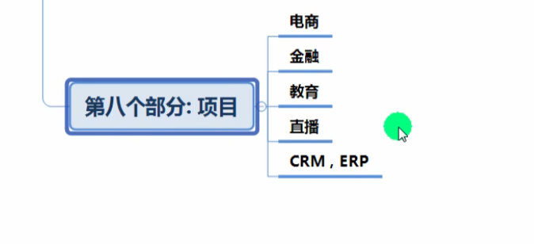
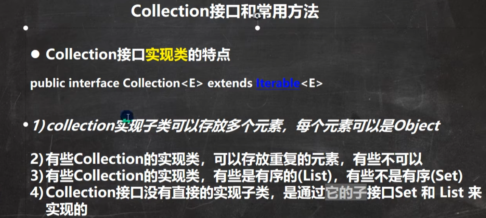
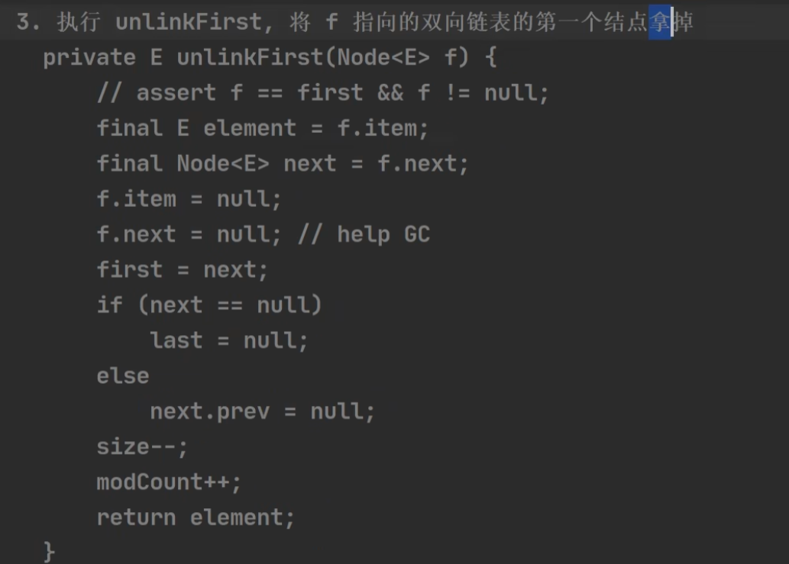
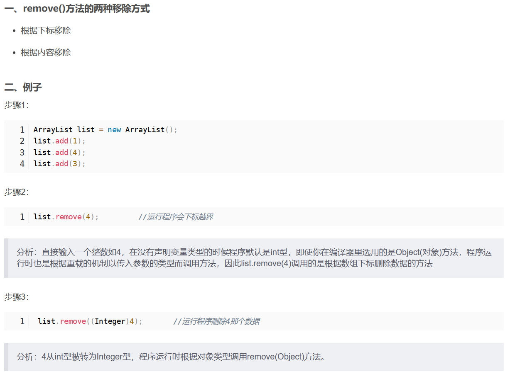
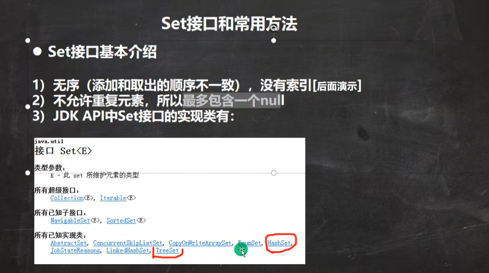
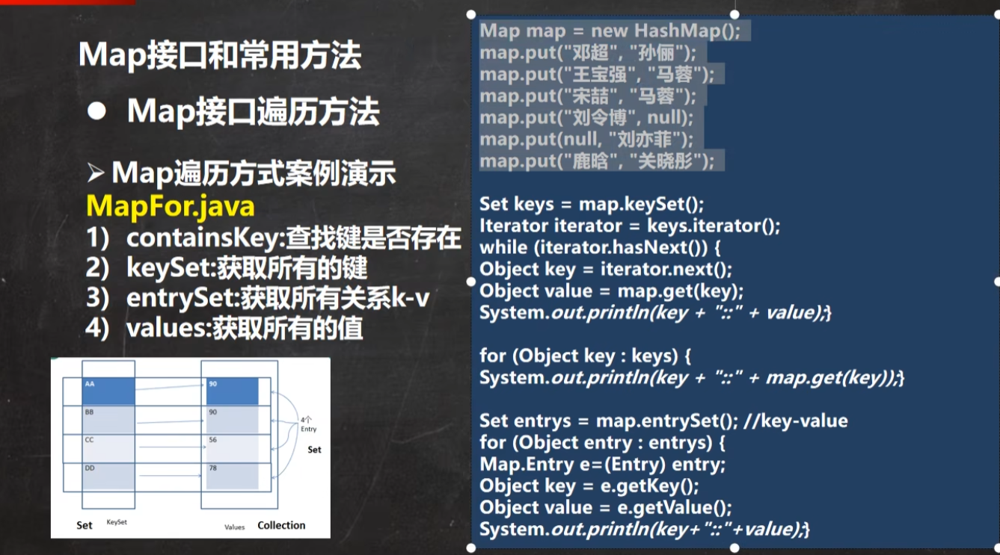

# Java后端技术体系

## Java基础


## Java高级


## JavaWEB


## 主流的框架和项目管理


## 分布式 微服务 并行架构


## 开发运维一体化（DevOps）


## 大数据技术


## 项目



## 大厂面试题

高级部分

主流框架部分

中间件


# 面经

## 打招呼

```xml
您好，本人2022年硕士计算机毕业，一年一个月Java开发经验，并且熟悉微服务项目开发，拥有扎实的数据库交互基础，具有一定的业务逻辑思维。工作期间，参与过生态仓项目，该项目使用了SSM+MQ等技术实现，为消费者提供了良好的使用体验；还负责日常需求迭代的开发及自测，可以按需完成任务。如果您感兴趣，可以随时回复我，一定不会让您失望。
```


## 双亲委派机制


## lock和synchronized的区别


## 锁的本质


**自旋锁**（轻量级锁：加锁之前进行重试）


## 重写`equals`的时候为什么要重写`hashcode`方法

> 结论

```xml

```


>  Object 的 equals 比较的是同一对象。


>  String重写equals后：


>  为什么还要重写`hashCode()`


**相等的对象必须具备相等的哈希码。**


>  分析: Object 类中的`hashCode`和`equals`约定如下


>  所以  String中重写 `hashCode` 满足了规定：
>
> `如果两个对象x.equals(y)方法返回true, 则这两个对象的hashCode必须相等。`


---


# 刷题

## 输入输出


## 快捷键

**Ctrl + j**


## IDEA设置

IDEA默认情况下，DEBUG显示的数据是简化后的，如果希望看到完整的数据，需要做如下设置：


# 集合

1 集合框架


2 集合图

2.1 单列集合


2.2 双列集合


## Collection




### **迭代器 Iterator**


**编译看左边，运行看右边**【编译是Object类型，运行是Collection类型】


**输出**：


### 增强for

既可以在集合中使用，也可以在数组中使用。

**其底层也是迭代器。**


**输出：**


## List

### 常用方法


指定位置插入：


输出：


`indexOf ` 


`lastIndexOf`

`remove`

`set` 


`set` 即 替换，效果如下图：


`subList`


返回子集合：[0, 2)


### `ArrayList` --> 1.5倍扩容 (10)

线程不安全的。


**transient 表示该属性不会被序列化**


**源码分析：**


**`modCount` 表示集合被修改的次数。**


最后一步：


### Vector --> 2倍扩容 (10)

比较：

### 

add: synchronized 线程安全的。


如果需要的数组大小不够用了，就进行扩容：

`capacityIncrement` 一般为0，除非你自己指定。

```
int newCapacity = oldCapacity + ((capacityIncrement > 0) ?
                                 capacityIncrement : oldCapacity);
```


### LinkedList

#### 双向链表


#### 双端队列


#### 底层结构

**`LinedList`即是双向链表也是双端队列。**

- 添加和删除方便
- 可以作为队列 （先进先出）


**自定义实现：**

1 内部类 Node：


2 模拟实现：


遍历：


#### 底层源码

1 add


`LinkedLast` 尾插： 将新结点加入到双向链表的最后。


效果：


2 remove() 实际上调用的是 `removeFirst()`




根据内容与下标删除：




3 set 修改

4 get 获取

5 遍历

>  实现了List接口，因此可以使用迭代器与for及增强for循环


## List集合选择 (非并发)

> 查改多 --> `ArrayList`
>
> 增删多 --> `LinkedList`
>
> 一般情况下，以查询为主，偏向 `ArrayList`


## Set 

**无序且不重复**




不能通过索引来获取值，但可以通过迭代器或增强for。


### HashSet --> 2倍扩容 (16)

HashSet底层是HashMap

**注：取出的顺序是无序的，但是是固定的。** 【因为顺序是通过Hash算法确定的。】


#### 案例

 案例一：


案列二：Dog没有重写`HashCode和toString` 。


#### 底层机制 --> HashMap --> 2倍扩容 (16)

>  HashSet的底层是HashMap，HashMap底层是（数组+链表+红黑树）。


模拟实现：


table[2] 为一个链表。


**结论：**


##### **add 过程：**

  

去key的`hashCode`的高16位。


该索引上为null时：


不为null时：【进入链表】

hash相等 且 （key相等或key内容相等）则不加入。


加入红黑树


依次判断是否加入：


**不加入**返回当前元素值：【`oldValue`】


**加入**成功，返回【null】


#### 树化条件

> 在Java8中，如果一条链表的元素个数达到 TREEIFY_THRESHOLD(默认是8)，并且table的大小 >= MIN_TREEIFY_CAPACITY(默认64)，就会进行树化(红黑树)，否则仍然采用数组扩容机制。【容量(阈值)：16(12)->32(24)->64(48)->128(96)】


模拟：当hashCode为一固定值时，就会往 `(n - 1) & hash` 


eg:  100 & (8-1) == 4；100 & (16-1) == 4；100 & (32-1) == 4；100 & (64-1) == 36；

扩容到64时，且链表长度大于8 --> 转换为红黑树


#### 扩容注意事项

```java
// length(threshold): 16(12)
if (++size > threshold)
      resize();
```

当size大于12时就进行扩容。若table[i]为链表时，size就统计当前table[i]的链表长度。


### LinkedHashSet

> 底层是 数组+双向链表


底层机制示意图

> 双向链表 让Set的加入看上去有序了


关键代码：

```java
/** 内部类
 * HashMap.Node subclass for normal LinkedHashMap entries.
 */
static class Entry<K,V> extends HashMap.Node<K,V> {
    Entry<K,V> before, after;
    Entry(int hash, K key, V value, Node<K,V> next) {
        super(hash, key, value, next);
    }
}

/**
 * The head (eldest) of the doubly linked list.
 */
transient LinkedHashMap.Entry<K,V> head;
/**
 * The tail (youngest) of the doubly linked list.
 */
transient LinkedHashMap.Entry<K,V> tail;
```


---

### TreeSet

> 底层是TreeMap


**解析：**


> **String 的 CompareTo 方法：**

- 负数【negative】：在参数之前 【this {@code String} object **precedes** the argument string】

- 正数【positive】：在参数之后 【this {@code String} object **follows** the argument string】
- 0 ：equals


---

## Map 

### 分析理解


 


>  k-v 放在 Node 中，`keySet --> k, values --> v, entrySet --> (k,v) ` 都是指向它的引用。

```java
static class Node<K,V> implements Map.Entry<K,V> {
        final int hash;
        final K key;
        V value;
        Node<K,V> next;

        Node(int hash, K key, V value, Node<K,V> next) {
            this.hash = hash;
            this.key = key;
            this.value = value;
            this.next = next;
        }
 ...
 transient Set<K>        keySet;
 transient Collection<V> values;
 public abstract Set<Entry<K,V>> entrySet();
```


`entrySet`


`keySet` and `values`


### 常用方法

> 增 put
>
> 删 remove
>
> 查 get
>
> 改 put


### Map的遍历

> - `keySet` : 增强for 或 迭代器
> - `values` : 所有Collections的使用遍历方法



`keySet`


`values`


`entrySet`


 

### HashMap小结 --> 2倍扩容 (16)


### HashMap底层机制及源码剖析


### HashTable --> 2N+1 扩容  (11)

> k 和 v 都不能为null, 线程安全。


### Properties

> 是 Hashtable 的子类
>
> k 和 v 都不能为null, 线程安全。


 

### TreeMap 

> 无参构造：默认是按照key的字典顺序，排序有序。
>
> 存取无序：指 插入和取出顺序不一致


自定义比较方法：按照长度排序，逆序


自定义比较时的关键代码：

```java
int cmp;
Entry<K,V> parent;
// split comparator and comparable paths
Comparator<? super K> cpr = comparator;
if (cpr != null) {
    do {
        parent = t;
        cmp = cpr.compare(key, t.key);
        if (cmp < 0)
            t = t.left;
        else if (cmp > 0)
            t = t.right;
        else
            return t.setValue(value);
    } while (t != null);
}
```

> ` treeMap.put ()`

第一次进来：


第二次进来：【比较取决于 `comparator.compare()` 方法】


测试：按照长度进行排序


输出：虽然加入不了，但是value会被替换掉：(tom, 汤姆) -> (tom, 韩顺平)。


## 集合选择

> - 单列 Collection
>   - 允许重复：List
>     - LinkedList: 增删多 【双向链表】
>     - ArrayList: 查改多
>   - 不允许重复：Set
>     - HashSet：无序 【指输入和取出顺序不一致】
>     - TreeSet：**排序**
>     - LinkedHashSet：插入与取出顺序一致 【双向链表】
> - 双列 Map
>   - HashMap：【Key 】无序
>   - TreeMap：【Key】**排序**
>   - LinkedHashMap：【Key】插入和取出顺序一致 【双向链表】
>   - Properties：读取文件


## Collections工具类


其他：

- max
- min
- `frequency(Collection<?> c, Object o) `
- `copy(List<? super T> dest, List<? extends T> src)`
- `replaceAll(List<T> list, T oldVal, T newVal)`


---

## 多线程

程序： 为了完成特定任务、用某种语言编写的一组指令的集合。

进程：指运行中的程序，即程序的一次执行过程。

线程：由进程创建的，是进程的一个实体。 

单线程：同一时刻，只允许执行一个线程。

多线程：同一时刻，可以执行多个线程。

**并发：同一时刻，多个任务交替执行。**【单核CPU实现的多任务就是并发】

并行：同一时刻，多个任务同时进行。【多核CPU同时进行】


### 开启线程

1. 实现 Runnable 接口 `myThread implements Runnable`
2. new Thread(Runnable target, String name).start();

```java
@SuppressWarnings("all")
public class myThread implements Runnable{

    private volatile static int ticketNum = 10;

    private boolean flag = true;

    private synchronized void buy() throws InterruptedException {
        if (ticketNum < 1) {
            flag = false;
            return;
        }
        Thread.sleep(100);
        System.out.println(Thread.currentThread().getName() + "拿到了第" + ticketNum-- + "张票!");
    }

    @Override
    public void run() {
        while (flag) {
            try {
                buy();
            } catch (InterruptedException e) {
                e.printStackTrace();
            }

        }
    }
}


public class Main {
    public static void main(String[] args) {
        myThread thread = new myThread();

        new Thread(thread, "小明").start();
        new Thread(thread, "老师").start();
        new Thread(thread, "黄牛党").start();
    }
}
```

3. 也可以用 lambda 代替Runnable 

```java
new Thread(()->{
    //todo...
}).start();

()->{...} 即是thread【实现了Runnable 的myThread】
```


### 线程池

> ThreadPoolExecutor

```java
@SuppressWarnings("all")
public class Main {
    private static final int CORE_POOL_SIZE = 5;
    private static final int MAX_POOL_SIZE = 10;
    private static final int QUEUE_CAPACITY = 100;
    private static final Long KEEP_ALIVE_TIME = 1L;

    public static void main(String[] args) throws InterruptedException {
        myThread thread = new myThread();

        // 单个线程
//        new Thread(thread, "小明").start();
//        new Thread(thread, "老师").start();
//        new Thread(thread, "黄牛党").start();

        // 线程池方式
        ThreadPoolExecutor executor = new ThreadPoolExecutor(
                // 核心线程数为 5
                CORE_POOL_SIZE,
                // 最大线程数 10
                MAX_POOL_SIZE,
                // 大于核心线程数时,核心线程外的线程等待时间: 1L
                KEEP_ALIVE_TIME,
                // 等待时间的单位为 TimeUnit.SECONDS
                TimeUnit.SECONDS,
                // 任务队列
                new ArrayBlockingQueue<>(QUEUE_CAPACITY),
                // 饱和策略
                new ThreadPoolExecutor.CallerRunsPolicy());
        // 执行
        for (int i = 0; i < 10; i++) {
            executor.execute(thread);
        }
        // 终止
        executor.shutdown();
        while (!executor.isTerminated()) {
            // 线程等待
        }
        System.out.println("All threads is finished.");
    }
}
```


