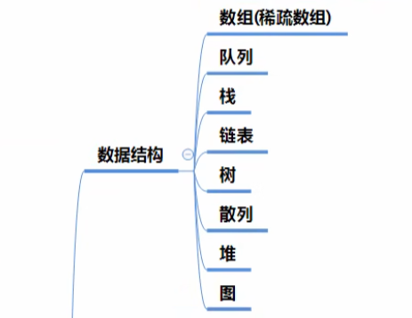
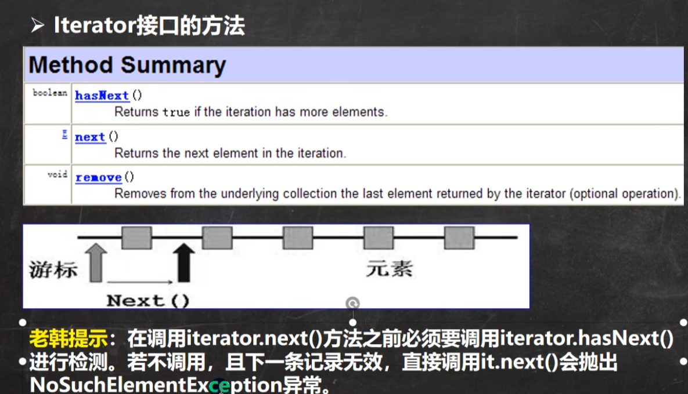
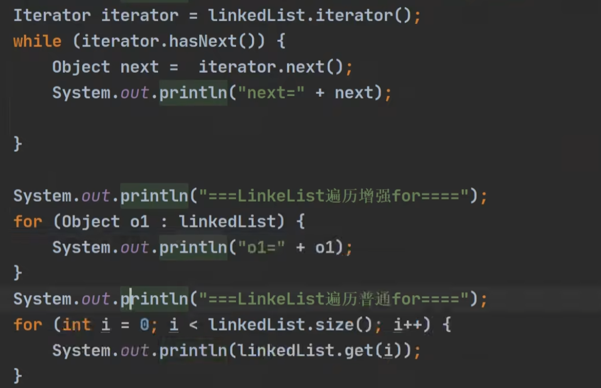
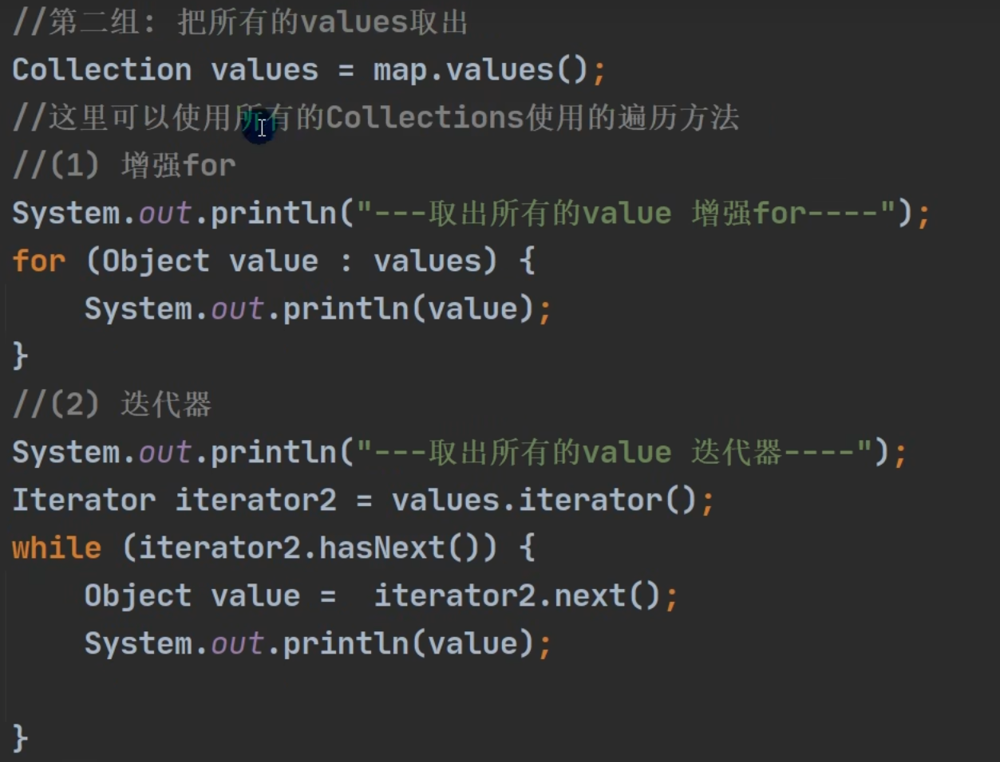
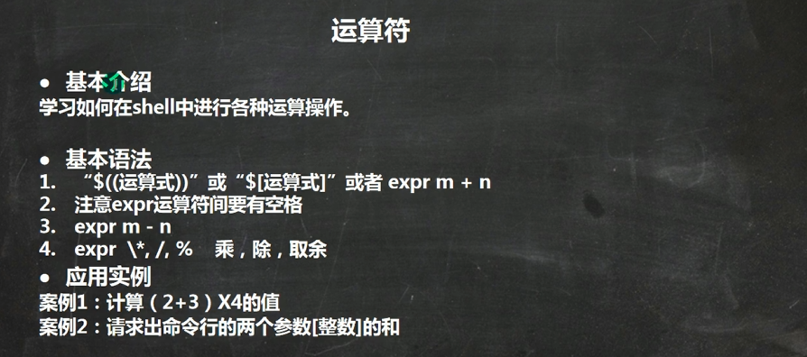
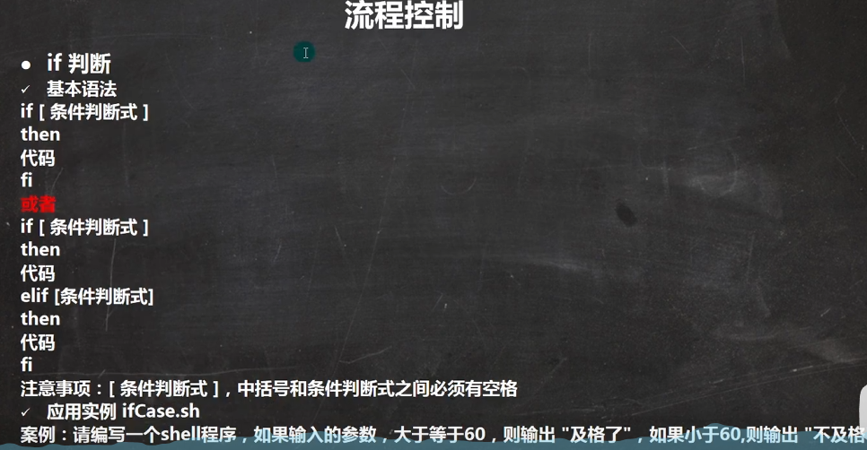

# Java后端技术体系

## Java基础


## Java高级





## JavaWEB


## 主流的框架和项目管理


## 分布式 微服务 并行架构


## 开发运维一体化（DevOps）


## 大数据技术


## 项目


## 大厂面试题

高级部分

主流框架部分

中间件


## 其他方向

### GIS工程师

> WebGL

 


#### WebGL


#### 

##### demo

```javascript
<!DOCTYPE html>
<html lang="en">
<head>
    <meta charset="UTF-8">
    <title>Title</title>
</head>
<body>
    <canvas id="canvas" width="400" height="400">
        此浏览器不支持canvas
    </canvas>
</body>
</html>

<script>
    const ctx = document.getElementById('canvas');

    const gl = ctx.getContext('webgl');
    
    gl.clearColor(1.0, 0.0, 0.0, 1.0); // red

    gl.clear(gl.COLOR_BUFFER_BIT);
</script>
```

##### 绘制一个点

**point.html**:

```html
<!DOCTYPE html>
<html lang="en">
<head>
    <meta charset="UTF-8">
    <title>vertex</title>
    <script src="../lib/pointe.js"></script>
</head>
<body>
    <canvas id="canvas" width="400" height="400">
        此浏览器不支持canvas
    </canvas>
</body>
</html>

<script>
    const ctx = document.getElementById('canvas');

    const gl = ctx.getContext('webgl');

    // 着色器
    // 创建着色器源码
    const VERTEX_SHADER_SOURCE = `
        // 必须要存在 main 函数
        void main() {
            // 要绘制的点的坐标
            gl_Position = vec4(0.0, 0.0, 0.0, 1.0);
            // 点的大小
            gl_PointSize = 30.0;
        }
    `; //顶点着色器

    // gl_Position = vec4(0.0, 0.0, 0.0, 1.0) : x,y,z, w其次坐标 (x/w, y/w, z,w)
    // gl_FragColor = vec4(1.0, 0.0, 0.0, 1.0) : r,g,b,a
    const FRAGMENT_SHADER_SOURCE = `
    void main() {
        //
        gl_FragColor = vec4(1.0, 0.0, 0.0, 1.0);
    }
    `; //片元着色器

    // 创建着色器
    // const vertexShader = gl.createShader(gl.VERTEX_SHADER);
    // const framentShader = gl.createShader(gl.FRAGMENT_SHADER);
    //
    // // 指定着色器
    // gl.shaderSource(vertexShader, VERTEX_SHADER_SOURCE);
    // gl.shaderSource(framentShader, FRAGMENT_SHADER_SOURCE);
    //
    // // 编译着色器
    // gl.compileShader(vertexShader);
    // gl.compileShader(framentShader);
    //
    // // 创建一个程序对象
    // const program = gl.createProgram();
    //
    // gl.attachShader(program, vertexShader);
    // gl.attachShader(program, framentShader);
    //
    // gl.linkProgram(program);
    // gl.useProgram(program);
    const program = initShader(gl, VERTEX_SHADER_SOURCE, FRAGMENT_SHADER_SOURCE);

    // 执行绘制

    // 要绘制的图型，从哪个开始，使用几个顶点
    gl.drawArrays(gl.POINTS, 0, 1);

    // 3个顶点 【示例】
    // 0.0 0.0 0.0 绘制成一个点
    // gl.drawArrays(gl.POINTS, 0, 1);
    // 0.2 0.0 0.0
    // 0.4 0.0 0.0 绘制成一个线段
    // gl.drawArrays(gl.LINES, 1, 2);

</script>
```

**point.js**

```javascript
function initShader(gl, VERTEX_SHADER_SOURCE, FRAGMENT_SHADER_SOURCE) {
    // 创建着色器
    const vertexShader = gl.createShader(gl.VERTEX_SHADER);
    const framentShader = gl.createShader(gl.FRAGMENT_SHADER);

    // 指定着色器
    gl.shaderSource(vertexShader, VERTEX_SHADER_SOURCE);
    gl.shaderSource(framentShader, FRAGMENT_SHADER_SOURCE);

    // 编译着色器
    gl.compileShader(vertexShader);
    gl.compileShader(framentShader);

    // 创建一个程序对象
    const program = gl.createProgram();

    gl.attachShader(program, vertexShader);
    gl.attachShader(program, framentShader);

    gl.linkProgram(program);
    gl.useProgram(program);

    return program;
}
```


##### 坐标系


```html
<!DOCTYPE html>
<html lang="en">
<head>
    <meta charset="UTF-8">
    <title>Title</title>
</head>
<body>
    <canvas id="canvas" width="400" height="400">
        此浏览器不支持canvas
    </canvas>
</body>
</html>

<script>
    const ctx = document.getElementById('canvas');

    const c = ctx.getContext('2d');

    c.fillStyle = 'red';

    c.fillRect(10, 10, 100, 100);
</script>
```


见 `point.html`

**右手坐标系** 【指向屏幕外面】| 左手坐标系 【指向视线方向，即人看的方向】


```html
<!DOCTYPE html>
<html lang="en">
<head>
    <meta charset="UTF-8">
    <title>gl</title>
    <script src="../lib/point.js"></script>
    <style>
        * {
            margin: 0;
            padding: 0;
        }
        #canvas{
            background: gray;
        }
        body::after{
            content: ' ';
            display: block;
            width: 1px;
            height: 400px;
            background: red;
            position: absolute;
            top: 0;
            left: 200px;
        }
        body::before{
            content: ' ';
            display: block;
            width: 400px;
            height: 1px;
            background: black;
            position: absolute;
            top: 200px;
            left: 0;
        }
    </style>
</head>
<body>
    <canvas id="canvas" width="400" height="400">
        此浏览器不支持canvas
    </canvas>
</body>
</html>

<script>
    const ctx = document.getElementById('canvas');
    const gl = ctx.getContext('webgl');

    // 着色器
    // 创建着色器源码
    const VERTEX_SHADER_SOURCE = `
        // 必须要存在 main 函数
        void main() {
            // 要绘制的点的坐标
            gl_Position = vec4(0.0, 0.0, 0.0, 1.0);
            // 点的大小
            gl_PointSize = 30.0;
        }
    `; //顶点着色器

    // gl_Position = vec4(0.0, 0.0, 0.0, 1.0) : x,y,z, w其次坐标 (x/w, y/w, z,w)
    // gl_FragColor = vec4(1.0, 0.0, 0.0, 1.0) : r,g,b,a
    const FRAGMENT_SHADER_SOURCE = `
    void main() {
        //
        gl_FragColor = vec4(1.0, 0.0, 0.0, 1.0);
    }
    `; //片元着色器

    // 创建着色器
    // const vertexShader = gl.createShader(gl.VERTEX_SHADER);
    // const framentShader = gl.createShader(gl.FRAGMENT_SHADER);
    //
    // // 指定着色器
    // gl.shaderSource(vertexShader, VERTEX_SHADER_SOURCE);
    // gl.shaderSource(framentShader, FRAGMENT_SHADER_SOURCE);
    //
    // // 编译着色器
    // gl.compileShader(vertexShader);
    // gl.compileShader(framentShader);
    //
    // // 创建一个程序对象
    // const program = gl.createProgram();
    //
    // gl.attachShader(program, vertexShader);
    // gl.attachShader(program, framentShader);
    //
    // gl.linkProgram(program);
    // gl.useProgram(program);
    initShader(gl, VERTEX_SHADER_SOURCE, FRAGMENT_SHADER_SOURCE);

    // 执行绘制
    // 要绘制的图型，从哪个开始，使用几个顶点
    gl.drawArrays(gl.POINTS, 0, 1);


</script>
```


##### attribute


**绘制一个水平移动的点：**

```html
<!DOCTYPE html>
<html lang="en">
<head>
    <meta charset="UTF-8">
    <title>attribute</title>
    <script src="../lib/point.js"></script>
</head>
<body>
<canvas id="canvas" width="400" height="400">
    此浏览器不支持canvas
</canvas>
</body>
</html>

<script>
    const ctx = document.getElementById('canvas');
    const gl = ctx.getContext('webgl');

    // 着色器
    // 创建着色器源码
    const VERTEX_SHADER_SOURCE = `
        // 只传递顶点数据
        attribute vec4 aPosition; // 默认值：vec4(0.0, 0.0, 0.0, 1.0)
        void main() {
            // 要绘制的点的坐标
            gl_Position = aPosition;
            // 点的大小
            gl_PointSize = 30.0;
        }
    `; //顶点着色器

    const FRAGMENT_SHADER_SOURCE = `
    void main() {
        //
        gl_FragColor = vec4(1.0, 0.0, 0.0, 1.0);
    }
    `; //片元着色器
    
    const program = initShader(gl, VERTEX_SHADER_SOURCE, FRAGMENT_SHADER_SOURCE);
    const aPosition = gl.getAttribLocation(program, 'aPosition');

    // 定义变量
    let x = 0;
    setInterval(()=>{
        x += 0.1;
        if (x > 1.0) {
            x = 0;
        }

        gl.vertexAttrib1f(aPosition, x);
        gl.drawArrays(gl.POINTS, 0, 1);
    }, 200);

</script>
```

通过鼠标绘制：

代码：

```html
<!DOCTYPE html>
<html lang="en">
<head>
    <meta charset="UTF-8">
    <title>cursor</title>
    <script src="../lib/point.js"></script>
    <style>
        * {
            margin: 0;
            padding: 0;
        }

        canvas{
            margin: 50px auto 0;
            display: block;
            width: 400px;
            background: yellow;
        }
    </style>
</head>
<body>
    <canvas id="canvas" width="400" height="400">
        此浏览器不支持canvas
    </canvas>
</body>
</html>

<script>
    const ctx = document.getElementById('canvas');
    const gl = ctx.getContext('webgl');

    // 着色器
    // 创建着色器源码
    const VERTEX_SHADER_SOURCE = `
        // 只传递顶点数据
        attribute vec4 aPosition;
        void main() {
            // 要绘制的点的坐标
            gl_Position = aPosition;
            // 点的大小
            gl_PointSize = 10.0;
        }
    `; //顶点着色器

    const FRAGMENT_SHADER_SOURCE = `
    void main() {
        //
        gl_FragColor = vec4(1.0, 0.0, 0.0, 1.0);
    }
    `; //片元着色器

    const program = initShader(gl, VERTEX_SHADER_SOURCE, FRAGMENT_SHADER_SOURCE);
    const aPosition = gl.getAttribLocation(program, 'aPosition');


    points = []
    // onclick 其他：onmousemove
    ctx.onclick = function (ev) {
        // 获取点击坐标
        const x = ev.clientX;
        const y = ev.clientY;

        // ctx.offsetTop == y
        // ctx.offsetLeft == x
        const domPosition = ev.target.getBoundingClientRect();
        // console.log(domPosition, ctx.offsetTop, ctx.offsetLeft);

        // 转换为canvas的坐标
        const domX = x - domPosition.left;
        const domY = y - domPosition.top;

        // 转换为webgl坐标
        const halfWidth = ctx.offsetWidth / 2;
        const halfHeight = ctx.offsetHeight / 2;
        // 0 200 400 -> -1 0 1
        const clickX = (domX - halfWidth) / halfWidth;
        // 0 200 400 -> 1 0 -1
        const clickY = (halfHeight - domY) / halfHeight;
        // console.log(domPosition, clickX, clickY);

        points.push({
            clickX, clickY
        })

        for (let i = 0; i < points.length; i++) {
            gl.vertexAttrib2f(aPosition, points[i].clickX, points[i].clickY);
            gl.drawArrays(gl.POINTS, 0, 1);
        }

    }

</script>
```

##### uniform

**绘制不同颜色的点：**

```html
<!DOCTYPE html>
<html lang="en">
<head>
    <meta charset="UTF-8">
    <title>uniform</title>
    <script src="../lib/index.js"></script>
    <style>
        * {
            margin: 0;
            padding: 0;
        }

        canvas{
            margin: 50px auto 0;
            display: block;
            width: 400px;
            background: yellow;
        }
    </style>
</head>
<body>
<canvas id="canvas" width="400" height="400">
    此浏览器不支持canvas
</canvas>
</body>
</html>

<script>
    const ctx = document.getElementById('canvas');
    const gl = ctx.getContext('webgl');

    // 创建着色器源码
    const VERTEX_SHADER_SOURCE = `
        attribute vec4 aPosition;
        void main() {
            // 要绘制的点的坐标
            gl_Position = aPosition;
            // 点的大小
            gl_PointSize = 10.0;
        }
    `; //顶点着色器
    const FRAGMENT_SHADER_SOURCE = `
    precision mediump float; //中精度
    // uniform vec4 uColor;
    uniform vec2 uColor;
    void main() {
        // gl_FragColor = uColor;
        gl_FragColor = vec4(uColor.r, uColor.g, 0.0, 1.0);
    }
    `; //片元着色器

    const program = initShader(gl, VERTEX_SHADER_SOURCE, FRAGMENT_SHADER_SOURCE);
    const aPosition = gl.getAttribLocation(program, 'aPosition');
    const uColor = gl.getUniformLocation(program, 'uColor');

    points = []
    // onclick 其他：onmousemove
    ctx.onclick = function (ev) {
        // 获取点击坐标
        const x = ev.clientX;
        const y = ev.clientY;

        const domPosition = ev.target.getBoundingClientRect();
        // 转换为canvas的坐标
        const domX = x - domPosition.left;
        const domY = y - domPosition.top;

        // 转换为webgl坐标
        const halfWidth = ctx.offsetWidth / 2;
        const halfHeight = ctx.offsetHeight / 2;
        // 0 200 400 -> -1 0 1
        const clickX = (domX - halfWidth) / halfWidth;
        // 0 200 400 -> 1 0 -1
        const clickY = (halfHeight - domY) / halfHeight;

        points.push({
            clickX, clickY
        })

        for (let i = 0; i < points.length; i++) {
            gl.vertexAttrib2f(aPosition, points[i].clickX, points[i].clickY);
            gl.uniform2f(uColor, points[i].clickX, points[i].clickY);
            gl.drawArrays(gl.POINTS, 0, 1);
        }

    }

</script>
```


##### 实战贪吃蛇

```html
<!DOCTYPE html>
<html lang="en">
<head>
    <meta charset="UTF-8">
    <title>snake</title>
    <script src="../lib/index.js"></script>
    <style>
        * {
            margin: 0;
            padding: 0;
        }

        canvas{
            margin: 50px auto 0;
            display: block;
            width: 400px;
            background: yellow;
        }
    </style>
</head>
<body>
<canvas id="canvas" width="400" height="400">
    此浏览器不支持canvas
</canvas>
</body>
</html>

<script>
    const ctx = document.getElementById('canvas');
    const gl = ctx.getContext('webgl');

    // 创建着色器源码
    const VERTEX_SHADER_SOURCE = `
        attribute vec4 aPosition;
        void main() {
            gl_Position = aPosition;
            gl_PointSize = 15.0;
        }
    `; //顶点着色器
    const FRAGMENT_SHADER_SOURCE = `
    void main() {
        gl_FragColor = vec4(1.0, 0.0, 0.0, 1.0);
    }
    `; //片元着色器

    const program = initShader(gl, VERTEX_SHADER_SOURCE, FRAGMENT_SHADER_SOURCE);
    const aPosition = gl.getAttribLocation(program, 'aPosition');

    // 蛇身的长度
    let points = [
        // 对象
        {x: 0, y: 0},
    ]

    // 食物的坐标
    const random = {
        isConnect: true
    }

    // 移动速度
    let originSpeed = 0.02;

    // 行动速度
    let speed = originSpeed;

    // 移动方向
    let direction = 'x'

    // 允许吃掉食物的误差范围
    let base = 1.5;

    function createRandom() {
        if (random.isConnect) {
            // Math.random() : [0, 1)
            // * 2 - 1 -> [0, 2) - 1 -> [-1, 1)
            random.x = Math.random() * 2 - 1;
            random.y = Math.random() * 2 - 1;

            random.isConnect = false;
        }

    }

    document.onkeydown = (event) => {
        switch (event.keyCode) {
            case 37: //left
                direction = 'x';
                speed = -originSpeed;
                break;
            case 38: //top
                direction = 'y';
                speed = originSpeed;
                break;
            case 39: //right
                direction = 'x';
                speed = originSpeed;
                break;
            case 40: //bottom
                direction = 'y';
                speed = -originSpeed;
                break;
        }
    }

    function draw() {
        // 绘制食物
        gl.vertexAttrib3f(aPosition, random.x, random.y, 0.0);
        gl.drawArrays(gl.POINTS, 0, 1);

        // 贪吃蛇移动
        let preX = 0;
        let preY = 0;
        for (let i = 0; i < points.length; i++) {
            if (i === 0) {
                preX = points[0].x;
                preY = points[0].y;
                points[0][direction] += speed;
            } else {
                let {x, y} = points[i];
                points[i].x = preX;
                points[i].y = preY;
                preX = x;
                preY = y;
            }
            gl.vertexAttrib3f(aPosition, points[i].x, points[i].y, 0.0);
            gl.drawArrays(gl.POINTS, 0, 1);
        }
    }

    let timer = null;
    function start() {
        timer = setInterval(() => {
            // 边界判断
            if (
                points[0].x > 1.0
                || points[0].x < -1.0
                || points[0].y > 1.0
                || points[0].y < -1.0)
            {
                alert('游戏结束');
                restart();
            }

            // 吃掉食物 【碰撞检测】
            if (
                points[0].x > random.x - base * originSpeed // 左侧边界
                && points[0].x < random.x + base * originSpeed // 右侧边界
                && points[0].y > random.y - base * originSpeed // 上侧边界
                && points[0].y < random.y + base * originSpeed) // 下侧边界
            {
                points.push({ x: random.x, y: random.y });
                random.isConnect = true;
            }

            // 创建食物
            createRandom();
            // 绘制
            draw();
        }, 100)
    }
    start();

    function restart() {
        clearInterval(timer);
        points = [
            {x: 0, y: 0}
        ]
        direction = 'x';
        speed = originSpeed;
        start();
    }

</script>
```

##### 使用缓冲区绘制多个点

```javascript
<!DOCTYPE html>
<html lang="en">
<head>
    <meta charset="UTF-8">
    <title>multiVertex</title>
    <style>
        * {
            margin: 0;
            padding: 0;
        }

        canvas{
            margin: 50px auto 0;
            display: block;
            width: 400px;
            background: yellow;
        }
    </style>
    <script src="../lib/index.js"></script>
</head>
<body>
<canvas id="canvas" width="400" height="400">
    此浏览器不支持canvas
</canvas>
</body>
</html>

<script>
    const ctx = document.getElementById('canvas');
    const gl = ctx.getContext('webgl');

    // 创建着色器源码
    const VERTEX_SHADER_SOURCE = `
        attribute vec4 aPosition;
        attribute float aPointSize;
        void main() {
            gl_Position = aPosition;
            gl_PointSize = aPointSize;
        }
    `; //顶点着色器
    const FRAGMENT_SHADER_SOURCE = `
    void main() {
        gl_FragColor = vec4(1.0, 0.0, 0.0, 1.0);
    }
    `; //片元着色器

    const program = initShader(gl, VERTEX_SHADER_SOURCE, FRAGMENT_SHADER_SOURCE);

    const aPosition = gl.getAttribLocation(program, 'aPosition');
    const aPointSize = gl.getAttribLocation(program, 'aPointSize');

    // 方式一：
    // const points = new Float32Array([
    //     -0.5, -0.5,
    //     0.5, -0.5,
    //     0.0, 0.5,
    // ])
    // const pointBuffer = gl.createBuffer();
    // // 顶点数据 缓冲区
    // gl.bindBuffer(gl.ARRAY_BUFFER, pointBuffer);
    // // 顶点数据 顶点类型化数组 写入一次，绘制多次
    // gl.bufferData(gl.ARRAY_BUFFER, points, gl.STATIC_DRAW);
    // // gl.vertexAttrib2f(aPosition, 0.0, 0.0)
    // gl.vertexAttribPointer(aPosition, 2, gl.FLOAT, false, 0, 0);
    // gl.enableVertexAttribArray(aPosition);
    //
    // const size = new Float32Array([
    //     10.0,
    //     20.0,
    //     30.0,
    // ])
    // const sizeBuffer = gl.createBuffer();
    // gl.bindBuffer(gl.ARRAY_BUFFER, sizeBuffer);
    // gl.bufferData(gl.ARRAY_BUFFER, size, gl.STATIC_DRAW);
    // gl.vertexAttribPointer(aPointSize, 1, gl.FLOAT, false, 0, 0);
    // gl.enableVertexAttribArray(aPointSize);
    //
    // // 绘图
    // gl.drawArrays(gl.POINTS, 0, 3);

    // 方式二：
    const points = new Float32Array([
        -0.5, -0.5, 10.0,
        0.5, -0.5, 20.0,
        0.0, 0.5, 30.0,
    ])
    const buffer = gl.createBuffer();
    // 顶点数据 缓冲区
    gl.bindBuffer(gl.ARRAY_BUFFER, buffer);
    // 顶点数据 顶点类型化数组 写入一次，绘制多次
    gl.bufferData(gl.ARRAY_BUFFER, points, gl.STATIC_DRAW);

    const BYTES = points.BYTES_PER_ELEMENT;

    gl.vertexAttribPointer(aPosition, 2, gl.FLOAT, false, BYTES * 3, 0);
    gl.enableVertexAttribArray(aPosition);

    gl.vertexAttribPointer(aPointSize, 1, gl.FLOAT, false, BYTES * 3, BYTES * 2);
    gl.enableVertexAttribArray(aPointSize);

    // 绘图
    gl.drawArrays(gl.POINTS, 0, 3);

</script>
```

##### 多种图形绘制


---


### three.js


---


### 智慧城市案例


---


# 面经

> - [Java-learning: Java相关知识总结，包括Java基础、MySQL、Springboot、MyBatis、Redis、RabbitMQ等等，面试必备！ (gitee.com)](https://gitee.com/tysondai/Java-learning)
> - [JavaGuide（Java学习&面试指南） | JavaGuide(Java面试 + 学习指南)](https://javaguide.cn/home.html#java)
> - ...

## 基础

###  Java 中的几种基本数据类型了解么？

Java 中有 8 种基本数据类型，分别为：

- 6 种数字类型： 
  - 4 种整数型：`byte`、`short`、`int`、`long`
  - 2 种浮点型：`float`、`double`
- 1 种字符类型：`char`
- 1 种布尔型：`boolean`。

---

### String、StringBuffer、StringBuilder 的区别？

**可变性**

`String` 是**不可变**的（后面会详细分析原因）。

`StringBuilder` 与 `StringBuffer` 都继承自 `AbstractStringBuilder` 类，在 `AbstractStringBuilder` 中也是使用**字符数组保存字符串**，不过没有使用 `final` 和 `private` 关键字修饰，最关键的是这个 `AbstractStringBuilder` 类还提供了很多修改字符串的方法比如 `append` 方法。

**线程安全性**

`String` 中的对象是**不可变**的，也就可以理解为常量，线程安全。`AbstractStringBuilder` 是 `StringBuilder` 与 `StringBuffer` 的公共父类，定义了一些字符串的基本操作，如 `expandCapacity`、`append`、`insert`、`indexOf` 等公共方法。

`StringBuffer` 对方法加了**同步锁**或者对调用的方法加了**同步锁**，所以是**线程安全**的。

`StringBuilder` 并**没有**对方法进行加同步锁，所以是**非线程安全**的。

**性能**

每次对 `String` 类型进行改变的时候，都会生成一个新的 `String` 对象，然后将指针指向新的 `String` 对象。

`StringBuffer` 每次都会对 `StringBuffer` 对象本身进行操作，而不是生成新的对象并改变对象引用。

相同情况下使用 `StringBuilder` 相比使用 `StringBuffer` 仅能获得 10%~15% 左右的性能提升，但却要冒多线程不安全的风险。

**对于三者使用的总结：**

1. 操作少量的数据: 适用 `String`
2. **单线程**操作字符串缓冲区下操作大量数据: 适用 `StringBuilder`
3. **多线程**操作字符串缓冲区下操作大量数据: 适用 `StringBuffer`

### String 为什么是不可变的?

`String` 类中使用 `final` 关键字修饰字符数组来保存字符串，所以`String` 对象是不可变的。

我们知道被 `final` 关键字修饰的**类不能被继承**，修饰的**方法不能被重写**，修饰的变量是**基本数据类型则值不能改变**，修饰的变量是**引用类型则不能再指向其他对象**。因此，`final` 关键字修饰的数组保存字符串并不是 `String` 不可变的根本原因，因为这个数组保存的字符串是可变的（`final` 修饰引用类型变量的情况）。

`String` **真正不可变有下面几点原因**：

1. 保存字符串的数组被 `final` 修饰且为**私有**的，并且`String` 类**没有提供/暴露修改这个字符串的方法。**
2. `String` 类被 `final` 修饰导致其**不能被继承**，进而**避免了子类破坏 `String` 不可变**。

```java
public final class String
    implements java.io.Serializable, Comparable<String>, CharSequence {
    /** The value is used for character storage. */
    private final char value[];

    /** Cache the hash code for the string */
    private int hash; // Default to 0

    /** use serialVersionUID from JDK 1.0.2 for interoperability */
    private static final long serialVersionUID = -6849794470754667710L;
    
    /**
     * Initializes a newly created {@code String} object so that it represents
     * an empty character sequence.  Note that use of this constructor is
     * unnecessary since Strings are immutable.
     */
    public String() {
        this.value = "".value;
    }

    /**
     * Initializes a newly created {@code String} object so that it represents
     * the same sequence of characters as the argument; in other words, the
     * newly created string is a copy of the argument string. Unless an
     * explicit copy of {@code original} is needed, use of this constructor is
     * unnecessary since Strings are immutable.
     *
     * @param  original
     *         A {@code String}
     */
    public String(String original) {
        this.value = original.value;
        this.hash = original.hash;
    }
    
    /**
     * Returns a hash code for this string. The hash code for a
     * {@code String} object is computed as
     * <blockquote><pre>
     * s[0]*31^(n-1) + s[1]*31^(n-2) + ... + s[n-1]
     * </pre></blockquote>
     * using {@code int} arithmetic, where {@code s[i]} is the
     * <i>i</i>th character of the string, {@code n} is the length of
     * the string, and {@code ^} indicates exponentiation.
     * (The hash value of the empty string is zero.)
     *
     * @return  a hash code value for this object.
     */
    public int hashCode() {
        int h = hash;
        if (h == 0 && value.length > 0) {
            char val[] = value;

            for (int i = 0; i < value.length; i++) {
                h = 31 * h + val[i];
            }
            hash = h;
        }
        return h;
    }
    
    /**
     * Returns a canonical representation for the string object.
     * <p>
     * A pool of strings, initially empty, is maintained privately by the
     * class {@code String}.
     * <p>
     * When the intern method is invoked, if the pool already contains a
     * string equal to this {@code String} object as determined by
     * the {@link #equals(Object)} method, then the string from the pool is
     * returned. Otherwise, this {@code String} object is added to the
     * pool and a reference to this {@code String} object is returned.
     * <p>
     * It follows that for any two strings {@code s} and {@code t},
     * {@code s.intern() == t.intern()} is {@code true}
     * if and only if {@code s.equals(t)} is {@code true}.
     * <p>
     * All literal strings and string-valued constant expressions are
     * interned. String literals are defined in section 3.10.5 of the
     * <cite>The Java&trade; Language Specification</cite>.
     *
     * @return  a string that has the same contents as this string, but is
     *          guaranteed to be from a pool of unique strings.
     */
    public native String intern();
    
    // ...
}
```


### String#intern 方法有什么作用?

`String.intern()` 是一个 native（本地）方法，其作用是**将指定的字符串对象的引用保存在字符串常量池中**，可以简单分为两种情况：

- 如果字符串常量池中**保存了**对应的字符串对象的引用，就**直接返回该引用**。
- 如果字符串常量池中**没有保存**了对应的字符串对象的引用，那就**在常量池中创建一个指向该字符串对象的引用并返回**。

示例代码（JDK 1.8） :

```java
// 在堆中创建字符串对象”Java“
// 将字符串对象”Java“的引用保存在字符串常量池中
String s1 = "Java";
// 直接返回字符串常量池中字符串对象”Java“对应的引用
String s2 = s1.intern();
// 会在堆中在单独创建一个字符串对象
String s3 = new String("Java");
// 直接返回字符串常量池中字符串对象”Java“对应的引用
String s4 = s3.intern();
// s1 和 s2 指向的是堆中的同一个对象
System.out.println(s1 == s2); // true
// s3 和 s4 指向的是堆中不同的对象
System.out.println(s3 == s4); // false
// s1 和 s4 指向的是堆中的同一个对象
System.out.println(s1 == s4); //true
```

### String 类型的变量和常量做“+”运算时发生了什么？

先来看字符串不加 `final` 关键字【变量】拼接的情况（JDK1.8）：

```java
String str1 = "str";
String str2 = "ing";
String str3 = "str" + "ing";
String str4 = str1 + str2;
String str5 = "string";
System.out.println(str3 == str4);//false
System.out.println(str3 == str5);//true
System.out.println(str4 == str5);//false
```

在编译过程中，Javac 编译器（下文中统称为编译器）会进行一个叫做 **常量折叠(Constant Folding)** 的代码优化。

对于 `String str3 = "str" + "ing";` 编译器会给你优化成 `String str3 = "string";` 。

并不是所有的常量都会进行折叠，只有编译器在程序**编译期就可以确定值的常量**才可以：

- 基本数据类型( `byte`、`boolean`、`short`、`char`、`int`、`float`、`long`、`double`)以及字符串常量。
- `final` 修饰的基本数据类型和字符串变量
- 字符串通过 “+”拼接得到的字符串、基本数据类型之间算数运算（加减乘除）、基本数据类型的位运算（<<、>>、>>> ）

**引用的值在程序编译期是无法确定的，编译器无法对其进行优化。**

对象引用和“+”的字符串拼接方式，实际上是通过 `StringBuilder` 调用 `append()` 方法实现的，拼接完成之后调用 `toString()` 得到一个 `String` 对象 。

```java
String str4 = new StringBuilder().append(str1).append(str2).toString();
```

我们在平时写代码的时候，尽量避免多个字符串对象拼接，因为这样会重新创建对象。如果需要改变字符串的话，可以使用 `StringBuilder` 或者 `StringBuffer`。

不过，字符串使用 `final` 关键字声明之后，可以让编译器当做常量来处理。

示例代码：

```java
final String str1 = "str";
final String str2 = "ing";
// 下面两个表达式其实是等价的
String c = "str" + "ing";// 常量池中的对象
String d = str1 + str2; // 常量池中的对象
System.out.println(c == d);// true
```


### Exception 和 Error 有什么区别？

在 Java 中，所有的异常都有一个共同的祖先 `java.lang` 包中的 `Throwable` 类。`Throwable` 类有两个重要的子类:

- **`Exception`** :程序本身可以处理的异常，可以通过 `catch` 来进行捕获。`Exception` 又可以分为 Checked Exception (受检查异常，必须处理) 和 Unchecked Exception (不受检查异常，可以不处理)。
- **`Error`**：`Error` 属于程序无法处理的错误 ，我们没办法通过 `catch` 来进行捕获不建议通过`catch`捕获 。例如 Java 虚拟机运行错误（`Virtual MachineError`）、虚拟机内存不够错误(`OutOfMemoryError`)、类定义错误（`NoClassDefFoundError`）等 。这些异常发生时，Java 虚拟机（JVM）一般会选择线程终止。

### Checked Exception 和 Unchecked Exception 有什么区别？

**Checked Exception** 即 受检查异常 ，Java 代码在编译过程中，如果受检查异常没有被 `catch`或者`throws` 关键字处理的话，就没办法通过编译。**除了`RuntimeException`及其子类以外，其他的`Exception`类及其子类都属于受检查异常 。**常见的受检查异常有：IO 相关的异常、`ClassNotFoundException`、`SQLException`...。

**Unchecked Exception** 即 **不受检查异常** ，Java 代码在编译过程中 ，我们**即使不处理不受检查异常也可以正常通过编译**。

`RuntimeException` 及其子类都统称为非受检查异常，常见的有（建议记下来，日常开发中会经常用到）：

- `NullPointerException`(空指针错误)
- `IllegalArgumentException`(参数错误比如方法入参类型错误)
- `NumberFormatException`（字符串转换为数字格式错误，`IllegalArgumentException`的子类）
- `ArrayIndexOutOfBoundsException`（数组越界错误）
- `ClassCastException`（类型转换错误）
- `ArithmeticException`（算术错误）
- `SecurityException` （安全错误比如权限不够）
- `UnsupportedOperationException`(不支持的操作错误比如重复创建同一用户)
- ......

### Throwable 类常用方法有哪些？

- `String getMessage()`: 返回异常发生时的简要描述
- `String toString()`: 返回异常发生时的详细信息
- `String getLocalizedMessage()`: 返回异常对象的本地化信息。使用 `Throwable` 的子类覆盖这个方法，可以生成本地化信息。如果子类没有覆盖该方法，则该方法返回的信息与 `getMessage()`返回的结果相同
- `void printStackTrace()`: 在控制台上打印 `Throwable` 对象封装的异常信息

### try-catch-finally 如何使用？

- `try`块：用于捕获异常。其后可接零个或多个 `catch` 块，如果没有 `catch` 块，则必须跟一个 `finally` 块。
- `catch`块：用于处理 try 捕获到的异常。
- `finally` 块：无论是否捕获或处理异常，`finally` 块里的语句都会被执行。当在 `try` 块或 `catch` 块中遇到 `return` 语句时，`finally` 语句块将在方法返回之前被执行。

**注意：不要在 finally 语句块中使用 return!** 当 try 语句和 finally 语句中都有 return 语句时，try 语句块中的 return 语句会被忽略。这是因为 try 语句中的 return 返回值会先被暂存在一个本地变量中，当执行到 finally 语句中的 return 之后，这个本地变量的值就变为了 finally 语句中的 return 返回值。

代码示例：

```java
public static void main(String[] args) {
    System.out.println(f(2));
}

public static int f(int value) {
    try {
        return value * value;
    } finally {
        if (value == 2) {
            return 0;
        }
    }
}
```

输出：

```text
0
```


---


## 反射

关于反射的详细解读，请看这篇文章 [Java 反射机制详解]() 。

### 何谓反射？

如果说大家研究过框架的底层原理或者咱们自己写过框架的话，一定对反射这个概念不陌生。反射之所以被称为框架的灵魂，主要是因为它赋予了我们在运行时分析类以及执行类中方法的能力。通过反射你可以获取任意一个类的所有属性和方法，你还可以调用这些方法和属性。

### 反射的优缺点？

反射可以让我们的代码更加灵活、为各种框架提供开箱即用的功能提供了便利。

不过，反射让我们在运行时有了分析操作类的能力的同时，也增加了安全问题，比如可以无视泛型参数的安全检查（泛型参数的安全检查发生在编译时）。另外，反射的性能也要稍差点，不过，对于框架来说实际是影响不大的。

相关阅读：[Java Reflection: Why is it so slow?open in new window](https://stackoverflow.com/questions/1392351/java-reflection-why-is-it-so-slow) 。

### 反射的应用场景？

像咱们平时大部分时候都是在写业务代码，很少会接触到直接使用反射机制的场景。但是！这并不代表反射没有用。相反，正是因为反射，你才能这么轻松地使用各种框架。像 **Spring/Spring Boot、MyBatis 等等框架中**都大量使用了反射机制。

这些框架中也大量使用了**动态代理**，而动态代理的实现也依赖反射。

另外，像 Java 中的一大利器 **注解** 的实现也用到了反射。

为什么你使用 Spring 的时候 ，一个`@Component`注解就声明了一个类为 Spring Bean 呢？为什么你通过一个 `@Value`注解就读取到配置文件中的值呢？究竟是怎么起作用的呢？

这些都是因为你可以**基于反射分析类，然后获取到类/属性/方法/方法的参数上的注解。你获取到注解之后，就可以做进一步的处理**。

---


## 注解

### 何谓注解？

`Annotation` （注解） 是 Java5 开始引入的新特性，可以看作是一种特殊的注释，主要用于修饰类、方法或者变量，提供某些信息供程序在编译或者运行时使用。

注解本质是一个继承了`Annotation` 的特殊接口：

```java
@Target(ElementType.METHOD)
@Retention(RetentionPolicy.SOURCE)
public @interface Override {

}

public interface Override extends Annotation{

}
```

JDK 提供了很多内置的注解（比如 `@Override`、`@Deprecated`），同时，我们还可以自定义注解。

### 注解的解析方法有哪几种？

注解只有被解析之后才会生效，常见的解析方法有两种：

- **编译期直接扫描**：编译器在编译 Java 代码的时候扫描对应的注解并处理，比如某个方法使用`@Override` 注解，编译器在编译的时候就会检测当前的方法是否重写了父类对应的方法。
- **运行期通过反射处理**：像框架中自带的注解(比如 Spring 框架的 `@Value`、`@Component`)都是通过反射来进行处理的。

------

## Java 序列化详解

### 什么是序列化和反序列化?

如果我们需要持久化 Java 对象比如将 Java 对象保存在文件中，或者在网络传输 Java 对象，这些场景都需要用到序列化。

简单来说：

- **序列化**：将数据结构或对象转换成二进制字节流的过程
- **反序列化**：将在序列化过程中所生成的二进制字节流转换成数据结构或者对象的过程

对于 Java 这种面向对象编程语言来说，我们序列化的都是对象（Object）也就是实例化后的类(Class)，但是在 C++这种半面向对象的语言中，struct(结构体)定义的是数据结构类型，而 class 对应的是对象类型。

下面是序列化和反序列化常见应用场景：

- 对象在进行网络传输（比如远程方法调用 RPC 的时候）之前需要先被序列化，接收到序列化的对象之后需要再进行反序列化；
- 将对象存储到文件之前需要进行序列化，将对象从文件中读取出来需要进行反序列化；
- 将对象存储到数据库（如 Redis）之前需要用到序列化，将对象从缓存数据库中读取出来需要反序列化；
- 将对象存储到内存之前需要进行序列化，从内存中读取出来之后需要进行反序列化。

**序列化的主要目的是通过网络传输对象或者说是将对象存储到文件系统、数据库、内存中**


### **serialVersionUID 有什么作用？**

序列化号 `serialVersionUID` 属于**版本控制**的作用。

反序列化时，会检查 `serialVersionUID` 是否和当前类的 `serialVersionUID` 一致。

- 如果 `serialVersionUID` 不一致则会抛出 `InvalidClassException` 异常。
- **强烈推荐**每个序列化类都**手动指定**其 `serialVersionUID`，如果不手动指定，那么编译器会动态生成默认的 `serialVersionUID`。

**serialVersionUID 不是被 static 变量修饰了吗？为什么还会被“序列化”？**

`serialVersionUID` 只是用来被 JVM 识别，实际并没有被序列化

**如果有些字段不想进行序列化怎么办？**

对于不想进行序列化的变量，可以使用 `transient` 关键字修饰。

`transient` 关键字的作用是：**阻止实例中那些用此关键字修饰的的变量序列化；**当对象被反序列化时，被 `transient` 修饰的变量值不会被持久化和恢复。

关于 `transient` 还有几点注意：

- `transient` **只能修饰变量**，不能修饰类和方法。
- `transient` 修饰的变量，在**反序列化后变量值将会被置成类型的默认值**。例如，如果是修饰 `int` 类型，那么反序列后结果就是 `0`。
- `static` 变量因为不属于任何对象(Object)，所以无论有没有 `transient` 关键字修饰，**均不会被序列化**。

**为什么不推荐使用 JDK 自带的序列化？**

我们很少或者说几乎不会直接使用 JDK 自带的序列化方式，主要原因有下面这些原因：

- **不支持跨语言调用** : 如果调用的是其他语言开发的服务的时候就不支持了。
- **性能差**：相比于其他序列化框架性能更低，主要原因是序列化之后的字节数组体积较大，导致传输成本加大。
- **存在安全问题**：序列化和反序列化本身并不存在问题。但当输入的反序列化的数据可被用户控制，那么攻击者即可通过构造恶意输入，让反序列化产生非预期的对象，在此过程中执行构造的任意代码。

------

## BigDecimal 详解

《阿里巴巴 Java 开发手册》中提到：“为了避免精度丢失，可以使用 `BigDecimal` 来进行浮点数的运算”。

**为什么浮点数 `float` 或 `double` 运算的时候会有精度丢失的风险呢？**

这个和计算机保存浮点数的机制有很大关系。我们知道计算机是二进制的，而且计算机在表示一个数字时，宽度是有限的，无限循环的小数存储在计算机时，只能被截断，所以就会导致小数精度发生损失的情况。这也就是解释了为什么浮点数没有办法用二进制精确表示。

**`BigDecimal` 可以实现对浮点数的运算，不会造成精度丢失**。

通常情况下，大部分需要浮点数精确运算结果的业务场景（比如涉及到钱的场景）都是通过 `BigDecimal` 来做的。

《阿里巴巴 Java 开发手册》中提到：**浮点数之间的等值判断，基本数据类型不能用 == 来比较，包装数据类型不能用 equals 来判断。**

> 想要解决浮点数运算精度丢失这个问题，可以直接使用 `BigDecimal` 来定义浮点数的值，然后再进行浮点数的运算操作即可。

```java
BigDecimal a = new BigDecimal("1.0");
BigDecimal b = new BigDecimal("0.9");
BigDecimal c = new BigDecimal("0.8");

BigDecimal x = a.subtract(b);
BigDecimal y = b.subtract(c);

System.out.println(x.compareTo(y));// 0
```

### 创建

我们在使用 `BigDecimal` 时，为了防止精度丢失，推荐使用它的`BigDecimal(String val)`构造方法或者 `BigDecimal.valueOf(double val)` 静态方法来创建对象。

### 加减乘除

`add` 方法用于将两个 `BigDecimal` 对象相加，`subtract` 方法用于将两个 `BigDecimal` 对象相减。`multiply` 方法用于将两个 `BigDecimal` 对象相乘，`divide` 方法用于将两个 `BigDecimal` 对象相除。

```java
BigDecimal a = new BigDecimal("1.0");
BigDecimal b = new BigDecimal("0.9");
System.out.println(a.add(b));// 1.9
System.out.println(a.subtract(b));// 0.1
System.out.println(a.multiply(b));// 0.90
System.out.println(a.divide(b));// 无法除尽，抛出 ArithmeticException 异常
System.out.println(a.divide(b, 2, RoundingMode.HALF_UP));// 1.11
```

这里需要注意的是，在我们使用 `divide` 方法的时候尽量使用 3 个参数版本，并且`RoundingMode` 不要选择 `UNNECESSARY`，否则很可能会遇到 `ArithmeticException`（无法除尽出现无限循环小数的时候），其中 `scale` 表示要保留几位小数，`roundingMode` 代表保留规则。

```java
public BigDecimal divide(BigDecimal divisor, int scale, RoundingMode roundingMode) {
    return divide(divisor, scale, roundingMode.oldMode);
}
```

### 大小比较

`a.compareTo(b)` : 返回 -1 表示 `a` 小于 `b`，0 表示 `a` 等于 `b` ， 1 表示 `a` 大于 `b`。

```java
BigDecimal a = new BigDecimal("1.0");
BigDecimal b = new BigDecimal("0.9");
System.out.println(a.compareTo(b));// 1
```

### 保留几位小数

通过 `setScale`方法设置保留几位小数以及保留规则。保留规则有挺多种，不需要记，IDEA 会提示。

```java
BigDecimal m = new BigDecimal("1.255433");
BigDecimal n = m.setScale(3,RoundingMode.HALF_DOWN);
System.out.println(n);// 1.255
```

### BigDecimal 等值比较问题

`compareTo()` 方法可以比较两个 `BigDecimal` 的值，如果相等就返回 0，如果第 1 个数比第 2 个数大则返回 1，反之返回-1。

```java
BigDecimal a = new BigDecimal("1");
BigDecimal b = new BigDecimal("1.0");
System.out.println(a.compareTo(b));//0
```

工具类：

```java
import java.math.BigDecimal;
import java.math.RoundingMode;

/**
 * 简化BigDecimal计算的小工具类
 */
public class BigDecimalUtil {

    /**
     * 默认除法运算精度
     */
    private static final int DEF_DIV_SCALE = 10;

    private BigDecimalUtil() {
    }

    /**
     * 提供精确的加法运算。
     *
     * @param v1 被加数
     * @param v2 加数
     * @return 两个参数的和
     */
    public static double add(double v1, double v2) {
        BigDecimal b1 = BigDecimal.valueOf(v1);
        BigDecimal b2 = BigDecimal.valueOf(v2);
        return b1.add(b2).doubleValue();
    }

    /**
     * 提供精确的减法运算。
     *
     * @param v1 被减数
     * @param v2 减数
     * @return 两个参数的差
     */
    public static double subtract(double v1, double v2) {
        BigDecimal b1 = BigDecimal.valueOf(v1);
        BigDecimal b2 = BigDecimal.valueOf(v2);
        return b1.subtract(b2).doubleValue();
    }

    /**
     * 提供精确的乘法运算。
     *
     * @param v1 被乘数
     * @param v2 乘数
     * @return 两个参数的积
     */
    public static double multiply(double v1, double v2) {
        BigDecimal b1 = BigDecimal.valueOf(v1);
        BigDecimal b2 = BigDecimal.valueOf(v2);
        return b1.multiply(b2).doubleValue();
    }

    /**
     * 提供（相对）精确的除法运算，当发生除不尽的情况时，精确到
     * 小数点以后10位，以后的数字四舍五入。
     *
     * @param v1 被除数
     * @param v2 除数
     * @return 两个参数的商
     */
    public static double divide(double v1, double v2) {
        return divide(v1, v2, DEF_DIV_SCALE);
    }

    /**
     * 提供（相对）精确的除法运算。当发生除不尽的情况时，由scale参数指
     * 定精度，以后的数字四舍五入。
     *
     * @param v1    被除数
     * @param v2    除数
     * @param scale 表示表示需要精确到小数点以后几位。
     * @return 两个参数的商
     */
    public static double divide(double v1, double v2, int scale) {
        if (scale < 0) {
            throw new IllegalArgumentException(
                    "The scale must be a positive integer or zero");
        }
        BigDecimal b1 = BigDecimal.valueOf(v1);
        BigDecimal b2 = BigDecimal.valueOf(v2);
        return b1.divide(b2, scale, RoundingMode.HALF_EVEN).doubleValue();
    }

    /**
     * 提供精确的小数位四舍五入处理。
     *
     * @param v     需要四舍五入的数字
     * @param scale 小数点后保留几位
     * @return 四舍五入后的结果
     */
    public static double round(double v, int scale) {
        if (scale < 0) {
            throw new IllegalArgumentException(
                    "The scale must be a positive integer or zero");
        }
        BigDecimal b = BigDecimal.valueOf(v);
        BigDecimal one = new BigDecimal("1");
        return b.divide(one, scale, RoundingMode.HALF_UP).doubleValue();
    }

    /**
     * 提供精确的类型转换(Float)
     *
     * @param v 需要被转换的数字
     * @return 返回转换结果
     */
    public static float convertToFloat(double v) {
        BigDecimal b = new BigDecimal(v);
        return b.floatValue();
    }

    /**
     * 提供精确的类型转换(Int)不进行四舍五入
     *
     * @param v 需要被转换的数字
     * @return 返回转换结果
     */
    public static int convertsToInt(double v) {
        BigDecimal b = new BigDecimal(v);
        return b.intValue();
    }

    /**
     * 提供精确的类型转换(Long)
     *
     * @param v 需要被转换的数字
     * @return 返回转换结果
     */
    public static long convertsToLong(double v) {
        BigDecimal b = new BigDecimal(v);
        return b.longValue();
    }

    /**
     * 返回两个数中大的一个值
     *
     * @param v1 需要被对比的第一个数
     * @param v2 需要被对比的第二个数
     * @return 返回两个数中大的一个值
     */
    public static double returnMax(double v1, double v2) {
        BigDecimal b1 = new BigDecimal(v1);
        BigDecimal b2 = new BigDecimal(v2);
        return b1.max(b2).doubleValue();
    }

    /**
     * 返回两个数中小的一个值
     *
     * @param v1 需要被对比的第一个数
     * @param v2 需要被对比的第二个数
     * @return 返回两个数中小的一个值
     */
    public static double returnMin(double v1, double v2) {
        BigDecimal b1 = new BigDecimal(v1);
        BigDecimal b2 = new BigDecimal(v2);
        return b1.min(b2).doubleValue();
    }

    /**
     * 精确对比两个数字
     *
     * @param v1 需要被对比的第一个数
     * @param v2 需要被对比的第二个数
     * @return 如果两个数一样则返回0，如果第一个数比第二个数大则返回1，反之返回-1
     */
    public static int compareTo(double v1, double v2) {
        BigDecimal b1 = BigDecimal.valueOf(v1);
        BigDecimal b2 = BigDecimal.valueOf(v2);
        return b1.compareTo(b2);
    }

}
```


------

## Java 魔法类 Unsafe 详解

### Unsafe 介绍

`Unsafe` 是位于 `sun.misc` 包下的一个类，主要提供一些用于执行低级别、不安全操作的方法，如直接访问系统内存资源、自主管理内存资源等，这些方法在提升 Java 运行效率、增强 Java 语言底层资源操作能力方面起到了很大的作用。但由于 `Unsafe` 类使 Java 语言拥有了类似 C 语言指针一样操作内存空间的能力，这无疑也增加了程序发生相关指针问题的风险。在程序中过度、不正确使用 `Unsafe` 类会使得程序出错的概率变大，使得 Java 这种安全的语言变得不再“安全”，因此对 `Unsafe` 的使用一定要慎重。

另外，`Unsafe` 提供的这些功能的实现需要依赖本地方法（Native Method）。你可以将本地方法看作是 Java 中使用其他编程语言编写的方法。本地方法使用 **`native`** 关键字修饰，Java 代码中只是声明方法头，具体的实现则交给 **本地代码**。

**为什么要使用本地方法呢？**

1. 需要用到 Java 中不具备的依赖于操作系统的特性，Java 在实现跨平台的同时要实现对底层的控制，需要借助其他语言发挥作用。
2. 对于其他语言已经完成的一些现成功能，可以使用 Java 直接调用。
3. 程序对时间敏感或对性能要求非常高时，有必要使用更加底层的语言，例如 C/C++甚至是汇编。

在 JUC 包的很多并发工具类在实现并发机制时，都调用了本地方法，通过它们打破了 Java 运行时的界限，能够接触到操作系统底层的某些功能。对于同一本地方法，不同的操作系统可能会通过不同的方式来实现，但是对于使用者来说是透明的，最终都会得到相同的结果。

---

## 集合

### 为什么重写 equals() 就一定要重写 hashCode() 方法？

如果**只重写equals方法而不重写hashCode方法**，就有可能导致**a.equals(b)这个表达式成立，但是hashCode却不同**，在使用hashMap进行存储时可能会出现问题。因为**hashMap是使用hashCode来计算key的存储位置，如果存储两个完全相同的对象，但是有不同的hashCode，就会导致这两个完全相同的对象存储在hash表中不同的位置**。当我们想要根据这个对象去获取数据的时候就会出现一个悖论，**一个完全相同的对象会存储在hash表的两个位置**，那么就会破坏大家约定俗成的规则，使得程序过程中会**出现一些不可预料的错误**。


---

## JVM

- [Java内存区域详解（重点） | JavaGuide(Java面试 + 学习指南)](https://javaguide.cn/java/jvm/memory-area.html)

  - 线程共享：

    - 堆
      - 字符串常量池
      - 静态变量
    - 方法区
      - 运行时常量池
      - JIT代码缓存

  - 线程私有：

    - 程序计数器

    - 虚拟机栈

      

    - 本地方法栈

  - 其它
    - 直接内存 【直接内存是一种特殊的内存缓冲区，并不在 Java 堆或方法区中分配的，而是通过 JNI 的方式在本地内存上分配的。】

  

- [JVM垃圾回收详解（重点） | JavaGuide(Java面试 + 学习指南)](https://javaguide.cn/java/jvm/jvm-garbage-collection.html)

  - ### 可达性分析算法

  - ### 引用类型总结

    - **强引用（StrongReference）** 【**必不可少的生活用品** - 绝不会回收它】
    - **软引用（SoftReference）** 【**可有可无的生活用品** - 如果内存空间足够，垃圾回收器就不会回收它】
    - **弱引用（WeakReference）** 【**可有可无的生活用品** - 一旦发现了只具有弱引用的对象，不管当前内存空间足够与否，都会回收它的内存】
    - **虚引用（PhantomReference）** 【任何时候都可能被垃圾回收】

  - ### 如何判断一个常量是废弃常量？

    假如在字符串常量池中存在字符串 "abc"，如果当前没有任何 String 对象引用该字符串常量的话，就说明常量 "abc" 就是废弃常量，如果这时发生内存回收的话而且有必要的话，"abc" 就会被系统清理出常量池了。

  - ### 如何判断一个类是无用的类？

    类需要同时满足下面 3 个条件才能算是 **“无用的类”**：

    - 该类**所有的实例都已经被回收**，也就是 Java 堆中不存在该类的任何实例。
    - 加载该类的 `ClassLoader` 已经**被回收**。
    - 该类对应的 `java.lang.Class` 对象**没有在任何地方被引用**，无法在任何地方通过反射访问该类的方法。

    虚拟机**可以**对满足上述 3 个条件的无用类**进行回收**，这里说的仅仅是“可以”，而并**不是和对象一样不使用了就会必然被回收**。

  - 垃圾收集算法

    - 标记-清除（Mark-and-Sweep）算法
    - 复制（Copying）收集算法
      - **可用内存变小**：可用内存缩小为原来的一半。
      - **不适合老年代**：如果存活对象数量比较大，复制性能会变得很差。
    - 标记-整理（Mark-and-Compact）算法
      - 适合老年代这种垃圾回收频率不是很高的场景。
    - 分代收集算法
      - 当前虚拟机的垃圾收集都采用分代收集算法
      - 新生代中，每次收集都会有大量对象死去，所以可以选择”标记-复制“算法，只需要付出少量对象的复制成本就可以完成每次垃圾收集
      - 老年代的对象存活几率是比较高的，而且没有额外的空间对它进行分配担保，所以我们必须选择“标记-清除”或“标记-整理”算法进行垃圾收集

  - ## 垃圾收集器

    - 

  

- [类文件结构详解 | JavaGuide(Java面试 + 学习指南)](https://javaguide.cn/java/jvm/class-file-structure.html)

  - 魔数 - Magic Number 【**确定这个文件是否为一个能被虚拟机接收的 Class 文件**】
  - 版本号 【Minor & Major Version】
  - 常量池
  - 访问标志
  - 当前类、父类、接口
  - 字段
  - 方法
  - 属性

  

- [类加载过程详解 | JavaGuide(Java面试 + 学习指南)](https://javaguide.cn/java/jvm/class-loading-process.html)

- [类加载器详解（重点） | JavaGuide(Java面试 + 学习指南)](https://javaguide.cn/java/jvm/classloader.html#双亲委派模型)

---

# 雪花算法

> 用来实现全局唯一id的业务主键，解决分库分表之后主键id的唯一性问题。

全局唯一性的方法：

- UUID
- Redis的原子递增
- 数据库全局表的自增id
- ...

实际要满足的情况：

- 有序递增
- 高性能
- 高可用
- 带时间戳
- ...

【雪花算法：全局唯一算法】

它是一个通过64个bit位组成的long类型的数字，它分为以下四个部分：


- 第一部分：符号位，一般情况下是0。
- 第二部分：用41位表示时间戳，代表系统时间的毫秒数
- 第三部分：用10个bit来记录工作机器的id，可以保证在多个服务器上生成id的唯一性。如果存在跨机房部署的情况下，这10个bit可以拆分位两个5bit，前面5个表示机房id，后面5个表示机器id。
- 第四部分：用12个bit表示一个递增序列，实现同毫秒内产生不同id这样一个能力。

雪花算法就是根据这四个部分的规则产生对应的bit位数据，最后组装在一起形成一个分布式全局唯一id。

**总结：雪花算法是生成一个分布式全局唯一id的算法。它会得到一个64位长度的long类型的数据。其中，这64位的数据由四个部分组成，首先是一个符号位，因为id不会是负数，所以它一般是0；其次是用41个bit来表示毫秒单位的时间戳；再用10个bit来表示工作机器的id；最后用12个bit位来表示递增的序列号；然后把这64个bit位拼接成一个long类型的数字，这就是雪花算法的一个实现。**

实现代码：【来源：[雪花算法详解(原理优缺点及代码实现) – mikechen](https://mikechen.cc/19484.html#雪花算法代码实现)】

```java
public class SnowflakeIdWorker {
    /** 开始时间截 (这个用自己业务系统上线的时间) */
    private final long twepoch = 1575365018000L;
 
    /** 机器id所占的位数 */
    private final long workerIdBits = 10L;
 
    /** 支持的最大机器id，结果是31 (这个移位算法可以很快的计算出几位二进制数所能表示的最大十进制数) */
    private final long maxWorkerId = -1L ^ (-1L << workerIdBits);
    
    /** 序列在id中占的位数 */
    private final long sequenceBits = 12L;
 
    /** 机器ID向左移12位 */
    private final long workerIdShift = sequenceBits;
 
    /** 时间截向左移22位(10+12) */
    private final long timestampLeftShift = sequenceBits + workerIdBits;
 
    /** 生成序列的掩码，这里为4095 (0b111111111111=0xfff=4095) */
    private final long sequenceMask = -1L ^ (-1L << sequenceBits);
 
    /** 工作机器ID(0~1024) */
    private long workerId;
 
    /** 毫秒内序列(0~4095) */
    private long sequence = 0L;
 
    /** 上次生成ID的时间截 */
    private long lastTimestamp = -1L;
 
    //==============================Constructors=====================================
    /**
     * 构造函数
     * @param workerId 工作ID (0~1024)
     */
    public SnowflakeIdWorker(long workerId) {
        if (workerId > maxWorkerId || workerId < 0) {
            throw new IllegalArgumentException(String.format("workerId can't be greater than %d or less than 0", maxWorkerId));
        }
        this.workerId = workerId;
    }
 
    // ==============================Methods==========================================
    /**
     * 获得下一个ID (该方法是线程安全的)
     * @return SnowflakeId
     */
    public synchronized long nextId() {
        long timestamp = timeGen();
 
        //如果当前时间小于上一次ID生成的时间戳，说明系统时钟回退过这个时候应当抛出异常
        if (timestamp < lastTimestamp) {
            throw new RuntimeException(
                    String.format("Clock moved backwards.  Refusing to generate id for %d milliseconds", lastTimestamp - timestamp));
        }
 
        //如果是同一时间生成的，则进行毫秒内序列
        if (lastTimestamp == timestamp) {
            sequence = (sequence + 1) & sequenceMask;
            //毫秒内序列溢出
            if (sequence == 0) {
                //阻塞到下一个毫秒,获得新的时间戳
                timestamp = tilNextMillis(lastTimestamp);
            }
        }
        //时间戳改变，毫秒内序列重置
        else {
            sequence = 0L;
        }
 
        //上次生成ID的时间截
        lastTimestamp = timestamp;
 
        //移位并通过或运算拼到一起组成64位的ID
        return ((timestamp - twepoch) << timestampLeftShift) //
                | (workerId << workerIdShift) //
                | sequence;
    }
 
    /**
     * 阻塞到下一个毫秒，直到获得新的时间戳
     * @param lastTimestamp 上次生成ID的时间截
     * @return 当前时间戳
     */
    protected long tilNextMillis(long lastTimestamp) {
        long timestamp = timeGen();
        while (timestamp <= lastTimestamp) {
            timestamp = timeGen();
        }
        return timestamp;
    }
 
    /**
     * 返回以毫秒为单位的当前时间
     * @return 当前时间(毫秒)
     */
    protected long timeGen() {
        return System.currentTimeMillis();
    }
}
```

---

# 快捷键

**Ctrl + j**

# IDEA设置

IDEA默认情况下，DEBUG显示的数据是简化后的，如果希望看到完整的数据，需要做如下设置：


# 集合

1 集合框架


2 集合图

2.1 单列集合


2.2 双列集合


## Collection


### **迭代器 Iterator**




**编译看左边，运行看右边**【编译是Object类型，运行是Collection类型】


**输出**：


### 增强for

既可以在集合中使用，也可以在数组中使用。

**其底层也是迭代器。**


**输出：**


## List

### 常用方法


指定位置插入：


输出：


`indexOf ` 


`lastIndexOf`

`remove`

`set` 


`set` 即 替换，效果如下图：


`subList`


返回子集合：[0, 2)


### `ArrayList` --> 1.5倍扩容 (10)

线程不安全的。


**transient 表示该属性不会被序列化**


**源码分析：**


**`modCount` 表示集合被修改的次数。**


最后一步：


### Vector --> 2倍扩容 (10)

比较：

### 

add: synchronized 线程安全的。


如果需要的数组大小不够用了，就进行扩容：

`capacityIncrement` 一般为0，除非你自己指定。

```
int newCapacity = oldCapacity + ((capacityIncrement > 0) ?
                                 capacityIncrement : oldCapacity);
```


### LinkedList

#### 双向链表


#### 双端队列


#### 底层结构

**`LinedList`即是双向链表也是双端队列。**

- 添加和删除方便
- 可以作为队列 （先进先出）


**自定义实现：**

1 内部类 Node：


2 模拟实现：


遍历：


#### 底层源码

1 add


`LinkedLast` 尾插： 将新结点加入到双向链表的最后。


效果：


2 remove() 实际上调用的是 `removeFirst()`


根据内容与下标删除：


3 set 修改

4 get 获取

5 遍历

>  实现了List接口，因此可以使用迭代器与for及增强for循环




## List集合选择 (非并发)

> 查改多 --> `ArrayList`
>
> 增删多 --> `LinkedList`
>
> 一般情况下，以查询为主，偏向 `ArrayList`


## Set 

**无序且不重复**


不能通过索引来获取值，但可以通过迭代器或增强for。


### HashSet --> 2倍扩容 (16)

HashSet底层是HashMap

**注：取出的顺序是无序的，但是是固定的。** 【因为顺序是通过Hash算法确定的。】


#### 案例

 案例一：


案列二：Dog没有重写`HashCode和toString` 。


#### 底层机制 --> HashMap --> 2倍扩容 (16)

>  HashSet的底层是HashMap，HashMap底层是（数组+链表+红黑树）。


模拟实现：


table[2] 为一个链表。


**结论：**


##### **add 过程：**

  

去key的`hashCode`的高16位。


该索引上为null时：


不为null时：【进入链表】

hash相等 且 （key相等或key内容相等）则不加入。


加入红黑树


依次判断是否加入：


**不加入**返回当前元素值：【`oldValue`】


**加入**成功，返回【null】


#### 树化条件

> 在Java8中，如果一条链表的元素个数达到 TREEIFY_THRESHOLD(默认是8)，并且table的大小 >= MIN_TREEIFY_CAPACITY(默认64)，就会进行树化(红黑树)，否则仍然采用数组扩容机制。【容量(阈值)：16(12)->32(24)->64(48)->128(96)】


模拟：当hashCode为一固定值时，就会往 `(n - 1) & hash` 


eg:  100 & (8-1) == 4；100 & (16-1) == 4；100 & (32-1) == 4；100 & (64-1) == 36；

扩容到64时，且链表长度大于8 --> 转换为红黑树


#### 扩容注意事项

```java
// length(threshold): 16(12)
if (++size > threshold)
      resize();
```

当size大于12时就进行扩容。若table[i]为链表时，size就统计当前table[i]的链表长度。


### LinkedHashSet

> 底层是 数组+双向链表


底层机制示意图

> 双向链表 让Set的加入看上去有序了


关键代码：

```java
/** 内部类
 * HashMap.Node subclass for normal LinkedHashMap entries.
 */
static class Entry<K,V> extends HashMap.Node<K,V> {
    Entry<K,V> before, after;
    Entry(int hash, K key, V value, Node<K,V> next) {
        super(hash, key, value, next);
    }
}

/**
 * The head (eldest) of the doubly linked list.
 */
transient LinkedHashMap.Entry<K,V> head;
/**
 * The tail (youngest) of the doubly linked list.
 */
transient LinkedHashMap.Entry<K,V> tail;
```


---

### TreeSet

> 底层是TreeMap


**解析：**


> **String 的 CompareTo 方法：**

- 负数【negative】：在参数之前 【this {@code String} object **precedes** the argument string】

- 正数【positive】：在参数之后 【this {@code String} object **follows** the argument string】
- 0 ：equals


---

## Map 

### 分析理解


 


>  k-v 放在 Node 中，`keySet --> k, values --> v, entrySet --> (k,v) ` 都是指向它的引用。

```java
static class Node<K,V> implements Map.Entry<K,V> {
        final int hash;
        final K key;
        V value;
        Node<K,V> next;

        Node(int hash, K key, V value, Node<K,V> next) {
            this.hash = hash;
            this.key = key;
            this.value = value;
            this.next = next;
        }
 ...
 transient Set<K>        keySet;
 transient Collection<V> values;
 public abstract Set<Entry<K,V>> entrySet();
```


`entrySet`


`keySet` and `values`


### 常用方法

> 增 put
>
> 删 remove
>
> 查 get
>
> 改 put


### Map的遍历

> - `keySet` : 增强for 或 迭代器
> - `values` : 所有Collections的使用遍历方法


`keySet`


`values`



`entrySet`


 

### HashMap小结 --> 2倍扩容 (16)


### HashMap底层机制及源码剖析


### HashTable --> 2N+1 扩容  (11)

> k 和 v 都不能为null, 线程安全。


### Properties

> 是 Hashtable 的子类
>
> k 和 v 都不能为null, 线程安全。


 

### TreeMap 

> 无参构造：默认是按照key的字典顺序，排序有序。
>
> 存取无序：指 插入和取出顺序不一致


自定义比较方法：按照长度排序，逆序


自定义比较时的关键代码：

```java
int cmp;
Entry<K,V> parent;
// split comparator and comparable paths
Comparator<? super K> cpr = comparator;
if (cpr != null) {
    do {
        parent = t;
        cmp = cpr.compare(key, t.key);
        if (cmp < 0)
            t = t.left;
        else if (cmp > 0)
            t = t.right;
        else
            return t.setValue(value);
    } while (t != null);
}
```

> ` treeMap.put ()`

第一次进来：


第二次进来：【比较取决于 `comparator.compare()` 方法】


测试：按照长度进行排序


输出：虽然加入不了，但是value会被替换掉：(tom, 汤姆) -> (tom, 韩顺平)。


## 集合选择

> - 单列 Collection
>   - 允许重复：List
>     - LinkedList: 增删多 【双向链表】
>     - ArrayList: 查改多
>   - 不允许重复：Set
>     - HashSet：无序 【指输入和取出顺序不一致】
>     - TreeSet：**排序**
>     - LinkedHashSet：插入与取出顺序一致 【双向链表】
> - 双列 Map
>   - HashMap：【Key 】无序
>   - TreeMap：【Key】**排序**
>   - LinkedHashMap：【Key】插入和取出顺序一致 【双向链表】
>   - Properties：读取文件


## Collections工具类


其他：

- max
- min
- `frequency(Collection<?> c, Object o) `
- `copy(List<? super T> dest, List<? extends T> src)`
- `replaceAll(List<T> list, T oldVal, T newVal)`


---

# 多线程

程序： 为了完成特定任务、用某种语言编写的一组指令的集合。

进程：指运行中的程序，即程序的一次执行过程。

线程：由进程创建的，是进程的一个实体。 

单线程：同一时刻，只允许执行一个线程。

多线程：同一时刻，可以执行多个线程。

**并发：同一时刻，多个任务交替执行。**【单核CPU实现的多任务就是并发】

并行：同一时刻，多个任务同时进行。【多核CPU同时进行】


## 开启线程

> start -> start0 【本地方法，JVM调用】-> CPU调度 -> run 
>
> start0才是真正实现多线程的方法！
>
> 

1. 实现 Runnable 接口 `myThread implements Runnable`
2. new Thread(Runnable target, String name).start();
3. 继承Thread类

```java
@SuppressWarnings("all")
public class myThread implements Runnable{

    private volatile static int ticketNum = 10;

    private boolean flag = true;

    private synchronized void buy() throws InterruptedException {
        if (ticketNum < 1) {
            flag = false;
            return;
        }
        Thread.sleep(100);
        System.out.println(Thread.currentThread().getName() + "拿到了第" + ticketNum-- + "张票!");
    }

    @Override
    public void run() {
        while (flag) {
            try {
                buy();
            } catch (InterruptedException e) {
                e.printStackTrace();
            }

        }
    }
}


public class Main {
    public static void main(String[] args) {
        myThread thread = new myThread();

        new Thread(thread, "小明").start();
        new Thread(thread, "老师").start();
        new Thread(thread, "黄牛党").start();
    }
}
```

3. 也可以用 lambda 代替Runnable 

```java
new Thread(()->{
    //todo...
}).start();

()->{...} 即是thread【实现了Runnable 的myThread】
```


## 线程池

> ThreadPoolExecutor

```java
@SuppressWarnings("all")
public class Main {
    private static final int CORE_POOL_SIZE = 5;
    private static final int MAX_POOL_SIZE = 10;
    private static final int QUEUE_CAPACITY = 100;
    private static final Long KEEP_ALIVE_TIME = 1L;

    public static void main(String[] args) throws InterruptedException {
        myThread thread = new myThread();

        // 单个线程
//        new Thread(thread, "小明").start();
//        new Thread(thread, "老师").start();
//        new Thread(thread, "黄牛党").start();

        // 线程池方式
        ThreadPoolExecutor executor = new ThreadPoolExecutor(
                // 核心线程数为 5
                CORE_POOL_SIZE,
                // 最大线程数 10
                MAX_POOL_SIZE,
                // 大于核心线程数时,核心线程外的线程等待时间: 1L
                KEEP_ALIVE_TIME,
                // 等待时间的单位为 TimeUnit.SECONDS
                TimeUnit.SECONDS,
                // 任务队列
                new ArrayBlockingQueue<>(QUEUE_CAPACITY),
                // 饱和策略
                new ThreadPoolExecutor.CallerRunsPolicy());
        // 执行
        for (int i = 0; i < 10; i++) {
            executor.execute(thread);
        }
        // 终止
        executor.shutdown();
        while (!executor.isTerminated()) {
            // 线程等待
        }
        System.out.println("All threads is finished.");
    }
}
```

> 手动创建线程的缺点

1. 不受控风险
2. 频繁创建开销大

> 为什么使用线程池

- **降低资源消耗**。通过重复利用已创建的线程降低线程创建和销毁造成的消耗。
- **提高响应速度**。当任务到达时，可以不需要等到线程创建就能立即执行。
- **提高线程的可管理性**。统一管理线程，避免系统创建大量同类线程而导致消耗完内存。

> 什么是死锁

线程死锁是指两个或两个以上的线程在执行过程中，因争夺资源而造成的一种互相等待的现象。

若无外力作用，它们都将无法推进下去。

>  死锁怎么产生

必要条件：

- 互斥：一个资源每次只能被一个进程使用
- 请求与保持：一个进程因请求资源而阻塞时，不释放获得的资源
- 不剥夺：进程已获得的资源，在未使用之前，不能强行剥夺
- 循环等待：进程之间循环等待着资源

> 怎么避免死锁

- 互斥条件不能破坏，因为加锁就是为了保证互斥 
- 一次性申请所有的资源，避免线程占有资源而且在等待其他资源
- 占有部分资源的线程进一步申请其他资源时，如果申请不到，主动释放它占有的资源
- 按序申请资源

> sleep()和wait() 的区别

相同点：

1. 它们都可以使当前线程暂停运行，把机会交给其他线程
2. 任何线程在调用wait()和sleep()之后，在等待期间被中断都会抛出`InterruptedException`

不同点：

- `wait()`是Object超类中的方法；而`sleep()`是线程Thread类中的方法

- 对锁的持有不同，`wait()`会释放锁，而`sleep()`并不释放锁

- 唤醒方法不完全相同，`wait()`依靠`notify`或者`notifyAll `、中断、达到指定时间来唤醒；而`sleep()`到达指定时间被唤醒

- 调用`wait()`需要先获取对象的锁，而`Thread.sleep()`不用

>  如何终止一个正在运行的线程

1. 使用共享变量
2. 使用Thread.interrupt()

>  volatile的作用

1. 保证了不同线程对共享变量进行操作时的**可见性**，即一个线程修改了某个变量的值，这新值对其他线程来说是立即可见的。
2. 禁止进行**指令重排序**。

> volatile能否保证原子性

volatile可以保证可见性和顺序性，但是它不能保证原子性。

举个例子。一个变量i被volatile修饰，两个线程想对这个变量修改，都对其进行自增操作i++，

i++的过程可以分为三步，首先获取i的值，其次对i的值进行加1，最后将得到的新值写会到缓存中。

> Synchronized的用法

1. **修饰普通方法**：作用于当前对象实例，进入同步代码前要获得当前对象实例的锁
2. **修饰静态方法**：作用于当前类，进入同步代码前要获得当前类对象的锁，synchronized关键字加到static 静态方法和 synchronized(class)代码块上都是是给 Class 类上锁
3. **修饰代码块**：指定加锁对象，对给定对象加锁，进入同步代码库前要获得给定对象的锁

> sychronized的作用

1. **原子性**：确保线程互斥的访问同步代码；

2. **可见性**：保证共享变量的修改能够及时可见；

3. **有序性**：有效解决重排序问题。

> volatile和synchronized的区别

1. `volatile`只能使用在变量上；而`synchronized`可以在类，变量，方法和代码块上。

2. `volatile`至保证可见性；`synchronized`保证原子性与可见性。

3. `volatile`禁用指令重排序；`synchronized`不会。

4. `volatile`不会造成阻塞；`synchronized`会。


---


# Shell编程


```shell
# 切换到 root用户
[jungle@localhost home]$ su 
Password: 

[root@localhost home]# mkdir /root/shcode
[root@localhost home]# cd /root/shcode

# 编写脚本
[root@localhost shcode]# vim hello.sh

# 执行失败
[root@localhost shcode]# ./hello.sh
bash: ./hello.sh: Permission denied

# 赋予读写权限
[root@localhost shcode]# chmod u+x hello.sh
[root@localhost shcode]# ll
total 4
-rwxr--r--. 1 root root 31 Sep  8 01:17 hello.sh

# 再次执行 【相对路径执行脚本】
[root@localhost shcode]# ./hello.sh
hello world

# 不赋予权限，使用sh执行 
[root@localhost shcode]# sh hello.sh 
hello world

```

## 变量

### 系统变量

> 可以通过set进行查看


### 自定义变量

定义变量后，需要用`$`获取

```shell
#!/bin/bash
# difine var
A=100

# output var need $
echo A=$A
echo "A=$A"

# cancel var A
unset A
echo "A=$A"

# difine static var, it can't be unset
readonly B=2
echo "B=$B"
```

变量定义规范

将指令的返回值赋给变量


```shell
A=$(date)
echo $A
```

### 环境变量


```shell
# 遍历
[root@localhost etc]# vim /etc/profile

# 进入后哦再设置环境变量
export TOMECAT_HOME="/opt/tomcat"

# 刷新
[root@localhost etc]# source /etc/profile

# 输出
[root@localhost etc]# echo $TOMECAT_HOME

# 其他路径使用
[root@localhost shcode]# echo "TOMECAT_HOME=$TOMECAT_HOME"
```

> 多行注释

```shell
:<<!
date=$(date)
echo date
!
```

### 位置参数变量

> $* 所有参数是一个整体
>
> $@ 每个参数是区分的
>
> $# 参数的个数


**测试：**


**结果：**


### 预定义变量

> $$ 当前进程的进程号
>
> /root/shcode/myshell.sh & 【&代表以后台方式运行】
>
> $! 后台运行的最后一个进程的进程号
>
> $? 最后一次执行的命令的返回状态 【0代表成功】


测试：


结果：1，赋予权限 | 2，执行 |  3，得到结果


---


## 运算符

> - 推荐：$[运算式]
> - expr m + n 【expr 运算符之间要有空格，如果希望将expr的结果赋给某个变量，使用 ``反引号】
> - 乘法 `  \*`



案例1：


```shell
RES1=$(((2+3)*4))
echo "res1=$RES1"

# 推荐使用
RES2=$[(2+3)*4]
echo "res2=$RES2"

TMP=`expr 2 + 3`
RES3=`expr $TMP \* 4`
echo "tmp=$TMP"
echo "res3=$RES3"
```


案例2：

```shell
SUM=$[$1+$2]
echo "sum=$SUM"
```


## 条件判断

> - [条件]


> - -lt : little 小于
>
> - -le: little equal 小于等于
> - -gt: greater 大于
> - -ge: greater equal 大于等于
> - -ne: not equal
> - -r read 读权限
> - -w writer 写权限
> - -x excute 执行权限
> - -f file 是否是文件
> - -e exist 是否存在
> - -d directory 是否是目录


```shell
if [ "OK" = "OK" ]
then
	echo "equal"
fi

if [ 23 -ge 22 ]
then 
	echo "大于"
fi

if [ -f ./test.sh ]
then
	echo "存在"
fi

[  ] : 为假
[ content ] : 有内容为真
```


>  拓展：chmod 777 ./hello.sh


## 流程控制

### if  ... fi



```shelll
#!/bin/bash
input=$1
if [ $input -ge 60 ]
then
	echo "及格了"
elif [ $input -lt 60 ]
then
	echo "不及格"
fi
```

输出：

```shell
$ sh test.sh 60
及格了
```


### case 语句


测试：

```shell
#!/bin/bash
case $1 in
"1")
echo "周一"
;;
"2")
echo "周二"
;;
*)
echo "other"
;;
esac
```

输出：

```shell
$ sh test.sh 1
周一

$ sh test.sh 2
周二

$ sh test.sh 60
other
```


### for 循环


案例1：

> $* 是当作一个整体
>
> $@ 是当作每个独立的个体

```shell
#!/bin/bash
for out in "$@"
do 
	echo "$out"
done

$ sh test.sh 1 2 3 4 5 6 7 8 9
1
2
3
4
5
6
7
8
9
```


案例2：

```shell
#!/bin/bash
SUM=0
for (( i=1; i <= 100; i++ ))
do 
	SUM=$[$SUM + $i]
	# echo "i:$SUM"
done
echo "SUM=$SUM"

# 测试：
$ sh test.sh 
SUM=5050


#!/bin/bash
SUM=0
for (( i=1; i <= $1; i++ ))
do 
	SUM=$[$SUM + $i]
	# echo "i:$SUM"
done
echo "SUM=$SUM"

# 测试：
$ sh test.sh 100
SUM=5050
```


### while 循环


```shell
#!/bin/bash
SUM=0
i=0
while [ $i -le $1 ]
do
	SUM=$[$SUM+$i]
	i=$[$i+1]
done
echo "$SUM"
```


## read读取控制台输入

> read 选项 参数


```shell
#!/bin/bash
read -p "输入:" -t 10 input
echo "input=$input"

# 测试：
$ sh test.sh
输入:100
input=100
```


## 函数

### basename ：返回文件名


```shell
#!/bin/bash
basename ./a.txt .txt
# 获取文件名
filename=`basename ./a.txt`
echo "filename=$filename"

# 测试：
$ sh test.sh
a
filename=a.txt

```


### dirname： 返回路径部分


```shell
#!/bin/bash
dirname /home/shellcode/a.txt 
# 获取绝对路径
dirctoryname=`dirname /home/shellcode/a.txt`
echo "dirctoryname=$dirctoryname"

# 测试：
$ sh test.sh
/home/shellcode
dirctoryname=/home/shellcode


```


### 自定义


```shell
#!/bin/bash
# 定义函数
function getSum()
{
	SUM=$[$n1+$n2]
	echo "SUM=$SUM"
}

read -p "请输入n1:" n1
read -p "请输入n2:" n2
getSum $n1 $n2

# 测试：
$ sh test.sh
请输入n1:1
请输入n2:2
SUM=3

```


## 数据库备份


步骤：【思路分析图】


**脚本如下**： 在 `/usr/sbin` 目录下

> 脚本命令为：mysql_db_backup.sh

```shell
#!/bin/bash
# 备份目录
BACKUP=/data/backup/db
# 当前时间
DATETIME=$(date +%Y-%m-%d_%H%M%S)
# echo "$DATETIME"
#数据库的地址 
HOST=localhost
#数据库用户名
DB_USER=root
#数据库密码
DB_PW=test123
#备份的数据库名
DATABASE=test

# 创建备份目录 如果不存在就创建
[ ! -d "${BACKUP}/${DATETIME}" ] && mkdir -p "${BACKUP}/${DATETIME}"
# 备份数据库 
mysqldump -u${DB_USER} -p${DB_PW} --host=${HOST} -q -R --databases ${DATABASE} | gzip > ${BACKUP}/${DATETIME}/${DATETIME}.sql.gz

# 解压文件
# gunzip 2023-09-09_023410.sql.gz
# ls
# 2023-09-09_023410.sql

# 将文件处理成 tar.gz
cd ${BACKUP}
# 将${DATETIME}目录下的文件打包
tar -zcvf ${DATETIME}.tar.gz ${DATETIME}
# 删除对应的备份目录
rm -rf ${BACKUP}/${DATETIME}

# 删除10天前的备份文件 
# {} \; 表示刚刚拿到的文件
find ${BACKUP} -atime +10 -name "*.tar.gz" -exec rm -rf {} \;
echo "备份数据库成功${DATABASE} 成功`"
```

> 定时执行

```shell
crontab -e
```

进入crond：

注意：光标在`h` 然后再 `ESC ->  : -> wq`


查看

```shell
crontab -l
```


# 前端


