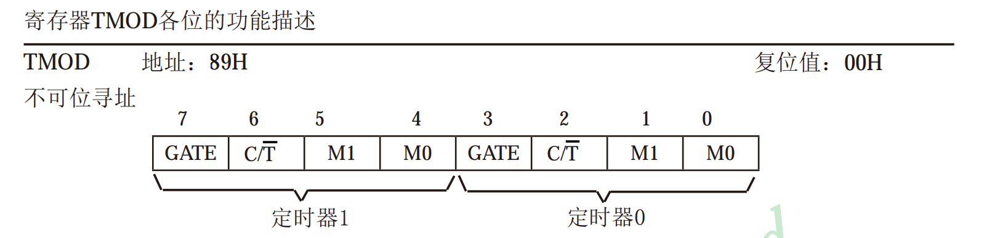
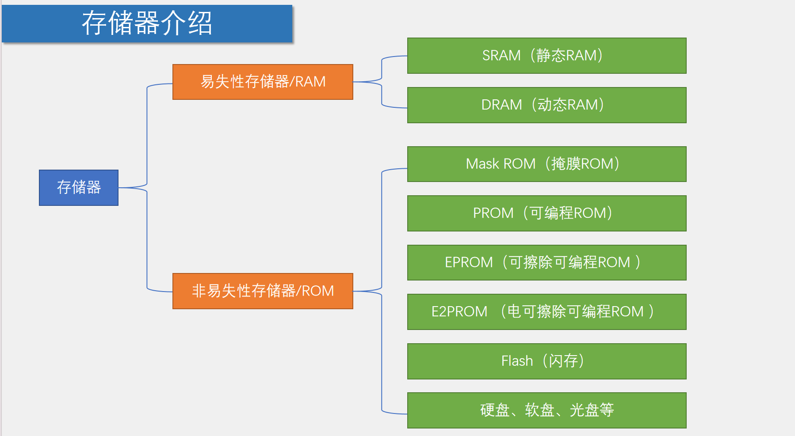
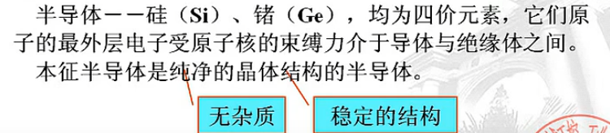

# 51C学习历程

## 新建工程

> 【keil5】project -> 新建文件夹目录 -> `Atmel ` -> `AT89C52` -> 选择 `否`

点亮一个LED

```c
#include <REGX52.H>

void main()
{
	P2=0xFE;	//1111 1110
	while(1)
	{
		
	}
}
```

> 【STC-ISP】烧录到单片机

- 设置单片机型号
- 串口号
- 下载/编程


## 数据类型

> - 整数：int, short, long
> - 小数：float, double
> - 字符：char


## STC89C52

### 点亮一个LED灯


```c
#include <REGX52.H>

void main()
{
	P2=0xFE;	//1111 1110 : turn on
}
```


### LED闪烁

```c
#include <REGX52.H>
#include <INTRINS.H>

void Delay500ms()		//@12.000MHz
{
	unsigned char i, j, k;

	_nop_();
	i = 4;
	j = 205;
	k = 187;
	do
	{
		do
		{
			while (--k);
		} while (--j);
	} while (--i);
}


void main()
{
	while(1)
	{
		P2=0xFE;	//1111 1110
		Delay500ms();
		P2=0xFF;	//1111 1111
		Delay500ms();
	}
}
```

### LED流水灯

```c
#include <REGX52.H>
#include <INTRINS.H>

void Delay500ms()		//@12.000MHz
{
	unsigned char i, j, k;

	_nop_();
	i = 4;
	j = 205;
	k = 187;
	do
	{
		do
		{
			while (--k);
		} while (--j);
	} while (--i);
}


void main()
{
	while(1)
	{
		P2=0xFE;//1111 1110
		Delay500ms();
		P2=0xFD;//1111 1101
		Delay500ms();
		P2=0xFB;//1111 1011
		Delay500ms();
		P2=0xF7;//1111 0111
		Delay500ms();
		P2=0xEF;//1110 1111
		Delay500ms();
		P2=0xDF;//1101 1111
		Delay500ms();
		P2=0xBF;//1011 1111
		Delay500ms();
		P2=0x7F;//0111 1111
		Delay500ms();
	}
}

```

流水灯优化：

```c
#include <REGX52.H>

void Delay1ms(unsigned int xms);		//@12.000MHz

void main()
{
	while(1)
	{
		P2=0xFE;//1111 1110
		Delay1ms(1000);
		P2=0xFD;//1111 1101
		Delay1ms(1000);
		P2=0xFB;//1111 1011
		Delay1ms(100);
		P2=0xF7;//1111 0111
		Delay1ms(100);
		P2=0xEF;//1110 1111
		Delay1ms(100);
		P2=0xDF;//1101 1111
		Delay1ms(100);
		P2=0xBF;//1011 1111
		Delay1ms(100);
		P2=0x7F;//0111 1111
		Delay1ms(100);
	}
}

void Delay1ms(unsigned int xms)		//@12.000MHz
{
	unsigned char i, j;
	while(xms)
	{
		i = 2;
		j = 239;
		do
		{
			while (--j);
		} while (--i);
		xms--;
	}
}
```

### 独立按键

#### 控制LED亮灭


K1: P3_1 | K2: P3_0 | K3: P3_2 | K4: P3_3


```c
#include <REGX52.H>

void main()
{
	while(1)
	{
		if(P3_1==0 || P3_0==0)	//如果K1按键或K2按键按下
		{
			P2_0=0;		//LED1输出0，点亮
		}
		else
		{
			P2_0=1;		//LED1输出1，熄灭
		}
	}
}
```

#### 控制LED状态

```c
#include <REGX52.H>

void Delay(unsigned int xms)
{
	unsigned char i, j;
	while(xms)
	{
		i = 2;
		j = 239;
		do
		{
			while (--j);
		} while (--i);
		xms--;
	}
}

void main()
{
	while(1)
	{
		if(P3_1==0)			//如果K1按键按下
		{
			Delay(20);		//延时消抖
			while(P3_1==0);	//松手检测
			Delay(20);		//延时消抖
			
			P2_0=~P2_0;		//LED1取反
		}
	}
}
```

#### LED灯显示二进制

```c
#include <REGX52.H>

void Delay(unsigned int xms)
{
	unsigned char i, j;
	while(xms--)
	{
		i = 2;
		j = 239;
		do
		{
			while (--j);
		} while (--i);
	}
}

void main()
{
	unsigned char LEDNum=0;
	while(1)
	{
		if(P3_1==0)			//如果K1按键按下
		{
			Delay(20);		//延时消抖
			while(P3_1==0);	//松手检测
			Delay(20);		//延时消抖
			
			LEDNum++;		//变量自增
			P2=~LEDNum;		//变量取反输出给LED
		}
	}
}
```

#### 控制LED移位

```c
#include <REGX52.H>
void Delay(unsigned int xms);

unsigned char LEDNum;

void main()
{
	P2=~0x01;				//上电默认LED1点亮
	while(1)
	{
		if(P3_1==0)			//如果K1按键按下
		{
			Delay(20);
			while(P3_1==0);
			Delay(20);
			
			LEDNum++;		//LEDNum自增
			if(LEDNum>=8)	//限制LEDNum自增范围
				LEDNum=0;
			P2=~(0x01<<LEDNum);	//LED的第LEDNum位点亮
		}
		if(P3_0==0)			//如果K2按键按下
		{
			Delay(20);
			while(P3_0==0);
			Delay(20);
			
			if(LEDNum==0)	//LEDNum减到0后变为7
				LEDNum=7;
			else			//LEDNum未减到0，自减
				LEDNum--;
			P2=~(0x01<<LEDNum);	//LED的第LEDNum位点亮
		}
	}
}

void Delay(unsigned int xms)
{
	unsigned char i, j;
	while(xms--)
	{
		i = 2;
		j = 239;
		do
		{
			while (--j);
		} while (--i);
	}
}
```

### 静态数码管显示

位码：P2_4 | P2_3 | P2_2 【低电平】


数码：【高电平】


```c
#include <REGX52.H>

//数码管段码表
unsigned char NixieTable[]={0x3F,0x06,0x5B,0x4F,0x66,0x6D,0x7D,0x07,0x7F,0x6F};

//数码管显示子函数
void Nixie(unsigned char Location,Number)
{
	switch(Location)		//位码输出
	{
		case 1:P2_4=1;P2_3=1;P2_2=1;break;
		case 2:P2_4=1;P2_3=1;P2_2=0;break;
		case 3:P2_4=1;P2_3=0;P2_2=1;break;
		case 4:P2_4=1;P2_3=0;P2_2=0;break;
		case 5:P2_4=0;P2_3=1;P2_2=1;break;
		case 6:P2_4=0;P2_3=1;P2_2=0;break;
		case 7:P2_4=0;P2_3=0;P2_2=1;break;
		case 8:P2_4=0;P2_3=0;P2_2=0;break;
	}
	P0=NixieTable[Number];	//段码输出 
}

void main()
{
	Nixie(2,3);	//在数码管的第2位置显示3
	while(1)
	{
		
	}
}
```

### 动态数码管

```c
#include <REGX52.H>

//数码管段码表
unsigned char NixieTable[]={0x3F,0x06,0x5B,0x4F,0x66,0x6D,0x7D,0x07,0x7F,0x6F};

//延时子函数
void Delay(unsigned int xms)
{
	unsigned char i, j;
	while(xms--)
	{
		i = 2;
		j = 239;
		do
		{
			while (--j);
		} while (--i);
	}
}

//数码管显示子函数
void Nixie(unsigned char Location,Number)
{
	switch(Location)		//位码输出
	{
		case 1:P2_4=1;P2_3=1;P2_2=1;break;
		case 2:P2_4=1;P2_3=1;P2_2=0;break;
		case 3:P2_4=1;P2_3=0;P2_2=1;break;
		case 4:P2_4=1;P2_3=0;P2_2=0;break;
		case 5:P2_4=0;P2_3=1;P2_2=1;break;
		case 6:P2_4=0;P2_3=1;P2_2=0;break;
		case 7:P2_4=0;P2_3=0;P2_2=1;break;
		case 8:P2_4=0;P2_3=0;P2_2=0;break;
	}
	P0=NixieTable[Number];	//段码输出
	Delay(1000);				//显示一段时间
	P0=0x00;				//段码清0，消影
}

void main()
{
	while(1)
	{
//		Nixie(1,1);		//在数码管的第1位置显示1
//		Delay(20);
//		Nixie(2,2);		//在数码管的第2位置显示2
//		Delay(20);
//		Nixie(3,3);		//在数码管的第3位置显示3
//		Delay(20);
		unsigned char i;
		for(i=1;i<=8;i++)
		{	
			Nixie(i,i);		
			Delay(1000);
		}
	}
}

```


### 模块化编程

#### 简介


**注意事项：**

- .c文件：函数、变量的**定义**
- .h文件：可被外部调用的函数、变量的**声明**
- 任何自定义的变量、函数**在调用前必须有定义或声明**（同一个.c）
- 使用到的自定义函数的.c文件必须添加到工程参与编译
- 使用到的.h文件必须要放在编译器可寻找到的地方（工程文件夹根目录、安装目录、自定义）


预编译：


#### 代码


>  main.c

```c
#include <REGX52.H>
#include "Delay.h"	//包含Delay头文件
#include "Nixie.h"	//包含数码管头文件

void main()
{
	while(1)
	{
		Nixie(1,1);	//在数码管的第1位置显示1
		Nixie(2,2);	//在数码管的第2位置显示2
		Nixie(3,3);	//在数码管的第3位置显示3
		Nixie(4,4);	//在数码管的第4位置显示4
		Nixie(5,5);	//在数码管的第5位置显示5
		Nixie(6,6);	//在数码管的第6位置显示6
	}
}

```

> Delay.c

```c

//延时子函数
void Delay(unsigned int xms)
{
	unsigned char i, j;
	while(xms--)
	{
		i = 2;
		j = 239;
		do
		{
			while (--j);
		} while (--i);
	}
}

```

> Delay.h

```c
#ifndef __DELAY_H__
#define __DELAY_H__

void Delay(unsigned int xms);

#endif

```

> Nixie.c

```c
#include <REGX52.H>
#include "Delay.h"	//包含Delay头文件

//数码管段码表
unsigned char NixieTable[]={0x3F,0x06,0x5B,0x4F,0x66,0x6D,0x7D,0x07,0x7F,0x6F};

//数码管显示子函数
void Nixie(unsigned char Location,Number)
{
	switch(Location)		//位码输出
	{
		case 1:P2_4=1;P2_3=1;P2_2=1;break;
		case 2:P2_4=1;P2_3=1;P2_2=0;break;
		case 3:P2_4=1;P2_3=0;P2_2=1;break;
		case 4:P2_4=1;P2_3=0;P2_2=0;break;
		case 5:P2_4=0;P2_3=1;P2_2=1;break;
		case 6:P2_4=0;P2_3=1;P2_2=0;break;
		case 7:P2_4=0;P2_3=0;P2_2=1;break;
		case 8:P2_4=0;P2_3=0;P2_2=0;break;
	}
	P0=NixieTable[Number];	//段码输出
	Delay(1);				//显示一段时间
	P0=0x00;				//段码清0，消影
}

```

> Nixie.h

```c
#ifndef __NIXIE_H__
#define __NIXIE_H__

void Nixie(unsigned char Location,Number);

#endif

```

### LCD调试工具


代码

> main.c

```c
#include <REGX52.H>
#include "LCD1602.h"	//包含LCD1602头文件
#include "Delay.h"		//包含Delay头文件

int Result=0;

void main()
{
	LCD_Init();
	while(1)
	{
		Result++;					//Result自增
		Delay(1000);				//延时1秒
		LCD_ShowNum(1,1,Result,3);	//在LCD的1行1列显示Result，长度为3位
	}
}

```

> LCD1602.c

```c
#include <REGX52.H>

//引脚配置：
sbit LCD_RS=P2^6;
sbit LCD_RW=P2^5;
sbit LCD_EN=P2^7;
#define LCD_DataPort P0

//函数定义：
/**
  * @brief  LCD1602延时函数，12MHz调用可延时1ms
  * @param  无
  * @retval 无
  */
void LCD_Delay()
{
	unsigned char i, j;

	i = 2;
	j = 239;
	do
	{
		while (--j);
	} while (--i);
}

/**
  * @brief  LCD1602写命令
  * @param  Command 要写入的命令
  * @retval 无
  */
void LCD_WriteCommand(unsigned char Command)
{
	LCD_RS=0;
	LCD_RW=0;
	LCD_DataPort=Command;
	LCD_EN=1;
	LCD_Delay();
	LCD_EN=0;
	LCD_Delay();
}

/**
  * @brief  LCD1602写数据
  * @param  Data 要写入的数据
  * @retval 无
  */
void LCD_WriteData(unsigned char Data)
{
	LCD_RS=1;
	LCD_RW=0;
	LCD_DataPort=Data;
	LCD_EN=1;
	LCD_Delay();
	LCD_EN=0;
	LCD_Delay();
}

/**
  * @brief  LCD1602设置光标位置
  * @param  Line 行位置，范围：1~2
  * @param  Column 列位置，范围：1~16
  * @retval 无
  */
void LCD_SetCursor(unsigned char Line,unsigned char Column)
{
	if(Line==1)
	{
		LCD_WriteCommand(0x80|(Column-1));
	}
	else if(Line==2)
	{
		LCD_WriteCommand(0x80|(Column-1+0x40));
	}
}

/**
  * @brief  LCD1602初始化函数
  * @param  无
  * @retval 无
  */
void LCD_Init()
{
	LCD_WriteCommand(0x38);//八位数据接口，两行显示，5*7点阵
	LCD_WriteCommand(0x0c);//显示开，光标关，闪烁关
	LCD_WriteCommand(0x06);//数据读写操作后，光标自动加一，画面不动
	LCD_WriteCommand(0x01);//光标复位，清屏
}

/**
  * @brief  在LCD1602指定位置上显示一个字符
  * @param  Line 行位置，范围：1~2
  * @param  Column 列位置，范围：1~16
  * @param  Char 要显示的字符
  * @retval 无
  */
void LCD_ShowChar(unsigned char Line,unsigned char Column,char Char)
{
	LCD_SetCursor(Line,Column);
	LCD_WriteData(Char);
}

/**
  * @brief  在LCD1602指定位置开始显示所给字符串
  * @param  Line 起始行位置，范围：1~2
  * @param  Column 起始列位置，范围：1~16
  * @param  String 要显示的字符串
  * @retval 无
  */
void LCD_ShowString(unsigned char Line,unsigned char Column,char *String)
{
	unsigned char i;
	LCD_SetCursor(Line,Column);
	for(i=0;String[i]!='\0';i++)
	{
		LCD_WriteData(String[i]);
	}
}

/**
  * @brief  返回值=X的Y次方
  */
int LCD_Pow(int X,int Y)
{
	unsigned char i;
	int Result=1;
	for(i=0;i<Y;i++)
	{
		Result*=X;
	}
	return Result;
}

/**
  * @brief  在LCD1602指定位置开始显示所给数字
  * @param  Line 起始行位置，范围：1~2
  * @param  Column 起始列位置，范围：1~16
  * @param  Number 要显示的数字，范围：0~65535
  * @param  Length 要显示数字的长度，范围：1~5
  * @retval 无
  */
void LCD_ShowNum(unsigned char Line,unsigned char Column,unsigned int Number,unsigned char Length)
{
	unsigned char i;
	LCD_SetCursor(Line,Column);
	for(i=Length;i>0;i--)
	{
		LCD_WriteData(Number/LCD_Pow(10,i-1)%10+'0');
	}
}

/**
  * @brief  在LCD1602指定位置开始以有符号十进制显示所给数字
  * @param  Line 起始行位置，范围：1~2
  * @param  Column 起始列位置，范围：1~16
  * @param  Number 要显示的数字，范围：-32768~32767
  * @param  Length 要显示数字的长度，范围：1~5
  * @retval 无
  */
void LCD_ShowSignedNum(unsigned char Line,unsigned char Column,int Number,unsigned char Length)
{
	unsigned char i;
	unsigned int Number1;
	LCD_SetCursor(Line,Column);
	if(Number>=0)
	{
		LCD_WriteData('+');
		Number1=Number;
	}
	else
	{
		LCD_WriteData('-');
		Number1=-Number;
	}
	for(i=Length;i>0;i--)
	{
		LCD_WriteData(Number1/LCD_Pow(10,i-1)%10+'0');
	}
}

/**
  * @brief  在LCD1602指定位置开始以十六进制显示所给数字
  * @param  Line 起始行位置，范围：1~2
  * @param  Column 起始列位置，范围：1~16
  * @param  Number 要显示的数字，范围：0~0xFFFF
  * @param  Length 要显示数字的长度，范围：1~4
  * @retval 无
  */
void LCD_ShowHexNum(unsigned char Line,unsigned char Column,unsigned int Number,unsigned char Length)
{
	unsigned char i,SingleNumber;
	LCD_SetCursor(Line,Column);
	for(i=Length;i>0;i--)
	{
		SingleNumber=Number/LCD_Pow(16,i-1)%16;
		if(SingleNumber<10)
		{
			LCD_WriteData(SingleNumber+'0');
		}
		else
		{
			LCD_WriteData(SingleNumber-10+'A');
		}
	}
}

/**
  * @brief  在LCD1602指定位置开始以二进制显示所给数字
  * @param  Line 起始行位置，范围：1~2
  * @param  Column 起始列位置，范围：1~16
  * @param  Number 要显示的数字，范围：0~1111 1111 1111 1111
  * @param  Length 要显示数字的长度，范围：1~16
  * @retval 无
  */
void LCD_ShowBinNum(unsigned char Line,unsigned char Column,unsigned int Number,unsigned char Length)
{
	unsigned char i;
	LCD_SetCursor(Line,Column);
	for(i=Length;i>0;i--)
	{
		LCD_WriteData(Number/LCD_Pow(2,i-1)%2+'0');
	}
}

```

> LCD1602.h

```c
#ifndef __LCD1602_H__
#define __LCD1602_H__

//用户调用函数：
void LCD_Init();
void LCD_ShowChar(unsigned char Line,unsigned char Column,char Char);
void LCD_ShowString(unsigned char Line,unsigned char Column,char *String);
void LCD_ShowNum(unsigned char Line,unsigned char Column,unsigned int Number,unsigned char Length);
void LCD_ShowSignedNum(unsigned char Line,unsigned char Column,int Number,unsigned char Length);
void LCD_ShowHexNum(unsigned char Line,unsigned char Column,unsigned int Number,unsigned char Length);
void LCD_ShowBinNum(unsigned char Line,unsigned char Column,unsigned int Number,unsigned char Length);

#endif

```

### 矩阵键盘


> main.c

```c
#include <REGX52.H>
#include "Delay.h"		//包含Delay头文件
#include "LCD1602.h"	//包含LCD1602头文件
#include "MatrixKey.h"	//包含矩阵键盘头文件

unsigned char KeyNum;

void main()
{
	LCD_Init();							//LCD初始化
	LCD_ShowString(1,1,"MatrixKey:");	//LCD显示字符串
	while(1)
	{
		KeyNum=MatrixKey();				//获取矩阵键盘键码
		if(KeyNum)						//如果有按键按下
		{
			LCD_ShowNum(2,1,KeyNum,2);	//LCD显示键码
		}
	}
}

```

> MatrixKey.h

```c
#ifndef __MATRIXKEY_H__
#define __MATRIXKEY_H__

unsigned char MatrixKey();

#endif

```

> MatrixKey.c

```c
#include <REGX52.H>
#include "Delay.h"

/** 先列后行
  * @brief  矩阵键盘读取按键键码
  * @param  无
  * @retval KeyNumber 按下按键的键码值
			如果按键按下不放，程序会停留在此函数，松手的一瞬间，返回按键键码，没有按键按下时，返回0
  */
unsigned char MatrixKey()
{
	unsigned char KeyNumber=0;
	
	P1=0xFF;
	P1_3=0; //第一列
	if(P1_7==0){Delay(20);while(P1_7==0);Delay(20);KeyNumber=1;}
	if(P1_6==0){Delay(20);while(P1_6==0);Delay(20);KeyNumber=5;}
	if(P1_5==0){Delay(20);while(P1_5==0);Delay(20);KeyNumber=9;}
	if(P1_4==0){Delay(20);while(P1_4==0);Delay(20);KeyNumber=13;}
	
	P1=0xFF;
	P1_2=0; //第二列
	if(P1_7==0){Delay(20);while(P1_7==0);Delay(20);KeyNumber=2;}
	if(P1_6==0){Delay(20);while(P1_6==0);Delay(20);KeyNumber=6;}
	if(P1_5==0){Delay(20);while(P1_5==0);Delay(20);KeyNumber=10;}
	if(P1_4==0){Delay(20);while(P1_4==0);Delay(20);KeyNumber=14;}
	
	P1=0xFF;
	P1_1=0; //第三列
	if(P1_7==0){Delay(20);while(P1_7==0);Delay(20);KeyNumber=3;}
	if(P1_6==0){Delay(20);while(P1_6==0);Delay(20);KeyNumber=7;}
	if(P1_5==0){Delay(20);while(P1_5==0);Delay(20);KeyNumber=11;}
	if(P1_4==0){Delay(20);while(P1_4==0);Delay(20);KeyNumber=15;}
	
	P1=0xFF;
	P1_0=0; //第四列
	if(P1_7==0){Delay(20);while(P1_7==0);Delay(20);KeyNumber=4;}
	if(P1_6==0){Delay(20);while(P1_6==0);Delay(20);KeyNumber=8;}
	if(P1_5==0){Delay(20);while(P1_5==0);Delay(20);KeyNumber=12;}
	if(P1_4==0){Delay(20);while(P1_4==0);Delay(20);KeyNumber=16;}
	
	return KeyNumber;
}

```


### 矩阵键盘密码锁

> 密码可以自定义，此处定义为 : "2345"

```c
#include <REGX52.H>
#include "Delay.h"
#include "LCD1602.h"
#include "MatrixKey.h"

unsigned char KeyNum;
unsigned int Password,Count;

void main()
{
	LCD_Init();
	LCD_ShowString(1,1,"Password:");
	while(1)
	{
		KeyNum=MatrixKey();
		if(KeyNum)
		{
			if(KeyNum<=10)	//如果S1~S10按键按下，输入密码
			{
				if(Count<4)	//如果输入次数小于4
				{
					Password*=10;				//密码左移一位
					Password+=KeyNum%10;		//获取一位密码
					Count++;	//计次加一
				}
				LCD_ShowNum(2,1,Password,4);	//更新显示
			}
			if(KeyNum==11)	//如果S11按键按下，确认
			{
				if(Password==2345)	//如果密码等于正确密码
				{
					LCD_ShowString(1,14,"OK ");	//显示OK
					Password=0;		//密码清零
					Count=0;		//计次清零
					LCD_ShowNum(2,1,Password,4);	//更新显示
				}
				else				//否则
				{
					LCD_ShowString(1,14,"ERR");	//显示ERR
					Password=0;		//密码清零
					Count=0;		//计次清零
					LCD_ShowNum(2,1,Password,4);	//更新显示
				}
			}
			if(KeyNum==12)	//如果S12按键按下，取消
			{
				Password=0;		//密码清零
				Count=0;		//计次清零
				LCD_ShowNum(2,1,Password,4);	//更新显示
			}
		}
	}
}
```


### 定时器与中断


> 寄存器设置
>
> - TMOD: 0000 0001 【0x01】
>
>   - GATE: 0
>   - C/T: 0 【定时器】
>   - M1: 0 【01：16位定时器】
>   - M0: 1 【01：16位定时器】
>
> - TR0: 1 开始计数
>
> - TF0: 由硬件置1，表示中断；响应清0.
>
> - ET0=1 开关打开
>
> - EA=1  总开关打开
>
> - PT0=0 优先级低
>
>   ```c
>   /**
>     * @brief  定时器0初始化，1毫秒@12.000MHz
>     * @param  无
>     * @retval 无
>     */
>   void Timer0Init(void)
>   {
>   	TMOD &= 0xF0;		//设置定时器模式 【低8位清0】
>   	TMOD |= 0x01;		//设置定时器模式 【最低为置1】
>   	TL0 = 0x18;		//设置定时初值 【低8位 64535%256+1】
>   	TH0 = 0xFC;		//设置定时初值 【高8位 64535/256】
>   	TF0 = 0;		//清除TF0标志
>   	TR0 = 1;		//定时器0开始计时
>   	ET0=1; 
>   	EA=1;
>   	PT0=0;
>   }
>   ```
>
>   ```c
>   // 定时器中断函数模板
>   void Timer0_Routine() interrupt 1
>   {
>   	static unsigned int T0Count;
>   	TL0 = 0x18;		//设置定时初值
>   	TH0 = 0xFC;		//设置定时初值
>   	T0Count++;
>   	if(T0Count>=1000)
>   	{
>   		T0Count=0;
>   		            
>   	}
>   }
>   ```
>
>   


#### 按键控制流水灯

> main.c

```c
#include <REGX52.H>
#include "Timer0.h"
#include "Key.h"
#include <INTRINS.H>

unsigned char KeyNum,LEDMode;

void main()
{
	P2=0xFE;
	Timer0Init();
	while(1)
	{
		KeyNum=Key();		//获取独立按键键码
		if(KeyNum)			//如果按键按下
		{
			if(KeyNum==1)	//如果K1按键按下
			{
				LEDMode++;	//模式切换
				if(LEDMode>=2)LEDMode=0;
			}
		}
	}
}

void Timer0_Routine() interrupt 1
{
	static unsigned int T0Count;
	TL0 = 0x18;		//设置定时初值
	TH0 = 0xFC;		//设置定时初值
	T0Count++;		//T0Count计次，对中断频率进行分频
	if(T0Count>=500)//分频500次，500ms
	{
		T0Count=0;
		if(LEDMode==0)			//模式判断
			P2=_crol_(P2,1);	//LED输出
		if(LEDMode==1)
			P2=_cror_(P2,1);
	}
}
```

**INTRINS：**

- `_crol_` 循环左移
- `_cror_` 循环右移

> Key.c

```c
#include <REGX52.H>
#include "Delay.h"

/**
  * @brief  获取独立按键键码
  * @param  无
  * @retval 按下按键的键码，范围：0~4，无按键按下时返回值为0
  */
unsigned char Key()
{
	unsigned char KeyNumber=0;
	
	if(P3_1==0){Delay(20);while(P3_1==0);Delay(20);KeyNumber=1;}
	if(P3_0==0){Delay(20);while(P3_0==0);Delay(20);KeyNumber=2;}
	if(P3_2==0){Delay(20);while(P3_2==0);Delay(20);KeyNumber=3;}
	if(P3_3==0){Delay(20);while(P3_3==0);Delay(20);KeyNumber=4;}
	
	return KeyNumber;
}
```

> Key.h

```c
#ifndef __KEY_H__
#define __KEY_H__

unsigned char Key();

#endif
```

> Timer0.c

```c
#include <REGX52.H>

/**
  * @brief  定时器0初始化，1毫秒@12.000MHz
  * @param  无
  * @retval 无
  */
void Timer0Init(void)
{
	TMOD &= 0xF0;		//设置定时器模式
	TMOD |= 0x01;		//设置定时器模式
	TL0 = 0x18;		//设置定时初值
	TH0 = 0xFC;		//设置定时初值
	TF0 = 0;		//清除TF0标志
	TR0 = 1;		//定时器0开始计时
	ET0=1; 
	EA=1;
	PT0=0;
}

/*定时器中断函数模板
void Timer0_Routine() interrupt 1
{
	static unsigned int T0Count;
	TL0 = 0x18;		//设置定时初值
	TH0 = 0xFC;		//设置定时初值
	T0Count++;
	if(T0Count>=1000)
	{
		T0Count=0;
		
	}
}
*/
```

> Timer0.h

```c
#ifndef __TIMER0_H__
#define __TIMER0_H__

void Timer0Init(void);

#endif
```

#### 定时器时钟

> main.c

```c
#include <REGX52.H>
#include "Delay.h"
#include "LCD1602.h"
#include "Timer0.h"

unsigned char Sec=59,Min=59,Hour=23;

void main()
{
	LCD_Init();
	Timer0Init();
	
	LCD_ShowString(1,1,"Clock:");	//上电显示静态字符串
	LCD_ShowString(2,1,"  :  :");
	
	while(1)
	{
		LCD_ShowNum(2,1,Hour,2);	//显示时分秒
		LCD_ShowNum(2,4,Min,2);
		LCD_ShowNum(2,7,Sec,2);
	}
}

void Timer0_Routine() interrupt 1
{
	static unsigned int T0Count;
	TL0 = 0x18;		//设置定时初值
	TH0 = 0xFC;		//设置定时初值
	T0Count++;
	if(T0Count>=1000)	//定时器分频，1s
	{
		T0Count=0;
		Sec++;			//1秒到，Sec自增
		if(Sec>=60)
		{
			Sec=0;		//60秒到，Sec清0，Min自增
			Min++;
			if(Min>=60)
			{
				Min=0;	//60分钟到，Min清0，Hour自增
				Hour++;
				if(Hour>=24)
				{
					Hour=0;	//24小时到，Hour清0
				}
			}
		}
	}
}
```

---

### LED点阵屏


```C
#include <REGX52.H>
#include "Delay.h"

sbit RCK=P3^5;		//RCLK 上升沿锁存
sbit SCK=P3^6;		//SRCLK 上升沿移位
sbit SER=P3^4;		//SER 

#define MATRIX_LED_PORT		P0

/** D0-D7
  * @brief  74HC595写入一个字节
  * @param  Byte 要写入的字节
  * @retval 无
  */
void _74HC595_WriteByte(unsigned char Byte)
{
	unsigned char i;
	for(i=0;i<8;i++)
	{
		SER=Byte&(0x80>>i);
		SCK=1;
		SCK=0;
	}
	RCK=1;
	RCK=0;
}

/** P0-P7
  * @brief  LED点阵屏显示一列数据
  * @param  Column 要选择的列，范围：0~7，0在最左边
  * @param  Data 选择列显示的数据，高位在上，1为亮，0为灭
  * @retval 无
  */
void MatrixLED_ShowColumn(unsigned char Column,Data)
{
	_74HC595_WriteByte(Data);
	MATRIX_LED_PORT=~(0x80>>Column);
	Delay(1);
	MATRIX_LED_PORT=0xFF;
}

void main()
{
	SCK=0;
	RCK=0;
	while(1)
	{
		MatrixLED_ShowColumn(0,0x3C);
		MatrixLED_ShowColumn(1,0x42);
		MatrixLED_ShowColumn(2,0xA9);
		MatrixLED_ShowColumn(3,0x85);
		MatrixLED_ShowColumn(4,0x85);
		MatrixLED_ShowColumn(5,0xA9);
		MatrixLED_ShowColumn(6,0x42);
		MatrixLED_ShowColumn(7,0x3C);
	}
}


```

---


### 串口通信


**注：单片机：TTL电平**


- 全双工：通信双方可以在同一时刻互相传输数据
- 半双工：通信双方可以互相传输数据，但必须分时复用一根数据线 【对讲机】
- 单工：通信只能有一方发送到另一方，不能反向传输 【遥控器】
- 异步：通信双方各自约定通信速率
- 同步：通信双方靠一根时钟线来约定通信速率
- 总线：连接各个设备的数据传输线路（类似于一条马路，把路边各住户连接起来，使住户可以相互交流）




> 寄存器初值：
>
> - SCON=0x40;
>   - B7 	B6 	...	 B1 	B0
>   - SM0      SM1                  TI           RI
>   - 0            1                        0             0
> - PCON=1000 0000; 【波特率加倍：SMOD=1】
> - TMOD: 0010 0000 【定时器模式：8位自动重装】
> - ET1=0; //禁止定时器1中断
> - TR1=1; //启动定时器1

#### 串口向电脑端发送数据

>  main.c

```c
#include <REGX52.H>
#include "Delay.h"
#include "UART.h"

unsigned char Sec;

void main()
{
	UART_Init();			//串口初始化
	while(1)
	{
		UART_SendByte(Sec);	//串口发送一个字节
		Sec++;				//Sec自增
		Delay(1000);		//延时1秒
	}
}
```

> UART.c

```c
#include <REGX52.H>

/**
  * @brief  串口初始化，4800bps@12.000MHz
  * @param  无
  * @retval 无
  */
void UART_Init()
{
	SCON=0x40;
	PCON |= 0x80;
	TMOD &= 0x0F;		//设置定时器模式
	TMOD |= 0x20;		//设置定时器模式
	TL1 = 0xF3;		//设定定时初值
	TH1 = 0xF3;		//设定定时器重装值
	ET1 = 0;		//禁止定时器1中断
	TR1 = 1;		//启动定时器1
}

/**
  * @brief  串口发送一个字节数据
  * @param  Byte 要发送的一个字节数据
  * @retval 无
  */
void UART_SendByte(unsigned char Byte)
{
	SBUF=Byte;
	while(TI==0);
	TI=0;
}
```

> UART.h

```c
#ifndef __UART_H__
#define __UART_H__

void UART_Init();
void UART_SendByte(unsigned char Byte);

#endif
```

#### 电脑端向串口发送数据

> main.c

```c
#include <REGX52.H>
#include "Delay.h"
#include "UART.h"

void main()
{
	UART_Init();		//串口初始化
	while(1)
	{
		
	}
}

void UART_Routine() interrupt 4
{
	if(RI==1)					//如果接收标志位为1，接收到了数据
	{
		P2=~SBUF;				//读取数据，取反后输出到LED
		UART_SendByte(SBUF);	//将受到的数据发回串口
		RI=0;					//接收标志位清0
	}
}
```

> UART.c
>
> - 允许接收： SCON=0x50;【REN=1】
> - 打开中断：EA=1; ES=1;

```c
#include <REGX52.H>

/**
  * @brief  串口初始化，4800bps@12.000MHz
  * @param  无
  * @retval 无
  */
void UART_Init()
{
	SCON=0x50;
	PCON |= 0x80;
	TMOD &= 0x0F;		//设置定时器模式
	TMOD |= 0x20;		//设置定时器模式
	TL1 = 0xF3;		//设定定时初值
	TH1 = 0xF3;		//设定定时器重装值
	ET1 = 0;		//禁止定时器1中断
	TR1 = 1;		//启动定时器1
	EA=1;
	ES=1;
}

/**
  * @brief  串口发送一个字节数据
  * @param  Byte 要发送的一个字节数据
  * @retval 无
  */
void UART_SendByte(unsigned char Byte)
{
	SBUF=Byte;
	while(TI==0);
	TI=0;
}

/*串口中断函数模板 
// UART_Routine() 可以自己取名
// 但需要关键字及序号interrupt 4
// 4 代表串口
void UART_Routine() interrupt 4
{
	if(RI==1)
	{
		
		RI=0;
	}
}
*/
```


> UART.h

```c
#ifndef __UART_H__
#define __UART_H__

void UART_Init();
void UART_SendByte(unsigned char Byte);

#endif
```

### 串口测试--自发自收 【PC(发送接收都显示)-STC89C52】

> main.c

```c
#include <REGX52.H>
#include "Delay.h"
#include "UART.h"
#include "LCD1602.h"

unsigned char Sec;

void main()
{
	UART_Init();			//串口初始化
	LCD_Init();
	while(1)
	{
		
	}
}

void UART_Routine() interrupt 4
{
	if(RI==1)					//如果接收标志位为1，接收到了数据
	{
		UART_SendByte(SBUF);	//将受到的数据发回串口
		LCD_ShowHexNum(1,1,SBUF,2);	//在LCD的1行1列显示Result，长度为3位
		RI=0;					//接收标志位清0
	}
}
```

> UART.c
>
> 此处修改为：4800bps@11.0592MHz 【这样可以避免误差】

```c
#include <REGX52.H>

/**
  * @brief  串口初始化，4800bps@11.0592MHz
  * @param  无
  * @retval 无
  */
void UART_Init()
{
	SCON=0x50;
	PCON &= 0x7F;
	TMOD &= 0x0F;		//设置定时器模式
	TMOD |= 0x20;		//设置定时器模式
	TL1 = 0xFA;		//设定定时初值
	TH1 = 0xFA;		//设定定时器重装值
	ET1 = 0;		//禁止定时器1中断
	TR1 = 1;		//启动定时器1
	EA=1;
	ES=1;
}

/**
  * @brief  串口发送一个字节数据
  * @param  Byte 要发送的一个字节数据
  * @retval 无
  */
void UART_SendByte(unsigned char Byte)
{
	SBUF=Byte;
	while(TI==0);
	TI=0;
}

/*串口中断函数模板 
// UART_Routine() 可以自己取名
// 但需要关键字及序号interrupt 4
// 4 代表串口
void UART_Routine() interrupt 4
{
	if(RI==1)
	{
		
		RI=0;
	}
}
*/
```

---

### ROM & I2C




> I2C.c

```C
#include <REGX52.H>

sbit I2C_SCL=P2^1;
sbit I2C_SDA=P2^0;

/**
  * @brief  I2C开始
  * @param  无
  * @retval 无
  */
void I2C_Start(void)
{
	I2C_SDA=1;
	I2C_SCL=1;
	I2C_SDA=0;
	I2C_SCL=0;
}

/**
  * @brief  I2C停止
  * @param  无
  * @retval 无
  */
void I2C_Stop(void)
{
	I2C_SDA=0;
	I2C_SCL=1;
	I2C_SDA=1;
}

/**
  * @brief  I2C发送一个字节
  * @param  Byte 要发送的字节
  * @retval 无
  */
void I2C_SendByte(unsigned char Byte)
{
	unsigned char i;
	for(i=0;i<8;i++)
	{
		I2C_SDA=Byte&(0x80>>i);
		I2C_SCL=1;
		I2C_SCL=0;
	}
}

/**
  * @brief  I2C接收一个字节
  * @param  无
  * @retval 接收到的一个字节数据
  */
unsigned char I2C_ReceiveByte(void)
{
	unsigned char i,Byte=0x00;
	I2C_SDA=1;
	for(i=0;i<8;i++)
	{
		I2C_SCL=1;
		if(I2C_SDA){Byte|=(0x80>>i);}
		I2C_SCL=0;
	}
	return Byte;
}

/**
  * @brief  I2C发送应答
  * @param  AckBit 应答位，0为应答，1为非应答
  * @retval 无
  */
void I2C_SendAck(unsigned char AckBit)
{
	I2C_SDA=AckBit;
	I2C_SCL=1;
	I2C_SCL=0;
}

/**
  * @brief  I2C接收应答位
  * @param  无
  * @retval 接收到的应答位，0为应答，1为非应答
  */
unsigned char I2C_ReceiveAck(void)
{
	unsigned char AckBit;
	I2C_SDA=1;
	I2C_SCL=1;
	AckBit=I2C_SDA;
	I2C_SCL=0;
	return AckBit;
}

```


> I2C.h

```c
#ifndef __I2C_H__
#define __I2C_H__

void I2C_Start(void);
void I2C_Stop(void);
void I2C_SendByte(unsigned char Byte);
unsigned char I2C_ReceiveByte(void);
void I2C_SendAck(unsigned char AckBit);
unsigned char I2C_ReceiveAck(void);

#endif
```


> AT24C02.c

```c
#include <REGX52.H>
#include "I2C.h"

#define AT24C02_ADDRESS		0xA0

/**
  * @brief  AT24C02写入一个字节
  * @param  WordAddress 要写入字节的地址
  * @param  Data 要写入的数据
  * @retval 无
  */
void AT24C02_WriteByte(unsigned char WordAddress,Data)
{
	I2C_Start();
	I2C_SendByte(AT24C02_ADDRESS);
	I2C_ReceiveAck();
	I2C_SendByte(WordAddress);
	I2C_ReceiveAck();
	I2C_SendByte(Data);
	I2C_ReceiveAck();
	I2C_Stop();
}

/**
  * @brief  AT24C02读取一个字节
  * @param  WordAddress 要读出字节的地址
  * @retval 读出的数据
  */
unsigned char AT24C02_ReadByte(unsigned char WordAddress)
{
	unsigned char Data;
	I2C_Start();
	I2C_SendByte(AT24C02_ADDRESS);
	I2C_ReceiveAck();
	I2C_SendByte(WordAddress);
	I2C_ReceiveAck();
	I2C_Start();
	I2C_SendByte(AT24C02_ADDRESS|0x01);
	I2C_ReceiveAck();
	Data=I2C_ReceiveByte();
	I2C_SendAck(1);
	I2C_Stop();
	return Data;
}

```


> AT24C02.h

```c
#ifndef __AT24C02_H__
#define __AT24C02_H__

void AT24C02_WriteByte(unsigned char WordAddress,Data);
unsigned char AT24C02_ReadByte(unsigned char WordAddress);


#endif
```


> main.c

```c
#include <REGX52.H>
#include "LCD1602.h"
#include "Key.h"
#include "AT24C02.h"
#include "Delay.h"

unsigned char KeyNum;
unsigned int Num; //16位

void main()
{
	LCD_Init();
	LCD_ShowNum(1,1,Num,5);
	while(1)
	{
		KeyNum=Key();
		if(KeyNum==1)	//K1按键，Num自增
		{
			Num++;
			LCD_ShowNum(1,1,Num,5);
		}
		if(KeyNum==2)	//K2按键，Num自减
		{
			Num--;
			LCD_ShowNum(1,1,Num,5);
		}
		if(KeyNum==3)	//K3按键，向AT24C02写入数据
		{
			AT24C02_WriteByte(0,Num%256);
			Delay(5);
			AT24C02_WriteByte(1,Num/256);
			Delay(5);
			LCD_ShowString(2,1,"Write OK");
			Delay(1000);
			LCD_ShowString(2,1,"        ");
		}
		if(KeyNum==4)	//K4按键，从AT24C02读取数据
		{
			Num=AT24C02_ReadByte(0);
			Num|=AT24C02_ReadByte(1)<<8;
			LCD_ShowNum(1,1,Num,5);
			LCD_ShowString(2,1,"Read OK ");
			Delay(1000);
			LCD_ShowString(2,1,"        ");
		}
	}
}
```


---

# 基础电路

>  课程：[华成英 - 模拟电子技术基础 | 模拟电路 | 模电_哔哩哔哩_bilibili](https://www.bilibili.com/video/BV19s411a7KL/?spm_id_from=333.788.recommend_more_video.16&vd_source=89c2ecd16d049f7e389852ac699e1d72)
>
> 目录：
>
> 二极管三极管基础234
> 基本放大电路5.6.7.8.9.10
> 场效应管及其放大电路11.12
> 多级放大电路13.14
> 差分放大电路15.16
> 互补输出级17.18.19
> 集成运放19.20
> 放大电路频率响应21.22.23.24
> 放大电路中的反馈25.26.27.28.29.30.31.32
> 运算电路33.34.35.36
>
> 电压比较器 39.40
> 非正弦波震荡电路 41.42
> 信号转换电路 43.44
> 震荡电路 45.46.47.48
> 功率放大电路 49.50
> 整流电路，滤波电路 51.52
> 稳压电路 53.54.55.56

## 二极管三极管基础234

> 概念


半导体：硅（Si）、锗（Ge），均为四价元素，它们原子的最外层电子受原子核的束缚力介于导体与绝缘体之间。




---

# 学习路线


---


