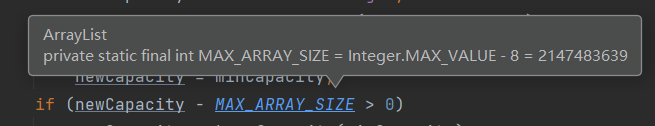

# `ArrayList`

## 重点: 扩容机制

- `ArrayList` 中维护了一个`Object`类型的数组`elementData` : `transient Object[] elementData` (transient表示不会被序列化)
- 当创建`ArrayList`对象时,
  - 如果使用的是无参构造器, 则初始`elementData`容量为0, 第1次添加, 则`elementData`扩容为10, 如需要再次扩容, 则`elementData`扩容为`1.5倍`
  - 如果使用的是指定大小的构造器, 则初始`elementData`容量为指定大小, 如果需要扩容, 则直接扩容`elementData`为`1.5倍`

### 使用无参构造器

> 1. 先初始化为0

```java
/**
 * Constructs an empty list with an initial capacity of ten.
 */
public ArrayList() {
    this.elementData = DEFAULTCAPACITY_EMPTY_ELEMENTDATA;
}

/**
 * Shared empty array instance used for default sized empty instances. We
 * distinguish this from EMPTY_ELEMENTDATA to know how much to inflate when
 * first element is added.
 */
private static final Object[] DEFAULTCAPACITY_EMPTY_ELEMENTDATA = {};
```

> 2. 第一次添加时, 先扩容为10

```java
/**
 * Appends the specified element to the end of this list.
 *
 * @param e element to be appended to this list
 * @return <tt>true</tt> (as specified by {@link Collection#add})
 */
public boolean add(E e) {
    ensureCapacityInternal(size + 1);  //  1. ensureCapacityInternal(0 + 1)
    elementData[size++] = e;
    return true;
}

private void ensureCapacityInternal(int minCapacity) {
    ensureExplicitCapacity(calculateCapacity(elementData, minCapacity)); // 3.ensureExplicitCapacity(10)
}

private static final int DEFAULT_CAPACITY = 10;

private static int calculateCapacity(Object[] elementData, int minCapacity) { // minCapacity == 1
    if (elementData == DEFAULTCAPACITY_EMPTY_ELEMENTDATA) {
        // DEFAULT_CAPACITY = 10
        return Math.max(DEFAULT_CAPACITY, minCapacity); // 2. return Math.max(10, 1)
    }
    return minCapacity;
}

private void ensureExplicitCapacity(int minCapacity) {
    modCount++; // 记录集合被修改的次数

    // 不够才扩容
    if (minCapacity - elementData.length > 0) // 10 > 0
        grow(minCapacity); // 4. 扩容为10
}

private void grow(int minCapacity) {
    // overflow-conscious code
    int oldCapacity = elementData.length; // 0
    int newCapacity = oldCapacity + (oldCapacity >> 1); // 0
    if (newCapacity - minCapacity < 0) // 0 < 10
        newCapacity = minCapacity; // 10
    if (newCapacity - MAX_ARRAY_SIZE > 0)
        newCapacity = hugeCapacity(minCapacity);
    // minCapacity is usually close to size, so this is a win:
    elementData = Arrays.copyOf(elementData, newCapacity); // 复制扩容
}

// public class Arrays
@SuppressWarnings("unchecked")
public static <T> T[] copyOf(T[] original, int newLength) {
    return (T[]) copyOf(original, newLength, original.getClass());
}

public static <T,U> T[] copyOf(U[] original, int newLength, Class<? extends T[]> newType) {
    @SuppressWarnings("unchecked")
    T[] copy = ((Object)newType == (Object)Object[].class)
        ? (T[]) new Object[newLength]
        : (T[]) Array.newInstance(newType.getComponentType(), newLength);
    System.arraycopy(original, 0, copy, 0,
                     Math.min(original.length, newLength));
    return copy;
}
// public final class System
public static native void arraycopy(Object src,  int  srcPos,
                                    Object dest, int destPos,
                                    int length);
```

> 3. 若不够, 再扩容为1.5倍 (当size+1 > 10时)

``` java
// minCapacity = size + 1
private void ensureExplicitCapacity(int minCapacity) {
    modCount++; // 记录集合被修改的次数

    // 不够再扩容
    if (minCapacity - elementData.length > 0) // 11 > 10
        grow(minCapacity); // 扩容为15
}

private void grow(int minCapacity) {
    // overflow-conscious code
    int oldCapacity = elementData.length; // 10
    int newCapacity = oldCapacity + (oldCapacity >> 1); // 15
    if (newCapacity - minCapacity < 0)
        newCapacity = minCapacity; 
    if (newCapacity - MAX_ARRAY_SIZE > 0)
        newCapacity = hugeCapacity(minCapacity);
    // minCapacity is usually close to size, so this is a win:
    elementData = Arrays.copyOf(elementData, newCapacity); // 复制扩容
}
```

注: `private static final int MAX_ARRAY_SIZE = Integer.MAX_VALUE - 8;`




### 使用的是指定大小的构造器

> 1. 初始为指定大小

```java
public ArrayList(int initialCapacity) {
    if (initialCapacity > 0) {
        this.elementData = new Object[initialCapacity]; // 初始为指定的 initialCapacity 大小
    } else if (initialCapacity == 0) {
        this.elementData = EMPTY_ELEMENTDATA; 
    } else {
        throw new IllegalArgumentException("Illegal Capacity: "+
                                           initialCapacity);
    }
}

// initialCapacity == 0, 初始为空数组, 扩容机制同上面的分析
private static final Object[] EMPTY_ELEMENTDATA = {};

private static final int DEFAULT_CAPACITY = 10;
```

> 2. 如果需要扩容, 则直接扩容`elementData`为`1.5倍` 

``` java
public boolean add(E e) {
    ensureCapacityInternal(size + 1);  //  1. ensureCapacityInternal(initialCapacity + 1)
    elementData[size++] = e;
    return true;
}

private void ensureCapacityInternal(int minCapacity) {
    // 3.ensureExplicitCapacity(initialCapacity + 1)
    ensureExplicitCapacity(calculateCapacity(elementData, minCapacity)); 
}

private static int calculateCapacity(Object[] elementData, int minCapacity) { 
    if (elementData == DEFAULTCAPACITY_EMPTY_ELEMENTDATA) {
        // DEFAULT_CAPACITY = 10
        return Math.max(DEFAULT_CAPACITY, minCapacity);
    }
    return minCapacity; // 2. return initialCapacity + 1
}

private void ensureExplicitCapacity(int minCapacity) {
    modCount++; // 记录集合被修改的次数

    // 不够才扩容
    if (minCapacity - elementData.length > 0) // initialCapacity + 1 > initialCapacity
        grow(minCapacity); // 4. 扩容为 newCapacity = 1.5 * initialCapacity
}

// grow(minCapacity = initialCapacity + 1)
private void grow(int minCapacity) {
    // overflow-conscious code
    int oldCapacity = elementData.length; // initialCapacity
    int newCapacity = oldCapacity + (oldCapacity >> 1); // 1.5 * initialCapacity
    if (newCapacity - minCapacity < 0) // 1.5 * initialCapacity ?< initialCapacity+1
        // 一般 initialCapacity >= 2 都不执行; 只有 initialCapacity == 1 时 才会小于.
        // 若初始化 initialCapacity = 1, 1 < 2, newCapacity = 2, 即扩容为原来的2倍, 此为特例.
        newCapacity = minCapacity;
    if (newCapacity - MAX_ARRAY_SIZE > 0)
        newCapacity = hugeCapacity(minCapacity);
    // minCapacity is usually close to size, so this is a win:
    elementData = Arrays.copyOf(elementData, newCapacity); // 复制扩容 newCapacity = 1.5 * initialCapacity
}
```

> 注:  特例!

- `new ArrayList(1)`时, 会先初始化为 `this.elementData = new Object[1];`,
- 第一次add会扩容`ensureCapacityInternal(1 + 1)`, 
- `grow(1+1)`: 
  - `oldCapacity = 1`  
  - `newCapacity = oldCapacity + (oldCapacity >> 1) , 即 newCapacity = 1`
  -  `newCapacity  <  minCapacity `成立
    - 因为 `newCapacity ==1`
    - `minCapacity == size + 1 == initialCapacity + 1 == 1 + 1 == 2`
  - 所以会扩容为原来的两倍`newCapacity = 2`

---


