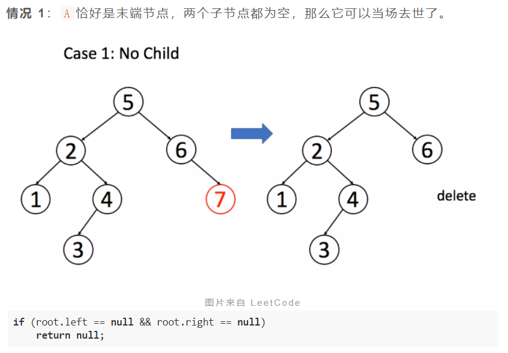

# [二叉树](https://labuladong.github.io/algo/2/18/)

举个例子，比如说我们的经典算法「快速排序」和「归并排序」，对于这两个算法，你有什么理解？**如果你告诉我，快速排序就是个二叉树的前序遍历，归并排序就是个二叉树的后序遍历，那么我就知道你是个算法高手了**。


---

## 226-翻转二叉树

> [`LeetCode`-226-简单](https://leetcode-cn.com/problems/invert-binary-tree/)
>
> 

```java
public class invertTree_226 {
    /**
     * 翻转一颗二叉树
     * */
    public TreeNode invertTree(TreeNode root) {
        // base case
        if (root == null) {
            return null;
        }

        // 前序遍历
        TreeNode tmp = root.left;
        root.left = root.right;
        root.right = tmp;

        // 让左右子节点继续翻转其子节点
        invertTree(root.left);
        invertTree(root.right);

        return root;
    }
}
```

---


## 116-填充每个节点的下一个右侧节点指针

> [`LeetCode`-116-中等](https://leetcode-cn.com/problems/populating-next-right-pointers-in-each-node/)
>
> 填充它的每个 next 指针，让这个指针指向其下一个右侧节点。如果找不到下一个右侧节点，则将 next 指针设置为 NULL。
>
> 初始状态下，所有 next 指针都被设置为 NULL。
>
> 
>
> 节点 5 和节点 6 不属于同一个父节点，那么按照这段代码的逻辑，它俩就没办法被穿起来，这是不符合题意的。
>
> 回想刚才说的，**二叉树的问题难点在于，如何把题目的要求细化成每个节点需要做的事情**，但是如果只依赖一个节点的话，肯定是没办法连接「跨父节点」的两个相邻节点的。
>
> 那么，我们的做法就是增加函数参数，一个节点做不到，我们就给他安排两个节点，「将每一层二叉树节点连接起来」可以细化成「将每两个相邻节点都连接起来」：

```java
public class connect_116 {

    class Node {
        public int val;
        public Node left;
        public Node right;
        public Node next;

        public Node() {}

        public Node(int _val) {
            val = _val;
        }

        public Node(int _val, Node _left, Node _right, Node _next) {
            val = _val;
            left = _left;
            right = _right;
            next = _next;
        }
    };

    public Node connect(Node root) {
        if (root == null) { return null; }
        connectTwoNode(root.left, root.right);

        return root;
    }

    void connectTwoNode(Node node1, Node node2) {
        if (node1 == null || node2 == null) { return; }
        // 前序遍历
        node1.next = node2;
        // 连接相同父节点的两个子节点
        connectTwoNode(node1.left, node1.right);
        connectTwoNode(node2.left, node2.right);
        // 连接跨越父节点的两个子节点
        connectTwoNode(node1.right, node2.left);
    }
}
```

---


## 114-二叉树展开为链表

> [`LeetCode`-114-中等](https://leetcode-cn.com/problems/flatten-binary-tree-to-linked-list/)
>
> 
>
> 我们尝试给出这个函数的定义：
>
> **给 `flatten` 函数输入一个节点 `root`，那么以 `root` 为根的二叉树就会被拉平为一条链表**。
>
> 我们再梳理一下，如何按题目要求把一棵树拉平成一条链表？很简单，以下流程：
>
> 1、将 `root` 的左子树和右子树拉平。
>
> 2、将 `root` 的右子树接到左子树下方，然后将整个左子树作为右子树。
>
> 

```java
public class flatten_114 {

    public void flatten(TreeNode root) {
        // base case
        if (root == null) { return; }
        // 将左右子树拉平
        flatten(root.left);
        flatten(root.right);
        // 后续遍历
        // 先保存左右子树
        TreeNode left = root.left;
        TreeNode right = root.right;
        // 将左子树作为右子树
        root.left = null;
        root.right = left;
        // 最后将右子树连接到左子树的末端
        TreeNode p = root;
        while (p != null) {
            p = p.right;
        }
        p.right = right;
    }
}
```


---


## 654-构造最大二叉树

> [`LeetCode-654-中等`](https://leetcode-cn.com/problems/maximum-binary-tree/)
>
> 
>
> 
>
> 


```java
public class constructMaximumBinaryTree_654 {

    void traverse(TreeNode root) {
        if (root == null) {
            return;
        }
        System.out.println(root.val);
        traverse(root.left);
        traverse(root.right);
    }

    public static void main(String[] args) {
        int[] nums = {3, 2, 1, 6, 0, 5};
        constructMaximumBinaryTree_654 cmb = new constructMaximumBinaryTree_654();
        cmb.traverse(cmb.constructMaximumBinaryTree(nums));
    }
    
    /**
     * 最大二叉树
     * */
    public TreeNode constructMaximumBinaryTree(int[] nums) {
        return build(nums, 0, nums.length-1);
    }

    TreeNode build(int[] nums, int lo, int hi) {
        // base case
        if (lo > hi) {
            return null;
        }

        // 找到数组中的最大值和对应的索引
        int index = -1, maxVal = Integer.MIN_VALUE;
        for (int i = lo; i <= hi; i++) {
            if (maxVal < nums[i]) {
                maxVal = nums[i];
                index = i;
            }
        }
        // 前序遍历
        TreeNode root = new TreeNode(maxVal);
        // 递归调用构造左右子树
        root.left = build(nums, lo, index-1);
        root.right = build(nums, index+1, hi);

        return root;
    }
}
```

---


## 105-从前序与中序遍历序列构造二叉树

> [`LeetCode-105-中等`](https://leetcode-cn.com/problems/construct-binary-tree-from-preorder-and-inorder-traversal/)
>
> 
>
> 


**写法一:**

```java
TreeNode build(int[] preorder, int preStart, int preEnd, 
               int[] inorder, int inStart, int inEnd) {

    if (preStart > preEnd) {
        return null;
    }

    // root 节点对应的值就是前序遍历数组的第一个元素
    int rootVal = preorder[preStart];
    // rootVal 在中序遍历数组中的索引
    int index = 0;
    for (int i = inStart; i <= inEnd; i++) {
        if (inorder[i] == rootVal) {
            index = i;
            break;
        }
    }

    int leftSize = index - inStart;

    // 先构造出当前根节点
    TreeNode root = new TreeNode(rootVal);
    // 递归构造左右子树
    root.left = build(preorder, preStart + 1, preStart + leftSize,
                      inorder, inStart, index - 1);

    root.right = build(preorder, preStart + leftSize + 1, preEnd,
                       inorder, index + 1, inEnd);
    return root;
}
```


**写法二:**

```java
public class buildTree_105 {
    /**
     * 给定一棵树的前序遍历 preorder 与中序遍历  inorder。
     * 请构造二叉树并返回其根节点。
     * 注意: 你可以假设树中没有重复的元素
     * */
    public TreeNode buildTree(int[] preorder, int[] inorder) {
        return build(preorder, 0, preorder.length-1,
                inorder, 0, inorder.length-1);
    }

    /**
     * 递归构造
     */
    private TreeNode build(int[] preorder, int preStart, int preEnd,
                           int[] inorder, int inStart, int inEnd) {
        // base case
        if (preStart > preEnd) {
            return null;
        }

        // root 对应的值 及 在 中序遍历中的索引
        int rootVal = preorder[preStart];
        int index = preStart;
        for (int i = inStart; i <= inEnd; i++) {
            if (rootVal == inorder[i]) {
                index = i;
                break;
            }
        }

        TreeNode root = new TreeNode(rootVal);
        int len_left = index - inStart;
        root.left = build(preorder, preStart+1, preStart+len_left,
                inorder, inStart, index-1);
        int len_right = inEnd - index;
        root.right = build(preorder, preEnd-len_right+1, preEnd,
                inorder, index+1, inEnd);

        return root;
    }
}
```

---


## 106-从中序与后序遍历序列构造二叉树

>[`LeetCode-106-中等`](https://leetcode-cn.com/problems/construct-binary-tree-from-inorder-and-postorder-traversal/)
>
>


**写法一:**

```java
TreeNode build(int[] inorder, int inStart, int inEnd,
               int[] postorder, int postStart, int postEnd) {

    if (inStart > inEnd) {
        return null;
    }
    // root 节点对应的值就是后序遍历数组的最后一个元素
    int rootVal = postorder[postEnd];
    // rootVal 在中序遍历数组中的索引
    int index = 0;
    for (int i = inStart; i <= inEnd; i++) {
        if (inorder[i] == rootVal) {
            index = i;
            break;
        }
    }
    // 左子树的节点个数
    int leftSize = index - inStart;
    TreeNode root = new TreeNode(rootVal);
    // 递归构造左右子树
    root.left = build(inorder, inStart, index - 1,
                        postorder, postStart, postStart + leftSize - 1);

    root.right = build(inorder, index + 1, inEnd,
                        postorder, postStart + leftSize, postEnd - 1);
    return root;
}
```


**写法二:**

```java
public class buildTree_106 {
    public TreeNode buildTree(int[] inorder, int[] postorder) {
        return build(inorder, 0, inorder.length-1,
                postorder, 0, postorder.length-1);
    }

    private TreeNode build(int[] inorder, int inStart, int inEnd,
                           int[] postorder, int postStart, int postEnd) {
        // base case
        if (postStart > postEnd) {
            return null;
        }

        // 找到root对应的值和索引
        int rootVal = postorder[postEnd];
        int index = postEnd;
        for (int i = inStart; i <= inEnd; i++) {
            if (inorder[i] == rootVal) {
                index = i;
                break;
            }
        }

        TreeNode root = new TreeNode(rootVal);
        int len_left = index - inStart;
        root.left = build(inorder, inStart, index-1,
                postorder, postStart, postStart+len_left-1);
        int len_right = inEnd - index;
        root.right = build(inorder, index+1, inEnd,
                postorder, postEnd-len_right, postEnd-1);

        return root;
    }
}
```

---

## 104-[二叉树的最大深度](https://leetcode-cn.com/problems/maximum-depth-of-binary-tree/description/)

给定一个二叉树，找出其最大深度。

二叉树的深度为根节点到最远叶子节点的最长路径上的节点数。

**说明:** 叶子节点是指没有子节点的节点。

**示例：**
给定二叉树 `[3,9,20,null,null,15,7]`，

```
    3
   / \
  9  20
    /  \
   15   7
```

返回它的最大深度 3 。


**代码格式:**

```java
//leetcode submit region begin(Prohibit modification and deletion)
/**
 * Definition for a binary tree node.
 * public class TreeNode {
 *     int val;
 *     TreeNode left;
 *     TreeNode right;
 *     TreeNode() {}
 *     TreeNode(int val) { this.val = val; }
 *     TreeNode(int val, TreeNode left, TreeNode right) {
 *         this.val = val;
 *         this.left = left;
 *         this.right = right;
 *     }
 * }
 */
class Solution {
    public int maxDepth(TreeNode root) {
        
    }
}
//leetcode submit region end(Prohibit modification and deletion)
```


> 遇到一道二叉树的题目时的通用思考过程是：
>
> **1、是否可以通过遍历一遍二叉树得到答案**？如果可以，用一个 `traverse` 函数配合外部变量来实现。
>
> **2、是否可以定义一个递归函数，通过子问题（子树）的答案推导出原问题的答案**？如果可以，写出这个递归函数的定义，并充分利用这个函数的返回值。
>
> **3、无论使用哪一种思维模式，你都要明白二叉树的每一个节点需要做什么，需要在什么时候（前中后序）做**。

**解法一:** 分解问题

~~~java
class Solution {
    public int maxDepth(TreeNode root) {
        if (root == null) {
           return 0;
        }

        int leftMax = maxDepth(root.left);
        int rightMax = maxDepth(root.right);
        return Math.max(leftMax, rightMax) + 1;
    }
}
~~~

**解法二:** 遍历二叉树

```java
class Solution {
    int depth = 0;
    int res = 0;

    public int maxDepth(TreeNode root) {
        traverse(root);
        return res;
    }

    void traverse(TreeNode root) {
        if (root == null) {
            // 到达叶子结点, 更新最大深度
            res = Math.max(res, depth);
            return;
        }

        depth++;
        traverse(root.left);
        traverse(root.right);
        depth--;
    }
}
```

---

## 543-[二叉树的直径](https://leetcode-cn.com/problems/diameter-of-binary-tree/description/)

给定一棵二叉树，你需要计算它的直径长度。一棵二叉树的直径长度是任意两个结点路径长度中的最大值。这条路径可能穿过也可能不穿过根结点。

 

**示例 :**
给定二叉树

```
          1
         / \
        2   3
       / \     
      4   5    
```

返回 **3**, 它的长度是路径 [4,2,1,3] 或者 [5,2,1,3]。

 

**注意：**两结点之间的路径长度是以它们之间边的数目表示。


**代码格式:**

```java
//leetcode submit region begin(Prohibit modification and deletion)
/**
 * Definition for a binary tree node.
 * public class TreeNode {
 *     int val;
 *     TreeNode left;
 *     TreeNode right;
 *     TreeNode() {}
 *     TreeNode(int val) { this.val = val; }
 *     TreeNode(int val, TreeNode left, TreeNode right) {
 *         this.val = val;
 *         this.left = left;
 *         this.right = right;
 *     }
 * }
 */
class Solution {
    public int diameterOfBinaryTree(TreeNode root) {

    }
}
//leetcode submit region end(Prohibit modification and deletion)
```


> 思路:
>
> 所谓二叉树的直径，就是左右子树的最大深度之和，那么直接的想法是对每个节点计算左右子树的最大高度，得出每个节点的直径，从而得出最大的那个直径。
>
> 灵活运用二叉树的后序遍历，在 `maxDepth` 的后序遍历位置顺便计算最大直径。

**解题:**

```java
class Solution {

    int maxDiameter = 0;

    public int diameterOfBinaryTree(TreeNode root) {
        maxDepth(root);
        return maxDiameter;
    }

    int maxDepth(TreeNode root) {
        if (root == null) {
            return 0;
        }

        int leftMax = maxDepth(root.left);
        int rightMax = maxDepth(root.right);
        maxDiameter = Math.max(maxDiameter, leftMax+rightMax);

        return 1 + Math.max(leftMax, rightMax);
    }
}
```

时间复杂度: O(N)


---

# 二叉搜索树


对于 BST 相关的问题，你可能会经常看到类似下面这样的代码逻辑：

```java
void BST(TreeNode root, int target) {
    if (root.val == target)
        // 找到目标，做点什么
    if (root.val < target) 
        BST(root.right, target);
    if (root.val > target)
        BST(root.left, target);
}
```

这个代码框架其实和二叉树的遍历框架差不多，无非就是利用了 BST 左小右大的特性而已。

---


## 230-BST第K小的元素

> 给定一个二叉搜索树的根节点 `root` ，和一个整数 `k` ，请你设计一个算法查找其中第 `k` 个最小元素（从 1 开始计数）。
>
> 

解法一:

```java
/**
 * Definition for a binary tree node.
 * public class TreeNode {
 *     int val;
 *     TreeNode left;
 *     TreeNode right;
 *     TreeNode() {}
 *     TreeNode(int val) { this.val = val; }
 *     TreeNode(int val, TreeNode left, TreeNode right) {
 *         this.val = val;
 *         this.left = left;
 *         this.right = right;
 *     }
 * }
 */
class Solution {
    public int kthSmallest(TreeNode root, int k) {
        traverse(root, k);
        return res;
    }
    
    int res = 0;
    int rank = 0;
    void traverse(TreeNode root, int k) {
        if (root == null) {
            return;
        }
        
        traverse(root.left, k);
        
        rank++;
        if (k == rank) {
            res = root.val;
            return;
        }
        
        traverse(root.right, k);
    }
    
}
```

如果按照我们刚才说的方法，利用「BST 中序遍历就是升序排序结果」这个性质，每次寻找第`k`小的元素都要中序遍历一次，最坏的时间复杂度是`O(N)`，`N`是 BST 的节点个数。

要知道 BST 性质是非常牛逼的，像红黑树这种改良的自平衡 BST，增删查改都是`O(logN)`的复杂度，让你算一个第`k`小元素，时间复杂度竟然要`O(N)`，有点低效了。

所以说，计算第`k`小元素，最好的算法肯定也是对数级别的复杂度，不过这个依赖于 BST 节点记录的信息有多少。


> 优化思路

那么回到这个问题，想找到第`k`小的元素，或者说找到排名为`k`的元素，如果想达到对数级复杂度，关键也在于每个节点得知道他自己排第几。

比如说你让我查找排名为`k`的元素，当前节点知道自己排名第`m`，那么我可以比较`m`和`k`的大小：

1、如果`m == k`，显然就是找到了第`k`个元素，返回当前节点就行了。

2、如果`k < m`，那说明排名第`k`的元素在左子树，所以可以去左子树搜索第`k`个元素。

3、如果`k > m`，那说明排名第`k`的元素在右子树，所以可以去右子树搜索第`k - m - 1`个元素。

这样就可以将时间复杂度降到`O(logN)`了。


**那么，如何让每一个节点知道自己的排名呢？**

这就是我们之前说的，需要在二叉树节点中维护额外信息。**每个节点需要记录，以自己为根的这棵二叉树有多少个节点**。

也就是说，我们`TreeNode`中的字段应该如下：

```java
class TreeNode {
    int val;
    // 以该节点为根的树的节点总数
    int size;
    TreeNode left;
    TreeNode right;
}
```

有了`size`字段，外加 BST 节点左小右大的性质，对于每个节点`node`就可以通过`node.left`推导出`node`的排名，从而做到我们刚才说到的对数级算法。(应该是: `node.left.size+1`)

当然，`size`字段需要在增删元素的时候需要被正确维护，力扣提供的`TreeNode`是没有`size`这个字段的，所以我们这道题就只能利用 BST 中序遍历的特性实现了，但是我们上面说到的优化思路是 BST 的常见操作，还是有必要理解的。


## 538/1038-把二叉搜索树转换为累加树

> 给出二叉 搜索 树的根节点，该树的节点值各不相同，请你将其转换为累加树（Greater Sum Tree），使每个节点 node 的新值等于原树中大于或等于 `node.val` 的值之和。
>
> 提醒一下，二叉搜索树满足下列约束条件：
>
> 节点的左子树仅包含键 小于 节点键的节点。
> 节点的右子树仅包含键 大于 节点键的节点。
> 左右子树也必须是二叉搜索树。
>
> 
>
> 题目应该不难理解，比如图中的节点 5，转化成累加树的话，比 5 大的节点有 6，7，8，加上 5 本身，所以累加树上这个节点的值应该是 5+6+7+8=26。

按照二叉树的通用思路，需要思考每个节点应该做什么，但是这道题上很难想到什么思路。

BST 的每个节点左小右大，这似乎是一个有用的信息，既然累加和是计算大于等于当前值的所有元素之和，那么每个节点都去计算右子树的和，不就行了吗？

这是不行的。对于一个节点来说，确实右子树都是比它大的元素，但问题是它的父节点也可能是比它大的元素呀？这个没法确定的，我们又没有触达父节点的指针，所以二叉树的通用思路在这里用不了。

**其实，正确的解法很简单，还是利用 BST 的中序遍历特性**。

> **只不过这里需要修改遍历的顺序, 并借助一个外部变量!**

```java
/**
 * Definition for a binary tree node.
 * public class TreeNode {
 *     int val;
 *     TreeNode left;
 *     TreeNode right;
 *     TreeNode() {}
 *     TreeNode(int val) { this.val = val; }
 *     TreeNode(int val, TreeNode left, TreeNode right) {
 *         this.val = val;
 *         this.left = left;
 *         this.right = right;
 *     }
 * }
 */
class Solution {
    public TreeNode convertBST(TreeNode root) {
        traverse(root);
        
        return root;
    }
    
    int sum = 0;
    
    void traverse(TreeNode root) {
        if (root == null) {
            return;
        }
        
        traverse(root.right);
        
        sum += root.val;
        root.val = sum;
        
        traverse(root.left);
    }
}
```

---


## 450-删除二叉搜索树中的节点

> 给定一个二叉搜索树的根节点 root 和一个值 key，删除二叉搜索树中的 key 对应的节点，并保证二叉搜索树的性质不变。返回二叉搜索树（有可能被更新）的根节点的引用。
>
> 一般来说，删除节点可分为两个步骤：
>
> 首先找到需要删除的节点；
> 如果找到了，删除它。
>
> 
>
> 


> 删除二叉树节点的代码逻辑:

```java
TreeNode deleteNode(TreeNode root, int key) {
    if (root.val == key) {
        // 找到啦，进行删除
    } else if (root.val > key) {
        // 去左子树找
        root.left = deleteNode(root.left, key);
    } else if (root.val < key) {
        // 去右子树找
        root.right = deleteNode(root.right, key);
    }
    return root;
}
```


> 找到目标节点了，比方说是节点`A`，如何删除这个节点，这是难点。因为删除节点的同时不能破坏 BST 的性质。

**有三种情况，用图片来说明:** 




> 三种情况分析完毕，填入框架，简化一下代码：

```java
/**
 * Definition for a binary tree node.
 * public class TreeNode {
 *     int val;
 *     TreeNode left;
 *     TreeNode right;
 *     TreeNode() {}
 *     TreeNode(int val) { this.val = val; }
 *     TreeNode(int val, TreeNode left, TreeNode right) {
 *         this.val = val;
 *         this.left = left;
 *         this.right = right;
 *     }
 * }
 */
class Solution {
    public TreeNode deleteNode(TreeNode root, int key) {
        // base case
        if (root == null) { return null; }

        if (root.val == key) {
            // 这两个 if 把情况 1 和 2 都正确处理了
            if (root.left == null) { return root.right; }
            if (root.right == null) { return root.left; }
            // 情况3: 两个节点都有的情况 (获得右子树中最小的)
            TreeNode minNode = getMin(root.right);
            // 把 root 改成 minNode
            root.val = minNode.val;
            // 转而去删除 minNode
            root.right = deleteNode(root.right, minNode.val);
        } else if (root.val > key) {
            // 去左子树找
            root.left = deleteNode(root.left, key);
        } else if (root.val < key) {
            // 去右子树找
            root.right = deleteNode(root.right, key);
        }
        return root;
    }

    /**
     * 获得右子树中最小的
     * */
    TreeNode getMin(TreeNode node) {
        // BST 最左边的就是最小的
        while (node.left != null) {
            node = node.left;
        }
        return node;
    }
}
```

删除操作就完成了。

注意一下，这个删除操作并不完美，因为我们一般不会通过`root.val = minNode.val`修改节点内部的值来交换节点，而是通过一系列略微复杂的链表操作交换`root`和`minNode`两个节点。

因为具体应用中，`val`域可能会是一个复杂的数据结构，修改起来非常麻烦；而链表操作无非改一改指针，而不会去碰内部数据。

不过这里我们暂时忽略这个细节，旨在突出 BST 基本操作的共性，以及借助框架逐层细化问题的思维方式。

---


## 701-二叉树中的插入操作

> 给定二叉搜索树（BST）的根节点和要插入树中的值，将值插入二叉搜索树。 返回插入后二叉搜索树的根节点。输入数据 保证 ，新值和原始二叉搜索树中的任意节点值都不同。
>
> 注意，可能存在多种有效的插入方式，只要树在插入后仍保持为二叉搜索树即可。 你可以返回 任意有效的结果 。
>
> 

对数据结构的操作无非遍历 + 访问，遍历就是「找」，访问就是「改」。

具体到这个问题，插入一个数，就是先找到插入位置，然后进行插入操作。

**一旦涉及「改」，函数就要返回 `TreeNode` 类型，并且对递归调用的返回值进行接收**。

```java
class Solution {
    TreeNode insertIntoBST(TreeNode root, int val) {
        // 找到空位置插入新节点
        if (root == null) return new TreeNode(val);
        
        // if (root.val == val)
        //     BST 中一般不会插入已存在元素
        if (root.val < val) 
            root.right = insertIntoBST(root.right, val);
        if (root.val > val) 
            root.left = insertIntoBST(root.left, val);
        return root;
	}
}
```

---


## 700-二叉搜索树中的搜索

> 给定二叉搜索树（BST）的根节点和一个值。 你需要在BST中找到节点值等于给定值的节点。 返回以该节点为根的子树。 如果节点不存在，则返回 NULL。
>
> 


> 其实不需要递归地搜索两边，类似二分查找思想，根据 `target` 和 `root.val` 的大小比较，就能排除一边。

写法一:

```java
class Solution {
    public TreeNode searchBST(TreeNode root, int val) {
        if (root == null) { return null; }

        if (val == root.val) {
            return root;
        } else if (val < root.val) {
            return searchBST(root.left, val);
        } else if (val > root.val) {
            return searchBST(root.right, val);
        }

        return null;
    }
}
```

写法二: (优化后)

```java
class Solution {
    TreeNode searchBST(TreeNode root, int target) {
        if (root == null) {
            return null;
        }
        // 去左子树搜索
        if (root.val > target) {
            return searchBST(root.left, target);
        }
        // 去右子树搜索
        if (root.val < target) {
            return searchBST(root.right, target);
        }
        return root;
    }
}
```

---


## 98-验证二叉搜索树

> 给你一个二叉树的根节点 root ，判断其是否是一个有效的二叉搜索树。
>
> 有效 二叉搜索树定义如下：
>
> - 节点的左子树只包含 **小于** 当前节点的数。
> - 节点的右子树只包含 **大于** 当前节点的数。
> - 所有左子树和右子树自身必须也是二叉搜索树。
>
> 


> 分析过程


**出现问题的原因在于，对于每一个节点`root`，代码值检查了它的左右孩子节点是否符合左小右大的原则；**

**但是根据 BST 的定义，`root`的整个左子树都要小于`root.val`，整个右子树都要大于`root.val`**。

> 问题是，对于某一个节点`root`，他只能管得了自己的左右子节点，怎么把`root`的约束传递给左右子树呢？

请看正确的代码：

```java
class Solution {
    public boolean isValidBST(TreeNode root) {
        return isValidBST(root, null, null);
    }

    private boolean isValidBST(TreeNode root, TreeNode min, TreeNode max) {
        if (root == null) { return true; }

        if (min != null && root.val <= min.val) { return false; }
        if (max != null && root.val >= max.val) { return false; }

        // 节点的左子树只包含 **小于** 当前节点的数。
        // 节点的右子树只包含 **大于** 当前节点的数。
        // 所有左子树和右子树自身必须也是二叉搜索树。
        return isValidBST(root.left, min, root) && isValidBST(root.right, root, max);
    }

}
```

**我们通过使用辅助函数，增加函数参数列表，在参数中携带额外信息，将这种约束传递给子树的所有节点，这也是二叉树算法的一个小技巧吧**。

---


## 96-不同的二叉搜索树

> https://leetcode-cn.com/problems/unique-binary-search-trees/
>
> 给你一个整数 `n` ，求恰由 `n` 个节点组成且节点值从 `1` 到 `n` 互不相同的 **二叉搜索树** 有多少种？
>
> 返回满足题意的二叉搜索树的种数。
>
> 

**这就是一个正宗的穷举问题，那么什么方式能够正确地穷举合法 BST 的数量呢？**

我们前文说过，不要小看「穷举」，这是一件看起来简单但是比较有技术含量的事情，问题的关键就是不能数漏，也不能数多，你咋整？

**二叉树算法的关键就在于明确根节点需要做什么，其实 BST 作为一种特殊的二叉树，核心思路也是一样的。**

举个例子，比如给算法输入 `n = 5`，也就是说用 `{1,2,3,4,5}` 这些数字去构造 BST。

**首先，这棵 BST 的根节点总共有几种情况？**

显然有 5 种情况对吧，因为每个数字都可以作为根节点。

比如说我们固定 `3` 作为根节点，这个前提下能有几种不同的 BST 呢？

**根据 BST 的特性，根节点的左子树都比根节点的值小，右子树的值都比根节点的值大。**

所以如果固定 `3` 作为根节点，左子树节点就是 `{1,2}` 的组合，右子树就是 `{4,5}` 的组合。

**左子树的组合数和右子树的组合数乘积**就是 `3` 作为根节点时的 BST 个数。


我们这是说了 `3` 为根节点这一种特殊情况，其实其他的节点也是一样的。

注意 base case，显然当 `lo > hi` 闭区间 `[lo, hi]` 肯定是个空区间，也就对应着空节点 null，虽然是空节点，但是也是一种情况，所以要返回 1 而不能返回 0。

这样，题目的要求已经实现了，但是时间复杂度非常高，肯定存在重叠子问题。

消除重叠子问题的方法，无非就是加一个备忘录：

```java
class Solution {
    
    /**
     * 备忘录
     * */
    private int[][] memo;
    
    public int numTrees(int n) {
        // 备忘录的值初始化为 0
        memo = new int[n+1][n+1];
        
        // 计算闭区间 [1, n] 组成的 BST 个数
        return count(1, n);
    }
    
    /**
     * 计算闭区间 [lo, hi] 组成的 BST 个数
     * */
    int count(int lo, int hi) {
        //base code
        if (lo > hi) {
            return 1;
        }
        
        // 查备忘录
        if (memo[lo][hi] != 0) {
            return memo[lo][hi];
        }

        int res = 0;
        for (int i = lo; i <= hi; i++) {
            // i 的值作为根节点 root
            int left = count(lo, i-1);
            int right = count(i+1, hi);
            // 左右子树的组合数乘积是 BST 的总数
            res += left * right;
        }
        
        // 将结果存入备忘录
        memo[lo][hi] = res;

        return res;
    }
}
```

---


## 95-不同的二叉搜索树 II

那么，如果给一个进阶题目，不止让你计算有几个不同的 BST，而是要你构建出所有合法的 BST，如何实现这个算法呢？

> https://leetcode-cn.com/problems/unique-binary-search-trees-ii/
>
> 给你一个整数 `n` ，请你生成并返回所有由 `n` 个节点组成且节点值从 `1` 到 `n` 互不相同的不同 **二叉搜索树** 。
>
> 可以按 **任意顺序** 返回答案。
>
> 


**直接看代码：**

```java
/**
 * Definition for a binary tree node.
 * public class TreeNode {
 *     int val;
 *     TreeNode left;
 *     TreeNode right;
 *     TreeNode() {}
 *     TreeNode(int val) { this.val = val; }
 *     TreeNode(int val, TreeNode left, TreeNode right) {
 *         this.val = val;
 *         this.left = left;
 *         this.right = right;
 *     }
 * }
 */
class Solution {
    public List<TreeNode> generateTrees(int n) {
        if (n == 0) {
            return new LinkedList<>();
        }

        // 构造闭区间 [1, n] 组成的 BST
        return build(1, n);
    }
    
    /**
     * 构造闭区间 [lo, hi] 组成的 BST
     * */
    private List<TreeNode> build(int lo, int hi) {
        List<TreeNode> res = new LinkedList<>();

        // base case
        if (lo > hi) {
            res.add(null);
            return res;
        }

        // 1 穷举 root 节点的所有可能
        for (int i = lo; i <= hi; i++) {
            // 2 递归构造出左右子树的所有合法BST
            List<TreeNode> leftTree = build(lo, i-1);
            List<TreeNode> rightTree = build(i+1, hi);
            // 3 给 root 节点穷举所有左右子树的组合
            for (TreeNode left : leftTree) {
                for (TreeNode right : rightTree) {
                    // i 作为根节点 root 的值
                    TreeNode root = new TreeNode(i);
                    root.left = left;
                    root.right = right;
                    res.add(root);
                }
            }
        }

        return res;
    }
    
}
```

---


## 1373-二叉搜索子树的最大键值和

> https://leetcode-cn.com/problems/maximum-sum-bst-in-binary-tree/
>
> 给你一棵以 root 为根的 二叉树 ，请你返回 任意 二叉搜索子树的最大键值和。
>
> 二叉搜索树的定义如下：
>
> 任意节点的左子树中的键值都 小于 此节点的键值。
> 任意节点的右子树中的键值都 大于 此节点的键值。
> 任意节点的左子树和右子树都是二叉搜索树。
>
> 
>
> **提示：**
>
> - 每棵树有 `1` 到 `40000` 个节点。
> - 每个节点的键值在 `[-4 * 10^4 , 4 * 10^4]` 之间。


**理论分析:**

后续遍历框架:

```java
void traverse(TreeNode root) {
    traverse(root.left);
    traverse(root.right);
    /* 后序遍历代码的位置 */
    /* 在这里处理当前节点 */
}
```

**如果当前节点要做的事情需要通过左右子树的计算结果推导出来，就要用到后序遍历**。


**那么我们想计算子树中 BST 的最大和，站在当前节点的视角，需要做什么呢**？

1、我肯定得知道左右子树是不是合法的 BST，如果这俩儿子有一个不是 BST，以我为根的这棵树肯定不会是 BST，对吧。

2、如果左右子树都是合法的 BST，我得瞅瞅左右子树加上自己还是不是合法的 BST 了。因为按照 BST 的定义，当前节点的值应该大于左子树的最大值，小于右子树的最小值，否则就破坏了 BST 的性质。

3、因为题目要计算最大的节点之和，如果左右子树加上我自己还是一棵合法的 BST，也就是说以我为根的整棵树是一棵 BST，那我需要知道我们这棵 BST 的所有节点值之和是多少，方便和别的 BST 争个高下，对吧。


**根据以上三点，站在当前节点的视角，需要知道以下具体信息**：

1、左右子树是否是 BST。

2、左子树的最大值和右子树的最小值。

3、左右子树的节点值之和。


伪代码大致逻辑:

```java
// 全局变量，记录 BST 最大节点之和
int maxSum = 0;

/* 主函数 */
public int maxSumBST(TreeNode root) {
    traverse(root);
    return maxSum;
}

/* 遍历二叉树 */
void traverse(TreeNode root) {
    if (root == null) {
        return;
    }

    /******* 前序遍历位置 *******/
    // 判断左右子树是不是 BST
    if (!isBST(root.left) || !isBST(root.right)) {
        goto next;
    }
    // 计算左子树的最大值和右子树的最小值
    int leftMax = findMax(root.left);
    int rightMin = findMin(root.right);
    // 判断以 root 节点为根的树是不是 BST
    if (root.val <= leftMax || root.val >= rightMin) {
        goto next;
    }
    // 如果条件都符合，计算当前 BST 的节点之和
    int leftSum = findSum(root.left);
    int rightSum = findSum(root.right);
    int rootSum = leftSum + rightSum + root.val;
    // 计算 BST 节点的最大和
    this.maxSum = Math.max(maxSum, rootSum);
    /**************************/

    // 递归左右子树
    next:
    traverse(root.left);
    traverse(root.right);
}

/* 计算以 root 为根的二叉树的最大值 */
int findMax(TreeNode root) {}

/* 计算以 root 为根的二叉树的最小值 */
int findMin(TreeNode root) {}

/* 计算以 root 为根的二叉树的节点和 */
int findSum(TreeNode root) {}

/* 判断以 root 为根的二叉树是否是 BST */
boolean isBST(TreeNode root) {}
```


**稍作分析就会发现，这几个辅助函数都是递归函数，都要遍历输入的二叉树，外加 `traverse` 函数本身的递归，可以说是递归上加递归，所以这个解法的复杂度是非常高的**。

但是根据刚才的分析，像 `leftMax`、`rootSum` 这些变量又都得算出来，否则无法完成题目的要求。

我们希望既算出这些变量，又避免辅助函数带来的额外复杂度，鱼和熊掌全都要！

其实是可以的，**只要把前序遍历变成后序遍历，让 `traverse` 函数把辅助函数做的事情顺便做掉**。


其他代码不变，我们让 `traverse` 函数做一些计算任务，返回一个数组：

> `traverse(root)` 返回一个大小为 4 的 `int` 数组，我们暂且称它为 `res`，其中：
>
> - `res[0]` 记录以 `root` 为根的二叉树是否是 BST，若为 1 则说明是 BST，若为 0 则说明不是 BST；
> - `res[1]` 记录以 `root` 为根的二叉树所有节点中的最小值；
> - `res[2]` 记录以 `root` 为根的二叉树所有节点中的最大值；
> - `res[3]` 记录以 `root` 为根的二叉树所有节点值之和。
>
> 其实这就是把之前分析中说到的几个值放到了 `res` 数组中，**最重要的是，我们要试图通过 `left` 和 `right` 正确推导出 `res` 数组**。

```java
class Solution {
    // 全局变量，记录 BST 最大节点之和
    int maxSum = 0;

    /* 主函数 */
    public int maxSumBST(TreeNode root) {
        traverse(root);
        return maxSum;
    }

    // 函数返回 res = new int[] {isBST, min, max, sum};
    int[] traverse(TreeNode root) {
        // base case
        if (root == null) {
            return new int[]{1, Integer.MAX_VALUE, Integer.MIN_VALUE, 0};
        }

        // 递归计算左右子树
        int[] left = traverse(root.left);
        int[] right = traverse(root.right);

        /******* 后序遍历位置 *******/
        int[] res = new int[4];
        // 这个 if 在判断以 root 为根的二叉树是不是 BST
        if (left[0] == 1 && right[0] == 1 
        && root.val > left[2] && root.val < right[1]) {
            // 以 root 为根的二叉树是 BST
            res[0] = 1;
            // 计算以 root 为根的这棵 BST 的最小值
            res[1] = Math.min(left[1], root.val);
            // 计算以 root 为根的这棵 BST 的最大值
            res[2] = Math.max(right[2], root.val);
            // 计算以 root 为根的这棵 BST 所有节点之和
            res[3] = left[3] + right[3] + root.val;
            // 更新全局变量
            maxSum = Math.max(maxSum, res[3]);
        } else {
            // 以 root 为根的二叉树不是 BST
            res[0] = 0;
            // 其他的值都没必要计算了，因为用不到
        }

        return res;
    }
}
```

这样，这道题就解决了，`traverse` 函数在遍历二叉树的同时顺便把之前辅助函数做的事情都做了，避免了在递归函数中调用递归函数，时间复杂度只有 O(N)。

你看，这就是后序遍历的妙用，相对前序遍历的解法，现在的解法不仅效率高，而且代码量少，比较优美。


> 这道题为什么用后序遍历呢，因为我们需要的这些变量都是可以通过后序遍历得到的。

你计算以 `root` 为根的二叉树的节点之和，是不是可以通过左右子树的和加上 `root.val` 计算出来？

你计算以 `root` 为根的二叉树的最大值/最小值，是不是可以通过左右子树的最大值/最小值和 `root.val` 比较出来？

你判断以 `root` 为根的二叉树是不是 BST，是不是得先判断左右子树是不是 BST？是不是还得看看左右子树的最大值和最小值？

文章开头说过，**如果当前节点要做的事情需要通过左右子树的计算结果推导出来，就要用到后序遍历**。

因为以上几点都可以通过后序遍历的方式计算出来，所以这道题使用后序遍历肯定是最高效的。

---


---


