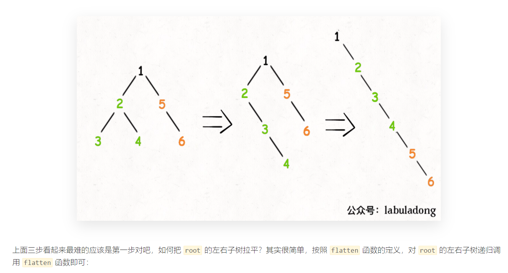
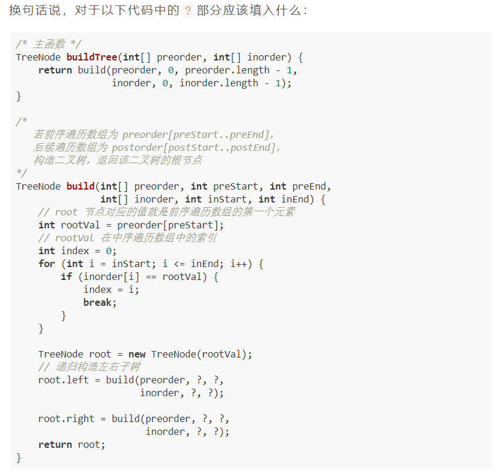

# [二叉树](https://labuladong.github.io/algo/2/18/)

举个例子，比如说我们的经典算法「快速排序」和「归并排序」，对于这两个算法，你有什么理解？**如果你告诉我，快速排序就是个二叉树的前序遍历，归并排序就是个二叉树的后序遍历，那么我就知道你是个算法高手了**。


---

## 226-翻转二叉树

> [`LeetCode`-226-简单](https://leetcode-cn.com/problems/invert-binary-tree/)
>
> 

```java
public class invertTree_226 {
    /**
     * 翻转一颗二叉树
     * */
    public TreeNode invertTree(TreeNode root) {
        // base case
        if (root == null) {
            return null;
        }

        // 前序遍历
        TreeNode tmp = root.left;
        root.left = root.right;
        root.right = tmp;

        // 让左右子节点继续翻转其子节点
        invertTree(root.left);
        invertTree(root.right);

        return root;
    }
}
```

---


## 116-填充每个节点的下一个右侧节点指针

> [`LeetCode`-116-中等](https://leetcode-cn.com/problems/populating-next-right-pointers-in-each-node/)
>
> 填充它的每个 next 指针，让这个指针指向其下一个右侧节点。如果找不到下一个右侧节点，则将 next 指针设置为 NULL。
>
> 初始状态下，所有 next 指针都被设置为 NULL。
>
> 
>
> 节点 5 和节点 6 不属于同一个父节点，那么按照这段代码的逻辑，它俩就没办法被穿起来，这是不符合题意的。
>
> 回想刚才说的，**二叉树的问题难点在于，如何把题目的要求细化成每个节点需要做的事情**，但是如果只依赖一个节点的话，肯定是没办法连接「跨父节点」的两个相邻节点的。
>
> 那么，我们的做法就是增加函数参数，一个节点做不到，我们就给他安排两个节点，「将每一层二叉树节点连接起来」可以细化成「将每两个相邻节点都连接起来」：

```java
public class connect_116 {

    class Node {
        public int val;
        public Node left;
        public Node right;
        public Node next;

        public Node() {}

        public Node(int _val) {
            val = _val;
        }

        public Node(int _val, Node _left, Node _right, Node _next) {
            val = _val;
            left = _left;
            right = _right;
            next = _next;
        }
    };

    public Node connect(Node root) {
        if (root == null) { return null; }
        connectTwoNode(root.left, root.right);

        return root;
    }

    void connectTwoNode(Node node1, Node node2) {
        if (node1 == null || node2 == null) { return; }
        // 前序遍历
        node1.next = node2;
        // 连接相同父节点的两个子节点
        connectTwoNode(node1.left, node1.right);
        connectTwoNode(node2.left, node2.right);
        // 连接跨越父节点的两个子节点
        connectTwoNode(node1.right, node2.left);
    }
}
```

---


## 114-二叉树展开为链表

> [`LeetCode`-114-中等](https://leetcode-cn.com/problems/flatten-binary-tree-to-linked-list/)
>
> 
>
> 我们尝试给出这个函数的定义：
>
> **给 `flatten` 函数输入一个节点 `root`，那么以 `root` 为根的二叉树就会被拉平为一条链表**。
>
> 我们再梳理一下，如何按题目要求把一棵树拉平成一条链表？很简单，以下流程：
>
> 1、将 `root` 的左子树和右子树拉平。
>
> 2、将 `root` 的右子树接到左子树下方，然后将整个左子树作为右子树。
>
> 

```java
public class flatten_114 {

    public void flatten(TreeNode root) {
        // base case
        if (root == null) { return; }
        // 将左右子树拉平
        flatten(root.left);
        flatten(root.right);
        // 后续遍历
        // 先保存左右子树
        TreeNode left = root.left;
        TreeNode right = root.right;
        // 将左子树作为右子树
        root.left = null;
        root.right = left;
        // 最后将右子树连接到左子树的末端
        TreeNode p = root;
        while (p != null) {
            p = p.right;
        }
        p.right = right;
    }
}
```


---


## 654-构造最大二叉树

> [`LeetCode-654-中等`](https://leetcode-cn.com/problems/maximum-binary-tree/)
>
> 
>
> 
>
> 


```java
public class constructMaximumBinaryTree_654 {

    void traverse(TreeNode root) {
        if (root == null) {
            return;
        }
        System.out.println(root.val);
        traverse(root.left);
        traverse(root.right);
    }

    public static void main(String[] args) {
        int[] nums = {3, 2, 1, 6, 0, 5};
        constructMaximumBinaryTree_654 cmb = new constructMaximumBinaryTree_654();
        cmb.traverse(cmb.constructMaximumBinaryTree(nums));
    }
    
    /**
     * 最大二叉树
     * */
    public TreeNode constructMaximumBinaryTree(int[] nums) {
        return build(nums, 0, nums.length-1);
    }

    TreeNode build(int[] nums, int lo, int hi) {
        // base case
        if (lo > hi) {
            return null;
        }

        // 找到数组中的最大值和对应的索引
        int index = -1, maxVal = Integer.MIN_VALUE;
        for (int i = lo; i <= hi; i++) {
            if (maxVal < nums[i]) {
                maxVal = nums[i];
                index = i;
            }
        }
        // 前序遍历
        TreeNode root = new TreeNode(maxVal);
        // 递归调用构造左右子树
        root.left = build(nums, lo, index-1);
        root.right = build(nums, index+1, hi);

        return root;
    }
}
```

---


## 105-从前序与中序遍历序列构造二叉树

> [`LeetCode-105-中等`](https://leetcode-cn.com/problems/construct-binary-tree-from-preorder-and-inorder-traversal/)
>
> 
>
> 





**写法一:**

```java
TreeNode build(int[] preorder, int preStart, int preEnd, 
               int[] inorder, int inStart, int inEnd) {

    if (preStart > preEnd) {
        return null;
    }

    // root 节点对应的值就是前序遍历数组的第一个元素
    int rootVal = preorder[preStart];
    // rootVal 在中序遍历数组中的索引
    int index = 0;
    for (int i = inStart; i <= inEnd; i++) {
        if (inorder[i] == rootVal) {
            index = i;
            break;
        }
    }

    int leftSize = index - inStart;

    // 先构造出当前根节点
    TreeNode root = new TreeNode(rootVal);
    // 递归构造左右子树
    root.left = build(preorder, preStart + 1, preStart + leftSize,
                      inorder, inStart, index - 1);

    root.right = build(preorder, preStart + leftSize + 1, preEnd,
                       inorder, index + 1, inEnd);
    return root;
}
```


**写法二:**

```java
public class buildTree_105 {
    /**
     * 给定一棵树的前序遍历 preorder 与中序遍历  inorder。
     * 请构造二叉树并返回其根节点。
     * 注意: 你可以假设树中没有重复的元素
     * */
    public TreeNode buildTree(int[] preorder, int[] inorder) {
        return build(preorder, 0, preorder.length-1,
                inorder, 0, inorder.length-1);
    }

    /**
     * 递归构造
     */
    private TreeNode build(int[] preorder, int preStart, int preEnd,
                           int[] inorder, int inStart, int inEnd) {
        // base case
        if (preStart > preEnd) {
            return null;
        }

        // root 对应的值 及 在 中序遍历中的索引
        int rootVal = preorder[preStart];
        int index = preStart;
        for (int i = inStart; i <= inEnd; i++) {
            if (rootVal == inorder[i]) {
                index = i;
                break;
            }
        }

        TreeNode root = new TreeNode(rootVal);
        int len_left = index - inStart;
        root.left = build(preorder, preStart+1, preStart+len_left,
                inorder, inStart, index-1);
        int len_right = inEnd - index;
        root.right = build(preorder, preEnd-len_right+1, preEnd,
                inorder, index+1, inEnd);

        return root;
    }
}
```

---


## 106-从中序与后序遍历序列构造二叉树

>[`LeetCode-106-中等`](https://leetcode-cn.com/problems/construct-binary-tree-from-inorder-and-postorder-traversal/)
>
>


**写法一:**

```java
TreeNode build(int[] inorder, int inStart, int inEnd,
               int[] postorder, int postStart, int postEnd) {

    if (inStart > inEnd) {
        return null;
    }
    // root 节点对应的值就是后序遍历数组的最后一个元素
    int rootVal = postorder[postEnd];
    // rootVal 在中序遍历数组中的索引
    int index = 0;
    for (int i = inStart; i <= inEnd; i++) {
        if (inorder[i] == rootVal) {
            index = i;
            break;
        }
    }
    // 左子树的节点个数
    int leftSize = index - inStart;
    TreeNode root = new TreeNode(rootVal);
    // 递归构造左右子树
    root.left = build(inorder, inStart, index - 1,
                        postorder, postStart, postStart + leftSize - 1);

    root.right = build(inorder, index + 1, inEnd,
                        postorder, postStart + leftSize, postEnd - 1);
    return root;
}
```


**写法二:**

```java
public class buildTree_106 {
    public TreeNode buildTree(int[] inorder, int[] postorder) {
        return build(inorder, 0, inorder.length-1,
                postorder, 0, postorder.length-1);
    }

    private TreeNode build(int[] inorder, int inStart, int inEnd,
                           int[] postorder, int postStart, int postEnd) {
        // base case
        if (postStart > postEnd) {
            return null;
        }

        // 找到root对应的值和索引
        int rootVal = postorder[postEnd];
        int index = postEnd;
        for (int i = inStart; i <= inEnd; i++) {
            if (inorder[i] == rootVal) {
                index = i;
                break;
            }
        }

        TreeNode root = new TreeNode(rootVal);
        int len_left = index - inStart;
        root.left = build(inorder, inStart, index-1,
                postorder, postStart, postStart+len_left-1);
        int len_right = inEnd - index;
        root.right = build(inorder, index+1, inEnd,
                postorder, postEnd-len_right, postEnd-1);

        return root;
    }
}
```

---


