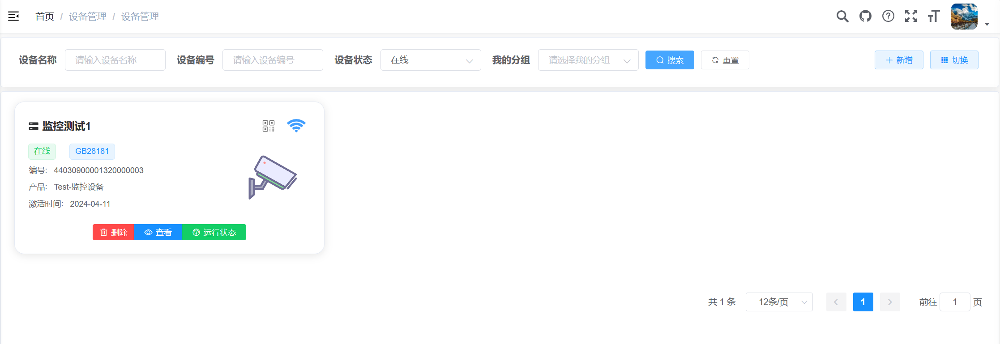
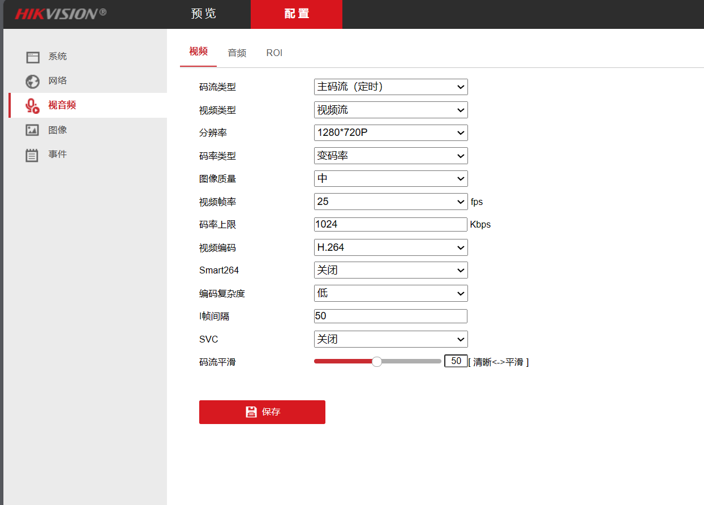

# FleetBee摄像头接入

> 参考文档：[监控设备接入 | FastBee文档](https://fastbee.cn/doc/pages/video_device/)

## 产品设置

> 设备管理-》产品管理-》新增产品

### 新增产品

### 新增SIP配置

> 注意！！！sip配置不支持修改，会同步java中application-prod.yml中的配置。

同步后的配置信息如下：

- 服务器ID = SIP服务器ID（海康） = SIP服务器编号（大华）
  34020000002000000001
- 服务器域 = SIP服务器域（海康） = SIP域（大华）
  3402000000
- 部署服务器公网IP = SIP服务器地址（海康） = SIP服务器IP（大华）【默认docker组内地址：177.7.0.13】
- 服务器端口 = SIP服务器端口（海康） = SIP服务器端口（大华）
  5061
- 认证密码 = 密码（海康） = 注册密码（大华）
  12345678

## 配置管理

- 服务器IP：修改流媒体服务器IP为部署服务器公网IP，默认为http播放协议，
- 服务器秘钥：http api鉴权秘钥，需与zlmedia/conf/config.ini中api->secret和hook->admin_params保持一致
- 服务器域名：用https播放协议，需修改zlmedia/conf/default.pem证书，同时修改服务器域名
- HOOK URL：修改HOOK URL为java服务api接口，默认为：java:8080,可根据自己的部署情况修改

**参考配置：**

**实际配置：**

> 说明：
>
> - 流媒体服务器部署在：zlmediakit容器部署的ip地址【公网IP】
>
> - java:8080部署在: java容器所在服务器的ip地址:8080
>

## 设备设置

> 设备管理-》新增，输入设备名称并选择所属产品，生成设备编号【生成设备ID和通道ID】，最后点击新增即可。

- **摄像头：设备类型为"IPC"，通道类型为"IPC"** 【此处为摄像头】
- 录像机：设备类型为"录像机"，通道类型为"录像机"
- NVR+IPC：设备类型为"NVR"，通道类型为"IPC"
- DVR+IPC：设备类型为"DVR"，通道类型为"IPC"

## 摄像头设置

### 发现设备

> 本次采用海康威视摄像头接入测试，需要将电脑和摄像头通过路由器处于同一局域网下，再通过海康威视提供的【设备网络搜索】软件找到该设备，进入设置页面进行相关操作。

**注意：千万不用选择DHCP，否则ip地址会发生变化，对后续操作会带来一定的困扰！！！**

---

### 进入设置页面

> 浏览器输入：192.168.31.69，进入该摄像头的设置页面。
>
> 服务器ID = SIP服务器ID（海康） = SIP服务器编号（大华）
> 34020000002000000001
> 服务器域 = SIP服务器域（海康） = SIP域（大华）
> 3402000000
>
> 部署服务器公网IP = SIP服务器地址（海康） = SIP服务器IP（大华）
> 【**java容器所在服务器的公网IP**】
> 服务器端口 = SIP服务器端口（海康） = SIP服务器端口（大华）
> 5061
> 认证密码 = 密码（海康） = 注册密码（大华）
> 12345678
>
> 设备ID = SIP用户名（海康） = SIP用户认证ID（海康） = 设备编号（大华）
> 44030900001320000003
> 通道ID = 视频通道编号ID（海康） = 通道编号（大华）
> 44030900001320000003

### 画面设置

> 若遇到视频卡顿，可以参考如下配置
>
> 【摄像头流媒体格式建议为：视频：h264 音频：aac】

参考配置：

我的配置：

## 完成效果

> 测试页面用纸巾遮住了

