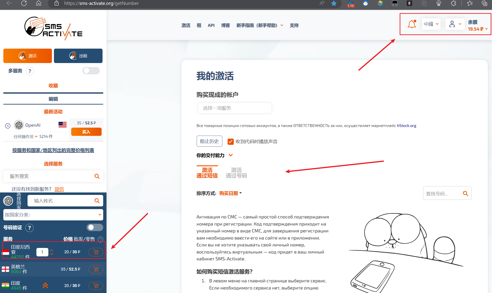
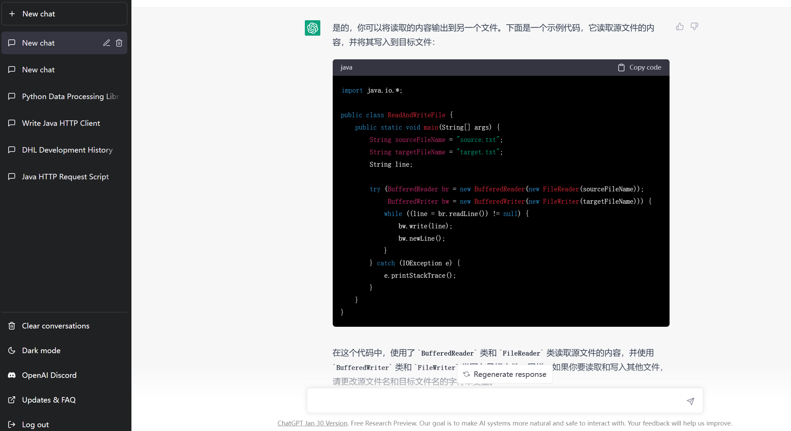

# 快速上手

## 第一步

> 使用【科学上网】工具，ip为美国！

仅供参考：【[魔戒.net (mojie.buzz)](https://mojie.buzz/)】

## 第二步

> 注册 ChatGPT 账号

【2.1此步要先完成】需要SMS短信验证码的网站：https://sms-activate.org/   

【2.2 再注册】登录官网：https://chat.openai.com/chat

在【服务搜索】中输出 【OpenAI】，点击它，选择【印度尼西亚】，购买虚拟号码短信接收服务。

- 注：需要先注册-登录-再充值 0.2美分（如下图），可通过支付宝付款。
- 注册【ChatGPT】账号时填入收到的短信验证码，激活账号即可

## 第三步

> 再次返回登录界面，开始使用

