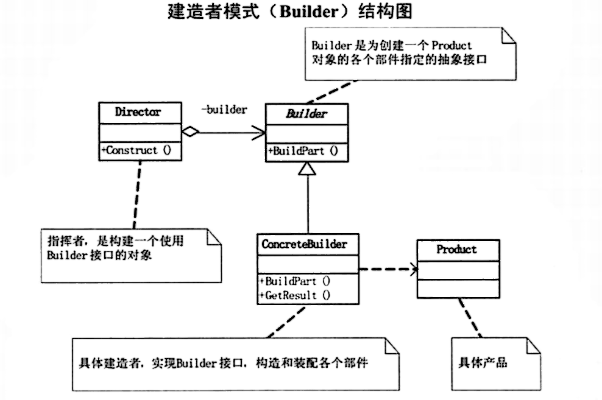

# 建造者模式 Builder

## 奶茶的制作

> **将一个复杂的构建与其表示相分离，使得同样的构建过程可以创建不同的表示。**

- 建造者模式用于创建过程稳定，但配置多变的对象。

- 经典的“建造者-指挥者”模式现在已经不太常用了，现在建造者模式主要用来通过链式调用生成不同的配置。

- 比如我们要制作一杯珍珠奶茶。
  - 它的制作过程是稳定的，
  - 除了必须要知道奶茶的种类和规格外，
  - 是否加珍珠和是否加冰是可选的。
- 使用建造者模式表示如下：

> MilkTea
>
> [静态内部类的简单理解](https://blog.csdn.net/m0_38109913/article/details/78334301)

```java
package BuilderPattern;

public class MilkTea {

    private String type;
    private String size;
    private boolean pearl;
    private boolean ice;

	private MilkTea() {
    }
	
    private MilkTea(Builder builder) {
        this.type = builder.type;
        this.size = builder.size;
        this.pearl = builder.pearl;
        this.ice = builder.ice;
    }

    public String getType() {
        return type;
    }

    public String getSize() {
        return size;
    }

    public boolean isPearl() {
        return pearl;
    }
    public boolean isIce() {
        return ice;
    }

    public static class Builder {
        // 如果不配置，将使用默认配置，也就是中杯、加珍珠、不加冰
        private String type;
        private String size = "中杯";
        private boolean pearl = true;
        private boolean ice = false;

        public Builder(String type) {
            this.type = type;
        }

        public Builder size(String size) {
            this.size = size;
            return this;
        }

        public Builder pearl(boolean pearl) {
            this.pearl = pearl;
            return this;
        }

        public Builder ice(boolean cold) {
            this.ice = cold;
            return this;
        }

        public MilkTea build() {
            return new MilkTea(this);
        }
    }
}
```

- 可以看到，我们将 `MilkTea` 的构造方法设置为私有的，所以外部不能通过 new 构建出 `MilkTea `实例，只能通过 `Builder` 构建。
- 对于必须配置的属性，通过 `Builder` 的构造方法传入，
  - 可选的属性通过 `Builder` 的链式调用方法传入，
  - 如果不配置，将使用默认配置，也就是中杯、加珍珠、不加冰。
- 根据不同的配置可以制作出不同的奶茶：

> User

```java
package BuilderPattern;

public class User {
    public static void main(String[] args) {
        buyMilkTea();
    }

    private static void buyMilkTea() {
        MilkTea milkTea = new MilkTea.Builder("原味").build();
        show(milkTea);

        MilkTea chocolate =new MilkTea.Builder("巧克力味")
                .ice(false)
                .build();
        show(chocolate);
        
        MilkTea strawberry = new MilkTea.Builder("草莓味")
                .size("大杯")
                .pearl(false)
                .ice(true)
                .build();
        show(strawberry);
    }

    private static void show(MilkTea milkTea) {
        String pearl;
        if (milkTea.isPearl())
            pearl = "加珍珠";
        else
            pearl = "不加珍珠";
        String ice;
        if (milkTea.isIce()) {
            ice = "加冰";
        } else {
            ice = "不加冰";
        }
        System.out.println("一份" + milkTea.getSize() + "、"
                + pearl + "、"
                + ice + "的"
                + milkTea.getType() + "奶茶");
    }
}
```

> 输出结果：
>
> 一份中杯、加珍珠、不加冰的原味奶茶
> 一份中杯、加珍珠、不加冰的巧克力味奶茶
> 一份大杯、不加珍珠、加冰的草莓味奶茶  

[参考来源](https://leetcode-cn.com/leetbook/read/design-patterns/99sjd7/)

------

## 建造者模式解析

> 结构图 
>
> 来源于 `大话设计模式`





> 基本代码

- `Director`: 指挥者类，用来指挥建造过程 （类似于`buyMilkTea`）

  ```java
  public class Director {
      public void Construct(Builder builder) {
          builder.BuilderPartA();
          builder.BuilderPartB();
      }
  }
  ```

  

- `Builder`：抽象建造者类，确定产品由两个部件`PartA`和`PartB`组成，并声明一个得到产品建造后结果的方法`GetResult`（类似于`奶茶中的Builder类`）

  ```java
  public abstract class Builder {
      public abstract void BuilderPartA();
      public abstract void BuilderPartB();
  
      public abstract Product GetResult();
  }
  ```

  

  - `ConcreteBuilder1`类：具体建造者类

    ```java
    public class ConcreteBuilder1 extends Builder {
    
        private Product product = new Product();
    
        @Override
        public void BuilderPartA() {
            product.Add("部件A");
        }
    
        @Override
        public void BuilderPartB() {
            product.Add("部件B");
        }
    
        @Override
        public Product GetResult() {
            return product;
        }
        
    }
    ```

    

  - `ConcreteBuilder2`类：具体建造者类

    ```java
    public class ConcreteBuilder2 extends Builder {
    
        private Product product = new Product();
    
        @Override
        public void BuilderPartA() {
            product.Add("部件X");
        }
    
        @Override
        public void BuilderPartB() {
            product.Add("部件Y");
        }
    
        @Override
        public Product GetResult() {
            return product;
        }
        
    }
    ```

    

- `Product`：产品类，有多个部件组成（类似于`MilkTea`）

  ```java
  import java.util.ArrayList;
  import java.util.List;
  
  public class Product {
      List<String> parts = new ArrayList<>();
  
      public void Add(String part) {
          parts.add(part);
      }
  
      public void Show() {
          System.out.println("\n 产品创建 ----");
          for (String part : parts) {
              System.out.println(part);
          }
      }
  }
  ```

- 测试：

  ```java
  public class Test {
      public static void main(String[] args) {
          Director director = new Director();
          Builder b1 = new ConcreteBuilder1();
          Builder b2 = new ConcreteBuilder2();
  
          director.Construct(b1);
          Product p1 = b1.GetResult();
          p1.Show();
  
          director.Construct(b2);
          Product p2 = b2.GetResult();
          p2.Show();
      }
  }
  
  // 输出:
   产品创建 ----
  部件A
  部件B
  
   产品创建 ----
  部件X
  部件Y
  ```

  

> **小结：**在
>
> 当`创建复杂对象的算法`应该独立于`该对象的组成部分`以及它们的`装配方式`时
>
> 适用的模式。
>
> - Builder：`创建复杂对象的算法`---`奶茶 Builder`
> - Product：`该对象的组成部分`---`奶茶MilkTea`
> - Director：`装配方式`---`奶茶buyMilkTea`

## 奶茶制作的解析

> 产品类和建造者类

```java
package BuilderPattern;

// 产品类
public class MilkTea {

    // 组成部分
    private final String type;
    private final String size;
    private final boolean pearl;
    private final boolean ice;

    private MilkTea(Builder builder) {
        this.type = builder.type;
        this.size = builder.size;
        this.pearl = builder.pearl;
        this.ice = builder.ice;
    }

    public String getType() {
        return type;
    }

    public String getSize() {
        return size;
    }

    public boolean isPearl() {
        return pearl;
    }
    public boolean isIce() {
        return ice;
    }

    // 建造者类，由于奶茶只有一家奶茶店，所以没有抽象建造者，若有多家奶茶店，再抽象。
    public static class Builder {
        // 如果不配置，将使用默认配置，也就是中杯、加珍珠、不加冰
        private String type;
        private String size = "中杯";
        private boolean pearl = true;
        private boolean ice = false;

        public Builder(String type) {
            this.type = type;
        }

        public Builder size(String size) {
            this.size = size;
            return this;
        }

        public Builder pearl(boolean pearl) {
            this.pearl = pearl;
            return this;
        }

        public Builder ice(boolean cold) {
            this.ice = cold;
            return this;
        }

        // 等价于 GetResult方法，得到建造后的产品结果
        public MilkTea build() {
            return new MilkTea(this);
        }
    }
}
```

> 指挥者类

```java
package BuilderPattern;

public class User {
    // 测试
    public static void main(String[] args) {
        buyMilkTea();
    }

    // 指挥者类，用来指挥建造过程
    private static void buyMilkTea() {
        MilkTea milkTea = new MilkTea.Builder("原味").build();
        show(milkTea);

        MilkTea chocolate =new MilkTea.Builder("巧克力味")
                .ice(false)
                .build();
        show(chocolate);
        
        MilkTea strawberry = new MilkTea.Builder("草莓味")
                .size("大杯")
                .pearl(false)
                .ice(true)
                .build();
        show(strawberry);
    }

    private static void show(MilkTea milkTea) {
        String pearl;
        if (milkTea.isPearl())
            pearl = "加珍珠";
        else
            pearl = "不加珍珠";
        String ice;
        if (milkTea.isIce()) {
            ice = "加冰";
        } else {
            ice = "不加冰";
        }
        System.out.println("一份" + milkTea.getSize() + "、"
                + pearl + "、"
                + ice + "的"
                + milkTea.getType() + "奶茶");
    }
}
```

> 需要自己去学习和分析静态内部类！

