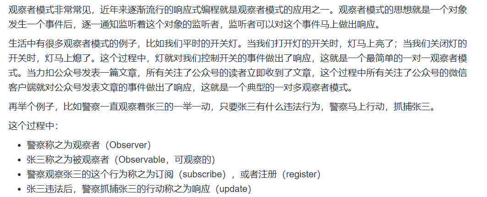
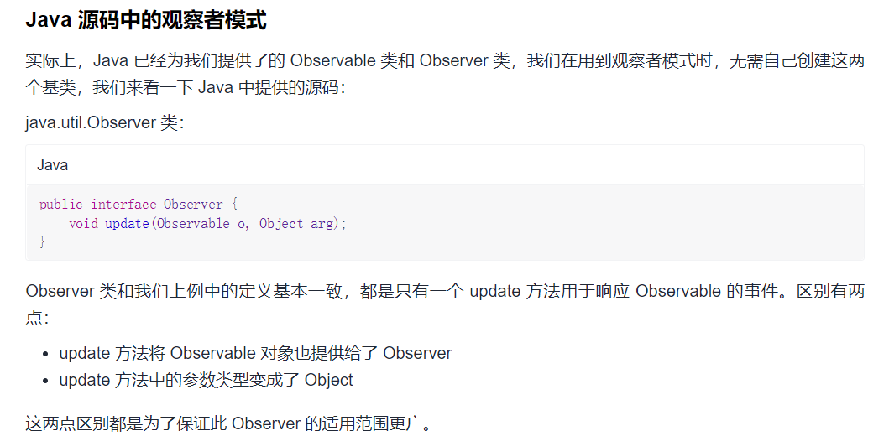

# Observer

## 观察者模式: 警察与罪犯

> 处理一对多的依赖关系，被观察的对象改变时，多个观察者都能收到通知



**众所周知，张三坏事做尽，是一个老法外狂徒了，所以不止一个警察会盯着张三，也就是说一个被观察者可以有多个观察者。当被观察者有事件发生时，所有观察者都能收到通知并响应。观察者模式主要处理的是一种一对多的依赖关系。它的定义如下：**

> 观察者模式（Observer Pattern）：定义对象间的一种一对多的依赖关系，当一个对象的状态发生改变时，所有依赖于它的对象都得到通知并被自动更新。

**观察者的接口：**

```java
package com.DesignPattern.Observer;

// 观察者接口 --- 基类1
public interface Observer {
    // 接口中只有一个 update 方法，用于对被观察者发出的事件做出响应。
    void update(String event);
}
```

**被观察者中维护了一个观察者列表，提供了三个方法：**

- addObserver：将 observer 对象添加到观察者列表中
- removeObserver：将 observer 对象从观察者列表中移除
- notifyObservers：通知所有观察者有事件发生，具体实现是调用所有观察者的 update 方法

```java
package com.DesignPattern.Observer;

import java.util.ArrayList;
import java.util.List;

// 被观察者的父类：--- 基类2
public class Observable {
    private List<Observer> observers = new ArrayList<>();

    public void addObserver(Observer observer) {
        observers.add(observer);
    }

    public void removeObserver(Observer observer) {
        observers.remove(observer);
    }

    public void notifyObservers(String event) {
        for (Observer observer : observers) {
            observer.update(event);
        }
    }
}
```

**警察属于观察者：**

```java
package com.DesignPattern.Observer;

// 警察属于观察者：
public class PoliceObserver  implements Observer{

    // 响应
    @Override
    public void update(String event) {
        // 警察实现了观察者接口，当警察收到事件后，做出响应，这里的响应就是简单的打印了一条日志。
        System.out.println("警察收到消息，罪犯在" + event);
    }
}
```

**罪犯继承自被观察者类，当罪犯有犯罪行为时，所有的观察者都会收到通知。**

```java
package com.DesignPattern.Observer;

// 罪犯属于被观察者：
public class CriminalObservable extends Observable{
    // 罪犯继承自被观察者类，当罪犯有犯罪行为时，所有的观察者都会收到通知。
    public void crime(String event) {
        System.out.println("罪犯正在" + event);
        notifyObservers(event);
    }
}
```

**在客户端中，我们 new 了一个张三，为其添加了三个观察者：police1，police2，police3。**

```java
package com.DesignPattern.Observer;


import org.junit.Test;

public class Client {
    @Test
    public void test(){
        // 被观察者
        CriminalObservable zhangSan = new CriminalObservable();
        // 观察者
        PoliceObserver police1 = new PoliceObserver();
        PoliceObserver police2 = new PoliceObserver();
        PoliceObserver police3 = new PoliceObserver();
        // 订阅 或 注册
        zhangSan.addObserver(police1);
        zhangSan.addObserver(police2);
        zhangSan.addObserver(police3);
        // 张三违法, 警察抓捕
        zhangSan.crime("在嫖娼");
    }
}
```

> 输出:

```java
罪犯正在在嫖娼
警察收到消息，罪犯在在嫖娼
警察收到消息，罪犯在在嫖娼
警察收到消息，罪犯在在嫖娼
```

## Java源码中的观察者模式



**`java.util.Observable` 类：**

```java
public class Observable {
    private boolean changed = false;
    private Vector<Observer> obs;

    public Observable() {
        obs = new Vector<>();
    }

    public synchronized void addObserver(java.util.Observer o) {
        if (o == null)
            throw new NullPointerException();
        if (!obs.contains(o)) {
            obs.addElement(o);
        }
    }

    public synchronized void deleteObserver(java.util.Observer o) {
        obs.removeElement(o);
    }

    public void notifyObservers() {
        notifyObservers(null);
    }

    public void notifyObservers(Object arg) {
        Object[] arrLocal;
        synchronized (this) {
            if (!hasChanged())
                return;
            arrLocal = obs.toArray();
            clearChanged();
        }
        for (int i = arrLocal.length - 1; i >= 0; i--)
            ((Observer) arrLocal[i]).update(this, arg);
    }

    public synchronized void deleteObservers() {
        obs.removeAllElements();
    }

    protected synchronized void setChanged() {
        changed = true;
    }

    protected synchronized void clearChanged() {
        changed = false;
    }

    public synchronized boolean hasChanged() {
        return changed;
    }

    public synchronized int countObservers() {
        return obs.size();
    }
}
```


---

来源: https://leetcode-cn.com/leetbook/read/design-patterns/9emig1/


