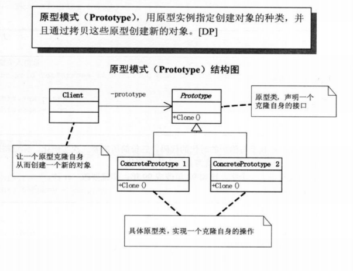
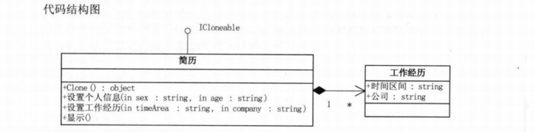
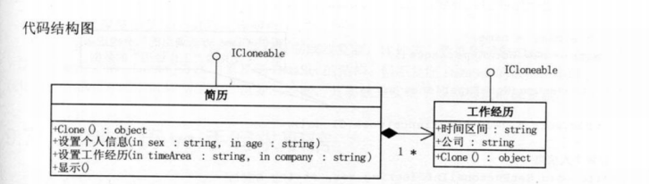

# 原型模式

## 1、引例

举个例子，比如有一天，周杰伦到奶茶店点了一份不加冰的原味奶茶，你说我是周杰伦的忠实粉，我也要一份跟周杰伦一样的。

用程序表示如下：

> 值得注意的是，Java 自带的 clone 方法是浅拷贝的。也就是说调用此对象的 clone 方法，只有基本类型的参数会被拷贝一份，非基本类型的对象不会被拷贝一份，而是继续使用传递引用的方式。如果需要实现深拷贝，必须要自己手动修改 clone 方法才行。
>
> [详细描述](https://leetcode-cn.com/leetbook/read/design-patterns/994yw5/)

```java
package ProtoTypePattern.example;

public class MilkTea implements Cloneable {
    private String type;
    private boolean ice;

    public String getType() {
        return type;
    }

    public void setType(String type) {
        this.type = type;
    }

    public boolean isIce() {
        return ice;
    }

    public void setIce(boolean ice) {
        this.ice = ice;
    }

    @Override
    public String toString() {
        return "MilkTea{" +
                "type='" + type + '\'' +
                ", ice=" + ice +
                '}';
    }

    @Override
    public MilkTea clone() throws CloneNotSupportedException {
        return (MilkTea) super.clone();
    }

    public static class testMilkTea {
        public static void main(String[] args) throws CloneNotSupportedException {
            order();
        }

        private static void order() throws CloneNotSupportedException {
            MilkTea milkTeaOfJay = new MilkTea();
            milkTeaOfJay.type = "原味";
            milkTeaOfJay.ice = false;
            System.out.println(milkTeaOfJay);

            MilkTea yourMilkTea = milkTeaOfJay.clone();
            System.out.println(yourMilkTea);

            System.out.print("变化后：");
            yourMilkTea.setType("柠檬味");
            yourMilkTea.setIce(true);
            System.out.println(yourMilkTea);

            System.out.println(milkTeaOfJay.isIce() == yourMilkTea.isIce()); //判断内容
            // String 是引用类型
            /*
            * 我们都知道clone分为深clone和浅clone，基本类型能自动实现深clone，属于值传递，改变一个对象的值，另一个不会受影响。
            * 对于浅clone来讲，引用类型是传递引用，指向同一片内存空间，改变一个对象的引用类型的值，另一个对象也会随之改变。
            * 但是String类型却是一个特殊，String虽然属于引用类型，
            * 但是String类是不可改变的，它是一个常量，一个对象调用clone方法，克隆出一个新对象，
            * 这时候两个对象的同一个String类型的属性是指向同一片内存空间的，
            * 但是如果改变了其中一个，会产生一片新的内存空间，此时该对象的这个属性的引用将指向这片新的内存空间，
            * 此时两个对象的String类型的属性指向的就是不同的2片内存空间，改变一个不会影响到另一个，可以当做基本类型来使用
            * */
            System.out.println(milkTeaOfJay.getType() == yourMilkTea.getType()); //判断地址
            System.out.println(milkTeaOfJay.getType().equals(yourMilkTea.getType())); //判断内容
        }

    }

}

/*	
输出：
    MilkTea{type='原味', ice=false}
    MilkTea{type='原味', ice=false}
    变化后：MilkTea{type='柠檬味', ice=true}
        false
        false
        false
*/
```

> 使用原型模式后，粉丝们最终喝到了周杰伦的奶茶吗？
>
> 答：没有喝到，原型模式只是根据周杰伦的奶茶配置，拷贝了一份，并不是周杰伦的那一份。

## 2、结构图



> 原型模式其实就是从一个对象再创建另外一个可定制的对象，而且不需要知道任何创建的细节。
>
> - 一般在初始化的信息不发生变化的情况下，克隆是最好的方法。
>
> - 既隐藏了对象创建的细节，有对性能是大大的提高！
>
> - 不用重新初始化对象，而是动态地获得对象运行时的状态。


> Prototype

```java
package ProtoTypePattern.prototype;

public abstract class Prototype {

    private String id;

    public String getId() {
        return id;
    }

    public Prototype(String id) {
        this.id = id;
    }

    public abstract Prototype Clone();

}
```

> ConcreteProtoType1，同理 ConcreteProtoType2

```java
package ProtoTypePattern.prototype;

public class ConcreteProtoType1 extends Prototype {

    public ConcreteProtoType1(String id) {
        super(id);
    }

    @Override
    public ConcreteProtoType1 Clone() { // 深复制
        ConcreteProtoType1 concreteProtoType1 = new ConcreteProtoType1(this.getId());
        return concreteProtoType1;
    }
}
```

> Client

```java
package ProtoTypePattern.prototype;

public class Client {
    public static void main(String[] args) {

        ConcreteProtoType1 p1 = new ConcreteProtoType1("1");
        System.out.println(p1.getId());

        ConcreteProtoType1 c1 = p1.Clone();
        System.out.println(c1.getId());

        System.out.println(p1 == c1);

    }
}
```

> 输出：
>
> 1
> 1
> false

## 3、以简历复制理解浅复制和深复制

### 3.1 浅复制实现

> 结构图




> WorkExperience

```java
package ProtoTypePattern.resume;

public class WorkExperience {
    private String workDate;
    private String company;

    public String getWorkDate() {
        return workDate;
    }

    public void setWorkDate(String workDate) {
        this.workDate = workDate;
    }

    public String getCompany() {
        return company;
    }

    public void setCompany(String company) {
        this.company = company;
    }

    @Override
    public String toString() {
        return "WorkExperience{" +
                "workDate='" + workDate + '\'' +
                ", company='" + company + '\'' +
                '}';
    }
}
```

> Resume

```java
package ProtoTypePattern.resume;

public class Resume implements Cloneable {
    private String name;
    private String gender;
    private int age;

    private  WorkExperience work;

    public Resume(String name) {
        this.name = name;
        work = new WorkExperience();
    }

    // 设置个人信息
    public void setPersonalInfo(String gender, int age) {
        this.gender = gender;
        this.age = age;
    }

    // 设置工作经历
    public void setWorkExperience(String workDate, String company) {
        work.setWorkDate(workDate);
        work.setCompany(company);
    }

    @Override
    public Object clone() throws CloneNotSupportedException {
        return super.clone(); //浅复制
    }

    @Override
    public String toString() {
        return "Resume{" +
                "name='" + name + '\'' +
                ", gender=" + gender +
                ", age=" + age +
                ", work=" + work.toString() +
                '}';
    }

}
```

> Client

```java
package ProtoTypePattern.resume;

public class Client {
    public static void main(String[] args) throws CloneNotSupportedException {
        Resume a = new Resume("大鸟");
        a.setPersonalInfo("男", 29);
        a.setWorkExperience("1998-2000", "阿里巴巴");

        Resume b = (Resume) a.clone();
        b.setWorkExperience("1998-2006", "百度");

        Resume c = (Resume) a.clone();
        c.setWorkExperience("1998-2003", "腾讯");

        System.out.println(a.toString());
        System.out.println(b.toString());
        System.out.println(c.toString());
    }
}
```

> 输出：
>
> // 浅复制：引用类型，只复制了引用，对引用的对象还是指向了原来的对象，即三个引用都指向了同一个对象。
>
> Resume{name='大鸟', gender=男, age=29, work=WorkExperience{workDate='1998-2003', company='腾讯'}}
> Resume{name='大鸟', gender=男, age=29, work=WorkExperience{workDate='1998-2003', company='腾讯'}}
> Resume{name='大鸟', gender=男, age=29, work=WorkExperience{workDate='1998-2003', company='腾讯'}}

### 3.2、深复制实现

> 结构图



> WorkExperience

```java
package ProtoTypePattern.resume;

public class WorkExperience implements Cloneable{
    private String workDate;
    private String company;

    public String getWorkDate() {
        return workDate;
    }

    public void setWorkDate(String workDate) {
        this.workDate = workDate;
    }

    public String getCompany() {
        return company;
    }

    public void setCompany(String company) {
        this.company = company;
    }

    @Override
    protected Object clone() throws CloneNotSupportedException {
        return super.clone();
    }

    @Override
    public String toString() {
        return "WorkExperience{" +
                "workDate='" + workDate + '\'' +
                ", company='" + company + '\'' +
                '}';
    }
}
```

> Resume

```java
package ProtoTypePattern.resume;

public class Resume implements Cloneable {
    private String name;
    private String gender;
    private int age;

    private  WorkExperience work;

    public Resume(String name) {
        this.name = name;
        work = new WorkExperience();
    }

    private Resume(WorkExperience work) throws CloneNotSupportedException {
        this.work = (WorkExperience) work.clone();
    }

    // 设置个人信息
    public void setPersonalInfo(String gender, int age) {
        this.gender = gender;
        this.age = age;
    }

    // 设置工作经历
    public void setWorkExperience(String workDate, String company) {
        work.setWorkDate(workDate);
        work.setCompany(company);
    }

    @Override
    public Object clone() throws CloneNotSupportedException {
        //return super.clone(); //浅复制
        //深复制：
        Resume obj = new Resume(this.work);
        obj.name = this.name;
        obj.gender = this.gender;
        obj.age = this.age;
        return obj;
    }

    @Override
    public String toString() {
        return "Resume{" +
                "name='" + name + '\'' +
                ", gender=" + gender +
                ", age=" + age +
                ", work=" + work.toString() +
                '}';
    }

}
```

> 输出：
>
> // 深复制：对于引用类型，拷贝的不是引用，而是对象本身内容。
>
> Resume{name='大鸟', gender=男, age=29, work=WorkExperience{workDate='1998-2000', company='阿里巴巴'}}
> Resume{name='大鸟', gender=男, age=29, work=WorkExperience{workDate='1998-2006', company='百度'}}
> Resume{name='大鸟', gender=男, age=29, work=WorkExperience{workDate='1998-2003', company='腾讯'}}

## 4、拓展

在大话设计模式中发现了 `MemberwiseClone ();` 浅复制方法

详细内容请看：[MemberwiseClone](https://docs.microsoft.com/en-us/dotnet/api/system.object.memberwiseclone?view=net-5.0#code-try-1)

```C#
using System;

public class IdInfo
{
    public int IdNumber;

    public IdInfo(int IdNumber)
    {
        this.IdNumber = IdNumber;
    }
}

public class Person
{
    public int Age;
    public string Name;
    public IdInfo IdInfo;

    public Person ShallowCopy()
    {
       return (Person) this.MemberwiseClone();
    }

    public Person DeepCopy()
    {
       Person other = (Person) this.MemberwiseClone();
       other.IdInfo = new IdInfo(IdInfo.IdNumber);
       other.Name = String.Copy(Name);
       return other;
    }
}

public class Example
{
    public static void Main()
    {
        // Create an instance of Person and assign values to its fields.
        Person p1 = new Person();
        p1.Age = 42;
        p1.Name = "Sam";
        p1.IdInfo = new IdInfo(6565);

        // Perform a shallow copy of p1 and assign it to p2.
        Person p2 = p1.ShallowCopy();

        // Display values of p1, p2
        Console.WriteLine("Original values of p1 and p2:");
        Console.WriteLine("   p1 instance values: ");
        DisplayValues(p1);
        Console.WriteLine("   p2 instance values:");
        DisplayValues(p2);

        // Change the value of p1 properties and display the values of p1 and p2.
        p1.Age = 32;
        p1.Name = "Frank";
        p1.IdInfo.IdNumber = 7878;
        Console.WriteLine("\nValues of p1 and p2 after changes to p1:");
        Console.WriteLine("   p1 instance values: ");
        DisplayValues(p1);
        Console.WriteLine("   p2 instance values:");
        DisplayValues(p2);

        // Make a deep copy of p1 and assign it to p3.
        Person p3 = p1.DeepCopy();
        // Change the members of the p1 class to new values to show the deep copy.
        p1.Name = "George";
        p1.Age = 39;
        p1.IdInfo.IdNumber = 8641;
        Console.WriteLine("\nValues of p1 and p3 after changes to p1:");
        Console.WriteLine("   p1 instance values: ");
        DisplayValues(p1);
        Console.WriteLine("   p3 instance values:");
        DisplayValues(p3);
    }

    public static void DisplayValues(Person p)
    {
        Console.WriteLine("      Name: {0:s}, Age: {1:d}", p.Name, p.Age);
        Console.WriteLine("      Value: {0:d}", p.IdInfo.IdNumber);
    }
}
// The example displays the following output:
//       Original values of p1 and p2:
//          p1 instance values:
//             Name: Sam, Age: 42
//             Value: 6565
//          p2 instance values:
//             Name: Sam, Age: 42
//             Value: 6565
//
//       Values of p1 and p2 after changes to p1:
//          p1 instance values:
//             Name: Frank, Age: 32
//             Value: 7878
//          p2 instance values:
//             Name: Sam, Age: 42
//             Value: 7878
//
//       Values of p1 and p3 after changes to p1:
//          p1 instance values:
//             Name: George, Age: 39
//             Value: 8641
//          p3 instance values:
//             Name: Frank, Age: 32
//             Value: 7878
```


