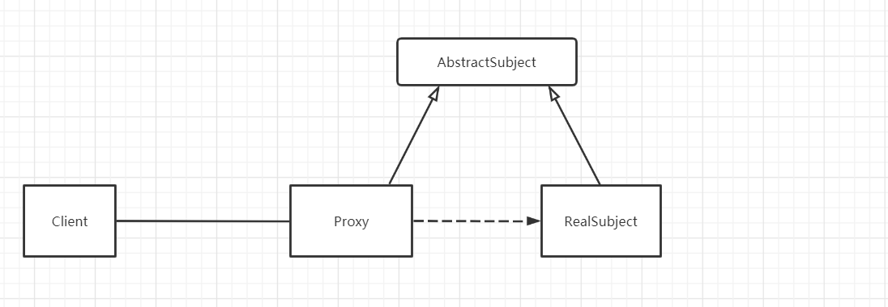
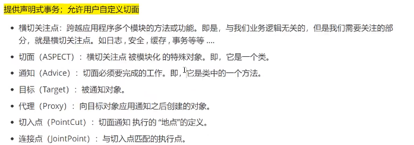
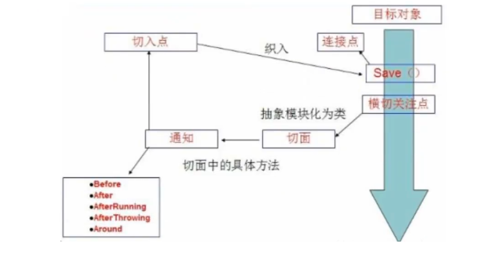
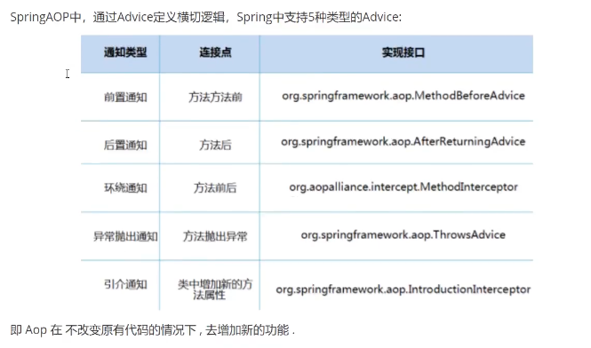

# Proxy

## 静态代理

**主要用于对某个对象加以控制**

> 视频链接: https://www.bilibili.com/video/BV1WE411d7Dv?p=17

**静态代理角色分析**

- 抽象角色 : 一般使用接口或者抽象类来实现
- 真实角色 : 被代理的角色
- 代理角色 : 代理真实角色 ; 代理真实角色后 , 一般会做一些附属的操作 .
- 客户  :  使用代理角色来进行一些操作 .

 **用租房的例子来理解:**



> 抽象角色 AbstractSubject 

```java
package com.DesignPattern.Proxy;

//抽象角色：租房
public interface Rent {
    public void rent();
}
```

> 真实角色 RealSubject 

```java
package com.DesignPattern.Proxy;

//真实角色: 房东，房东要出租房子
public class Host implements Rent{
    public void rent() {
        System.out.println("房屋出租");
    }
}
```

> 代理角色

```java
package com.DesignPattern.Proxy;

//代理角色：中介
public class Proxy implements Rent {

    private Host host;
    public Proxy() { }
    public Proxy(Host host) {
        this.host = host;
    }

    //租房
    public void rent(){
        seeHouse();  // 先看房
        host.rent(); // 代理出租业务
        fare(); 	 // 收中介费
    }
    //看房
    public void seeHouse(){
        System.out.println("带房客看房");
    }
    //收中介费
    public void fare(){
        System.out.println("收中介费");
    }
}
```

> 客户 Client: 使用代理角色来进行一些操作 .

```java
package com.DesignPattern.Proxy;

//客户类，一般客户都会去找代理！
public class Client {
    public static void main(String[] args) {
        //房东要租房
        Host host = new Host();
        //中介帮助房东
        Proxy proxy = new Proxy(host);

        //客户找中介租房
        proxy.rent();
    }
}
```

**分析：在这个过程中，你直接接触的就是中介，就如同现实生活中的样子，你看不到房东，但是你依旧租到了房东的房子通过代理，这就是所谓的代理模式，程序源自于生活，所以学编程的人，一般能够更加抽象的看待生活中发生的事情。**

**静态代理的好处:**

- 可以使得我们的真实角色更加纯粹 . 不再去关注一些公共的事情 .
- 公共的业务由代理来完成 . 实现了业务的分工 ,
- 公共业务发生扩展时变得更加集中和方便 .

缺点 :

- 类多了 , 多了代理类 , 工作量变大了 . 开发效率降低 .

我们想要静态代理的好处，又不想要静态代理的缺点，所以 , 就有了动态代理 !

## [动态代理](https://mp.weixin.qq.com/s?__biz=Mzg2NTAzMTExNg%3D%3D&chksm=ce610441f9168d57265a3b4216b0a63c1d970457896c6b94949fe6dda8d98d04f4381cd059da&idx=1&mid=2247484130&scene=21&sn=73741a404f7736c02bcdf69f565fe094#wechat_redirect)

> 视频链接: https://www.bilibili.com/video/BV1WE411d7Dv?p=19

- 动态代理的角色和静态代理的一样 .

- 动态代理的代理类是动态生成的 . 静态代理的代理类是我们提前写好的

- 动态代理分为两类 : 一类是基于接口动态代理 , 一类是基于类的动态代理

- - 基于接口的动态代理---`-JDK动态代理`
  - 基于类的动态代理--`cglib`
  - 现在用的比较多的是` javasist` 来生成动态代理
  - 我们这里使用JDK的原生代码来实现，其余的道理都是一样的！

**JDK的动态代理需要了解两个类**

核心 : `InvocationHandler`   和   `Proxy ` 

- `InvocationHandler`----invoke: 在代理实例的基础上处理方法的调用, 并且返回其结果.

- **Proxy** : `newProxyInstance---返回指定接口的代理类的实例，该接口将方法调用分派给指定的调用处理程序`

```java
//生成代理类
public Object getProxy(){
   return Proxy.newProxyInstance(this.getClass().getClassLoader(),
                                 rent.getClass().getInterfaces(),this);
}
```

**代码实现:** 

> 抽象角色和真实角色和之前的一样！
>
> Rent . java 即抽象角色

```java
//抽象角色：租房
public interface Rent {
    public void rent();
}
```

> Host . java 即真实角色

```java
//真实角色: 房东，房东要出租房子
public class Host implements Rent{
   public void rent() {
       System.out.println("房屋出租");
  }
}
```

> `ProxyInvocationHandler. java` 即代理角色

```java
package com.DesignPattern.Proxy;

import java.lang.reflect.InvocationHandler;
import java.lang.reflect.Method;

// 动态代理
public class ProxyInvocationHandler implements InvocationHandler {

    private Rent rent;

    public void setRent(Rent rent) {
        this.rent = rent;
    }

    //生成代理类，重点是第二个参数，获取要代理的抽象角色！之前都是一个角色，现在可以代理一类角色
    // 第二个参数是Rent接口, 表示要代理实现了Rent接口的类
    public Object getProxy(){
        return Proxy.newProxyInstance(this.getClass().getClassLoader(),
                rent.getClass().getInterfaces(),this);
    }

    // proxy : 代理类 
    // method : 代理类的调用处理程序的方法对象.
    // 处理代理实例上的方法调用并返回结果
    @Override
    public Object invoke(Object proxy, Method method, Object[] args) throws Throwable {
        seeHouse();
        //核心：本质利用反射实现！
        Object result = method.invoke(rent, args);
        fare();
        return result;
    }

    //看房
    public void seeHouse(){
        System.out.println("带房客看房");
    }
    //收中介费
    public void fare(){
        System.out.println("收中介费");
    }

}
```

> Client . java

```java
//租客
public class Client {
    public static void main(String[] args) {
        //真实角色
        Host host = new Host();
        //代理实例的调用处理程序
        ProxyInvocationHandler pih = new ProxyInvocationHandler();
        pih.setRent(host); //将真实角色放置进去！
        Rent proxy = (Rent)pih.getProxy(); //动态生成对应的代理类！
        proxy.rent();
    }
}
```

> 输出:
>
> ​			带房客看房
> ​			房屋出租
> ​			收中介费
>
> ​			Process finished with exit code 0

核心：**一个动态代理 , 一般代理某一类业务 , 一个动态代理可以代理多个类，代理的是接口！**

> ##### 动态代理的好处

静态代理有的它都有，静态代理没有的，它也有！

- 可以使得我们的真实角色更加纯粹 . 不再去关注一些公共的事情 .
- 公共的业务由代理来完成 . 实现了业务的分工 ,
- 公共业务发生扩展时变得更加集中和方便 .
- 一个动态代理 , 一般代理某一类业务
- 一个动态代理可以代理多个类，代理的是接口！

## 其他案例

### 静态代理实现

> UserService

```java
public interface UserService {
    public void add();
    public void delete();
    public void update();
    public void query();
}
```

> UserServiceImpl

```java
public class UserServiceImpl implements UserService{
    @Override
    public void add() {
        System.out.println("增加用户");
    }

    @Override
    public void delete() {
        System.out.println("删除用户");
    }

    @Override
    public void update() {
        System.out.println("更新数据");
    }

    @Override
    public void query() {
        System.out.println("查询数据");
    }
}
```

> UserServiceProxy

```java
public class UserServiceProxy implements UserService{

    private UserService userService;

    public void setUserService(UserService userService) {
        this.userService = userService;
    }

    @Override
    public void add() {
        log("add");
        userService.add();
    }

    @Override
    public void delete() {
        log("delete");
        userService.delete();
    }

    @Override
    public void update() {
        log("update");
        userService.update();
    }

    @Override
    public void query() {
        log("query");
        userService.query();
    }

    public void log(String msg) {
        System.out.println("使用了"+ msg + "方法");
    }
}
```

> Client

```java
public class Client {
    public static void main(String[] args) {
        UserService userService = new UserServiceImpl();
        UserServiceProxy proxy = new UserServiceProxy();
        // 代理 -- 传递代理对象
        proxy.setUserService(userService);
        proxy.add();
        proxy.delete();
        proxy.update();
        proxy.query();
    }
}
```

### 动态代理实现

> ProxyInvocationHandler
>
> **AOP 底层实现原理**: 代理的是**接口**, 即某一类 !

```java
import java.lang.reflect.InvocationHandler;
import java.lang.reflect.Method;
import java.lang.reflect.Proxy;

/**
 * @author Jungle
 */
public class ProxyInvocationHandler implements InvocationHandler {

    /**
     * proxied object
     * */
    private Object target;

    public void setTarget(Object target) {
        this.target = target;
    }

    /**
     * get the proxy instance
     * */
    public Object getProxy() {
        return Proxy.newProxyInstance(this.getClass().getClassLoader(), target.getClass().getInterfaces(), this);
    }

    @Override
    public Object invoke(Object proxy, Method method, Object[] args) throws Throwable {
        log(method.getName());
        return method.invoke(target, args);
    }

    private void log(String msg) {
        System.out.println("执行了" + msg + "方法");
    }
}
```

> Client

```java
import com.jungle.demo2.UserService;
import com.jungle.demo2.UserServiceImpl;

import java.lang.reflect.InvocationHandler;

/**
 * @author Jungle
 */
public class Client {
    public static void main(String[] args) {
        // real object
        UserService userService = new UserServiceImpl();
        // proxy object, not existence
        ProxyInvocationHandler pih = new ProxyInvocationHandler();
        // set proxied object
        pih.setTarget(userService);
        // dynamic generate proxy class
        UserService proxy = (UserService) pih.getProxy();
        proxy.add();
        proxy.delete();
        proxy.update();
        proxy.query();
    }
}
```

---

# AOP

> **在运行时，动态的将代码切入到类的指定方法、指定位置上的编程思想就是面向切面的编程。**
>
> **AOP即面向切面编程。**
>
> 使用切面编程，可以将一些系统性的代码提取出来，独立实现，与核心业务代码剥离，比如权限管理、事务管理、日志记录等等。
>
> AOP是spring提供的关键特性之一。


> AOP的作用







## 方式一: 使用Spring的API接口实现

> UserService

```java
package com.jungle.demoAOP.service;

/**
 * @author Jungle
 */
public interface UserService {
    public void add();
    public void delete();
    public void update();
    public void query();
}
```

> UserServiceImpl

```java
package com.jungle.demoAOP.service;

/**
 * @author Jungle
 */
public class UserServiceImpl implements UserService {
    @Override
    public void add() {
        System.out.println("增加用户");
    }

    @Override
    public void delete() {
        System.out.println("删除用户");
    }

    @Override
    public void update() {
        System.out.println("更新数据");
    }

    @Override
    public void query() {
        System.out.println("查询数据");
    }
}
```


> Log

```java
package com.jungle.demoAOP.log;


import org.springframework.aop.MethodBeforeAdvice;

import java.lang.reflect.Method;

/**
 * @author Jungle
 */
public class Log implements MethodBeforeAdvice {

    /**
     * @param method executed method of target object
     * @param objects args
     * @param o target object
     * */
    @Override
    public void before(Method method, Object[] objects, Object o) throws Throwable {
        assert o != null;
        System.out.println(o.getClass().getName() + "的" + method.getName() + "被执行");
    }
}
```

> AfterLog

```java
package com.jungle.demoAOP.log;

import org.springframework.aop.AfterReturningAdvice;

import java.lang.reflect.Method;

/**
 * @author Jungle
 */
public class AfterLog  implements AfterReturningAdvice {

    /**
     * @param o returnValue
     * @param method executed method of target object
     * @param objects args
     * @param o1 target object
     * */
    @Override
    public void afterReturning(Object o, Method method, Object[] objects, Object o1) throws Throwable {
        System.out.println("执行了"+ method.getName() +" 返回结果为: " + o);
    }
}
```

> applicationContext.xml

```xml
<?xml version="1.0" encoding="UTF-8"?>
<beans xmlns="http://www.springframework.org/schema/beans"
       xmlns:xsi="http://www.w3.org/2001/XMLSchema-instance"
       xmlns:aop="http://www.springframework.org/schema/aop"
       xsi:schemaLocation="http://www.springframework.org/schema/beans
        http://www.springframework.org/schema/beans/spring-beans.xsd
        http://www.springframework.org/schema/aop
        http://www.springframework.org/schema/aop/spring-aop.xsd">
    <bean id="userService" class="com.jungle.demoAOP.service.UserServiceImpl" />
    <bean id="log" class="com.jungle.demoAOP.log.Log" />
    <bean id="afterLog" class="com.jungle.demoAOP.log.AfterLog" />

    <aop:config>
        <aop:pointcut id="pointcut" expression="execution(* com.jungle.demoAOP.service.UserServiceImpl.*(..))"/>
        <aop:advisor advice-ref="log" pointcut-ref="pointcut"/>
        <aop:advisor advice-ref="afterLog" pointcut-ref="pointcut"/>
    </aop:config>
        
</beans>
```

> MyTest
>
> - **注**: 动态代理  `代理` 的是  `接口` 

```java
import com.jungle.demoAOP.service.UserService;
import com.jungle.demoAOP.service.UserServiceImpl;
import org.springframework.context.ApplicationContext;
import org.springframework.context.support.ClassPathXmlApplicationContext;

public class MyTest {
    public static void main(String[] args) {
        ApplicationContext context = new ClassPathXmlApplicationContext("applicationContext.xml");
        // dynamic proxy is for interface
        UserService userService = context.getBean("userService", UserService.class);
        userService.add();
        userService.delete();
        userService.update();
        userService.query();
    }
}
```

**output:** 

```java
com.jungle.demoAOP.service.UserServiceImpl的add被执行
增加用户
执行了add 返回结果为: null
com.jungle.demoAOP.service.UserServiceImpl的delete被执行
删除用户
执行了delete 返回结果为: null
com.jungle.demoAOP.service.UserServiceImpl的update被执行
更新数据
执行了update 返回结果为: null
com.jungle.demoAOP.service.UserServiceImpl的query被执行
查询数据
执行了query 返回结果为: null

Process finished with exit code 0
```


---

## 方式二: 主要是切面定义

> 自定义类 `DiyPointCut`

```java
package com.jungle.demoAOP.diy;

/**
 * @author Jungle
 */
public class DiyPointCut {

    public void before() {
        System.out.println("==============方法执行前=================");
    }

    public void after() {
        System.out.println("==============方法执行后=================");
    }

}
```

> applicationContext.xml

```xml
<?xml version="1.0" encoding="UTF-8"?>
<beans xmlns="http://www.springframework.org/schema/beans"
       xmlns:xsi="http://www.w3.org/2001/XMLSchema-instance"
       xmlns:aop="http://www.springframework.org/schema/aop"
       xsi:schemaLocation="http://www.springframework.org/schema/beans
        http://www.springframework.org/schema/beans/spring-beans.xsd
        http://www.springframework.org/schema/aop
        http://www.springframework.org/schema/aop/spring-aop.xsd">
    <bean id="userService" class="com.jungle.demoAOP.service.UserServiceImpl" />
    <bean id="log" class="com.jungle.demoAOP.log.Log" />
    <bean id="afterLog" class="com.jungle.demoAOP.log.AfterLog" />

<!--    <aop:config>-->
<!--        <aop:pointcut id="pointcut" expression="execution(* com.jungle.demoAOP.service.UserServiceImpl.*(..))"/>-->
<!--        <aop:advisor advice-ref="log" pointcut-ref="pointcut"/>-->
<!--        <aop:advisor advice-ref="afterLog" pointcut-ref="pointcut"/>-->
<!--    </aop:config>-->

    <bean id="diy" class="com.jungle.demoAOP.diy.DiyPointCut"/>

    <aop:config>
        <aop:aspect ref="diy">
            <aop:pointcut id="point" expression="execution(* com.jungle.demoAOP.service.UserService.*(..))"/>
            <aop:before method="before" pointcut-ref="point"/>
            <aop:after method="after" pointcut-ref="point"/>
        </aop:aspect>
    </aop:config>
</beans>
```

> MyTest

```java
import com.jungle.demoAOP.service.UserService;
import com.jungle.demoAOP.service.UserServiceImpl;
import org.springframework.context.ApplicationContext;
import org.springframework.context.support.ClassPathXmlApplicationContext;

public class MyTest {
    public static void main(String[] args) {
        ApplicationContext context = new ClassPathXmlApplicationContext("applicationContext.xml");
        // dynamic proxy is for interface
        UserService userService = context.getBean("userService", UserService.class);
        userService.add();
        userService.delete();
        userService.update();
        userService.query();
    }
}
```

**output:**

```java
==============方法执行前=================
增加用户
==============方法执行后=================
==============方法执行前=================
删除用户
==============方法执行后=================
==============方法执行前=================
更新数据
==============方法执行后=================
==============方法执行前=================
查询数据
==============方法执行后=================

Process finished with exit code 0
```


---

## 方式三: 使用注解实现!

> AnnotationPointCut

```java
package com.jungle.demoAOP.diy;

import org.aspectj.lang.ProceedingJoinPoint;
import org.aspectj.lang.Signature;
import org.aspectj.lang.annotation.After;
import org.aspectj.lang.annotation.Around;
import org.aspectj.lang.annotation.Aspect;
import org.aspectj.lang.annotation.Before;

/**
 * @author Jungle
 */
@Aspect
public class AnnotationPointCut {

    @Before("execution(* com.jungle.demoAOP.service.UserService.*(..))")
    public void before() {
        System.out.println("==============方法执行前=================");
    }

    @After("execution(* com.jungle.demoAOP.service.UserService.*(..))")
    public void after() {
        System.out.println("==============方法执行后=================");
    }

    @Around("execution(* com.jungle.demoAOP.service.UserService.*(..))")
    public void around(ProceedingJoinPoint joinPoint) throws Throwable{
        System.out.println("环绕前");

        Signature signature = joinPoint.getSignature();
        Object target = joinPoint.getTarget();
        System.out.println(signature + "\n" + target);

        // execute method
        Object proceed = joinPoint.proceed();

        System.out.println("环绕后");
    }

}
```

> applicationContext.xml

```xml
<?xml version="1.0" encoding="UTF-8"?>
<beans xmlns="http://www.springframework.org/schema/beans"
       xmlns:xsi="http://www.w3.org/2001/XMLSchema-instance"
       xmlns:aop="http://www.springframework.org/schema/aop"
       xsi:schemaLocation="http://www.springframework.org/schema/beans
        http://www.springframework.org/schema/beans/spring-beans.xsd
        http://www.springframework.org/schema/aop
        http://www.springframework.org/schema/aop/spring-aop.xsd">
    <bean id="userService" class="com.jungle.demoAOP.service.UserServiceImpl" />
    <bean id="log" class="com.jungle.demoAOP.log.Log" />
    <bean id="afterLog" class="com.jungle.demoAOP.log.AfterLog" />

<!--    aop method 1-->
<!--    <aop:config>-->
<!--        <aop:pointcut id="pointcut" expression="execution(* com.jungle.demoAOP.service.UserServiceImpl.*(..))"/>-->
<!--        <aop:advisor advice-ref="log" pointcut-ref="pointcut"/>-->
<!--        <aop:advisor advice-ref="afterLog" pointcut-ref="pointcut"/>-->
<!--    </aop:config>-->


    <bean id="diy" class="com.jungle.demoAOP.diy.DiyPointCut"/>

    <!--    aop method 2-->
<!--    <aop:config>-->
<!--        <aop:aspect ref="diy">-->
<!--            <aop:pointcut id="point" expression="execution(* com.jungle.demoAOP.service.UserServiceImpl.*(..))"/>-->
<!--            <aop:before method="before" pointcut-ref="point"/>-->
<!--            <aop:after method="after" pointcut-ref="point"/>-->
<!--        </aop:aspect>-->
<!--    </aop:config>-->

<!--    aop method 3-->
    <bean id="annotationPointCut" class="com.jungle.demoAOP.diy.AnnotationPointCut"/>
<!--    open annotation support-->
    <aop:aspectj-autoproxy/>
</beans>
```

---


