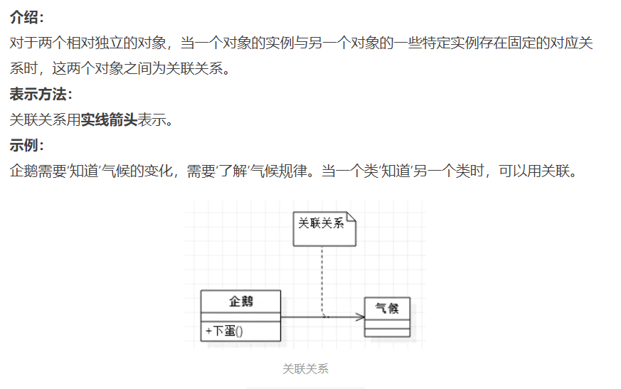

# 设计模式的六大原则 

设计模式的世界丰富多彩，比如生产一个个“产品”的工厂模式，衔接两个不相关接口的适配器模式，用不同的方式做同一件事的策略模式，构建步骤稳定、根据构建过程的不同配置构建出不同对象的建造者模式等等。

无论何种设计模式，都是基于六大设计原则：

## 1、开闭原则：

> 一个软件实体如类、模块和函数应该对 **`修改封闭，对扩展开放`**。
>
> Software entities like classes, modules and functions should be open for extension but closed for modification

**[Open Closed Principle，OCP]**

- 当应用的需求改变时, 在不修改源代码的前提下, 可以扩展模块的功能, 使其满足新的需求.
- 遵守开闭原则的软件，其稳定性高和延续性强，从而易于扩展和维护.
- 对扩展开放是对提供方来说的, 对修改关闭是针对调用放来说的. 
  - 抽象类或接口: 对扩展开放
  - 具体怎么实现由写代码的人负责, 不需要其他人干涉: 对修改关闭

## 2、单一职责原则：

> `一个类只做一件事，一个类应该只有一个引起它修改的原因`。
>
> There should never be more than one reason for a class to change.

**[Single Responsibility Principle, SRP]**

**简单来说，一个类中应该是一组相关性很高的函数、数据的封装。**

- 比如当要做一个图片加载器的时候，不应该把所有的东西都写在一个类中，
- 应该各个功能独立出来，可以分成图片加载功能和缓存功能等模块，
- 这样类中的代码逻辑清晰可读性、可扩展性和可维护性会大大提高。
- 比如: 设计一个Controller、Service、Mapper时.

## 3、里氏替换原则：

> 所有引用基类的地方必须能透明地使用其子类的对象
>
> Functions that use use pointers or references to base classes must be able to use objects of derived classes without knowing it.

**[Liskov Substitution Principle, LSP]**

- 子类应该可以完全替换父类。

- 也就是说在使用继承时，只扩展新功能，而不要破坏父类原有的功能。

- 抽象类 或 接口 <-- T t = new TImpl() --> 实现类

  

## 4、依赖倒置原则：

> 1、**细节应该依赖于抽象**，抽象不应依赖于细节。
> 2、把抽象层放在程序设计的高层，并保持稳定，程序的细节变化由低层的实现层来完成。
>
> High level modules should not depend upon low level modules. Both should depend upon abstractions.
>  Abstractions should not depend upon details. Details should depend upon abstractions.

**[Dependence Inversion Principle]**

- 要面向接口编程，不要面向实现编程
- 抽象层则相对稳定，因此以抽象为基础搭建起来的架构要比以细节为基础搭建起来的架构要稳定得多
- `抽象指的是接口或者抽象类，而细节是指具体的实现类`
- 抽象就是一种制定的标准
- 依赖倒置原则的目的是通过要面向接口的编程来降低类间的耦合性:
  1. `每个类尽量提供接口或抽象类`，或者两者都具备
  2. `变量的声明类型尽量是接口或者是抽象类`
  3. `任何类都不应该从具体类派生`
  4. `使用继承时尽量遵循里氏替换原则`
- 就是我们一直在使用的Spring框架.
  - UserMapper --> UserService 
  - 变成: 
  - UserMapper --> UserService --> UserServiceImpl
  - 使用时, 直接注入接口就行
  - 只需要知道接口中定义了什么方法然后使用就行, 而具体的操作由接口实现类来完成, 并由Spring来为我们注入, 而不是我们用硬编码的方式去指定.

## 5、迪米特法则：

> **`一个类不应知道自己操作的类的细节`**，换言之，只和朋友谈话，不和朋友的朋友谈话。
>
> Talk only to your immediate friends and not to strangers

**[Demeter Principle]**

- 迪米特法则，又名“最少知道原则”
- 如果两个软件实体无须直接通信，那么就不应当发生直接的相互调用，可以通过第三方转发该调用。
  - 一个类/模块对其他类/模块有越少的交互越好.
  - 当一个类发生改动时, 与其相关的类需要尽可能少的受影响, 维护项目的时候更加轻松.
  - 比如传递参数的时候, 传递的参数是一个类而不是一个具体的参数, 那么若该类发生了改变导致真正的参数获取不到了, 就会对相应的操作造成影响. [直接给真正的参数就完了!]
- 目的是降低类之间的耦合度，提高模块的相对独立性.

## 6、接口隔离原则：

> **客户端不应依赖它不需要的接口。**
>
> 如果一个接口在实现时，部分方法由于冗余被客户端空实现，则应该将**接口拆分**，让**实现类只需依赖自己需要的接口方法**。

**[Interface Segregation Principle]**

- 要**为各个类建立它们需要的专用接口**，而不要试图去建立一个很庞大的接口供所有依赖它的类去调用.
- 提高系统的灵活性和可维护性。
- 提高了系统的内聚性，减少了对外交互，降低了系统的耦合性
- 使用多个专门的接口还能够体现对象的层次，因为可以通过接口的继承，实现对总接口的定义
- 在具体应用接口隔离原则时，应该根据以下几个规则来衡量
  1. 接口尽量小，但是要有限度。 
     - **一个接口只服务于一个子模块或业务逻辑**.
     - 根据实际情况将接口进行细粒度的划分.
  2. 为依赖接口的类定制服务。 只提供调用者需要的方法，屏蔽不需要的方法.
  3. `提高内聚`，减少对外交互。 使接口用最少的方法去完成最多的事情.

---

# 其他原则

## 合成复用原则

**[Composite Reuse Principle]**  

> 优先使用对象**组合**, 而不是通过继承来达到复用的目的.
>
> 核心就是委派.

在一个新对象里面使用一些已有的对象, 使之成为新对象的一部分, 新的对象通过这些对象的委派达到复用已有功能的目的.

复用代码时： **即 多用组合， 少用 继承**. 【合成就是通过某种方式将代码组合在一起】

这就让人想到了Spring的IOC, 依赖注入.

---

# [几种常见的UML图](https://www.jianshu.com/p/57620b762160)

## 1 继承： 空心三角形+实线 `is-a`

## 2 实现： 空心三角形+虚线

## 3 依赖： 虚线箭头

## 4 关联： 实现箭头

## 5 聚合： 空心的菱形+实线箭头 `has-a 弱拥有`

## 6 组合： 实心菱形+实线箭头 `contains-a 强拥有`

---

# 设计模式的总结

## 一、构建型模式 ：`Creational Pattern`

工厂方法模式：为每一类对象建立工厂，将对象交由工厂创建，客户端只和工厂打交道。
抽象工厂模式：为每一类工厂提取出抽象接口，使得新增工厂、替换工厂变得非常容易。
建造者模式：用于创建构造过程稳定的对象，不同的 Builder 可以定义不同的配置。
单例模式：全局使用同一个对象，分为饿汉式和懒汉式。懒汉式有双检锁和内部类两种实现方式。
原型模式：为一个类定义 clone 方法，使得创建相同的对象更方便。

> 来源：https://leetcode-cn.com/leetbook/read/design-patterns/991sn6/

---

## 二、结构型模式 `Structural Pattern`

**适配器模式：用于有相关性但不兼容的接口**

桥接模式：用于同等级的接口互相组合
组合模式：用于整体与部分的结构

**装饰器模式: 增强一个类原有的功能, 为一个类添加新的功能, 并且装饰器模式也不会改变原有的类。**

外观模式：体现封装的思想
享元模式：体现面向对象的可复用性
代理模式：主要用于对某个对象加以控制

> 来源：https://leetcode-cn.com/leetbook/read/design-patterns/9eh29v/

---

## 三、行为型模式 Behavioral Patterns

> 行为型模式重点关注类与类之间的交互与协作。如同在工作中，每个人的行为都可能影响到其他同事，同时每个人也会受到别人的影响。我们一边接收上级的指令，一边派发任务给下级，在这样的协作中完成一项项伟大的工作。程序在运行时，每个对象都不是孤立的，他们可以通过通信与协作完成种种复杂的功能。

责任链模式：处理职责相同，程度不同的对象，使其在一条链上传递
命令模式：封装“方法调用”，将行为请求者和行为实现者解耦
解释器模式：定义自己的语法规则
迭代器模式：定义 next() 方法和 hasNext() 方法，让外部类使用这两个方法来遍历列表，以达到隐藏列表内部细节的目的
中介者模式：通过引入中介者，将网状耦合结构变成星型结构
备忘录模式：存储对象的状态，以便恢复
观察者模式：处理一对多的依赖关系，被观察的对象改变时，多个观察者都能收到通知
状态模式：关于多态的设计模式，每个状态类处理对象的一种状态
策略模式：殊途同归，用多种方法做同一件事
模板方法模式：关于继承的设计模式，父类是子类的模板
访问者模式：将数据的结构和对数据的操作分离

> 来源：https://leetcode-cn.com/leetbook/read/design-patterns/9ew9uc/

---

