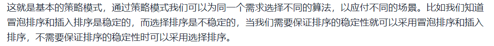
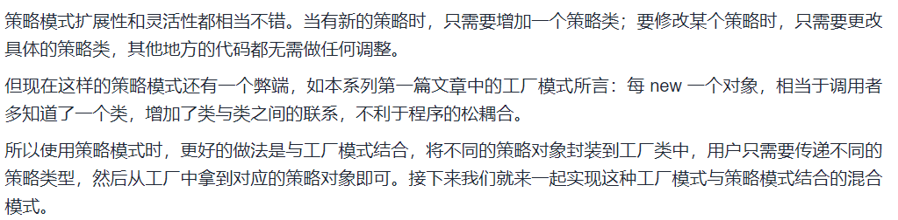

# Strategy

## 定义

**殊途同归，用多种方法做同一件事**

- 定义了一系列算法，并将每一个算法封装起来，而且使它们还可以相互替换。

- 策略模式让算法独立于使用它的客户而独立变化。

> 当我们做同一件事有多种方法时，就可以将每种方法封装起来，在不同的场景选择不同的策略，调用不同的方法。


## 实例

> 应用策略模式实现排序算法:

1. 定义接口

```java
package com.DesignPattern;

// 采用策略模式实现
public interface ISort {
    void sort(int[] arr);
}
```

2. 实现逻辑

```java
package com.DesignPattern;

public class Sort implements ISort{
    private ISort sort;

    Sort(ISort sort) {
        this.sort = sort;
    }


    @Override
    public void sort(int[] arr) {
        sort.sort(arr);
    }

    // 设置采用哪种算法
    public void setSort(ISort sort){
        this.sort = sort;
    }
}
```

3. 测试

```java
package com.DesignPattern;

import org.junit.Test;

import java.util.Arrays;

public class Client {
    @Test
    public static void main(String[] args) {
        int[] arr = new int[]{6, 1, 2, 3, 5, 4};
        System.out.println(Arrays.toString(arr));
        Sort sort = new Sort(new BubbleSort());
        // 这里可以选择不同的策略完成排序
//         sort.setSort(new InsertSort());
//         sort.setSort(new SelectionSort());
        sort.sort(arr);
        // 输出 [1, 2, 3, 4, 5, 6]
        System.out.println(Arrays.toString(arr));
    }
}
```

4. 将排序方法封装起来, 根据需要选择

```java
package com.DesignPattern;

public class Utils {
    /*
    * 采用异或运算交换数组中, 下标为 i和j 的元素的值
    * */
    public static void swap(int[] arr, int i, int j) {
        if (arr == null || arr.length <= 1 || i == j) return;
        arr[i] = arr[i] ^ arr[j];
        arr[j] = arr[i] ^ arr[j];
        arr[i] = arr[i] ^ arr[j];
    }
}

// 稳定的
public class BubbleSort implements ISort{
    @Override
    public void sort(int[] arr) {
        for (int i = 0; i < arr.length; i++) {
            for (int j = 0; j < arr.length-1-i; j++) {
                if (arr[j] > arr[j+1]) {
                    Utils.swap(arr, j, j+1);
                }
            }
        }
    }
}

// 稳定的
public class InsertSort implements ISort{

    @Override
    public void sort(int[] arr) {
        for (int i = 1; i < arr.length; i++) {
            int j = i-1;
            int curNum = arr[i];
            while (j >= 0 && arr[j] > curNum) {
                arr[j+1] = arr[j];
                j--;
            }
            arr[j+1] = curNum;
        }
    }
}

// 不稳定
public class SelectionSort implements ISort{

    @Override
    public void sort(int[] arr) {
        int minIndex;
        for (int i = 0; i < arr.length; i++) {
            minIndex = i;
            for (int j = i+1; j < arr.length; j++) {
                if (arr[minIndex] > arr[j]) {
                    minIndex = j;
                }
            }
            Utils.swap(arr, i, minIndex);
        }
    }
}
```


## 小结

- 有类似于 `arr[j] > arr[j+1]` 的是**稳定的**排序 (前后比较)
- 希尔排序是特殊的分组插入排序, 会进行多次插入排序, 所以是**不稳定的.** 



## 未完待续...



