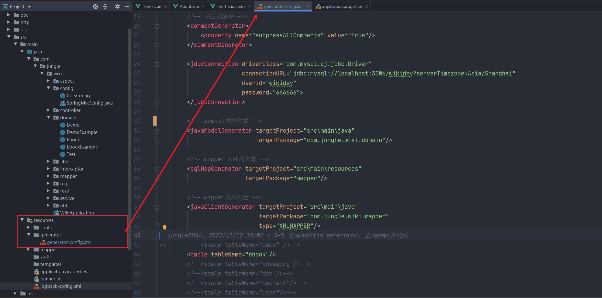
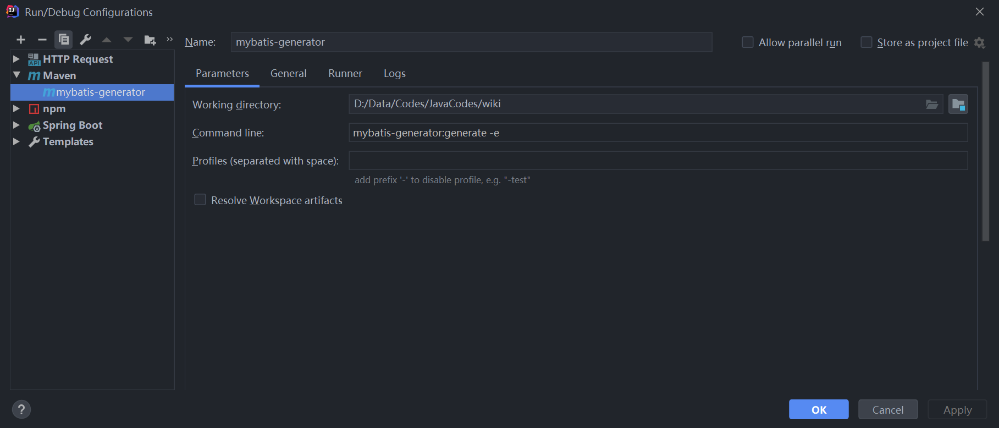
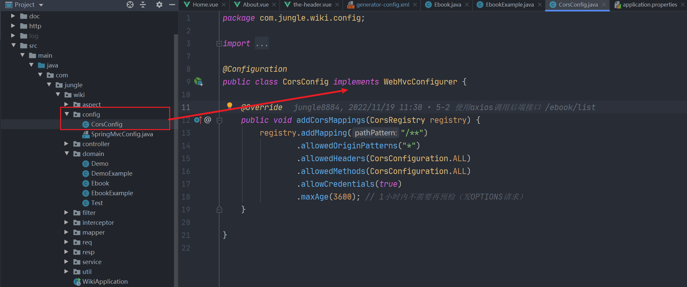

# 调试

## 打印SQL

> 如何在开发过程中输出SQL

1. 下载插件 Mybaits Log Plugin Free

2.  设置配置文件

   ```yaml
   mybatis:
     # spring boot集成mybatis的方式打印sql
     configuration:
       log-impl: org.apache.ibatis.logging.stdout.StdOutImpl
   ```

---

## 设置Debug模式

> 在log4j2.xml里设置level为debug, 调试完毕改回info, 或者本地调试但不提交代码到云端.

```xml
<loggers>
    <root level="debug">
        <appender-ref ref="java"/>
        <appender-ref ref="Console"/>
    </root>
    <logger name="com.fpx.fb4" level="debug" additivity="false">
        <appender-ref ref="FILE.INFO"/>
        <appender-ref ref="FILE.WARN"/>
        <appender-ref ref="FILE.ERROR"/>
        <appender-ref ref="FILE.DEBUG"/>
    </logger>
    <logger name="com.i4px.cloud.kms" level="debug" additivity="false">
        <appender-ref ref="encrypt"/>
    </logger>
</loggers>
```

---


# 快速开发

## 自动生成实体类及查询条件类Example

1. 在资源文件夹下设置 generator-config.xml 文件

   ```xml
   <?xml version="1.0" encoding="UTF-8"?>
   <!DOCTYPE generatorConfiguration
           PUBLIC "-//mybatis.org//DTD MyBatis Generator Configuration 1.0//EN"
           "http://mybatis.org/dtd/mybatis-generator-config_1_0.dtd">
   
   <generatorConfiguration>
       <context id="Mysql" targetRuntime="MyBatis3" defaultModelType="flat">
   
           <!-- 自动检查关键字，为关键字增加反引号 -->
           <property name="autoDelimitKeywords" value="true"/>
           <property name="beginningDelimiter" value="`"/>
           <property name="endingDelimiter" value="`"/>
   
           <!--覆盖生成XML文件-->
           <plugin type="org.mybatis.generator.plugins.UnmergeableXmlMappersPlugin" />
           <!-- 生成的实体类添加toString()方法 -->
           <plugin type="org.mybatis.generator.plugins.ToStringPlugin"/>
   
           <!-- 不生成注释 -->
           <commentGenerator>
               <property name="suppressAllComments" value="true"/>
           </commentGenerator>
   
           <jdbcConnection driverClass="com.mysql.cj.jdbc.Driver"
                           connectionURL="jdbc:mysql://localhost:3306/wikidev?serverTimezone=Asia/Shanghai"
                           userId="wikidev"
                           password="666666">
           </jdbcConnection>
   
           <!-- domain类的位置 -->
           <javaModelGenerator targetProject="src\main\java"
                               targetPackage="com.jungle.wiki.domain"/>
   
           <!-- mapper xml的位置 -->
           <sqlMapGenerator targetProject="src\main\resources"
                            targetPackage="mapper"/>
   
           <!-- mapper类的位置 -->
           <javaClientGenerator targetProject="src\main\java"
                                targetPackage="com.jungle.wiki.mapper"
                                type="XMLMAPPER"/>
           <table tableName="ebook"/>
       </context>
   </generatorConfiguration>
   
   ```

   

2. 设置 mybatis-generator Maven文件

   > 设置目录: 项目目录
   >
   > 设置命令: mybatis-generator:generate -e

   

3. 在 generator-config.xml  文件里设置需要生成的实体类, 就可以自动生成查询条件类

   ```xml
   <table tableName="ebook"/>
   ```

    3.1 实体类: Ebook

   >  记得自己加上@Data

   ```java
   package com.jungle.wiki.domain;
   
   import lombok.Data;
   
   @Data
   public class Ebook {
       private Long id;
   
       private String name;
   
       private Long category1Id;
   
       private Long category2Id;
   
       private String description;
   
       private String cover;
   
       private Integer docCount;
   
       private Integer viewCount;
   
       private Integer voteCount;
   
       public Long getId() {
           return id;
       }
   
       public void setId(Long id) {
           this.id = id;
       }
   
       public String getName() {
           return name;
       }
   
       public void setName(String name) {
           this.name = name;
       }
   
       public Long getCategory1Id() {
           return category1Id;
       }
   
       public void setCategory1Id(Long category1Id) {
           this.category1Id = category1Id;
       }
   
       public Long getCategory2Id() {
           return category2Id;
       }
   
       public void setCategory2Id(Long category2Id) {
           this.category2Id = category2Id;
       }
   
       public String getDescription() {
           return description;
       }
   
       public void setDescription(String description) {
           this.description = description;
       }
   
       public String getCover() {
           return cover;
       }
   
       public void setCover(String cover) {
           this.cover = cover;
       }
   
       public Integer getDocCount() {
           return docCount;
       }
   
       public void setDocCount(Integer docCount) {
           this.docCount = docCount;
       }
   
       public Integer getViewCount() {
           return viewCount;
       }
   
       public void setViewCount(Integer viewCount) {
           this.viewCount = viewCount;
       }
   
       public Integer getVoteCount() {
           return voteCount;
       }
   
       public void setVoteCount(Integer voteCount) {
           this.voteCount = voteCount;
       }
   
       @Override
       public String toString() {
           StringBuilder sb = new StringBuilder();
           sb.append(getClass().getSimpleName());
           sb.append(" [");
           sb.append("Hash = ").append(hashCode());
           sb.append(", id=").append(id);
           sb.append(", name=").append(name);
           sb.append(", category1Id=").append(category1Id);
           sb.append(", category2Id=").append(category2Id);
           sb.append(", description=").append(description);
           sb.append(", cover=").append(cover);
           sb.append(", docCount=").append(docCount);
           sb.append(", viewCount=").append(viewCount);
           sb.append(", voteCount=").append(voteCount);
           sb.append("]");
           return sb.toString();
       }
   }
   ```

   3.2 查询条件类 EbookExample

   ```java
   package com.jungle.wiki.domain;
   
   import java.util.ArrayList;
   import java.util.List;
   
   public class EbookExample {
       protected String orderByClause;
   
       protected boolean distinct;
   
       protected List<Criteria> oredCriteria;
   
       public EbookExample() {
           oredCriteria = new ArrayList<>();
       }
   
       public void setOrderByClause(String orderByClause) {
           this.orderByClause = orderByClause;
       }
   
       public String getOrderByClause() {
           return orderByClause;
       }
   
       public void setDistinct(boolean distinct) {
           this.distinct = distinct;
       }
   
       public boolean isDistinct() {
           return distinct;
       }
   
       public List<Criteria> getOredCriteria() {
           return oredCriteria;
       }
   
       public void or(Criteria criteria) {
           oredCriteria.add(criteria);
       }
   
       public Criteria or() {
           Criteria criteria = createCriteriaInternal();
           oredCriteria.add(criteria);
           return criteria;
       }
   
       public Criteria createCriteria() {
           Criteria criteria = createCriteriaInternal();
           if (oredCriteria.size() == 0) {
               oredCriteria.add(criteria);
           }
           return criteria;
       }
   
       protected Criteria createCriteriaInternal() {
           Criteria criteria = new Criteria();
           return criteria;
       }
   
       public void clear() {
           oredCriteria.clear();
           orderByClause = null;
           distinct = false;
       }
   
       protected abstract static class GeneratedCriteria {
           protected List<Criterion> criteria;
   
           protected GeneratedCriteria() {
               super();
               criteria = new ArrayList<>();
           }
   
           public boolean isValid() {
               return criteria.size() > 0;
           }
   
           public List<Criterion> getAllCriteria() {
               return criteria;
           }
   
           public List<Criterion> getCriteria() {
               return criteria;
           }
   
           protected void addCriterion(String condition) {
               if (condition == null) {
                   throw new RuntimeException("Value for condition cannot be null");
               }
               criteria.add(new Criterion(condition));
           }
   
           protected void addCriterion(String condition, Object value, String property) {
               if (value == null) {
                   throw new RuntimeException("Value for " + property + " cannot be null");
               }
               criteria.add(new Criterion(condition, value));
           }
   
           protected void addCriterion(String condition, Object value1, Object value2, String property) {
               if (value1 == null || value2 == null) {
                   throw new RuntimeException("Between values for " + property + " cannot be null");
               }
               criteria.add(new Criterion(condition, value1, value2));
           }
   
           public Criteria andIdIsNull() {
               addCriterion("id is null");
               return (Criteria) this;
           }
   
           public Criteria andIdIsNotNull() {
               addCriterion("id is not null");
               return (Criteria) this;
           }
   
           public Criteria andIdEqualTo(Long value) {
               addCriterion("id =", value, "id");
               return (Criteria) this;
           }
   
           public Criteria andIdNotEqualTo(Long value) {
               addCriterion("id <>", value, "id");
               return (Criteria) this;
           }
   
           public Criteria andIdGreaterThan(Long value) {
               addCriterion("id >", value, "id");
               return (Criteria) this;
           }
   
           public Criteria andIdGreaterThanOrEqualTo(Long value) {
               addCriterion("id >=", value, "id");
               return (Criteria) this;
           }
   
           public Criteria andIdLessThan(Long value) {
               addCriterion("id <", value, "id");
               return (Criteria) this;
           }
   
           public Criteria andIdLessThanOrEqualTo(Long value) {
               addCriterion("id <=", value, "id");
               return (Criteria) this;
           }
   
           public Criteria andIdIn(List<Long> values) {
               addCriterion("id in", values, "id");
               return (Criteria) this;
           }
   
           public Criteria andIdNotIn(List<Long> values) {
               addCriterion("id not in", values, "id");
               return (Criteria) this;
           }
   
           public Criteria andIdBetween(Long value1, Long value2) {
               addCriterion("id between", value1, value2, "id");
               return (Criteria) this;
           }
   
           public Criteria andIdNotBetween(Long value1, Long value2) {
               addCriterion("id not between", value1, value2, "id");
               return (Criteria) this;
           }
   
           public Criteria andNameIsNull() {
               addCriterion("`name` is null");
               return (Criteria) this;
           }
   
           public Criteria andNameIsNotNull() {
               addCriterion("`name` is not null");
               return (Criteria) this;
           }
   
           public Criteria andNameEqualTo(String value) {
               addCriterion("`name` =", value, "name");
               return (Criteria) this;
           }
   
           public Criteria andNameNotEqualTo(String value) {
               addCriterion("`name` <>", value, "name");
               return (Criteria) this;
           }
   
           public Criteria andNameGreaterThan(String value) {
               addCriterion("`name` >", value, "name");
               return (Criteria) this;
           }
   
           public Criteria andNameGreaterThanOrEqualTo(String value) {
               addCriterion("`name` >=", value, "name");
               return (Criteria) this;
           }
   
           public Criteria andNameLessThan(String value) {
               addCriterion("`name` <", value, "name");
               return (Criteria) this;
           }
   
           public Criteria andNameLessThanOrEqualTo(String value) {
               addCriterion("`name` <=", value, "name");
               return (Criteria) this;
           }
   
           public Criteria andNameLike(String value) {
               addCriterion("`name` like", value, "name");
               return (Criteria) this;
           }
   
           public Criteria andNameNotLike(String value) {
               addCriterion("`name` not like", value, "name");
               return (Criteria) this;
           }
   
           public Criteria andNameIn(List<String> values) {
               addCriterion("`name` in", values, "name");
               return (Criteria) this;
           }
   
           public Criteria andNameNotIn(List<String> values) {
               addCriterion("`name` not in", values, "name");
               return (Criteria) this;
           }
   
           public Criteria andNameBetween(String value1, String value2) {
               addCriterion("`name` between", value1, value2, "name");
               return (Criteria) this;
           }
   
           public Criteria andNameNotBetween(String value1, String value2) {
               addCriterion("`name` not between", value1, value2, "name");
               return (Criteria) this;
           }
   
           public Criteria andCategory1IdIsNull() {
               addCriterion("category1_id is null");
               return (Criteria) this;
           }
   
           public Criteria andCategory1IdIsNotNull() {
               addCriterion("category1_id is not null");
               return (Criteria) this;
           }
   
           public Criteria andCategory1IdEqualTo(Long value) {
               addCriterion("category1_id =", value, "category1Id");
               return (Criteria) this;
           }
   
           public Criteria andCategory1IdNotEqualTo(Long value) {
               addCriterion("category1_id <>", value, "category1Id");
               return (Criteria) this;
           }
   
           public Criteria andCategory1IdGreaterThan(Long value) {
               addCriterion("category1_id >", value, "category1Id");
               return (Criteria) this;
           }
   
           public Criteria andCategory1IdGreaterThanOrEqualTo(Long value) {
               addCriterion("category1_id >=", value, "category1Id");
               return (Criteria) this;
           }
   
           public Criteria andCategory1IdLessThan(Long value) {
               addCriterion("category1_id <", value, "category1Id");
               return (Criteria) this;
           }
   
           public Criteria andCategory1IdLessThanOrEqualTo(Long value) {
               addCriterion("category1_id <=", value, "category1Id");
               return (Criteria) this;
           }
   
           public Criteria andCategory1IdIn(List<Long> values) {
               addCriterion("category1_id in", values, "category1Id");
               return (Criteria) this;
           }
   
           public Criteria andCategory1IdNotIn(List<Long> values) {
               addCriterion("category1_id not in", values, "category1Id");
               return (Criteria) this;
           }
   
           public Criteria andCategory1IdBetween(Long value1, Long value2) {
               addCriterion("category1_id between", value1, value2, "category1Id");
               return (Criteria) this;
           }
   
           public Criteria andCategory1IdNotBetween(Long value1, Long value2) {
               addCriterion("category1_id not between", value1, value2, "category1Id");
               return (Criteria) this;
           }
   
           public Criteria andCategory2IdIsNull() {
               addCriterion("category2_id is null");
               return (Criteria) this;
           }
   
           public Criteria andCategory2IdIsNotNull() {
               addCriterion("category2_id is not null");
               return (Criteria) this;
           }
   
           public Criteria andCategory2IdEqualTo(Long value) {
               addCriterion("category2_id =", value, "category2Id");
               return (Criteria) this;
           }
   
           public Criteria andCategory2IdNotEqualTo(Long value) {
               addCriterion("category2_id <>", value, "category2Id");
               return (Criteria) this;
           }
   
           public Criteria andCategory2IdGreaterThan(Long value) {
               addCriterion("category2_id >", value, "category2Id");
               return (Criteria) this;
           }
   
           public Criteria andCategory2IdGreaterThanOrEqualTo(Long value) {
               addCriterion("category2_id >=", value, "category2Id");
               return (Criteria) this;
           }
   
           public Criteria andCategory2IdLessThan(Long value) {
               addCriterion("category2_id <", value, "category2Id");
               return (Criteria) this;
           }
   
           public Criteria andCategory2IdLessThanOrEqualTo(Long value) {
               addCriterion("category2_id <=", value, "category2Id");
               return (Criteria) this;
           }
   
           public Criteria andCategory2IdIn(List<Long> values) {
               addCriterion("category2_id in", values, "category2Id");
               return (Criteria) this;
           }
   
           public Criteria andCategory2IdNotIn(List<Long> values) {
               addCriterion("category2_id not in", values, "category2Id");
               return (Criteria) this;
           }
   
           public Criteria andCategory2IdBetween(Long value1, Long value2) {
               addCriterion("category2_id between", value1, value2, "category2Id");
               return (Criteria) this;
           }
   
           public Criteria andCategory2IdNotBetween(Long value1, Long value2) {
               addCriterion("category2_id not between", value1, value2, "category2Id");
               return (Criteria) this;
           }
   
           public Criteria andDescriptionIsNull() {
               addCriterion("description is null");
               return (Criteria) this;
           }
   
           public Criteria andDescriptionIsNotNull() {
               addCriterion("description is not null");
               return (Criteria) this;
           }
   
           public Criteria andDescriptionEqualTo(String value) {
               addCriterion("description =", value, "description");
               return (Criteria) this;
           }
   
           public Criteria andDescriptionNotEqualTo(String value) {
               addCriterion("description <>", value, "description");
               return (Criteria) this;
           }
   
           public Criteria andDescriptionGreaterThan(String value) {
               addCriterion("description >", value, "description");
               return (Criteria) this;
           }
   
           public Criteria andDescriptionGreaterThanOrEqualTo(String value) {
               addCriterion("description >=", value, "description");
               return (Criteria) this;
           }
   
           public Criteria andDescriptionLessThan(String value) {
               addCriterion("description <", value, "description");
               return (Criteria) this;
           }
   
           public Criteria andDescriptionLessThanOrEqualTo(String value) {
               addCriterion("description <=", value, "description");
               return (Criteria) this;
           }
   
           public Criteria andDescriptionLike(String value) {
               addCriterion("description like", value, "description");
               return (Criteria) this;
           }
   
           public Criteria andDescriptionNotLike(String value) {
               addCriterion("description not like", value, "description");
               return (Criteria) this;
           }
   
           public Criteria andDescriptionIn(List<String> values) {
               addCriterion("description in", values, "description");
               return (Criteria) this;
           }
   
           public Criteria andDescriptionNotIn(List<String> values) {
               addCriterion("description not in", values, "description");
               return (Criteria) this;
           }
   
           public Criteria andDescriptionBetween(String value1, String value2) {
               addCriterion("description between", value1, value2, "description");
               return (Criteria) this;
           }
   
           public Criteria andDescriptionNotBetween(String value1, String value2) {
               addCriterion("description not between", value1, value2, "description");
               return (Criteria) this;
           }
   
           public Criteria andCoverIsNull() {
               addCriterion("cover is null");
               return (Criteria) this;
           }
   
           public Criteria andCoverIsNotNull() {
               addCriterion("cover is not null");
               return (Criteria) this;
           }
   
           public Criteria andCoverEqualTo(String value) {
               addCriterion("cover =", value, "cover");
               return (Criteria) this;
           }
   
           public Criteria andCoverNotEqualTo(String value) {
               addCriterion("cover <>", value, "cover");
               return (Criteria) this;
           }
   
           public Criteria andCoverGreaterThan(String value) {
               addCriterion("cover >", value, "cover");
               return (Criteria) this;
           }
   
           public Criteria andCoverGreaterThanOrEqualTo(String value) {
               addCriterion("cover >=", value, "cover");
               return (Criteria) this;
           }
   
           public Criteria andCoverLessThan(String value) {
               addCriterion("cover <", value, "cover");
               return (Criteria) this;
           }
   
           public Criteria andCoverLessThanOrEqualTo(String value) {
               addCriterion("cover <=", value, "cover");
               return (Criteria) this;
           }
   
           public Criteria andCoverLike(String value) {
               addCriterion("cover like", value, "cover");
               return (Criteria) this;
           }
   
           public Criteria andCoverNotLike(String value) {
               addCriterion("cover not like", value, "cover");
               return (Criteria) this;
           }
   
           public Criteria andCoverIn(List<String> values) {
               addCriterion("cover in", values, "cover");
               return (Criteria) this;
           }
   
           public Criteria andCoverNotIn(List<String> values) {
               addCriterion("cover not in", values, "cover");
               return (Criteria) this;
           }
   
           public Criteria andCoverBetween(String value1, String value2) {
               addCriterion("cover between", value1, value2, "cover");
               return (Criteria) this;
           }
   
           public Criteria andCoverNotBetween(String value1, String value2) {
               addCriterion("cover not between", value1, value2, "cover");
               return (Criteria) this;
           }
   
           public Criteria andDocCountIsNull() {
               addCriterion("doc_count is null");
               return (Criteria) this;
           }
   
           public Criteria andDocCountIsNotNull() {
               addCriterion("doc_count is not null");
               return (Criteria) this;
           }
   
           public Criteria andDocCountEqualTo(Integer value) {
               addCriterion("doc_count =", value, "docCount");
               return (Criteria) this;
           }
   
           public Criteria andDocCountNotEqualTo(Integer value) {
               addCriterion("doc_count <>", value, "docCount");
               return (Criteria) this;
           }
   
           public Criteria andDocCountGreaterThan(Integer value) {
               addCriterion("doc_count >", value, "docCount");
               return (Criteria) this;
           }
   
           public Criteria andDocCountGreaterThanOrEqualTo(Integer value) {
               addCriterion("doc_count >=", value, "docCount");
               return (Criteria) this;
           }
   
           public Criteria andDocCountLessThan(Integer value) {
               addCriterion("doc_count <", value, "docCount");
               return (Criteria) this;
           }
   
           public Criteria andDocCountLessThanOrEqualTo(Integer value) {
               addCriterion("doc_count <=", value, "docCount");
               return (Criteria) this;
           }
   
           public Criteria andDocCountIn(List<Integer> values) {
               addCriterion("doc_count in", values, "docCount");
               return (Criteria) this;
           }
   
           public Criteria andDocCountNotIn(List<Integer> values) {
               addCriterion("doc_count not in", values, "docCount");
               return (Criteria) this;
           }
   
           public Criteria andDocCountBetween(Integer value1, Integer value2) {
               addCriterion("doc_count between", value1, value2, "docCount");
               return (Criteria) this;
           }
   
           public Criteria andDocCountNotBetween(Integer value1, Integer value2) {
               addCriterion("doc_count not between", value1, value2, "docCount");
               return (Criteria) this;
           }
   
           public Criteria andViewCountIsNull() {
               addCriterion("view_count is null");
               return (Criteria) this;
           }
   
           public Criteria andViewCountIsNotNull() {
               addCriterion("view_count is not null");
               return (Criteria) this;
           }
   
           public Criteria andViewCountEqualTo(Integer value) {
               addCriterion("view_count =", value, "viewCount");
               return (Criteria) this;
           }
   
           public Criteria andViewCountNotEqualTo(Integer value) {
               addCriterion("view_count <>", value, "viewCount");
               return (Criteria) this;
           }
   
           public Criteria andViewCountGreaterThan(Integer value) {
               addCriterion("view_count >", value, "viewCount");
               return (Criteria) this;
           }
   
           public Criteria andViewCountGreaterThanOrEqualTo(Integer value) {
               addCriterion("view_count >=", value, "viewCount");
               return (Criteria) this;
           }
   
           public Criteria andViewCountLessThan(Integer value) {
               addCriterion("view_count <", value, "viewCount");
               return (Criteria) this;
           }
   
           public Criteria andViewCountLessThanOrEqualTo(Integer value) {
               addCriterion("view_count <=", value, "viewCount");
               return (Criteria) this;
           }
   
           public Criteria andViewCountIn(List<Integer> values) {
               addCriterion("view_count in", values, "viewCount");
               return (Criteria) this;
           }
   
           public Criteria andViewCountNotIn(List<Integer> values) {
               addCriterion("view_count not in", values, "viewCount");
               return (Criteria) this;
           }
   
           public Criteria andViewCountBetween(Integer value1, Integer value2) {
               addCriterion("view_count between", value1, value2, "viewCount");
               return (Criteria) this;
           }
   
           public Criteria andViewCountNotBetween(Integer value1, Integer value2) {
               addCriterion("view_count not between", value1, value2, "viewCount");
               return (Criteria) this;
           }
   
           public Criteria andVoteCountIsNull() {
               addCriterion("vote_count is null");
               return (Criteria) this;
           }
   
           public Criteria andVoteCountIsNotNull() {
               addCriterion("vote_count is not null");
               return (Criteria) this;
           }
   
           public Criteria andVoteCountEqualTo(Integer value) {
               addCriterion("vote_count =", value, "voteCount");
               return (Criteria) this;
           }
   
           public Criteria andVoteCountNotEqualTo(Integer value) {
               addCriterion("vote_count <>", value, "voteCount");
               return (Criteria) this;
           }
   
           public Criteria andVoteCountGreaterThan(Integer value) {
               addCriterion("vote_count >", value, "voteCount");
               return (Criteria) this;
           }
   
           public Criteria andVoteCountGreaterThanOrEqualTo(Integer value) {
               addCriterion("vote_count >=", value, "voteCount");
               return (Criteria) this;
           }
   
           public Criteria andVoteCountLessThan(Integer value) {
               addCriterion("vote_count <", value, "voteCount");
               return (Criteria) this;
           }
   
           public Criteria andVoteCountLessThanOrEqualTo(Integer value) {
               addCriterion("vote_count <=", value, "voteCount");
               return (Criteria) this;
           }
   
           public Criteria andVoteCountIn(List<Integer> values) {
               addCriterion("vote_count in", values, "voteCount");
               return (Criteria) this;
           }
   
           public Criteria andVoteCountNotIn(List<Integer> values) {
               addCriterion("vote_count not in", values, "voteCount");
               return (Criteria) this;
           }
   
           public Criteria andVoteCountBetween(Integer value1, Integer value2) {
               addCriterion("vote_count between", value1, value2, "voteCount");
               return (Criteria) this;
           }
   
           public Criteria andVoteCountNotBetween(Integer value1, Integer value2) {
               addCriterion("vote_count not between", value1, value2, "voteCount");
               return (Criteria) this;
           }
       }
   
       public static class Criteria extends GeneratedCriteria {
           protected Criteria() {
               super();
           }
       }
   
       public static class Criterion {
           private String condition;
   
           private Object value;
   
           private Object secondValue;
   
           private boolean noValue;
   
           private boolean singleValue;
   
           private boolean betweenValue;
   
           private boolean listValue;
   
           private String typeHandler;
   
           public String getCondition() {
               return condition;
           }
   
           public Object getValue() {
               return value;
           }
   
           public Object getSecondValue() {
               return secondValue;
           }
   
           public boolean isNoValue() {
               return noValue;
           }
   
           public boolean isSingleValue() {
               return singleValue;
           }
   
           public boolean isBetweenValue() {
               return betweenValue;
           }
   
           public boolean isListValue() {
               return listValue;
           }
   
           public String getTypeHandler() {
               return typeHandler;
           }
   
           protected Criterion(String condition) {
               super();
               this.condition = condition;
               this.typeHandler = null;
               this.noValue = true;
           }
   
           protected Criterion(String condition, Object value, String typeHandler) {
               super();
               this.condition = condition;
               this.value = value;
               this.typeHandler = typeHandler;
               if (value instanceof List<?>) {
                   this.listValue = true;
               } else {
                   this.singleValue = true;
               }
           }
   
           protected Criterion(String condition, Object value) {
               this(condition, value, null);
           }
   
           protected Criterion(String condition, Object value, Object secondValue, String typeHandler) {
               super();
               this.condition = condition;
               this.value = value;
               this.secondValue = secondValue;
               this.typeHandler = typeHandler;
               this.betweenValue = true;
           }
   
           protected Criterion(String condition, Object value, Object secondValue) {
               this(condition, value, secondValue, null);
           }
       }
   }
   ```

## 解决跨域问题

> 根据实际情况设置!!!



```java
package com.jungle.wiki.config;

import org.springframework.context.annotation.Configuration;
import org.springframework.web.cors.CorsConfiguration;
import org.springframework.web.servlet.config.annotation.CorsRegistry;
import org.springframework.web.servlet.config.annotation.WebMvcConfigurer;

@Configuration
public class CorsConfig implements WebMvcConfigurer {

    @Override
    public void addCorsMappings(CorsRegistry registry) {
        registry.addMapping("/**")
                .allowedOriginPatterns("*")
                .allowedHeaders(CorsConfiguration.ALL)
                .allowedMethods(CorsConfiguration.ALL)
                .allowCredentials(true)
                .maxAge(3600); // 1小时内不需要再预检（发OPTIONS请求）
    }

}
```

---

## Spring Boot 进行测试

> 1. 在测试类上加入对应注解
> 2. 在被测试的接口上加上'@Tests'

测试类:

```java
@RunWith(SpringJUnit4ClassRunner.class)
@SpringBootTest(classes = OrderProviderApplication.class)
@TestExecutionListeners({DependencyInjectionTestExecutionListener.class, DirtiesContextTestExecutionListener.class,
        TransactionalTestExecutionListener.class, DbUnitTestExecutionListener.class})
@Component
```

测试接口:

```java
@Test
```

实例:

```java
@RunWith(SpringJUnit4ClassRunner.class)
@SpringBootTest(classes = OrderProviderApplication.class)
@TestExecutionListeners({DependencyInjectionTestExecutionListener.class, DirtiesContextTestExecutionListener.class,
        TransactionalTestExecutionListener.class, DbUnitTestExecutionListener.class})
@Component
public class ControllerTest extends TestCase {

    @Resource
    Controller Controller;

    @Test
    public void testWarehouseQuery() 
        Controller.testMethod();
    }
}
```


---


