# Docker的常用命令 #

## 安装docker

- 自行官网查看！

- [Docker](https://docs.docker.com/)
- [DockerHub](https://hub.docker.com/)

## 启动Docker

- systemctl start docker

## 帮助命令 ##

- docker version		# 显示docker的版本信息
- docker info			# 显示docker的系统信息, 包括镜像和容器的数量
- docker 命令 --help 	# 帮助命令

## 镜像命令 ##
### docker images	查看所有本地主机上的镜像 ###

```shell
[lighthouse@VM-12-17-centos ~]$ docker images
REPOSITORY              TAG          IMAGE ID       CREATED         SIZE
tensorflow/tensorflow   latest-py3   53187075965b   14 months ago   2.52GB

**解释**

    - REPOSITORY	镜像的仓库源
    - TAG			镜像的标签
    - IMAGE ID		镜像的ID
    - CREATED		镜像的创建时间
    - SIZE			镜像的大小

**可选项**

     -a, --all             # 列出所有镜像
     -q, --quiet           # 只显示镜像的ID
```

### docker search 搜索镜像 ###

```shell
[lighthouse@VM-12-17-centos ~]$ docker search mysql
	NAME                              DESCRIPTION                                     STARS     OFFICIAL 
	mysql                             MySQL is a widely used, open-source relation…   10629     [OK]       
	mariadb                           MariaDB Server is a high performing open sou…   3987      [OK]       
	mysql/mysql-server                Optimized MySQL Server Docker images. Create…   779       [OK]      
```

#### 可选项 ####

```shell
-f, --filter=STARS=3000   搜索出来的镜像就是STARS大于3000的

	[lighthouse@VM-12-17-centos ~]$ docker search mysql --filter=STARS=3000
	NAME      DESCRIPTION                                     STARS     OFFICIAL   AUTOMATED
	mysql     MySQL is a widely used, open-source relation…   10629     [OK]       
	mariadb   MariaDB Server is a high performing open sou…   3987      [OK]    
```

### docker pull 下载镜像 ###

```shell
# 下载镜像 docker pull 镜像名[:tag]
[lighthouse@VM-12-17-centos ~]$ docker pull mysql
Using default tag: latest			# 如果不写 tag, 默认就是 latest
latest: Pulling from library/mysql
6f28985ad184: Pull complete  		# 分层下载: docker image的核心 联合文件系统
e7cd18945cf6: Pull complete 
ee91068b9313: Pull complete 
b4efa1a4f93b: Pull complete 
f220edfa5893: Pull complete 
74a27d3460f8: Pull complete 
2e11e23b7542: Pull complete 
fbce32c99761: Pull complete 
08545fb3966f: Pull complete 
5b9c076841dc: Pull complete 
460de37ce6f9: Pull complete 
9c38e51eabd2: Pull complete 
Digest: sha256:bfb6bdc172e101a3e7ab321f541bd4e3f9ac11bac8da7ea0708defcaf2c7554e # 签名
Status: Downloaded newer image for mysql:latest
docker.io/library/mysql:latest		# 真实地址

# 等价于它
docker pull mysql
docker pull docker.io/library/mysql:latest
```

### docker rmi 删除镜像 ###

```shell
[lighthouse@VM-12-17-centos ~]$ docker rmi d1165f221234		# 删除指定的镜像
Untagged: hello-world:latest
Untagged: hello-world@sha256:308866a43596e83578c7dfa15e27a73011bdd402185a84c5cd7f32a88b501a24
Deleted: sha256:d1165f2212346b2bab48cb01c1e39ee8ad1be46b87873d9ca7a4e434980a7726
Deleted: sha256:f22b99068db93900abe17f7f5e09ec775c2826ecfe9db961fea68293744144bd
# -f 代表强制
docker rmi -f 镜像id							# 删除指定的镜像
docker rmi -f 镜像id 镜像id 镜像id 镜像id		# 删除多个镜像
docker rmi -f $(docker images -aq)			# 删除全部镜像
```

## 容器命令 ##

### 下载一个centos镜像来测试学习

```
docker pull centos
```

### 新建容器并启动

```shell
docker run [可选参数] image 

# 参数说明
--name="name"	容器名字	mysql1	mysql2, 用来区分容器
-d				后台方式运行
-it				使用交互方式运行, 进入容器查看内容
-P 				指定容器的端口 -P 8080:8080
	-P ip:主机端口:容器端口
	-P 主机端口:容器端口	（常用）
	-P 容器端口
	容器端口
-p				随机指定端口

# 测试，启动并进入容器
[lighthouse@VM-12-17-centos ~]$ docker run -it centos /bin/bash
[root@8010a3c8725c /]# ls	# 查看容器内的centos，基本版本，很多命令都是不完善的！
bin  etc   lib    lost+found  mnt  proc  run   srv  tmp  var
dev  home  lib64  media       opt  root  sbin  sys  usr
# 从容器中退出主机
[root@8010a3c8725c /]# exit	
[lighthouse@VM-12-17-centos /]$ ls
bin   data  etc   lib    lost+found  mnt  proc  run   srv  tmp  var
boot  dev   home  lib64  media       opt  root  sbin  sys  usr
```

### 列出所有的运行的容器

```shell
# docker ps 命令
		# 列出当前正在运行的容器
	-a	# 列出当前正在运行的容器 + 带出历史运行过的容器
	-n=?	# 显示最近创建的容器
	-q	# 只显示容器的编号

[lighthouse@VM-12-17-centos ~]$ docker ps
CONTAINER ID   IMAGE     COMMAND   CREATED   STATUS    PORTS     NAMES
[lighthouse@VM-12-17-centos ~]$ docker ps -a
CONTAINER ID   IMAGE                              COMMAND       CREATED             STATUS                         PORTS     NAMES
a8c1a31d0a67   centos                             "/bin/bash"   2 minutes ago       Exited (127) 50 seconds ago              bold_greider
8010a3c8725c   centos                             "/bin/bash"   About an hour ago   Exited (0) About an hour ago             reverent_raman
e91b93dd67d4   tensorflow/tensorflow:latest-py3   "bash"        35 hours ago        Exited (0) 35 hours ago                  sad_meninsky
```

### 退出容器

```shell
exit	# 直接容器停止并退出
ctrl + P + Q	# 容器不停止退出
```

### 删除容器

```shell
docker rm 容器ID					# 删除指定的容器，不能删除正在运行的容器，如果要强制删除 rm -f
docker rm -f $(docker ps -aq)	 # 删除所有的容器
docker ps -a -q|xargs docker rm	 # 删除所有的容器 （xargs将docker ps -a -q作为参数执行docker rm）
```

### 启动和停止容器的操作

```shell
docker start 容器ID		# 启动容器
docker restart 容器ID		# 重启容器
docker stop 容器ID		# 停止当前正在运行的容器
docker kill 容器ID		# 强制停止当前容器
```

## 常用其他命令

### 后台启动容器

```shell
# 命令 docker run -d 镜像名
[lighthouse@VM-12-17-centos ~]$ docker run -d centos
50b25bef365f371678f7a5b570baf7a0db17c78ef55f4b7a36da8f353fb08088
# 问题docker ps : 发现centos停止了
[lighthouse@VM-12-17-centos ~]$ docker ps
CONTAINER ID   IMAGE     COMMAND   CREATED   STATUS    PORTS     NAMES
# 常见的坑: docker 容器使用后台运行, 就必须要有一个前台进程, docker发现没有应用, 就会自动停止
# Nginx, 容器启动后, 发现自己没有提供服务, 就会立刻停止, 就是没有程序了
```

### 查看日志

```shell
docker logs -f -t --tail 10

# 自己编写一段shell脚本
[lighthouse@VM-12-17-centos ~]$ docker run -d centos /bin/sh -c "while true;do echo jungle ni hao sh
uai;sleep 1;done"
[lighthouse@VM-12-17-centos ~]$ docker ps
CONTAINER ID   IMAGE     COMMAND                  CREATED         STATUS         PORTS     NAMES
78efaf2f4c43   centos    "/bin/sh -c 'while t…"   4 seconds ago   Up 3 seconds             distracted_kepler
# 显示日志
	-tf				# 显示带时间戳的实时日志
	--tail numbers	# 要显示的日志条数
[lighthouse@VM-12-17-centos ~]$ docker logs -tf --tail 10 78efaf2f4c43
2021-03-20T12:08:23.396784354Z jungle ni hao shuai
2021-03-20T12:08:24.398066589Z jungle ni hao shuai
2021-03-20T12:08:25.399374574Z jungle ni hao shuai
2021-03-20T12:08:26.400694268Z jungle ni hao shuai
2021-03-20T12:08:27.402033270Z jungle ni hao shuai
2021-03-20T12:08:28.403442825Z jungle ni hao shuai
2021-03-20T12:08:29.404753313Z jungle ni hao shuai
2021-03-20T12:08:30.406088829Z jungle ni hao shuai
2021-03-20T12:08:31.407415166Z jungle ni hao shuai
2021-03-20T12:08:32.408697632Z jungle ni hao shuai
```

### 查看容器中的进程信息 

```shell
# ps 查看进程
# top 命令:  docker top 容器ID
[lighthouse@VM-12-17-centos ~]$ docker top 78efaf2f4c43
UID                 PID                 PPID                C                   STIME               
root                12379               12359               0                   20:04               
root                14357               12379               0                   20:13               
```

### 查看镜像的元数据

```shell
# 命令 : docker inspect 容器ID

# 测试
[lighthouse@VM-12-17-centos ~]$ docker inspect 78efaf2f4c43
[
    {
        "Id": "78efaf2f4c43db3c820c8f605329d780645f80194657d5ced11551b67b2b7b04",
        "Created": "2021-03-20T12:04:01.724433293Z",
        "Path": "/bin/sh",
        "Args": [
            "-c",
            "while true;do echo jungle ni hao shuai;sleep 1;done"
        ],
        "State": {
            "Status": "running",
            "Running": true,
            "Paused": false,
            "Restarting": false,
            "OOMKilled": false,
            "Dead": false,
            "Pid": 12379,
            "ExitCode": 0,
            "Error": "",
            "StartedAt": "2021-03-20T12:04:02.027828512Z",
            "FinishedAt": "0001-01-01T00:00:00Z"
        },
        "Image": "sha256:300e315adb2f96afe5f0b2780b87f28ae95231fe3bdd1e16b9ba606307728f55",
        "ResolvConfPath": "/var/lib/docker/containers/78efaf2f4c43db3c820c8f605329d780645f80194657d5ced11551b67b2b7b04/resolv.conf",
        "HostnamePath": "/var/lib/docker/containers/78efaf2f4c43db3c820c8f605329d780645f80194657d5ced11551b67b2b7b04/hostname",
        "HostsPath": "/var/lib/docker/containers/78efaf2f4c43db3c820c8f605329d780645f80194657d5ced11551b67b2b7b04/hosts",
        "LogPath": "/var/lib/docker/containers/78efaf2f4c43db3c820c8f605329d780645f80194657d5ced11551b67b2b7b04/78efaf2f4c43db3c820c8f605329d780645f80194657d5ced11551b67b2b7b04-json.log",
        "Name": "/distracted_kepler",
        "RestartCount": 0,
        "Driver": "overlay2",
        "Platform": "linux",
        "MountLabel": "",
        "ProcessLabel": "",
        "AppArmorProfile": "",
        "ExecIDs": null,
        "HostConfig": {
            "Binds": null,
            "ContainerIDFile": "",
            "LogConfig": {
                "Type": "json-file",
                "Config": {}
            },
            "NetworkMode": "default",
            "PortBindings": {},
            "RestartPolicy": {
                "Name": "no",
                "MaximumRetryCount": 0
            },
            "AutoRemove": false,
            "VolumeDriver": "",
            "VolumesFrom": null,
            "CapAdd": null,
            "CapDrop": null,
            "CgroupnsMode": "host",
            "Dns": [],
            "DnsOptions": [],
            "DnsSearch": [],
            "ExtraHosts": null,
            "GroupAdd": null,
            "IpcMode": "private",
            "Cgroup": "",
            "Links": null,
            "OomScoreAdj": 0,
            "PidMode": "",
            "Privileged": false,
            "PublishAllPorts": false,
            "ReadonlyRootfs": false,
            "SecurityOpt": null,
            "UTSMode": "",
            "UsernsMode": "",
            "ShmSize": 67108864,
            "Runtime": "runc",
            "ConsoleSize": [
                0,
                0
            ],
            "Isolation": "",
            "CpuShares": 0,
            "Memory": 0,
            "NanoCpus": 0,
            "CgroupParent": "",
            "BlkioWeight": 0,
            "BlkioWeightDevice": [],
            "BlkioDeviceReadBps": null,
            "BlkioDeviceWriteBps": null,
            "BlkioDeviceReadIOps": null,
            "BlkioDeviceWriteIOps": null,
            "CpuPeriod": 0,
            "CpuQuota": 0,
            "CpuRealtimePeriod": 0,
            "CpuRealtimeRuntime": 0,
            "CpusetCpus": "",
            "CpusetMems": "",
            "Devices": [],
            "DeviceCgroupRules": null,
            "DeviceRequests": null,
            "KernelMemory": 0,
            "KernelMemoryTCP": 0,
            "MemoryReservation": 0,
            "MemorySwap": 0,
            "MemorySwappiness": null,
            "OomKillDisable": false,
            "PidsLimit": null,
            "Ulimits": null,
            "CpuCount": 0,
            "CpuPercent": 0,
            "IOMaximumIOps": 0,
            "IOMaximumBandwidth": 0,
            "MaskedPaths": [
                "/proc/asound",
                "/proc/acpi",
                "/proc/kcore",
                "/proc/keys",
                "/proc/latency_stats",
                "/proc/timer_list",
                "/proc/timer_stats",
                "/proc/sched_debug",
                "/proc/scsi",
                "/sys/firmware"
            ],
            "ReadonlyPaths": [
                "/proc/bus",
                "/proc/fs",
                "/proc/irq",
                "/proc/sys",
                "/proc/sysrq-trigger"
            ]
        },
        "GraphDriver": {
            "Data": {
                "LowerDir": "/var/lib/docker/overlay2/507ab8f8cd878d1670120949a21eac56b1e2f174abb87fdc42e3a8ab06bbcb62-init/diff:/var/lib/docker/overlay2/e595330d34e5a2d0617df5454aece9979b6879b9863e6b1b8e319a567f41176f/diff",
                "MergedDir": "/var/lib/docker/overlay2/507ab8f8cd878d1670120949a21eac56b1e2f174abb87fdc42e3a8ab06bbcb62/merged",
                "UpperDir": "/var/lib/docker/overlay2/507ab8f8cd878d1670120949a21eac56b1e2f174abb87fdc42e3a8ab06bbcb62/diff",
                "WorkDir": "/var/lib/docker/overlay2/507ab8f8cd878d1670120949a21eac56b1e2f174abb87fdc42e3a8ab06bbcb62/work"
            },
            "Name": "overlay2"
        },
        "Mounts": [],
        "Config": {
            "Hostname": "78efaf2f4c43",
            "Domainname": "",
            "User": "",
            "AttachStdin": false,
            "AttachStdout": false,
            "AttachStderr": false,
            "Tty": false,
            "OpenStdin": false,
            "StdinOnce": false,
            "Env": [
                "PATH=/usr/local/sbin:/usr/local/bin:/usr/sbin:/usr/bin:/sbin:/bin"
            ],
            "Cmd": [
                "/bin/sh",
                "-c",
                "while true;do echo jungle ni hao shuai;sleep 1;done"
            ],
            "Image": "centos",
            "Volumes": null,
            "WorkingDir": "",
            "Entrypoint": null,
            "OnBuild": null,
            "Labels": {
                "org.label-schema.build-date": "20201204",
                "org.label-schema.license": "GPLv2",
                "org.label-schema.name": "CentOS Base Image",
                "org.label-schema.schema-version": "1.0",
                "org.label-schema.vendor": "CentOS"
            }
        },
        "NetworkSettings": {
            "Bridge": "",
            "SandboxID": "381ff0caaea5162c30478b15308a93a9db13a778ddc140aa593d7892b5a6d23b",
            "HairpinMode": false,
            "LinkLocalIPv6Address": "",
            "LinkLocalIPv6PrefixLen": 0,
            "Ports": {},
            "SandboxKey": "/var/run/docker/netns/381ff0caaea5",
            "SecondaryIPAddresses": null,
            "SecondaryIPv6Addresses": null,
            "EndpointID": "5e28e4fffd39a33fd874b0e6183e0a9ca181e528811fd68bdc8ac8cfbc9257aa",
            "Gateway": "172.17.0.1",
            "GlobalIPv6Address": "",
            "GlobalIPv6PrefixLen": 0,
            "IPAddress": "172.17.0.2",
            "IPPrefixLen": 16,
            "IPv6Gateway": "",
            "MacAddress": "02:42:ac:11:00:02",
            "Networks": {
                "bridge": {
                    "IPAMConfig": null,
                    "Links": null,
                    "Aliases": null,
                    "NetworkID": "5778f0dc7937cb1ddefe5d199c42280be41b4e87661efd20d833a5a996b54317",
                    "EndpointID": "5e28e4fffd39a33fd874b0e6183e0a9ca181e528811fd68bdc8ac8cfbc9257aa",
                    "Gateway": "172.17.0.1",
                    "IPAddress": "172.17.0.2",
                    "IPPrefixLen": 16,
                    "IPv6Gateway": "",
                    "GlobalIPv6Address": "",
                    "GlobalIPv6PrefixLen": 0,
                    "MacAddress": "02:42:ac:11:00:02",
                    "DriverOpts": null
                }
            }
        }
    }
]
```

### 进入当前正在运行的容器

```shell
# 我们通常容器都是使用后台方式运行的, 需要进入容器, 修改一些配置

# 命令 docker exec -it 容器ID bashSell

# 测试
[lighthouse@VM-12-17-centos ~]$ docker exec -it 78efaf2f4c43 /bin/bash
[root@78efaf2f4c43 /]# ls
bin  etc   lib    lost+found  mnt  proc  run   srv  tmp  var
dev  home  lib64  media       opt  root  sbin  sys  usr
[root@78efaf2f4c43 /]# ps -ef
UID        PID  PPID  C STIME TTY          TIME CMD
root         1     0  0 12:04 ?        00:00:00 /bin/sh -c while true;do echo jungle ni hao shuai;sl
root      1492     0  0 12:28 pts/0    00:00:00 /bin/bash
root      1524     1  0 12:29 ?        00:00:00 /usr/bin/coreutils --coreutils-prog-shebang=sleep /u
root      1525  1492  0 12:29 pts/0    00:00:00 ps -ef

# 方式二
docker attach 容器ID
# 测试
[lighthouse@VM-12-17-centos ~]$ docker attach 78efaf2f4c43
正在执行的代码...
jungle ni hao shuai
jungle ni hao shuai
jungle ni hao shuai
jungle ni hao shuai
jungle ni hao shuai
jungle ni hao shuai
jungle ni hao shuai
jungle ni hao shuai

# docker exec		# 进入容器后开启一个新的终端, 可以在里面操作(常用)
# docker attach		# 进入容器正在执行的终端, 不会启动新的进程!
```

### 从容器内拷贝文件到主机上

```shell
docker cp 容器ID:容器内路径 目的主机路径

# 查看当前主机目录下
[lighthouse@VM-12-17-centos ~]$ ls
[lighthouse@VM-12-17-centos ~]$ cd ..
[lighthouse@VM-12-17-centos home]$ ls
lighthouse
[lighthouse@VM-12-17-centos ~]$ docker ps
CONTAINER ID   IMAGE     COMMAND       CREATED          STATUS          PORTS     NAMES
495db60bc5b7   centos    "/bin/bash"   36 minutes ago   Up 24 minutes             quirky_franklin

# 进入docker容器内部
[lighthouse@VM-12-17-centos home]$ docker attach 495db60bc5b7
[root@495db60bc5b7 /]# cd /home
[root@495db60bc5b7 home]# ls

# 在容器内新建一个文件
[root@495db60bc5b7 /]# touch jungle.java
[root@495db60bc5b7 home]# exit
exit
[root@495db60bc5b7 home]# ls
jungle.java

[lighthouse@VM-12-17-centos home]$ docker ps
CONTAINER ID   IMAGE     COMMAND   CREATED   STATUS    PORTS     NAMES
[lighthouse@VM-12-17-centos home]$ docker ps -a
CONTAINER ID   IMAGE     COMMAND       CREATED          STATUS                      PORTS     NAMES
495db60bc5b7   centos    "/bin/bash"   38 minutes ago   Exited (0) 13 seconds ago            quirky_franklin

# 将文件拷贝出来到主机上
[lighthouse@VM-12-17-centos home]$ docker cp 495db60bc5b7:/home/jungle.java /home
open /home/jungle.java: permission denied
[lighthouse@VM-12-17-centos home]$ sudo docker cp 495db60bc5b7:/home/jungle.java /home
[lighthouse@VM-12-17-centos home]$ ls
jungle.java  lighthouse

# 拷贝是一个手动过程, 未来我们使用 -v 卷的技术, 可以实现自动同步
```

## 小结

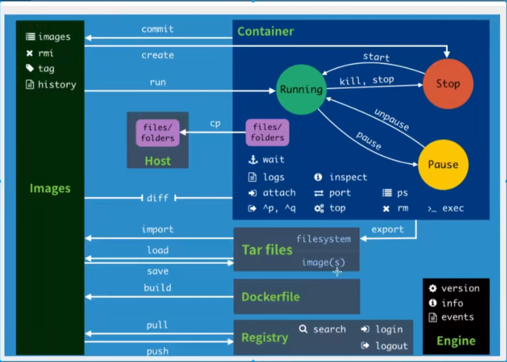


## 作业练习

### docker安装nginx

```shell
# 1、搜索镜像 search
# 2、下载镜像 pull
# 3、运行测试
[lighthouse@VM-12-17-centos ~]$ docker images
REPOSITORY              TAG          IMAGE ID       CREATED         SIZE
mysql                   latest       808391de2156   3 days ago      546MB
nginx                   latest       6084105296a9   8 days ago      133MB
centos                  latest       300e315adb2f   3 months ago    209MB
tensorflow/tensorflow   latest-py3   53187075965b   14 months ago   2.52GB

# -d 后台运行
# --name	给容器命名
# -p 宿主机端口:容器内部端口
[lighthouse@VM-12-17-centos ~]$ docker run -d --name nginx01 -p 3344:80 nginx
7ff54259c17c1996232269006d82a7a889256628ad37b3d33741c58e723eff4e
[lighthouse@VM-12-17-centos ~]$ docker ps
CONTAINER ID   IMAGE     COMMAND                  CREATED         STATUS         PORTS              
    NAMES
7ff54259c17c   nginx     "/docker-entrypoint.…"   7 seconds ago   Up 6 seconds   0.0.0.0:3344->80/tc
p   nginx01
[lighthouse@VM-12-17-centos ~]$ curl localhost:3344
<!DOCTYPE html>
<html>
<head>
<title>Welcome to nginx!</title>
<style>
    body {
        width: 35em;
        margin: 0 auto;
        font-family: Tahoma, Verdana, Arial, sans-serif;
    }
</style>
</head>
<body>
<h1>Welcome to nginx!</h1>
<p>If you see this page, the nginx web server is successfully installed and
working. Further configuration is required.</p>

<p>For online documentation and support please refer to
<a href="http://nginx.org/">nginx.org</a>.<br/>
Commercial support is available at
<a href="http://nginx.com/">nginx.com</a>.</p>

<p><em>Thank you for using nginx.</em></p>
</body>
</html>

# 进入容器
[lighthouse@VM-12-17-centos ~]$ docker exec -it nginx01 /bin/bash
root@7ff54259c17c:/# whereis nginx
nginx: /usr/sbin/nginx /usr/lib/nginx /etc/nginx /usr/share/nginx
root@7ff54259c17c:/# cd /etc/nginx/
root@7ff54259c17c:/etc/nginx# ls
conf.d          koi-utf  mime.types  nginx.conf   uwsgi_params
fastcgi_params  koi-win  modules     scgi_params  win-utf
```

### docker安装tomcat

```shell
# 官方的使用
docker run -it --rm tomcat:9.0

# 之前的容器启动都是后台启动，停止了容器之后，容器还是可以查看到的
# docker run -it --rm 一般是用来测试的，用完就删除 （一般不推荐这样做）

# 下载再启动
docker pull tomcat

# 启动测试
[lighthouse@VM-12-17-centos ~]$ docker run -d -p 3355:8080 --name tomcat01 tomcat
9e2d3f52cc1ee5021f8824d71d9043ab6499e11109e27a32d02ccbbc88cc18b6

# 进入容器
[lighthouse@VM-12-17-centos ~]$ docker exec -it tomcat01 /bin/bash
root@9e2d3f52cc1e:/usr/local/tomcat#

# 发现问题：linux命令太少了，默认是最小的镜像，所有不必要的都删除掉，保证最小可运行的环境！
```

### 部署es + kibana

```shell
# es 暴露的端口很多！
# es 十分的耗内存
# es 的数据一般需要放置到安全目录！挂载
# --net somenetwork ? 网络配置

# 启动
docker run -d --name elasticsearch -p 9200:9200 -p 9300:9300 -e "discovery.type=single-node" elasticsearch:7.6.2

# es 十分耗内存，启动了，linux就卡住了

# 查看cpu状态（不停变化）：docker stats 
CONTAINER ID   NAME            CPU %     MEM USAGE / LIMIT     MEM %     NET I/O     BLOCK I/O      
 PIDS
a14aa21608e3   elasticsearch   0.17%     1.243GiB / 1.795GiB   69.25%    656B / 0B   322MB / 729kB  
 42
9e2d3f52cc1e   tomcat01        0.09%     67.56MiB / 1.795GiB   3.68%     656B / 0B   148MB / 0B     
 30
 
# 测试一下es是否成功了
[lighthouse@VM-12-17-centos ~]$ curl localhost:9200
{
  "name" : "a14aa21608e3",
  "cluster_name" : "docker-cluster",
  "cluster_uuid" : "cgNtpJzKQFS6vFZ-uup2IA",
  "version" : {
    "number" : "7.6.2",
    "build_flavor" : "default",
    "build_type" : "docker",
    "build_hash" : "ef48eb35cf30adf4db14086e8aabd07ef6fb113f",
    "build_date" : "2020-03-26T06:34:37.794943Z",
    "build_snapshot" : false,
    "lucene_version" : "8.4.0",
    "minimum_wire_compatibility_version" : "6.8.0",
    "minimum_index_compatibility_version" : "6.0.0-beta1"
  },
  "tagline" : "You Know, for Search"
}

# 赶紧关闭，增加内存限制
[lighthouse@VM-12-17-centos ~]$ docker stop $(docker ps -aq)
a14aa21608e3
9e2d3f52cc1e
[lighthouse@VM-12-17-centos ~]$ docker ps
CONTAINER ID   IMAGE     COMMAND   CREATED   STATUS    PORTS     NAMES

# 修改配置文件 -e 环境配置修改 : -e ES_JAVA_OPTS="-Xms64m -Xmx512m"
docker run -d --name elasticsearch_StrictMemory -p 9200:9200 -p 9300:9300 -e "discovery.type=single-node" -e ES_JAVA_OPTS="-Xms64m -Xmx512m" elasticsearch:7.6.2

# 执行命令
[lighthouse@VM-12-17-centos ~]$ docker run -d --name elasticsearch_StrictMemory -p 9200:9200 -p 9300
:9300 -e "discovery.type=single-node" -e ES_JAVA_OPTS="-Xms64m -Xmx512m" elasticsearch:7.6.2
7da8cf0bb5a98724aa12b0f850478a94f6fda9d42c70cfdded61584848a791c4
[lighthouse@VM-12-17-centos ~]$ docker ps
CONTAINER ID   IMAGE                 COMMAND                  CREATED          STATUS          PORTS
                                            NAMES
7da8cf0bb5a9   elasticsearch:7.6.2   "/usr/local/bin/dock…"   29 seconds ago   Up 27 seconds   0.0.0
.0:9200->9200/tcp, 0.0.0.0:9300->9300/tcp   elasticsearch_StrictMemory

# 查看状态
[lighthouse@VM-12-17-centos ~]$ docker stats 7da8cf0bb5a9
# 进入后显示
CONTAINER ID   NAME                         CPU %     MEM USAGE / LIMIT     MEM %     NET I/O     BL
OCK I/O       PIDS
7da8cf0bb5a9   elasticsearch_StrictMemory   0.77%     388.2MiB / 1.795GiB   21.12%    656B / 0B   11
6MB / 729kB   41
# 测试成功
[lighthouse@VM-12-17-centos ~]$ curl localhost:9200
{
  "name" : "7da8cf0bb5a9",
  "cluster_name" : "docker-cluster",
  "cluster_uuid" : "eYN4svxcQ4aQMeQOP-8Lyg",
  "version" : {
    "number" : "7.6.2",
    "build_flavor" : "default",
    "build_type" : "docker",
    "build_hash" : "ef48eb35cf30adf4db14086e8aabd07ef6fb113f",
    "build_date" : "2020-03-26T06:34:37.794943Z",
    "build_snapshot" : false,
    "lucene_version" : "8.4.0",
    "minimum_wire_compatibility_version" : "6.8.0",
    "minimum_index_compatibility_version" : "6.0.0-beta1"
  },
  "tagline" : "You Know, for Search"
}
```

### 使用kibana

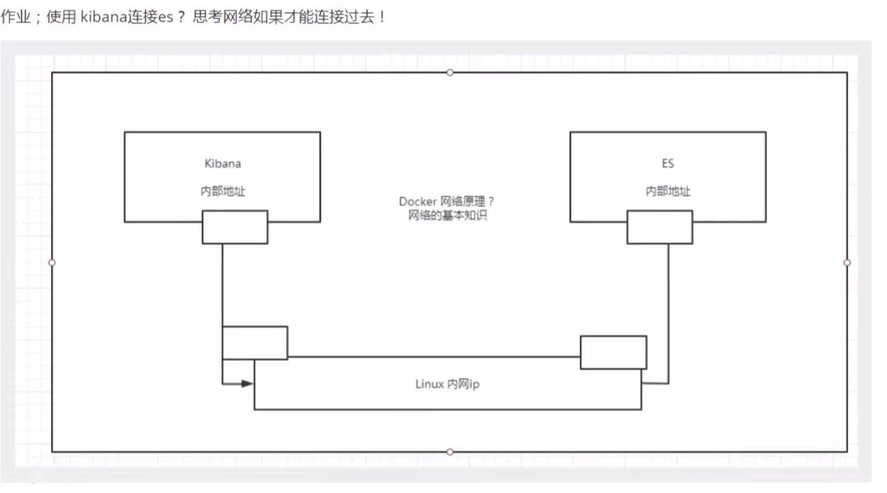

## 可视化


- portainer（先用这个）

- Rancher （CI/CD再用）

**什么是portainer？**

Docker图形化界面管理工具！提供一个后台面板供我们操作！

```shell
docker run -d -p 80:9000 --restart=always -v /var/run/docker.sock:/var/run/docker.sock --privileged=true --name portainer portainer/portainer

# 测试 
ip地址:你设置的端口号

# 1，设置密码创建用户
# 2，选择本地的
# 3，进入后会展示一个面板
```

展示如下：

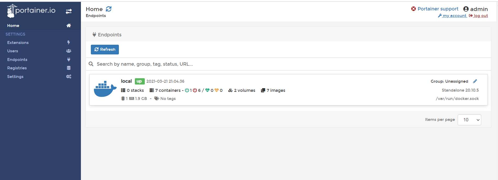

可视化面板平时少用，这里主要测试玩一下！


# Docker镜像讲解

## 镜像是什么

镜像是一种轻量级，可执行的独立软件包，用来打包软件运行环境和基于运行环境开发的软件，它包含运行某个软件所需要的所有内容，包括代码，运行时，库，环境变量和配置文件。

所有的应用，直接打包docker镜像，就可以直接跑起来！

如何得到镜像：

- 从远程仓库下载
- 直接拷贝一个
- 自己制作一个镜像 DockerFile

## Docker镜像加载原理

> UnionFS （联合文件系统）
>
> 我们下载的时候看到的一层一层的就是这个！

UnionFS（联合文件系统）：UnionFS 是一种分层，轻量级并且高性能的文件系统，它支持对文件系统的修改作为一次提交来一层层的叠加，同时可以将不同的目录挂载到同一虚拟文件系统下（unite several directories into a single virtual filesystem）。

Union文件系统是Docker镜像的基础。

镜像可以通过分层来进行继承，基于基础镜像（没有父镜像），可以制作各种具体的应用镜像。

特点：一次同时加载多个文件系统，但从外面看起来，只能看到一个文件系统，联合加载会把各层文件系统叠加起来，这样最终的文件系统会包含所有底层的文件和目录。

> Docker镜像加载原理

docker的镜像实际上由一层层的文件系统组成，这种层级的文件系统UnionFS。

bootfs（boot file system）主要包含bootloader和kernel，bootloader主要是引导加载kernel，linux刚启动时会加载bootfs文件系统，在Docker镜像的最底层时bootfs。这一层与我们典型的Linux/Unix系统是一样的，包含boot加载器和内核。当boot加载完成之后整个内核就都在内存中了，此时内存的使用权已由bootfs转交给内核，此时系统也会卸载bootfs。

rootfs（root file system），在bootfs之上。包含的就是典型的Linux系统中的 /dev, /proc, /bin, /etc 等标准目录和文件。rootfs就是各种不同的操作系统发行版，比如Ubuntu，Centos等等。

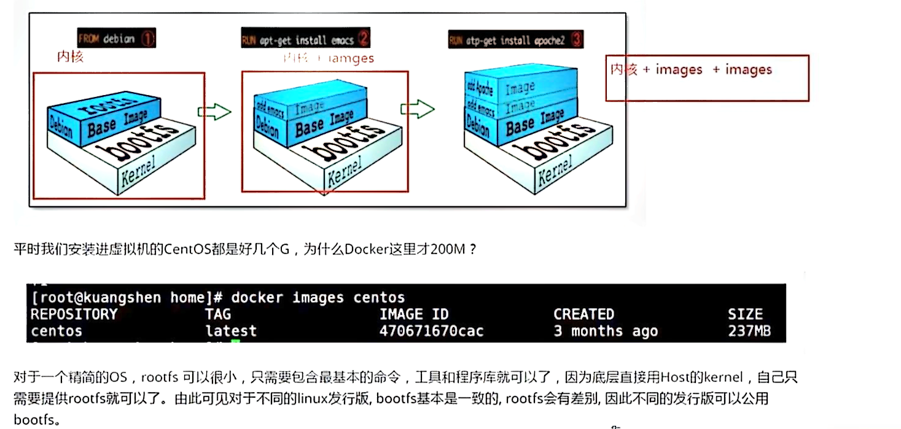

**虚拟机是分钟级别，容器是秒级！**

## 分层理解

> 分层的理解

我们可以去下载一个镜像，注意观察下载的日志输出，可以看到是一层一层的在下载！

```shell
[lighthouse@VM-12-17-centos ~]$ docker pull redis
Using default tag: latest
latest: Pulling from library/redis
6f28985ad184: Already exists 
60e8b46025d8: Pull complete 
122fe26e50b0: Pull complete 
de3ca1eb2e20: Pull complete 
4813a7e5bd57: Pull complete 
99dd8d3a66f2: Pull complete 
Digest: sha256:e97d506be34a39fa69f45eea846080d6985c2c9ee338c0d408c7ea4347f014a5
Status: Downloaded newer image for redis:latest
docker.io/library/redis:latest

# 检查 一下层 --> Layer
[lighthouse@VM-12-17-centos ~]$ docker inspect redis
[
    {
        "Id": "sha256:a617c1c92774952d26fb87ba9a32fdc4d424fb7be02bbc84d6fefb517f3d4c6c",
        "RepoTags": [
            "redis:latest"
        ],
        "RepoDigests": [
            "redis@sha256:e97d506be34a39fa69f45eea846080d6985c2c9ee338c0d408c7ea4347f014a5"
        ],
        "Parent": "",
        "Comment": "",
        "Created": "2021-03-13T04:01:57.610005612Z",
        "Container": "a9f0ab5297860612c3f7050d86937161a03540cb5193d8bb2a0a1a2377c61265",
        "ContainerConfig": {
            "Hostname": "a9f0ab529786",
            "Domainname": "",
            "User": "",
            "AttachStdin": false,
            "AttachStdout": false,
            "AttachStderr": false,
            "ExposedPorts": {
                "6379/tcp": {}
            },
            "Tty": false,
            "OpenStdin": false,
            "StdinOnce": false,
            "Env": [
                "PATH=/usr/local/sbin:/usr/local/bin:/usr/sbin:/usr/bin:/sbin:/bin",
                "GOSU_VERSION=1.12",
                "REDIS_VERSION=6.2.1",
                "REDIS_DOWNLOAD_URL=http://download.redis.io/releases/redis-6.2.1.tar.gz",
                "REDIS_DOWNLOAD_SHA=cd222505012cce20b25682fca931ec93bd21ae92cb4abfe742cf7b76aa907520"
            ],
            "Cmd": [
                "/bin/sh",
                "-c",
                "#(nop) ",
                "CMD [\"redis-server\"]"
            ],
            "Image": "sha256:e0ab32f36e0782a1420c82cee86df96571cd0dd89c8c704941418003cd81fdc4",
            "Volumes": {
                "/data": {}
            },
            "WorkingDir": "/data",
            "Entrypoint": [
                "docker-entrypoint.sh"
            ],
            "OnBuild": null,
            "Labels": {}
        },
        "DockerVersion": "19.03.12",
        "Author": "",
        "Config": {
            "Hostname": "",
            "Domainname": "",
            "User": "",
            "AttachStdin": false,
            "AttachStdout": false,
            "AttachStderr": false,
            "ExposedPorts": {
                "6379/tcp": {}
            },
            "Tty": false,
            "OpenStdin": false,
            "StdinOnce": false,
            "Env": [
                "PATH=/usr/local/sbin:/usr/local/bin:/usr/sbin:/usr/bin:/sbin:/bin",
                "GOSU_VERSION=1.12",
                "REDIS_VERSION=6.2.1",
                "REDIS_DOWNLOAD_URL=http://download.redis.io/releases/redis-6.2.1.tar.gz",
                "REDIS_DOWNLOAD_SHA=cd222505012cce20b25682fca931ec93bd21ae92cb4abfe742cf7b76aa907520"
            ],
            "Cmd": [
                "redis-server"
            ],
            "Image": "sha256:e0ab32f36e0782a1420c82cee86df96571cd0dd89c8c704941418003cd81fdc4",
            "Volumes": {
                "/data": {}
            },
            "WorkingDir": "/data",
            "Entrypoint": [
                "docker-entrypoint.sh"
            ],
            "OnBuild": null,
            "Labels": null
        },
        "Architecture": "amd64",
        "Os": "linux",
        "Size": 105305444,
        "VirtualSize": 105305444,
        "GraphDriver": {
            "Data": {
                "LowerDir": "/var/lib/docker/overlay2/e09ab44fd47c1744a23a10bae4688c4b859d13c7969c1c78fc3e72fe3f55d79a/diff:/var/lib/docker/overlay2/676cdd03308c83900e9e4d02a2bbdcb9b24dff44cc5968ae221311be744190b8/diff:/var/lib/docker/overlay2/8dad075029b2fc62e0c8ee3300b5319cc48deac7f1c5b4f1a4227fdc3baf514f/diff:/var/lib/docker/overlay2/541533c9c7bfb7d9c8f3f5fecc64b553e5dba78f32b1b92ed541ee05b71b3af8/diff:/var/lib/docker/overlay2/e7e5ff825cfd832e8c5ac594aa0f6a07ef69a66e79f4bccbd177b04b2a9b7f9b/diff",
                "MergedDir": "/var/lib/docker/overlay2/4ece2b0b5fe1e7f41b9bdbe59f498877f8b1faff47b5875c6b6adf2c15ad8130/merged",
                "UpperDir": "/var/lib/docker/overlay2/4ece2b0b5fe1e7f41b9bdbe59f498877f8b1faff47b5875c6b6adf2c15ad8130/diff",
                "WorkDir": "/var/lib/docker/overlay2/4ece2b0b5fe1e7f41b9bdbe59f498877f8b1faff47b5875c6b6adf2c15ad8130/work"
            },
            "Name": "overlay2"
        },
        "RootFS": {
            "Type": "layers",
            "Layers": [
                "sha256:14a1ca976738392ffa2ae4e54934ba28ab9cb756e924ad9297a4795a4adbfdf6",
                "sha256:a6b7270e6c20bae1d8c5d009171ce7db2e268c3d32e447a2ec4f33b02b256955",
                "sha256:cf2aefb51919d2cf15e3311fec4e187f968e06f168ee610d500e81757b53a3f7",
                "sha256:1d07bac5c7c7346740c618c2aa66e42d3042f1e231fc19128b90ab3839154cae",
                "sha256:9cf6f7d59322e560ceafc06f8896f3c8b0edca76b0598a4d4873850f4ee337eb",
                "sha256:e32a54e9cf7b7e9c94e5d3cd970b1f86be965a3723cc684f5013abb640e95482"
            ]
        },
        "Metadata": {
            "LastTagTime": "0001-01-01T00:00:00Z"
        }
    }
]
```

理解：

所有的Docker镜像都起始于一个基础镜像层，当进行修改或增加新的内容时，就会在当前镜像层之上，创建新的镜像层。

> 特点

Docker镜像都是只读的，当容器启动时，一个新的可写层被加载到镜像的顶部！

这一层就是我们通常说的容器层，容器之下的都叫镜像层！

## Commit镜像

```shell
docker commit 提交容器成为一个新的副本

# 命令和git原理类似
docker commit -m="提交的描述信息" -a="作者" 容器id 目标镜像名:[TAG]
```

实战测试


```shell
# 1 启动一个默认的tomcat
# 2 发现没有 webapps应用，原因是官方镜像默认 webapps目录下没有文件的！

# 3 现在拷贝一些文件进去

# 4 提交镜像，以后就使用修改过的镜像了！
[lighthouse@VM-12-17-centos ~]$ docker commit -a="jungle8884" -m="add webapps app" e26ee544e9d5 tomcat02:1.0
sha256:4ee667b1fe39bdf4ab25a2c155ba4e0db66043e5b6588921c80b6d174cdf1fa5
[lighthouse@VM-12-17-centos ~]$ docker images
REPOSITORY              TAG          IMAGE ID       CREATED          SIZE
tomcat02                1.0          4ee667b1fe39   31 seconds ago   672MB
portainer/portainer     latest       580c0e4e98b0   3 days ago       79.1MB
mysql                   latest       808391de2156   4 days ago       546MB
tomcat                  latest       08efef7ca980   8 days ago       667MB
redis                   latest       a617c1c92774   9 days ago       105MB
nginx                   latest       6084105296a9   9 days ago       133MB
centos                  latest       300e315adb2f   3 months ago     209MB
elasticsearch           7.6.2        f29a1ee41030   12 months ago    791MB
tensorflow/tensorflow   latest-py3   53187075965b   14 months ago    2.52GB
```

学习方式：实践和理论相结合！

```shell
如果你想要保存当前容器的状态，就可以通过commit来提交，获得一个镜像，就好比一个快照。
```

**到了这里，算是入门Docker!**

------


# 容器数据卷

## 什么是容器数据卷

将应用和环境打包成一个镜像！

数据？如果数据都在容器中，那么当容器被删除后，数据就会丢失！

**需求：数据可以持久化！**

举例：MySQL删了，就删库跑路了？---> 需求：MySQL数据可以存储在本地！

容器之间可以有一个数据共享的技术！Docker容器中产生的数据，同步到本地！

这就是卷技术！目录的挂载，将我们容器内的目录，挂载到Linux上面！

**总结：容器数据的持久化和同步操作！容器间也是可以数据共享的！**


## 使用数据卷

> 方式一：直接使用命令来挂载  -v

```shell
docker run -it -v 主机目录:容器内目录

# 测试
[lighthouse@VM-12-17-centos ~]$ docker run -it -v /home/test:/home centos /bin/bash

# 看挂载是否成功
[lighthouse@VM-12-17-centos ~]$ docker inspect 容器ID

...
"Mounts": [
            {
                "Type": "bind",
                "Source": "/home/test",  # 主机内地址
                "Destination": "/home",  # docker容器内的地址
                "Mode": "",
                "RW": true,
                "Propagation": "rprivate"
            }
        ],
...
```

**测试文件的同步：双向绑定！**

1. 停止容器
2. 宿主机上修改文件
3. 启动容器
4. 容器内的数据依旧是同步的！

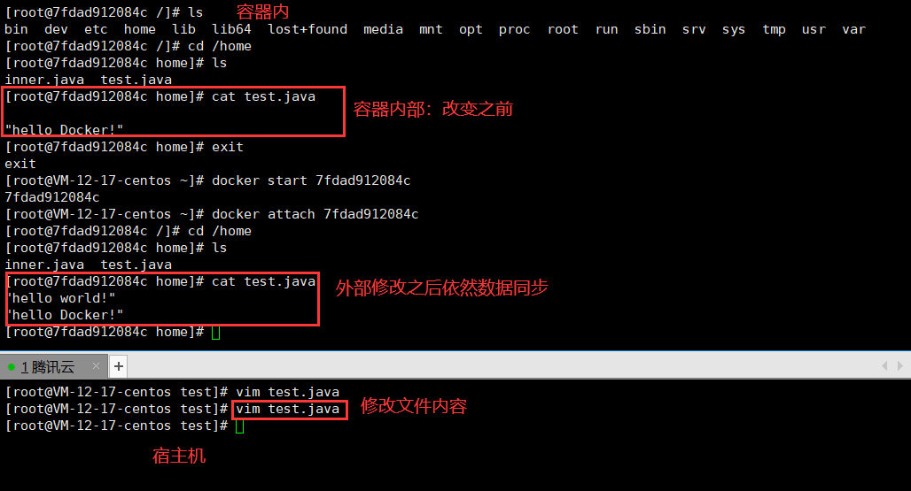

**以后修改只需要在本地修改即可，容器会自动同步！**


## 实战：安装MySQL

> 先配置镜像加速：
>
> 过程参考：https://cloud.tencent.com/document/product/1207/45596
>
> 您可以通过修改daemon配置文件/etc/docker/daemon.json来使用加速器
>
> ```linux
> vim /etc/docker/daemon.json
> 按 i 切换至编辑模式，添加以下内容，并保存。
> {
>     "registry-mirrors": [
>      "https://xi6ud8aw.mirror.aliyuncs.com",
>      "https://mirror.ccs.tencentyun.com"
>     ]
> }
> ESC : wq
> sudo systemctl daemon-reload
> sudo systemctl restart docker
> ```

```shell
# 获取镜像
[root@VM-12-17-centos /]# docker pull mysql:5.7

# 运行容器，需要做数据挂载！
# 安装启动mysql，需要配置密码的，重点注意！
# 官方测试：docker run --name some-mysql -e MYSQL_ROOT_PASSWORD=my-secret-pw -d mysql:tag

# 启动自己的mysql:5.7
-d 后台运行
-p 端口映射
-v 卷挂载
	- 两个 -v 挂载了两个目录
	- /home/mysql/conf:/etc/mysql/conf.d
	- /home/mysql/data:/var/lib/mysql
-e 环境配置
	- 设置密码
	- MYSQL_ROOT_PASSWORD='root'
--name 容器命名
# 后台运行
[root@VM-12-17-centos ~]# docker run -d -p 3306:3306 -v /home/mysql/conf:/etc/mysql/conf.d -v /home/mysql/data:/var/lib/mysql -e MYSQL_ROOT_PASSWORD=123456 --name mysql mysql:5.7
# 查看版本：
root@becd70b00532:/etc/mysql# mysql --version
mysql  Ver 14.14 Distrib 5.7.33, for Linux (x86_64) using  EditLine wrapper

# 下面遇到了问题，还未解决！！！
    # 启动成功后，在本地使用 sqlyog 来测试一下
        # 一直登录不上，于是：
        # 删除之前的容器：
            - docker rm -f $(docker ps -aq)
            - 重新 run 
        # 进入mysql容器：
            - docker exec -it mysql bash
            - mysql -uroot -proot
            - 修改配置文件
                no-auto-rehash
                socket = /application/mysql5.5.62/tmp/mysql.sock
        # 修改配置文件之前先安装vim
        - apt-get update
        - apt-get install -y vim	
    # sqlyog 连接到服务器的3306 --> 容器内的3306映射，这个时候就可以连上了！
    # 在本地测试创建一个数据库，查看一下我们的映射路径是否ok！
```

假设我们将容器删除，发现挂载到本地的数据卷依旧没有丢失，这就实现了容器数据持久化功能！


## 具名挂载和匿名挂载

```shell
# 匿名挂载
	-P 随机指定端口
	-v 容器内路径： 随机指定映射目录
[root@VM-12-17-centos ~]# docker run -d -P --name nginx01 -v /etc/nginx nginx
Unable to find image 'nginx:latest' locally
latest: Pulling from library/nginx
6f28985ad184: Already exists 
29f7ebf60efd: Pull complete 
879a7c160ac6: Pull complete 
de58cd48a671: Pull complete 
be704f37b5f4: Pull complete 
158aac73782c: Pull complete 
Digest: sha256:d2925188effb4ddca9f14f162d6fba9b5fab232028aa07ae5c1dab764dca8f9f
Status: Downloaded newer image for nginx:latest
2e111eb97cc8d20d4aef1ce54f5fd311279ec854056447bae7a3af7420ca8421


# 查看所有卷的情况：
[root@VM-12-17-centos ~]# docker volume ls
DRIVER    VOLUME NAME
local     828d6d2677f6c367870ac7b1d516fe57abd13cb49c0d3bc159b904d1f7883c9e

# 上面这种就是匿名挂载，在 -v 只写了容器内的路径，没有写容器外的路径！

# 具名挂载
[root@VM-12-17-centos ~]# docker run -d -P --name nginx02 -v jm-nginx:/etc/nginx nginx
727d082ae3f3312199cd3fb264912196d74c97046f1a4154900dfd0c687e90a1

[root@VM-12-17-centos ~]# docker volume ls
DRIVER    VOLUME NAME
local     828d6d2677f6c367870ac7b1d516fe57abd13cb49c0d3bc159b904d1f7883c9e
local     jm-nginx

# 通过 -v 卷名:容器内路径
# 查看一下这个卷
[root@VM-12-17-centos ~]# docker volume inspect jm-nginx
[
    {
        "CreatedAt": "2021-03-24T20:02:57+08:00",
        "Driver": "local",
        "Labels": null,
        "Mountpoint": "/var/lib/docker/volumes/jm-nginx/_data",
        "Name": "jm-nginx",
        "Options": null,
        "Scope": "local"
    }
]
```

所有的docker容器内的卷，没有指定目录的情况下都是在 **/var/lib/docker/volumes/卷名/_data** 

我们通过具名挂载可以方便的找到我们的一个卷，大多数情况下使用**具名挂载**

```shell
# 如何区分：
-v 容器内路径			    # 匿名挂载
-v 卷名:容器内路径		  	  # 具名挂载
-v /宿主机路径:容器内路径 	# 指定路径挂载
```

拓展：

```shell
# 通过 -v 容器内路径: ro rw 改变读写权限
ro readonly		# 只读
rw readwrite	# 可读可写 （默认）

# 一旦这个设置了容器权限，容器对我们挂载出来的内容就有限定了！
docker run -d -P --name nginx02 -v jm-nginx:/etc/nginx:ro nginx
docker run -d -P --name nginx02 -v jm-nginx:/etc/nginx:rw nginx

# ro 只要看到ro，就说明这个路径只能通过宿主机来操作，容器内部是无法操作！
```


## 初识dockerfile

dockerfile 就是用来构建docker镜像的构建文件！命令文件！先试一下！

通过这个脚本可以生成镜像，镜像是一层一层的，脚本是一个一个的命令，每个命令都是一层！

```shell
# 创建一个dockerfile文件，就命名为dockerfile
# 文件中的内容：指令（大写）	参数
FROM centos

VOLUME ["volume01", "volume02"]

CMD echo "----end----"
CMD /bin/bash
# 这里的每个命令，就是镜像的一层

# 通过dockerfile 一层一层的创建一个镜像
[root@VM-12-17-centos docker-test-volume]# docker build -f /home/docker-test-volume/dockerfile -t jungle/centos-1.0 .
Sending build context to Docker daemon  2.048kB
Step 1/4 : FROM centos
latest: Pulling from library/centos # 没有先下载镜像
7a0437f04f83: Pull complete 
Digest: sha256:5528e8b1b1719d34604c87e11dcd1c0a20bedf46e83b5632cdeac91b8c04efc1
Status: Downloaded newer image for centos:latest
 ---> 300e315adb2f
Step 2/4 : VOLUME ["volume01", "volume02"]
 ---> Running in 1245dba17cb1
Removing intermediate container 1245dba17cb1
 ---> b6d98a3f65c9
Step 3/4 : CMD echo "----end----"
 ---> Running in aaecae89834a
Removing intermediate container aaecae89834a
 ---> 27439f8d29ce
Step 4/4 : CMD /bin/bash
 ---> Running in fdac3233a280
Removing intermediate container fdac3233a280
 ---> e92a974f1021
Successfully built e92a974f1021
Successfully tagged jungle/centos-1.0:latest
# 查看镜像
[root@VM-12-17-centos docker-test-volume]# docker images
REPOSITORY            TAG       IMAGE ID       CREATED          SIZE
jungle/centos-1.0     latest    e92a974f1021   26 seconds ago   209MB
mysql                 5.7       2fb283157d3c   4 days ago       449MB
portainer/portainer   latest    580c0e4e98b0   5 days ago       79.1MB
centos                latest    300e315adb2f   3 months ago     209MB
# 测试一下自己创建的镜像
[root@VM-12-17-centos docker-test-volume]# docker run -it e92a974f1021 /bin/bash
[root@b25289925c02 /]# ls -l
total 56
lrwxrwxrwx   1 root root    7 Nov  3 15:22 bin -> usr/bin
drwxr-xr-x   5 root root  360 Mar 24 13:38 dev
drwxr-xr-x   1 root root 4096 Mar 24 13:38 etc
drwxr-xr-x   2 root root 4096 Nov  3 15:22 home
lrwxrwxrwx   1 root root    7 Nov  3 15:22 lib -> usr/lib
lrwxrwxrwx   1 root root    9 Nov  3 15:22 lib64 -> usr/lib64
drwx------   2 root root 4096 Dec  4 17:37 lost+found
drwxr-xr-x   2 root root 4096 Nov  3 15:22 media
drwxr-xr-x   2 root root 4096 Nov  3 15:22 mnt
drwxr-xr-x   2 root root 4096 Nov  3 15:22 opt
dr-xr-xr-x 117 root root    0 Mar 24 13:38 proc
dr-xr-x---   2 root root 4096 Dec  4 17:37 root
drwxr-xr-x  11 root root 4096 Dec  4 17:37 run
lrwxrwxrwx   1 root root    8 Nov  3 15:22 sbin -> usr/sbin
drwxr-xr-x   2 root root 4096 Nov  3 15:22 srv
dr-xr-xr-x  13 root root    0 Mar 24 13:38 sys
drwxrwxrwt   7 root root 4096 Dec  4 17:37 tmp
drwxr-xr-x  12 root root 4096 Dec  4 17:37 usr
drwxr-xr-x  20 root root 4096 Dec  4 17:37 var
drwxr-xr-x   2 root root 4096 Mar 24 13:38 volume01 	# 自动挂载的数据卷
drwxr-xr-x   2 root root 4096 Mar 24 13:38 volume02		# 自动挂载的数据卷
```

> 这个卷和外部一定有一个同步的目录！
>
> **VOLUME ["volume01", "volume02"]** 是匿名挂载！
>
> 查看挂载路径：

```shell
[root@7e49718fbcbb /]# cd v # 按两下TAB键
var/      volume01/ volume02/ 
[root@7e49718fbcbb /]# cd volume01
[root@7e49718fbcbb volume01]# touch container.txt
[root@7e49718fbcbb volume01]# ls
container.txt

# 找到路径：符合上面匿名挂载所记录的！
	- /var/lib/docker/volumes/4768a92f2cc7103e287e15cdd1801efbfe2004a4bba8ca46ecc2cd671d2eb745/_data
	- /var/lib/docker/volumes/cdce4b6ba6ccd6a609fe1733ae9d83c0da5ff4efd75b591a5979f6eb753c32a8/_data
[root@VM-12-17-centos ~]# docker inspect 7e49718fbcbb

"Mounts": [
            {
                "Type": "volume",
                "Name": "4768a92f2cc7103e287e15cdd1801efbfe2004a4bba8ca46ecc2cd671d2eb745",
                "Source": "/var/lib/docker/volumes/4768a92f2cc7103e287e15cdd1801efbfe2004a4bba8ca46ecc2cd671d2eb745/_data",
                "Destination": "volume02",
                "Driver": "local",
                "Mode": "",
                "RW": true,
                "Propagation": ""
            },
            {
                "Type": "volume",
                "Name": "cdce4b6ba6ccd6a609fe1733ae9d83c0da5ff4efd75b591a5979f6eb753c32a8",
                "Source": "/var/lib/docker/volumes/cdce4b6ba6ccd6a609fe1733ae9d83c0da5ff4efd75b591a5979f6eb753c32a8/_data",
                "Destination": "volume01",
                "Driver": "local",
                "Mode": "",
                "RW": true,
                "Propagation": ""
            }
        ],
```

测试发现数据已经同步了！

```shell
# 容器内
[root@7e49718fbcbb volume01]# touch testvolume01.txt
[root@7e49718fbcbb volume01]# ls
container.txt  testvolume01.txt

# 宿主机
[root@VM-12-17-centos _data]# cd /var/lib/docker/volumes/cdce4b6ba6ccd6a609fe1733ae9d83c0da5ff4efd75b591a5979f6eb753c32a8/_data
[root@VM-12-17-centos _data]# ls
container.txt  testvolume01.txt
```

以后这种方式会常用，因为会构建自己的镜像，否则需要手动通过 -v 卷名:容器内路径 来挂载！

## 数据卷容器

### 多个容器同步数据

> - 就是两个或者多个容器之前实现数据共享
> - 新容器 --volumes-from 父容器

```shell
# 启动三个自己创建的镜像

# 创建第一个容器：父容器
[root@VM-12-17-centos ~]# docker run -it --name docker01 jungle/centos-1.0 
[root@f1ecdfa6dc83 /]# ls -l
total 56
lrwxrwxrwx   1 root root    7 Nov  3 15:22 bin -> usr/bin
drwxr-xr-x   5 root root  360 Mar 25 02:03 dev
drwxr-xr-x   1 root root 4096 Mar 25 02:03 etc
drwxr-xr-x   2 root root 4096 Nov  3 15:22 home
lrwxrwxrwx   1 root root    7 Nov  3 15:22 lib -> usr/lib
lrwxrwxrwx   1 root root    9 Nov  3 15:22 lib64 -> usr/lib64
drwx------   2 root root 4096 Dec  4 17:37 lost+found
drwxr-xr-x   2 root root 4096 Nov  3 15:22 media
drwxr-xr-x   2 root root 4096 Nov  3 15:22 mnt
drwxr-xr-x   2 root root 4096 Nov  3 15:22 opt
dr-xr-xr-x 108 root root    0 Mar 25 02:03 proc
dr-xr-x---   2 root root 4096 Dec  4 17:37 root
drwxr-xr-x  11 root root 4096 Dec  4 17:37 run
lrwxrwxrwx   1 root root    8 Nov  3 15:22 sbin -> usr/sbin
drwxr-xr-x   2 root root 4096 Nov  3 15:22 srv
dr-xr-xr-x  13 root root    0 Mar 24 13:38 sys
drwxrwxrwt   7 root root 4096 Dec  4 17:37 tmp
drwxr-xr-x  12 root root 4096 Dec  4 17:37 usr
drwxr-xr-x  20 root root 4096 Dec  4 17:37 var
drwxr-xr-x   2 root root 4096 Mar 25 02:03 volume01
drwxr-xr-x   2 root root 4096 Mar 25 02:03 volume02

# 创建第二个容器
[root@VM-12-17-centos ~]# docker run -it --name docker02 --volumes-from docker01 jungle/centos-1.0
[root@95e7afee95b8 /]# ls -l
total 56
lrwxrwxrwx   1 root root    7 Nov  3 15:22 bin -> usr/bin
drwxr-xr-x   5 root root  360 Mar 25 02:12 dev
drwxr-xr-x   1 root root 4096 Mar 25 02:12 etc
drwxr-xr-x   2 root root 4096 Nov  3 15:22 home
lrwxrwxrwx   1 root root    7 Nov  3 15:22 lib -> usr/lib
lrwxrwxrwx   1 root root    9 Nov  3 15:22 lib64 -> usr/lib64
drwx------   2 root root 4096 Dec  4 17:37 lost+found
drwxr-xr-x   2 root root 4096 Nov  3 15:22 media
drwxr-xr-x   2 root root 4096 Nov  3 15:22 mnt
drwxr-xr-x   2 root root 4096 Nov  3 15:22 opt
dr-xr-xr-x 109 root root    0 Mar 25 02:12 proc
dr-xr-x---   2 root root 4096 Dec  4 17:37 root
drwxr-xr-x  11 root root 4096 Dec  4 17:37 run
lrwxrwxrwx   1 root root    8 Nov  3 15:22 sbin -> usr/sbin
drwxr-xr-x   2 root root 4096 Nov  3 15:22 srv
dr-xr-xr-x  13 root root    0 Mar 24 13:38 sys
drwxrwxrwt   7 root root 4096 Dec  4 17:37 tmp
drwxr-xr-x  12 root root 4096 Dec  4 17:37 usr
drwxr-xr-x  20 root root 4096 Dec  4 17:37 var
drwxr-xr-x   2 root root 4096 Mar 25 02:03 volume01
drwxr-xr-x   2 root root 4096 Mar 25 02:03 volume02

# 测试一下是否同步数据
	# 父容器docker01
	[root@95e7afee95b8 /]# cd volume01
    [root@95e7afee95b8 volume01]# touch docker01 
    [root@95e7afee95b8 volume01]# ls
    docker01
	# 新容器docker02
    [root@f1ecdfa6dc83 /]# cd volume01
    [root@f1ecdfa6dc83 volume01]# ls
    docker01
# docker01 创建的文件 自动同步到了 docker02
# 此时，docker01 成为数据卷容器
    
    
# 创建第三个容器：
[root@VM-12-17-centos ~]# docker run -it --name docker03 --volumes-from docker01 jungle/centos-1.0
[root@67471a052b6f /]# cd volume01
[root@67471a052b6f volume01]# ls
docker01

# 容器之间数据共享：
	# 容器docker03:
	[root@67471a052b6f volume01]# touch docker03
    [root@67471a052b6f volume01]# ls -l
    total 0
    -rw-r--r-- 1 root root 0 Mar 25 02:17 docker01
    -rw-r--r-- 1 root root 0 Mar 25 02:25 docker03

	# 容器docker01:
	[root@f1ecdfa6dc83 volume01]# ls -l
    total 0
    -rw-r--r-- 1 root root 0 Mar 25 02:17 docker01
    -rw-r--r-- 1 root root 0 Mar 25 02:25 docker03

	# 容器docker02:
	[root@95e7afee95b8 volume01]# ls -l
    total 0
    -rw-r--r-- 1 root root 0 Mar 25 02:17 docker01
    -rw-r--r-- 1 root root 0 Mar 25 02:25 docker03
# 通过 --volumes-from 实现了容器间数据共享！

```

```shell
# 测试：删除docker01，查看一下docker02和docker03是否还可以访问这个文件
# 测试依旧可以访问
# 说明这个是数据拷贝概念
```

### 实现多个mysql之间数据同步

```shell
docker run -d -p 3301:3306 -v mysql01:/etc/mysql/conf.d -v mysql01:/var/lib/mysql -e MYSQL_ROOT_PASSWORD=123456 --name mysql01 mysql:5.7

docker run -d -p 3301:3306 -e MYSQL_ROOT_PASSWORD=123456 --name mysql02 --volumes-from mysql01 mysql:5.7

docker run -d -p 3301:3306 -e MYSQL_ROOT_PASSWORD=123456 --name mysql03 --volumes-from mysql01 mysql:5.7
```

> 结论：
>
> 容器之间配置信息的传递，数据卷容器的生命周期一直持续到没有容器使用为止。
>
> 但是一旦持久化到了本地，这个时候，本地的数据是不会删除的！


# DockerFile

## DockerFile介绍

dockerfile 是用来构建docker镜像的文件！命令参数脚本！

构建步骤：

1. 编写一个dockerfile文件
2. docker build 构建成为一个镜像
3. docker run 运行镜像
4. docker push 发布镜像 （docker hub）

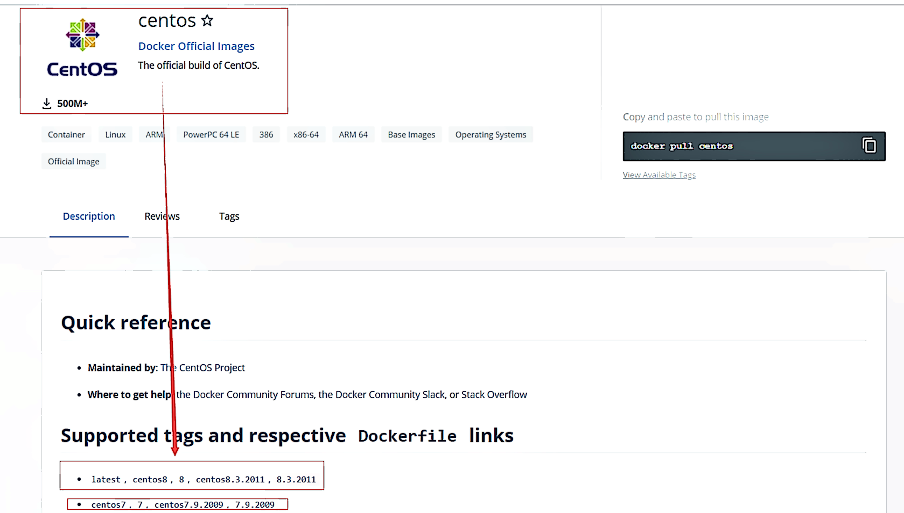


打开官方镜像链接，查看步骤：

```shell
FROM scratch
ADD centos-8-x86_64.tar.xz /
LABEL org.label-schema.schema-version="1.0"     org.label-schema.name="CentOS Base Image"     org.label-schema.vendor="CentOS"     org.label-schema.license="GPLv2"     org.label-schema.build-date="20201204"
CMD ["/bin/bash"]
```

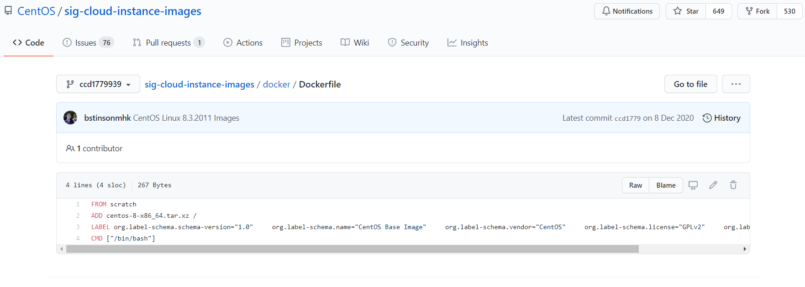

> 很多官方镜像都是基础包，很多功能没有，我们通常会自己搭建自己的镜像！
>
> 官方既然可以制作镜像，说明我们也可以！


## DockerFile构建过程

**基础知识：**

1. 每个保留关键字（指令）都必须是大写字母
2. 执行从上到下顺序执行
3. ’#‘ 表示注释
4. 每一个指令都会创建一个新的镜像层，并提交！

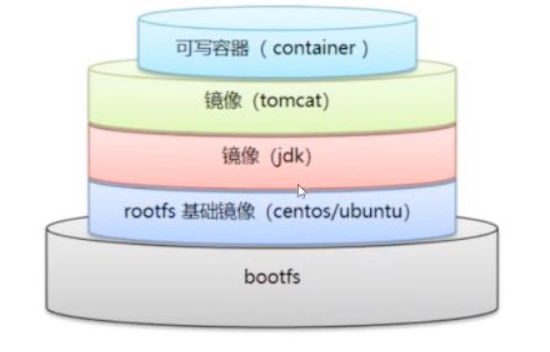

dockerfile 是面向开发的，以后发布项目，做镜像，就需要编写dockerfile文件，这个文件十分简单！

Docker 镜像逐渐成为企业交付的标准，必须掌握！

步骤：开发，部署，运维 缺一不可！

DockerFile：构建文件，定义了一切的步骤，源代码；

DockerImage：通过DockerFile 构建生成的镜像，最终发布和运行的产品；

Docker容器：容器就是镜像运行起来提供服务的。

## DockerFile指令

```shell
FROM		# 基础镜像，一切从这里开始构建
MAINTAINER	# 镜像是谁写的，姓名+邮箱
RUN			# 镜像构建的时候需要运行的命令
ADD			# 添加内容的压缩包
WORKDIR   	# 镜像的工作目录
VOLUME		# 挂载的目录
EXPOSE		# 暴露端口配置
CMD			# 指定这个容器启动的时候要运行的命令，只有最后一个会生效，可被替代
ENTRYPOINT	# 指定这个容器启动的时候要运行的命令，可以追加命令
ONBUILD		# 当构建一个被继承 DockerFile 这个时候就会 ONBUILD 的指令。触发指令。
COPY		# 类似ADD，将我们的文件拷贝到镜像中
ENV			# 构建的时候设置环境变量！
```

## 实战测试

Docker Hub 中 99% 镜像都是从这个基础镜像过来的 FROM Scratch，然后配置需要的软件和配置进行的构建。

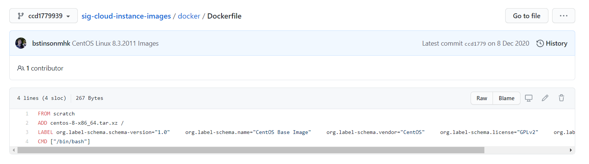

### 创建一个自己的 Centos

```shell
# 1，编写Dockerfile的文件
FROM centos
MAINTAINER jungle<jungle8884@163.com>

ENV MYPATH /usr/local
WORKDIR $MYPATH

RUN yum -y install vim
RUN yum -y install net-tools

EXPOSE 80
 
CMD echo $MYPATH
CMD echo "----end----"
CMD /bin/bash

# 2，通过这个文件构建镜像
# 命令 docker build -f dockerfile文件路径 -t 镜像名:[tag] .
[root@VM-12-17-centos dockerfile]# docker build -f mydockerfile-centos -t mycentos:0.1 .
Sending build context to Docker daemon  2.048kB
Step 1/10 : FROM centos
 ---> 300e315adb2f
Step 2/10 : MAINTAINER jungle<jungle8884@163.com>
 ---> Running in bb3724c32d54
Removing intermediate container bb3724c32d54
 ---> 8b405259d761
Step 3/10 : ENV MYPATH /usr/local
 ---> Running in 910a452adb35
Removing intermediate container 910a452adb35
 ---> c95b9feac716
Step 4/10 : WORKDIR $MYPATH
 ---> Running in aeb2e47bf8ea
Removing intermediate container aeb2e47bf8ea
 ---> e1ce98754a80
Step 5/10 : RUN yum -y install vim
 ---> Running in c8620453b8e8
CentOS Linux 8 - AppStream                      3.4 MB/s | 6.3 MB     00:01    
CentOS Linux 8 - BaseOS                         2.2 MB/s | 2.3 MB     00:01    
CentOS Linux 8 - Extras                          16 kB/s | 9.4 kB     00:00    
Dependencies resolved.
================================================================================
 Package             Arch        Version                   Repository      Size
================================================================================
Installing:
 vim-enhanced        x86_64      2:8.0.1763-15.el8         appstream      1.4 M
Installing dependencies:
 gpm-libs            x86_64      1.20.7-15.el8             appstream       39 k
 vim-common          x86_64      2:8.0.1763-15.el8         appstream      6.3 M
 vim-filesystem      noarch      2:8.0.1763-15.el8         appstream       48 k
 which               x86_64      2.21-12.el8               baseos          49 k

Transaction Summary
================================================================================
Install  5 Packages

Total download size: 7.8 M
Installed size: 30 M
Downloading Packages:
(1/5): gpm-libs-1.20.7-15.el8.x86_64.rpm        400 kB/s |  39 kB     00:00    
(2/5): vim-filesystem-8.0.1763-15.el8.noarch.rp 1.2 MB/s |  48 kB     00:00    
(3/5): which-2.21-12.el8.x86_64.rpm             422 kB/s |  49 kB     00:00    
(4/5): vim-enhanced-8.0.1763-15.el8.x86_64.rpm  5.3 MB/s | 1.4 MB     00:00    
(5/5): vim-common-8.0.1763-15.el8.x86_64.rpm    2.9 MB/s | 6.3 MB     00:02    
--------------------------------------------------------------------------------
Total                                           2.5 MB/s | 7.8 MB     00:03     
warning: /var/cache/dnf/appstream-02e86d1c976ab532/packages/gpm-libs-1.20.7-15.el8.x86_64.rpm: Header V3 RSA/SHA256 Signature, key ID 8483c65d: NOKEY
CentOS Linux 8 - AppStream                      1.6 MB/s | 1.6 kB     00:00    
Importing GPG key 0x8483C65D:
 Userid     : "CentOS (CentOS Official Signing Key) <security@centos.org>"
 Fingerprint: 99DB 70FA E1D7 CE22 7FB6 4882 05B5 55B3 8483 C65D
 From       : /etc/pki/rpm-gpg/RPM-GPG-KEY-centosofficial
Key imported successfully
Running transaction check
Transaction check succeeded.
Running transaction test
Transaction test succeeded.
Running transaction
  Preparing        :                                                        1/1 
  Installing       : which-2.21-12.el8.x86_64                               1/5 
  Installing       : vim-filesystem-2:8.0.1763-15.el8.noarch                2/5 
  Installing       : vim-common-2:8.0.1763-15.el8.x86_64                    3/5 
  Installing       : gpm-libs-1.20.7-15.el8.x86_64                          4/5 
  Running scriptlet: gpm-libs-1.20.7-15.el8.x86_64                          4/5 
  Installing       : vim-enhanced-2:8.0.1763-15.el8.x86_64                  5/5 
  Running scriptlet: vim-enhanced-2:8.0.1763-15.el8.x86_64                  5/5 
  Running scriptlet: vim-common-2:8.0.1763-15.el8.x86_64                    5/5 
  Verifying        : gpm-libs-1.20.7-15.el8.x86_64                          1/5 
  Verifying        : vim-common-2:8.0.1763-15.el8.x86_64                    2/5 
  Verifying        : vim-enhanced-2:8.0.1763-15.el8.x86_64                  3/5 
  Verifying        : vim-filesystem-2:8.0.1763-15.el8.noarch                4/5 
  Verifying        : which-2.21-12.el8.x86_64                               5/5 

Installed:
  gpm-libs-1.20.7-15.el8.x86_64         vim-common-2:8.0.1763-15.el8.x86_64    
  vim-enhanced-2:8.0.1763-15.el8.x86_64 vim-filesystem-2:8.0.1763-15.el8.noarch
  which-2.21-12.el8.x86_64             

Complete!
Removing intermediate container c8620453b8e8
 ---> abc9d00a42fe
Step 6/10 : RUN yum -y install net-tools
 ---> Running in 7f3179aa2601
Last metadata expiration check: 0:00:09 ago on Thu Mar 25 07:35:21 2021.
Dependencies resolved.
================================================================================
 Package         Architecture Version                        Repository    Size
================================================================================
Installing:
 net-tools       x86_64       2.0-0.52.20160912git.el8       baseos       322 k

Transaction Summary
================================================================================
Install  1 Package

Total download size: 322 k
Installed size: 942 k
Downloading Packages:
net-tools-2.0-0.52.20160912git.el8.x86_64.rpm   4.4 MB/s | 322 kB     00:00    
--------------------------------------------------------------------------------
Total                                           492 kB/s | 322 kB     00:00     
Running transaction check
Transaction check succeeded.
Running transaction test
Transaction test succeeded.
Running transaction
  Preparing        :                                                        1/1 
  Installing       : net-tools-2.0-0.52.20160912git.el8.x86_64              1/1 
  Running scriptlet: net-tools-2.0-0.52.20160912git.el8.x86_64              1/1 
  Verifying        : net-tools-2.0-0.52.20160912git.el8.x86_64              1/1 

Installed:
  net-tools-2.0-0.52.20160912git.el8.x86_64                                     

Complete!
Removing intermediate container 7f3179aa2601
 ---> 8dd60bff6b66
Step 7/10 : EXPOSE 80
 ---> Running in 04d918349d28
Removing intermediate container 04d918349d28
 ---> adfdcfa73c1c
Step 8/10 : CMD echo $MYPATH
 ---> Running in 12cf9626956d
Removing intermediate container 12cf9626956d
 ---> 71392fc6f5e1
Step 9/10 : CMD echo "----end----"
 ---> Running in 8ae0c6715447
Removing intermediate container 8ae0c6715447
 ---> 091f4f9aa81b
Step 10/10 : CMD /bin/bash
 ---> Running in 289d95be55a3
Removing intermediate container 289d95be55a3
 ---> d6d44f4d7997
Successfully built d6d44f4d7997
Successfully tagged mycentos:0.1

# 查看构建的镜像
[root@VM-12-17-centos local]# docker images
REPOSITORY            TAG       IMAGE ID       CREATED          SIZE
mycentos              0.1       d6d44f4d7997   34 seconds ago   291MB
mysql                 5.7       2fb283157d3c   5 days ago       449MB
portainer/portainer   latest    580c0e4e98b0   6 days ago       79.1MB
centos                latest    300e315adb2f   3 months ago     209MB
ubuntu                latest    f643c72bc252   3 months ago     72.9MB

# 测试运行，
[root@VM-12-17-centos dockerfile]# docker run -it mycentos:0.1
# 发现直接进入刚刚设置的 WORKDIR-工作目录
[root@df485625fb79 local]# pwd
/usr/local
# 现在可以直接运行vim和ifconfig命令了！ 
[root@df485625fb79 local]# vim
[root@df485625fb79 local]# ifconfig
eth0: flags=4163<UP,BROADCAST,RUNNING,MULTICAST>  mtu 1500
        inet 172.17.0.3  netmask 255.255.0.0  broadcast 172.17.255.255
        ether 02:42:ac:11:00:03  txqueuelen 0  (Ethernet)
        RX packets 8  bytes 656 (656.0 B)
        RX errors 0  dropped 0  overruns 0  frame 0
        TX packets 0  bytes 0 (0.0 B)
        TX errors 0  dropped 0 overruns 0  carrier 0  collisions 0

lo: flags=73<UP,LOOPBACK,RUNNING>  mtu 65536
        inet 127.0.0.1  netmask 255.0.0.0
        loop  txqueuelen 1000  (Local Loopback)
        RX packets 0  bytes 0 (0.0 B)
        RX errors 0  dropped 0  overruns 0  frame 0
        TX packets 0  bytes 0 (0.0 B)
        TX errors 0  dropped 0 overruns 0  carrier 0  collisions 0
```

### 可以列出本地进行的变更历史

```shell
[root@VM-12-17-centos dockerfile]# docker history mycentos:0.1
IMAGE          CREATED          CREATED BY                                      SIZE      COMMENT
d6d44f4d7997   15 minutes ago   /bin/sh -c #(nop)  CMD ["/bin/sh" "-c" "/bin…   0B        
091f4f9aa81b   15 minutes ago   /bin/sh -c #(nop)  CMD ["/bin/sh" "-c" "echo…   0B        
71392fc6f5e1   15 minutes ago   /bin/sh -c #(nop)  CMD ["/bin/sh" "-c" "echo…   0B        
adfdcfa73c1c   15 minutes ago   /bin/sh -c #(nop)  EXPOSE 80                    0B        
8dd60bff6b66   15 minutes ago   /bin/sh -c yum -y install net-tools             23.3MB    
abc9d00a42fe   16 minutes ago   /bin/sh -c yum -y install vim                   58MB      
e1ce98754a80   16 minutes ago   /bin/sh -c #(nop) WORKDIR /usr/local            0B        
c95b9feac716   16 minutes ago   /bin/sh -c #(nop)  ENV MYPATH=/usr/local        0B        
8b405259d761   16 minutes ago   /bin/sh -c #(nop)  MAINTAINER jungle<jungle8…   0B        
300e315adb2f   3 months ago     /bin/sh -c #(nop)  CMD ["/bin/bash"]            0B        
<missing>      3 months ago     /bin/sh -c #(nop)  LABEL org.label-schema.sc…   0B        
<missing>      3 months ago     /bin/sh -c #(nop) ADD file:bd7a2aed6ede423b7…   209MB     
```

**以后可以用 docker history 镜像ID 查看是怎么制作的！**

### CMD和ENTRYPOINT的区别

```shell
CMD			# 指定这个容器启动的时候要运行的命令，只有最后一个会生效，可被替代
ENTRYPOINT	# 指定这个容器启动的时候要运行的命令，可以追加命令
```

#### 测试 CMD

```shell
# 编写 dockerfile 文件
[root@VM-12-17-centos dockerfile]# vim dockerfile-cmd-test
FROM centos
CMD ["ls","-a"]

# 构建镜像
[root@VM-12-17-centos dockerfile]# docker build -f dockerfile-cmd-test -t cmdtest .
Sending build context to Docker daemon  3.072kB
Step 1/2 : FROM centos
 ---> 300e315adb2f
Step 2/2 : CMD ["ls","-a"]
 ---> Running in d30138584ece
Removing intermediate container d30138584ece
 ---> 7e809457cfd3
Successfully built 7e809457cfd3
Successfully tagged cmdtest:latest

# 运行，发现 ls -a 命令生效了
[root@VM-12-17-centos dockerfile]# docker run -it cmdtest
.   .dockerenv	dev  home  lib64       media  opt   root  sbin	sys  usr
..  bin		etc  lib   lost+found  mnt    proc  run   srv	tmp  var

# 想追加一个命令 -l 即：ls -al
[root@VM-12-17-centos dockerfile]# docker run -it cmdtest -l
docker: Error response from daemon: OCI runtime create failed: container_linux.go:367: starting container process caused: exec: "-l": executable file not found in $PATH: unknown.

# cmd的清理下 -l 替换了CMD ["ls","-a"] 命令，-l 不是命令，所以报错。
[root@VM-12-17-centos dockerfile]# docker run -it cmdtest ls -al
total 56
drwxr-xr-x   1 root root 4096 Mar 25 09:04 .
drwxr-xr-x   1 root root 4096 Mar 25 09:04 ..
-rwxr-xr-x   1 root root    0 Mar 25 09:04 .dockerenv
lrwxrwxrwx   1 root root    7 Nov  3 15:22 bin -> usr/bin
drwxr-xr-x   5 root root  360 Mar 25 09:04 dev
drwxr-xr-x   1 root root 4096 Mar 25 09:04 etc
drwxr-xr-x   2 root root 4096 Nov  3 15:22 home
lrwxrwxrwx   1 root root    7 Nov  3 15:22 lib -> usr/lib
lrwxrwxrwx   1 root root    9 Nov  3 15:22 lib64 -> usr/lib64
drwx------   2 root root 4096 Dec  4 17:37 lost+found
drwxr-xr-x   2 root root 4096 Nov  3 15:22 media
drwxr-xr-x   2 root root 4096 Nov  3 15:22 mnt
drwxr-xr-x   2 root root 4096 Nov  3 15:22 opt
dr-xr-xr-x 112 root root    0 Mar 25 09:04 proc
dr-xr-x---   2 root root 4096 Dec  4 17:37 root
drwxr-xr-x  11 root root 4096 Dec  4 17:37 run
lrwxrwxrwx   1 root root    8 Nov  3 15:22 sbin -> usr/sbin
drwxr-xr-x   2 root root 4096 Nov  3 15:22 srv
dr-xr-xr-x  13 root root    0 Mar 24 13:38 sys
drwxrwxrwt   7 root root 4096 Dec  4 17:37 tmp
drwxr-xr-x  12 root root 4096 Dec  4 17:37 usr
drwxr-xr-x  20 root root 4096 Dec  4 17:37 var
```

#### 测试 ENTRYPOINT

```shell
# 编写 dockerfile 文件
[root@VM-12-17-centos dockerfile]# vim dockerfile-cmd-entrypoint
FROM centos
ENTRYPOINT ["ls","-a"]

# 构建镜像
[root@VM-12-17-centos dockerfile]# docker build -f dockerfile-cmd-entrypoint -t entrypointtest .
Sending build context to Docker daemon  4.096kB
Step 1/2 : FROM centos
 ---> 300e315adb2f
Step 2/2 : ENTRYPOINT ["ls","-a"]
 ---> Running in a887df2a9abb
Removing intermediate container a887df2a9abb
 ---> e726c0ae19b2
Successfully built e726c0ae19b2
Successfully tagged entrypointtest:latest

# 运行，发现 ls -a 命令生效了
[root@VM-12-17-centos dockerfile]# docker run entrypointtest
.
..
.dockerenv
bin
dev
etc
home
lib
lib64
lost+found
media
mnt
opt
proc
root
run
sbin
srv
sys
tmp
usr
var

# 想追加一个命令 -l 即：ls -al，直接拼接在 ENTRYPOINT 命令的后面！
[root@VM-12-17-centos dockerfile]# docker run entrypointtest -l
total 56
drwxr-xr-x   1 root root 4096 Mar 25 09:12 .
drwxr-xr-x   1 root root 4096 Mar 25 09:12 ..
-rwxr-xr-x   1 root root    0 Mar 25 09:12 .dockerenv
lrwxrwxrwx   1 root root    7 Nov  3 15:22 bin -> usr/bin
drwxr-xr-x   5 root root  340 Mar 25 09:12 dev
drwxr-xr-x   1 root root 4096 Mar 25 09:12 etc
drwxr-xr-x   2 root root 4096 Nov  3 15:22 home
lrwxrwxrwx   1 root root    7 Nov  3 15:22 lib -> usr/lib
lrwxrwxrwx   1 root root    9 Nov  3 15:22 lib64 -> usr/lib64
drwx------   2 root root 4096 Dec  4 17:37 lost+found
drwxr-xr-x   2 root root 4096 Nov  3 15:22 media
drwxr-xr-x   2 root root 4096 Nov  3 15:22 mnt
drwxr-xr-x   2 root root 4096 Nov  3 15:22 opt
dr-xr-xr-x 111 root root    0 Mar 25 09:12 proc
dr-xr-x---   2 root root 4096 Dec  4 17:37 root
drwxr-xr-x  11 root root 4096 Dec  4 17:37 run
lrwxrwxrwx   1 root root    8 Nov  3 15:22 sbin -> usr/sbin
drwxr-xr-x   2 root root 4096 Nov  3 15:22 srv
dr-xr-xr-x  13 root root    0 Mar 24 13:38 sys
drwxrwxrwt   7 root root 4096 Dec  4 17:37 tmp
drwxr-xr-x  12 root root 4096 Dec  4 17:37 usr
drwxr-xr-x  20 root root 4096 Dec  4 17:37 var
```

## 实战：Tomcat镜像

### 准备镜像文件 tomcat 压缩包，jdk的压缩包！

```shell
# 使用ftp上传文件，准备压缩包
# 第一步：配置服务器端（centos）
# 参考：https://cloud.tencent.com/document/product/1207/47638
    # 执行以下命令，安装 vsftpd
    sudo yum install -y vsftpd

    # 执行以下命令，设置 vsftpd 开机自启动
    sudo systemctl enable vsftpd

    # 执行以下命令，启动 FTP 服务
    sudo systemctl start vsftpd

    # 执行以下命令，确认服务是否启动
    sudo netstat -antup | grep ftp

    # 执行以下命令，为 FTP 服务创建用户，本文以 ftpuser 为例
    sudo useradd ftpuser

    # 执行以下命令，设置 ftpuser 用户的密码
    sudo passwd ftpuser

    # 执行以下命令，创建 FTP 服务使用的文件目录
    sudo mkdir /home/jungle

    # 执行以下命令，修改目录权限
    # ftpuser:ftpuser：表示新建系统用户ftpuser 用户目录为/home/ftpuser
    # 用户登录终端为/home/jungle
    sudo chown -R ftpuser:ftpuser /home/jungle

    # 执行以下命令，打开 vsftpd.conf 文件
    sudo vim /etc/vsftpd/vsftpd.conf

    # 修改配置
    anonymous_enable=NO
    local_enable=YES
    chroot_local_user=YES
    chroot_list_enable=YES
    chroot_list_file=/etc/vsftpd/chroot_list
    listen=YES

    # 在行首添加 #，注释 listen_ipv6=YES 配置参数，关闭监听 IPv6 sockets
    local_root=/home/jungle
    allow_writeable_chroot=YES
    pasv_enable=YES
    pasv_address=xxx.xx.xxx.xx #请修改为您的轻量应用服务器公网 IP
    pasv_min_port=40000
    pasv_max_port=45000
    # 按 Esc 后输入 :wq 保存后退出

    # 执行以下命令，创建并编辑 chroot_list 文件
    # 按 i 进入编辑模式，输入用户名，一个用户名占据一行，设置完成后按 Esc 并输入 :wq 保存后退出。
    # 您若没有设置例外用户的需求，可跳过此步骤，输入 :wq 退出文件
    sudo vim /etc/vsftpd/chroot_list
    # 执行以下命令，重启 FTP 服务
    sudo systemctl restart vsftpd

# 第二：在客户端安装ftp上传工具（windows）
# 参考：https://cloud.tencent.com/document/product/213/2132
# 在本地下载并安装开源软件 FileZilla

# 第三步：上传文件
[root@VM-12-17-centos build]# pwd
/home/jungle/build
[root@VM-12-17-centos build]# ls -al
total 146748
drwxr-xr-x 2 ftpuser ftpuser      4096 Mar 25 20:25 .
drwxr-xr-x 3 ftpuser ftpuser      4096 Mar 25 20:18 ..
-rw-r--r-- 1 ftpuser ftpuser   6529364 Mar 25 20:25 apache-tomcat-9.0.44-fulldocs.tar.gz
-rw-r--r-- 1 ftpuser ftpuser 143722924 Mar 25 20:26 jdk-8u281-linux-x64.tar.gz
```

### 编写自己的dockerfile文件

> 官方命名Dockerfile，build会自动寻找这个文件，就不需要 -f 指定了！

```shell
[root@VM-12-17-centos build]# vim Dockerfile

FROM centos
MAINTAINER jungle8884<jungle8884@163.com>

ADD jdk-8u281-linux-x64.tar.gz /usr/local/
ADD apache-tomcat-9.0.44.tar.gz /usr/local/

RUN yum -y install vim

ENV MYPATH /usr/local
WORKDIR $MYPATH

ENV JAVA_HOME /usr/local/jdk1.8.0_281
ENV CLASSPATH $JAVA_HOME/lib/dt.jar:$JAVA_HOME/lib/tools.jar
ENV CATALINA_HOME /usr/local/apache-tomcat-9.0.44
ENV CATALINA_BASH /usr/local/apache-tomcat-9.0.44
ENV PATH $PATH:$JAVA_HOME/bin:$CATALINA_HOME/lib:$CATALINA_HOME/bin

EXPOSE 8080

CMD /usr/local/apache-tomcat-9.0.44/bin/startup.sh && tail -F /usr/local/apache-tomcat-9.0.44/bin/logs/catalina.out
```

### 构建自己的 Tomcat 镜像

> docker build -t diytomcat .

```shell
[root@VM-12-17-centos build]# docker build -t diytomcat .
Sending build context to Docker daemon  155.2MB
Step 1/15 : FROM centos
 ---> 300e315adb2f
Step 2/15 : MAINTAINER jungle<jungle8884@163.com>
 ---> Using cache
 ---> 8b405259d761
Step 3/15 : COPY readme.txt /usr/local/readme.txt
COPY failed: file not found in build context or excluded by .dockerignore: stat readme.txt: file does not exist
[root@VM-12-17-centos build]# vim Dockerfile
[root@VM-12-17-centos build]# docker build -t diytomcat .
Sending build context to Docker daemon  155.2MB
Step 1/15 : FROM centos
 ---> 300e315adb2f
Step 2/15 : MAINTAINER jungle<jungle8884@163.com>
 ---> Using cache
 ---> 8b405259d761
Step 3/15 : COPY readme.txt /usr/local/readme.txt
COPY failed: file not found in build context or excluded by .dockerignore: stat readme.txt: file does not exist
[root@VM-12-17-centos build]# vim Dockerfile 
[root@VM-12-17-centos build]# docker build -t diytomcat .
Sending build context to Docker daemon  155.2MB
Step 1/14 : FROM centos
 ---> 300e315adb2f
Step 2/14 : MAINTAINER jungle<jungle8884@163.com>
 ---> Using cache
 ---> 8b405259d761
Step 3/14 : ADD jdk-8u281-linux-x64.tar.gz /usr/local/
 ---> 2565c05191e2
Step 4/14 : ADD apache-tomcat-9.0.44.tar.gz /usr/local/
 ---> 194b10fdee8e
Step 5/14 : RUN yum -y install vim
 ---> Running in b6327b17f95e
CentOS Linux 8 - AppStream                      2.9 MB/s | 6.3 MB     00:02    
CentOS Linux 8 - BaseOS                         1.2 MB/s | 2.3 MB     00:01    
CentOS Linux 8 - Extras                         4.6 kB/s | 9.4 kB     00:02    
Dependencies resolved.
================================================================================
 Package             Arch        Version                   Repository      Size
================================================================================
Installing:
 vim-enhanced        x86_64      2:8.0.1763-15.el8         appstream      1.4 M
Installing dependencies:
 gpm-libs            x86_64      1.20.7-15.el8             appstream       39 k
 vim-common          x86_64      2:8.0.1763-15.el8         appstream      6.3 M
 vim-filesystem      noarch      2:8.0.1763-15.el8         appstream       48 k
 which               x86_64      2.21-12.el8               baseos          49 k

Transaction Summary
================================================================================
Install  5 Packages

Total download size: 7.8 M
Installed size: 30 M
Downloading Packages:
(1/5): gpm-libs-1.20.7-15.el8.x86_64.rpm        344 kB/s |  39 kB     00:00    
(2/5): vim-filesystem-8.0.1763-15.el8.noarch.rp 952 kB/s |  48 kB     00:00    
(3/5): which-2.21-12.el8.x86_64.rpm             418 kB/s |  49 kB     00:00    
(4/5): vim-enhanced-8.0.1763-15.el8.x86_64.rpm  4.8 MB/s | 1.4 MB     00:00    
(5/5): vim-common-8.0.1763-15.el8.x86_64.rpm     15 MB/s | 6.3 MB     00:00    
--------------------------------------------------------------------------------
Total                                           4.9 MB/s | 7.8 MB     00:01     
warning: /var/cache/dnf/appstream-02e86d1c976ab532/packages/gpm-libs-1.20.7-15.el8.x86_64.rpm: Header V3 RSA/SHA256 Signature, key ID 8483c65d: NOKEY
CentOS Linux 8 - AppStream                      1.4 MB/s | 1.6 kB     00:00    
Importing GPG key 0x8483C65D:
 Userid     : "CentOS (CentOS Official Signing Key) <security@centos.org>"
 Fingerprint: 99DB 70FA E1D7 CE22 7FB6 4882 05B5 55B3 8483 C65D
 From       : /etc/pki/rpm-gpg/RPM-GPG-KEY-centosofficial
Key imported successfully
Running transaction check
Transaction check succeeded.
Running transaction test
Transaction test succeeded.
Running transaction
  Preparing        :                                                        1/1 
  Installing       : which-2.21-12.el8.x86_64                               1/5 
  Installing       : vim-filesystem-2:8.0.1763-15.el8.noarch                2/5 
  Installing       : vim-common-2:8.0.1763-15.el8.x86_64                    3/5 
  Installing       : gpm-libs-1.20.7-15.el8.x86_64                          4/5 
  Running scriptlet: gpm-libs-1.20.7-15.el8.x86_64                          4/5 
  Installing       : vim-enhanced-2:8.0.1763-15.el8.x86_64                  5/5 
  Running scriptlet: vim-enhanced-2:8.0.1763-15.el8.x86_64                  5/5 
  Running scriptlet: vim-common-2:8.0.1763-15.el8.x86_64                    5/5 
  Verifying        : gpm-libs-1.20.7-15.el8.x86_64                          1/5 
  Verifying        : vim-common-2:8.0.1763-15.el8.x86_64                    2/5 
  Verifying        : vim-enhanced-2:8.0.1763-15.el8.x86_64                  3/5 
  Verifying        : vim-filesystem-2:8.0.1763-15.el8.noarch                4/5 
  Verifying        : which-2.21-12.el8.x86_64                               5/5 

Installed:
  gpm-libs-1.20.7-15.el8.x86_64         vim-common-2:8.0.1763-15.el8.x86_64    
  vim-enhanced-2:8.0.1763-15.el8.x86_64 vim-filesystem-2:8.0.1763-15.el8.noarch
  which-2.21-12.el8.x86_64             

Complete!
Removing intermediate container b6327b17f95e
 ---> 8377dafc0b79
Step 6/14 : ENV MYPATH /usr/local
 ---> Running in d45284d35023
Removing intermediate container d45284d35023
 ---> 9b0a30b29baf
Step 7/14 : WORKDIR $MYPATH
 ---> Running in 50539b3c82aa
Removing intermediate container 50539b3c82aa
 ---> 634d50385608
Step 8/14 : ENV JAVA_HOME /usr/local/jdk1.8.0_281
 ---> Running in e77ca3b2e5cd
Removing intermediate container e77ca3b2e5cd
 ---> 9bff463c55bb
Step 9/14 : ENV CLASSPATH $JAVA_HOME/lib/dt.jar:$JAVA_HOME/lib/tools.jar
 ---> Running in b3ee9269c44a
Removing intermediate container b3ee9269c44a
 ---> 8890e3b0b904
Step 10/14 : ENV CATALINA_HOME /usr/local/apache-tomcat-9.0.44
 ---> Running in d75abeb431b8
Removing intermediate container d75abeb431b8
 ---> 87eaea5176d1
Step 11/14 : ENV CATALINA_BASH /usr/local/apache-tomcat-9.0.44
 ---> Running in 87581d87916e
Removing intermediate container 87581d87916e
 ---> 8e29aab0e60b
Step 12/14 : ENV PATH $PATH:$JAVA_HOME/bin:$CATALINA_HOME/lib:$CATALINA_HOME/bin
 ---> Running in d2a3012ce492
Removing intermediate container d2a3012ce492
 ---> d8f29c28f848
Step 13/14 : EXPOSE 8080
 ---> Running in bfde5416350d
Removing intermediate container bfde5416350d
 ---> dc60c80911fe
Step 14/14 : CMD /usr/local/apache-tomcat-9.0.44/bin/startup.sh && tail -F /url/local/apache-tomcat-9.0.44/bin/logs/catalina.out
 ---> Running in a144d5fb52d6
Removing intermediate container a144d5fb52d6
 ---> 84679d178e1c
Successfully built 84679d178e1c
Successfully tagged diytomcat:latest

# 查看：创建成功
[root@VM-12-17-centos build]# docker images
REPOSITORY            TAG       IMAGE ID       CREATED              SIZE
diytomcat             latest    43bc8d966df9   About a minute ago   697MB
entrypointtest        latest    e726c0ae19b2   4 hours ago          209MB
cmdtest               latest    7e809457cfd3   5 hours ago          209MB
mycentos              0.1       d6d44f4d7997   6 hours ago          291MB
mysql                 5.7       2fb283157d3c   5 days ago           449MB
portainer/portainer   latest    580c0e4e98b0   6 days ago           79.1MB
centos                latest    300e315adb2f   3 months ago         209MB
ubuntu                latest    f643c72bc252   3 months ago         72.9MB
```


### 从构建的镜像运行容器

```shell
[root@VM-12-17-centos build]# docker run -d -p 8080:8080 --name jungletomcat -v /home/jungle/build/tomcat/test:/usr/local/apache-tomcat-9.0.44/webapps/test -v /home/jungle/build/tomcat/tomcatlogs/:/usr/local/apache-tomcat-9.0.44/logs diytomcat 

# 进入容器
[root@VM-12-17-centos local]# docker exec -it jungletomcat /bin/bash
```


### 访问测试

> 输入 自己的ip:端口号
>
> xxx.xxx.xxx.xxx:8080


### 发布项目

> 由于做了卷挂载，直接在本地编写项目就可以了！
>
> 比如：/home/jungle/build/tomcat/test

```shell
[root@VM-12-17-centos test]# mkdir WEB-INF
[root@VM-12-17-centos test]# cd WEB-INF/
[root@VM-12-17-centos WEB-INF]# vim web.xml

<?xml version="1.0" encoding="UTF-8"?>
<web-app version="2.4" 
    xmlns="http://java.sun.com/xml/ns/j2ee" 
    xmlns:xsi="http://www.w3.org/2001/XMLSchema-instance"
    xsi:schemaLocation="http://java.sun.com/xml/ns/j2ee 
        http://java.sun.com/xml/ns/j2ee/web-app_2_4.xsd">
</web-app>
```

```shell
[root@VM-12-17-centos WEB-INF]# cd ..
[root@VM-12-17-centos test]# ls
WEB-INF
[root@VM-12-17-centos test]# vim index.jsp

<%@ page language="java" contentType="text/html; charset=UTF-8"
    pageEncoding="UTF-8"%>
<!DOCTYPE html>
<html>
<head>
<meta charset="utf-8">
<title>hello jungle!</title>
</head>
<body>
hello jungle!<br/>
<%
System.out.println("----This is my test web logs----");
%>
</body>
</html>
```

> 打开 xxx.xxx.xxx.xxx:8080/test

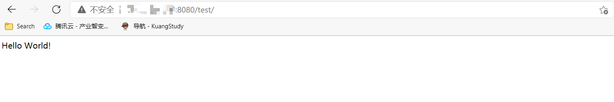

> 项目部署成功，可以访问！

```shell
[root@VM-12-17-centos tomcatlogs]# cat catalina.out
27-Mar-2021 08:10:00.023 INFO [main] org.apache.catalina.startup.VersionLoggerListener.log Server version name:   Apache Tomcat/9.0.44
27-Mar-2021 08:10:00.025 INFO [main] org.apache.catalina.startup.VersionLoggerListener.log Server built:          Mar 4 2021 21:49:34 UTC
27-Mar-2021 08:10:00.025 INFO [main] org.apache.catalina.startup.VersionLoggerListener.log Server version number: 9.0.44.0
27-Mar-2021 08:10:00.025 INFO [main] org.apache.catalina.startup.VersionLoggerListener.log OS Name:               Linux
27-Mar-2021 08:10:00.025 INFO [main] org.apache.catalina.startup.VersionLoggerListener.log OS Version:            3.10.0-1127.19.1.el7.x86_64
27-Mar-2021 08:10:00.025 INFO [main] org.apache.catalina.startup.VersionLoggerListener.log Architecture:          amd64
27-Mar-2021 08:10:00.025 INFO [main] org.apache.catalina.startup.VersionLoggerListener.log Java Home:             /usr/local/jdk1.8.0_281/jre
27-Mar-2021 08:10:00.026 INFO [main] org.apache.catalina.startup.VersionLoggerListener.log JVM Version:           1.8.0_281-b09
27-Mar-2021 08:10:00.026 INFO [main] org.apache.catalina.startup.VersionLoggerListener.log JVM Vendor:            Oracle Corporation
27-Mar-2021 08:10:00.026 INFO [main] org.apache.catalina.startup.VersionLoggerListener.log CATALINA_BASE:         /usr/local/apache-tomcat-9.0.44
27-Mar-2021 08:10:00.026 INFO [main] org.apache.catalina.startup.VersionLoggerListener.log CATALINA_HOME:         /usr/local/apache-tomcat-9.0.44
27-Mar-2021 08:10:00.040 INFO [main] org.apache.catalina.startup.VersionLoggerListener.log Command line argument: -Djava.util.logging.config.file=/usr/local/apache-tomcat-9.0.44/conf/logging.properties
27-Mar-2021 08:10:00.040 INFO [main] org.apache.catalina.startup.VersionLoggerListener.log Command line argument: -Djava.util.logging.manager=org.apache.juli.ClassLoaderLogManager
27-Mar-2021 08:10:00.040 INFO [main] org.apache.catalina.startup.VersionLoggerListener.log Command line argument: -Djdk.tls.ephemeralDHKeySize=2048
27-Mar-2021 08:10:00.040 INFO [main] org.apache.catalina.startup.VersionLoggerListener.log Command line argument: -Djava.protocol.handler.pkgs=org.apache.catalina.webresources
27-Mar-2021 08:10:00.040 INFO [main] org.apache.catalina.startup.VersionLoggerListener.log Command line argument: -Dorg.apache.catalina.security.SecurityListener.UMASK=0027
27-Mar-2021 08:10:00.040 INFO [main] org.apache.catalina.startup.VersionLoggerListener.log Command line argument: -Dignore.endorsed.dirs=
27-Mar-2021 08:10:00.040 INFO [main] org.apache.catalina.startup.VersionLoggerListener.log Command line argument: -Dcatalina.base=/usr/local/apache-tomcat-9.0.44
27-Mar-2021 08:10:00.040 INFO [main] org.apache.catalina.startup.VersionLoggerListener.log Command line argument: -Dcatalina.home=/usr/local/apache-tomcat-9.0.44
27-Mar-2021 08:10:00.040 INFO [main] org.apache.catalina.startup.VersionLoggerListener.log Command line argument: -Djava.io.tmpdir=/usr/local/apache-tomcat-9.0.44/temp
27-Mar-2021 08:10:00.042 INFO [main] org.apache.catalina.core.AprLifecycleListener.lifecycleEvent The Apache Tomcat Native library which allows using OpenSSL was not found on the java.library.path: [/usr/java/packages/lib/amd64:/usr/lib64:/lib64:/lib:/usr/lib]
27-Mar-2021 08:10:00.687 INFO [main] org.apache.coyote.AbstractProtocol.init Initializing ProtocolHandler ["http-nio-8080"]
27-Mar-2021 08:10:00.731 INFO [main] org.apache.catalina.startup.Catalina.load Server initialization in [980] milliseconds
27-Mar-2021 08:10:00.772 INFO [main] org.apache.catalina.core.StandardService.startInternal Starting service [Catalina]
27-Mar-2021 08:10:00.772 INFO [main] org.apache.catalina.core.StandardEngine.startInternal Starting Servlet engine: [Apache Tomcat/9.0.44]
27-Mar-2021 08:10:00.783 INFO [main] org.apache.catalina.startup.HostConfig.deployDirectory Deploying web application directory [/usr/local/apache-tomcat-9.0.44/webapps/docs]
27-Mar-2021 08:10:01.173 INFO [main] org.apache.catalina.startup.HostConfig.deployDirectory Deployment of web application directory [/usr/local/apache-tomcat-9.0.44/webapps/docs] has finished in [389] ms
27-Mar-2021 08:10:01.173 INFO [main] org.apache.catalina.startup.HostConfig.deployDirectory Deploying web application directory [/usr/local/apache-tomcat-9.0.44/webapps/examples]
27-Mar-2021 08:10:01.585 INFO [main] org.apache.catalina.startup.HostConfig.deployDirectory Deployment of web application directory [/usr/local/apache-tomcat-9.0.44/webapps/examples] has finished in [412] ms
27-Mar-2021 08:10:01.585 INFO [main] org.apache.catalina.startup.HostConfig.deployDirectory Deploying web application directory [/usr/local/apache-tomcat-9.0.44/webapps/host-manager]
27-Mar-2021 08:10:01.621 INFO [main] org.apache.catalina.startup.HostConfig.deployDirectory Deployment of web application directory [/usr/local/apache-tomcat-9.0.44/webapps/host-manager] has finished in [36] ms
27-Mar-2021 08:10:01.621 INFO [main] org.apache.catalina.startup.HostConfig.deployDirectory Deploying web application directory [/usr/local/apache-tomcat-9.0.44/webapps/manager]
27-Mar-2021 08:10:01.658 INFO [main] org.apache.catalina.startup.HostConfig.deployDirectory Deployment of web application directory [/usr/local/apache-tomcat-9.0.44/webapps/manager] has finished in [37] ms
27-Mar-2021 08:10:01.658 INFO [main] org.apache.catalina.startup.HostConfig.deployDirectory Deploying web application directory [/usr/local/apache-tomcat-9.0.44/webapps/ROOT]
27-Mar-2021 08:10:01.689 INFO [main] org.apache.catalina.startup.HostConfig.deployDirectory Deployment of web application directory [/usr/local/apache-tomcat-9.0.44/webapps/ROOT] has finished in [30] ms
27-Mar-2021 08:10:01.689 INFO [main] org.apache.catalina.startup.HostConfig.deployDirectory Deploying web application directory [/usr/local/apache-tomcat-9.0.44/webapps/test]
27-Mar-2021 08:10:01.727 INFO [main] org.apache.catalina.startup.HostConfig.deployDirectory Deployment of web application directory [/usr/local/apache-tomcat-9.0.44/webapps/test] has finished in [38] ms
27-Mar-2021 08:10:01.734 INFO [main] org.apache.coyote.AbstractProtocol.start Starting ProtocolHandler ["http-nio-8080"]
27-Mar-2021 08:10:01.746 INFO [main] org.apache.catalina.startup.Catalina.start Server startup in [1014] milliseconds
----This is my test web logs----
----This is my test web logs----
----This is my test web logs----
----This is my test web logs----
----This is my test web logs----
----This is my test web logs----
----This is my test web logs----
```

## 发布自己的镜像

> DockerHub

1，在 https://hub.docker.com/ 上注册自己的账号

2，确定账号可以登录

3， 在我们的服务器上提交

```shell
# 先登录
[root@VM-12-17-centos ~]# docker login --help

Usage:  docker login [OPTIONS] [SERVER]

Log in to a Docker registry.
If no server is specified, the default is defined by the daemon.

Options:
  -p, --password string   Password
      --password-stdin    Take the password from stdin
  -u, --username string   Username
```

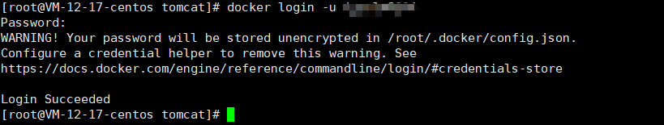

4，登录完之后就 Docker push 上去就OK了！

```shell
[root@VM-12-17-centos tomcat]# docker push jungle8884/diytomcat:1.0
The push refers to repository [docker.io/jungle/diytomcat]
An image does not exist locally with the tag: jungle/diytomcat

# 解决：增加一个tag
[root@VM-12-17-centos tomcat]# docker tag diytomcat jungle8884/tomcat:1.0
[root@VM-12-17-centos ~]# docker images
REPOSITORY            TAG       IMAGE ID       CREATED        SIZE
jungle/tomcat         1.0       84679d178e1c   19 hours ago   640MB
diytomcat             latest    84679d178e1c   19 hours ago   640MB

# docker push 上去时，尽量带上版本号！
[root@VM-12-17-centos tomcat]# docker push jungle8884/tomcat:1.0
The push refers to repository [docker.io/jungle/tomcat]
8123ea100c35: Preparing 
190353ed16cf: Preparing 
db261bbd8c9a: Preparing 
2653d992f4ef: Preparing 
denied: requested access to the resource is denied
```

> 阿里云镜像服务

1，登录阿里云

2，找到容器镜像服务

3，创建命名空间


4，创建容器镜像

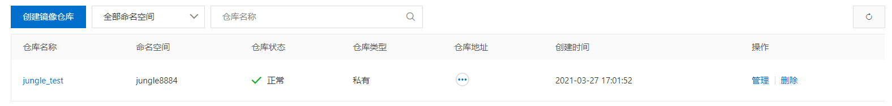

5，推送到阿里云

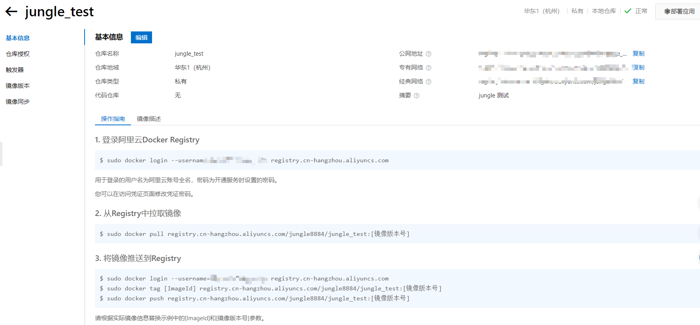

> 一定要参考阿里云提示！

```shell
# docker login --username=阿里云账号全名 registry.cn-hangzhou.aliyuncs.com
# 然后再输入密码

# docker tag [ImageId] registry.cn-hangzhou.aliyuncs.com/jungle8884/jungle_test:[镜像版本号]
docker tag 84679d178e1c registry.cn-hangzhou.aliyuncs.com/jungle8884/jungle_test:diytomcat_1.0
# docker push registry.cn-hangzhou.aliyuncs.com/jungle8884/jungle_test:[镜像版本号]
docker push registry.cn-hangzhou.aliyuncs.com/jungle8884/jungle_test:diytomcat_1.0

[root@VM-12-17-centos ~]# docker push registry.cn-hangzhou.aliyuncs.com/jungle8884/jungle_test:diytomcat_1.0
The push refers to repository [registry.cn-hangzhou.aliyuncs.com/jungle8884/jungle_test]
8123ea100c35: Pushed 
190353ed16cf: Pushed 
db261bbd8c9a: Pushed 
2653d992f4ef: Pushed 
diytomcat_1.0: digest: sha256:d99fcb82434ae344da5b0dbfc897c32b7cdfec07721428e74f888deb696ead19 size: 1166
```

## 小结

结构图：

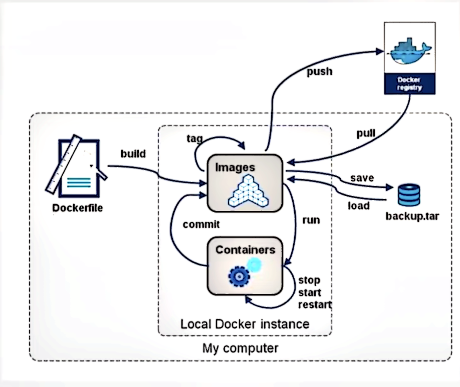


# Docker网络

## 理解Docker网络

先清空所有环境！

> 测试：ip addr

```shell
[root@VM-12-17-centos ~]# ip addr
1: lo: <LOOPBACK,UP,LOWER_UP> mtu 65536 qdisc noqueue state UNKNOWN group default qlen 1000
    link/loopback 00:00:00:00:00:00 brd 00:00:00:00:00:00
    inet 127.0.0.1/8 scope host lo
       valid_lft forever preferred_lft forever
    inet6 ::1/128 scope host 
       valid_lft forever preferred_lft forever
2: eth0: <BROADCAST,MULTICAST,UP,LOWER_UP> mtu 1500 qdisc pfifo_fast state UP group default qlen 1000
    link/ether 52:54:00:17:d3:0f brd ff:ff:ff:ff:ff:ff
    inet 10.0.12.17/22 brd 10.0.15.255 scope global eth0
       valid_lft forever preferred_lft forever
    inet6 fe80::5054:ff:fe17:d30f/64 scope link 
       valid_lft forever preferred_lft forever
3: docker0: <NO-CARRIER,BROADCAST,MULTICAST,UP> mtu 1500 qdisc noqueue state DOWN group default 
    link/ether 02:42:4e:42:61:de brd ff:ff:ff:ff:ff:ff
    inet 172.17.0.1/16 brd 172.17.255.255 scope global docker0
       valid_lft forever preferred_lft forever
    inet6 fe80::42:4eff:fe42:61de/64 scope link 
       valid_lft forever preferred_lft forever
```

> 发现三个网络

- 本机回环地址：127.0.0.1

- 腾讯云内网地址：10.0.12.17
- docker0地址：172.17.0.1

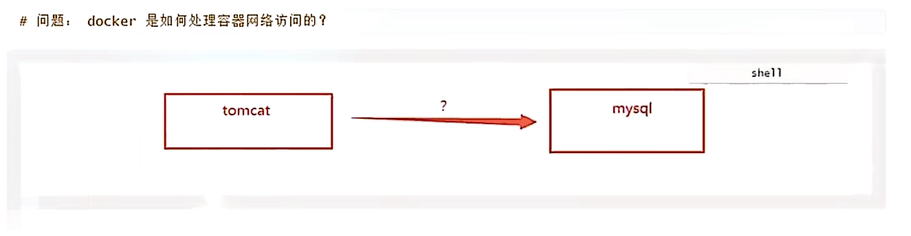

> 测试

```shell
# -p, --publish list : Publish a container's port(s) to the host
[root@VM-12-17-centos ~]# docker run -d -P --name tomcat01 tomcat
Unable to find image 'tomcat:latest' locally
latest: Pulling from library/tomcat

# 查看容器的内部网络地址 ip addr，发现容器启动的时候会得到一个 eth0@if19 ip地址，docker分配的！
[root@VM-12-17-centos ~]# docker exec -it tomcat01 ip addr
1: lo: <LOOPBACK,UP,LOWER_UP> mtu 65536 qdisc noqueue state UNKNOWN group default qlen 1000
    link/loopback 00:00:00:00:00:00 brd 00:00:00:00:00:00
    inet 127.0.0.1/8 scope host lo
       valid_lft forever preferred_lft forever
18: eth0@if19: <BROADCAST,MULTICAST,UP,LOWER_UP> mtu 1500 qdisc noqueue state UP group default 
    link/ether 02:42:ac:11:00:02 brd ff:ff:ff:ff:ff:ff link-netnsid 0
    inet 172.17.0.2/16 brd 172.17.255.255 scope global eth0
       valid_lft forever preferred_lft forever
       
# 思考：linux 能不能 ping 通 容器内部？
[root@VM-12-17-centos ~]# ping 172.17.0.2
PING 172.17.0.2 (172.17.0.2) 56(84) bytes of data.
64 bytes from 172.17.0.2: icmp_seq=1 ttl=64 time=0.068 ms
64 bytes from 172.17.0.2: icmp_seq=2 ttl=64 time=0.065 ms
64 bytes from 172.17.0.2: icmp_seq=3 ttl=64 time=0.052 ms
64 bytes from 172.17.0.2: icmp_seq=4 ttl=64 time=0.052 ms
64 bytes from 172.17.0.2: icmp_seq=5 ttl=64 time=0.047 ms
64 bytes from 172.17.0.2: icmp_seq=6 ttl=64 time=0.054 ms

# linux 可以 ping 通 docker 容器内部
```

> 原理

1、每启动一个docker容器，docker就会给docker容器分配一个ip，只要安装了docker，就会有一个网卡docker0

桥接模式，使用的技术是 `veth-pair` 技术！

再次测试 ip addr

```shell
[root@VM-12-17-centos ~]# ip addr
1: lo: <LOOPBACK,UP,LOWER_UP> mtu 65536 qdisc noqueue state UNKNOWN group default qlen 1000
    link/loopback 00:00:00:00:00:00 brd 00:00:00:00:00:00
    inet 127.0.0.1/8 scope host lo
       valid_lft forever preferred_lft forever
    inet6 ::1/128 scope host 
       valid_lft forever preferred_lft forever
2: eth0: <BROADCAST,MULTICAST,UP,LOWER_UP> mtu 1500 qdisc pfifo_fast state UP group default qlen 1000
    link/ether 52:54:00:17:d3:0f brd ff:ff:ff:ff:ff:ff
    inet 10.0.12.17/22 brd 10.0.15.255 scope global eth0
       valid_lft forever preferred_lft forever
    inet6 fe80::5054:ff:fe17:d30f/64 scope link 
       valid_lft forever preferred_lft forever
3: docker0: <BROADCAST,MULTICAST,UP,LOWER_UP> mtu 1500 qdisc noqueue state UP group default 
    link/ether 02:42:4e:42:61:de brd ff:ff:ff:ff:ff:ff
    inet 172.17.0.1/16 brd 172.17.255.255 scope global docker0
       valid_lft forever preferred_lft forever
    inet6 fe80::42:4eff:fe42:61de/64 scope link 
       valid_lft forever preferred_lft forever
19: vethf000591@if18: <BROADCAST,MULTICAST,UP,LOWER_UP> mtu 1500 qdisc noqueue master docker0 state UP group default 
    link/ether ca:23:22:f7:39:02 brd ff:ff:ff:ff:ff:ff link-netnsid 0
    inet6 fe80::c823:22ff:fef7:3902/64 scope link 
       valid_lft forever preferred_lft forever
```

发现成对出现：

```shell
18: eth0@if19: <BROADCAST,MULTICAST,UP,LOWER_UP> mtu 1500 qdisc noqueue state UP group default 
    link/ether 02:42:ac:11:00:02 brd ff:ff:ff:ff:ff:ff link-netnsid 0
    inet 172.17.0.2/16 brd 172.17.255.255 scope global eth0
       valid_lft forever preferred_lft forever
```

```shell
19: vethf000591@if18: <BROADCAST,MULTICAST,UP,LOWER_UP> mtu 1500 qdisc noqueue master docker0 state UP group default 
    link/ether ca:23:22:f7:39:02 brd ff:ff:ff:ff:ff:ff link-netnsid 0
    inet6 fe80::c823:22ff:fef7:3902/64 scope link 
       valid_lft forever preferred_lft forever
```

2、再启动一个容器测试，发现又多了一对儿网卡

```shell
[root@VM-12-17-centos ~]# docker run -d -P --name=tomcat02 tomcat
e0bda1a92d206ed31ab59a371ced33263e667ea04dfe30954c270c9623df99c7
[root@VM-12-17-centos ~]# ip addr
1: lo: <LOOPBACK,UP,LOWER_UP> mtu 65536 qdisc noqueue state UNKNOWN group default qlen 1000
    link/loopback 00:00:00:00:00:00 brd 00:00:00:00:00:00
    inet 127.0.0.1/8 scope host lo
       valid_lft forever preferred_lft forever
    inet6 ::1/128 scope host 
       valid_lft forever preferred_lft forever
2: eth0: <BROADCAST,MULTICAST,UP,LOWER_UP> mtu 1500 qdisc pfifo_fast state UP group default qlen 1000
    link/ether 52:54:00:17:d3:0f brd ff:ff:ff:ff:ff:ff
    inet 10.0.12.17/22 brd 10.0.15.255 scope global eth0
       valid_lft forever preferred_lft forever
    inet6 fe80::5054:ff:fe17:d30f/64 scope link 
       valid_lft forever preferred_lft forever
3: docker0: <BROADCAST,MULTICAST,UP,LOWER_UP> mtu 1500 qdisc noqueue state UP group default 
    link/ether 02:42:4e:42:61:de brd ff:ff:ff:ff:ff:ff
    inet 172.17.0.1/16 brd 172.17.255.255 scope global docker0
       valid_lft forever preferred_lft forever
    inet6 fe80::42:4eff:fe42:61de/64 scope link 
       valid_lft forever preferred_lft forever
19: vethf000591@if18: <BROADCAST,MULTICAST,UP,LOWER_UP> mtu 1500 qdisc noqueue master docker0 state UP group default 
    link/ether ca:23:22:f7:39:02 brd ff:ff:ff:ff:ff:ff link-netnsid 0
    inet6 fe80::c823:22ff:fef7:3902/64 scope link 
       valid_lft forever preferred_lft forever
# 在 linux 里面是 20
21: vethb0650be@if20: <BROADCAST,MULTICAST,UP,LOWER_UP> mtu 1500 qdisc noqueue master docker0 state UP group default 
    link/ether a6:1b:92:cd:78:b6 brd ff:ff:ff:ff:ff:ff link-netnsid 1
    inet6 fe80::a41b:92ff:fecd:78b6/64 scope link 
       valid_lft forever preferred_lft forever
     
# 进入容器查看
[root@VM-12-17-centos ~]# docker exec -it tomcat02 ip addr
1: lo: <LOOPBACK,UP,LOWER_UP> mtu 65536 qdisc noqueue state UNKNOWN group default qlen 1000
    link/loopback 00:00:00:00:00:00 brd 00:00:00:00:00:00
    inet 127.0.0.1/8 scope host lo
       valid_lft forever preferred_lft forever
# 在容器内是 21
20: eth0@if21: <BROADCAST,MULTICAST,UP,LOWER_UP> mtu 1500 qdisc noqueue state UP group default 
    link/ether 02:42:ac:11:00:03 brd ff:ff:ff:ff:ff:ff link-netnsid 0
    inet 172.17.0.3/16 brd 172.17.255.255 scope global eth0
       valid_lft forever preferred_lft forever
```

> 发现这个容器带来的网卡都是一对对的
>
> `veth-pair` 就是一对的虚拟设备接口，都是成对出现，一层连着协议，一段彼此相连
>
> 正因为有这个特性，`evth-pair` 充当一个桥梁，连接各种虚拟网络设备的
>
> `veth`: virtual ethernet 虚拟以太网

3、测试 tomcat01 和 tomcat02 是否 可以 ping 通！

```shell
[root@VM-12-17-centos ~]# docker exec -it tomcat02 ping 172.17.0.2
PING 172.17.0.2 (172.17.0.2) 56(84) bytes of data.
64 bytes from 172.17.0.2: icmp_seq=1 ttl=64 time=0.071 ms
64 bytes from 172.17.0.2: icmp_seq=2 ttl=64 time=0.051 ms
64 bytes from 172.17.0.2: icmp_seq=3 ttl=64 time=0.055 ms
64 bytes from 172.17.0.2: icmp_seq=4 ttl=64 time=0.052 ms
```

> 结论：容器和容器之间是可以互相 ping 通的！
>

4、网络模型图

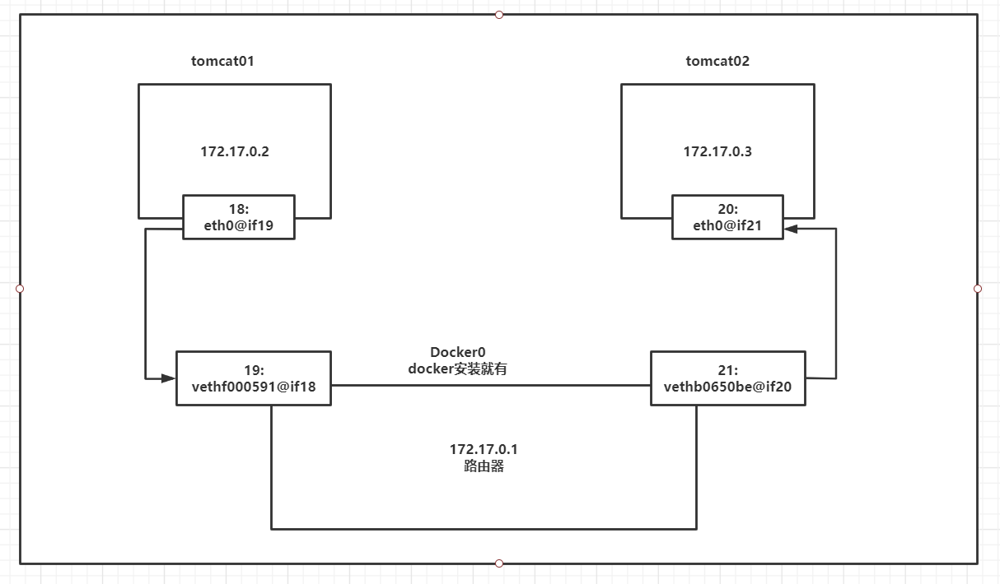

> 结论：tomcat01 和 tomcat02 是公用的一个路由器，docker0
>
> 所有的容器不指定网络的情况下，都是 docker0 路由的，docker 会给容器分配一个默认的可用 ip

**Docker使用的是linux的桥接，宿主机中是一个Docker容器的网桥 docker0！**

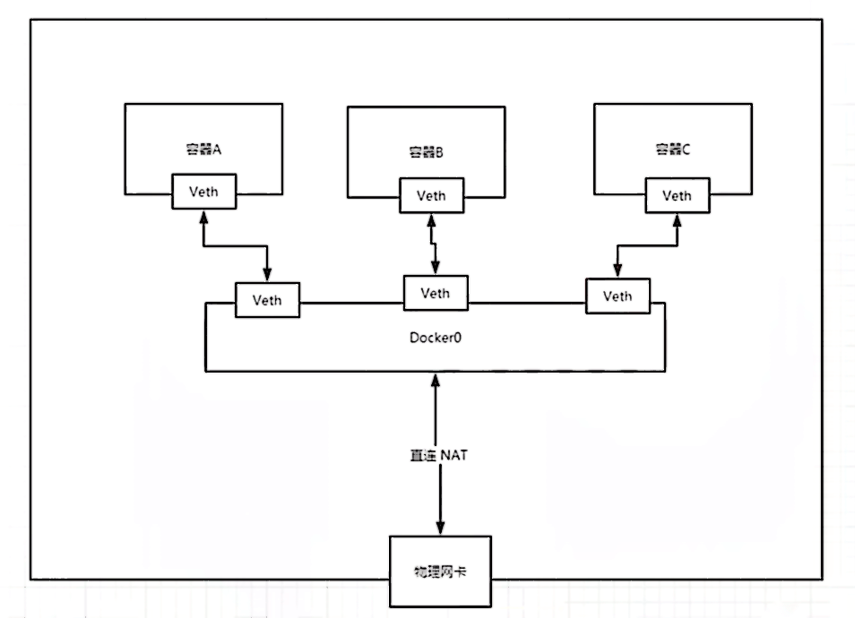

Docker 中的所有网络接口都是虚拟的，虚拟的转发效率高！（比如：内网传递文件！）

只要容器一删除，对应网桥就没了！

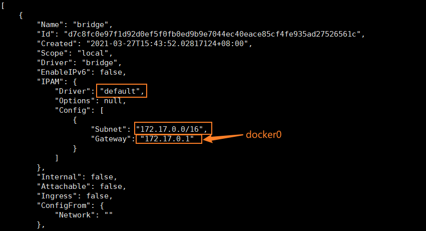

## -- link

> 思考一个场景，我们编写了一个微服务，database url=ip，项目不重启，数据库ip换掉了，我们希望可以处理这个这个问题：可以通过名字来进行访问容器？

```shell
[root@VM-12-17-centos ~]# docker ps
CONTAINER ID   IMAGE     COMMAND             CREATED             STATUS             PORTS                     NAMES
e0bda1a92d20   tomcat    "catalina.sh run"   About an hour ago   Up About an hour   0.0.0.0:49154->8080/tcp   tomcat02
042859ae6623   tomcat    "catalina.sh run"   2 hours ago         Up 2 hours         0.0.0.0:49153->8080/tcp   tomcat01

[root@VM-12-17-centos ~]# docker exec -it tomcat02 ping tomcat01
ping: tomcat01: Name or service not known

# 如何解决？
# 通过 --link
[root@VM-12-17-centos ~]# docker run -d -P --name tomcat03 --link tomcat02 tomcat
e846adfffef8b993e8f84265fd0fc91617fdceee5efecd694998c01d7bac2f78

[root@VM-12-17-centos ~]# docker exec -it tomcat03 ping tomcat02
PING tomcat02 (172.17.0.3) 56(84) bytes of data.
64 bytes from tomcat02 (172.17.0.3): icmp_seq=1 ttl=64 time=0.073 ms
64 bytes from tomcat02 (172.17.0.3): icmp_seq=2 ttl=64 time=0.051 ms
64 bytes from tomcat02 (172.17.0.3): icmp_seq=3 ttl=64 time=0.052 ms

# 反向可以ping通么？
[root@VM-12-17-centos ~]# docker exec -it tomcat02 ping tomcat03
ping: tomcat03: Name or service not known
```

> 探究 inspect ！
>
> - docker network ls
> - docker network inspect d7c8fc0e97f1
> - docker exec -it tomcat03 cat /etc/hosts

```shell
[root@VM-12-17-centos ~]# docker network ls
NETWORK ID     NAME      DRIVER    SCOPE
d7c8fc0e97f1   bridge    bridge    local
0fbb24593354   host      host      local
d84d07fe350f   none      null      local
```

**重点信息：d7c8fc0e97f1**

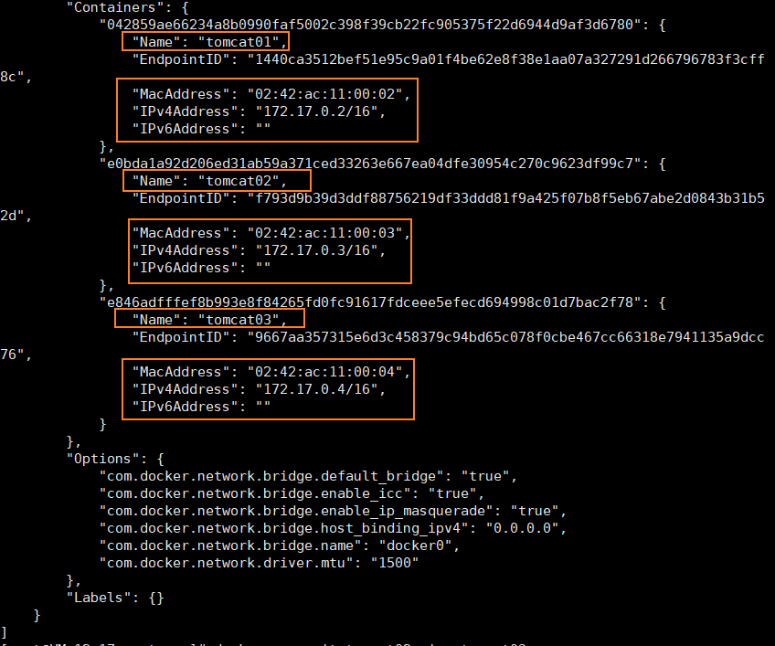

```shell
# 详细信息
# 探究网络 d7c8fc0e97f1 
[root@VM-12-17-centos ~]# docker network inspect d7c8fc0e97f1
[
    {
        "Name": "bridge",
        "Id": "d7c8fc0e97f1d92d0ef5f0fb0ed9b9e7044ec40eace85cf4fe935ad27526561c",
        "Created": "2021-03-27T15:43:52.02817124+08:00",
        "Scope": "local",
        "Driver": "bridge",
        "EnableIPv6": false,
        "IPAM": {
            "Driver": "default",
            "Options": null,
            "Config": [
                {
                    "Subnet": "172.17.0.0/16",
                    "Gateway": "172.17.0.1"
                }
            ]
        },
        "Internal": false,
        "Attachable": false,
        "Ingress": false,
        "ConfigFrom": {
            "Network": ""
        },
        "ConfigOnly": false,
        "Containers": {
            "042859ae66234a8b0990faf5002c398f39cb22fc905375f22d6944d9af3d6780": {
                "Name": "tomcat01",
                "EndpointID": "1440ca3512bef51e95c9a01f4be62e8f38e1aa07a327291d266796783f3cff8c",
                "MacAddress": "02:42:ac:11:00:02",
                "IPv4Address": "172.17.0.2/16",
                "IPv6Address": ""
            },
            "e0bda1a92d206ed31ab59a371ced33263e667ea04dfe30954c270c9623df99c7": {
                "Name": "tomcat02",
                "EndpointID": "f793d9b39d3ddf88756219df33ddd81f9a425f07b8f5eb67abe2d0843b31b52d",
                "MacAddress": "02:42:ac:11:00:03",
                "IPv4Address": "172.17.0.3/16",
                "IPv6Address": ""
            },
            "e846adfffef8b993e8f84265fd0fc91617fdceee5efecd694998c01d7bac2f78": {
                "Name": "tomcat03",
                "EndpointID": "9667aa357315e6d3c458379c94bd65c078f0cbe467cc66318e7941135a9dcc76",
                "MacAddress": "02:42:ac:11:00:04",
                "IPv4Address": "172.17.0.4/16",
                "IPv6Address": ""
            }
        },
        "Options": {
            "com.docker.network.bridge.default_bridge": "true",
            "com.docker.network.bridge.enable_icc": "true",
            "com.docker.network.bridge.enable_ip_masquerade": "true",
            "com.docker.network.bridge.host_binding_ipv4": "0.0.0.0",
            "com.docker.network.bridge.name": "docker0",
            "com.docker.network.driver.mtu": "1500"
        },
        "Labels": {}
    }
]
```

其实这个tomcat03就是在本地配置了tomcat02

```shell
# 查看 hosts 配置，发现原理！
[root@VM-12-17-centos ~]# docker exec -it tomcat03 cat /etc/hosts
127.0.0.1	localhost
::1	localhost ip6-localhost ip6-loopback
fe00::0	ip6-localnet
ff00::0	ip6-mcastprefix
ff02::1	ip6-allnodes
ff02::2	ip6-allrouters
172.17.0.3	tomcat02 e0bda1a92d20
172.17.0.4	e846adfffef8
```

本质探究：`--link` 就是在`hosts`配置中增加了一个`172.17.0.3 tomcat02 e0bda1a92d20` 

现在已经不建议使用 `--link` 了！

自定义网络！不适用docker0！

docker0问题：它不支持容器名连接访问！

## 自定义网络

> 查看所有的网络

```shell
[root@VM-12-17-centos ~]# docker network ls
NETWORK ID     NAME      DRIVER    SCOPE
d7c8fc0e97f1   bridge    bridge    local
0fbb24593354   host      host      local
d84d07fe350f   none      null      local
```

**网络模式**

- bridge：桥接 docker （默认，自己搭建也使用 `bridge模式`）

- none：不配置网络
- host：和宿主机共享网络
- container：容器内连通！（用的少！局限性大，了解即可。）

> **测试一下自定义网络**

- 测试之前先清除之前创建的容器

  ```shell
  [root@VM-12-17-centos ~]# docker rm -f $(docker ps -aq)
  e846adfffef8
  e0bda1a92d20
  042859ae6623
  
  # 回到默认网卡设置
  [root@VM-12-17-centos ~]# ip addr
  1: lo: <LOOPBACK,UP,LOWER_UP> mtu 65536 qdisc noqueue state UNKNOWN group default qlen 1000
      link/loopback 00:00:00:00:00:00 brd 00:00:00:00:00:00
      inet 127.0.0.1/8 scope host lo
         valid_lft forever preferred_lft forever
      inet6 ::1/128 scope host 
         valid_lft forever preferred_lft forever
  2: eth0: <BROADCAST,MULTICAST,UP,LOWER_UP> mtu 1500 qdisc pfifo_fast state UP group default qlen 1000
      link/ether 52:54:00:17:d3:0f brd ff:ff:ff:ff:ff:ff
      inet 10.0.12.17/22 brd 10.0.15.255 scope global eth0
         valid_lft forever preferred_lft forever
      inet6 fe80::5054:ff:fe17:d30f/64 scope link 
         valid_lft forever preferred_lft forever
  3: docker0: <NO-CARRIER,BROADCAST,MULTICAST,UP> mtu 1500 qdisc noqueue state DOWN group default 
      link/ether 02:42:4e:42:61:de brd ff:ff:ff:ff:ff:ff
      inet 172.17.0.1/16 brd 172.17.255.255 scope global docker0
         valid_lft forever preferred_lft forever
      inet6 fe80::42:4eff:fe42:61de/64 scope link 
         valid_lft forever preferred_lft forever
  ```

- 自定义一个网络

  ```shell
  # 直接启动命令，--net bridge，而这个就是我们的docker0
  # docker0 特点：默认，域名不能访问，--link可以打通连接！
  # 默认参数： --net bridge，以下两条命令等价
  docker run -d -P --name tomcat01 tomcat
  docker run -d -P --name tomcat01 --net bridge tomcat
  
  # 自定义网络 mynet
  # --driver bridge			桥接 （不写默认也是桥接）
  # --subnet 192.168.0.0/16	子网	192.168.0.2~192.168.255.255
  # --gateway 192.168.0.1		网关	（出去的关口，路由）
  [root@VM-12-17-centos ~]# docker network create --driver bridge --subnet 192.168.0.0/16 --gateway 192.168.0.1 mynet
  df13fd2b3aa48f1c865f5f00ec09ed713062546a36652649c68e5f78c5b3df06
  
  [root@VM-12-17-centos ~]# docker network ls
  NETWORK ID     NAME      DRIVER    SCOPE
  d7c8fc0e97f1   bridge    bridge    local
  0fbb24593354   host      host      local
  df13fd2b3aa4   mynet     bridge    local
  d84d07fe350f   none      null      local
  ```

- 创建好自己的网络了！

  ```shell
  [root@VM-12-17-centos ~]# docker network inspect mynet
  [
      {
          "Name": "mynet",
          "Id": "df13fd2b3aa48f1c865f5f00ec09ed713062546a36652649c68e5f78c5b3df06",
          "Created": "2021-04-16T14:41:23.157993578+08:00",
          "Scope": "local",
          "Driver": "bridge",
          "EnableIPv6": false,
          "IPAM": {
              "Driver": "default",
              "Options": {},
              "Config": [
                  {
                      "Subnet": "192.168.0.0/16",
                      "Gateway": "192.168.0.1"
                  }
              ]
          },
          "Internal": false,
          "Attachable": false,
          "Ingress": false,
          "ConfigFrom": {
              "Network": ""
          },
          "ConfigOnly": false,
          "Containers": {},
          "Options": {},
          "Labels": {}
      }
  ]
  ```

- 用自定义网络 `mynet` 建立两个容器，再查看：

  ```shell
  [root@VM-12-17-centos ~]# docker run -d -P --name tomcat01 --net mynet tomcat
  8c74bffded3e9f119c3bcb60e94cbdbf8b8f0278ce6c65b91b78d61ae6415bf6
  
  [root@VM-12-17-centos ~]# docker run -d -P --name tomcat02 --net mynet tomcat
  1284589786eda77ca3c5e39c20c7d211d52681d5e9e17ebc263ac396b413adbf
  
  [root@VM-12-17-centos ~]# docker network inspect mynet
  [
      {
          "Name": "mynet",
          "Id": "df13fd2b3aa48f1c865f5f00ec09ed713062546a36652649c68e5f78c5b3df06",
          "Created": "2021-04-16T14:41:23.157993578+08:00",
          "Scope": "local",
          "Driver": "bridge",
          "EnableIPv6": false,
          "IPAM": {
              "Driver": "default",
              "Options": {},
              "Config": [
                  {
                      "Subnet": "192.168.0.0/16",
                      "Gateway": "192.168.0.1"
                  }
              ]
          },
          "Internal": false,
          "Attachable": false,
          "Ingress": false,
          "ConfigFrom": {
              "Network": ""
          },
          "ConfigOnly": false,
          "Containers": {
              "1284589786eda77ca3c5e39c20c7d211d52681d5e9e17ebc263ac396b413adbf": {
                  "Name": "tomcat02",
                  "EndpointID": "cbc3f6c714dd20918f9ac25a9ba1811ba09e540b8a6716d9f842996265c0d68f",
                  "MacAddress": "02:42:c0:a8:00:03",
                  "IPv4Address": "192.168.0.3/16",
                  "IPv6Address": ""
              },
              "8c74bffded3e9f119c3bcb60e94cbdbf8b8f0278ce6c65b91b78d61ae6415bf6": {
                  "Name": "tomcat01",
                  "EndpointID": "b5e12aadc90f9420a20ac1e9aef7159683464bacbf56ac44207d94e454f97892",
                  "MacAddress": "02:42:c0:a8:00:02",
                  "IPv4Address": "192.168.0.2/16",
                  "IPv6Address": ""
              }
          },
          "Options": {},
          "Labels": {}
      }
  ]
  ```

- 再次测试 `ping` 连接：

  ```shell
  [root@VM-12-17-centos ~]# docker exec -it tomcat01 ping 192.168.0.3
  PING 192.168.0.3 (192.168.0.3) 56(84) bytes of data.
  64 bytes from 192.168.0.3: icmp_seq=1 ttl=64 time=0.082 ms
  64 bytes from 192.168.0.3: icmp_seq=2 ttl=64 time=0.039 ms
  64 bytes from 192.168.0.3: icmp_seq=3 ttl=64 time=0.055 ms
  64 bytes from 192.168.0.3: icmp_seq=4 ttl=64 time=0.051 ms
  64 bytes from 192.168.0.3: icmp_seq=5 ttl=64 time=0.049 ms
  64 bytes from 192.168.0.3: icmp_seq=6 ttl=64 time=0.044 ms
  64 bytes from 192.168.0.3: icmp_seq=7 ttl=64 time=0.050 ms
  64 bytes from 192.168.0.3: icmp_seq=8 ttl=64 time=0.051 ms
  64 bytes from 192.168.0.3: icmp_seq=9 ttl=64 time=0.054 ms
  ^C
  --- 192.168.0.3 ping statistics ---
  9 packets transmitted, 9 received, 0% packet loss, time 1007ms
  rtt min/avg/max/mdev = 0.039/0.052/0.082/0.014 ms
  
  # 现在不使用 --link 也可以 ping 名字了！
  [root@VM-12-17-centos ~]# docker exec -it tomcat01 ping tomcat02
  PING tomcat02 (192.168.0.3) 56(84) bytes of data.
  64 bytes from tomcat02.mynet (192.168.0.3): icmp_seq=1 ttl=64 time=0.033 ms
  64 bytes from tomcat02.mynet (192.168.0.3): icmp_seq=2 ttl=64 time=0.067 ms
  64 bytes from tomcat02.mynet (192.168.0.3): icmp_seq=3 ttl=64 time=0.061 ms
  64 bytes from tomcat02.mynet (192.168.0.3): icmp_seq=4 ttl=64 time=0.054 ms
  64 bytes from tomcat02.mynet (192.168.0.3): icmp_seq=5 ttl=64 time=0.053 ms
  ^C
  --- tomcat02 ping statistics ---
  5 packets transmitted, 5 received, 0% packet loss, time 1003ms
  rtt min/avg/max/mdev = 0.033/0.053/0.067/0.014 ms
  ```

> 小结：
>
> - 自定义的网络docker都已经帮我们维护好了对应的关系，推荐平时这样使用网络！
>
> - 好处：不同的集群使用不同的网络，保证集群是安全和健康的！
>
>   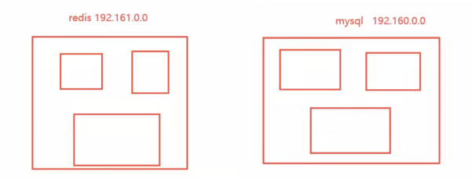


## 网络连通

> 重新清除后新建不同网卡的两个容器

```shell
[root@VM-12-17-centos ~]# docker run -d -P --name tomcat-mynet-01 --net mynet tomcat
8bd02ab3e0200c2be56840220b39f455f75fe2cdd2a630b8be0ef95588059f01
[root@VM-12-17-centos ~]# docker run -d -P --name tomcat-mynet-02 --net mynet tomcat
2f593210f5ed5a2941607384f96fff1ce723612ee9c59f08addae3fed4f1724a
[root@VM-12-17-centos ~]# docker run -d -P --name tomcat01 tomcat
a395f0e39607e873a952281b68d5f7c361e80efb2d4437fef280713693843d2e
[root@VM-12-17-centos ~]# docker run -d -P --name tomcat02 tomcat
10445e3fe8f99ae3f9eb85153491c2ffc28878c2ba508c48396e02b0c5f64d02
```

- 连通命令：connect

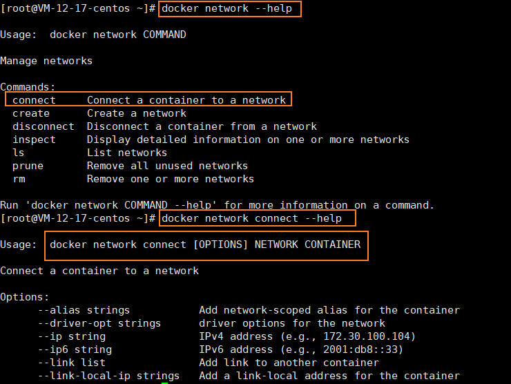

> 测试打通 tomcat01 到 mynet

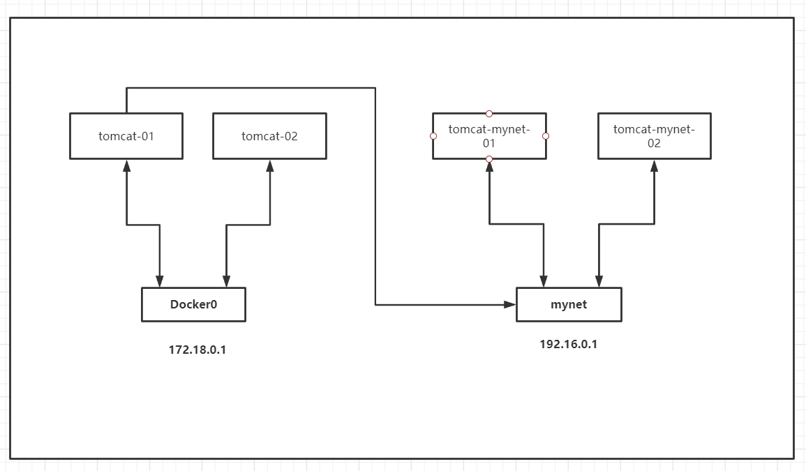

```shell
[root@VM-12-17-centos ~]# docker network connect mynet tomcat01
[root@VM-12-17-centos ~]# docker network inspect mynet
[
    {
        "Name": "mynet",
        "Id": "df13fd2b3aa48f1c865f5f00ec09ed713062546a36652649c68e5f78c5b3df06",
        "Created": "2021-04-16T14:41:23.157993578+08:00",
        "Scope": "local",
        "Driver": "bridge",
        "EnableIPv6": false,
        "IPAM": {
            "Driver": "default",
            "Options": {},
            "Config": [
                {
                    "Subnet": "192.168.0.0/16",
                    "Gateway": "192.168.0.1"
                }
            ]
        },
        "Internal": false,
        "Attachable": false,
        "Ingress": false,
        "ConfigFrom": {
            "Network": ""
        },
        "ConfigOnly": false,
        "Containers": {
            "2f593210f5ed5a2941607384f96fff1ce723612ee9c59f08addae3fed4f1724a": {
                "Name": "tomcat-mynet-02",
                "EndpointID": "5be75b6adeabc0bfd1052382e7d50a008984407bcbd1f40823ffda89fcfe1a1a",
                "MacAddress": "02:42:c0:a8:00:03",
                "IPv4Address": "192.168.0.3/16",
                "IPv6Address": ""
            },
            "8bd02ab3e0200c2be56840220b39f455f75fe2cdd2a630b8be0ef95588059f01": {
                "Name": "tomcat-mynet-01",
                "EndpointID": "afaba6eaf67059eb97ecc1c60d3bcecd6802b060830bba4e87e7e5b74a9a6456",
                "MacAddress": "02:42:c0:a8:00:02",
                "IPv4Address": "192.168.0.2/16",
                "IPv6Address": ""
            },
            "a395f0e39607e873a952281b68d5f7c361e80efb2d4437fef280713693843d2e": {
                "Name": "tomcat01",
                "EndpointID": "fe9960b718e3ffe231e5348df3c65eec83bb3f93bbd617fae87c05bc3cc42062",
                "MacAddress": "02:42:c0:a8:00:04",
                "IPv4Address": "192.168.0.4/16",
                "IPv6Address": ""
            }
        },
        "Options": {},
        "Labels": {}
    }
]
```

> 连通之后就是将 tomcat01 放到了 mynet 网络下？

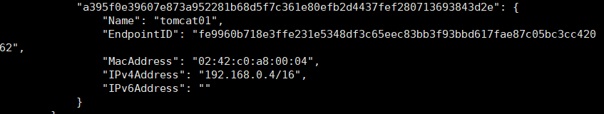


**一个容器两个ip地址！**(类似于腾讯云云服务器的公网和私网)

- 公网ip

- 私网ip

> 测试

```shell
# 01 连通 ok
[root@VM-12-17-centos ~]# docker exec -it tomcat01 ping tomcat-mynet-01
PING tomcat-mynet-01 (192.168.0.2) 56(84) bytes of data.
64 bytes from tomcat-mynet-01.mynet (192.168.0.2): icmp_seq=1 ttl=64 time=0.057 ms
64 bytes from tomcat-mynet-01.mynet (192.168.0.2): icmp_seq=2 ttl=64 time=0.062 ms
64 bytes from tomcat-mynet-01.mynet (192.168.0.2): icmp_seq=3 ttl=64 time=0.057 ms
64 bytes from tomcat-mynet-01.mynet (192.168.0.2): icmp_seq=4 ttl=64 time=0.057 ms
^C
--- tomcat-mynet-01 ping statistics ---
4 packets transmitted, 4 received, 0% packet loss, time 3ms
rtt min/avg/max/mdev = 0.057/0.058/0.062/0.005 ms

# 02 依旧打不通的
[root@VM-12-17-centos ~]# docker exec -it tomcat02 ping tomcat-mynet-01
ping: tomcat-mynet-01: Name or service not known
```

> 结论：假设要跨网络操作别人，就需要使用 `docker network connect [当前网络名] [跨网络待操作容器名]` 来连通！


## 实战：部署 Redis 集群

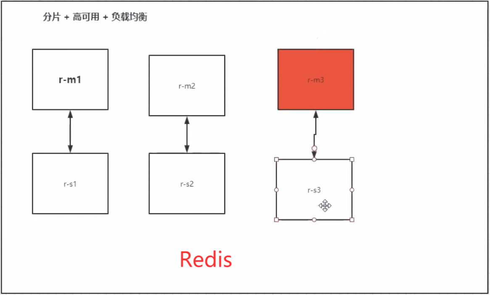

```shell
# 创建网卡
docker network create redis --subnet 172.38.0.0/16

docker network ls 

docker network inspect redis
```


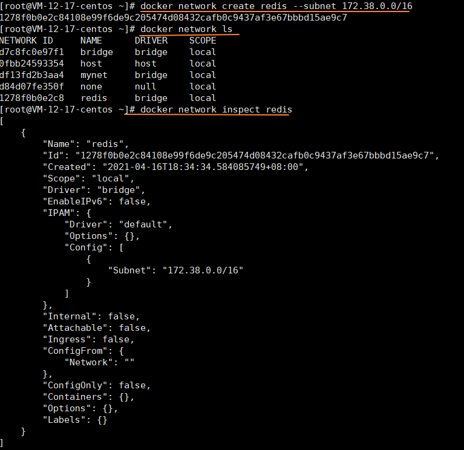

```shell
# 通过脚本创建六个redis配置
for port in $(seq 1 6);\
do \
mkdir -p /mydata/redis/node-${port}/conf
touch /mydata/redis/node-${port}/conf/redis.conf
cat << EOF >/mydata/redis/node-${port}/conf/redis.conf
port 6379
bind 0.0.0.0
cluster-enabled yes
cluster-config-file nodes.conf
cluster-node-timeout 5000
cluster-announce-ip 172.38.0.1${port}
cluster-announce-port 6379
cluster-announce-bus-port 16379
appendonly yes
EOF
done
```


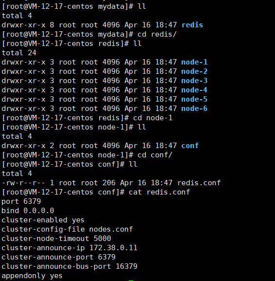


```shell
# 启动 6个redis 容器：

# 方式一：
docker run -p 637${port}:6379 -p 1637${port}:16379 --name redis-${port} \
-v /mydata/redis/node-${port}/data:/data \
-v /mydata/redis/node-${port}/conf/redis.conf:/etc/redis/redis.conf \
-d --net redis --ip 172.38.0.1${port} redis:5.0.9-alpine3.11 redis-server /etc/redis/redis.conf

# 方式二：
docker run -p 6371:6379 -p 16371:16379 --name redis-1 \
-v /mydata/redis/node-1/data:/data \
-v /mydata/redis/node-1/conf/redis.conf:/etc/redis/redis.conf \
-d --net redis --ip 172.38.0.11 redis:5.0.9-alpine3.11 redis-server /etc/redis/redis.conf

docker run -p 6372:6379 -p 16372:16379 --name redis-2 \
-v /mydata/redis/node-2/data:/data \
-v /mydata/redis/node-2/conf/redis.conf:/etc/redis/redis.conf \
-d --net redis --ip 172.38.0.12 redis:5.0.9-alpine3.11 redis-server /etc/redis/redis.conf

docker run -p 6373:6379 -p 16373:16379 --name redis-3 \
-v /mydata/redis/node-3/data:/data \
-v /mydata/redis/node-3/conf/redis.conf:/etc/redis/redis.conf \
-d --net redis --ip 172.38.0.13 redis:5.0.9-alpine3.11 redis-server /etc/redis/redis.conf

docker run -p 6374:6379 -p 16374:16379 --name redis-4 \
-v /mydata/redis/node-4/data:/data \
-v /mydata/redis/node-4/conf/redis.conf:/etc/redis/redis.conf \
-d --net redis --ip 172.38.0.14 redis:5.0.9-alpine3.11 redis-server /etc/redis/redis.conf

docker run -p 6375:6379 -p 16375:16379 --name redis-5 \
-v /mydata/redis/node-5/data:/data \
-v /mydata/redis/node-5/conf/redis.conf:/etc/redis/redis.conf \
-d --net redis --ip 172.38.0.15 redis:5.0.9-alpine3.11 redis-server /etc/redis/redis.conf

docker run -p 6376:6379 -p 16376:16379 --name redis-6 \
-v /mydata/redis/node-6/data:/data \
-v /mydata/redis/node-6/conf/redis.conf:/etc/redis/redis.conf \
-d --net redis --ip 172.38.0.16 redis:5.0.9-alpine3.11 redis-server /etc/redis/redis.conf
```

**查看容器**

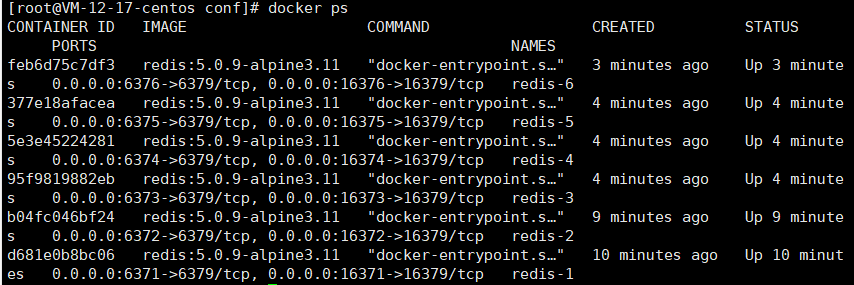


```shell
# 先进入
[root@VM-12-17-centos conf]# docker exec -it redis-1 /bin/sh
/data # ls
appendonly.aof  nodes.conf

# 再创建集群
/data # redis-cli --cluster create 172.38.0.11:6379 172.38.0.12:6379 172.38.0.13:6379 172.38.
0.14:6379 172.38.0.15:6379 172.38.0.16:6379 --cluster-replicas 1
>>> Performing hash slots allocation on 6 nodes...
Master[0] -> Slots 0 - 5460
Master[1] -> Slots 5461 - 10922
Master[2] -> Slots 10923 - 16383
Adding replica 172.38.0.15:6379 to 172.38.0.11:6379
Adding replica 172.38.0.16:6379 to 172.38.0.12:6379
Adding replica 172.38.0.14:6379 to 172.38.0.13:6379
M: 02dbbd0d5db194e4b71e759d8cc33285573be316 172.38.0.11:6379
   slots:[0-5460] (5461 slots) master
M: 9f3255270fc4bcfb44a8d005fec5e7ef69fdebb0 172.38.0.12:6379
   slots:[5461-10922] (5462 slots) master
M: c305a46914d4fdfa716b070b047b0d0c6ede8e34 172.38.0.13:6379
   slots:[10923-16383] (5461 slots) master
S: 780c4085b21b79631bf1813060c7bb101dca2461 172.38.0.14:6379
   replicates c305a46914d4fdfa716b070b047b0d0c6ede8e34
S: dcb668dc19c834b1e9fa102ac0d00833e5fe1588 172.38.0.15:6379
   replicates 02dbbd0d5db194e4b71e759d8cc33285573be316
S: 4533477587c14227544b0f0ca5bb757e300db6f9 172.38.0.16:6379
   replicates 9f3255270fc4bcfb44a8d005fec5e7ef69fdebb0
Can I set the above configuration? (type 'yes' to accept): yes
>>> Nodes configuration updated
>>> Assign a different config epoch to each node
>>> Sending CLUSTER MEET messages to join the cluster
Waiting for the cluster to join
....
>>> Performing Cluster Check (using node 172.38.0.11:6379)
M: 02dbbd0d5db194e4b71e759d8cc33285573be316 172.38.0.11:6379
   slots:[0-5460] (5461 slots) master
   1 additional replica(s)
M: 9f3255270fc4bcfb44a8d005fec5e7ef69fdebb0 172.38.0.12:6379
   slots:[5461-10922] (5462 slots) master
   1 additional replica(s)
M: c305a46914d4fdfa716b070b047b0d0c6ede8e34 172.38.0.13:6379
   slots:[10923-16383] (5461 slots) master
   1 additional replica(s)
S: 780c4085b21b79631bf1813060c7bb101dca2461 172.38.0.14:6379
   slots: (0 slots) slave
   replicates c305a46914d4fdfa716b070b047b0d0c6ede8e34
S: 4533477587c14227544b0f0ca5bb757e300db6f9 172.38.0.16:6379
   slots: (0 slots) slave
   replicates 9f3255270fc4bcfb44a8d005fec5e7ef69fdebb0
S: dcb668dc19c834b1e9fa102ac0d00833e5fe1588 172.38.0.15:6379
   slots: (0 slots) slave
   replicates 02dbbd0d5db194e4b71e759d8cc33285573be316
[OK] All nodes agree about slots configuration.
>>> Check for open slots...
>>> Check slots coverage...
[OK] All 16384 slots covered.
```

> 测试集群

```shell
/data # redis-cli -c

127.0.0.1:6379> cluster info
cluster_state:ok
cluster_slots_assigned:16384
cluster_slots_ok:16384
cluster_slots_pfail:0
cluster_slots_fail:0
cluster_known_nodes:6
cluster_size:3
cluster_current_epoch:6
cluster_my_epoch:1
cluster_stats_messages_ping_sent:291
cluster_stats_messages_pong_sent:289
cluster_stats_messages_sent:580
cluster_stats_messages_ping_received:284
cluster_stats_messages_pong_received:291
cluster_stats_messages_meet_received:5
cluster_stats_messages_received:580

127.0.0.1:6379> cluster nodes
9f3255270fc4bcfb44a8d005fec5e7ef69fdebb0 172.38.0.12:6379@16379 master - 0 1618572166767 2 connected 5461-10922
c305a46914d4fdfa716b070b047b0d0c6ede8e34 172.38.0.13:6379@16379 master - 0 1618572165000 3 connected 10923-16383
780c4085b21b79631bf1813060c7bb101dca2461 172.38.0.14:6379@16379 slave c305a46914d4fdfa716b070b047b0d0c6ede8e34 0 1618572165766 4 connected
02dbbd0d5db194e4b71e759d8cc33285573be316 172.38.0.11:6379@16379 myself,master - 0 1618572164000 1 connected 0-5460
4533477587c14227544b0f0ca5bb757e300db6f9 172.38.0.16:6379@16379 slave 9f3255270fc4bcfb44a8d005fec5e7ef69fdebb0 0 1618572165000 6 connected
dcb668dc19c834b1e9fa102ac0d00833e5fe1588 172.38.0.15:6379@16379 slave 02dbbd0d5db194e4b71e759d8cc33285573be316 0 1618572166567 5 connected

127.0.0.1:6379> set a b
-> Redirected to slot [15495] located at 172.38.0.13:6379
OK
172.38.0.13:6379>
```

**停掉`redis-3`再测试：**

```shell
[root@VM-12-17-centos ~]# docker stop redis-3
redis-3
```

```shell
# 停掉后重新连接
/data # redis-cli -c

127.0.0.1:6379> get a
-> Redirected to slot [15495] located at 172.38.0.14:6379
"b"

# docker搭建redis集群完成！
172.38.0.14:6379> cluster nodes
4533477587c14227544b0f0ca5bb757e300db6f9 172.38.0.16:6379@16379 slave 9f3255270fc4bcfb44a8d005fec5e7ef69fdebb0 0 1618572533000 6 connected
c305a46914d4fdfa716b070b047b0d0c6ede8e34 172.38.0.13:6379@16379 master,fail - 1618572350612 1618572349000 3 connected
780c4085b21b79631bf1813060c7bb101dca2461 172.38.0.14:6379@16379 myself,master - 0 1618572533000 8 connected 10923-16383
02dbbd0d5db194e4b71e759d8cc33285573be316 172.38.0.11:6379@16379 master - 0 1618572533000 1 connected 0-5460
dcb668dc19c834b1e9fa102ac0d00833e5fe1588 172.38.0.15:6379@16379 slave 02dbbd0d5db194e4b71e759d8cc33285573be316 0 1618572533859 5 connected
9f3255270fc4bcfb44a8d005fec5e7ef69fdebb0 172.38.0.12:6379@16379 master - 0 1618572534561 2 connected 5461-10922
172.38.0.14:6379> 
```

**使用了docker之后，所有的技术都会变得简单起来！**


