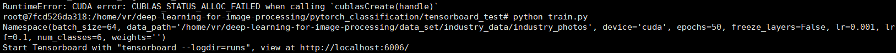

# 搭建DL

## 1、运行容器：portainer

```shell
docker run -d -p 80:9000 --restart=always -v /var/run/docker.sock:/var/run/docker.sock --privileged=true --name portainer portainer/portainer
```

## 2、运行容器：pytorch-jungle

```shell
docker run -p 9090:9090 --rm -it --name=pytorch-jungle --runtime=nvidia --shm-size 64G -v /home/vr/deep-learning-for-image-processing:/home/vr/deep-learning-for-image-processing 5ffed6c83695
```


# 测试DL

> 训练vgg-16

```shell
# use gpu to train vgg16
$ python train.py -net vgg16 -gpu
```

> 测试vgg-16

```shell
python test.py -net vgg16 -weights checkpoint/vgg16/Thursday_06_May_2021_05h_56m_01s/vgg16-200-regular.pth
```


## 遇到的问题

> RuntimeError: DataLoader worker (pid XXX) is killed by signal: Bus error （给运行中的容器修改共享内存）

解决办法：https://blog.csdn.net/u014090429/article/details/108199059

**如何预防**：docker run的时候加参数--shm-size=32212254720（32G=32*1024^3）


------

## 部署服务

> ① 生成 .mar 文件

```shell
torch-model-archiver --model-name resnet50 --version 1.0 --model-file /home/vr/jungle_data/model.py --serialized-file /home/vr/jungle_data/resNet50.pth --extra-files /home/vr/jungle_data/index_to_name.json --handler /home/vr/jungle_data/model_handler.py --export-path model-store
```

> ② 启动 torchserve
>
> -v 主机目录：容器目录

```shell
docker run --rm -it --gpus all -p 8080:8080 -p 8081:8081 --name mar-gpu -v $(pwd)/model-store:/home/model-server/model-store torchserve/torchserve:latest-gpu
```

> ③ 进入容器

```shell
docker exec -it mar-gpu /bin/bash 
```

> ④ 停止 torchserve

```shell
torchserve --stop
```

>⑤ 开启预测服务

```shell
torchserve --start --model-store model-store --models resnet50=resnet50.mar --no-config-snapshots
```


> 本地测试：先进入本机目录（包括对应的预测图片）

```shell
~/jungle_data ▓▒░ curl -X POST http://192.168.94.112:8080/predictions/resnet50 -T 1.jpg
{
  "label": "Industrial_robot",
  "index": 0
}%
```


> 需要修改的 handler 文件

```python
import logging
import torch
import torch.nn.functional as F
import io
from PIL import Image
from torchvision import transforms
import abc
import os
import importlib.util
import time
from ts.utils.util import list_classes_from_module, load_label_mapping
from torch import nn

logger = logging.getLogger(__name__)


class model_handler(abc.ABC):

    def __init__(self, *args, **kwargs):

        self.model = None
        self.mapping = None
        self.device = None
        self.initialized = False
        self.context = None
        self.manifest = None
        self.map_location = None

        # 定义预处理
        self.transform = transforms.Compose(
            [transforms.Resize(256),
             transforms.CenterCrop(224),
             transforms.ToTensor(),
             transforms.Normalize([0.485, 0.456, 0.406], [0.229, 0.224, 0.225])])

    # 需要根据自己的训练和预测文件修改
    def initialize(self, context):
        """
        初始化模型：在模型加载期间调用
        :参数context: 包含模型服务系统的信息.
        """
        properties = context.system_properties
        self.map_location = "cuda" if torch.cuda.is_available() and properties.get("gpu_id") is not None else "cpu"
        self.device = torch.device(
            self.map_location + ":" + str(properties.get("gpu_id"))
            if torch.cuda.is_available() and properties.get("gpu_id") is not None
            else self.map_location
        )
        self.manifest = context.manifest

        model_dir = properties.get("model_dir")
        model_pt_path = None
        if "serializedFile" in self.manifest["model"]:
            serialized_file = self.manifest["model"]["serializedFile"]
            model_pt_path = os.path.join(model_dir, serialized_file)

        # model def file
        model_file = self.manifest["model"].get("modelFile", "")

        if model_file:
            logger.debug("Loading eager model")

            module = importlib.import_module(model_file.split(".")[0])
            model_class_definitions = list_classes_from_module(module)

            model_class = model_class_definitions[0]
            model = model_class()
            # 根据类别数量修改，此时我们的类别为6
            num_ftrs = model.fc.in_features
            model.fc = nn.Linear(num_ftrs, 6)
            # 非并行训练模型
            self.model = model
            self.model.cuda()
            # 并行训练模型
            # self.model = nn.DataParallel(model)
            # self.model.cuda()

            state_dict = torch.load(model_pt_path)

            self.model.load_state_dict(state_dict)
            
            self.model.to(self.device)

        else:
            logger.debug("Loading torchscript model")
            if not os.path.isfile(model_pt_path):
                raise RuntimeError("Missing the model.pt file")

            self.model = self._load_torchscript_model(model_pt_path)

        self.model.eval()

        logger.debug('Model file %s loaded successfully', model_pt_path)

        # Load class mapping for classifiers
        # 读取index_to_name的json文件
        mapping_file_path = os.path.join(model_dir, "index_to_name.json")
        self.mapping = load_label_mapping(mapping_file_path)

        self.initialized = True

    def preprocess_one_image(self, req):
        # 预处理一张图片
        image = req.get("data")
        if image is None:
            image = req.get("body")

        image = Image.open(io.BytesIO(image))
        image = self.transform(image).float()
        image = image.unsqueeze_(0)
        return image

    def preprocess(self, requests):

        """
        预处理一批图片
        """
        images = [self.preprocess_one_image(req) for req in requests]
        images = torch.cat(images)
        return images.cuda()

    def inference(self, x):
        """
        推理方法
        输出预测结果index
        """
        # Do some inference call to engine here and return output

        outs = self.model(x)
        probs = F.softmax(outs, dim=1)
        preds = torch.argmax(probs, dim=1)
        return preds

    def postprocess(self, preds):
        """
        返回推理结果
        :输出：推理结果的列表
        """
        # Take output from network and post-process to desired format
        res = []
        preds = preds.cpu().tolist()
        # {'0': 'neutral', '1': 'porn', '2': 'sexy'}
        # print(self.mapping)

        for pred in preds:
            label = self.mapping[str(pred)]
        res.append({'label': label, 'index': pred})
        return res

    def handle(self, data, context):

        if not self.initialized:
            self.initialize(context)

        if data is None:
            return None

        data = self.preprocess(data)
        data = self.inference(data)
        data = self.postprocess(data)

        return data
```

# 数据可视化

> tensorboard

```shell
docker run -p 9090:9090 -it --name=pytorch-jungle --runtime=nvidia -v /home/vr/deep-learning-for-image-processing:/home/vr/deep-learning-for-image-processing 5ffed6c83695

pip install tensorboard
pip install matplotlib
```

> 在容器内训练：



> 展示训练过程

```shell
# cd /home/vr/deep-learning-for-image-processing/pytorch_classification/tensorboard_test/runs
tensorboard --logdir=./ 

# 只显示前50张图片
# tensorboard --logdir=./ --samples_per_plugin=images=50
```

