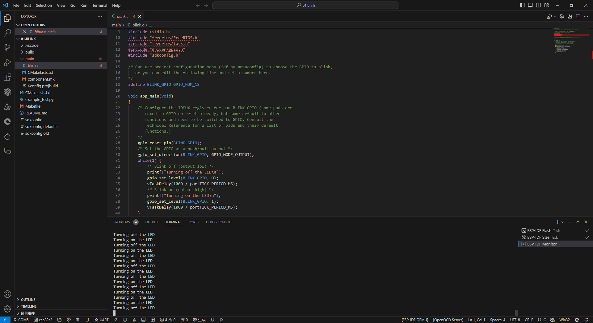

# Idf.py-开发步骤

## 0，安装 `ESP32-C3` 离线版本:

链接：https://pan.baidu.com/s/1bH6LZhFsVJ2r0f5nues38A 
提取码：pdtl 


## 1， 进入编译环境

点击：


```linux
.\export.ps1 #环境变了设置，点击PowerShell默认执行了。
```


## 2， 编译 【进入到`helloworld`项目目录】

```Linux
idf.py build
```


## 3, 设置编译环境

```linux
idf.py set-target esp32c3
```


## 4，下载 【先按Boot再按RST，最后再松开Boot】

```linux
idf.py -p com5 -b 115200 flash
```


## 5, 监视输出：

```linux
idf.py -p com5 monitor
```


---

# VSCode开发步骤

## 1, 下载VSCode

## 2，安装IDF插件


## 3，编译-下载-监视


开发板：ESP32-C3


## 4, 测试HelloWorld


---

# ESP32C3程序准备

## 点灯程序

由于代码的运行需要环境，因此将下载的代码放置在如下图所示位置：


代码：[kits_esp32c3: 源码适用于ESP32 C3物联网开发板，同B站“ESP32-C3 RTOS V4.3 SDK从0到1快速上手”系列视频课程同步。 (gitee.com)](https://gitee.com/iot_camp/kits_esp32c3)

目录结构：


打开第一个并烧录：



## 日志程序

```C
    ESP_LOGE(TAG, "Error hello world");
    ESP_LOGW(TAG, "Warn hello world");
    ESP_LOGI(TAG, "Info hello world");
    ESP_LOGD(TAG, "debug hello world");
    /*"verbose" 表示这是一个详细级别的日志信息，而 "hello world" 是输出的具体内容。*/
    ESP_LOGV(TAG, "verbose hello world"); 
```

打印日志：

```log
I (30) boot: ESP-IDF v5.1.1 2nd stage bootloader
I (30) boot: compile time Dec 13 2023 16:08:27
I (30) boot: chip revision: v0.3
I (33) boot.esp32c3: SPI Speed      : 80MHz
I (38) boot.esp32c3: SPI Mode       : DIO
I (43) boot.esp32c3: SPI Flash Size : 2MB
I (47) boot: Enabling RNG early entropy source...
I (53) boot: Partition Table:
I (56) boot: ## Label            Usage          Type ST Offset   Length
I (64) boot:  0 nvs              WiFi data        01 02 00009000 00006000
I (71) boot:  1 phy_init         RF data          01 01 0000f000 00001000
I (79) boot:  2 factory          factory app      00 00 00010000 00100000
I (86) boot: End of partition table
I (90) esp_image: segment 0: paddr=00010020 vaddr=3c020020 size=08888h ( 34952) map
I (104) esp_image: segment 1: paddr=000188b0 vaddr=3fc8a600 size=01148h (  4424) load
I (108) esp_image: segment 2: paddr=00019a00 vaddr=40380000 size=06618h ( 26136) load
I (120) esp_image: segment 3: paddr=00020020 vaddr=42000020 size=16248h ( 90696) map
I (138) esp_image: segment 4: paddr=00036270 vaddr=40386618 size=03f58h ( 16216) load
I (145) boot: Loaded app from partition at offset 0x10000
I (145) boot: Disabling RNG early entropy source...
I (159) cpu_start: Unicore app
I (159) cpu_start: Pro cpu up.
I (167) cpu_start: Pro cpu start user code
I (167) cpu_start: cpu freq: 160000000 Hz
I (167) cpu_start: Application information:
I (170) cpu_start: Project name:     02.log
I (175) cpu_start: App version:      121a3b7-dirty
I (181) cpu_start: Compile time:     Dec 13 2023 16:08:05
I (187) cpu_start: ELF file SHA256:  5109e909a782d778...
I (193) cpu_start: ESP-IDF:          v5.1.1
I (198) cpu_start: Min chip rev:     v0.3
I (202) cpu_start: Max chip rev:     v0.99 
I (207) cpu_start: Chip rev:         v0.3
I (212) heap_init: Initializing. RAM available for dynamic allocation:
I (219) heap_init: At 3FC8C590 len 00050180 (320 KiB): DRAM
I (225) heap_init: At 3FCDC710 len 00002950 (10 KiB): STACK/DRAM
I (232) heap_init: At 50000010 len 00001FD8 (7 KiB): RTCRAM
I (239) spi_flash: detected chip: generic
I (243) spi_flash: flash io: dio
W (247) spi_flash: Detected size(4096k) larger than the size in the binary image header(2048k). Using the size in the binary image header.
I (260) sleep: Configure to isolate all GPIO pins in sleep state
I (267) sleep: Enable automatic switching of GPIO sleep configuration
I (274) app_start: Starting scheduler on CPU0
I (279) main_task: Started on CPU0
I (279) main_task: Calling app_main()
E (279) user_main: Error hello world
W (289) user_main: Warn hello world
I (289) user_main: Info hello world
```

只打印了如下三种信息【默认info级别】：


设置打印级别【对应命令: idf.py menuconfig】


打印消息：【增加到Debug日志级别！】


```log
I (30) boot: ESP-IDF v5.1.1 2nd stage bootloader
I (30) boot: compile time Dec 13 2023 16:24:23
I (30) boot: chip revision: v0.3
I (33) boot.esp32c3: SPI Speed      : 80MHz
I (38) boot.esp32c3: SPI Mode       : DIO
I (43) boot.esp32c3: SPI Flash Size : 2MB
I (47) boot: Enabling RNG early entropy source...
I (53) boot: Partition Table:
I (56) boot: ## Label            Usage          Type ST Offset   Length
I (64) boot:  0 nvs              WiFi data        01 02 00009000 00006000
I (71) boot:  1 phy_init         RF data          01 01 0000f000 00001000
I (79) boot:  2 factory          factory app      00 00 00010000 00100000
I (86) boot: End of partition table
I (90) esp_image: segment 0: paddr=00010020 vaddr=3c020020 size=08bc0h ( 35776) map
I (104) esp_image: segment 1: paddr=00018be8 vaddr=3fc8a600 size=011ach (  4524) load
I (108) esp_image: segment 2: paddr=00019d9c vaddr=40380000 size=0627ch ( 25212) load
I (120) esp_image: segment 3: paddr=00020020 vaddr=42000020 size=16544h ( 91460) map
I (139) esp_image: segment 4: paddr=0003656c vaddr=4038627c size=04360h ( 17248) load
I (145) boot: Loaded app from partition at offset 0x10000
I (145) boot: Disabling RNG early entropy source...
I (159) cpu_start: Unicore app
I (159) cpu_start: Pro cpu up.
D (167) clk: RTC_SLOW_CLK calibration value: 3785818
I (172) cpu_start: Pro cpu start user code
I (172) cpu_start: cpu freq: 160000000 Hz
I (173) cpu_start: Application information:
I (176) cpu_start: Project name:     02.log
I (180) cpu_start: App version:      121a3b7-dirty
I (186) cpu_start: Compile time:     Dec 13 2023 16:24:15
I (192) cpu_start: ELF file SHA256:  c431a78d1bb8b7af...
I (198) cpu_start: ESP-IDF:          v5.1.1
I (203) cpu_start: Min chip rev:     v0.3
I (207) cpu_start: Max chip rev:     v0.99 
I (212) cpu_start: Chip rev:         v0.3
D (217) memory_layout: Checking 5 reserved memory ranges:
D (222) memory_layout: Reserved memory range 0x3fc80000 - 0x3fc8a600
D (229) memory_layout: Reserved memory range 0x3fc8a600 - 0x3fc8c5f0
D (235) memory_layout: Reserved memory range 0x3fcdf060 - 0x3fce0000
D (242) memory_layout: Reserved memory range 0x50000000 - 0x50000010
D (248) memory_layout: Reserved memory range 0x50001fe8 - 0x50002000
D (255) memory_layout: Building list of available memory regions:
D (261) memory_layout: Available memory region 0x3fc8c5f0 - 0x3fca0000
D (267) memory_layout: Available memory region 0x3fca0000 - 0x3fcc0000
D (274) memory_layout: Available memory region 0x3fcc0000 - 0x3fcdc710
D (281) memory_layout: Available memory region 0x3fcdc710 - 0x3fcdf060
D (287) memory_layout: Available memory region 0x50000010 - 0x50001fe8
I (294) heap_init: Initializing. RAM available for dynamic allocation:
D (301) heap_init: New heap initialised at 0x3fc8c5f0
I (306) heap_init: At 3FC8C5F0 len 00050120 (320 KiB): DRAM
I (312) heap_init: At 3FCDC710 len 00002950 (10 KiB): STACK/DRAM
D (319) heap_init: New heap initialised at 0x50000010
I (324) heap_init: At 50000010 len 00001FD8 (7 KiB): RTCRAM
D (331) intr_alloc: Connected src 27 to int 2 (cpu 0)
D (336) spi_flash: trying chip: issi
D (339) spi_flash: trying chip: gd
D (343) spi_flash: trying chip: mxic
D (346) spi_flash: trying chip: winbond
D (350) spi_flash: trying chip: boya
D (354) spi_flash: trying chip: th
D (357) spi_flash: trying chip: generic
I (361) spi_flash: detected chip: generic
I (366) spi_flash: flash io: dio
W (370) spi_flash: Detected size(4096k) larger than the size in the binary image header(2048k). Using the size in the binary image header.
D (383) cpu_start: calling init function: 0x4200002a
0x4200002a: esp_init_app_elf_sha256 at F:/esp/esp-idf/components/esp_app_format/esp_app_desc.c:69

D (388) cpu_start: calling init function: 0x42004f12 on core: 0
0x42004f12: __esp_system_init_fn_esp_timer_startup_init at F:/esp/esp-idf/components/esp_timer/src/esp_timer.c:575

D (394) intr_alloc: Connected src 39 to int 3 (cpu 0)
D (399) cpu_start: calling init function: 0x42002e32 on core: 0
0x42002e32: __esp_system_init_fn_esp_sleep_startup_init at F:/esp/esp-idf/components/esp_hw_support/sleep_gpio.c:190

I (405) sleep: Configure to isolate all GPIO pins in sleep state
I (412) sleep: Enable automatic switching of GPIO sleep configuration
D (419) cpu_start: calling init function: 0x42001056 on core: 0
0x42001056: __esp_system_init_fn_init_components0 at F:/esp/esp-idf/components/esp_system/startup.c:486

D (425) intr_alloc: Connected src 50 to int 4 (cpu 0)
I (430) app_start: Starting scheduler on CPU0
D (435) intr_alloc: Connected src 37 to int 7 (cpu 0)
I (435) main_task: Started on CPU0
D (435) heap_init: New heap initialised at 0x3fcdc710
D (435) intr_alloc: Connected src 33 to int 9 (cpu 0)
I (445) main_task: Calling app_main()
E (445) user_main: Error hello world
W (455) user_main: Warn hello world
I (455) user_main: Info hello world
D (465) user_main: debug hello world
I (465) gpio: GPIO[18]| InputEn: 0| OutputEn: 0| OpenDrain: 0| Pullup: 1| Pulldown: 0| Intr:0 
```

---

## 非易失性存储 【存储WIFI相关信息】

API文档：[非易失性存储库 - ESP32-C3 - — ESP-IDF 编程指南 release-v4.3 文档 (espressif.com)](https://docs.espressif.com/projects/esp-idf/zh_CN/release-v4.3/esp32c3/api-reference/storage/nvs_flash.html)

非易失性存储 (NVS) 库主要用于在 flash 中存储键值格式的数据。

更改项目名称注意事项：

1，example_test.py


2, CMakeList.txt


3，添加头文件：

```C
#include "nvs_flash.h"
#include "nvs.h"
```

4, NVS基本操作

```C
	// Initialize NVS
    esp_err_t err = nvs_flash_init();
    if (err == ESP_ERR_NVS_NO_FREE_PAGES || err == ESP_ERR_NVS_NEW_VERSION_FOUND) {
        // NVS partition was truncated and needs to be erased
        // Retry nvs_flash_init
        ESP_ERROR_CHECK(nvs_flash_erase());
        err = nvs_flash_init();
    }
    ESP_ERROR_CHECK( err );


    // open namespace
    err = nvs_open("wifi_config", NVS_READWRITE, &my_handle);
    if (ESP_OK != err)
    {
        printf("open nvs namespace(wifi_config) error\r\n");
    }else
    {
        err = nvs_get_str(my_handle, "ssid", data_out, &data_len );
        switch (err) {
            case ESP_OK:
                printf("Done\n");
                printf("########### get ssid success(%d) %s\r\n", data_len, data_out);
                break;
            case ESP_ERR_NVS_NOT_FOUND:
                printf("The value is not initialized yet!\n");
                break;
            default :
                printf("Error (%s) reading!\n", esp_err_to_name(err));
        }

    }

    // write/read nvs_flash
    err = nvs_set_str(my_handle, "ssid", "brown123456");
    if (err == ESP_OK)
    {
        printf("write nvs_value success\r\n");
    }
    
    err = nvs_commit(my_handle);
    if (err != ESP_OK)
    {
        printf("nvs commit error\r\n");
    }


    // close namespace
    nvs_close(my_handle);
```

## 长按按键Key

引入button组件：

usermain.c:

> \#include "drv_include.h"

```C
// init iot_button
button_start();
```


drv_Button.c

```C
// Copyright 2020 Espressif Systems (Shanghai) Co. Ltd.
//
// Licensed under the Apache License, Version 2.0 (the "License");
// you may not use this file except in compliance with the License.
// You may obtain a copy of the License at
//
//     http://www.apache.org/licenses/LICENSE-2.0
//
// Unless required by applicable law or agreed to in writing, software
// distributed under the License is distributed on an "AS IS" BASIS,
// WITHOUT WARRANTIES OR CONDITIONS OF ANY KIND, either express or implied.
// See the License for the specific language governing permissions and
// limitations under the License.
#include <string.h>
#include "esp_log.h"
#include "iot_button.h"

#define TAG "drv_button"
#define IO_SWITCH_BUTTON    6

// 只打印日志即可，暂时不实现功能
static void button_single_click_cb(void *arg)
{
    ESP_LOGI(TAG, "button single clicked!\r\n");
}

static void button_long_press_start_cb(void *arg)
{
    ESP_LOGI(TAG, "button long pressed!\r\n");
}

void button_start(void)
{
    //初始化按键
    button_config_t cfg = {
        .type = BUTTON_TYPE_GPIO,
        .gpio_button_config = {
            .gpio_num = IO_SWITCH_BUTTON,
            .active_level = 0,
        },
    };
    button_handle_t gpio_btn = iot_button_create(&cfg);
    if(NULL == gpio_btn)
    { 
        ESP_LOGE(TAG, "Button create failed"); 
    }
    iot_button_register_cb(gpio_btn, BUTTON_SINGLE_CLICK, button_single_click_cb);            //短按
    iot_button_register_cb(gpio_btn, BUTTON_LONG_PRESS_START, button_long_press_start_cb);    //长按
}
```


---

# ESP32C3连接IOT-物美平台

1，打开工程【将文件夹拖动到VSCode图标上可快速打开！】


