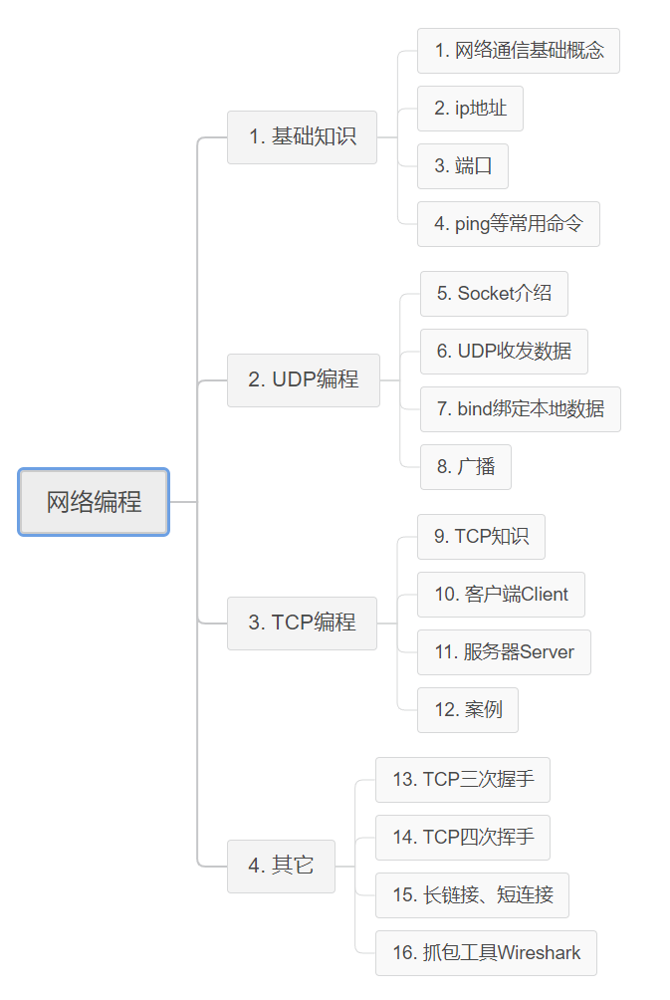
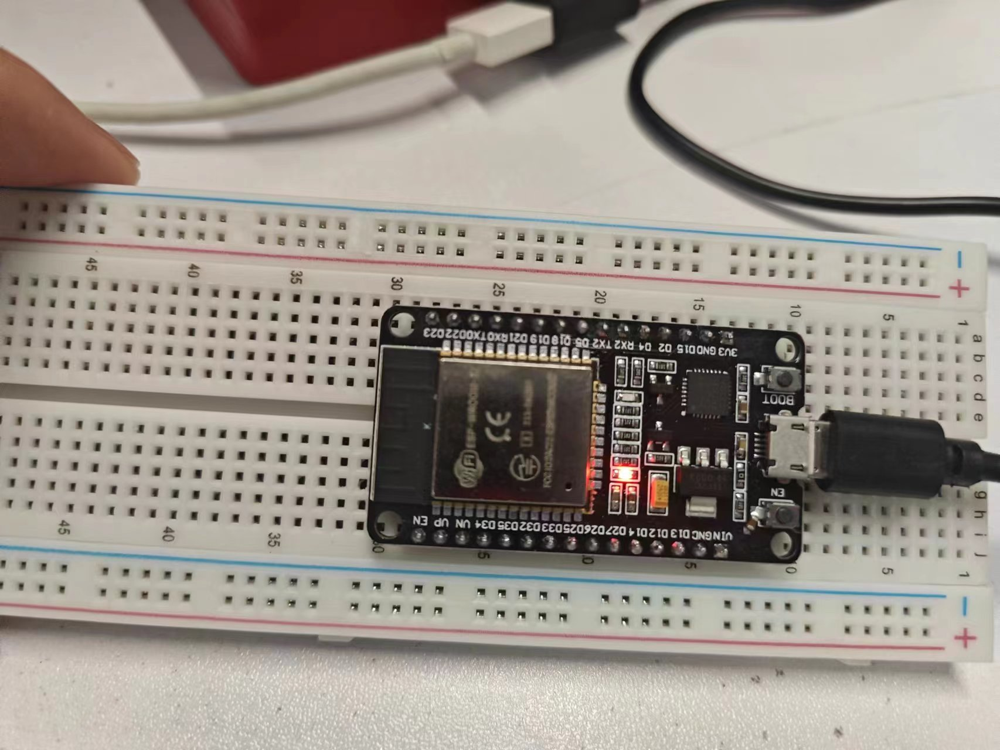

# ESP32物联网开发

## 环境搭建


---

## Python网络编程

> [《Python网络编程》 课件说明 (itprojects.cn)](https://doc.itprojects.cn/0001.zhishi/python.0006.networkprogram/index.html#/README)



网络：网络就是一种辅助双方或者多方能够连接在一起的工具

- 使用网络能够把多方链接在一起，然后可以进行数据传递

- 所谓的网络编程就是，让在不同的电脑上的软件能够进行数据传递，即进程之间的通信

ip地址：用来在网络中标记一台电脑，比如192.168.1.1；在本地局域网上是唯一的。

- 每一个IP地址包括两部分：网络地址和主机地址

- 为了能够知道电脑的ip，需要使用ifconfig来查看
- 为了检测能否与另外一台电脑进行网络通信，需要使用ping来测试网络是否畅通

ip地址用来标记一台电脑，为了能够标记电脑上运行中的程序，需要使用端口来标记

> ```markup
> 知名端口：
> 21端口分配给FTP服务
> 22端口分配给SSH服务
> 80端口分配给HTTP服务
> 
> 动态端口的范围是从1024到65535
> 之所以称为动态端口，是因为它一般不固定分配某种服务，而是动态分配。
> 动态分配是指当一个系统程序或应用程序程序需要网络通信时，它向主机申请一个端口，主机从可用的端口号中分配一个供它使用。当这个程序关闭时，同时也就释放了所占用的端口号
> 
> ```

- 端口就好比是一个房子的门，是出入这间房子的必经之路。
- 如果一个在运行中的程序需要收发网络数据，那么就需要有这样的端口
- 在linux系统中，端口可以有65536（2的16次方）个之多！既然有这么多，操作系统为了统一管理，所以进行了编号，这就是`端口号`
- 端口是通过端口号来标记的，端口号只有整数，范围是从0到65535

- 用“netstat －an”查看端口状态
- lsof -i [tcp/udp]:2425

**套接字:**

socket(简称 `套接字`) 是进程（就是运行中的程序）间通信的一种方式，它与其他进程间通信的一个主要不同是：

它能实现不同主机间的进程间通信，我们网络上各种各样的服务大多都是基于 socket 来完成通信的

创建套接字：

```python
import socket
socket.socket(AddressFamily, Type)
```

函数 socket.socket 创建一个套接字，该函数带有两个参数：

- `Address Family`：可以选择 `AF_INET`（用于 Internet 进程间通信） 或者 `AF_UNIX`（用于同一台机器进程间通信）,实际工作中常用`AF_INET`
- `Type`：套接字类型，可以是 `SOCK_STREAM`（流式套接字，主要用于 TCP 协议）或者 `SOCK_DGRAM`（数据报套接字，主要用于 UDP 协议

**套接字使用流程 与 文件的使用流程很类似**

1. 创建套接字
2. 使用套接字收/发数据
3. 关闭套接字

---

**UDP:**

```python
import socket

# 创建udp的套接字
s = socket.socket(socket.AF_INET, socket.SOCK_DGRAM)

# ...这里是使用套接字的功能（省略）...

# 不用的时候，关闭套接字
s.close()
```

端口绑定：

> - 每重新运行一次网络程序，上图中红圈中的数字，不一样的原因在于，这个数字标识这个网络程序，当重新运行时，如果没有确定到底用哪个，系统默认会随机分配
> - 记住一点：网络程序在运行的过程中，通过端口能够标识这个程序，所以如果其他电脑上的网络程序如果想要向此程序发送数据，那么就需要向这个数字（即端口）标识的程序发送即可

```python
# coding=utf-8

from socket import *

# 1. 创建套接字
udp_socket = socket(AF_INET, SOCK_DGRAM)

# 2. 绑定本地的相关信息，如果一个网络程序不绑定，则系统会随机分配
local_addr = ('', 7788)  # ip地址和端口号，ip一般不用写，表示本机的任何一个ip
udp_socket.bind(local_addr)

# 3. 等待接收对方发送的数据
recv_data = udp_socket.recvfrom(1024) #  1024表示本次接收的最大字节数

# 4. 显示接收到的数据
print(recv_data[0].decode('gbk'))

# 5. 关闭套接字
udp_socket.close()
```


---

**TCP:**

创建TCP套接字

```python
import socket

# 创建tcp的套接字
s = socket.socket(socket.AF_INET, socket.SOCK_STREAM)

# ...这里是使用套接字的功能（省略）...

# 不用的时候，关闭套接字
s.close()
```


---

## 连接WIFI【热点】

> 要点：
>
> - ESP32和PC要连接到同一热点，由于ESP32不支持5G热点，所以要改成2.4GHZ的热点。
> - 网络调试助手-->Server
> - ESP32程序-->Client


**测试代码1-发送数据：**

```python
import socket

# 创建UDP socket
client_socket = socket.socket(socket.AF_INET, socket.SOCK_DGRAM)

# 服务器地址和端口
server_address = ('192.168.0.173', 12345)

# 发送数据到服务器
message = "Hello, server!"
client_socket.sendto(message.encode('utf-8'), server_address)

# 接收服务器响应
response, server_address = client_socket.recvfrom(1024)
print(f"Received response from server: {response.decode('utf-8')}")

# 关闭socket
client_socket.close()

```

**测试代码2-收发数据：**

> Server收到数据后会显示Client的地址和端口号，可以用它在Server端发送数据到Client

**Server:**


**Client:**


```python
import socket

# 创建UDP socket
client_socket = socket.socket(socket.AF_INET, socket.SOCK_DGRAM)

# 服务器地址和端口
server_address = ('192.168.0.173', 123456)

# 发送数据到服务器
message = input("请输入要发送的信息:")
client_socket.sendto(message.encode('utf-8'), server_address)

# 接收服务器响应
response, server_address = client_socket.recvfrom(1024)
print(f"Received response from server: {response.decode('utf-8')}")

# 关闭socket
client_socket.close()

```


---

## 远程点亮LED

> 无线路由器由手机热点代替


```python
import network
import time
import socket
import machine


def do_connect():
    """
    连接WIFI网络
    """
    wlan = network.WLAN(network.STA_IF)
    wlan.active(True)
    if not wlan.isconnected():
        print("conneting to network...")
        wlan.connect('热点名称', '热点密码')
        i = 1
        while not wlan.isconnected():
            # pass # do nothing
            print("try connect the network...{}".format(i))
            i += 1
            time.sleep(1)
    print('network config:', wlan.ifconfig())
    print('mac:', wlan.config('mac'))


def create_udp_socket():
    udp_socket = socket.socket(socket.AF_INET, socket.SOCK_DGRAM)
    # 绑定一个固定的端口
    udp_socket.bind(("0.0.0.0", 7788))
    
    return udp_socket
    

def main():
    # 1 ESP32l连接WIFI，让其又有IP地址
    do_connect()
    # 2 创建UDP socket
    udp_socket = create_udp_socket()
    # 创建GPIO引脚对象 led即Pin2
    led = machine.Pin(2, machine.Pin.OUT)
    # 3 接收UDP数据
    while True:
        recv_data, sender_info = udp_socket.recvfrom(1024)
        print("{}发送的数据: {}".format(sender_info, recv_data))
        # 解码接受数据
        recv_data_str = recv_data.decode("utf-8")
        try:
            print(recv_data_str)
        except Exception as ret:
            print("error:", ret)
        # 4 根据接收到的UDP数据控制LED灯的亮灭
        if recv_data_str == "light on":
            print("这里是要灯亮的代码...")
            led.value(1)
        elif recv_data_str == "light off":
            print("这里是要灯灭的代码...")
            led.value(0)
    

if __name__ == "__main__":
    main()

```

**说明：**

网络调试助手向ESP32发送命令，控制LED的点亮和关闭。

此处：

- 网络调试助手 IP+端口号：192.168.0.173：8088【它不接收数据，所以不是重点】
- ESP32 IP+端口号：192.168.0.105 :7788 【接收命令，控制LED】

**注**：`udp_socket.bind(("0.0.0.0", 7788))` 将ESP32绑定一个固定的端口.


**点亮：**


**灯灭：**



---

## 数码管

### 接线


> a 	b 	c 	d 	e 	f	 g 	h	   【数码管】
>
> 3 	4 	5 	6 	7 	8 	9 	10	【Pin】
>
> 13       12      14        27      26      25	33       32	【GPIO】


最后，GND接pin2。


