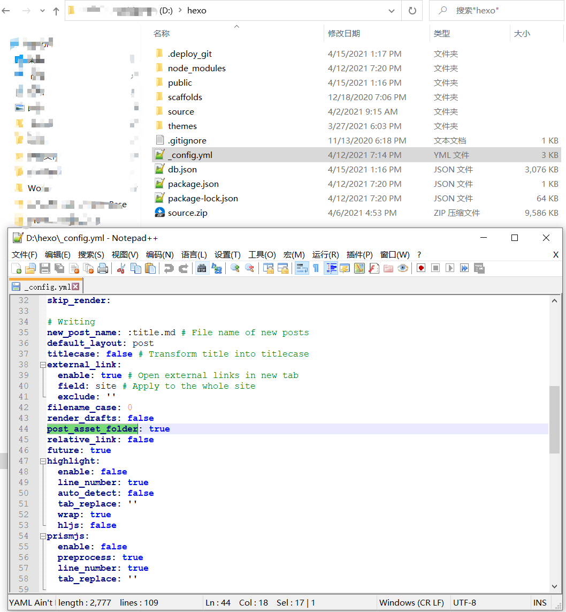

# git快速开始

## 基本命令

1. 创建本地仓库： git init
2. 用命令git commit告诉Git，把文件提交到本地仓库：
  - git add -A 提交所有文件 或者 git add .
  - git commit -a -m"备注信息"
3. 添加 远程仓库 和 提交到 远程仓库
  - git remote add origin git@github.com:jungle8884/仓库名
  - git push -u origin master
  ps:若出现本地与远程仓库不一致们则可以使用git push -f origin master 强制推送（f代表force）
4. 拉取远程服务器origin的master分支
  - git pull origin master
5. 提交单个文件
  - 提交修改内容与提交新文件是一样的两步
  	 1. git add 文件名
  	 2. git commit -m "add a line"		 

## 远程代码仓库的下载

- 先选定文件存放位置, 然后再用下面的命令.
	- git clone https://github.com/azhartalha/Traffic-Survalance-with-Computer-Vision-and-Deep-Learning.git
- 或者
	- git clone git@github.com:azhartalha/Traffic-Survalance-with-Computer-Vision-and-Deep-Learning.git

## hexo博客 替换命令

- alias hs='hexo clean && hexo g && hexo s'  #启动本地服务
 - alias hd='hexo clean && hexo g && hexo d && git add . && git commit -m "update" && git push -f'  #部署博客"

## hexo+github上传图片到博客

> cd到博客根目录下 
>
> - 查看_config.yml文件
>
> - 查找 post_asset_folder 字段
>   - 确定 post_asset_folder 设置为 true
>   -  即：post_asset_folder:true

