# Git分布式版本控制工具

## 1. Git概述

### 1.1 Git历史

Git 诞生于一个极富纷争大举创新的年代。Linux 内核开源项目有着为数众多的参与者。 绝大多数的 Linux 内核维护工作都花在了提交补丁和保存归档的繁琐事务上（1991－2002年间）。 到 2002 年，整个项目组开始启用一个专有的分布式版本控制系统 BitKeeper 来管理和维护代码。

到了 2005 年，开发 BitKeeper 的商业公司同 Linux 内核开源社区的合作关系结束，他们收回了 Linux 内核社区免费使用 BitKeeper 的权力。 这就迫使 Linux 开源社区（特别是 Linux 的缔造者 Linus Torvalds）基于使用 BitKeeper 时的经验教训，开发出自己的版本系统。 

他们对新的系统制订了若干目标：

速度

 简单的设计

 对非线性开发模式的强力支持（允许成千上万个并行开发的分支）

 完全分布式

 有能力高效管理类似 Linux 内核一样的超大规模项目（速度和数据量）

### 1.2 Git与SVN对比

SVN是集中式版本控制系统，版本库是集中放在中央服务器的，而开发人员工作的时候，用的都是自己的电脑，所以首先要从中央服务器下载最新的版本，然后开发，开发完后，需要把自己开发的代码提交到中央服务器。

集中式版本控制工具缺点：

  服务器单点故障

  容错性差

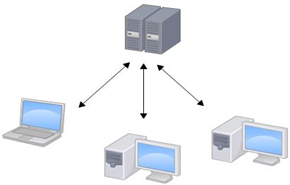

Git是分布式版本控制系统（Distributed Version Control System，简称 DVCS） ，分为两种类型的仓库：

本地仓库和远程仓库

本地仓库：是在开发人员自己电脑上的Git仓库		

远程仓库：是在远程服务器上的Git仓库

Clone：克隆，就是将远程仓库复制到本地

Push：推送，就是将本地仓库代码上传到远程仓库

Pull：拉取，就是将远程仓库代码下载到本地仓库

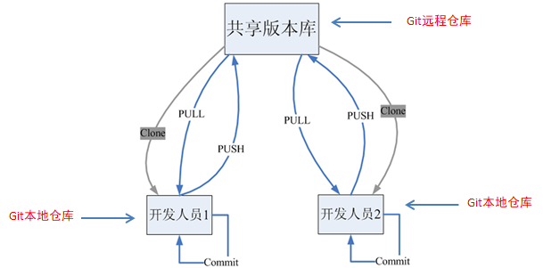

### 1.3 Git工作流程

工作流程如下：

1．从远程仓库中克隆代码到本地仓库

2．从本地仓库中checkout代码然后进行代码修改

3．在提交前先将代码提交到暂存区

4．提交到本地仓库。本地仓库中保存修改的各个历史版本

5．修改完成后，需要和团队成员共享代码时，将代码push到远程仓库

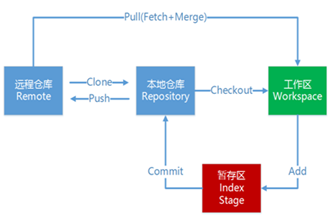

### 1.4 Git下载与安装

下载地址： <https://git-scm.com/download>

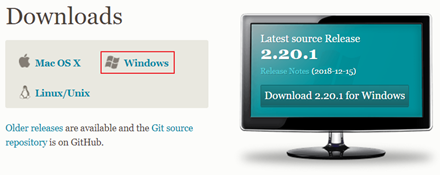

下载完成后可以得到如下安装文件：


## 2. Git代码托管服务

### 2.1 常用的Git代码托管服务

前面我们已经知道了Git中存在两种类型的仓库，即本地仓库和远程仓库。那么我们如何搭建Git远程仓库呢？我们可以借助互联网上提供的一些代码托管服务来实现，其中比较常用的有GitHub、码云、GitLab等。

gitHub（ 地址：https://github.com/ ）是一个面向开源及私有软件项目的托管平台，因为只支持Git 作为唯一的版本库格式进行托管，故名gitHub

码云（地址： https://gitee.com/ ）是国内的一个代码托管平台，由于服务器在国内，所以相比于GitHub，码云速度会更快

GitLab （地址： https://about.gitlab.com/ ）是一个用于仓库管理系统的开源项目，使用Git作为代码管理工具，并在此基础上搭建起来的web服务

### 2.2 公钥

> 在	~\.ssh 目录下 生成 公钥
>
> `ssh-keygen -t rsa`

## 3. Git常用命令

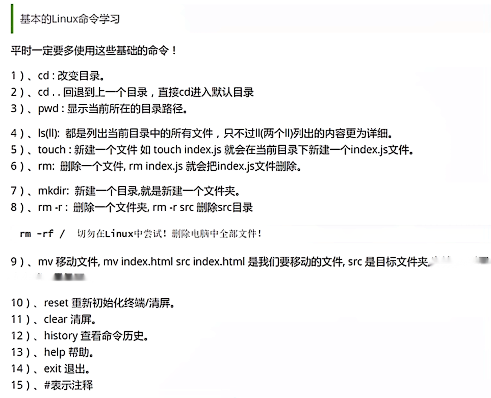

### 3.1 环境配置

当安装Git后首先要做的事情是设置用户名称和email地址。这是非常重要的，因为每次Git提交都会使用该用户信息

设置用户信息 

   git config --global user.name “jungle8884”

   git config --global user.email “jungle8884@163.com”

查看配置信息

   git config --list

   git config user.name

```shell
# 查看配置信息：
$ git config --global --list
merge.tool=kdiff3
mergetool.kdiff3.path=C:/Program Files/KDiff3/kdiff3.exe
diff.guitool=kdiff3
difftool.kdiff3.path=C:/Program Files/KDiff3/kdiff3.exe
core.editor="C:/Program Files (x86)/GitExtensions/GitExtensions.exe" fileeditor
user.name=jungle8884
user.email=jungle8884@163.com
gui.recentrepo=D:/hexo
```


通过上面的命令设置的信息会保存在`~/.gitconfig`文件中

查看文件：

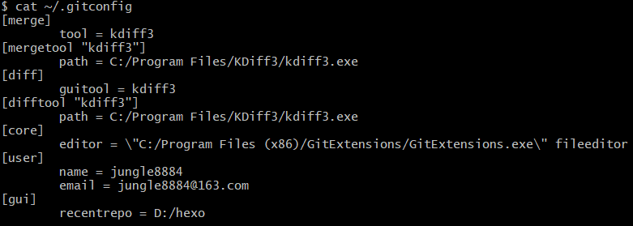


### 3.2 获取Git仓库

要使用Git对我们的代码进行版本控制，首先需要获得Git仓库

获取Git仓库通常有两种方式：

  在本地初始化一个Git仓库

  从远程仓库克隆

#### 3.2.1在本地初始化一个Git仓库

> 执行步骤如下：
>

1. 在电脑的任意位置创建一个空目录（例如repo1）作为我们的本地Git仓库

2. 进入这个目录中，点击右键打开Git bash窗口

3. 执行命令git init

如果在当前目录中看到.git文件夹（此文件夹为隐藏文件夹）则说明Git仓库创建成功

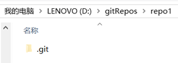

#### 3.2.2从远程仓库克隆

可以通过Git提供的命令从远程仓库进行克隆，将远程仓库克隆到本地

> 命令形式为：git clone 远程Git仓库地址 
>

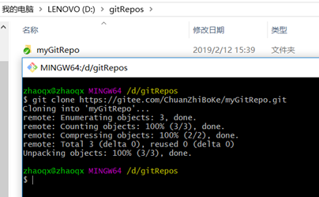

### 3.3工作目录、暂存区以及版本库概念

为了更好的学习Git，我们需要了解Git相关的一些概念，这些概念在后面的学习中会经常提到

**远程仓库** `Remote`：远程仓库，托管代码的服务器

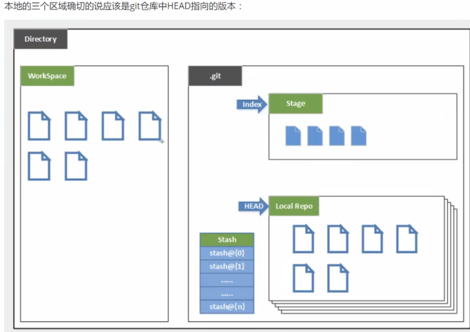

**工作目录**  `WorkingDirectory`（工作区 `Workspace`）：

- `包含.git文件夹的目录 `就是工作目录，主要用于存放开发的代码

**暂存区**  `index/stage`：

- `.git`文件夹中有很多文件，其中有一个`index` 文件就是暂存区，也可以叫做 `stage` ；

- 暂存区是一个临时保存修改文件的地方。

**版本库**  `Repository`：

- 前面看到的 `.git隐藏文件夹` 就是版本库，
- 版本库中存储了很多配置信息、日志信息和文件版本信息等

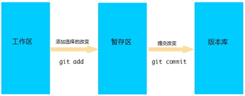

### 3.4 Git工作目录下文件的两种状态

Git工作目录下的文件存在两种状态：

  untracked 未跟踪（未被纳入版本控制）

  tracked 已跟踪（被纳入版本控制）

​        Unmodified 未修改状态

​        Modified 已修改状态

​        Staged 已暂存状态

这些文件的状态会随着我们执行Git的命令发生变化

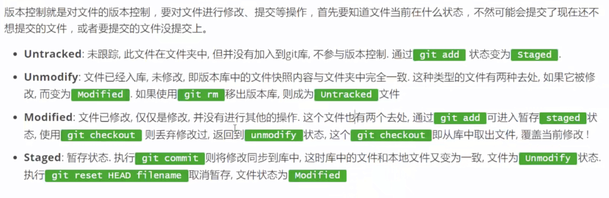

### 3.5 本地仓库操作

> `git status ` 查看文件状态

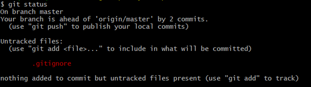

> 也可以使用 `git status –s `使输出信息更加简洁
>

​                                           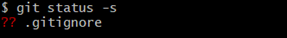

> `git add ` 将未跟踪的文件加入暂存区
>
> - `git add . ` 或  `git add -A`  提交所有

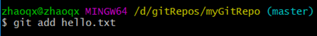

> 将新创建的文件加入暂存区后查看文件状态
>

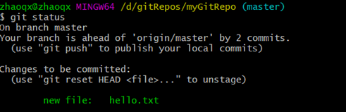

> `git reset ` 将暂存区的文件取消暂存

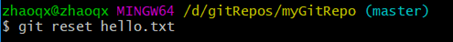

> 将文件取消暂存后查看文件状态
>

​	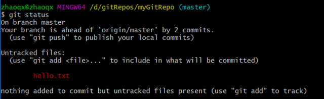

> `git commit ` 将暂存区的文件修改提交到本地仓库

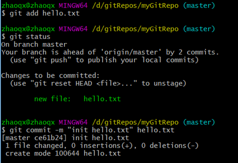

> `git rm` 删除文件

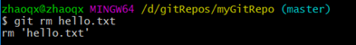

> 删除文件后查看文件状态
>

                                                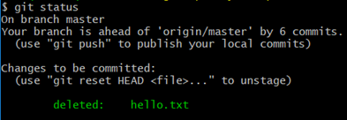

> 上面删除的只是工作区的文件，需要提交到本地仓库
>

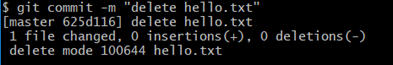

> 将文件添加至忽略列表
>

- 一般我们总会有些文件无需纳入Git 的管理，也不希望它们总出现在未跟踪文件列表。
  -  通常都是些自动生成的文件，
  - 比如: `日志文件`，或者编译过程中创建的 `临时文件` 等。 

- 在这种情况下，我们可以在工作目录中创建一个名为 `.gitignore` 的文件（文件名称固定），列出要忽略的文件模式。

- 下面是一个示例：

```
# no .a files
*.a
# but do track lib.a, even though you're ignoring .a files above
!lib.a
# only ignore the TODO file in the current directory, not subdir/TODO
/TODO
# ignore all files in the build/ directory
build/
# ignore doc/notes.txt, but not doc/server/arch.txt
doc/*.txt
# ignore all .pdf files in the doc/ directory
doc/**/*.pdf
```

> `git log` 查看日志记录

​                                 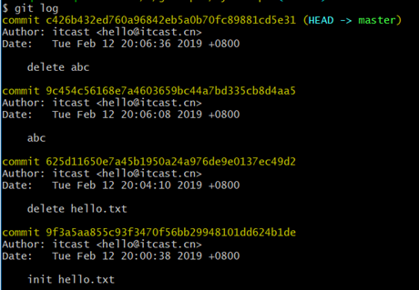

### 3.6 远程仓库操作

前面执行的命令操作都是针对的本地仓库，本章节我们会学习关于远程仓库的一些操作，具体包括：

####   3.6.1查看远程仓库

如果想查看已经配置的远程仓库服务器，可以运行 git remote 命令。 它会列出指定的每一个远程服务器的简写。 如果已经克隆了远程仓库，那么至少应该能看到 origin ，这是 Git 克隆的仓库服务器的默认名字

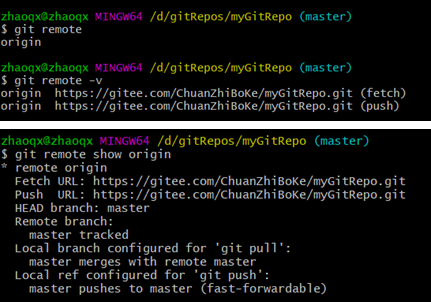

####   3.6.2 添加远程仓库

运行 `git remote add <shortname> <url> `添加一个新的远程 Git 仓库，同时指定一个可以引用的简写

​                              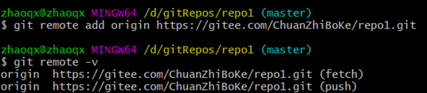

####   3.6.3 从远程仓库克隆

> 如果你想获得一份已经存在了的 Git 仓库的拷贝，这时就要用到 git clone 命令。 

- Git 克隆的是该 Git 仓库服务器上的几乎所有数据（包括日志信息、历史记录等），而不仅仅是复制工作所需要的文件。

- 当你执行 git clone 命令的时候，默认配置下远程 Git 仓库中的每一个文件的每一个版本都将被拉取下来。

> 克隆仓库的命令格式是 git clone [url] 
>

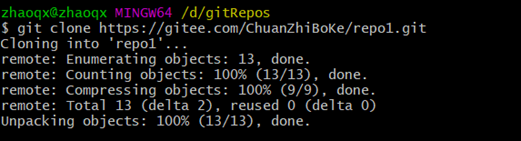

####   3.6.4 移除无效的远程仓库

> 如果因为一些原因想要移除一个远程仓库 ，可以使用 `git remote rm`
>

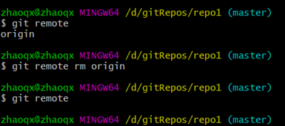

**注意：此命令只是从本地移除远程仓库的记录，并不会真正影响到远程仓库**

####   3.6.5 从远程仓库中抓取与拉取 

> git fetch 是从远程仓库获取最新版本到本地仓库，不会自动merge
>

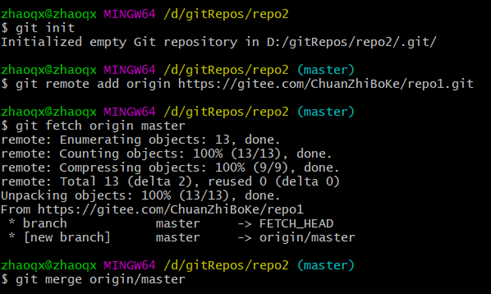

> git pull 是从远程仓库获取最新版本并merge到本地仓库
>

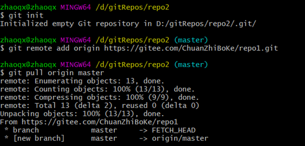

**注意：**

- 如果当前本地仓库不是从远程仓库克隆，而是本地创建的仓库，并且仓库中存在文件，

- 此时再从远程仓库拉取文件的时候会报错`（fatal: refusing to merge unrelated histories ）`，

- 解决此问题可以在`git pull`命令后加入参数`--allow-unrelated-histories`

####   3.6.6 推送到远程仓库

> 当你想分享你的代码时，可以将其推送到远程仓库。 命令形式：git push [remote-name] [branch-name]
>

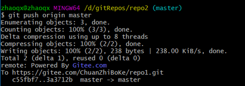

### 3.7 Git分支

几乎所有的版本控制系统都以某种形式支持分支。 

**使用分支意味着你可以把你的工作从开发主线上分离开来，以免影响开发主线。**

在本章节我们会学习到关于分支的相关命令，具体如下：

```shell
# 列出所有分支
git branch

# 列出所有远程分支
git branch -r

# 新建一个分支，但依然停留在当前分支
git branch [branch-name]

# 新建一个分支，并切换到该分支
git checkout -b [branch]

# 不新建分支，切换到指定的分支
git checkout dev

# 合并指定分支到当前分支
git merge [branch]

# 删除分支
git branch -d [branch-name]

# 删除远程分支
git push origin --delete [branch-name]
git branch -dr [remote/branch]
```

如果同一个文件在合并分支时都被修改了则会引起冲突：解决的办法是可以修改冲突文件后重新提交！

master主分支应该非常稳定，用来发布新版本，一般情况下，不允许在上面工作，工作一般情况下在新的dev分支下，比如要发布或者说dev分支代码稳定后可以合并到主分支master上来。


## 4. 在IDEA中集成Git

> 新建项目，绑点git

- 将我们远程的仓库clone下来，然后再将`git仓库`文件目录下的文件拷贝进去即可！

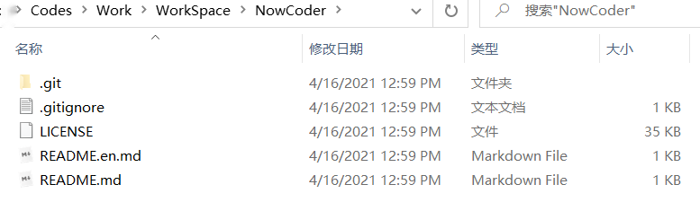

- 注意观察idea中的变化

  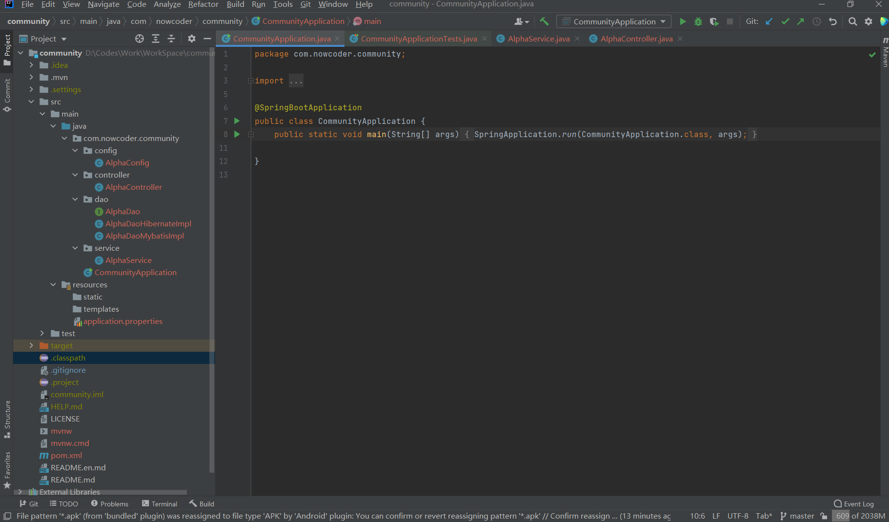

- 先`add`再`commit`

  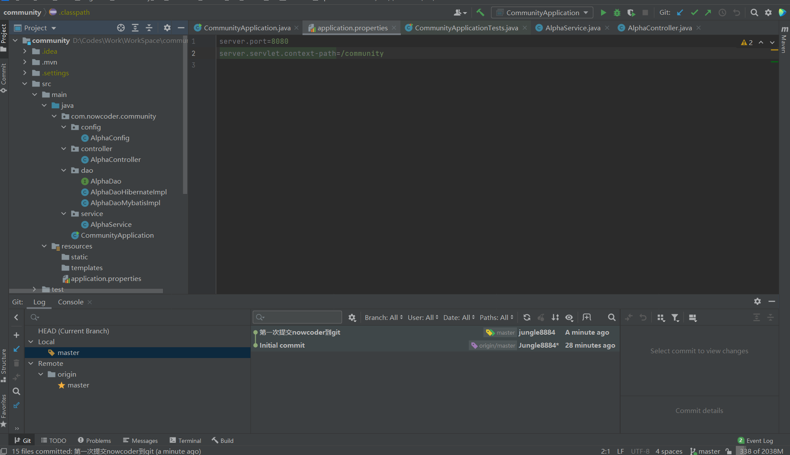

- push

  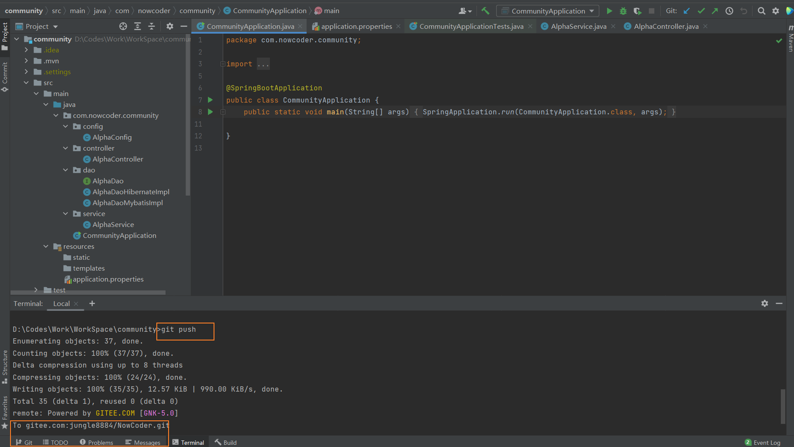

- 查看远程仓库

  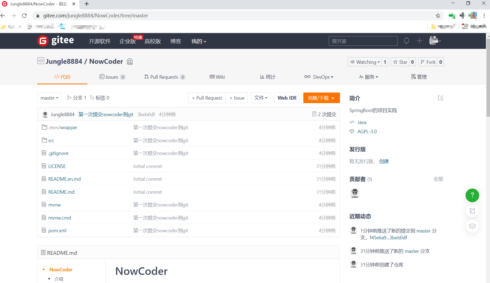


------

# Git 官方书

[git book](https://git-scm.com/book/zh/v2)


