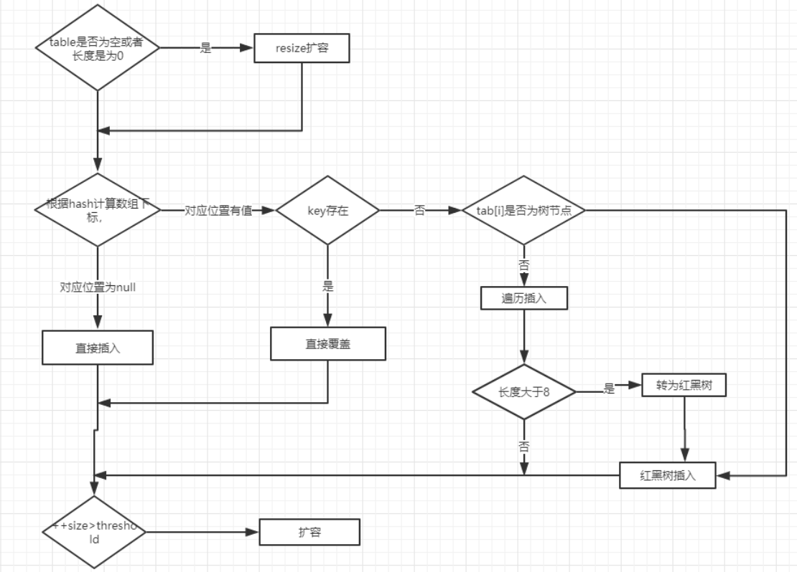
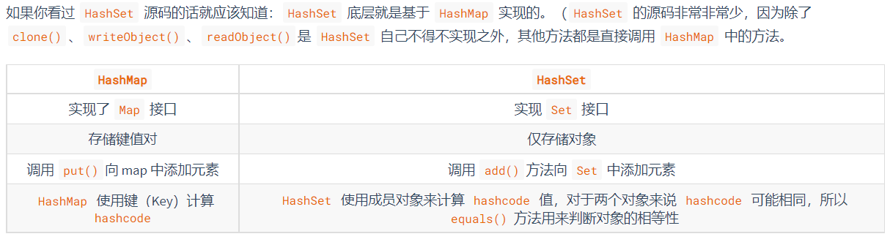
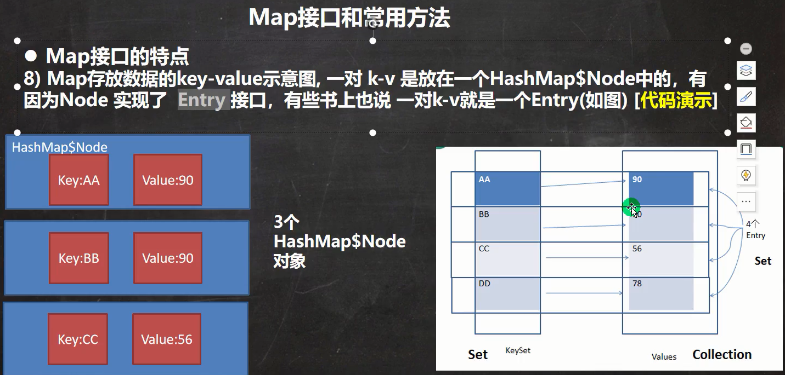
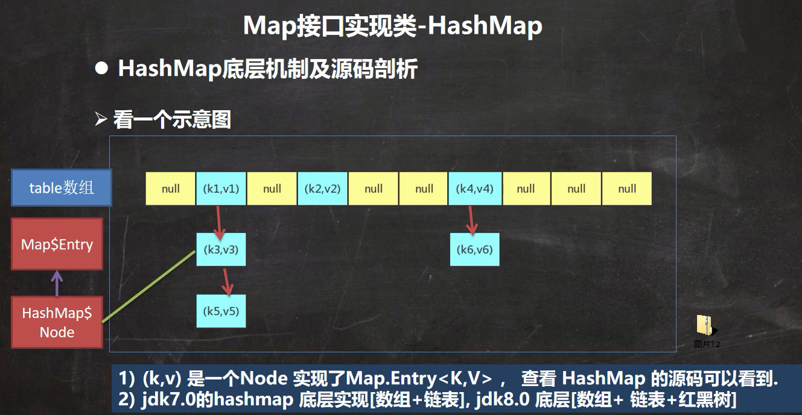
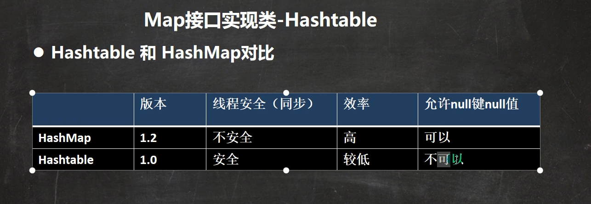
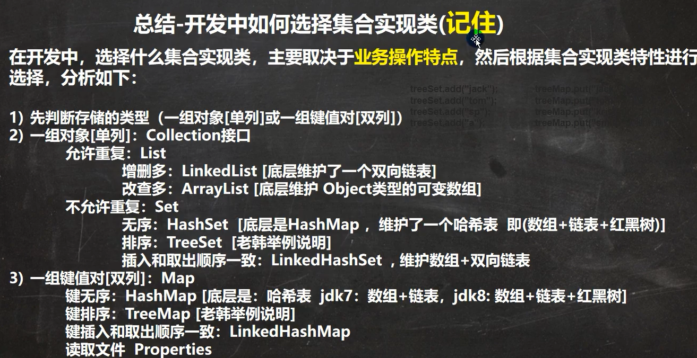

# `Set`

> 说明:

1. Set 接口的实现类的对象, 不能存放重复的元素, 可以添加一个null的元素
2. Set 接口的实现类的对象, 存放数据是无序的(即添加的顺序和取出的顺序不一致)
3. 取出的顺序虽然与添加的顺序不一致, 但是取出的顺序是固定的
4. 遍历只能使用迭代器和增强for, 不能使用数组的方法(因为没有`get(index i)`方法)

---

## `HashSet`

### 说明

> 可以存放null值, 但只能有一个
>
> 不能有重复对象
>
> 添加的顺序和取出的顺序不一致

```java
public class HashSet<E>
    extends AbstractSet<E>
    implements Set<E>, Cloneable, java.io.Serializable
```


### `HashSet`底层是`HashMap`

```java
// 底层是HashMap
public HashSet() {
    map = new HashMap<>();
}
```

> `HashMap`的一些说明:
>
> 通过无参构造函数初始化时, 第一次添加会进行扩容:
>
> ```java
> Node<K,V>[] tab; Node<K,V> p; int n, i;
> if ((tab = table) == null || (n = tab.length) == 0)
>  n = (tab = resize()).length;
> ```
>
> 一般操作: 
>
> 

1. 当添加一个元素时, 会通过 `hash(key)`函数计算`hash`值, 再通过 `&` 运算代替取余运算得到索引值

```java
hash = hash(key)
static final int hash(Object key) {
    int h;
    return (key == null) ? 0 : (h = key.hashCode()) ^ (h >>> 16);
}
// 计算索引公式: i = (n - 1) & hash
```

2. 通过索引值看该table是否有元素, 

   - `如果没有, 则直接加入`

   ```java
   // p 代表 通过计算出的索引值得到的结点
   if ((p = tab[i = (n - 1) & hash]) == null)
          tab[i] = newNode(hash, key, value, null);
   ```

   - `如果有`, 则调用equals方法比较,

     - `如果key相同`, 则直接覆盖 (保证key唯一)

       ```java
       else {
               Node<K,V> e; K k;
               if (p.hash == hash &&
                   ((k = p.key) == key || (key != null && key.equals(k))))
                   // // 保留待被覆盖的结点的引用, 见最后一部分代码实现覆盖操作
                   e = p;  // 覆盖的是value, 对key不做处理, 即在HashSet中, 不添加重复的key!
       ```
     
     - `如果key不相同`, 则判断是否为树结点,  (插入--- 拉链法解决冲突)
     
       - `是`则红黑树插入
     
         ```java
             else if (p instanceof TreeNode)
                 e = ((TreeNode<K,V>)p).putTreeVal(this, tab, hash, key, value);
         ```
     
       - `若不是`, 则遍历插入
     
         ```java
         static final int TREEIFY_THRESHOLD = 8;
         ```
     
         ```java
            else {
                 for (int binCount = 0; ; ++binCount) {
                     // e 指向 p代表的链表 的 下一个结点
                     if ((e = p.next) == null) { // 如果下一个结点为空, 直接插入末尾即可
                         p.next = newNode(hash, key, value, null);
                         // 相当于 binCount + 1 >= TREEIFY_THRESHOLD
                         if (binCount >= TREEIFY_THRESHOLD - 1) 
                             treeifyBin(tab, hash); // 链表大于8, 是则转为红黑树
                         break;
                     }
                     // 如果在链表中遇到了key相同的, 则跳出循环, 最终通过 引用 e 来实现覆盖操作
                     if (e.hash == hash &&
                         ((k = e.key) == key || (key != null && key.equals(k))))
                         break;
                     p = e; // 即 p = e = p.next 遍历
                 }
             }
         ```

> 最后一部分代码
>
> ```java
>                 if (e != null) { // existing mapping for key
>                     V oldValue = e.value;
>                     if (!onlyIfAbsent || oldValue == null)
>                         e.value = value; // 只覆盖value
>                     afterNodeAccess(e);
>                     return oldValue;
>                 }
>             }
> 			++modCount;
>             if (++size > threshold)
>                 resize();
>             afterNodeInsertion(evict);
>             return null;
>         }
> ```
>
> PS: 当链表长度大于阈值（默认为 8）并且 `HashMap` 数组长度大于等于 64 的时候才会执行链表转红黑树的操作，否则就只是对数组扩容。参考 `HashMap` 的 `treeifyBin()` 方法

### 源码

``` java
public class HashSet<E>
    extends AbstractSet<E>
    implements Set<E>, Cloneable, java.io.Serializable
{
    static final long serialVersionUID = -5024744406713321676L;

    private transient HashMap<E,Object> map;

    // 常量: 每个key共享的对象, 占位, 可以用来判断是否remove成功
    private static final Object PRESENT = new Object();

    public HashSet() {
        map = new HashMap<>();
    }

    public HashSet(Collection<? extends E> c) {
        map = new HashMap<>(Math.max((int) (c.size()/.75f) + 1, 16));
        addAll(c);
    }

    public HashSet(int initialCapacity, float loadFactor) {
        map = new HashMap<>(initialCapacity, loadFactor);
    }

    public HashSet(int initialCapacity) {
        map = new HashMap<>(initialCapacity);
    }

    HashSet(int initialCapacity, float loadFactor, boolean dummy) {
        map = new LinkedHashMap<>(initialCapacity, loadFactor);
    }
	
    // 迭代器
    public Iterator<E> iterator() {
        return map.keySet().iterator();
    }
	
    // 实际数目
    public int size() {
        return map.size();
    }

    // 是否为空
    public boolean isEmpty() {
        return map.isEmpty();
    }

    // 是否包含该对象
    public boolean contains(Object o) {
        return map.containsKey(o);
    }

    // 添加元素: 返回boolean型，如果此 set 中尚未包含指定元素，则添加指定元素, 返回true；
    // 如果此 set 已包含该元素，则返回 false。
    // this.add --- Returns:true if this set did not already contain the specified element
    // map.put --- Returns:previous value, or null if none
    public boolean add(E e) {
        return map.put(e, PRESENT)==null;
    }

    // 移除该对象
    public boolean remove(Object o) {
        return map.remove(o)==PRESENT;
    }

    // 清除
    public void clear() {
        map.clear();
    }

    // 克隆
    @SuppressWarnings("unchecked")
    public Object clone() {
        try {
            HashSet<E> newSet = (HashSet<E>) super.clone();
            newSet.map = (HashMap<E, Object>) map.clone();
            return newSet;
        } catch (CloneNotSupportedException e) {
            throw new InternalError(e);
        }
    }

    private void writeObject(java.io.ObjectOutputStream s)
        throws java.io.IOException {
        // Write out any hidden serialization magic
        s.defaultWriteObject();

        // Write out HashMap capacity and load factor
        s.writeInt(map.capacity());
        s.writeFloat(map.loadFactor());

        // Write out size
        s.writeInt(map.size());

        // Write out all elements in the proper order.
        for (E e : map.keySet())
            s.writeObject(e);
    }

    private void readObject(java.io.ObjectInputStream s)
        throws java.io.IOException, ClassNotFoundException {
        // Read in any hidden serialization magic
        s.defaultReadObject();

        // Read capacity and verify non-negative.
        int capacity = s.readInt();
        if (capacity < 0) {
            throw new InvalidObjectException("Illegal capacity: " +
                                             capacity);
        }

        // Read load factor and verify positive and non NaN.
        float loadFactor = s.readFloat();
        if (loadFactor <= 0 || Float.isNaN(loadFactor)) {
            throw new InvalidObjectException("Illegal load factor: " +
                                             loadFactor);
        }

        // Read size and verify non-negative.
        int size = s.readInt();
        if (size < 0) {
            throw new InvalidObjectException("Illegal size: " +
                                             size);
        }
        // Set the capacity according to the size and load factor ensuring that
        // the HashMap is at least 25% full but clamping to maximum capacity.
        capacity = (int) Math.min(size * Math.min(1 / loadFactor, 4.0f),
                HashMap.MAXIMUM_CAPACITY);

        // Constructing the backing map will lazily create an array when the first element is
        // added, so check it before construction. Call HashMap.tableSizeFor to compute the
        // actual allocation size. Check Map.Entry[].class since it's the nearest public type to
        // what is actually created.

        SharedSecrets.getJavaOISAccess()
                     .checkArray(s, Map.Entry[].class, HashMap.tableSizeFor(capacity));

        // Create backing HashMap
        map = (((HashSet<?>)this) instanceof LinkedHashSet ?
               new LinkedHashMap<E,Object>(capacity, loadFactor) :
               new HashMap<E,Object>(capacity, loadFactor));

        // Read in all elements in the proper order.
        for (int i=0; i<size; i++) {
            @SuppressWarnings("unchecked")
                E e = (E) s.readObject();
            map.put(e, PRESENT);
        }
    }

    public Spliterator<E> spliterator() {
        return new HashMap.KeySpliterator<E,Object>(map, 0, -1, 0, 0);
    }
}
```

---

### [`HashCode 与 equals`](https://www.cnblogs.com/skywang12345/p/3324958.html)

**说明:** 要保证两个对象相等, 则它们的`hashCode()值`一定相等. 

- 因为如果不重写`hashCode()方法`, 即使new 出来的对象的内容相同(即通过`equals()`) , 那么再添加到`HashSet集合`里时, 也会被当做两个不一样的对象.
- 如果两个对象`hashCode()值`相等, 它们并不一定相等(说明起冲突了, 采用拉链法解决).

> 不重写`HashCode 与 equals`的`add` ()
>
> 默认的 Object 的 `HashCode 与 equals`
>
> ```java
> public native int hashCode(); // 返回GC堆里的一个特殊值
> ```
>
> ```java
> public boolean equals(Object obj) {
>     return (this == obj); // 判断是不是同一个对象引用
> }
> ```

```java
package com.Jungle;

import java.util.*;

public class HashTest {
    public static void main(String[] args) {
        Set<Employ> set = new HashSet<>();
        set.add(new Employ("jungle", 18));
        set.add(new Employ("james", 18));
        set.add(new Employ("jungle", 18));
        System.out.println(set);
    }

    static class Employ {
        private String name;
        private int age;

        Employ(String name, int age) {
            this.name = name;
            this.age = age;
        }

        @Override
        public String toString() {
            return "Employ{" +
                    "name='" + name + '\'' +
                    ", age=" + age +
                    '}';
        }
    }
}
```

**输出:** 

```java
[Employ{name='jungle', age=18}, Employ{name='james', age=18}, Employ{name='jungle', age=18}]

Process finished with exit code 0
```

> 重写`HashCode 与 equals`后`add`

```java
package com.Jungle;

import java.util.*;

public class HashTest {
    public static void main(String[] args) {
        Set<Employ> set = new HashSet<>();
        set.add(new Employ("jungle", 18));
        set.add(new Employ("james", 18));
        set.add(new Employ("jungle", 18));
        System.out.println(set);
    }

    static class Employ {
        private String name;
        private int age;

        Employ(String name, int age) {
            this.name = name;
            this.age = age;
        }

        @Override
        public boolean equals(Object o) {
            if (this == o) return true;
            if (o == null || getClass() != o.getClass()) return false;
            Employ employ = (Employ) o;
            return age == employ.age && Objects.equals(name, employ.name);
        }

        @Override
        public int hashCode() {
            return Objects.hash(name, age);
        }

        @Override
        public String toString() {
            return "Employ{" +
                    "name='" + name + '\'' +
                    ", age=" + age +
                    '}';
        }
    }
}
```

**输出:**

```java
[Employ{name='james', age=18}, Employ{name='jungle', age=18}]

Process finished with exit code 0
```

---

## [`HashMap` 和 `HashSet` 区别](https://snailclimb.gitee.io/javaguide/#/docs/java/collection/Java集合框架常见面试题?id=_142-hashmap-和-hashset-区别)



---

## `LinkedHashSet`

> 说明:
>
> - `LinkedHashSet`加入的顺序和取出的顺序一致
>
> - `LinkedHashSet`底层维护的是一个`LinkedHashMap`(`HashMap`的子类)
>
> - `LinkedHashSet`底层结构(数组table+双向链表)
>
> - 在Node的基础上添加了before和after维护双向链表
>
>   ```java
>   static class Entry<K,V> extends HashMap.Node<K,V> {
>       Entry<K,V> before, after; 
>       Entry(int hash, K key, V value, Node<K,V> next) {
>           super(hash, key, value, next); --> Node()
>       }
>   }
>   ```

---

## `TreeSet`

> 说明: 无参构造是无序的; 有参构造可以指定排序规则.
>
> - `TreeSet`底层是`TreeMap`

```java
public class TreeSet<E> extends AbstractSet<E>
    implements NavigableSet<E>, Cloneable, java.io.Serializable
```

> 构造函数:

```java
public TreeSet() {
    this(new TreeMap<E,Object>());
}

// 在初始化时可以添加比较器
public TreeSet(Comparator<? super E> comparator) {
    this(new TreeMap<>(comparator));
}
```


---

# Map

> Map (源码在`HashMap`查找) 是一个双列集合(具有映射关系的数据), 即 key-value, 
>
> - 其中, key 不能重复, value 可以重复 (可以将key看做`Set`, value看做`Colletion`).
> - key可以为null, 但只能有一个; value可以多个null.
> - 常用String类作为key
>
> - `HashSet  `其实就是 k-v 中, 将 value 用 常量 PRESENT 替换了; 而 `HashMap` 中的 value 则是 保存变量; 就是说 `HashSet` 只使用 了 `HashMap` 的key.
>
> - 取key-value的集合:
>
>   
>
>   - 一对k-v是放在`HashMap.Node`结点中的, 而为了方便遍历建立了`entrySet`集合, 其中k, v 都只是 `引用`(地址一样).
>   - `HashMap.Node` 实现了 `Map.Entry` : `static class Node<K,V> implements Map.Entry<K,V> `
>
>   ```java
>   // HashMap.Node --> Map.Entry --> entrySet
>   transient Set<Map.Entry<K,V>> entrySet;
>   // final class EntrySet extends AbstractSet<Map.Entry<K,V>> ...
>   public Set<Map.Entry<K,V>> entrySet() {
>       Set<Map.Entry<K,V>> es;
>       return (es = entrySet) == null ? (entrySet = new EntrySet()) : es;
>   }
>   ```
>
>   - 其中`Map.Entry ` :
>     - K `getKey()`
>     - V `getValue()`
>
> - 只取key的集合
>
>   ```java
>   transient Set<K> keySet;
>   // final class KeySet extends AbstractSet<K> ...
>   public Set<K> keySet() {
>       Set<K> ks = keySet;
>       if (ks == null) {
>           ks = new KeySet();
>           keySet = ks;
>       }
>       return ks;
>   }
>   ```
>
> - 只取value的集合
>
>   ```java
>   transient Collection<V> values;
>   // final class Values extends AbstractCollection<V> ...
>   public Collection<V> values() {
>       Collection<V> vs = values;
>       if (vs == null) {
>           vs = new Values();
>           values = vs;
>       }
>       return vs;
>   }
>   ```

**常用方法:**

- put(k, v)
- remove(k) 
- get(k)
- size(): 实际元素个数
- isEmpty()
- clear()
- containskey(k)

---

## `HashMap`

> 参考链接:
>
> - [`JavaGuide`](https://snailclimb.gitee.io/javaguide/#/docs/java/collection/HashMap(JDK1.8)%E6%BA%90%E7%A0%81+%E5%BA%95%E5%B1%82%E6%95%B0%E6%8D%AE%E7%BB%93%E6%9E%84%E5%88%86%E6%9E%90?id=hashmap-%e6%ba%90%e7%a0%81%e5%88%86%e6%9e%90)
>
> - [` jrthe42`](https://blog.jrwang.me/2016/java-collections-hashmap/)
>
> - [找到大于等于initialCapacity的最小的2的幂（initialCapacity如果就是2的幂，则返回的还是这个数）](https://blog.csdn.net/fan2012huan/article/details/51097331)
>
> - 如果添加相同的`key`, 则会覆盖原来的`key-val`, 等同于修改 (`key`不会替换,但`val`会替换)
>
>   

```java
// HashMap.Node 实现了 Map.Entry 接口
static class Node<K,V> implements Map.Entry<K,V> {
    final int hash;
    final K key;
    V value;
    Node<K,V> next;

    Node(int hash, K key, V value, Node<K,V> next) {
        this.hash = hash;
        this.key = key;
        this.value = value;
        this.next = next;
    }

    public final K getKey()        { return key; }
    public final V getValue()      { return value; }
    public final String toString() { return key + "=" + value; }

    public final int hashCode() {
        return Objects.hashCode(key) ^ Objects.hashCode(value);
    }

    public final V setValue(V newValue) {
        V oldValue = value;
        value = newValue;
        return oldValue;
    }

    public final boolean equals(Object o) {
        if (o == this)
            return true;
        if (o instanceof Map.Entry) {
            Map.Entry<?,?> e = (Map.Entry<?,?>)o;
            if (Objects.equals(key, e.getKey()) &&
                Objects.equals(value, e.getValue()))
                return true;
        }
        return false;
    }
}

// table 就是 HashMap 的一个 Node 数组
transient Node<K,V>[] table;
transient Set<Map.Entry<K,V>> entrySet;
transient int size;
transient int modCount;
int threshold;
final float loadFactor;

static final int DEFAULT_INITIAL_CAPACITY = 1 << 4; // aka 16
static final int MAXIMUM_CAPACITY = 1 << 30;
static final float DEFAULT_LOAD_FACTOR = 0.75f;
static final int TREEIFY_THRESHOLD = 8;
static final int UNTREEIFY_THRESHOLD = 6;
static final int MIN_TREEIFY_CAPACITY = 64;

// threshold: 找到大于等于initialCapacity的最小的2的幂给threshold
// 1->1/2->2/7->8/9->16/17->32 (initialCapacity->threshold)
// 第一次put的时候---resize时, 用threshold进行初始化
// newCap = threshold, newThr = threshold * 0.75
// 最后: threshold = newThr; 
// Node<K,V>[] newTab = (Node<K,V>[])new Node[newCap];
// 例如: 1->1/2->2/7->8/9->16/17->32 (initialCapacity->newCap)
// 例如: 1->1/2->1/7->6/9->12/17->24 (initialCapacity->threshold)
public HashMap(int initialCapacity, float loadFactor) {
    if (initialCapacity < 0)
        throw new IllegalArgumentException("Illegal initial capacity: " +
                                           initialCapacity);
    if (initialCapacity > MAXIMUM_CAPACITY)
        initialCapacity = MAXIMUM_CAPACITY;
    if (loadFactor <= 0 || Float.isNaN(loadFactor))
        throw new IllegalArgumentException("Illegal load factor: " +
                                           loadFactor);
    this.loadFactor = loadFactor;
    this.threshold = tableSizeFor(initialCapacity);
}

static final int tableSizeFor(int cap) {
    int n = cap - 1;
    n |= n >>> 1;
    n |= n >>> 2;
    n |= n >>> 4;
    n |= n >>> 8;
    n |= n >>> 16;
    return (n < 0) ? 1 : (n >= MAXIMUM_CAPACITY) ? MAXIMUM_CAPACITY : n + 1;
}

public HashMap(Map<? extends K, ? extends V> m) {
    this.loadFactor = DEFAULT_LOAD_FACTOR;
    putMapEntries(m, false);
}
```

> 上面是一些基础源码
>
> 下方是一般使用`HashMap` 时, 用到的`构造方法`和`Put`方法及其相关联的源码

```java
public HashMap() {
    this.loadFactor = DEFAULT_LOAD_FACTOR; // DEFAULT_LOAD_FACTOR = 0.75f
}

public HashMap(int initialCapacity) {
    this(initialCapacity, DEFAULT_LOAD_FACTOR); // DEFAULT_LOAD_FACTOR = 0.75f
}
```

### 重点方法: `put` 和 `putVal`


```java
public V put(K key, V value) {
    return putVal(hash(key), key, value, false, true);
}

Node<K,V> newNode(int hash, K key, V value, Node<K,V> next) {
    return new Node<>(hash, key, value, next);
}

static final int hash(Object key) {
    int h;
    return (key == null) ? 0 : (h = key.hashCode()) ^ (h >>> 16);
}

final V putVal(int hash, K key, V value, boolean onlyIfAbsent,
               boolean evict) {
    Node<K,V>[] tab; Node<K,V> p; int n, i; // 定义了辅助变量
    // table 本质上是一个Node[]类型的数组, 初始时为null或者大小为0 就进行第一次扩容(一般是16个空间)
    if ((tab = table) == null || (n = tab.length) == 0) 
        n = (tab = resize()).length; // 1 通过构造函数初始化后, table 为 null, 进行第一次扩容 (一般n=16)
    // i = (n - 1) & hash 计算索引位置
    // p = tab[i = (n - 1) & hash] 通过索引使 p 指向 这个索引位置的对象
    if ((p = tab[i = (n - 1) & hash]) == null) //(1) 如果 p 为 null (表示还未存放过元素)
        // 保存的hash值会在后面的比较中, 若有冲突, 则插入链表 (拉链法解决冲突)
        tab[i] = newNode(hash, key, value, null); // 直接插入
    else { //(2) 如果 p 不为 null
        Node<K,V> e; K k; // 需要辅助变量再创建比较好!
        if (p.hash == hash && //(2.1) 如果 key 存在 
            // 准备加入的key 和 p 指向的key 是同一个对象 或者 相等("内容相同")
            ((k = p.key) == key || (key != null && key.equals(k))))
            e = p; // 直接覆盖(见后面统一操作)
        //(2.2) 如果 key 不存在
        else if (p instanceof TreeNode) //(2.2.1) 如果 p 是树结点 (如果p是一颗红黑树)
            e = ((TreeNode<K,V>)p).putTreeVal(this, tab, hash, key, value); // 红黑树插入
        else { //(2.2.2) 如果如果 p 不是 树结点, 即 是 链表
            for (int binCount = 0; ; ++binCount) {
                // 当前链表只有一个结点 或者 (没有相同的key则)走到链表尾
                if ((e = p.next) == null) {
                    p.next = newNode(hash, key, value, null); // 直接加入 (尾插法)
                    // 添加结点后, 判断该链表是否达到8个结点
                    // 相当于: binCount+1 >= TREEIFY_THRESHOLD; TREEIFY_THRESHOLD==8.
                    if (binCount >= TREEIFY_THRESHOLD - 1) 
                        // treeifyBin说明: 
                        // 如果table数组长度小于64, 只扩容 resize() 
                        // 如果table数组长度大于等于64, 进行树化
                        treeifyBin(tab, hash); 
                    break;
                }
                // 在链表里也要判断key是否相同, 相同则break, 最后直接覆盖(见后面统一操作)
                if (e.hash == hash &&
                    ((k = e.key) == key || (key != null && key.equals(k)))) // 同上
                    break;
                p = e; // p = e = p.next 遍历插入
            }
        }
        // 统一对 e = p 进行操作
        if (e != null) { // existing mapping for key
            V oldValue = e.value;
            if (!onlyIfAbsent || oldValue == null)
                e.value = value; // 只对value进行操作(key已经存在时, 不对key进行操作---HashSet)
            afterNodeAccess(e);
            return oldValue;
        }
    }
    ++modCount;
    // 当大于阈值时就扩容
    if (++size > threshold)
        resize();
    afterNodeInsertion(evict);
    return null; // 若 p 为 null, put后 返回 null 代表成功; 若  p 不为 null, 则返回 oldValue (见上); 
}
```

### `treeifyBin`

```java
final void treeifyBin(Node<K,V>[] tab, int hash) {
    int n, index; Node<K,V> e;
    // 长度小于64
    if (tab == null || (n = tab.length) < MIN_TREEIFY_CAPACITY)
        resize(); // 数组扩容
    // 长度大于等于64, 进行树化
    else if ((e = tab[index = (n - 1) & hash]) != null) {
        TreeNode<K,V> hd = null, tl = null;
        do {
            TreeNode<K,V> p = replacementTreeNode(e, null); 
            if (tl == null)
                hd = p;
            else {
                p.prev = tl;
                tl.next = p;
            }
            tl = p;
        } while ((e = e.next) != null);
        if ((tab[index] = hd) != null)
            hd.treeify(tab);
    }
}

TreeNode<K,V> replacementTreeNode(Node<K,V> p, Node<K,V> next) {
    return new TreeNode<>(p.hash, p.key, p.value, next);
}
```

### `TreeNode`

```java
// HashMap.TreeNode
final class TreeNode<K,V> extends LinkedHashMap.Entry<K,V> {
    TreeNode<K,V> parent;  // red-black tree links
    TreeNode<K,V> left;
    TreeNode<K,V> right;
    TreeNode<K,V> prev;    // needed to unlink next upon deletion
    boolean red;
    TreeNode(int hash, K key, V val, Node<K,V> next) {
        super(hash, key, val, next); 
    }

    /**
     * Returns root of tree containing this node.
     */
    final TreeNode<K,V> root() {
        for (TreeNode<K,V> r = this, p;;) {
            if ((p = r.parent) == null)
                return r;
            r = p;
        }
    }

    /**
     * Ensures that the given root is the first node of its bin.
     */
    static <K,V> void moveRootToFront(Node<K,V>[] tab, TreeNode<K,V> root) {
        int n;
        if (root != null && tab != null && (n = tab.length) > 0) {
            int index = (n - 1) & root.hash;
            TreeNode<K,V> first = (TreeNode<K,V>)tab[index];
            if (root != first) {
                Node<K,V> rn;
                tab[index] = root;
                TreeNode<K,V> rp = root.prev;
                if ((rn = root.next) != null)
                    ((TreeNode<K,V>)rn).prev = rp;
                if (rp != null)
                    rp.next = rn;
                if (first != null)
                    first.prev = root;
                root.next = first;
                root.prev = null;
            }
            assert checkInvariants(root);
        }
    }

    /**
     * Finds the node starting at root p with the given hash and key.
     * The kc argument caches comparableClassFor(key) upon first use
     * comparing keys.
     */
    final TreeNode<K,V> find(int h, Object k, Class<?> kc) {
        TreeNode<K,V> p = this;
        do {
            int ph, dir; K pk;
            TreeNode<K,V> pl = p.left, pr = p.right, q;
            if ((ph = p.hash) > h)
                p = pl;
            else if (ph < h)
                p = pr;
            else if ((pk = p.key) == k || (k != null && k.equals(pk)))
                return p;
            else if (pl == null)
                p = pr;
            else if (pr == null)
                p = pl;
            else if ((kc != null ||
                      (kc = comparableClassFor(k)) != null) &&
                     (dir = compareComparables(kc, k, pk)) != 0)
                p = (dir < 0) ? pl : pr;
            else if ((q = pr.find(h, k, kc)) != null)
                return q;
            else
                p = pl;
        } while (p != null);
        return null;
    }

    /**
     * Calls find for root node.
     */
    final TreeNode<K,V> getTreeNode(int h, Object k) {
        return ((parent != null) ? root() : this).find(h, k, null);
    }

    /**
     * Tie-breaking utility for ordering insertions when equal
     * hashCodes and non-comparable. We don't require a total
     * order, just a consistent insertion rule to maintain
     * equivalence across rebalancings. Tie-breaking further than
     * necessary simplifies testing a bit.
     */
    static int tieBreakOrder(Object a, Object b) {
        int d;
        if (a == null || b == null ||
            (d = a.getClass().getName().
             compareTo(b.getClass().getName())) == 0)
            d = (System.identityHashCode(a) <= System.identityHashCode(b) ?
                 -1 : 1);
        return d;
    }

    /**
     * Forms tree of the nodes linked from this node.
     */
    final void treeify(Node<K,V>[] tab) {
        TreeNode<K,V> root = null;
        for (TreeNode<K,V> x = this, next; x != null; x = next) {
            next = (TreeNode<K,V>)x.next;
            x.left = x.right = null;
            if (root == null) {
                x.parent = null;
                x.red = false;
                root = x;
            }
            else {
                K k = x.key;
                int h = x.hash;
                Class<?> kc = null;
                for (TreeNode<K,V> p = root;;) {
                    int dir, ph;
                    K pk = p.key;
                    if ((ph = p.hash) > h)
                        dir = -1;
                    else if (ph < h)
                        dir = 1;
                    else if ((kc == null &&
                              (kc = comparableClassFor(k)) == null) ||
                             (dir = compareComparables(kc, k, pk)) == 0)
                        dir = tieBreakOrder(k, pk);

                    TreeNode<K,V> xp = p;
                    if ((p = (dir <= 0) ? p.left : p.right) == null) {
                        x.parent = xp;
                        if (dir <= 0)
                            xp.left = x;
                        else
                            xp.right = x;
                        root = balanceInsertion(root, x);
                        break;
                    }
                }
            }
        }
        moveRootToFront(tab, root);
    }

    /**
     * Returns a list of non-TreeNodes replacing those linked from
     * this node.
     */
    final Node<K,V> untreeify(HashMap<K,V> map) {
        Node<K,V> hd = null, tl = null;
        for (Node<K,V> q = this; q != null; q = q.next) {
            Node<K,V> p = map.replacementNode(q, null);
            if (tl == null)
                hd = p;
            else
                tl.next = p;
            tl = p;
        }
        return hd;
    }

    /**
     * Tree version of putVal.
     */
    final TreeNode<K,V> putTreeVal(HashMap<K,V> map, Node<K,V>[] tab,
                                   int h, K k, V v) {
        Class<?> kc = null;
        boolean searched = false;
        TreeNode<K,V> root = (parent != null) ? root() : this;
        for (TreeNode<K,V> p = root;;) {
            int dir, ph; K pk;
            if ((ph = p.hash) > h)
                dir = -1;
            else if (ph < h)
                dir = 1;
            else if ((pk = p.key) == k || (k != null && k.equals(pk)))
                return p;
            else if ((kc == null &&
                      (kc = comparableClassFor(k)) == null) ||
                     (dir = compareComparables(kc, k, pk)) == 0) {
                if (!searched) {
                    TreeNode<K,V> q, ch;
                    searched = true;
                    if (((ch = p.left) != null &&
                         (q = ch.find(h, k, kc)) != null) ||
                        ((ch = p.right) != null &&
                         (q = ch.find(h, k, kc)) != null))
                        return q;
                }
                dir = tieBreakOrder(k, pk);
            }

            TreeNode<K,V> xp = p;
            if ((p = (dir <= 0) ? p.left : p.right) == null) {
                Node<K,V> xpn = xp.next;
                TreeNode<K,V> x = map.newTreeNode(h, k, v, xpn);
                if (dir <= 0)
                    xp.left = x;
                else
                    xp.right = x;
                xp.next = x;
                x.parent = x.prev = xp;
                if (xpn != null)
                    ((TreeNode<K,V>)xpn).prev = x;
                moveRootToFront(tab, balanceInsertion(root, x));
                return null;
            }
        }
    }

    /**
     * Removes the given node, that must be present before this call.
     * This is messier than typical red-black deletion code because we
     * cannot swap the contents of an interior node with a leaf
     * successor that is pinned by "next" pointers that are accessible
     * independently during traversal. So instead we swap the tree
     * linkages. If the current tree appears to have too few nodes,
     * the bin is converted back to a plain bin. (The test triggers
     * somewhere between 2 and 6 nodes, depending on tree structure).
     */
    final void removeTreeNode(HashMap<K,V> map, Node<K,V>[] tab,
                              boolean movable) {
        int n;
        if (tab == null || (n = tab.length) == 0)
            return;
        int index = (n - 1) & hash;
        TreeNode<K,V> first = (TreeNode<K,V>)tab[index], root = first, rl;
        TreeNode<K,V> succ = (TreeNode<K,V>)next, pred = prev;
        if (pred == null)
            tab[index] = first = succ;
        else
            pred.next = succ;
        if (succ != null)
            succ.prev = pred;
        if (first == null)
            return;
        if (root.parent != null)
            root = root.root();
        if (root == null
            || (movable
                && (root.right == null
                    || (rl = root.left) == null
                    || rl.left == null))) {
            tab[index] = first.untreeify(map);  // too small
            return;
        }
        TreeNode<K,V> p = this, pl = left, pr = right, replacement;
        if (pl != null && pr != null) {
            TreeNode<K,V> s = pr, sl;
            while ((sl = s.left) != null) // find successor
                s = sl;
            boolean c = s.red; s.red = p.red; p.red = c; // swap colors
            TreeNode<K,V> sr = s.right;
            TreeNode<K,V> pp = p.parent;
            if (s == pr) { // p was s's direct parent
                p.parent = s;
                s.right = p;
            }
            else {
                TreeNode<K,V> sp = s.parent;
                if ((p.parent = sp) != null) {
                    if (s == sp.left)
                        sp.left = p;
                    else
                        sp.right = p;
                }
                if ((s.right = pr) != null)
                    pr.parent = s;
            }
            p.left = null;
            if ((p.right = sr) != null)
                sr.parent = p;
            if ((s.left = pl) != null)
                pl.parent = s;
            if ((s.parent = pp) == null)
                root = s;
            else if (p == pp.left)
                pp.left = s;
            else
                pp.right = s;
            if (sr != null)
                replacement = sr;
            else
                replacement = p;
        }
        else if (pl != null)
            replacement = pl;
        else if (pr != null)
            replacement = pr;
        else
            replacement = p;
        if (replacement != p) {
            TreeNode<K,V> pp = replacement.parent = p.parent;
            if (pp == null)
                root = replacement;
            else if (p == pp.left)
                pp.left = replacement;
            else
                pp.right = replacement;
            p.left = p.right = p.parent = null;
        }

        TreeNode<K,V> r = p.red ? root : balanceDeletion(root, replacement);

        if (replacement == p) {  // detach
            TreeNode<K,V> pp = p.parent;
            p.parent = null;
            if (pp != null) {
                if (p == pp.left)
                    pp.left = null;
                else if (p == pp.right)
                    pp.right = null;
            }
        }
        if (movable)
            moveRootToFront(tab, r);
    }

    /**
     * Splits nodes in a tree bin into lower and upper tree bins,
     * or untreeifies if now too small. Called only from resize;
     * see above discussion about split bits and indices.
     *
     * @param map the map
     * @param tab the table for recording bin heads
     * @param index the index of the table being split
     * @param bit the bit of hash to split on
     */
    final void split(HashMap<K,V> map, Node<K,V>[] tab, int index, int bit) {
        TreeNode<K,V> b = this;
        // Relink into lo and hi lists, preserving order
        TreeNode<K,V> loHead = null, loTail = null;
        TreeNode<K,V> hiHead = null, hiTail = null;
        int lc = 0, hc = 0;
        for (TreeNode<K,V> e = b, next; e != null; e = next) {
            next = (TreeNode<K,V>)e.next;
            e.next = null;
            if ((e.hash & bit) == 0) {
                if ((e.prev = loTail) == null)
                    loHead = e;
                else
                    loTail.next = e;
                loTail = e;
                ++lc;
            }
            else {
                if ((e.prev = hiTail) == null)
                    hiHead = e;
                else
                    hiTail.next = e;
                hiTail = e;
                ++hc;
            }
        }

        if (loHead != null) {
            if (lc <= UNTREEIFY_THRESHOLD)
                tab[index] = loHead.untreeify(map);
            else {
                tab[index] = loHead;
                if (hiHead != null) // (else is already treeified)
                    loHead.treeify(tab);
            }
        }
        if (hiHead != null) {
            if (hc <= UNTREEIFY_THRESHOLD)
                tab[index + bit] = hiHead.untreeify(map);
            else {
                tab[index + bit] = hiHead;
                if (loHead != null)
                    hiHead.treeify(tab);
            }
        }
    }

    /* ------------------------------------------------------------ */
    // Red-black tree methods, all adapted from CLR

    static <K,V> TreeNode<K,V> rotateLeft(TreeNode<K,V> root,
                                          TreeNode<K,V> p) {
        TreeNode<K,V> r, pp, rl;
        if (p != null && (r = p.right) != null) {
            if ((rl = p.right = r.left) != null)
                rl.parent = p;
            if ((pp = r.parent = p.parent) == null)
                (root = r).red = false;
            else if (pp.left == p)
                pp.left = r;
            else
                pp.right = r;
            r.left = p;
            p.parent = r;
        }
        return root;
    }

    static <K,V> TreeNode<K,V> rotateRight(TreeNode<K,V> root,
                                           TreeNode<K,V> p) {
        TreeNode<K,V> l, pp, lr;
        if (p != null && (l = p.left) != null) {
            if ((lr = p.left = l.right) != null)
                lr.parent = p;
            if ((pp = l.parent = p.parent) == null)
                (root = l).red = false;
            else if (pp.right == p)
                pp.right = l;
            else
                pp.left = l;
            l.right = p;
            p.parent = l;
        }
        return root;
    }

    static <K,V> TreeNode<K,V> balanceInsertion(TreeNode<K,V> root,
                                                TreeNode<K,V> x) {
        x.red = true;
        for (TreeNode<K,V> xp, xpp, xppl, xppr;;) {
            if ((xp = x.parent) == null) {
                x.red = false;
                return x;
            }
            else if (!xp.red || (xpp = xp.parent) == null)
                return root;
            if (xp == (xppl = xpp.left)) {
                if ((xppr = xpp.right) != null && xppr.red) {
                    xppr.red = false;
                    xp.red = false;
                    xpp.red = true;
                    x = xpp;
                }
                else {
                    if (x == xp.right) {
                        root = rotateLeft(root, x = xp);
                        xpp = (xp = x.parent) == null ? null : xp.parent;
                    }
                    if (xp != null) {
                        xp.red = false;
                        if (xpp != null) {
                            xpp.red = true;
                            root = rotateRight(root, xpp);
                        }
                    }
                }
            }
            else {
                if (xppl != null && xppl.red) {
                    xppl.red = false;
                    xp.red = false;
                    xpp.red = true;
                    x = xpp;
                }
                else {
                    if (x == xp.left) {
                        root = rotateRight(root, x = xp);
                        xpp = (xp = x.parent) == null ? null : xp.parent;
                    }
                    if (xp != null) {
                        xp.red = false;
                        if (xpp != null) {
                            xpp.red = true;
                            root = rotateLeft(root, xpp);
                        }
                    }
                }
            }
        }
    }

    static <K,V> TreeNode<K,V> balanceDeletion(TreeNode<K,V> root,
                                               TreeNode<K,V> x) {
        for (TreeNode<K,V> xp, xpl, xpr;;) {
            if (x == null || x == root)
                return root;
            else if ((xp = x.parent) == null) {
                x.red = false;
                return x;
            }
            else if (x.red) {
                x.red = false;
                return root;
            }
            else if ((xpl = xp.left) == x) {
                if ((xpr = xp.right) != null && xpr.red) {
                    xpr.red = false;
                    xp.red = true;
                    root = rotateLeft(root, xp);
                    xpr = (xp = x.parent) == null ? null : xp.right;
                }
                if (xpr == null)
                    x = xp;
                else {
                    TreeNode<K,V> sl = xpr.left, sr = xpr.right;
                    if ((sr == null || !sr.red) &&
                        (sl == null || !sl.red)) {
                        xpr.red = true;
                        x = xp;
                    }
                    else {
                        if (sr == null || !sr.red) {
                            if (sl != null)
                                sl.red = false;
                            xpr.red = true;
                            root = rotateRight(root, xpr);
                            xpr = (xp = x.parent) == null ?
                                null : xp.right;
                        }
                        if (xpr != null) {
                            xpr.red = (xp == null) ? false : xp.red;
                            if ((sr = xpr.right) != null)
                                sr.red = false;
                        }
                        if (xp != null) {
                            xp.red = false;
                            root = rotateLeft(root, xp);
                        }
                        x = root;
                    }
                }
            }
            else { // symmetric
                if (xpl != null && xpl.red) {
                    xpl.red = false;
                    xp.red = true;
                    root = rotateRight(root, xp);
                    xpl = (xp = x.parent) == null ? null : xp.left;
                }
                if (xpl == null)
                    x = xp;
                else {
                    TreeNode<K,V> sl = xpl.left, sr = xpl.right;
                    if ((sl == null || !sl.red) &&
                        (sr == null || !sr.red)) {
                        xpl.red = true;
                        x = xp;
                    }
                    else {
                        if (sl == null || !sl.red) {
                            if (sr != null)
                                sr.red = false;
                            xpl.red = true;
                            root = rotateLeft(root, xpl);
                            xpl = (xp = x.parent) == null ?
                                null : xp.left;
                        }
                        if (xpl != null) {
                            xpl.red = (xp == null) ? false : xp.red;
                            if ((sl = xpl.left) != null)
                                sl.red = false;
                        }
                        if (xp != null) {
                            xp.red = false;
                            root = rotateRight(root, xp);
                        }
                        x = root;
                    }
                }
            }
        }
    }

    /**
     * Recursive invariant check
     */
    static <K,V> boolean checkInvariants(TreeNode<K,V> t) {
        TreeNode<K,V> tp = t.parent, tl = t.left, tr = t.right,
            tb = t.prev, tn = (TreeNode<K,V>)t.next;
        if (tb != null && tb.next != t)
            return false;
        if (tn != null && tn.prev != t)
            return false;
        if (tp != null && t != tp.left && t != tp.right)
            return false;
        if (tl != null && (tl.parent != t || tl.hash > t.hash))
            return false;
        if (tr != null && (tr.parent != t || tr.hash < t.hash))
            return false;
        if (t.red && tl != null && tl.red && tr != null && tr.red)
            return false;
        if (tl != null && !checkInvariants(tl))
            return false;
        if (tr != null && !checkInvariants(tr))
            return false;
        return true;
    }
}
```

### `resize`

> putVal中的扩容操作

```java
// 当大于阈值时就扩容
if (++size > threshold)
    resize();
```

> 扩容机制: (阈值即临界值)
>
> - 初始化扩容一次 (无参构造初始化为16, 有参构造为threshold)
> - put元素时, table数组长度达到了临界值(无参构造为16 x 0.75 == 12), 则是扩容为原来的两倍 (无参构造: 16 x 2 == 32, 新的临界值为32 x 0.75 == 24)

```java
final Node<K,V>[] resize() {
    Node<K,V>[] oldTab = table; oldCap = 0
    // 2 初始化时, oldTab = table = null, 
    int oldCap = (oldTab == null) ? 0 : oldTab.length; 
    int oldThr = threshold; // HashMap(int initialCapacity)初始化带参数会计算出阈值, HashMap()初始化默认为 0
    int newCap, newThr = 0;
    if (oldCap > 0) {
        if (oldCap >= MAXIMUM_CAPACITY) {
            threshold = Integer.MAX_VALUE;
            return oldTab;
        }
        else if ((newCap = oldCap << 1) < MAXIMUM_CAPACITY &&
                 oldCap >= DEFAULT_INITIAL_CAPACITY) // DEFAULT_INITIAL_CAPACITY = 16
            newThr = oldThr << 1; // newCap newThr 都为原来的两倍
    }
    // 3 初始化时, oldCap == 0
    else if (oldThr > 0) // 3.1 oldThr > 0: HashMap 初始化带参数, HashMap(int initialCapacity)
        newCap = oldThr; // 使用阈值为新的容量, initialCapacity 通过 tableSizeFor 计算 阈值---threshold
    else {               // 3.2 oldThr == 0: HashMap 初始化不带带参数, HashMap()
        newCap = DEFAULT_INITIAL_CAPACITY; // 使用默认容量 16
        // DEFAULT_LOAD_FACTOR 是为了在多线程情况下 减少出错, 如: size==12时, 同时4个进程put操作.
        newThr = (int)(DEFAULT_LOAD_FACTOR * DEFAULT_INITIAL_CAPACITY); // 新的阈值: 0.75 * 16 即 12
    }
    // 3.1.1 如果没有使用HashMap()初始化, newThr默认为0, 执行下面代码
    if (newThr == 0) { 
        //loadFactor = DEFAULT_LOAD_FACTOR = 0.75f; newCap = oldThr = threshold
        float ft = (float)newCap * loadFactor; // threshold * 0.75  
        newThr = (newCap < MAXIMUM_CAPACITY && ft < (float)MAXIMUM_CAPACITY ?
                  (int)ft : Integer.MAX_VALUE); // 一般情况: newThr = ft = threshold * 0.75
    }
    // HashMap()初始化阈值为12, HashMap(int initialCapacity) 为 threshold * 0.75
    threshold = newThr; 
    @SuppressWarnings({"rawtypes","unchecked"})
    // 4 分配内存给table: HashMap()的newCap为 16;
    // HashMap(int initialCapacity)的newCap = oldThr = 初始化计算出来的 threshold.
    Node<K,V>[] newTab = (Node<K,V>[])new Node[newCap]; 
    table = newTab;
    // 5 初始化时, oldTab 为 null, 不执行
    if (oldTab != null) {
        for (int j = 0; j < oldCap; ++j) {
            Node<K,V> e;
            if ((e = oldTab[j]) != null) {
                oldTab[j] = null;
                if (e.next == null)
                    newTab[e.hash & (newCap - 1)] = e;
                else if (e instanceof TreeNode)
                    ((TreeNode<K,V>)e).split(this, newTab, j, oldCap);
                else { // preserve order
                    Node<K,V> loHead = null, loTail = null;
                    Node<K,V> hiHead = null, hiTail = null;
                    Node<K,V> next;
                    do {
                        next = e.next;
                        if ((e.hash & oldCap) == 0) {
                            if (loTail == null)
                                loHead = e;
                            else
                                loTail.next = e;
                            loTail = e;
                        }
                        else {
                            if (hiTail == null)
                                hiHead = e;
                            else
                                hiTail.next = e;
                            hiTail = e;
                        }
                    } while ((e = next) != null);
                    if (loTail != null) {
                        loTail.next = null;
                        newTab[j] = loHead;
                    }
                    if (hiTail != null) {
                        hiTail.next = null;
                        newTab[j + oldCap] = hiHead;
                    }
                }
            }
        }
    }
    // 6 返回新分配的 table
    return newTab;
}
```

### `putTreeVal`

```java
final TreeNode<K,V> putTreeVal(HashMap<K,V> map, Node<K,V>[] tab,
                                   int h, K k, V v) {
        Class<?> kc = null;
        boolean searched = false;
        TreeNode<K,V> root = (parent != null) ? root() : this;
        for (TreeNode<K,V> p = root;;) {
            int dir, ph; K pk;
            if ((ph = p.hash) > h)
                dir = -1;
            else if (ph < h)
                dir = 1;
            else if ((pk = p.key) == k || (k != null && k.equals(pk)))
                return p;
            else if ((kc == null &&
                      (kc = comparableClassFor(k)) == null) ||
                     (dir = compareComparables(kc, k, pk)) == 0) {
                if (!searched) {
                    TreeNode<K,V> q, ch;
                    searched = true;
                    if (((ch = p.left) != null &&
                         (q = ch.find(h, k, kc)) != null) ||
                        ((ch = p.right) != null &&
                         (q = ch.find(h, k, kc)) != null))
                        return q;
                }
                dir = tieBreakOrder(k, pk);
            }

            TreeNode<K,V> xp = p;
            if ((p = (dir <= 0) ? p.left : p.right) == null) {
                Node<K,V> xpn = xp.next;
                TreeNode<K,V> x = map.newTreeNode(h, k, v, xpn);
                if (dir <= 0)
                    xp.left = x;
                else
                    xp.right = x;
                xp.next = x;
                x.parent = x.prev = xp;
                if (xpn != null)
                    ((TreeNode<K,V>)xpn).prev = x;
                moveRootToFront(tab, balanceInsertion(root, x));
                return null;
            }
        }
    }
```

### 其他的一些源码

```java
// Callbacks to allow LinkedHashMap post-actions
// 主要是留下的一些方法, 方便它的子类去继承实现自己的操作
void afterNodeAccess(Node<K,V> p) { }
void afterNodeInsertion(boolean evict) { }
void afterNodeRemoval(Node<K,V> p) { }
```

> 小结: 以后在深入了解红黑树!

---

## `Hashtable`

> 说明;
>
> - 存放的是键值对: 即k-v
> - `Hashtable`的k和v都不能为null, 否则会抛出`NullPointerException`
> - `Hashtable`的使用方法基本上和`HashMap`一样
> - `Hashtable`是线程安全的, `HashMap`是线程不安全的

``` java
public class Hashtable<K,V>
    extends Dictionary<K,V>
    implements Map<K,V>, Cloneable, java.io.Serializable 
```

### 构造函数

> - 底层是一个 Entry数组
>
>   ```java
>   //Hashtable.Entry
>   private static class Entry<K,V> implements Map.Entry<K,V> {
>       final int hash;
>       final K key;
>       V value;
>       Entry<K,V> next;
>   
>       protected Entry(int hash, K key, V value, Entry<K,V> next) {
>           this.hash = hash;
>           this.key =  key;
>           this.value = value;
>           this.next = next;
>       }
>       ...
>   ```
>
> - 第一次初始化大小为11(默认), threshold = 8 = 11x0.75
> - 大于阈值8时,第二次扩容为23: `newCapacity = (oldCapacity << 1) + 1`, 此时threshold = 17 = 23x0.75

```java
private transient Entry<?,?>[] table;
private float loadFactor;
private int threshold;

public Hashtable(int initialCapacity, float loadFactor) {
    if (initialCapacity < 0)
        throw new IllegalArgumentException("Illegal Capacity: "+
                                           initialCapacity);
    if (loadFactor <= 0 || Float.isNaN(loadFactor))
        throw new IllegalArgumentException("Illegal Load: "+loadFactor);

    if (initialCapacity==0)
        initialCapacity = 1;
    this.loadFactor = loadFactor;
    table = new Entry<?,?>[initialCapacity];
    threshold = (int)Math.min(initialCapacity * loadFactor, MAX_ARRAY_SIZE + 1);
}

public Hashtable(int initialCapacity) {
    this(initialCapacity, 0.75f);
}

public Hashtable() {
    this(11, 0.75f);
}
```

### put 和 addEntry

```java
public synchronized V put(K key, V value) {
    // Make sure the value is not null
    if (value == null) {
        throw new NullPointerException();
    }

    // Makes sure the key is not already in the hashtable.
    Entry<?,?> tab[] = table;
    // 根据key得到hash值
    int hash = key.hashCode();
    // 根据hash值计算索引
    int index = (hash & 0x7FFFFFFF) % tab.length;
    @SuppressWarnings("unchecked")
    Entry<K,V> entry = (Entry<K,V>)tab[index]; 
    for(; entry != null ; entry = entry.next) {
        // hash和key相同时, 覆盖
        if ((entry.hash == hash) && entry.key.equals(key)) {
            V old = entry.value;
            entry.value = value;
            return old;
        }
    }
	// 添加 k-v
    addEntry(hash, key, value, index);
    return null;
}

private transient int count;

// 添加k-v
private void addEntry(int hash, K key, V value, int index) {
    modCount++;

    Entry<?,?> tab[] = table;
    if (count >= threshold) {
        // Rehash the table if the threshold is exceeded
        rehash();

        tab = table;
        hash = key.hashCode();
        index = (hash & 0x7FFFFFFF) % tab.length;
    }

    // Creates the new entry.
    @SuppressWarnings("unchecked")
    Entry<K,V> e = (Entry<K,V>) tab[index];
    // new --> table[index] 即头插法
    tab[index] = new Entry<>(hash, key, value, e); // Hashtable.Entry的构造函数
    count++;
}
```

> 扩容机制: `newCapacity = (oldCapacity << 1) + 1`

``` java
protected void rehash() {
    int oldCapacity = table.length; // 11
    Entry<?,?>[] oldMap = table;

    // overflow-conscious code
    int newCapacity = (oldCapacity << 1) + 1; // 11x2 + 1 == 23
    if (newCapacity - MAX_ARRAY_SIZE > 0) {
        if (oldCapacity == MAX_ARRAY_SIZE)
            // Keep running with MAX_ARRAY_SIZE buckets
            return;
        newCapacity = MAX_ARRAY_SIZE;
    }
    Entry<?,?>[] newMap = new Entry<?,?>[newCapacity];

    modCount++;
    threshold = (int)Math.min(newCapacity * loadFactor, MAX_ARRAY_SIZE + 1);
    table = newMap;

    // oldMap拷贝到newMap
    for (int i = oldCapacity ; i-- > 0 ;) {
        for (Entry<K,V> old = (Entry<K,V>)oldMap[i] ; old != null ; ) {
            Entry<K,V> e = old; 
            old = old.next; 

            int index = (e.hash & 0x7FFFFFFF) % newCapacity;
            e.next = (Entry<K,V>)newMap[index];
            newMap[index] = e;
        }
    }
}
```




## Properties

> Properties 继承自Hashtable类并实现了Map接口, 也是一种键值对形式来保存数据, 它的特点和Hashtable类似
>
> Properties 还可用于 从配置文件(.properties文件)中 加载数据到 Properties 类对象, 并进行读取和修改.
>
> 参考文章: [Java中Properties类的操作](https://www.cnblogs.com/bakari/p/3562244.html)

```java
class Properties extends Hashtable<Object,Object> {

     private static final long serialVersionUID = 4112578634029874840L;

    protected Properties defaults;

    public Properties() {
        this(null);
    }

    public Properties(Properties defaults) {
        this.defaults = defaults;
    }

    public synchronized Object setProperty(String key, String value) {
        return put(key, value);
    }
    
    // ...
    
    public String getProperty(String key) {
        Object oval = super.get(key);
        String sval = (oval instanceof String) ? (String)oval : null;
        return ((sval == null) && (defaults != null)) ? defaults.getProperty(key) : sval;
    }
    
    // ...
}
```

---

## `TreeMap`

> 说明: 无参构造是无序的; 有参构造可以指定排序规则.

```java
public class TreeMap<K,V>
    extends AbstractMap<K,V>
    implements NavigableMap<K,V>, Cloneable, java.io.Serializable
```

> 构造函数: 可以通过comparator指定排序规则

```java
public TreeMap() {
    comparator = null;
}

// 初始化时可以指定排序方法
public TreeMap(Comparator<? super K> comparator) {
    this.comparator = comparator;
}
```


---

# 总结:

> 如何选择哪种集合?




