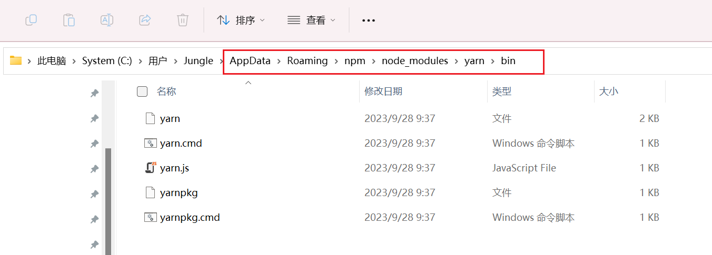
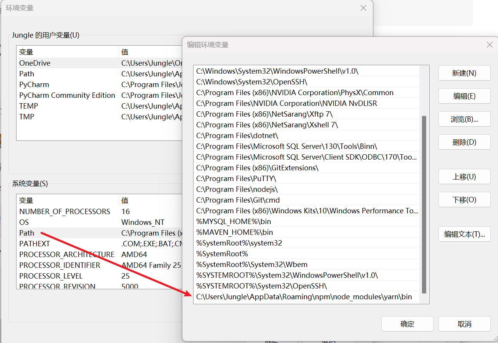
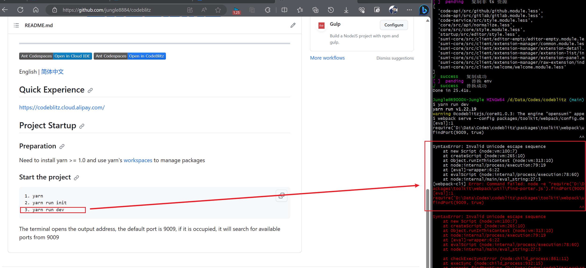
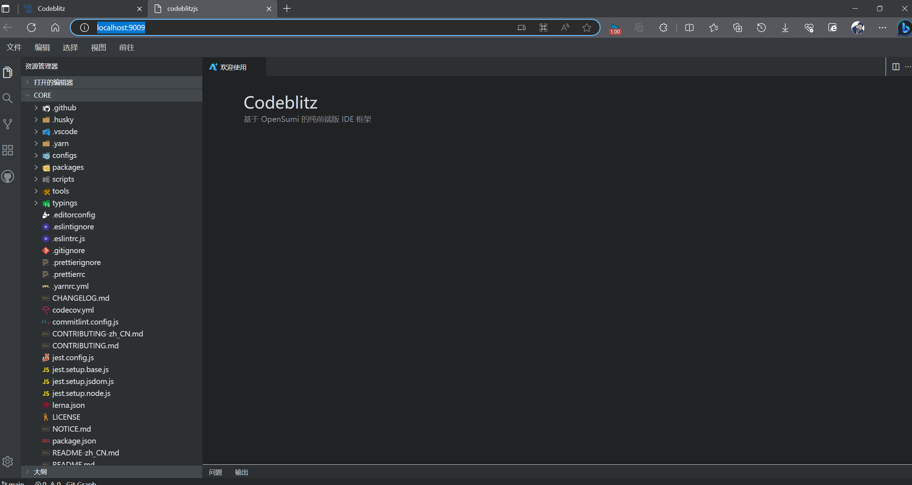

# codeblitz

## 安装 yarn

```linux
npm install -g yarn
```

## 设置环境变量

> 找到 【默认】目录：AppData【需要启用 查看-隐藏的项目】
>
> C:\Users\Jungle\AppData\Roaming\npm\node_modules\yarn\bin



添加到Path变量



## 安装

打开cmd，输入 `yarn -v` 查看安装的版本号，输出版本号则代表成功。

```shell
PS C:\Users\Jungle> yarn -v
1.22.19
```

安装IDE组件:

```shell
yarn add @codeblitzjs/ide-core
```


### 启动项目

```shell
1. yarn
2. yarn run init
3. yarn run dev
```


### 遇到问题

> windows平台下获取文件路径问题导致无法启动。

```html
PS C:\Users\Jungle\Desktop\codeblitz> yarn run dev
yarn run v1.22.19
warning @codeblitzjs/core@1.0.3: The engine "opensumi" appears to be invalid.
$ webpack serve --config packages/toolkit/webpack/config.dev.js
[eval]:1
require('C:\Users\Jungle\Desktop\codeblitz\packages\toolkit\webpack\util\find-porter.js').findPort(9009, true)
                                                                   ^^^^^^

SyntaxError: Invalid Unicode escape sequence
    at new Script (node:vm:100:7)
    at createScript (node:vm:265:10)
    at Object.runInThisContext (node:vm:313:10)
    at node:internal/process/execution:79:19
    at [eval]-wrapper:6:22
    at evalScript (node:internal/process/execution:78:60)
    at node:internal/main/eval_string:27:3
[webpack-cli] Error: Command failed: node -e "require('C:\Users\Jungle\Desktop\codeblitz\packages\toolkit\webpack\util\find-porter.js').findPort(9009, true)"
[eval]:1
require('C:\Users\Jungle\Desktop\codeblitz\packages\toolkit\webpack\util\find-porter.js').findPort(9009, true)
                                                                   ^^^^^^

SyntaxError: Invalid Unicode escape sequence
    at new Script (node:vm:100:7)
    at createScript (node:vm:265:10)
    at Object.runInThisContext (node:vm:313:10)
    at node:internal/process/execution:79:19
    at [eval]-wrapper:6:22
    at evalScript (node:internal/process/execution:78:60)
    at node:internal/main/eval_string:27:3

    at checkExecSyncError (node:child_process:861:11)
    at execSync (node:child_process:932:15)
    at exports.findPortSync (C:\Users\Jungle\Desktop\codeblitz\packages\toolkit\webpack\util\find-porter.js:26:16)
    at module.exports (C:\Users\Jungle\Desktop\codeblitz\packages\toolkit\webpack\config.integration.js:32:16)
    at module.exports (C:\Users\Jungle\Desktop\codeblitz\packages\toolkit\webpack\config.dev.js:12:29)
    at loadConfigByPath (C:\Users\Jungle\Desktop\codeblitz\node_modules\webpack-cli\lib\webpack-cli.js:1439:37)
    at async Promise.all (index 0)
```

### 如何解决

修改 find-porter.js 文件如下：

```javascript
exports.findPortSync = (basePort) => {
  // const port = execSync(`node -e "require('${__filename}').findPort(${basePort}, true)"`, {
  //   encoding: 'utf-8',
  // });
  const port = '9009';
  // if (port === '-1') {
  //   throw new Error('find port error');
  // }
  return Number(port);
};
```

重写启动即可。


重新启动：`yarn run dev`



### 访问：[codeblitzjs](http://localhost:9009/)




