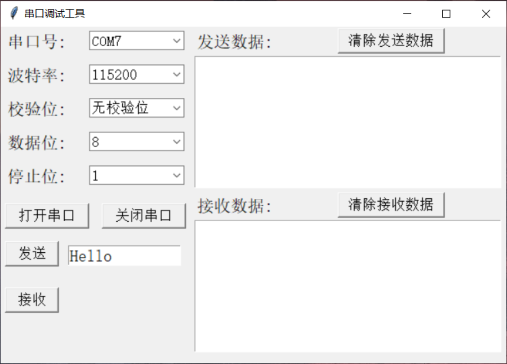

# codeblitz

## 安装 yarn

```linux
npm install -g yarn
```

## 设置环境变量

> 找到 【默认】目录：AppData【需要启用 查看-隐藏的项目】
>
> C:\Users\Jungle\AppData\Roaming\npm\node_modules\yarn\bin


添加到Path变量


## 安装

打开cmd，输入 `yarn -v` 查看安装的版本号，输出版本号则代表成功。

```shell
PS C:\Users\Jungle> yarn -v
1.22.19
```

安装IDE组件:

```shell
yarn add @codeblitzjs/ide-core
```


### 启动项目

```shell
1. yarn
2. yarn run init
3. yarn run dev
```


### 遇到问题

> windows平台下获取文件路径问题导致无法启动。

```html
PS C:\Users\Jungle\Desktop\codeblitz> yarn run dev
yarn run v1.22.19
warning @codeblitzjs/core@1.0.3: The engine "opensumi" appears to be invalid.
$ webpack serve --config packages/toolkit/webpack/config.dev.js
[eval]:1
require('C:\Users\Jungle\Desktop\codeblitz\packages\toolkit\webpack\util\find-porter.js').findPort(9009, true)
                                                                   ^^^^^^

SyntaxError: Invalid Unicode escape sequence
    at new Script (node:vm:100:7)
    at createScript (node:vm:265:10)
    at Object.runInThisContext (node:vm:313:10)
    at node:internal/process/execution:79:19
    at [eval]-wrapper:6:22
    at evalScript (node:internal/process/execution:78:60)
    at node:internal/main/eval_string:27:3
[webpack-cli] Error: Command failed: node -e "require('C:\Users\Jungle\Desktop\codeblitz\packages\toolkit\webpack\util\find-porter.js').findPort(9009, true)"
[eval]:1
require('C:\Users\Jungle\Desktop\codeblitz\packages\toolkit\webpack\util\find-porter.js').findPort(9009, true)
                                                                   ^^^^^^

SyntaxError: Invalid Unicode escape sequence
    at new Script (node:vm:100:7)
    at createScript (node:vm:265:10)
    at Object.runInThisContext (node:vm:313:10)
    at node:internal/process/execution:79:19
    at [eval]-wrapper:6:22
    at evalScript (node:internal/process/execution:78:60)
    at node:internal/main/eval_string:27:3

    at checkExecSyncError (node:child_process:861:11)
    at execSync (node:child_process:932:15)
    at exports.findPortSync (C:\Users\Jungle\Desktop\codeblitz\packages\toolkit\webpack\util\find-porter.js:26:16)
    at module.exports (C:\Users\Jungle\Desktop\codeblitz\packages\toolkit\webpack\config.integration.js:32:16)
    at module.exports (C:\Users\Jungle\Desktop\codeblitz\packages\toolkit\webpack\config.dev.js:12:29)
    at loadConfigByPath (C:\Users\Jungle\Desktop\codeblitz\node_modules\webpack-cli\lib\webpack-cli.js:1439:37)
    at async Promise.all (index 0)
```

### 如何解决

修改 find-porter.js 文件如下：

```javascript
exports.findPortSync = (basePort) => {
  // const port = execSync(`node -e "require('${__filename}').findPort(${basePort}, true)"`, {
  //   encoding: 'utf-8',
  // });
  const port = '9009';
  // if (port === '-1') {
  //   throw new Error('find port error');
  // }
  return Number(port);
};
```

重写启动即可。


重新启动：`yarn run dev`


### 访问：[codeblitzjs](http://localhost:9009/)


## 完成

我的项目地址：[jungle8884/codeblitz: Pure front-end IDE framework based on OpenSumi (github.com)](https://github.com/jungle8884/codeblitz)


---

# 串口工具

> 用python写一个带输入框和接收展示等基础页面的串口工具。
>
> - 两步走：
>   - 先设计界面
>   - 再设计逻辑

​			参考程序：[python实现串口通讯小程序(GUI界面) - SZU_黄其才 - 博客园 (cnblogs.com)](https://www.cnblogs.com/zhicungaoyuan-mingzhi/p/12303229.html)



## 页面设计：

```python
import tkinter
from tkinter import ttk
        
class MainSerial:
    def __init__(self):
        self.win = tkinter.Tk()
        self.win.title("串口调试窗口")
        self.win.geometry("600x400")
        
         # 标签 : 指定的窗口中显示的文本和图像
        self.label1 = tkinter.Label(self.win, text="串口号:", font=("宋体", 15))
        self.label1.place(x=5, y=5)
        self.label2 = tkinter.Label(self.win, text="波特率:", font=("宋体", 15))
        self.label2.place(x=5, y=45)
        self.label3 = tkinter.Label(self.win, text="校验位:", font=("宋体", 15))
        self.label3.place(x=5, y=85)
        self.label4 = tkinter.Label(self.win, text="数据位:", font=("宋体", 15))
        self.label4.place(x=5, y=125)
        self.label5 = tkinter.Label(self.win, text="停止位:", font=("宋体", 15))
        self.label5.place(x=5, y=165)
        
        # 文本显示，清除发送数据
        self.label6 = tkinter.Label(self.win, text="发送数据:", font=("宋体", 15))
        self.label6.place(x=230, y=5)
        self.label7 = tkinter.Label(self.win, text="接收数据:", font=("宋体", 15))
        self.label7.place(x=230, y=200)
        
        # 串口号
        self.com1value = tkinter.StringVar()  # 窗体中自带的文本，创建一个值
        self.combobox_port = ttk.Combobox(self.win, textvariable=self.com1value, width=10, font=("宋体", 13))
        # 输入选定内容
        self.combobox_port["value"] = [""]  # 这里先选定
        self.combobox_port.place(x=105, y=5)  # 显示
        
        # 波特率
        self.bandvalue = tkinter.StringVar()  # 窗体中自带的文本，创建一个值
        self.combobox_band = ttk.Combobox(self.win, textvariable=self.bandvalue, width=10, font=("宋体", 13))
        # 输入选定内容
        self.combobox_band["value"] = ["4800", "9600", "14400", "19200", "38400", "57600", "115200"]  # 这里先选定
        self.combobox_band.current(6)  # 默认选中第0个
        self.combobox_band.place(x=105, y=45)  # 显示
        
        # 校验位
        self.checkvalue = tkinter.StringVar()  # 窗体中自带的文本，创建一个值
        self.combobox_check = ttk.Combobox(self.win, textvariable=self.checkvalue, width=10, font=("宋体", 13))
        # 输入选定内容
        self.combobox_check["value"] = ["无校验位"]  # 这里先选定
        self.combobox_check.current(0)  # 默认选中第0个
        self.combobox_check.place(x=105, y=85)  # 显示
        
        # 数据位
        self.datavalue = tkinter.StringVar()  # 窗体中自带的文本，创建一个值
        self.combobox_data = ttk.Combobox(self.win, textvariable=self.datavalue, width=10, font=("宋体", 13))
        # 输入选定内容
        self.combobox_data["value"] = ["8", "9", "0"]  # 这里先选定
        self.combobox_data.current(0)  # 默认选中第0个
        self.combobox_data.place(x=105, y=125)  # 显示

        # 停止位
        self.stopvalue = tkinter.StringVar()  # 窗体中自带的文本，创建一个值
        self.combobox_stop = ttk.Combobox(self.win, textvariable=self.stopvalue, width=10, font=("宋体", 13))
        # 输入选定内容
        self.combobox_stop["value"] = ["1", "0"]  # 这里先选定
        self.combobox_stop.current(0)  # 默认选中第0个
        self.combobox_stop.place(x=105, y=165)  # 显示
        
        # 打开串口
        self.button_OK = tkinter.Button(self.win, text="打开串口",
                                        command=self.button_OK_click, font=("宋体", 13),
                                        width=10, height=1)
        self.button_OK.place(x=5, y=210)  # 显示控件
        # 关闭串口
        self.button_Cancel = tkinter.Button(self.win, text="关闭串口",  # 显示文本
                                            command=self.button_Cancel_click, font=("宋体", 13),
                                            width=10, height=1)
        self.button_Cancel.place(x=120, y=210)  # 显示控件
        
        
        # 清除发送数据
        self.button_Cancel = tkinter.Button(self.win, text="清除发送数据",  # 显示文本
                                            command=self.button_clcSend_click, font=("宋体", 13),
                                            width=13, height=1)
        self.button_Cancel.place(x=400, y=2)  # 显示控件
        # 清除接收数据
        self.button_Cancel = tkinter.Button(self.win, text="清除接收数据",  # 显示文本
                                            command=self.button_clcRece_click, font=("宋体", 13),
                                            width=13, height=1)
        self.button_Cancel.place(x=400, y=197)  # 显示控件
        
        
        # 发送按键
        self.button_Send = tkinter.Button(self.win, text="发送",  # 显示文本
                                          command=self.button_Send_click, font=("宋体", 13),
                                          width=6, height=1)
        self.button_Send.place(x=5, y=255)  # 显示控件
        # 接收按键
        self.button_Send = tkinter.Button(self.win, text="接收",  # 显示文本
                                          command=self.button_Rece_click, font=("宋体", 13),
                                          width=6, height=1)
        self.button_Send.place(x=5, y=310)  # 显示控件
        
        # 显示框
        # 实现记事本的功能组件
        self.SendDataView = tkinter.Text(self.win, width=40, height=9,
                                         font=("宋体", 13))  # text实际上是一个文本编辑器
        self.SendDataView.place(x=230, y=35)  # 显示

        self.ReceDataView = tkinter.Text(self.win, width=40, height=9,
                                         font=("宋体", 13))  # text实际上是一个文本编辑器
        self.ReceDataView.place(x=230, y=230)  # 显示
        
        # 发送的内容
        test_str = tkinter.StringVar(value="Hello")
        self.entrySend = tkinter.Entry(self.win, width=13, textvariable=test_str, font=("宋体", 15))
        self.entrySend.place(x=80, y=260)  # 显示
        
        
    def button_OK_click(self):
        if self.port == None or self.port.isOpen() == False:
            self.myserial.open_port(self.combobox_port.get())
            print("打开串口成功")
        else:
            pass
        
    def button_Cancel_click(self):
        self.myserial.delete_port()
        print("关闭串口成功")
        
    def button_clcSend_click(self):
        self.SendDataView.delete("1.0", "end")
    
    def button_clcRece_click(self):
        self.ReceDataView.delete("1.0", "end")
    
    def button_Send_click(self):
        try:
            if self.myserial.port.isOpen() == True:
                print("开始发送数据")
                send_str1 = self.entrySend.get()
                self.myserial.Write_data(send_str1)
                self.SendDataView.insert(tkinter.INSERT, send_str1 + " ")
                print("发送数据成功")
            else:
                print("串口没有打开")
        except:
            print("发送失败")
    
    def button_Rece_click(self):
        try:
            readstr = self.myserial.Read_data()
            self.ReceDataView.insert(tkinter.INSERT, readstr + " ")
        except:
            print("读取失败")
        
    def show(self):
        self.win.mainloop()
        
        
if __name__ == '__main__':
    win = MainSerial()
    win.show()
```


