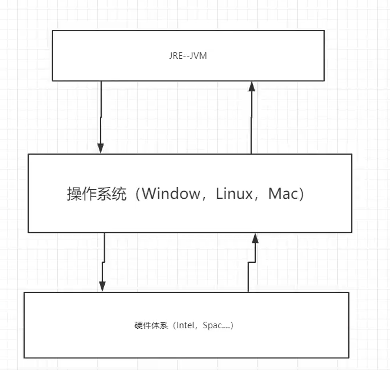
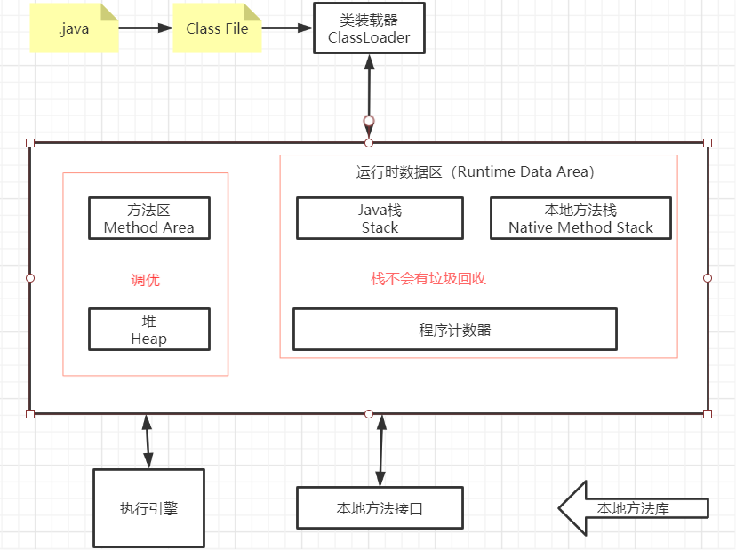
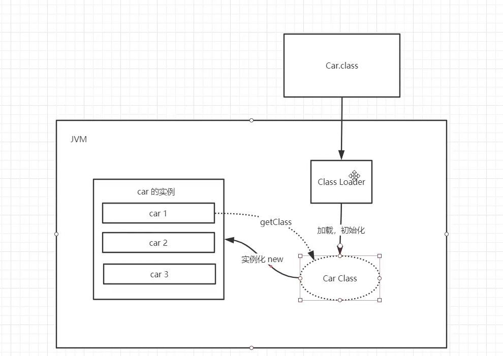
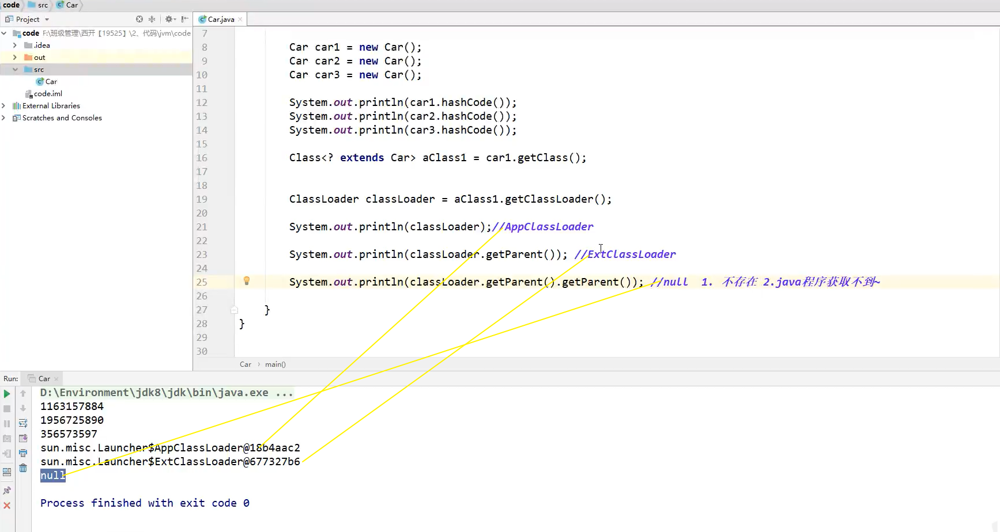
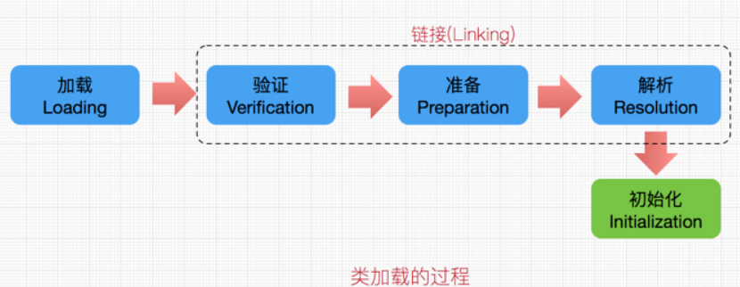
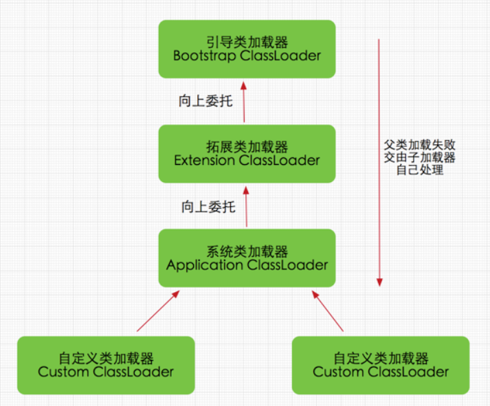

# JVM 探究

- 谈谈你对JVM的理解？java8虚拟机和之前的变化更新？
- 什么是OOM，什么是栈溢出？怎么分析？
- JVM的常用调优参数有哪些？
- 内存快照如何抓取，怎么分析Dump文件？
- 谈谈JVM中，你对类加载器的认识。


## 1、JVM的位置



## 2、JVM的体系结构




## 3、类加载器

> 作用：加载Class文件 




> 测试




> **类加载：**

- 每个编写的 `.java` 拓展名类文件都存储着需要执行的程序逻辑，
- 这些 `.java` 文件经过 `Java编译器` 编译成拓展名为`.class`的文件，
- `.class`文件中保存着 `Java代码` 经转换后的虚拟机指令，
- 当需要使用某个类时，虚拟机 将会加载它的`.class`文件，并创建对应的class对象，
- 将 `class文件` 加载到虚拟机的内存，这个过程称为 `类加载`


> 类加载机制



- 加载：主要是将.class文件中的二进制字节流读入到`JVM`中
  - 1、通过类的全限定名获取该类的二进制字节流
  - 2、将字节流所代表的静态存储结构转化为方法区的运行时数据结构
  - 3、在内存中生成一个该类的`java.lang.Class`对象，作为方法区这个类的各种数据的访问入口
- 连接
  - 验证：确保加载进来的字节流符合`JVM`规范 
    - 1、文件格式验证
    -  2、元数据验证，是否符合`java`语言规范
    - 3、字节码验证，确保程序语义合法，符合逻辑
    - 4、符号引用验证，确保下一步的解析能正常执行 
  - 准备：为静态变量在方法区分配内存，并设置默认初始值
  - 解析：虚拟机将常量池内的符号引用替换为直接引用

- 初始化：标记为常量值的字段赋值的过程，只对static修饰的变量或语句块进行初始化。
  - 什么时候需要初始化：
    - 1、使用`new`该类实例化对象的时候
    - 2、读取或设置类静态字段的时候（但被final修饰的字段，在编译器时就被放入常量池的静态字段除外static final )
    - 3、调用类静态方法的时候
    - 4、使用反射`Class.forName("xxx”)`对类进行反射调用的时候，该类需要初始化
    - 5、初始化一个类的时候 , 有父类, 先初始化父类 (注: 1.接口除外, 父接口在调用的时候才会被初始化; 2子类引用父类静态字段, 只会引发父类初始化)
    - 6、被标明为启动类的类 (即包含main()方法的类) 要初始化
    - 7、当使用`JDK1.7`的动态语言支持时,如果一个`java.invoke.MethodHandle`实例最后的解析结果`REF_getStatic`、`REF_putStatic`、`REF_invokeStatic`的方注句柄，并且这个方法句柄所对应的类没有进行过初始化，则需要先触发其初始化
  - 初始化的顺序：
    - 1、父类的静态变量和静态块赋值(按照声明顺序)
    - 2、自身的静态变量和静态块赋值(按照声明顺序)
    - 3、父类成员变量和块赋值(按照声明顺序)
    - 4、父类构造器赋值：如果父类中包含有参构造器，却没有无参构造器，则在子类构造器中一定要使用`super(参数)`指定调用父类的有参构造器, 不然就会报错。
    - 5、自身成员变量和块赋值(按照声明顺序)
    - 6、自身构造器赋值


> **加载器 ClassLoader：**



1. 启动类（根）加载器 ：`BootStrap ClassLoader`

   - 这个类加载器使用C/C++语言实现，嵌套在JVM内部。用来加载Java核心类库。
   - 并不继承于`java.lang.ClassLoader`没有父加载器。
   - 负责加载扩展类加载器和应用类加载器，并为它们指定父类加载器。
   - 出于安全考虑，启动类加载器只加载器包名为`java`,` javax`, `sun` 等开头的类

2. 扩展类加载器：`Extension ClassLoader`

   - Java语言编写的，由`sun.misc.Launcher$ExtClassLoader`实现，父类加载器为`null`。
   - 上层类加载器为引导类加载器。
   - 它负责加载`JRE`的扩展目录。
   - 从`java.ext.dirs`系统属性所指定的目录中加载类库，或从`JDK`系统安装目录的`jre/lib/ext`子目录（扩展目录）下加载类库。如果用户创建的jar放在此目录下，也会自动由扩展类加载器加载。

3. 应用程序（系统类）加载器： `Application ClassLoader`

   - `Java`语言编写的，由`sun.misc.Launcher$AppClassLoader`实现，父类加载器为`ExtClassLoader`。

   - 上层类加载器为扩展类加载器。

   - 加载我们自己定义的类。

   - 该类加载器是程序中默认的类加载器。


## 4、双亲委派机制

> 只有当父类加载器无法加载哦这个请求时，子加载器才会尝试自己去加载。

1. 类加载器收到类加载的请求
2. 将这个请求向上委托给父类加载器去完成，一直向上委托，直到启动类加载器
3. 启动加载器检查是否能够加载当前这个类，
   - 能加载就结束，使用当前的加载器；
   - 否则，抛出异常，通知子加载器进行加载。
4. 重复步骤 3

**如果都找不到，会报 Class Not Found 异常！**


> 采用双亲委派模式的是好处

- Java类随着它的类加载器一起具备了一种带有优先级的层次关系，通过这种层级关可以避免类的重复加载，
- 当父亲已经加载了该类时，就没有必要子ClassLoader再加载一次。
- 其次是考虑到安全因素，`java`核心`api`中定义类型不会被随意替换，
  - 假设通过网络传递一个名为`java.lang.Integer`的类，
  - 通过双亲委托模式传递到启动类加载器，
  - 而启动类加载器在核心`Java API`发现这个名字的类，发现该类已被加载，
  - 并不会重新加载网络传递的过来的`java.lang.Integer`，
  - 而直接返回已加载过的`Integer.class`，这样便可以防止核心`API`库被随意篡改。

> 可能你会想，如果我们在`classpath`路径下自定义一个名为`java.lang.SingleInterge`类(该类是胡编的)呢？

该类并不存在`java.lang`中，经过双亲委托模式，传递到启动类加载器中，由于父类加载器路径下并没有该类，所以不会加载，将反向委托给子类加载器加载，最终会通过系统类加载器加载该类。

但是这样做是不允许，因为`java.lang`是核心`API`包，**需要访问权限**，强制加载将会报出如下异常：

```java
java.lang.SecurityException: Prohibited package name: java.lang
```

所以无论如何都无法加载成功的。


## 5、沙箱安全机制


## 6、Native

## 7、PC寄存器

## 8、方法区

## 9、栈

## 10、三种JVM

## 11、堆

## 12、新生区、老年区

## 13、永久区

## 14、堆内存调优

## 15、GC

	1. 常用算法

## 16、JMM

## 17、总结