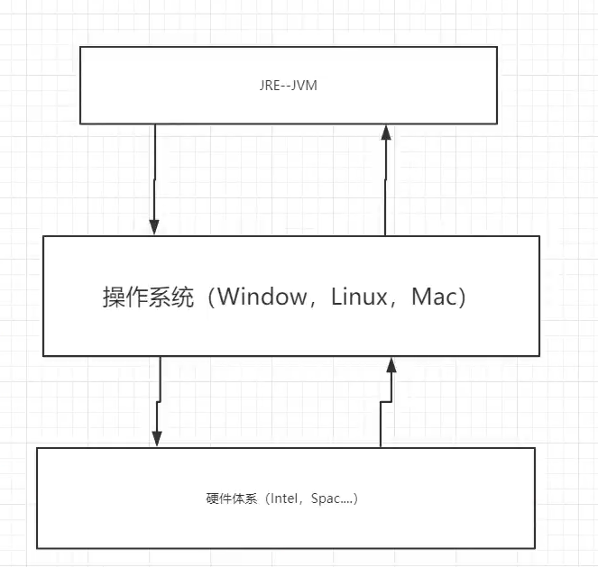
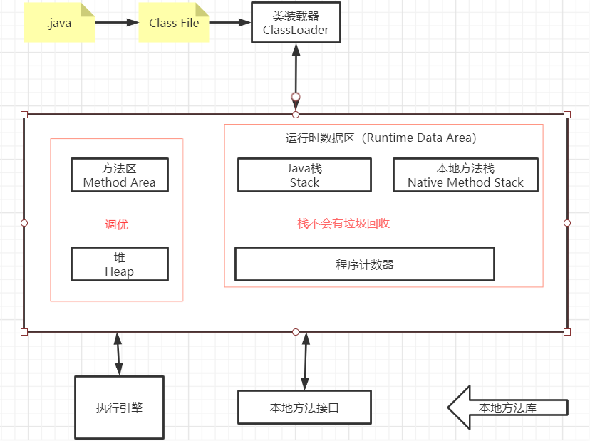
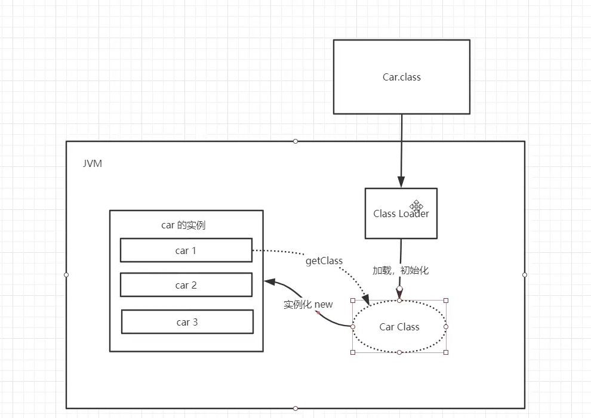
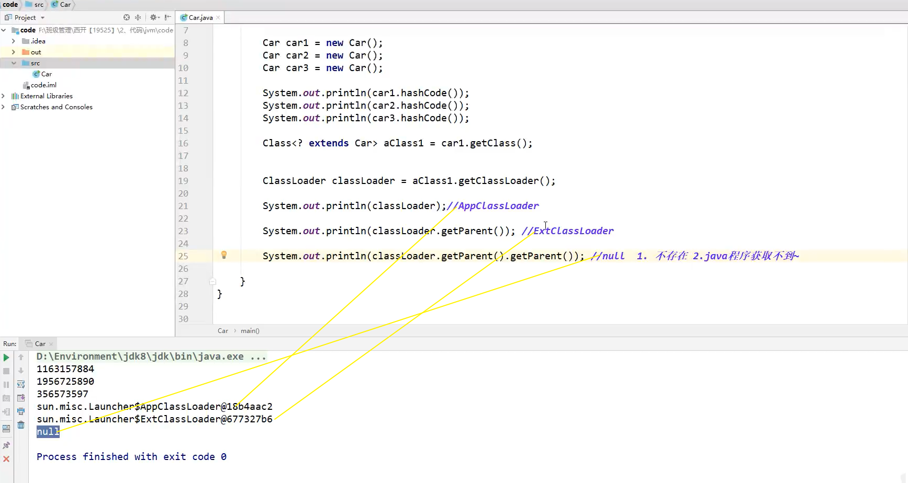
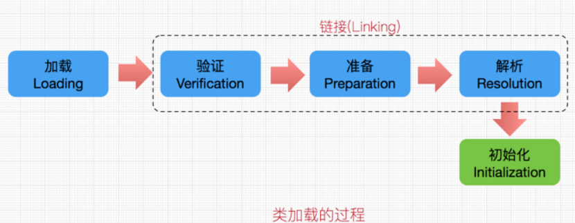
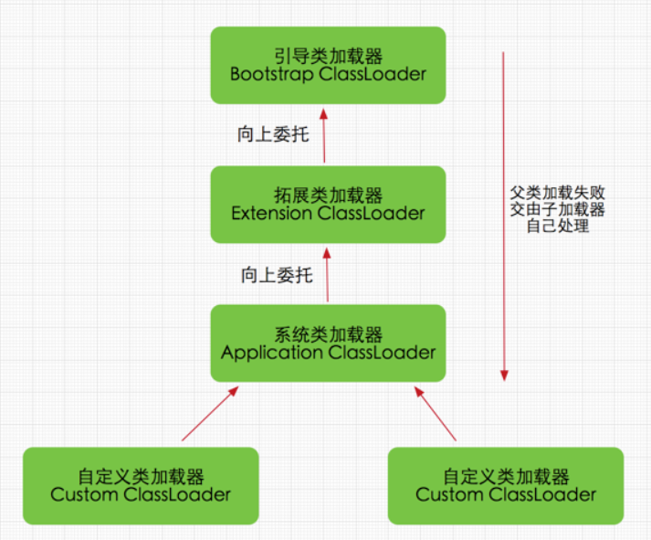
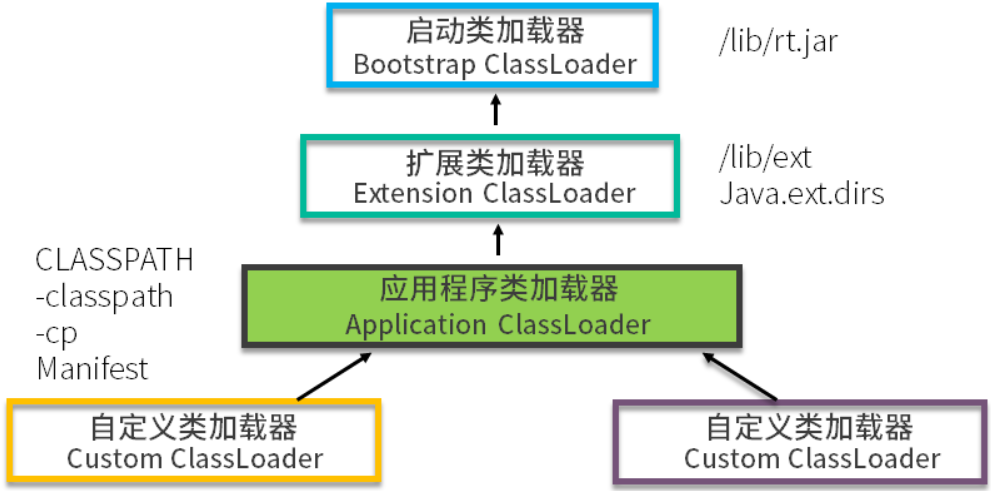
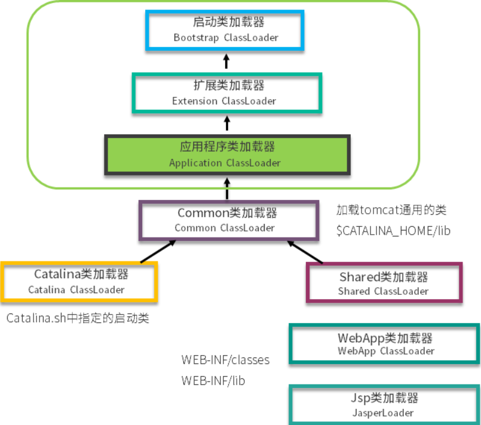
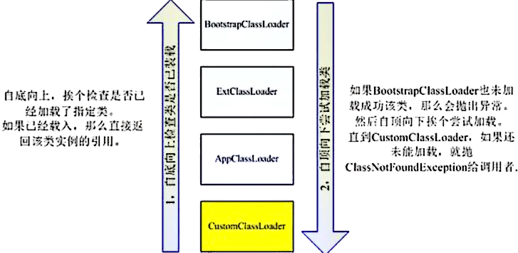
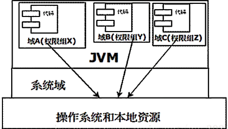

# JVM 探究

- 谈谈你对JVM的理解？java8虚拟机和之前的变化更新？
- 什么是OOM，什么是栈溢出？怎么分析？
- JVM的常用调优参数有哪些？
- 内存快照如何抓取，怎么分析Dump文件？
- 谈谈JVM中，你对类加载器的认识。

## 1、JVM的位置

------

## 2、JVM的体系结构

## 3、类加载器

> 作用：加载Class文件 

> 测试

> **类加载：**

- 每个编写的 `.java` 拓展名类文件都存储着需要执行的程序逻辑，
- 这些 `.java` 文件经过 `Java编译器` 编译成拓展名为`.class`的文件，
- `.class`文件中保存着 `Java代码` 经转换后的虚拟机指令，
- 当需要使用某个类时，虚拟机 将会加载它的`.class`文件，并创建对应的class对象，
- 将 `class文件` 加载到虚拟机的内存，这个过程称为 `类加载`

> 类加载机制

- 加载：主要是将.class文件中的二进制字节流读入到`JVM`中
  - 1、通过类的全限定名获取该类的二进制字节流
  - 2、将字节流所代表的静态存储结构转化为方法区的运行时数据结构
  - 3、在内存中生成一个该类的`java.lang.Class`对象，作为方法区这个类的各种数据的访问入口
- 连接
  - 验证：确保加载进来的字节流符合`JVM`规范 
    - 1、文件格式验证
    -  2、元数据验证，是否符合`java`语言规范
    - 3、字节码验证，确保程序语义合法，符合逻辑
    - 4、符号引用验证，确保下一步的解析能正常执行 
  - 准备：为静态变量在方法区分配内存，并设置默认初始值
  - 解析：虚拟机将常量池内的符号引用替换为直接引用

- 初始化：标记为常量值的字段赋值的过程，只对static修饰的变量或语句块进行初始化。
  - 什么时候需要初始化：
    - 1、使用`new`该类实例化对象的时候
    - 2、读取或设置类静态字段的时候（但被final修饰的字段，在编译器时就被放入常量池的静态字段除外static final )
    - 3、调用类静态方法的时候
    - 4、使用反射`Class.forName("xxx”)`对类进行反射调用的时候，该类需要初始化
    - 5、初始化一个类的时候 , 有父类, 先初始化父类 (注: 1.接口除外, 父接口在调用的时候才会被初始化; 2子类引用父类静态字段, 只会引发父类初始化)
    - 6、被标明为启动类的类 (即包含main()方法的类) 要初始化
    - 7、当使用`JDK1.7`的动态语言支持时,如果一个`java.invoke.MethodHandle`实例最后的解析结果`REF_getStatic`、`REF_putStatic`、`REF_invokeStatic`的方注句柄，并且这个方法句柄所对应的类没有进行过初始化，则需要先触发其初始化
  - 初始化的顺序：
    - 1、父类的静态变量和静态块赋值(按照声明顺序)
    - 2、自身的静态变量和静态块赋值(按照声明顺序)
    - 3、父类成员变量和块赋值(按照声明顺序)
    - 4、父类构造器赋值：如果父类中包含有参构造器，却没有无参构造器，则在子类构造器中一定要使用`super(参数)`指定调用父类的有参构造器, 不然就会报错。
    - 5、自身成员变量和块赋值(按照声明顺序)
    - 6、自身构造器赋值

> **加载器 ClassLoader：**

1. 启动类（根）加载器 ：`BootStrap ClassLoader`

   - 这个类加载器使用C/C++语言实现，嵌套在JVM内部。用来加载Java核心类库。
   - 并不继承于`java.lang.ClassLoader`没有父加载器。
   - 负责加载扩展类加载器和应用类加载器，并为它们指定父类加载器。
   - 出于安全考虑，启动类加载器只加载器包名为`java`,` javax`, `sun` 等开头的类

2. 扩展类加载器：`Extension ClassLoader`

   - Java语言编写的，由`sun.misc.Launcher$ExtClassLoader`实现，父类加载器为`null`。
   - 上层类加载器为引导类加载器。
   - 它负责加载`JRE`的扩展目录。
   - 从`java.ext.dirs`系统属性所指定的目录中加载类库，或从`JDK`系统安装目录的`jre/lib/ext`子目录（扩展目录）下加载类库。如果用户创建的jar放在此目录下，也会自动由扩展类加载器加载。

3. 应用程序（系统类）加载器： `Application ClassLoader`

   - `Java`语言编写的，由`sun.misc.Launcher$AppClassLoader`实现，父类加载器为`ExtClassLoader`。

   - 上层类加载器为扩展类加载器。

   - 加载我们自己定义的类。

   - 该类加载器是程序中默认的类加载器。

------

## 4、双亲委派机制

> 概括一下

- 双亲委派机制保证了JVM的严谨性、安全性
- 双亲委派机制标准有**四层**父子关系classLoader（类加载器）（**并非父子继承关系，而是机制定义的上下层关系**）
- **类加载的验证**：每个类由指定path的classLoader加载，加载前会先判断上层父类classLoader是否已加载相同包名+类名的类，若已加载则直接获取类对象使用，不会再加载；若没加载则继续传递上层判断
- **类加载的执行**：经过验证判断均没加载过该类后，委派最上级classLoader执行加载，若在自己加载范围内无法加载则向下传递
- 打破双亲委派机制：**tomcat、SPI、OSGi**

### 类加载器classLoader

整个类加载过程任务非常繁重，虽然这活儿很累，但总得有人干。类加载器做的就是上面 5 个步骤的事。

如果你在项目代码里，写一个 java.lang 的包，然后改写 String 类的一些行为，编译后，发现并不能生效。JRE 的类当然不能轻易被覆盖，否则会被别有用心的人利用，这就太危险了。

那类加载器是如何保证这个过程的安全性呢？其实，它是有着严格的等级制度的。

### 类加载器的种类

> **Bootstrap ClassLoader**

这是加载器中的大 Boss，任何类的加载行为，都要经它过问。它的作用是加载核心类库，也就是 rt.jar、resources.jar、charsets.jar 等。当然这些 jar 包的路径是可以指定的，-Xbootclasspath 参数可以完成指定操作。

这个加载器是 C++ 编写的，随着 JVM 启动。

> **Extention ClassLoader**

扩展类加载器，主要用于加载 lib/ext 目录下的 jar 包和 .class 文件。同样的，通过系统变量 java.ext.dirs 可以指定这个目录。
 这个加载器是个 Java 类，继承自 URLClassLoader。

> **App ClassLoader**

这是我们写的 Java 类的默认加载器，有时候也叫作 System ClassLoader。一般用来加载 classpath 下的其他所有 jar 包和 .class 文件，我们写的代码，会首先尝试使用这个类加载器进行加载。
 这个加载器是个 Java 类，继承自 URLClassLoader。
 它的父类加载器为Extention ClassLoader

> **Custom ClassLoader**

自定义加载器，支持一些个性化的扩展功能。

> 双亲委派机制：只有当父类加载器无法加载这个请求时，子加载器才会尝试自己去加载。

1. 类加载器收到类加载的请求
2. 将这个请求向上委托给父类加载器去完成，一直向上委托，直到启动类加载器
3. 启动加载器检查是否能够加载当前这个类，
   - 能加载就结束，使用当前的加载器；
   - 否则，抛出异常，通知子加载器进行加载。
4. 重复步骤 3

> 采用双亲委派模式的是好处

- Java类随着它的类加载器一起具备了一种带有优先级的层次关系，通过这种层级关可以避免类的重复加载，
- 当父亲已经加载了该类时，就没有必要子ClassLoader再加载一次。
- 其次是考虑到安全因素，`java`核心`api`中定义类型不会被随意替换，
  - 假设通过网络传递一个名为`java.lang.Integer`的类，
    - 通过双亲委托模式传递到启动类加载器，
    - 而启动类加载器在核心`Java API`发现这个名字的类，发现该类已被加载，
    - 并不会重新加载网络传递的过来的`java.lang.Integer`，
    - 而直接返回已加载过的`Integer.class`，这样便可以防止核心`API`库被随意篡改。
  - 但是如果这个移动代码不是去试图替换一个被信任的类（就是前面说的那种情况），而是想在一个被信任的包中插入一个全新的类型，情况会怎样呢？
    - 比如一个名为 java.lang.Virus的类，经过双亲委托模式，最终类装载器试图从网络上下载这个类，
    - 因为网络类装载器的双亲们都没有这个类（当然没有了，因为是病毒嘛）。
    - 假设成功下载了这个类，那你肯定会想，Virus和lang下的其他类都在java.lang包下，暗示这个类是Java API的一部分，那么是不是也拥有修改Java.lang包中数据的权限呢？
      - 答案当然不是，因为要取得访问和修改java.lang包中的权限，
      - java.lang.Virus和java.lang下其他类必须是属于**同一个运行时包**的，
    - 什么是运行时包？
      - **运行时包是指由同一个类装载器装载的、**
      - **属于同一个包的、多个类型的集合**。
    - 考虑一下，java.lang.Virus和java.lang其他类是同一个类装载器装载的吗？
      - 不是的！
      - java.lang.Virus是由网络类装载器装载的！

### 打破双亲委派机制（自定义加载器）

下面我们就来聊一聊可以打破双亲委派机制的一些案例。

为了支持一些自定义加载类多功能的需求，Java 设计者其实已经作出了一些妥协。

>  案例：tomcat

tomcat 通过 war 包进行应用的发布，它其实是违反了双亲委派机制原则的。

**简单看一下 tomcat 类加载器的层次结构：**

- 对于一些需要加载的非基础类，会由一个叫作 **WebAppClassLoader** 的类加载器优先加载。
- 等它加载不到的时候，再交给上层的 ClassLoader 进行加载。
- 这个加载器用来隔绝不同应用的 .class 文件，
  - 比如你的两个应用，可能会依赖同一个第三方的不同版本，
  - 它们是相互没有影响的。

**如何在同一个 JVM 里，运行着不兼容的两个版本，当然是需要自定义加载器才能完成的事。**

> 那么 tomcat 是怎么打破双亲委派机制的呢？

- 可以看图中的 WebAppClassLoader，它加载自己目录下的 .class 文件，并不会传递给父类的加载器。
- 但是，它却可以使用 SharedClassLoader 所加载的类，实现了共享和分离的功能。

- 但是你自己写一个 ArrayList，放在应用目录里，tomcat 依然不会加载。

- 它只是自定义的加载器顺序不同，但对于顶层来说，还是一样的。（也就是仍会自上而下检查是否有相同类已经加载）

------

## 5、沙箱安全机制

> 概括一下：

- 双亲委派机制-保证JVM不被加载的代码破坏
- 安全权限机制-保证机器资源不被JVM里运行的程序破坏

> 什么是沙箱？

- Java安全模型的核心就是Java沙箱（sandbox），什么是沙箱？
- 沙箱是一个限制程序运行的环境。
- 沙箱机制就是**将 Java 代码限定在虚拟机(JVM)特定的运行范围中，并且严格限制代码对本地系统资源访问**，通过这样的措施来保证**对代码的有效隔离**，**防止对本地系统造成破坏**

### 组成Java沙箱的基本组件

- 类加载体系结构(类的双亲委托机制)
- class文件检验器
- 内置于Java虚拟机（及语言）的安全特性
- 安全管理器及Java API

Java安全模型的前三个部分——类加载体系结构、class文件检验器、Java虚拟机（及语言）的安全特性一起达到一个共同的目的：**保持Java虚拟机的实例和它正在运行的应用程序的内部完整性，使得它们不被下载的恶意代码或有漏洞的代码侵犯。**

相反，这个安全模型的第四个组成部分是安全管理器，它主要用于**保护虚拟机的外部资源不被虚拟机内运行的恶意或有漏洞的代码侵犯**。这个安全管理器是一个单独的对象，在运行的Java虚拟机中，它在对于外部资源的访问控制起中枢作用。

### 类加载体系结构

类加载器要加载一个类，它首先检查此类是否已被加载，然后再委托双亲加载器加载此类，它的双亲加载器再委托它的双亲，这样一直委托到启动加载器，启动加载 器在从核心API查找此类，如果有就返回此类，否则就他的子加载器就查找此类，如果都没有就抛出ClassNotFound的异常。

如图：

上述其实为**双亲委派机制**

### class文件校验器

> 通过四趟扫描，保证了class文件正确 ：

1. **检查class文件的结构是否正确。**
   - 比较典型的就是检查class文件是否以 OxCAFEBABE 开头（CA FE BA BE）。
   - 通过这趟检查，可以过滤掉大部分可能损坏的，或者压根就不是class的文件，来冒充装载。

2. **检查它是否符合java语言特性里的编译规则。**
   - 比如发现一个类的超类不是Object，就抛出异常。

3. **检查字节码是否能被JVM安全的执行，而不会导致JVM崩溃。**

4. **符号引用验证。**
   - 一个类文件，它会包含它引用的其他类的全名和描述符，并跟他们建立符号引用（一种虚拟的，非物理连接的方式）。
   - 当程序第一次执行到需要符号引用的位置时，jvm会检查这个符号链接的正确性，然后建立真正的物理引用(直接引用)。

### 内置于Java虚拟机（及语言）的安全特性

> 基础的java语言特性，降低了java程序出现内存混乱，崩溃的几率。

- 结构化内存访问（不使用指针，一定程度上让黑客无法篡改内存数据）
- 自动垃圾收集
- 数组边界检查
- 空引用检查
- 数据类型安全

### JVM安全模型

当前最新的安全机制实现，则引入了**域 (Domain)**的概念。

虚拟机会把所有代码加载到不同的系统域和应用域，

**系统域**部分专门负责与关键资源进行交互，

而各个**应用域**部分则通过系统域的部分代理来对各种需要的资源进行访问。

虚拟机中不同的受**保护域 (Protected Domain)**，对应不一样的权限 (Permission)。

存在于不同域中的类文件就具有了当前域的全部权限，

如下图所示 最新的安全模型 (jdk 1.6)：

以上为基本的**Java 安全模型概念**，在应用开发中还有一些**关于安全的复杂用法**，其中最常用到的 API 就是 doPrivileged。**doPrivileged 方法能够使一段受信任代码获得更大的权限，甚至比调用它的应用程序还要多，可做到临时访问更多的资源**。有时候这是非常必要的，可以应付一些特殊的应用场景。例如，应用程序可能无法直接访问某些系统资源，但这样的应用程序必须得到这些资源才能够完成功能。

------

## 6、Native

## 7、PC寄存器

## 8、方法区

## 9、栈

## 10、三种JVM

## 11、堆

## 12、新生区、老年区

## 13、永久区

## 14、堆内存调优

## 15、GC

	1. 常用算法

## 16、JMM

------

## 参考连接

- [双亲委派机制](https://www.jianshu.com/p/d94ed8cc2678)

- [沙箱安全机制](https://www.jianshu.com/p/46b179834360)

  

