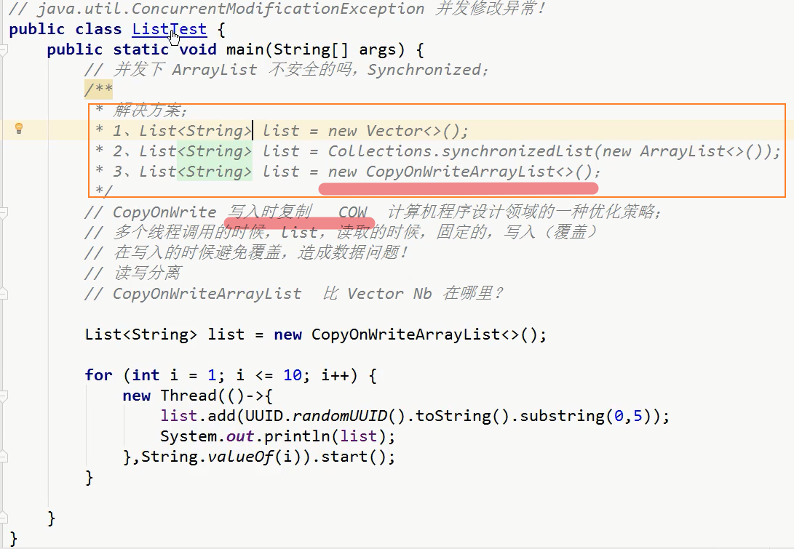

# Thread


## 火车票多线程抢票

### 1. 初始构思

> 思路：
>
> - 用`static`修饰`ticketNum`，使其唯一；
> - 并设置`volatile`，保证变量在多个线程之间的可见性。

```java
package com.Jungle;

/*
* 遇到问题：
* 1. 如何解决用户同时抢一张票的问题？
* */
public class myThread implements Runnable {

    // 有多少张火车票
    private volatile static int ticketNum = 10;

    @Override
    public void run() {
        while (true) {
            if (ticketNum <= 0) return;
            try {
                Thread.sleep(1);
            } catch (InterruptedException e) {
                e.printStackTrace();
            }
            System.out.println(Thread.currentThread() +
                    " 拿到了第" + ticketNum-- + "张票!");
        }
    }

    public static void main(String[] args) {
        myThread t1 = new myThread();
        myThread t2 = new myThread();
        myThread t3 = new myThread();

        new Thread(t1, "小明").start();
        new Thread(t2, "老师").start();
        new Thread(t3, "黄牛党").start();
    }

}
```

> 失败了！

```java
// 输出
Thread[小明,5,main] 拿到了第10张票!
Thread[老师,5,main] 拿到了第8张票!
Thread[黄牛党,5,main] 拿到了第9张票!
Thread[黄牛党,5,main] 拿到了第7张票!
Thread[小明,5,main] 拿到了第5张票!
Thread[老师,5,main] 拿到了第6张票!
Thread[黄牛党,5,main] 拿到了第4张票!
Thread[老师,5,main] 拿到了第2张票!
Thread[小明,5,main] 拿到了第3张票!
Thread[黄牛党,5,main] 拿到了第1张票!
Thread[小明,5,main] 拿到了第-1张票!
Thread[老师,5,main] 拿到了第0张票!

Process finished with exit code 0
```

---

### 2. 使用外部停止方式

> 思想：`flag == false `时停止!

```java
// 改名 myThread --> BuyTicket, 放在新建的UnsafeBuyTicket类里

package com.Jungle;

public class UnsafeBuyTicket {
    public static void main(String[] args) {
        //在同一个车站窗口买票
        BuyTicket station = new BuyTicket();

        new Thread(station, "小明").start();
        new Thread(station, "老师").start();
        new Thread(station, "黄牛党").start();
    }


}

class BuyTicket implements Runnable {

    // 有多少张火车票
    private volatile static int ticketNum = 10;

    boolean flag = true; // 外部停止方式

    private void buy() throws InterruptedException {
        // 判断是否有票(无票立即结束)
        if (ticketNum <= 0) {
            flag = false;
            return;
        }
        // 模拟延时
        Thread.sleep(100);
        // 买票
        System.out.println(Thread.currentThread() + " 拿到了第" + ticketNum-- + "张票!");
    }

    // 买票
    @Override
    public void run() {
        // 买票
        while (flag) {
            try {
                buy();
            } catch (InterruptedException e) {
                e.printStackTrace();
            }
        }
    }
}
```

> 输出: 出现负数线程不安全!

```java
Thread[老师,5,main] 拿到了第10张票!
Thread[小明,5,main] 拿到了第9张票!
Thread[黄牛党,5,main] 拿到了第8张票!
Thread[小明,5,main] 拿到了第7张票!
Thread[老师,5,main] 拿到了第6张票!
Thread[黄牛党,5,main] 拿到了第5张票!
Thread[小明,5,main] 拿到了第4张票!
Thread[老师,5,main] 拿到了第3张票!
Thread[黄牛党,5,main] 拿到了第2张票!
Thread[小明,5,main] 拿到了第1张票!
Thread[老师,5,main] 拿到了第-1张票!
Thread[黄牛党,5,main] 拿到了第0张票!

Process finished with exit code 0
```

> 为什么出现会出现负数?
>
> **每个线程在自己的工作内存交互,内存控制不当会造成数据不一致.**
>
> 同时看到最后一张票, 判断通过(此时票数为1), 其中一人取票后变为负数, 其余人输出负数. 
>
> 线程不安全的集合: 
>
> - ArrayList
> - LinkedList
> - HashMap

###  3. 怎么解决线程不安全?

> synchronize: 底层原理是同步+锁
>
> 案例分析:
>
> - 对于火车票抢票, 多个人在同一个窗口进行, 可以直接在buy()方法里加`synchronized`关键字, 会对本类对象(`BuyTicket station = new BuyTicket();`)进行锁定和排队.
> - 银行家案例, 见下分析


```java
package com.Jungle;

public class UnsafeBuyTicket {
    public static void main(String[] args) {
        //在同一个车站窗口买票
        BuyTicket station = new BuyTicket();

        new Thread(station, "小明").start();
        new Thread(station, "老师").start();
        new Thread(station, "黄牛党").start();
    }


}

class BuyTicket implements Runnable {

    // 有多少张火车票
    private volatile static int ticketNum = 10;

    boolean flag = true; // 外部停止方式

    // 同步方法
    private synchronized void buy() throws InterruptedException {
        // 判断是否有票(无票立即结束)
        if (ticketNum <= 0) {
            flag = false;
            return;
        }
        // 模拟延时
        Thread.sleep(100);
        // 买票
        System.out.println(Thread.currentThread() + " 拿到了第" + ticketNum-- + "张票!");
    }

    // 买票
    @Override
    public void run() {
        // 买票
        while (flag) {
            try {
                buy();
            } catch (InterruptedException e) {
                e.printStackTrace();
            }
        }
    }
}

```

输出:

```java
Thread[小明,5,main] 拿到了第10张票!
Thread[小明,5,main] 拿到了第9张票!
Thread[黄牛党,5,main] 拿到了第8张票!
Thread[老师,5,main] 拿到了第7张票!
Thread[老师,5,main] 拿到了第6张票!
Thread[黄牛党,5,main] 拿到了第5张票!
Thread[黄牛党,5,main] 拿到了第4张票!
Thread[黄牛党,5,main] 拿到了第3张票!
Thread[黄牛党,5,main] 拿到了第2张票!
Thread[小明,5,main] 拿到了第1张票!

Process finished with exit code 0
```

> 若不是本类对象的同步,则需要使用共享资源作为同步监视器
>
> 案例分析:
>
> - 对于双方对同一账户取钱来说, 启动线程的是双方, 共两个线程, 共享资源是银行账户, 所以需要用到同步代码块, 即锁定银行账户.


```java
package com.Jungle;

import java.nio.charset.StandardCharsets;

public class UnsafeBank {
    public static void main(String[] args) {
        Account account = new Account(100, "结婚基金");

        UserDrawing you = new UserDrawing(account, 50, "你");
        UserDrawing yourGF = new UserDrawing(account, 100, "你的女朋友");

        you.start();
        yourGF.start();
    }
}

// 银行账户
class Account {
    int balance; // 余额
    String cardName; // 卡名
    public Account(int balance, String cardName) {
        this.balance = balance;
        this.cardName = cardName;
    }
}

// 用户取钱
class UserDrawing extends Thread {
    Account account; // 账户
    int drawingCount; // 取多少钱(单位:万)
    int cash; // 取钱后的手里的钱

    public UserDrawing(Account account, int drawingCount, String userName) {
        super(userName);
        this.account = account;
        this.drawingCount = drawingCount;
    }

    // 取钱
    @Override
    public void run() {
        // 锁账户
        synchronized (account) {
            if (account.balance < drawingCount) {
                System.out.println(account.cardName + "余额不足!");
                return;
            }
            try {
                Thread.sleep(1000);
            } catch (InterruptedException e) {
                e.printStackTrace();
            }
            account.balance -= drawingCount; // 账户里的钱减少
            cash += drawingCount; // 手里的钱增多

            System.out.println(new StringBuilder().
                    append(account.cardName).append("余额为: ").append(account.balance));
            System.out.println(new StringBuilder().
                    append(this.getName()).append("手里的钱: ").append(cash));
        }
    }
}
```

> 输出: 

```java
结婚基金余额为: 50
你手里的钱: 50
结婚基金余额不足!

Process finished with exit code 0
```

> 案例3: 不安全的集合

```java
package com.Jungle;

import java.util.ArrayList;
import java.util.List;

// 线程不安全的集合
public class UnsafeList {

    public static void main(String[] args) {
        List<String> list = new ArrayList<String>();

        for (int i = 0; i < 10000; i++) {
            new Thread(()->{
                synchronized (list) {
                    list.add(Thread.currentThread().getName());
                }
            }).start();
        }

        try {
            Thread.sleep(1000);
        } catch (InterruptedException e) {
            e.printStackTrace();
        }

        System.out.println(list.size());
    }
}

```

> 输出:

```Java
10000

Process finished with exit code 0
```

---

## [CopyOnWriteArrayList](https://zhuanlan.zhihu.com/p/43993780) 

> Copy On Write 也是一种重要的思想，在**写少读多**的场景下，为了保证集合的线程安全性，我们完全可以在当前线程中得到原始数据的一份拷贝，然后进行操作。JDK集合框架中为我们提供了 ArrayList 的这样一个实现：CopyOnWriteArrayList。但是如果不是写少读多的场景，使用 CopyOnWriteArrayList 开销比较大，因为每次对其更新操作（add/set/remove）都会做一次数组拷贝。

```java
package com.Jungle;

import java.util.ArrayList;
import java.util.List;
import java.util.concurrent.CopyOnWriteArrayList;

public class JUCTest {
    public static void main(String[] args) {
        List<String> list = new CopyOnWriteArrayList<String>();

        for (int i = 0; i < 10000; i++) {
            new Thread(()->{
                list.add(Thread.currentThread().getName());
            }).start();
        }

        try {
            Thread.sleep(1000);
        } catch (InterruptedException e) {
            e.printStackTrace();
        }

        System.out.println(list.size());
    }
}
```

> **涉及到的源码**
>
> 上文对应的思路应该是: 先复制一份数据, 然后add, 最后再新的数组引用赋值回去.
>
> 适合: **写少读多**

```java
public CopyOnWriteArrayList() {
    setArray(new Object[0]);
}
final void setArray(Object[] a) {
    array = a;
}

final transient ReentrantLock lock = new ReentrantLock();

/** The array, accessed only via getArray/setArray. */
private transient volatile Object[] array;

final Object[] getArray() {
    return array;
}

public boolean add(E e) {
    final ReentrantLock lock = this.lock;
    lock.lock();
    try {
        Object[] elements = getArray();
        int len = elements.length;
        Object[] newElements = Arrays.copyOf(elements, len + 1);
        newElements[len] = e;
        setArray(newElements);
        return true;
    } finally {
        lock.unlock();
    }
}

// ReentrantLock:
public void lock() {
    sync.lock();
}

private final Sync sync;

public void unlock() {
    sync.release(1);
}
```


## [Collections.synchronizedList()](https://zhuanlan.zhihu.com/p/43993780)

```java
package com.Jungle;

import java.util.ArrayList;
import java.util.Collections;
import java.util.List;
import java.util.concurrent.CopyOnWriteArrayList;

public class JUCTest {
    public static void main(String[] args) {
//        List<String> list = new CopyOnWriteArrayList<String>();
        List<String> list = Collections.synchronizedList(new ArrayList<String>());

        for (int i = 0; i < 10000; i++) {
            new Thread(()->{
                list.add(Thread.currentThread().getName());
            }).start();
        }

        try {
            Thread.sleep(1000);
        } catch (InterruptedException e) {
            e.printStackTrace();
        }

        System.out.println(list.size());
    }
}

```

> 输出:

```java
10000

Process finished with exit code 0
```

> 涉及到的源码

```java
public static <T> List<T> synchronizedList(List<T> list) {
    return (list instanceof RandomAccess ?
            new SynchronizedRandomAccessList<>(list) :
            new SynchronizedList<>(list));
}

static class SynchronizedRandomAccessList<E>
    extends SynchronizedList<E>
    implements RandomAccess {

    SynchronizedRandomAccessList(List<E> list) {
        super(list);
    }
}

static class SynchronizedList<E>
    extends SynchronizedCollection<E>
    implements List<E> {
    private static final long serialVersionUID = -7754090372962971524L;

    final List<E> list;

    SynchronizedList(List<E> list) {
        super(list);
        this.list = list;
    }
}

static class SynchronizedCollection<E> implements Collection<E>, Serializable {
    private static final long serialVersionUID = 3053995032091335093L;

    final Collection<E> c;  // Backing Collection
    final Object mutex;     // Object on which to synchronize     ---> 加锁的对象            

    SynchronizedCollection(Collection<E> c) {
        this.c = Objects.requireNonNull(c);
        mutex = this;
    }

    SynchronizedCollection(Collection<E> c, Object mutex) {
        this.c = Objects.requireNonNull(c);
        this.mutex = Objects.requireNonNull(mutex);
    }

    public boolean add(E e) {
        synchronized (mutex) {return c.add(e);}
    }
    
    public boolean remove(Object o) {
        synchronized (mutex) {return c.remove(o);}
    }
}
```

## [ThreadPoolExecutor](https://snailclimb.gitee.io/javaguide/#/docs/java/multi-thread/2020%E6%9C%80%E6%96%B0Java%E5%B9%B6%E5%8F%91%E8%BF%9B%E9%98%B6%E5%B8%B8%E8%A7%81%E9%9D%A2%E8%AF%95%E9%A2%98%E6%80%BB%E7%BB%93?id=_45-threadpoolexecutor-%e7%b1%bb%e5%88%86%e6%9e%90)

> 最终采用线程池方式实现!
>
> **使用阿里巴巴推荐的创建线程池的方式**

```java
package com.Jungle;

import java.util.ArrayList;
import java.util.Collections;
import java.util.List;
import java.util.concurrent.ArrayBlockingQueue;
import java.util.concurrent.CopyOnWriteArrayList;
import java.util.concurrent.ThreadPoolExecutor;
import java.util.concurrent.TimeUnit;

public class JUCTest {

    private static final int CORE_POOL_SIZE = 5;
    private static final int MAX_POOL_SIZE = 10;
    private static final int QUEUE_CAPACITY = 100;
    private static final Long KEEP_ALIVE_TIME = 1L;

    public static void main(String[] args) {
//        List<String> list = new CopyOnWriteArrayList<String>();
        List<String> list = Collections.synchronizedList(new ArrayList<String>());

        //使用阿里巴巴推荐的创建线程池的方式
        //通过ThreadPoolExecutor构造函数自定义参数创建
        ThreadPoolExecutor executor = new ThreadPoolExecutor(
                CORE_POOL_SIZE,         // 核心线程数为 5
                MAX_POOL_SIZE,          // 最大线程数 10
                KEEP_ALIVE_TIME,        // 大于核心线程数时,核心线程外的线程等待时间: 1L
                TimeUnit.SECONDS,       // 等待时间的单位为 TimeUnit.SECONDS
                new ArrayBlockingQueue<>(QUEUE_CAPACITY),   // workQueue: 任务队列为 ArrayBlockingQueue，并且容量为 100
                new ThreadPoolExecutor.CallerRunsPolicy()); // handler: 饱和策略为 CallerRunsPolicy

        for (int i = 0; i < 10000; i++) {
            Runnable worker = ()->{
                list.add(Thread.currentThread().getName());
            };
            //执行Runnable
            executor.execute(worker);
        }
        //终止线程池
        executor.shutdown();
        while (!executor.isTerminated()) {
        }
        System.out.println("Finished all threads");
        System.out.println(list.size());
    }
}
```

> 输出

```java
Finished all threads
10000

Process finished with exit code 0
```


---

# 生产者和消费者问题

## 管程法


```java
package com.Jungle;

public class Producer_Consumer {
    public static void main(String[] args) {
        // 管程法
        Container container = new Container();
        new Thread(new Producer(container)).start();
        new Thread(new Consumer(container)).start();
    }
}

// 管程法
// 产品 --- 炸鸡
class Chicken {
    int id;
    public Chicken(int id) {
        this.id = id;
    }
}

// 缓冲区
class Container {

    Chicken[] chickens = new Chicken[10];
    int count = 0;

    // 生产者---放入产品
    public synchronized  void push(Chicken chicken) {
        // 如果容器满了, 就需要生产者等待消费者消费
        if (count == chickens.length) {
            try {
                this.wait(); // 生产者等待
            } catch (InterruptedException e) {
                e.printStackTrace();
            }
        }
        // 如果没有满, 就需要丢入产品
        chickens[count++] = chicken;

        // 生产了炸鸡就可以通知消费者消费了
        this.notifyAll();
    }

    // 消费者---拿走产品
    public synchronized Chicken pop() {
        // 判断能否消费
        if (count == 0) {
            try {
                this.wait(); // 消费者等待
            } catch (InterruptedException e) {
                e.printStackTrace();
            }
        }

        // 如果可以消费
        Chicken chicken = chickens[--count];

        // 吃了炸鸡, 就通知生产者生产
        this.notifyAll();

        return chicken;
    }

}

// 生产者
class Producer implements Runnable {

    Container container;

    public Producer(Container container) {
        this.container = container;
    }

    // 生产
    @Override
    public void run() {
        for (int i = 1; i <= 100; i++) {
            container.push(new Chicken(i));
            System.out.println("生产第" + i + "只炸鸡");
        }
    }
}

// 消费者
class Consumer implements Runnable {

    Container container;

    public Consumer(Container container) {
        this.container = container;
    }

    // 消费
    @Override
    public void run() {
        for (int i = 1; i <= 100; i++) {
            System.out.println("消费了第" + container.pop().id + "只炸鸡");
        }
    }
}
```

> **输出:**
>
> 个人理解: 
>
> 生产者开始生产炸鸡,  初始 `count == 0` , 所以`生产者生产, 消费者等待`; 
>
> - 当容器内有炸鸡时, 此时 `count != 0` , 通知 `消费者消费`
> - 当容器已满时, 此时 `count == chickens.length` , `消费者消费, 生产者等待`
> - 若消费者吃完了炸鸡, 此时 `count == 0` , 所以 `消费者等待, 生产者生产`
>
> 由于是并发执行, 针对`container`同步, 所以生产和消费不一定是交替执行!

```java
生产第1只炸鸡
生产第2只炸鸡
生产第3只炸鸡
生产第4只炸鸡
生产第5只炸鸡
生产第6只炸鸡
生产第7只炸鸡
生产第8只炸鸡
生产第9只炸鸡
生产第10只炸鸡
生产第11只炸鸡
消费了第10只炸鸡
生产第12只炸鸡
消费了第11只炸鸡
生产第13只炸鸡
消费了第12只炸鸡
生产第14只炸鸡
消费了第13只炸鸡
生产第15只炸鸡
消费了第14只炸鸡
生产第16只炸鸡
消费了第15只炸鸡
消费了第16只炸鸡
消费了第17只炸鸡
生产第17只炸鸡
消费了第9只炸鸡
生产第18只炸鸡
消费了第18只炸鸡
生产第19只炸鸡
消费了第19只炸鸡
消费了第20只炸鸡
消费了第8只炸鸡
消费了第7只炸鸡
消费了第6只炸鸡
消费了第5只炸鸡
生产第20只炸鸡
消费了第4只炸鸡
生产第21只炸鸡
消费了第21只炸鸡
生产第22只炸鸡
生产第23只炸鸡
生产第24只炸鸡
消费了第22只炸鸡
消费了第25只炸鸡
生产第25只炸鸡
消费了第24只炸鸡
消费了第26只炸鸡
消费了第23只炸鸡
消费了第3只炸鸡
消费了第2只炸鸡
消费了第1只炸鸡
生产第26只炸鸡
生产第27只炸鸡
生产第28只炸鸡
生产第29只炸鸡
生产第30只炸鸡
生产第31只炸鸡
生产第32只炸鸡
生产第33只炸鸡
生产第34只炸鸡
生产第35只炸鸡
生产第36只炸鸡
生产第37只炸鸡
消费了第27只炸鸡
消费了第37只炸鸡
生产第38只炸鸡
消费了第38只炸鸡
生产第39只炸鸡
消费了第39只炸鸡
生产第40只炸鸡
消费了第40只炸鸡
生产第41只炸鸡
消费了第41只炸鸡
消费了第42只炸鸡
消费了第36只炸鸡
消费了第35只炸鸡
消费了第34只炸鸡
消费了第33只炸鸡
消费了第32只炸鸡
消费了第31只炸鸡
消费了第30只炸鸡
消费了第29只炸鸡
消费了第28只炸鸡
生产第42只炸鸡
生产第43只炸鸡
生产第44只炸鸡
生产第45只炸鸡
生产第46只炸鸡
生产第47只炸鸡
生产第48只炸鸡
生产第49只炸鸡
生产第50只炸鸡
生产第51只炸鸡
生产第52只炸鸡
生产第53只炸鸡
消费了第43只炸鸡
消费了第53只炸鸡
消费了第52只炸鸡
消费了第51只炸鸡
消费了第50只炸鸡
消费了第49只炸鸡
消费了第48只炸鸡
消费了第47只炸鸡
消费了第46只炸鸡
消费了第45只炸鸡
消费了第44只炸鸡
生产第54只炸鸡
生产第55只炸鸡
生产第56只炸鸡
生产第57只炸鸡
生产第58只炸鸡
生产第59只炸鸡
生产第60只炸鸡
生产第61只炸鸡
生产第62只炸鸡
生产第63只炸鸡
消费了第63只炸鸡
消费了第62只炸鸡
生产第64只炸鸡
消费了第64只炸鸡
生产第65只炸鸡
消费了第65只炸鸡
消费了第66只炸鸡
消费了第61只炸鸡
消费了第60只炸鸡
消费了第59只炸鸡
消费了第58只炸鸡
消费了第57只炸鸡
消费了第56只炸鸡
消费了第55只炸鸡
消费了第54只炸鸡
生产第66只炸鸡
生产第67只炸鸡
生产第68只炸鸡
生产第69只炸鸡
生产第70只炸鸡
生产第71只炸鸡
生产第72只炸鸡
生产第73只炸鸡
生产第74只炸鸡
生产第75只炸鸡
生产第76只炸鸡
消费了第76只炸鸡
消费了第75只炸鸡
消费了第77只炸鸡
消费了第74只炸鸡
消费了第73只炸鸡
消费了第72只炸鸡
生产第77只炸鸡
消费了第71只炸鸡
生产第78只炸鸡
消费了第78只炸鸡
生产第79只炸鸡
生产第80只炸鸡
生产第81只炸鸡
生产第82只炸鸡
生产第83只炸鸡
生产第84只炸鸡
生产第85只炸鸡
消费了第79只炸鸡
消费了第85只炸鸡
消费了第86只炸鸡
消费了第84只炸鸡
消费了第83只炸鸡
消费了第82只炸鸡
消费了第81只炸鸡
消费了第80只炸鸡
消费了第70只炸鸡
消费了第69只炸鸡
生产第86只炸鸡
消费了第68只炸鸡
消费了第87只炸鸡
消费了第67只炸鸡
生产第87只炸鸡
生产第88只炸鸡
生产第89只炸鸡
消费了第89只炸鸡
消费了第90只炸鸡
生产第90只炸鸡
生产第91只炸鸡
生产第92只炸鸡
消费了第88只炸鸡
生产第93只炸鸡
消费了第93只炸鸡
生产第94只炸鸡
生产第95只炸鸡
生产第96只炸鸡
生产第97只炸鸡
生产第98只炸鸡
生产第99只炸鸡
生产第100只炸鸡
消费了第94只炸鸡
消费了第100只炸鸡
消费了第99只炸鸡
消费了第98只炸鸡
消费了第97只炸鸡
消费了第96只炸鸡
消费了第95只炸鸡
消费了第92只炸鸡
消费了第91只炸鸡

Process finished with exit code 0
```


> 使用 `BlockQueue` 的写法
>
> 概念参考: https://www.jianshu.com/p/b1408e3e3bb4


生产线程将持续生产新对象并将它们插入队列，直到队列达到它可以包含的上限。换句话说，这是极限。如果阻塞队列达到其上限，则会在尝试插入新对象时阻塞生产线程。在消耗线程将对象带出队列之前，它一直处于阻塞状态。

消费线程不断将对象从阻塞队列中取出，并对其进行处理。如果消费线程试图将对象从空队列中取出，则消费线程将被阻塞，直到生成的线程将对象放入队列。

```java
package com.nowcoder.community;

import java.util.Random;
import java.util.concurrent.ArrayBlockingQueue;
import java.util.concurrent.BlockingQueue;
import java.util.concurrent.TimeUnit;

public class BlockingQueueTests {
    public static void main(String[] args) {
        BlockingQueue queue = new ArrayBlockingQueue(10);
        try {
            new Thread(new Producer(queue)).start();
            new Thread(new Consumer(queue)).start();
            new Thread(new Consumer(queue)).start();
            new Thread(new Consumer(queue)).start();
        } finally {
            System.out.println("------结束-----------");
        }
    }
}

/**
 * 生产者
 * */
class Producer implements Runnable {

    private BlockingQueue<Integer> queue;

    public Producer(BlockingQueue<Integer> queue) {
        this.queue = queue;
    }

    @Override
    public void run() {
        try {
            for (int i = 0; i < 100; i++) {
                Thread.sleep(20);
//                queue.put(i);
                queue.offer(i, 10, TimeUnit.SECONDS);
                System.out.println(Thread.currentThread().getName() + "生产:" + queue.size());
            }
        } catch (Exception e) {
            e.printStackTrace();
        }
    }
}

/**
 * 消费者
 * */
class Consumer implements Runnable {

    private BlockingQueue<Integer> queue;

    public Consumer(BlockingQueue<Integer> queue) {
        this.queue = queue;
    }

    @Override
    public void run() {
        try {
            do{
                Thread.sleep(new Random().nextInt(1000));
//                queue.take();
                queue.poll(10, TimeUnit.SECONDS);
                System.out.println(Thread.currentThread().getName() + "消费:" + queue.size());
            } while (queue.size() > 0);
        } catch (Exception e) {
            e.printStackTrace();
        }
    }
}
```


## 信号灯法


```java
package com.Jungle;

public class Producer_Consumer {
    public static void main(String[] args) {
        // 信号灯法
        TV_Program tv_program = new TV_Program();
        new Player(tv_program).start();
        new Audience(tv_program).start();
    }
}

// 信号灯法
// 产品 --- 节目 (综艺节目: 演员先录制节目, 放到电视台; 电视台再播放给观众看; 电视台一次只播放一个节目)
class TV_Program {
    // 演员表演, 观众等待
    // 观众观看, 演员等待
    String voice; // 表演的节目
    boolean flag = true; // 标志, 默认 true

    // 演员表演节目
    public synchronized void play(String voice) {
        // 观众观看时, 演员等待
        if (!flag) {
            try {
                this.wait(); // 演员等待
            } catch (InterruptedException e) {
                e.printStackTrace();
            }
        }
        System.out.println("演员表演了:" + voice);
        // 表演后通知观众观看
        this.notifyAll(); // 通知唤醒
        this.voice = voice;
        this.flag = !this.flag;
    }

    // 观众观看节目
    public synchronized void watch() {
        // 演员表演时, 观众等待
        if (flag) {
            try {
                this.wait(); // 观众等待
            } catch (InterruptedException e) {
                e.printStackTrace();
            }
        }
        System.out.println("观众观看了:" + voice);
        // 观看后通知演员表演
        this.notifyAll();
        this.flag = !this.flag;
    }
}

// 生产者 --- 演员
class Player extends Thread {
    TV_Program tv_program;
    public Player(TV_Program tv_program) {
        this.tv_program = tv_program;
    }

    @Override
    public void run() {
        for (int i = 0; i < 20; i++) {
            if (i % 2 == 0) {
                this.tv_program.play("快乐大本营播放中...");
            } else {
                this.tv_program.play("抖音: 记录美好生活!");
            }
        }
    }
}

// 消费者 --- 观众
class Audience extends Thread {
    TV_Program tv_program;
    public Audience(TV_Program tv_program) {
        this.tv_program = tv_program;
    }

    @Override
    public void run() {
        for (int i = 0; i < 20; i++) {
            tv_program.watch();
        }
    }
}
```

> **输出:**
>
> 个人理解;
>
> 电视台的节目不是实时的, 需要演员事先将节目录制好, 且电视台在一个时间段只能放一个节目.
>
> 当演员 `表演节目` 时,  flag 初始值为 true, 此时, `观众等待`
>
> - 当表演完一个节目时, flag 通过 `this.flag = !this.flag` 语句取反为 false, 此时, `演员等待`, 通知观众观看节目
> - 当观众观看完节目后,  flag 通过 `this.flag = !this.flag` 语句取反为 true, 此时, `观众等待`, 通知演员表演节目
>
> 由于是对`tv_program`同步, 且利用标志位进行等待与唤醒(相当于上面的容器大小为1), 所以线程交替执行.

```java
演员表演了:快乐大本营播放中...
观众观看了:快乐大本营播放中...
演员表演了:抖音: 记录美好生活!
观众观看了:抖音: 记录美好生活!
演员表演了:快乐大本营播放中...
观众观看了:快乐大本营播放中...
演员表演了:抖音: 记录美好生活!
观众观看了:抖音: 记录美好生活!
演员表演了:快乐大本营播放中...
观众观看了:快乐大本营播放中...
演员表演了:抖音: 记录美好生活!
观众观看了:抖音: 记录美好生活!
演员表演了:快乐大本营播放中...
观众观看了:快乐大本营播放中...
演员表演了:抖音: 记录美好生活!
观众观看了:抖音: 记录美好生活!
演员表演了:快乐大本营播放中...
观众观看了:快乐大本营播放中...
演员表演了:抖音: 记录美好生活!
观众观看了:抖音: 记录美好生活!
演员表演了:快乐大本营播放中...
观众观看了:快乐大本营播放中...
演员表演了:抖音: 记录美好生活!
观众观看了:抖音: 记录美好生活!
演员表演了:快乐大本营播放中...
观众观看了:快乐大本营播放中...
演员表演了:抖音: 记录美好生活!
观众观看了:抖音: 记录美好生活!
演员表演了:快乐大本营播放中...
观众观看了:快乐大本营播放中...
演员表演了:抖音: 记录美好生活!
观众观看了:抖音: 记录美好生活!
演员表演了:快乐大本营播放中...
观众观看了:快乐大本营播放中...
演员表演了:抖音: 记录美好生活!
观众观看了:抖音: 记录美好生活!
演员表演了:快乐大本营播放中...
观众观看了:快乐大本营播放中...
演员表演了:抖音: 记录美好生活!
观众观看了:抖音: 记录美好生活!

Process finished with exit code 0
```

## 虚假唤醒

> if (count == chickens.length) this.wait();

**注: 当出现多个线程(不止两个)时, 为了防止出现虚假唤醒, 需要将 if 改为 while.** 


# 新的写法---降低耦合度

## 回顾

进程: 程序的一次执行过程 (资源的最小单位)

线程: 一个进程可以开启多个线程 (执行的最小单位)

**线程是进程划分成的更小的运行单位。线程和进程最大的不同在于基本上各进程是独立的，而各线程则不一定，因为同一进程中的线程极有可能会相互影响。线程执行开销小，但不利于资源的管理和保护；而进程正相反。**

并发: 走走停停 (交替执行)

并行: 边走边看 (同时执行)

并发的本质: 充分利用CPU的资源.

> 线程的状态:
>
> ```java
> public enum State {
> 	// 新生
>     NEW,
> 	// 运行
>     RUNNABLE,
> 	// 阻塞
>     BLOCKED,
> 	// 等待
>     WAITING,
> 	// 超时等待
>     TIMED_WAITING,
> 	// 终止
>     TERMINATED;
> }
> ```

> wait / sleep 区别
>
> 相同点: 两者都可以暂停线程的执行。

1. 来自不同的类: wait => Object / sleep => Thread.
2. 两者最主要的区别在于：**`sleep()` 方法没有释放锁，而 `wait()` 方法释放了锁** 。
3. `wait()` 通常被用于线程间交互/通信，`sleep() `通常被用于暂停执行。
4. `wait()` 方法被调用后，线程不会自动苏醒，需要别的线程调用同一个对象上的 `notify() `或者 `notifyAll()` 方法。`sleep() `方法执行完成后，线程会自动苏醒。或者可以使用 `wait(long timeout)` 超时后线程会自动苏醒。
5. 使用范围不一样: wait必须在同步代码块中; sleep可以再任何地方.
6. wait不需要捕获异常, sleep必须要捕获异常.

---

## synchronized锁

```java
package demo;

public class test1 {
    public static void main(String[] args) throws InterruptedException {
        // 获取CPU的核数
        System.out.println(Runtime.getRuntime().availableProcessors());
        Ticket1 ticket = new Ticket1();
        new Thread(()->{
            for (int i = 0; i < 40; i++) {
                ticket.sale();
                try {
                    Thread.sleep(1);
                } catch (InterruptedException e) {
                    e.printStackTrace();
                }
            }
        }, "A").start();

        new Thread(()->{
            for (int i = 0; i < 50; i++) {
                ticket.sale();
                try {
                    Thread.sleep(1);
                } catch (InterruptedException e) {
                    e.printStackTrace();
                }
            }
        }, "B").start();

        new Thread(()->{
            for (int i = 0; i < 60; i++) {
                ticket.sale();
                try {
                    Thread.sleep(1000);
                } catch (InterruptedException e) {
                    e.printStackTrace();
                }
            }
        }, "C").start();
    }
}

class Ticket1 {
    private volatile int number = 30;
    // 卖票
    public synchronized void sale() {
        if (number > 0) {
            System.out.println(Thread.currentThread().getName() + "卖了第"
                    + String.valueOf(number--) + "张票, 剩余: " + number + "张票");
        } else {
            Thread.currentThread().stop();
        }
    }
}
```


## **Lock锁**

```java
package demo;

import java.util.concurrent.locks.Lock;
import java.util.concurrent.locks.ReentrantLock;

public class test2 {
    public static void main(String[] args) throws InterruptedException {
        // 获取CPU的核数
        System.out.println(Runtime.getRuntime().availableProcessors());
        Ticket2 ticket = new Ticket2();
        // 获取CPU的核数
        new Thread(()->{for (int i = 0; i < 30; i++) ticket.sale();}, "A").start();
        new Thread(()->{for (int i = 0; i < 40; i++) ticket.sale();}, "B").start();
        new Thread(()->{for (int i = 0; i < 50; i++) ticket.sale();}, "C").start();
    }
}

class Ticket2 {
    private volatile int number = 30;
    Lock lock = new ReentrantLock();
    // 卖票
    public void sale() {
        lock.lock(); // 加锁
        try {
            if (number > 0) {
                System.out.println(Thread.currentThread().getName() + "卖了第"
                        + String.valueOf(number--) + "张票, 剩余: " + number + "张票");
            }
        } finally {
            lock.unlock(); // 解锁
        }
    }

}
```

---


# java.util.ConcurrentModificationException 并发修改异常

## List 修改不安全



## Set 修改不安全

同上


## Map修改不安全


链接: https://www.matools.com/api/java8

在这个包下: 

详细分析:

- [简单了解]([ConcurrentHashMap 线程安全的具体实现方式/底层具体实现](https://snailclimb.gitee.io/javaguide/#/docs/java/collection/Java集合框架常见面试题?id=_1510-concurrenthashmap-线程安全的具体实现方式底层具体实现))
- [ConcurrentHashMap 源码+底层数据结构分析](https://snailclimb.gitee.io/javaguide/#/docs/java/collection/ConcurrentHashMap%E6%BA%90%E7%A0%81+%E5%BA%95%E5%B1%82%E6%95%B0%E6%8D%AE%E7%BB%93%E6%9E%84%E5%88%86%E6%9E%90)

---

