# JVM

## JVM可能会问的问题

> Java GC怎么确认对象是否要回收
>
> - https://snailclimb.gitee.io/javaguide/#/docs/java/jvm/JVM%E5%9E%83%E5%9C%BE%E5%9B%9E%E6%94%B6?id=_2-%e5%af%b9%e8%b1%a1%e5%b7%b2%e7%bb%8f%e6%ad%bb%e4%ba%a1%ef%bc%9f

**引用**：简单理解，如果一个变量的类型是 `类类型 ` 而不是 `基本类型` ，`类类型` 创建的对象都可以称为引用。

**引用计数法**

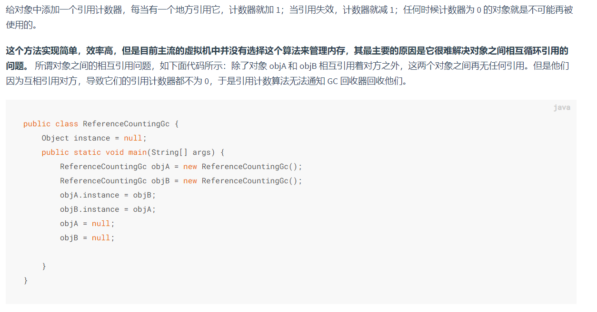

**可达性分析算法：**

通过一系列的称为 **“GC Roots”** 的对象作为起点，从这些节点开始向下搜索，节点所走过的路径称为引用链，当一个对象到 GC Roots 没有任何引用链相连的话，则证明此对象是不可用的。

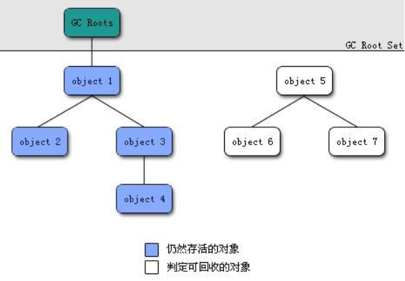

> 可达分析根节点都是哪些东西

可作为 GC Roots 的对象包括下面几种:

- 虚拟机栈(栈帧中的**本地变量表**)中引用的对象
- 本地方法栈(**Native 方法**)中**引用**的对象
- 方法区中**类静态属性引用**的对象
- 方法区中**常量引用**的对象
- 所有**被同步锁持有**的对象


> Java双亲委派机制
>
> https://snailclimb.gitee.io/javaguide/#/docs/java/jvm/%E7%B1%BB%E5%8A%A0%E8%BD%BD%E5%99%A8

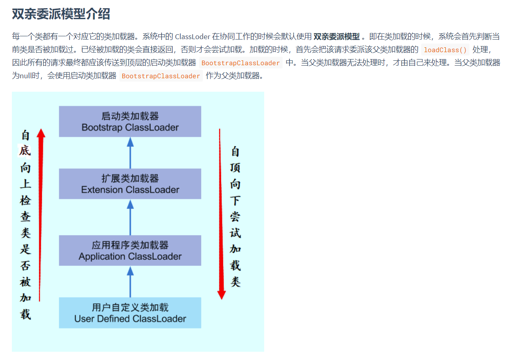

> 有哪些应用会破坏双亲委派模式？
>
> 回答了tomcat，但没回答上来为什么


## 其他的了解：

> 沙箱安全机制：
>
> - 视频：https://www.bilibili.com/video/BV1iJ411d7jS?p=4
>
> - 博客：https://www.cnblogs.com/iLisa/p/14590516.html
>
> - **字节码校验器(bytecode verifier)**：确保Java类文件遵循Java语言规范。这样可以帮助Java程序实现内存保护。但并不是所有的类文件都会经过字节码校验，比如核心类
>
>   - 核心类：是 Java.lang 包？
>
>      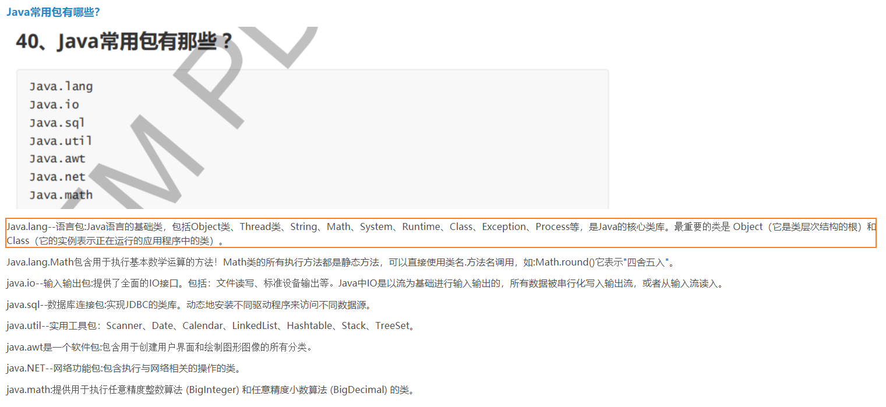


- JVM汇总：https://www.cnblogs.com/yyblog6/p/15018684.html

---

# 牛客网面经

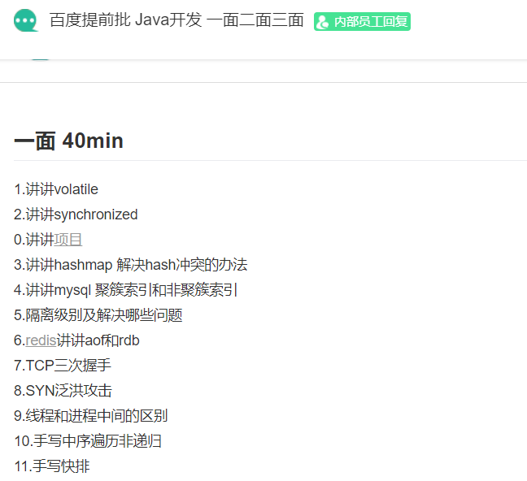


## 讲讲volatile 

关键字 `volatile` 解决的是**变量在多个线程之间的可见性**，该关键字修饰的变量会直接在主内存中进行读写操作，保证了变量的可见性。

除了保证变量的可见性以外，关键字 `volatile` 还有一个作用是**确保代码的执行顺序不变**。为了提高执行程序时的性能，编译器和处理器会对指令进行重排序优化，因此代码的执行顺序和编写代码的顺序可能不一致。添加关键字 `volatile` 可以**禁止指令进行重排序优化**。

只有当一个变量满足以下两个条件时，才能使用关键字 ` volatile`。

- 对变量的写入操作不依赖变量的当前值，或者能确保只有单个线程更新变量的值。

- 该变量没有包含在具有其他变量的不变式中 。

## 讲讲synchronized 

关键字 `synchronized` 解决的是**多个线程之间访问资源的同步性**，该关键字可以保证被它修饰的方法或者代码块**在任意时刻只能有一个线程执行**。

关键字 `synchronized` 最主要的三种使用方式是：**修饰实例方法、修饰静态方法、修饰代码块**。

- 修饰实例方法：给当前对象实例加锁，进入同步代码之前需要获得当前对象实例的锁。

- 修饰静态方法：给当前类加锁，进入同步代码之前需要获得当前类的锁。

- 修饰代码块：指定加锁对象，给指定对象加锁，进入同步代码块之前需要获得指定对象的锁。

> 关键字 synchronized 和 volatile 的区别

- 关键字 `volatile` 是线程同步的轻量级实现，不需要加锁，因此性能优于关键字 `synchronized`。

- 关键字 `synchronized` 可以修饰方法和代码块，关键字 `volatile` 只能修饰变量。

- 关键字 `synchronized` 可能发生阻塞，关键字 `volatile` 不会发生阻塞。

- 关键字 `synchronized` 可以保证数据的可见性和原子性，关键字` volatile` 只能保证数据的可见性，不能保证数据的原子性。

- 关键字 `synchronized` 解决的是多个线程之间访问资源的同步性，关键字 `volatile` 解决的是变量在多个线程之间的可见性。

---


## 讲讲hashmap 解决hash冲突的办法 


## 讲讲mysql 聚簇索引和非聚簇索引 

数据库的索引类型分为逻辑分类和物理分类

**逻辑分类：**

- 主键索引 ：当关系表中定义主键时会自动创建主键索引。每张表中的主键索引只能有一个，要求主键中的每个值都唯一，即不可重复，也不能有空值。
- 唯一索引 ：数据列不能有重复，可以有空值。一张表可以有多个唯一索引，但是每个唯一索引只能有一列。如身份证，卡号等。
- 普通索引 ：一张表可以有多个普通索引，可以重复可以为空值
- 全文索引 ：可以加快模糊查询，不常用

**物理分类：**

- 聚集索引（聚簇索引）： 数据在物理存储中的顺序与索引中数据的逻辑顺序相同，比如以ID建立聚集索引，数据库中id从小到大排列，那么物理存储中该数据的内存地址值也按照从小到大存储。一般是表中的主键索引，如果没有主键索引就会以第一个非空的唯一索引作为聚集索引。**一张表只能有一个聚集索引**。
- 非聚集索引： 数据在物理存储中的顺序与索引中数据的逻辑顺序不同。非聚集索引因为无法定位数据所在的行，所以需要扫描两遍索引树。第一遍扫描非聚集索引的索引树，确定该数据的主键ID，然后到主键索引（聚集索引）中寻找相应的数据。

## 隔离级别及解决哪些问题 

**事务就是一组逻辑操作的集合**。

### **四大特征：**

- 原子性：是不可分割的最小操作单位，要么同时成功，要么同时失败。
- 持久性：当事务提交或回滚后，数据库会持久化的保存数据。
- 隔离性：多个事务之间，相互独立。
- 一致性：事务操作前后，数据总量不变。


### **隔离级别：**

[数据库的事务隔离级别总结](https://blog.csdn.net/fuzhongmin05/article/details/91126936)

[数据库事务隔离级别](https://blog.csdn.net/fg2006/article/details/6937413)

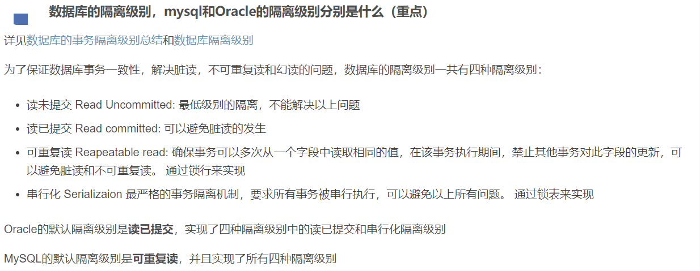

1. read uncommitted：读未提交
   - 产生的问题：脏读、不可重复读、幻读
2. read committed：读已提交 （Oracle 默认）

  * 产生的问题：不可重复读、幻读

3. repeatable read：可重复读 （MySQL 默认）

  * 产生的问题：幻读

4. serializable：串行化

  * 可以解决所有的问题

- 注意：隔离级别从小到大安全性越来越高，但是效率越来越低

- 数据库查询隔离级别：select @@tx_isolation;

- 数据库设置隔离级别：set global transaction isolation level  级别字符串;

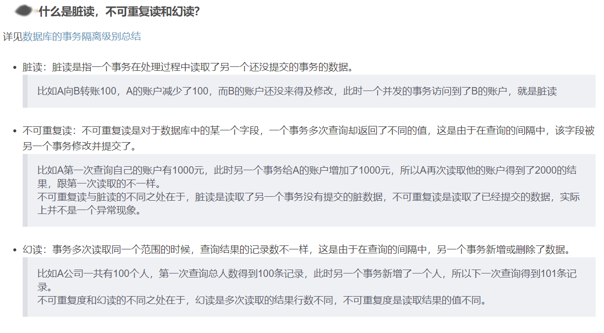

## 三大范式

[理解过程](https://jungle8884.icu/2021/03/23/MySQLearningNote/)

### 第一范式（1NF）

> 每一列都是不可分割的原子数据项

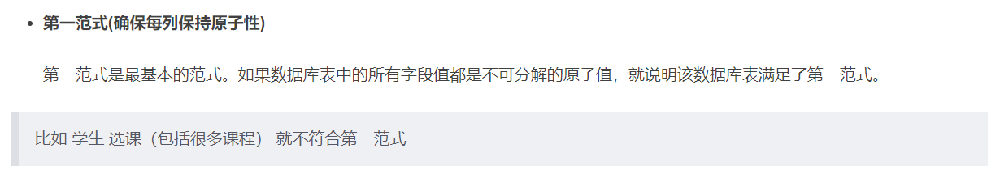

### 第二范式（2NF）

> 在1NF的基础上，非码属性必须完全依赖于码（在1NF基础上消除非主属性对主码的部分函数依赖）

```xml
* 几个概念：
1. 函数依赖：A-->B,如果通过A属性(属性组)的值，可以确定唯一B属性的值。则称B依赖于A
例如：学号-->姓名。 （学号，课程名称） --> 分数
2. 完全函数依赖：A-->B， 如果A是一个属性组，则B属性值得确定需要依赖于A属性组中所有的属性值。
例如：（学号，课程名称） --> 分数
3. 部分函数依赖：A-->B， 如果A是一个属性组，则B属性值得确定只需要依赖于A属性组中某一些值即可。
例如：（学号，课程名称） -- > 姓名
4. 传递函数依赖：A-->B, B -- >C . 如果通过A属性(属性组)的值，可以确定唯一B属性的值，在通过B属性（属性组）的值可以确定唯一C属性的值，则称 C 传递函数依赖于A
例如：学号-->系名，系名-->系主任
5. 码：如果在一张表中，一个属性或属性组，被其他所有属性所完全依赖，则称这个属性(属性组)为该表的码
例如：该表中码为：（学号，课程名称）
* 主属性：码属性组中的所有属性
* 非主属性：除去码属性组的属性
```

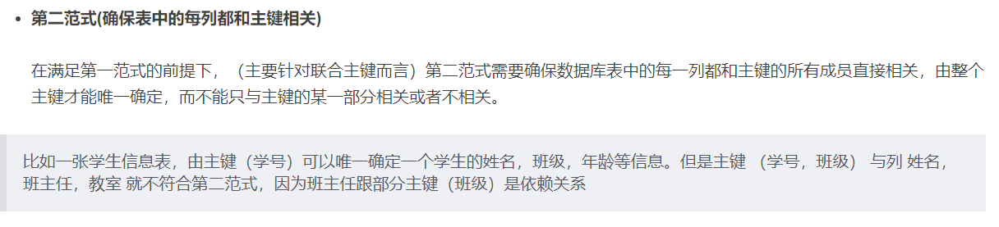

### 第三范式（3NF）

> 在2NF基础上，任何非主属性不依赖于其它非主属性（在2NF基础上消除传递依赖）

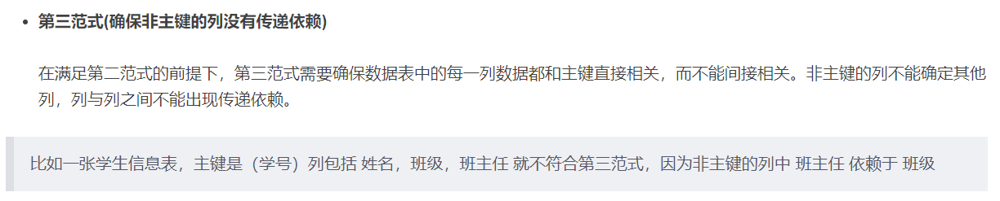

## TCP三次握手

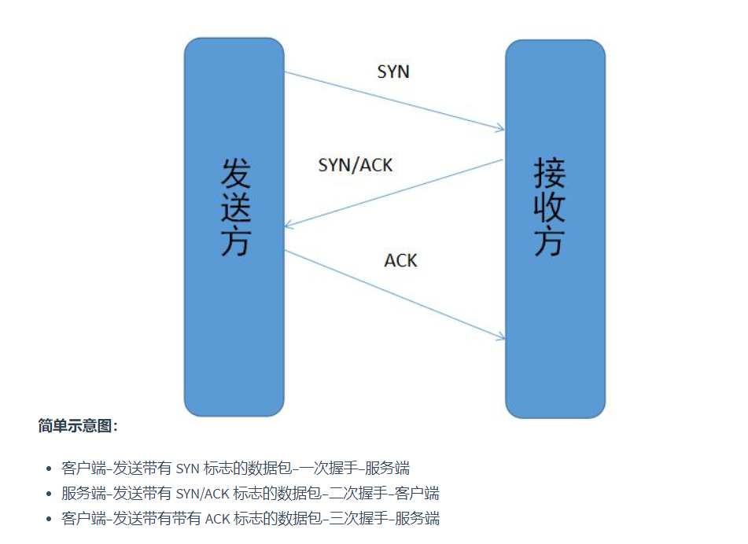

### 为什么要三次握手？

**三次握手的目的是建立可靠的通信信道，说到通讯，简单来说就是数据的发送与接收，而三次握手最主要的目的就是双方确认自己与对方的发送与接收是正常的。**

> 第一次握手

**客户端发送带有SYN标志的数据包给服务端**：

- 客户端什么都不能确认；
- **服务端确认了对方发送正常，自己接收正常**。

> 第二次握手

**服务端发送带有SYN/ACK标志的数据包给客户端**：

- **客户端确认自己发送正常、接收正常**，**对方发送正常、接收正常**；--> 客户端到服务端的通信是正常的！
- 服务端确认对方发送正常、自己接收正常。

> 第三次握手

**客户端发送带有ACK标志的数据包给服务端**：

- 客户端确认自己接收正常、发送正常，对方发送正常、接收正常；
- **服务端确认自己发送正常、接收正常**，**对方发送正常、接收正常**。--> 服务端到客户端的通信是正常的！

> 第一次握手和第二次握手表明了客户端到服务端的通信是正常的！
>
> 第二次握手和第三次握手表明了服务端到客户端的通信是正常的！

### 第二次握手传回了ACK，为什么还要传回SYN？

> SYN 同步序列编号(Synchronize Sequence Numbers) 是 TCP/IP 建立连接时使用的握手信号。
>
> 在客户机和服务器之间建立正常的 TCP 网络连接时，客户机首先发出一个 SYN 消息，服务器使用 SYN-ACK 应答表示接收到了这个消息，最后客户机再以 ACK(Acknowledgement）消息响应。这样在客户机和服务器之间才能建立起可靠的 TCP 连接，数据才可以在客户机和服务器之间传递。

接收端传回发送端所发送的ACK是为了告诉客户端，我接收到的信息确实就是你所发送的信号了，这表明从客户端到服务端的通信是正常的。而回传SYN则是为了建立并确认从服务端到客户端的通信。

### 为什么要四次挥手？

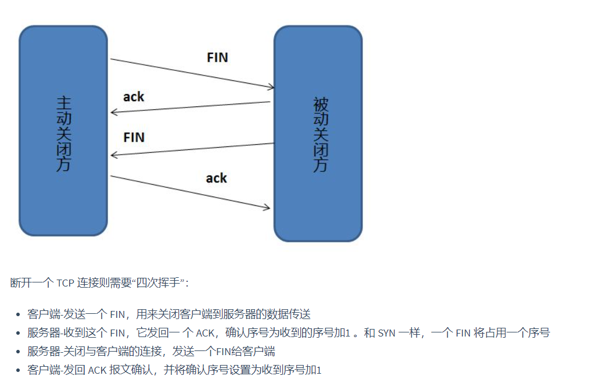

任何一方都可以在数据传送结束后发出连接释放的通知，待对方确认后进入半关闭状态。当另一方也没有数据再发送的时候，则发出连接释放通知，对方确认后就完全关闭了TCP连接。

## SYN泛洪攻击

> https://www.cnblogs.com/taoxiaoxin/p/13974351.html

 TCP SYN泛洪发生在OSI第四层，这种方式利用TCP协议的特性，就是三次握手。攻击者发送TCP SYN，SYN是TCP三次握手中的第一个数据包，而当服务器返回ACK后，该攻击者就不对其进行再确认，那这个TCP连接就处于挂起状态，也就是所谓的半连接状态，服务器收不到再确认的话，还会重复发送ACK给攻击者。这样更加会浪费服务器的资源。攻击者就对服务器发送非常大量的这种TCP连接，由于每一个都没法完成三次握手，所以在服务器上，这些TCP连接会因为挂起状态而消耗CPU和内存，最后服务器可能死机，就无法为正常用户提供服务了。

## 线程和进程中间的区别 

>   https://leetcode-cn.com/leetbook/read/java-interview-highlights/ennud5/

进程是程序的一次执行过程，是系统运行程序的基本单位，因此进程是动态的。系统运行一个程序即为一个进程的创建、运行以及消亡的过程。

线程是比进程更小的执行单位。一个进程在其执行的过程中可以产生多个线程，多个线程共享进程的堆和方法区内存资源，每个线程都有自己的程序计数器、虚拟机栈和本地方法栈。由于线程共享进程的内存，因此系统产生一个线程或者在多个线程之间切换工作时的负担比进程小得多，线程也称为轻量级进程。

进程和线程最大的区别是，各进程是独立的，而各线程则不一定独立，因为同一进程中的多个线程极有可能会相互影响。线程执行开销小，但不利于资源的管理和保护，进程则相反。

## 手写中序遍历非递归 


## 手写快排


---

