# 牛客 Java 高级工程师

## 第一章内容

### 搭建开发环境--Maven


- [下载链接](http://maven.apache.org/)

- [阿里云镜像仓库](https://maven.aliyun.com/mvn/view)

  - 复制镜像链接：[central](https://maven.aliyun.com/repository/central)
  - 配置镜像：安装目录\apache-maven-3.8.1\conf\settings.xml

  ```
  <mirror>
        <id>maven-aliyun</id>
        <mirrorOf>central</mirrorOf>
        <name>Maven aliyun</name>
        <url>https://maven.aliyun.com/repository/central</url>
  </mirror>
  ```

  - 配置环境变量：Path中加上`D:\apache-maven-3.8.1\bin`

  ```
  C:\Users\LeBro>mvn --version
  Apache Maven 3.8.1 (05c21c65bdfed0f71a2f2ada8b84da59348c4c5d)
  Maven home: D:\apache-maven-3.8.1-bin\apache-maven-3.8.1\bin\..
  Java version: 11.0.10, vendor: AdoptOpenJDK, runtime: C:\Program Files\AdoptOpenJDK\jdk-11.0.10.9-hotspot
  Default locale: zh_CN, platform encoding: GBK
  OS name: "windows 10", version: "10.0", arch: "amd64", family: "windows"
  ```

#### 使用CMD命令创建项目

- maven命令：[快速上手](http://maven.apache.org/guides/getting-started/maven-in-five-minutes.html)

> 先切换到你要创建项目的目录

- 创建项目

```
D:\Codes>cd Work
# archetype:generate 		以模板原型方式生成文件
# DgroupId					组织ID: 通常写公司域名倒序.项目名
# DartifactId				项目ID
# DarchetypeArtifactId		项目模板ID
# DinteractiveMode=false	是否启用交互模式
D:\Codes\Work>mvn archetype:generate -DgroupId=com.jungle8884.mavendemo1 -DartifactId=mavendemo1 -DarchetypeArtifactId=maven-archetype-quickstart -DarchetypeVersion=1.4 -DinteractiveMode=false
# 创建成功
[INFO] Scanning for projects...
[INFO]
[INFO] ------------------< org.apache.maven:standalone-pom >-------------------
[INFO] Building Maven Stub Project (No POM) 1
[INFO] --------------------------------[ pom ]---------------------------------
[INFO]
[INFO] >>> maven-archetype-plugin:3.2.0:generate (default-cli) > generate-sources @ standalone-pom >>>
[INFO]
[INFO] <<< maven-archetype-plugin:3.2.0:generate (default-cli) < generate-sources @ standalone-pom <<<
[INFO]
[INFO]
[INFO] --- maven-archetype-plugin:3.2.0:generate (default-cli) @ standalone-pom ---
[INFO] Generating project in Batch mode
[WARNING] No archetype found in remote catalog. Defaulting to internal catalog
[INFO] ----------------------------------------------------------------------------
[INFO] Using following parameters for creating project from Archetype: maven-archetype-quickstart:1.4
[INFO] ----------------------------------------------------------------------------
[INFO] Parameter: groupId, Value: com.jungle8884.mavendemo1
[INFO] Parameter: artifactId, Value: mavendemo1
[INFO] Parameter: version, Value: 1.0-SNAPSHOT
[INFO] Parameter: package, Value: com.jungle8884.mavendemo1
[INFO] Parameter: packageInPathFormat, Value: com/jungle8884/mavendemo1
[INFO] Parameter: package, Value: com.jungle8884.mavendemo1
[INFO] Parameter: groupId, Value: com.jungle8884.mavendemo1
[INFO] Parameter: artifactId, Value: mavendemo1
[INFO] Parameter: version, Value: 1.0-SNAPSHOT
[INFO] Project created from Archetype in dir: D:\Codes\Work\mavendemo1
[INFO] ------------------------------------------------------------------------
[INFO] BUILD SUCCESS
[INFO] ------------------------------------------------------------------------
[INFO] Total time:  2.746 s
[INFO] Finished at: 2021-04-13T16:46:21+08:00
[INFO] ------------------------------------------------------------------------
```

- 查看：D:\Codes\Work\mavendemo1\src

  - main: 开发代码
  - test: 测试代码

- 查看仓库：C:\Users\LeBro\.m2\repository

  - 远程仓库下载的资源都放在这里

- 在该目录下编译：D:\Codes\Work\mavendemo1

  - 会生成taget文件夹
  - 如下图：

  

  ```
  D:\Codes\Work\mavendemo1>mvn compile
  [INFO] Scanning for projects...
  [INFO]
  [INFO] ----------------< com.jungle8884.mavendemo1:mavendemo1 >----------------
  [INFO] Building mavendemo1 1.0-SNAPSHOT
  [INFO] --------------------------------[ jar ]---------------------------------
  [INFO] Changes detected - recompiling the module!
  [INFO] Compiling 1 source file to D:\Codes\Work\mavendemo1\target\classes
  [INFO] ------------------------------------------------------------------------
  [INFO] BUILD SUCCESS
  [INFO] ------------------------------------------------------------------------
  [INFO] Total time:  27.798 s
  [INFO] Finished at: 2021-04-13T16:54:41+08:00
  [INFO] ------------------------------------------------------------------------
  ```

- 在该目录下清除：D:\Codes\Work\mavendemo1

  ```
  D:\Codes\Work\mavendemo1>mvn clean
  [INFO] Scanning for projects...
  [INFO]
  [INFO] ----------------< com.jungle8884.mavendemo1:mavendemo1 >----------------
  [INFO] Building mavendemo1 1.0-SNAPSHOT
  [INFO] --------------------------------[ jar ]---------------------------------
  [INFO]
  [INFO] --- maven-clean-plugin:3.1.0:clean (default-clean) @ mavendemo1 ---
  [INFO] Deleting D:\Codes\Work\mavendemo1\target
  [INFO] ------------------------------------------------------------------------
  [INFO] BUILD SUCCESS
  [INFO] ------------------------------------------------------------------------
  [INFO] Total time:  2.505 s
  [INFO] Finished at: 2021-04-13T17:15:18+08:00
  [INFO] ------------------------------------------------------------------------
  ```

- 也可以组合使用：编译前先清除

  ```
  D:\Codes\Work\mavendemo1>mvn clean compile
  [INFO] Scanning for projects...
  [INFO]
  [INFO] ----------------< com.jungle8884.mavendemo1:mavendemo1 >----------------
  [INFO] Building mavendemo1 1.0-SNAPSHOT
  [INFO] --------------------------------[ jar ]---------------------------------
  [INFO]
  [INFO] --- maven-clean-plugin:3.1.0:clean (default-clean) @ mavendemo1 ---
  [INFO]
  [INFO] --- maven-resources-plugin:3.0.2:resources (default-resources) @ mavendemo1 ---
  [INFO] Using 'UTF-8' encoding to copy filtered resources.
  [INFO] skip non existing resourceDirectory D:\Codes\Work\mavendemo1\src\main\resources
  [INFO]
  [INFO] --- maven-compiler-plugin:3.8.0:compile (default-compile) @ mavendemo1 ---
  [INFO] Changes detected - recompiling the module!
  [INFO] Compiling 1 source file to D:\Codes\Work\mavendemo1\target\classes
  [INFO] ------------------------------------------------------------------------
  [INFO] BUILD SUCCESS
  [INFO] ------------------------------------------------------------------------
  [INFO] Total time:  1.422 s
  [INFO] Finished at: 2021-04-13T17:19:36+08:00
  [INFO] ------------------------------------------------------------------------
  ```

- 测试使用

  ```
  D:\Codes\Work\mavendemo1>mvn clean test
  [INFO] Scanning for projects...
  [INFO]
  [INFO] ----------------< com.jungle8884.mavendemo1:mavendemo1 >----------------
  [INFO] Building mavendemo1 1.0-SNAPSHOT
  [INFO] --------------------------------[ jar ]---------------------------------
  [INFO]
  [INFO] --- maven-clean-plugin:3.1.0:clean (default-clean) @ mavendemo1 ---
  [INFO] Deleting D:\Codes\Work\mavendemo1\target
  [INFO]
  [INFO] --- maven-resources-plugin:3.0.2:resources (default-resources) @ mavendemo1 ---
  [INFO] Using 'UTF-8' encoding to copy filtered resources.
  [INFO] skip non existing resourceDirectory D:\Codes\Work\mavendemo1\src\main\resources
  [INFO]
  [INFO] --- maven-compiler-plugin:3.8.0:compile (default-compile) @ mavendemo1 ---
  [INFO] Changes detected - recompiling the module!
  [INFO] Compiling 1 source file to D:\Codes\Work\mavendemo1\target\classes
  [INFO]
  [INFO] --- maven-resources-plugin:3.0.2:testResources (default-testResources) @ mavendemo1 ---
  [INFO] Using 'UTF-8' encoding to copy filtered resources.
  [INFO] skip non existing resourceDirectory D:\Codes\Work\mavendemo1\src\test\resources
  [INFO]
  [INFO] --- maven-compiler-plugin:3.8.0:testCompile (default-testCompile) @ mavendemo1 ---
  [INFO] Changes detected - recompiling the module!
  [INFO] Compiling 1 source file to D:\Codes\Work\mavendemo1\target\test-classes
  [INFO]
  [INFO] --- maven-surefire-plugin:2.22.1:test (default-test) @ mavendemo1 ---
  [INFO]
  [INFO] -------------------------------------------------------
  [INFO]  T E S T S
  [INFO] -------------------------------------------------------
  [INFO] Running com.jungle8884.mavendemo1.AppTest
  [INFO] Tests run: 1, Failures: 0, Errors: 0, Skipped: 0, Time elapsed: 0.062 s - in com.jungle8884.mavendemo1.AppTest
  [INFO]
  [INFO] Results:
  [INFO]
  [INFO] Tests run: 1, Failures: 0, Errors: 0, Skipped: 0
  [INFO]
  [INFO] ------------------------------------------------------------------------
  [INFO] BUILD SUCCESS
  [INFO] ------------------------------------------------------------------------
  [INFO] Total time:  15.081 s
  [INFO] Finished at: 2021-04-13T17:22:53+08:00
  [INFO] ------------------------------------------------------------------------
  ```

  - 生成对应目录：D:\Codes\Work\mavendemo1\target\test-classes\com\jungle8884\mavendemo1
  - 生成对应文件：AppTest.class
  - 如下图：


#### 使用IntelliJ IDEA创建项目

> 在`IntelliJ IDEA`里配置`Maven`，主要是以下两个安装目录和配置文件

- `D:\apache-maven-3.8.1`

- `D:\apache-maven-3.8.1\conf\settings.xml`

  

- 新建Maven项目：

  

  

  

  


- 发现与CMD命令创建一致！

  


- 发现运行时出错：不能运行App.java文件

  - 不断尝试后，发现换了个最新的IntelliJ IDEA 2021版本
  - 成功运行！

  

------

### 搭建开发环境--Spring

#### 搭建开发环境--Spring Initializer

[链接](https://start.spring.io)


- generate project


- 自己在操作时发现没有AOP，于是只能自己添加！

  ```xml
  <!--使用Spring Initializr时视频中能搜到AOP，我搜不到，下面是手动加的-->
  		<dependency>
  			<groupId>org.springframework.boot</groupId>
  			<artifactId>spring-boot-starter-aop</artifactId>
  		</dependency>
  		<!--使用Spring Initializr时视频中能搜到AOP，我搜不到，上面是手动加的-->
  ```

- 完整的pom.xml文件：

  ```xml
  <?xml version="1.0" encoding="UTF-8"?>
  <project xmlns="http://maven.apache.org/POM/4.0.0" xmlns:xsi="http://www.w3.org/2001/XMLSchema-instance"
  	xsi:schemaLocation="http://maven.apache.org/POM/4.0.0 https://maven.apache.org/xsd/maven-4.0.0.xsd">
  	<modelVersion>4.0.0</modelVersion>
  	<parent>
  		<groupId>org.springframework.boot</groupId>
  		<artifactId>spring-boot-starter-parent</artifactId>
  		<version>2.4.4</version>
  		<relativePath/> <!-- lookup parent from repository -->
  	</parent>
  	<groupId>com.nowcoder.community</groupId>
  	<artifactId>community</artifactId>
  	<version>0.0.1-SNAPSHOT</version>
  	<name>community</name>
  	<description>nowcoder community</description>
  	<properties>
  		<java.version>11</java.version>
  	</properties>
  	<dependencies>
  		<!--使用Spring Initializr时视频中能搜到AOP，我搜不到，下面是手动加的-->
  		<dependency>
  			<groupId>org.springframework.boot</groupId>
  			<artifactId>spring-boot-starter-aop</artifactId>
  		</dependency>
  		<!--使用Spring Initializr时视频中能搜到AOP，我搜不到，上面是手动加的-->
  		<dependency>
  			<groupId>org.springframework.boot</groupId>
  			<artifactId>spring-boot-starter-thymeleaf</artifactId>
  		</dependency>
  		<dependency>
  			<groupId>org.springframework.boot</groupId>
  			<artifactId>spring-boot-starter-web</artifactId>
  		</dependency>
  
  		<dependency>
  			<groupId>org.springframework.boot</groupId>
  			<artifactId>spring-boot-devtools</artifactId>
  			<scope>runtime</scope>
  			<optional>true</optional>
  		</dependency>
  		<dependency>
  			<groupId>org.springframework.boot</groupId>
  			<artifactId>spring-boot-starter-test</artifactId>
  			<scope>test</scope>
  		</dependency>
  	</dependencies>
  
  	<build>
  		<plugins>
  			<plugin>
  				<groupId>org.springframework.boot</groupId>
  				<artifactId>spring-boot-maven-plugin</artifactId>
  			</plugin>
  		</plugins>
  	</build>
  
  </project>
  
  ```

- 测试：CommunityApplicationTests

  

- 运行：CommunityApplication

  

  Spring boot 会启动 tomcat：http://localhost:8080/

   

  ------

#### 搭建开发环境 Spring Boot 入门示例


> 入门示例

1. 新建controller包，再新建AlphaController示例类


2. 自己写一个sayHello方法，再添上对应的注解

   

3. 示例代码：

   ```java
   package com.nowcoder.community.controller;
   
   import org.springframework.stereotype.Controller;
   import org.springframework.web.bind.annotation.RequestMapping;
   import org.springframework.web.bind.annotation.ResponseBody;
   
   @Controller
   @RequestMapping("/alpha")
   public class AlphaController {
       @RequestMapping("/hello")
       @ResponseBody
       public String sayHello() {
           return "Hello Spring Boot.";
       }
   }
   ```

4. 打开本地服务器页面：http://localhost:8080/alpha/hello

   

5. 可能会遇到的问题：8080端口被占用了

   - 可以自己在resources文件夹下的application.properties中设置端口

   ```
   server.port=8090
   server.servlet.context-path=/community
   ```

   - 输入：http://localhost:8090/community/alpha/hello

   

------

### Spring入门


[Spring 链接](https://spring.io/)

> 学习 [spring-framework](https://spring.io/projects/spring-framework#learn)


#### Spring IOC

> IOC：Inversion of Control
>
> 控制反转


- 本节课程：[视频链接](https://www.bilibili.com/video/BV1TV411m788?t=1024&p=3)
  - `JavaBean`的介绍：[JavaBean](https://www.liaoxuefeng.com/wiki/1252599548343744/1260474416351680)
  - `Annotation`的介绍：注释会被编译器直接忽略，而注解则可以被编译器打包进入class文件，因此，注解是一种用作标注的“元数据”。
    - [使用注解](https://www.liaoxuefeng.com/wiki/1252599548343744/1265102413966176)
    - [定义注解](https://www.liaoxuefeng.com/wiki/1252599548343744/1265102803921888)
    - [处理注解](https://www.liaoxuefeng.com/wiki/1252599548343744/1265102026065728)
  
  - [IoC容器](https://www.liaoxuefeng.com/wiki/1252599548343744/1266265100383840)
  - 演示依赖注入：
  
  > AlphaDao 接口及其实现类
  
  ```
  // AlphaDao
  package com.nowcoder.community.dao;
  
  public interface AlphaDao {
      String select();
  }
  
  // AlphaDaoMybatisImpl
  package com.nowcoder.community.dao;
  
  import org.springframework.context.annotation.Primary;
  import org.springframework.stereotype.Repository;
  
  @Repository
  @Primary
  public class AlphaDaoMybatisImpl implements AlphaDao{
      @Override
      public String select() {
          return "Mybatis";
      }
  }
  
  // AlphaDaoHibernateImpl
  package com.nowcoder.community.dao;
  
  import org.springframework.stereotype.Repository;
  
  @Repository("alphaHibernate")
  public class AlphaDaoHibernateImpl implements AlphaDao{
      @Override
      public String select() {
          return "Hibernate";
      }
  }
  ```
  
  > AlphaService 
  >
  > - 注入AlphaDao
  >   - @Autowired //给AlphaService注入AlphaDao 
  >   - private AlphaDao alphaDao;
  > - find()：依赖于AlphaDao的方式
  
  ```
  package com.nowcoder.community.service;
  
  import com.nowcoder.community.dao.AlphaDao;
  import org.springframework.beans.factory.annotation.Autowired;
  //import org.springframework.context.annotation.Scope;
  import org.springframework.stereotype.Service;
  
  import javax.annotation.PostConstruct;
  import javax.annotation.PreDestroy;
  
  @Service
  //@Scope("prototype") //每次创建不同的实例
  public class AlphaService {
      @Autowired //给AlphaService注入AlphaDao
      private AlphaDao alphaDao;
  
  	/*	默认使用AlphaDaoMybatisImpl；
  		若要使用AlphaDaoHibernateImpl，
  		修改为：
              @Autowired
              @Qualifier("alphaHibernate")
              private AlphaDao alphaDao;
  	*/
      public AlphaService() {
          System.out.println("实例化AlphaService");
      }
  
      @PostConstruct //在构造后调用
      public void init() {
          System.out.println("初始化AlphaService");
      }
  
      @PreDestroy //在销毁之前调用
      public void destroy() {
          System.out.println("销毁AlphaService");
      }
  
      public String find() { //AlphaService依赖于AlphaDao的方式
          return alphaDao.select();
      }
  }
  ```
  
  > AlphaController
  >
  > - 注入AlphaService
  >   -  @Autowired //给AlphaController注入AlphaService
  >   - private AlphaService alphaService;
  > - getData()：依赖于AlphaService的方式
  
  ```
  package com.nowcoder.community.controller;
  
  import com.nowcoder.community.service.AlphaService;
  import org.springframework.beans.factory.annotation.Autowired;
  import org.springframework.stereotype.Controller;
  import org.springframework.web.bind.annotation.RequestMapping;
  import org.springframework.web.bind.annotation.ResponseBody;
  
  @Controller
  @RequestMapping("/alpha")
  public class AlphaController {
  
      @Autowired //给AlphaController注入AlphaService
      private AlphaService alphaService;
  
      @RequestMapping("/hello")
      @ResponseBody
      public String sayHello() {
          return "Hello Spring Boot.";
      }
  
      @RequestMapping("/data")
      @ResponseBody
      public String getData() {
          return alphaService.find();
      }
  }
  ```
  
  > 运行CommunityApplication.main()方法，进行测试
  >
  > - 右键CommunityApplication类
  > - 运行CommunityApplication.main()
  > - 打开：http://localhost:8080/community/alpha/data
  
  
  
  ------

#### Spring MVC


> 先学习一下 [HTTP协议](https://developer.mozilla.org/zh-CN/docs/Web/HTTP/Overview)
>


> MVC是解决三层架构中表现层的问题：
>
> - 三层架构：浏览器访问网页，首先访问表现层，表现层调用业务层处理业务，处理过程中会访问数据库（数据层），最终得到业务层返回的数据，展示在表现层。
> - 浏览器发送请求访问服务器，访问的是control控制器，它接收请求后调用业务层处理数据，处理完成后返回数据封装到Model层传给View层，生成html给浏览器。

官方链接：[SpringMVC](https://docs.spring.io/spring-framework/docs/current/reference/html/web.html#spring-web)


> Thymeleaf
>


#### MyBatis入门


- 下载链接：[mysql server](https://dev.mysql.com/downloads/mysql/)

  - 新建 my.ini 配置，在（安装）根目录下：

  ```
  [mysqld]
  # 设置3306端口
  port=3306
  # 设置mysql的安装目录
  basedir=D:\MySQL\mysql-8.0.16-winx64
  # 设置mysql数据库的数据的存放目录
  datadir=D:\MySQL\Database
  # 允许最大连接数
  max_connections=200
  # 允许连接失败的次数。这是为了防止有人从该主机试图攻击数据库系统
  max_connect_errors=10
  # 服务端使用的字符集默认为UTF8
  character-set-server=utf8
  # 创建新表时将使用的默认存储引擎
  default-storage-engine=INNODB
  # 默认使用“mysql_native_password”插件认证
  default_authentication_plugin=mysql_native_password
  [mysql]
  # 设置mysql客户端默认字符集
  default-character-set=utf8
  [client]
  # 设置mysql客户端连接服务端时默认使用的端口
  port=3306
  default-character-set=utf8
  ```

  - 成功则输出如下内容：

  ```shell
  # 第一步：
  D:\mysql-8.0.16-winx64\bin>mysqld --initialize --console
  2021-04-18T13:26:03.855416Z 0 [System] [MY-013169] [Server] D:\mysql-8.0.16-winx64\bin\mysqld.exe (mysqld 8.0.16) initializing of server in progress as process 17944
  2021-04-18T13:26:03.856934Z 0 [Warning] [MY-013242] [Server] --character-set-server: 'utf8' is currently an alias for the character set UTF8MB3, but will be an alias for UTF8MB4 in a future release. Please consider using UTF8MB4 in order to be unambiguous.
  2021-04-18T13:26:07.939343Z 5 [Note] [MY-010454] [Server] A temporary password is generated for root@localhost: L/Ad.M?d6>sX
  2021-04-18T13:26:09.432261Z 0 [System] [MY-013170] [Server] 
  D:\mysql-8.0.16-winx64\bin\mysqld.exe (mysqld 8.0.16) initializing of server has completed
  ```

  - 若之前安装过，解决办法：

    ```shell
    # 第二步：
    D:\mysql-8.0.16-winx64\bin>mysqld install
    The service already exists!
    The current server installed: "D:\MySQL\bin\mysqld" --defaults-file="D:\MySQL\my.ini" MySQL
    
    # 关闭窗口重新打开（以管理员权限）
    C:\Windows\system32>sc query mysql
    SERVICE_NAME: mysql
            TYPE               : 10  WIN32_OWN_PROCESS
            STATE              : 1  STOPPED
            WIN32_EXIT_CODE    : 0  (0x0)
            SERVICE_EXIT_CODE  : 0  (0x0)
            CHECKPOINT         : 0x0
            WAIT_HINT          : 0x7d0
            
    C:\Windows\system32>sc delete mysql
    [SC] DeleteService SUCCESS
    ```

  - 重新安装：

    ```shell
    # 第一步：
    D:\MySQL\mysql-8.0.16-winx64\bin>mysqld --initialize --console
    2021-04-18T13:42:46.751081Z 0 [System] [MY-013169] [Server] D:\MySQL\mysql-8.0.16-winx64\bin\mysqld.exe (mysqld 8.0.16) initializing of server in progress as process 19852
    2021-04-18T13:42:46.752336Z 0 [Warning] [MY-013242] [Server] --character-set-server: 'utf8' is currently an alias for the character set UTF8MB3, but will be an alias for UTF8MB4 in a future release. Please consider using UTF8MB4 in order to be unambiguous.
    2021-04-18T13:42:50.354065Z 5 [Note] [MY-010454] [Server] A temporary password is generated for root@localhost: :rfm;Mr:2TjG
    2021-04-18T13:42:51.666406Z 0 [System] [MY-013170] [Server] D:\MySQL\mysql-8.0.16-winx64\bin\mysqld.exe (mysqld 8.0.16) initializing of server has completed
    
    # 第二步：
    D:\MySQL\mysql-8.0.16-winx64\bin>mysqld install
    Service successfully installed.
    
    # 第三步：
    D:\MySQL\mysql-8.0.16-winx64\bin>net start mysql
    The MySQL service is starting.
    The MySQL service was started successfully.
    ```

  - 第一次登陆修改密码：

    ```mysql
    C:\Users\LeBro>mysql -uroot -p
    Enter password: ************
    Welcome to the MySQL monitor.  Commands end with ; or \g.
    Your MySQL connection id is 9
    Server version: 8.0.16
    
    Copyright (c) 2000, 2019, Oracle and/or its affiliates. All rights reserved.
    
    Oracle is a registered trademark of Oracle Corporation and/or its
    affiliates. Other names may be trademarks of their respective
    owners.
    
    Type 'help;' or '\h' for help. Type '\c' to clear the current input statement.
    
    mysql> alter user root@localhost identified by 'jungle8884';
    Query OK, 0 rows affected (0.01 sec)
    ```

  - 导入数据：

    ```
    use community;
    
    source D:/FastData/community/sql/init_schema.sql；
    
    source D:/FastData/community/sql/init_data.sql；
    ```

    

- 下载链接：[workbench](https://dev.mysql.com/downloads/workbench/)


- [MyBatis手册](https://mybatis.org/mybatis-3/zh/index.html)
- [spring整合MyBatis](http://mybatis.org/spring/zh/index.html)
- [mvnrepository-mysql包](https://mvnrepository.com/artifact/mysql/mysql-connector-java/8.0.16)
- [mvnrepository-mybatis包](https://mvnrepository.com/artifact/org.mybatis.spring.boot/mybatis-spring-boot-starter/2.0.1)

```xml
# pom.xml:
<dependency>
    <groupId>mysql</groupId>
    <artifactId>mysql-connector-java</artifactId>
    <version>8.0.16</version>
</dependency>
<dependency>
    <groupId>org.mybatis.spring.boot</groupId>
    <artifactId>mybatis-spring-boot-starter</artifactId>
    <version>2.0.1</version>
</dependency>

# application.properties:
# DataSourceProperties
spring.datasource.driver-class-name=com.mysql.cj.jdbc.Driver
spring.datasource.url=jdbc:mysql://localhost:3306/community?characterEncoding=utf-8&useSSL=false&serverTimezone=Hongkong
# spring.datasource.url=jdbc:mysql://localhost:3306/community?characterEncoding=utf-8&useSSL=false&serverTimezone=UTC
spring.datasource.username=root
spring.datasource.password=jungle8884
spring.datasource.type=com.zaxxer.hikari.HikariDataSource
spring.datasource.hikari.maximum-pool-size=15
spring.datasource.hikari.minimum-idle=5
spring.datasource.hikari.idle-timeout=30000

# MybatisProperties
mybatis.mapper-locations=classpath:mapper/*.xml
mybatis.type-aliases-package=com.nowcoder.community.entity
mybatis.configuration.useGeneratedKeys=true
mybatis.configuration.mapUnderscoreToCamelCase=true
```


#### 遇到的问题：

> 问题一：打开项目后，没有提示，无法编译了
>
> 报错：Error: Could not find or load main class com.nowcoder.community.CommunityApplication Caused by: java

解决办法：


## 第二章内容

### 开发社区首页


> 项目代码：https://gitee.com/jungle8884/NowCoder

[百度云链接：提取码：8884 ](https://pan.baidu.com/s/1ebRtHVvth2Rx4rCCR23AYg)

----------------------------------

### 项目调试技巧

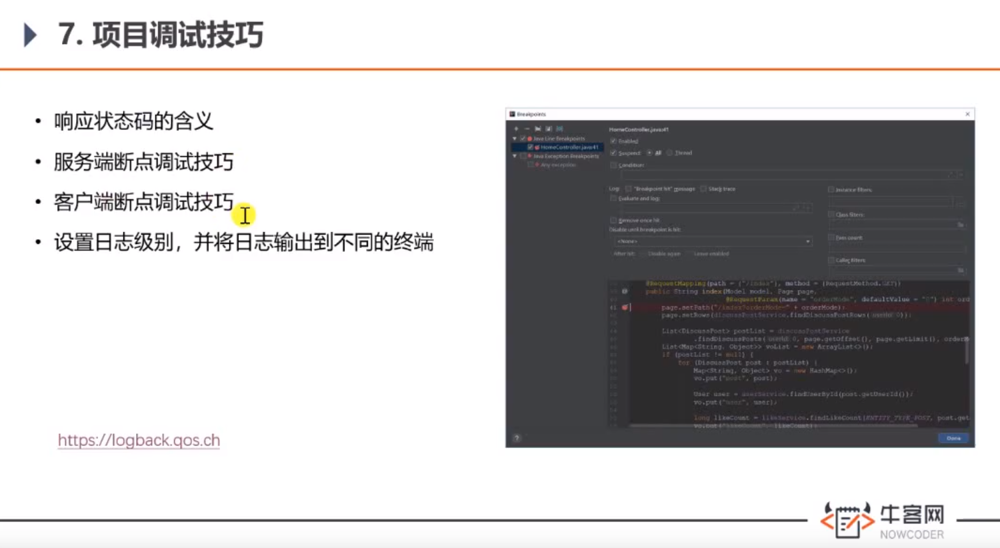

**响应状态码**

- 302
- 404
- 500

**断点调试**

- IDEA
  - F7: step into
  - F8: step over
  - F9：执行到底
- 浏览器
  - F10: step over
  - F11: step into
  - F8：执行到底

**设置日志级别**

[网址](https://logback.qos.ch/manual/architecture.html)

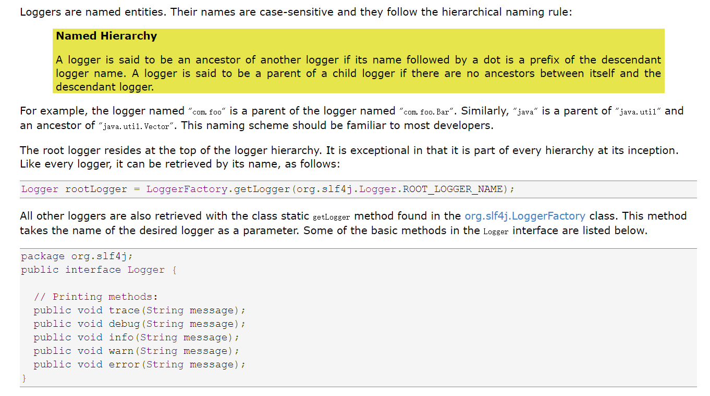

> 在resource根目录下新建：logback-spring.xml

```xml
<?xml version="1.0" encoding="UTF-8"?>
<configuration>
    <contextName>community</contextName>
    <!--<property name="LOG_PATH" value="./community-log"/>-->
    <property name="LOG_PATH" value="D:/Codes/Work/data"/>
    <property name="APPDIR" value="community"/>

    <!-- error file -->
    <appender name="FILE_ERROR" class="ch.qos.logback.core.rolling.RollingFileAppender">
        <file>${LOG_PATH}/${APPDIR}/log_error.log</file>
        <rollingPolicy class="ch.qos.logback.core.rolling.TimeBasedRollingPolicy">
            <fileNamePattern>${LOG_PATH}/${APPDIR}/error/log-error-%d{yyyy-MM-dd}.%i.log</fileNamePattern>
            <timeBasedFileNamingAndTriggeringPolicy class="ch.qos.logback.core.rolling.SizeAndTimeBasedFNATP">
                <maxFileSize>5MB</maxFileSize>
            </timeBasedFileNamingAndTriggeringPolicy>
            <maxHistory>30</maxHistory>
        </rollingPolicy>
        <append>true</append>
        <encoder class="ch.qos.logback.classic.encoder.PatternLayoutEncoder">
            <pattern>%d %level [%thread] %logger{10} [%file:%line] %msg%n</pattern>
            <charset>utf-8</charset>
        </encoder>
        <filter class="ch.qos.logback.classic.filter.LevelFilter">
            <level>error</level>
            <onMatch>ACCEPT</onMatch>
            <onMismatch>DENY</onMismatch>
        </filter>
    </appender>

    <!-- warn file -->
    <appender name="FILE_WARN" class="ch.qos.logback.core.rolling.RollingFileAppender">
        <file>${LOG_PATH}/${APPDIR}/log_warn.log</file>
        <rollingPolicy class="ch.qos.logback.core.rolling.TimeBasedRollingPolicy">
            <fileNamePattern>${LOG_PATH}/${APPDIR}/warn/log-warn-%d{yyyy-MM-dd}.%i.log</fileNamePattern>
            <timeBasedFileNamingAndTriggeringPolicy class="ch.qos.logback.core.rolling.SizeAndTimeBasedFNATP">
                <maxFileSize>5MB</maxFileSize>
            </timeBasedFileNamingAndTriggeringPolicy>
            <maxHistory>30</maxHistory>
        </rollingPolicy>
        <append>true</append>
        <encoder class="ch.qos.logback.classic.encoder.PatternLayoutEncoder">
            <pattern>%d %level [%thread] %logger{10} [%file:%line] %msg%n</pattern>
            <charset>utf-8</charset>
        </encoder>
        <filter class="ch.qos.logback.classic.filter.LevelFilter">
            <level>warn</level>
            <onMatch>ACCEPT</onMatch>
            <onMismatch>DENY</onMismatch>
        </filter>
    </appender>

    <!-- info file -->
    <appender name="FILE_INFO" class="ch.qos.logback.core.rolling.RollingFileAppender">
        <file>${LOG_PATH}/${APPDIR}/log_info.log</file>
        <rollingPolicy class="ch.qos.logback.core.rolling.TimeBasedRollingPolicy">
            <fileNamePattern>${LOG_PATH}/${APPDIR}/info/log-info-%d{yyyy-MM-dd}.%i.log</fileNamePattern>
            <timeBasedFileNamingAndTriggeringPolicy class="ch.qos.logback.core.rolling.SizeAndTimeBasedFNATP">
                <maxFileSize>5MB</maxFileSize>
            </timeBasedFileNamingAndTriggeringPolicy>
            <maxHistory>30</maxHistory>
        </rollingPolicy>
        <append>true</append>
        <encoder class="ch.qos.logback.classic.encoder.PatternLayoutEncoder">
            <pattern>%d %level [%thread] %logger{10} [%file:%line] %msg%n</pattern>
            <charset>utf-8</charset>
        </encoder>
        <filter class="ch.qos.logback.classic.filter.LevelFilter">
            <level>info</level>
            <onMatch>ACCEPT</onMatch>
            <onMismatch>DENY</onMismatch>
        </filter>
    </appender>

    <!-- console -->
    <appender name="STDOUT" class="ch.qos.logback.core.ConsoleAppender">
        <encoder>
            <pattern>%d %level [%thread] %logger{10} [%file:%line] %msg%n</pattern>
            <charset>utf-8</charset>
        </encoder>
        <filter class="ch.qos.logback.classic.filter.ThresholdFilter">
            <level>debug</level>
        </filter>
    </appender>

    <logger name="com.nowcoder.community" level="debug"/>

    <root level="info">
        <appender-ref ref="FILE_ERROR"/>
        <appender-ref ref="FILE_WARN"/>
        <appender-ref ref="FILE_INFO"/>
        <appender-ref ref="STDOUT"/>
    </root>

</configuration>
```

> 控制台输出：
>
> com.nowcoder.community.LoggerTests
> 2021-04-21 16:34:12,213 DEBUG [main] c.n.c.LoggerTests [LoggerTests.java:19] debug log
> 2021-04-21 16:34:12,213 INFO [main] c.n.c.LoggerTests [LoggerTests.java:20] info log
> 2021-04-21 16:34:12,214 WARN [main] c.n.c.LoggerTests [LoggerTests.java:21] warn log
> 2021-04-21 16:34:12,214 ERROR [main] c.n.c.LoggerTests [LoggerTests.java:22] error log

文件夹下：

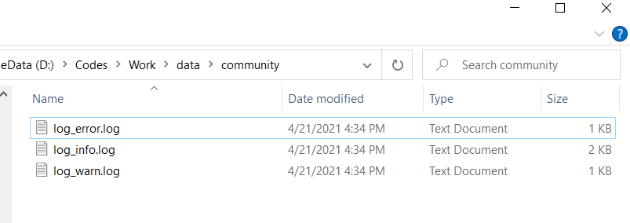

------

### 版本控制：

> 历史

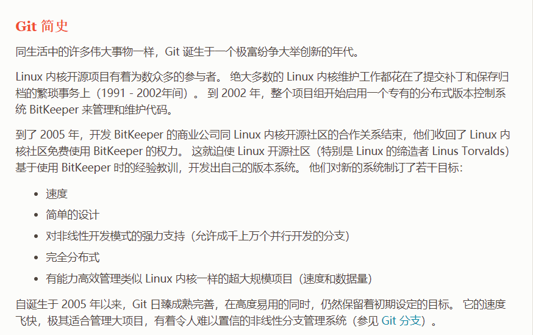

> [git book](https://git-scm.com/book/zh/v2)

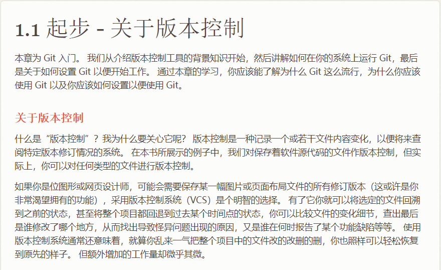


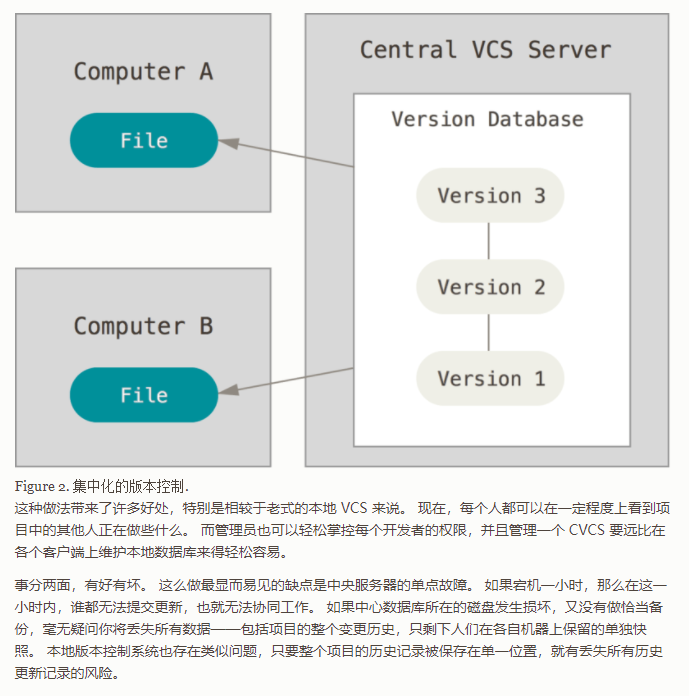


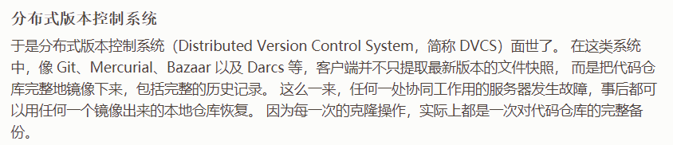

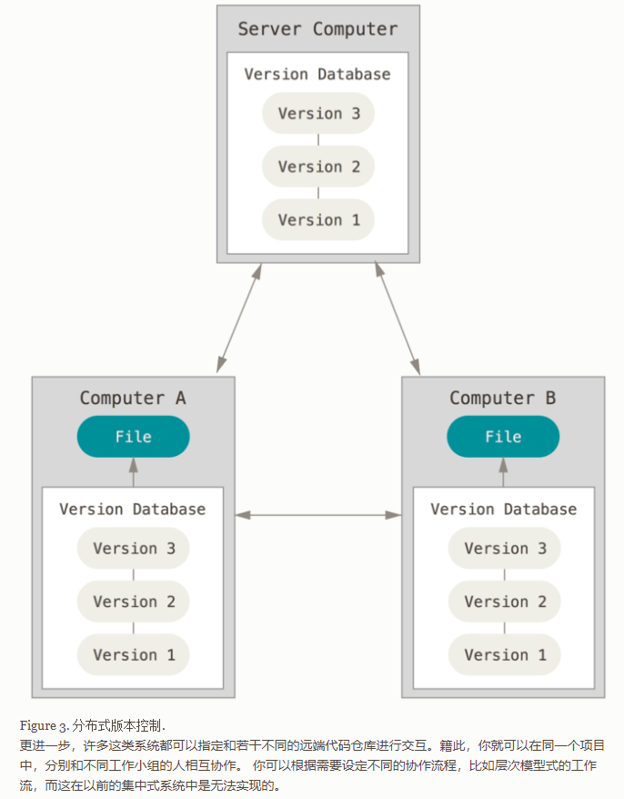

------

### 发送邮件


注册新浪邮箱，开启pop3服务：

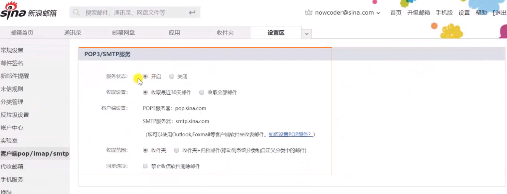

邮箱依赖：

```xml
<dependency>
    <groupId>org.springframework.boot</groupId>
    <artifactId>spring-boot-starter-mail</artifactId>
    <version>2.4.5</version>
</dependency>
```

邮箱配置：

```xml
# MailProperties
spring.mail.host=smtp.sina.com
spring.mail.port=465
spring.mail.username=jungle8884@sina.com
spring.mail.password=520310743ff6028f # 注意是授权码
spring.mail.protocol=smtps
spring.mail.properties.mail.smtp.ssl.enable=true
```

> 遇到的问题：org.springframework.mail.MailAuthenticationException: Authentication failed;

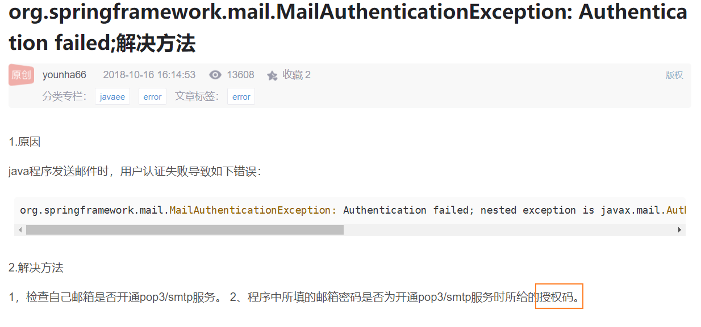

**注意：是授权码不是密码！**

------

### 注册功能

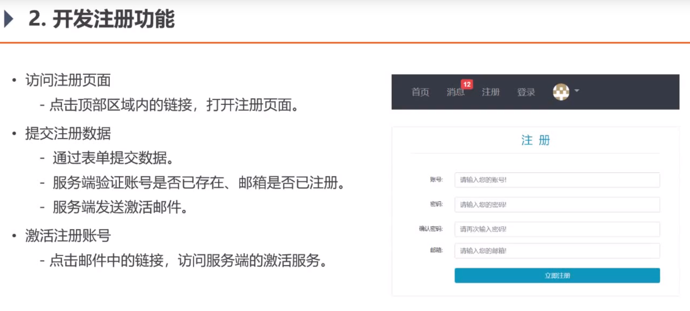

**需要的包：**

```xml
<dependency>
    <groupId>org.apache.commons</groupId>
    <artifactId>commons-lang3</artifactId>
    <version>3.12.0</version>
</dependency>
```

------

### 会话管理

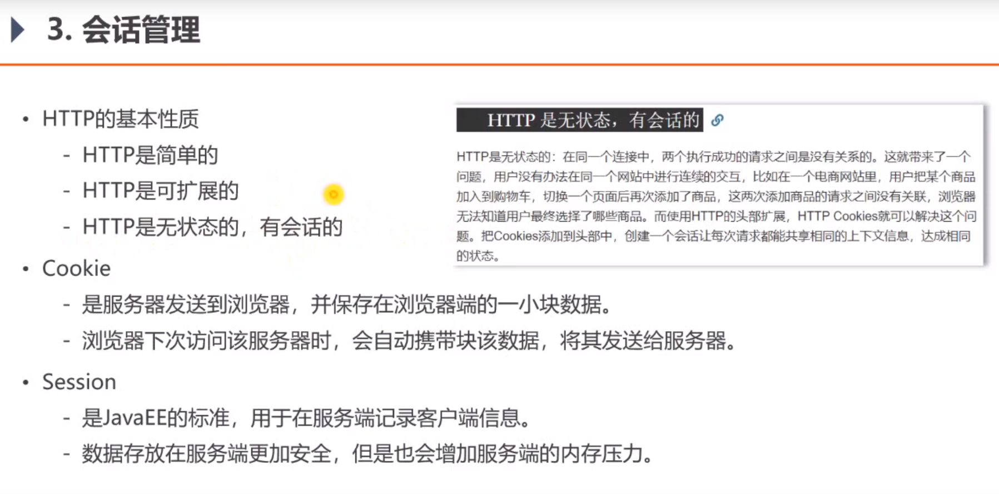

**服务器-分布式部署尽量不要使用Session！**


session 存放在nosql:redis数据库中。

------

### 生成验证码

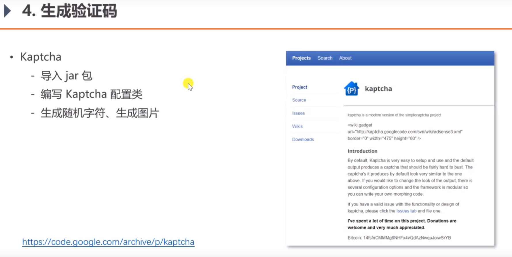

> 如何使用：

pom:

```xml
<dependency>
    <groupId>com.github.penggle</groupId>
    <artifactId>kaptcha</artifactId>
    <version>2.3.2</version>
</dependency>
```

配置服务器域名：

```properties
# community 网站域名，测试阶段为本机
community.path.domain=http://localhost:8080
```

js文件：

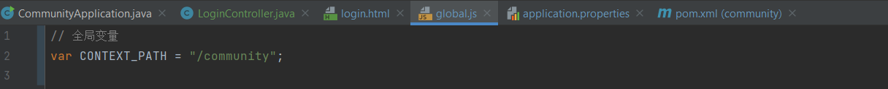

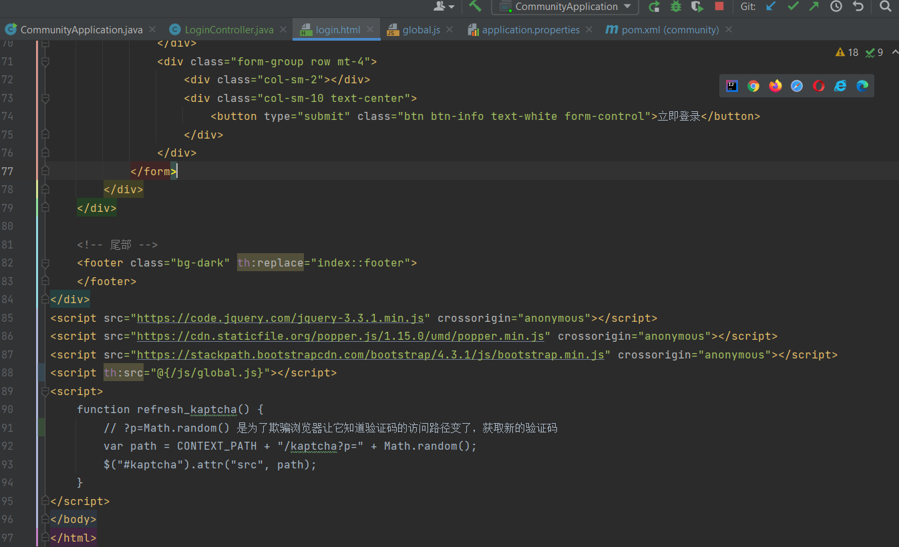

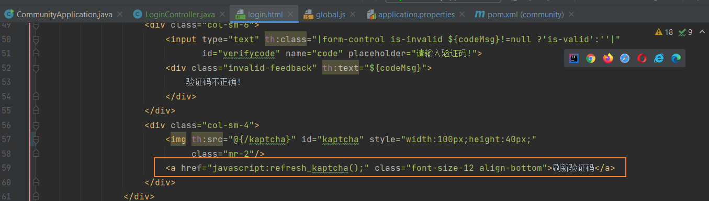

LoginController ：

```java
@GetMapping("/kaptcha")
public void getKaptcha(HttpServletResponse response, HttpSession session) {
    // 生成验证码
    String text = kaptchaProducer.createText();
    BufferedImage image = kaptchaProducer.createImage(text);

    // 将验证码存入session
    session.setAttribute("kaptcha", text);

    // 将图片输出给浏览器
    try {
        OutputStream os = response.getOutputStream();
        ImageIO.write(image, "png", os); // 输出图片
    } catch (IOException e) {
        logger.error("响应验证码失败：" + e.getMessage());
    }
}
```

------

### 登录、退出功能


注解中写sql:

- 动态sql

  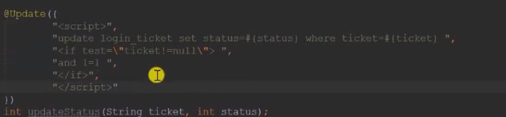

- 静态sql:

  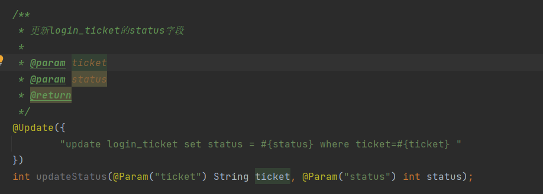

### 模板引擎遇到的问题!

[模板引擎](https://blog.csdn.net/DBC_121/article/details/104480132)

> 问题：在写模板引擎时，发现验证码提示信息不起作用！

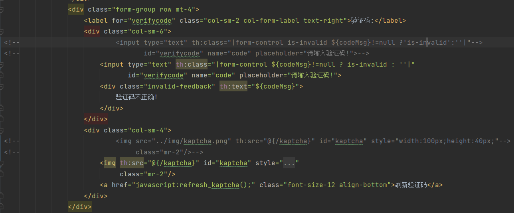

```js
<div class="col-sm-6">
    <input type="text" th:class="|form-control ${codeMsg}!=null ? is-invalid : ''|"
           id="verifycode" name="code" placeholder="请输入验证码!">
    <div class="invalid-feedback" th:text="${codeMsg}">
        验证码不正确!
    </div>
</div>
```

> index.html

```html
<!doctype html>
<html lang="en" xmlns:th="http://www.thymeleaf.org">
<head>
    <meta charset="utf-8">
    <meta name="viewport" content="width=device-width, initial-scale=1, shrink-to-fit=no">
    <link rel="icon" th:href="@{/img/icon.png}"/>
    <link rel="stylesheet" href="https://stackpath.bootstrapcdn.com/bootstrap/4.3.1/css/bootstrap.min.css" crossorigin="anonymous">
    <link rel="stylesheet" th:href="@{/css/global.css}" />
    <title>牛客网-首页</title>
</head>
<body>
<div class="nk-container">
    <!-- 头部 -->
    <header class="bg-dark sticky-top" th:fragment="header">
        <div class="container">
            <!-- 导航 -->
            <nav class="navbar navbar-expand-lg navbar-dark">

                <!-- logo -->
                <a class="navbar-brand" href="#"></a>
                <button class="navbar-toggler" type="button" data-toggle="collapse"
                        data-target="#navbarSupportedContent"
                        aria-controls="navbarSupportedContent"
                        aria-expanded="false"
                        aria-label="Toggle navigation">
                    <span class="navbar-toggler-icon"></span>
                </button>

                <!-- 功能 -->
                <div class="collapse navbar-collapse" id="navbarSupportedContent">
                    <ul class="navbar-nav mr-auto">
                        <li class="nav-item ml-3 btn-group-vertical">
                            <a class="nav-link" th:href="@{/index}">首页</a>
                        </li>
                        <li class="nav-item ml-3 btn-group-vertical">
                            <a class="nav-link position-relative" href="site/letter.html">消息<span class="badge badge-danger">12</span></a>
                        </li>
                        <li class="nav-item ml-3 btn-group-vertical">
                            <a class="nav-link" th:href="@{/register}">注册</a>
                        </li>
                        <li class="nav-item ml-3 btn-group-vertical">
                            <a class="nav-link" th:href="@{/login}">登录</a>
                        </li>
                        <li class="nav-item ml-3 btn-group-vertical dropdown">
                            <a class="nav-link dropdown-toggle" href="#" id="navbarDropdown" role="button" data-toggle="dropdown" aria-haspopup="true" aria-expanded="false">
                                
                            </a>
                            <div class="dropdown-menu" aria-labelledby="navbarDropdown">
                                <a class="dropdown-item text-center" href="site/profile.html">个人主页</a>
                                <a class="dropdown-item text-center" href="site/setting.html">账号设置</a>
                                <a class="dropdown-item text-center" th:href="@{/logout}">退出登录</a>
                                <div class="dropdown-divider"></div>
                                <span class="dropdown-item text-center text-secondary">nowcoder</span>
                            </div>
                        </li>
                    </ul>
                    <!-- 搜索 -->
                    <form class="form-inline my-2 my-lg-0" action="site/search.html">
                        <input class="form-control mr-sm-2" type="search" aria-label="Search" />
                        <button class="btn btn-outline-light my-2 my-sm-0" type="submit">搜索</button>
                    </form>
                </div>

            </nav>
        </div>
    </header>

    <!-- 内容 -->
    <div class="main">
        <div class="container">
            <div class="position-relative">
                <!-- 筛选条件 -->
                <ul class="nav nav-tabs mb-3">
                    <li class="nav-item">
                        <a class="nav-link active" href="#">最新</a>
                    </li>
                    <li class="nav-item">
                        <a class="nav-link" href="#">最热</a>
                    </li>
                </ul>
                <button type="button" class="btn btn-primary btn-sm position-absolute rt-0" data-toggle="modal" data-target="#publishModal">我要发布</button>
            </div>

            <!-- 弹出框 -->
            <div class="modal fade" id="publishModal" tabindex="-1" role="dialog" aria-labelledby="publishModalLabel" aria-hidden="true">
                <div class="modal-dialog modal-lg" role="document">
                    <div class="modal-content">
                        <div class="modal-header">
                            <h5 class="modal-title" id="publishModalLabel">新帖发布</h5>
                            <button type="button" class="close" data-dismiss="modal" aria-label="Close">
                                <span aria-hidden="true">&times;</span>
                            </button>
                        </div>
                        <div class="modal-body">
                            <form>
                                <div class="form-group">
                                    <label for="recipient-name" class="col-form-label">标题：</label>
                                    <input type="text" class="form-control" id="recipient-name">
                                </div>
                                <div class="form-group">
                                    <label for="message-text" class="col-form-label">正文：</label>
                                    <textarea class="form-control" id="message-text" rows="15"></textarea>
                                </div>
                            </form>
                        </div>
                        <div class="modal-footer">
                            <button type="button" class="btn btn-secondary" data-dismiss="modal">取消</button>
                            <button type="button" class="btn btn-primary" id="publishBtn">发布</button>
                        </div>
                    </div>
                </div>
            </div>

            <!-- 提示框 -->
            <div class="modal fade" id="hintModal" tabindex="-1" role="dialog" aria-labelledby="hintModalLabel" aria-hidden="true">
                <div class="modal-dialog modal-lg" role="document">
                    <div class="modal-content">
                        <div class="modal-header">
                            <h5 class="modal-title" id="hintModalLabel">提示</h5>
                        </div>
                        <div class="modal-body" id="hintBody">
                            发布完毕!
                        </div>
                    </div>
                </div>
            </div>

            <!-- 帖子列表 -->
            <ul class="list-unstyled">
                <li class="media pb-3 pt-3 mb-3 border-bottom" th:each="map:${discussPosts}">
                    <a href="site/profile.html">
                        
                    </a>
                    <div class="media-body">
                        <h6 class="mt-0 mb-3">
                            <a href="#" th:utext="${map.post.title}">备战春招，面试刷题跟他复习，一个月全搞定！</a>
                            <span class="badge badge-secondary bg-primary" th:if="${map.post.type==1}">置顶</span>
                            <span class="badge badge-secondary bg-danger"th:if="${map.post.status==1}">精华</span>
                        </h6>
                        <div class="text-muted font-size-12">
                            <u class="mr-3" th:utext="${map.user.username}">寒江雪</u> 发布于  <b th:text="${#dates.format(map.post.createTime,'yyyy-MM-dd HH:mm:ss')}">2019-04-15 15:32:18</b>
                            <ul class="d-inline float-right">
                                <li class="d-inline ml-2">赞 11</li>
                                <li class="d-inline ml-2">|</li>
                                <li class="d-inline ml-2">回帖 7</li>
                            </ul>
                        </div>
                    </div>
                </li>

            </ul>

            <!-- 分页 -->
            <nav class="mt-5"th:if="${page.rows>0}">
                <ul class="pagination justify-content-center">
                    <li class="page-item">
                        <a class="page-link" th:href="@{${page.path}(current=1)}">首页</a>
                    </li>
                    <li th:class="|page-item ${page.current==1?'disabled':''}|">
                        <a class="page-link" th:href="@{${page.path}(current=${page.current-1})}">上一页</a></li>
                    <li th:class="|page-item ${i==page.current?'active':''}|"  th:each="i:${#numbers.sequence(page.from,page.to)}">
                        <a class="page-link" th:href="@{${page.path}(current=${i})}" th:text="${i}">1</a>
                    </li>
                    <li th:class="|page-item ${page.current==page.total?'disabled':''}|">
                        <a class="page-link" th:href="@{${page.path}(current=${page.current+1})}">下一页</a>
                    </li>
                    <li class="page-item">
                        <a class="page-link" th:href="@{${page.path}(current=${page.total})}">末页</a>
                    </li>
                </ul>
            </nav>
        </div>
    </div>

    <!-- 尾部 -->
    <footer class="bg-dark" th:fragment="footer">
        <div class="container">
            <div class="row">
                <!-- 二维码 -->
                <div class="col-4 qrcode">
                    
                </div>
                <!-- 公司信息 -->
                <div class="col-8 detail-info">
                    <div class="row">
                        <div class="col">
                            <ul class="nav">
                                <li class="nav-item">
                                    <a class="nav-link text-light" href="#">关于我们</a>
                                </li>
                                <li class="nav-item">
                                    <a class="nav-link text-light" href="#">加入我们</a>
                                </li>
                                <li class="nav-item">
                                    <a class="nav-link text-light" href="#">意见反馈</a>
                                </li>
                                <li class="nav-item">
                                    <a class="nav-link text-light" href="#">企业服务</a>
                                </li>
                                <li class="nav-item">
                                    <a class="nav-link text-light" href="#">联系我们</a>
                                </li>
                                <li class="nav-item">
                                    <a class="nav-link text-light" href="#">免责声明</a>
                                </li>
                                <li class="nav-item">
                                    <a class="nav-link text-light" href="#">友情链接</a>
                                </li>
                            </ul>
                        </div>
                    </div>
                    <div class="row">
                        <div class="col">
                            <ul class="nav btn-group-vertical company-info">
                                <li class="nav-item text-white-50">
                                    公司地址：北京市朝阳区大屯路东金泉时代3-2708北京牛客科技有限公司
                                </li>
                                <li class="nav-item text-white-50">
                                    联系方式：010-60728802(电话)&nbsp;&nbsp;&nbsp;&nbsp;admin@nowcoder.com
                                </li>
                                <li class="nav-item text-white-50">
                                    牛客科技©2018 All rights reserved
                                </li>
                                <li class="nav-item text-white-50">
                                    京ICP备14055008号-4 &nbsp;&nbsp;&nbsp;&nbsp;
                                    
                                    京公网安备 11010502036488号
                                </li>
                            </ul>
                        </div>
                    </div>
                </div>
            </div>
        </div>
    </footer>
</div>

<script src="https://code.jquery.com/jquery-3.3.1.min.js" crossorigin="anonymous"></script>
<script src="https://cdnjs.cloudflare.com/ajax/libs/popper.js/1.14.7/umd/popper.min.js" crossorigin="anonymous"></script>
<script src="https://stackpath.bootstrapcdn.com/bootstrap/4.3.1/js/bootstrap.min.js" crossorigin="anonymous"></script>
<script th:src="@{js/global.js}"></script>
<script th:src="@{js/index.js}"></script>
</body>
</html>
```

**以验证码为例, 设置动态样式时, 去掉 `is-invalid` 的引号!**

> 完整login.html

```html
<!doctype html>
<html lang="en" xmlns:th="http://www.thymeleaf.org">
<head>
    <meta charset="utf-8">
    <meta name="viewport" content="width=device-width, initial-scale=1, shrink-to-fit=no">
    <link rel="icon" href="https://static.nowcoder.com/images/logo_87_87.png"/>
    <link rel="stylesheet" href="https://stackpath.bootstrapcdn.com/bootstrap/4.3.1/css/bootstrap.min.css"
          crossorigin="anonymous">
    <link rel="stylesheet" th:href="@{/css/global.css}"/>
    <link rel="stylesheet" th:href="@{/css/login.css}"/>
    <title>牛客网-登录</title>
</head>
<body>
<div class="nk-container">
    <!-- 头部 -->
    <header class="bg-dark sticky-top" th:replace="index::header">
    </header>

    <!-- 内容 -->
    <div class="main">
        <div class="container pl-5 pr-5 pt-3 pb-3 mt-3 mb-3">
            <h3 class="text-center text-info border-bottom pb-3">登&nbsp;&nbsp;录</h3>
            <form class="mt-5" method="post" th:action="@{/login}">
                <div class="form-group row">
                    <label for="username" class="col-sm-2 col-form-label text-right">账号:</label>
                    <div class="col-sm-10">
<!--                        <input type="text" th:class="|form-control is-invalid ${usernameMsg}!=null ?'is-valid':''|"-->
<!--                               th:value="${param.username}"-->
<!--                               id="username" name="username" placeholder="请输入您的账号!" required>-->
<!--                        th:value="${param.username}" 是从request参数中取值，-->
                        <input type="text" th:class="|form-control ${usernameMsg}!=null ? is-invalid : ''|"
                               th:value="${param.username}"
                               id="username" name="username" placeholder="请输入您的账号!" required>
                        <div class="invalid-feedback" th:text="${usernameMsg}">
                            该账号不存在!
                        </div>
                    </div>
                </div>
                <div class="form-group row mt-4">
                    <label for="password" class="col-sm-2 col-form-label text-right">密码:</label>
                    <div class="col-sm-10">
                        <input type="password"
                               th:class="|form-control ${passwordMsg}!=null ? is-invalid : ''|"
                               th:value="${param.password}"
                               id="password" name="password" placeholder="请输入您的密码!" required>
                        <div class="invalid-feedback" th:text="${passwordMsg}">
                            密码长度不能小于8位!
                        </div>
                    </div>
                </div>
                <div class="form-group row mt-4">
                    <label for="verifycode" class="col-sm-2 col-form-label text-right">验证码:</label>
                    <div class="col-sm-6">
                        <input type="text" th:class="|form-control ${codeMsg}!=null ? is-invalid : ''|"
                               id="verifycode" name="code" placeholder="请输入验证码!">
                        <div class="invalid-feedback" th:text="${codeMsg}">
                            验证码不正确!
                        </div>
                    </div>
                    <div class="col-sm-4">
                        
                        <a href="javascript:refresh_kaptcha();" class="font-size-12 align-bottom">刷新验证码</a>
                    </div>
                </div>
                <div class="form-group row mt-4">
                    <div class="col-sm-2"></div>
                    <div class="col-sm-10">
                        <input type="checkbox" id="remember-me" name="rememberme"
                               th:checked="${param.rememberme}">
                        <label class="form-check-label" for="remember-me">记住我</label>
                        <a href="forget.html" class="text-danger float-right">忘记密码?</a>
                    </div>
                </div>
                <div class="form-group row mt-4">
                    <div class="col-sm-2"></div>
                    <div class="col-sm-10 text-center">
                        <button type="submit" class="btn btn-info text-white form-control">立即登录</button>
                    </div>
                </div>
            </form>
        </div>
    </div>

    <!-- 尾部 -->
    <footer class="bg-dark" th:replace="index::footer">
    </footer>
</div>
<script src="https://code.jquery.com/jquery-3.3.1.min.js" crossorigin="anonymous"></script>
<script src="https://cdn.staticfile.org/popper.js/1.15.0/umd/popper.min.js" crossorigin="anonymous"></script>
<script src="https://stackpath.bootstrapcdn.com/bootstrap/4.3.1/js/bootstrap.min.js" crossorigin="anonymous"></script>
<script th:src="@{/js/global.js}"></script>
<script>
    function refresh_kaptcha() {
        // ?p=Math.random() 是为了欺骗浏览器让它知道验证码的访问路径变了，获取新的验证码
        var path = CONTEXT_PATH + "/kaptcha?p=" + Math.random();
        $("#kaptcha").attr("src", path);
    }
</script>
</body>
</html>
```

> 完整register页面

```html
<!doctype html >
<html lang="en" xmlns:th="http://www.thymeleaf.org">
<head>
    <meta charset="utf-8">
    <meta name="viewport" content="width=device-width, initial-scale=1, shrink-to-fit=no">
    <link rel="icon" href="https://static.nowcoder.com/images/logo_87_87.png"/>
    <link rel="stylesheet" href="https://stackpath.bootstrapcdn.com/bootstrap/4.3.1/css/bootstrap.min.css"
          crossorigin="anonymous">
    <link rel="stylesheet" th:href="@{/css/global.css}"/>
    <link rel="stylesheet" th:href="@{/css/login.css}"/>
    <title>牛客网-注册</title>
</head>
<body>
<div class="nk-container">
    <!-- 头部 复用 index.html 的header-->
    <header class="bg-dark sticky-top" th:replace="index::header">
    </header>

    <!-- 内容 -->
    <div class="main">
        <div class="container pl-5 pr-5 pt-3 pb-3 mt-3 mb-3">
            <h3 class="text-center text-info border-bottom pb-3">注&nbsp;&nbsp;册</h3>
            <form class="mt-5" method="post" action="#" th:action="@{/register}">
                <div class="form-group row">
                    <label for="username" class="col-sm-2 col-form-label text-right">账号:</label>
                    <div class="col-sm-10">
                        <input type="text" th:class="|form-control ${usernameMsg} != null ? is-invalid : ''}|"
                               th:value="${user != null ? user.username : ''}"
                               id="username" name="username" placeholder="请输入您的账号!" required>
                        <div class="invalid-feedback" th:text="${usernameMsg}">
                            该账号已存在!
                        </div>
                    </div>
                </div>
                <div class="form-group row mt-4">
                    <label for="password" class="col-sm-2 col-form-label text-right">密码:</label>
                    <div class="col-sm-10">
                        <input type="password" th:class="|form-control ${passwordMsg} != null ? is-invalid : ''}|"
                               th:value="${user != null ? user.password : ''}"
                               id="password" name="password" placeholder="请输入您的密码!" required>
                        <div class="invalid-feedback" th:text="${passwordMsg}">
                            密码长度不能小于8位!
                        </div>
                    </div>
                </div>
                <div class="form-group row mt-4">
                    <label for="confirm-password" class="col-sm-2 col-form-label text-right">确认密码:</label>
                    <div class="col-sm-10">
                        <input type="password" class="form-control"
                               th:value="${user != null ? user.password : ''}"
                               id="confirm-password" placeholder="请再次输入密码!" required>
                        <div class="invalid-feedback">
                            两次输入的密码不一致!
                        </div>
                    </div>
                </div>
                <div class="form-group row">
                    <label for="email" class="col-sm-2 col-form-label text-right">邮箱:</label>
                    <div class="col-sm-10">
                        <input type="email" th:class="|form-control ${emailMsg} != null ? is-invalid : ''}|"
                               th:value="${user != null ? user.email : ''}"
                               id="email" name="email" placeholder="请输入您的邮箱!" required>
                        <div class="invalid-feedback" th:text="${emailMsg}">
                            该邮箱已注册!
                        </div>
                    </div>
                </div>
                <div class="form-group row mt-4">
                    <div class="col-sm-2"></div>
                    <div class="col-sm-10 text-center">
                        <button type="submit" class="btn btn-info text-white form-control">立即注册</button>
                    </div>
                </div>
            </form>
        </div>
    </div>

    <!-- 尾部 -->
    <footer class="bg-dark" th:replace="index::footer">
    </footer>
</div>

<script src="https://code.jquery.com/jquery-3.3.1.min.js" crossorigin="anonymous"></script>
<script src="https://cdn.staticfile.org/popper.js/1.15.0/umd/popper.min.js" crossorigin="anonymous"></script>
<script src="https://stackpath.bootstrapcdn.com/bootstrap/4.3.1/js/bootstrap.min.js" crossorigin="anonymous"></script>
<script th:src="@{/js/global.js}"></script>
<script th:src="@{/js/register.js}"></script>
</body>
</html>
```


------

### 显示登录信息

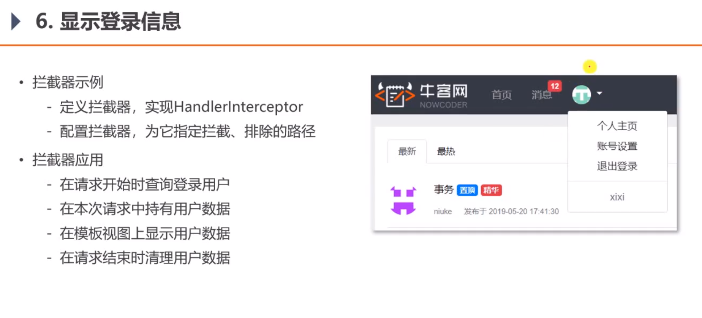

**业务逻辑演示:**

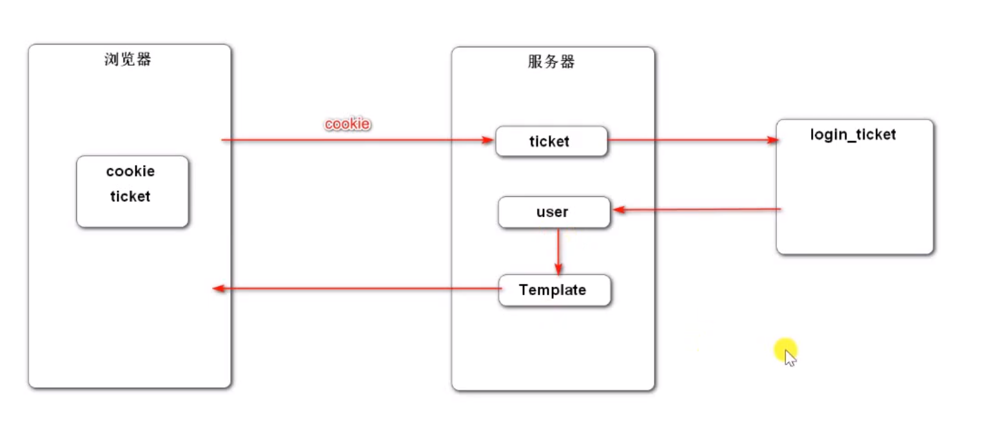

**因为user信息比较敏感, 浏览器只存与user相关的凭证, user存在数据库中.**

------

### 账号设置

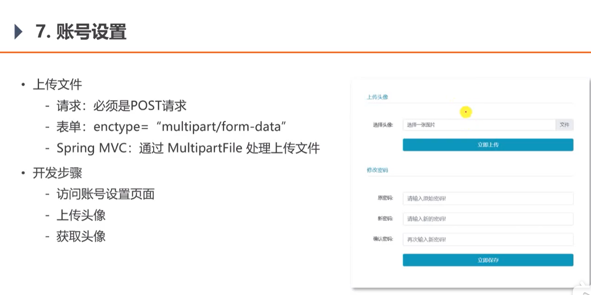

> setting.html
>
> 关键网页代码

```html
<!-- 上传头像 -->
<h6 class="text-left text-info border-bottom pb-2">上传头像</h6>
<form class="mt-5" method="post" enctype="multipart/form-data" th:action="@{/user/upload}">
    <div class="form-group row mt-4">
        <label for="head-image" class="col-sm-2 col-form-label text-right">选择头像:</label>
        <div class="col-sm-10">
            <div class="custom-file">
                <input type="file" th:class="|custom-file-input ${error!=null ? is-invalid : ''}|"
                       id="head-image" name="headerImage" lang="es" required="">
                <label class="custom-file-label" for="head-image" data-browse="文件">选择一张图片</label>
                <div class="invalid-feedback" th:text="${error}">
                    该图片不存在！
                </div>
            </div>
        </div>
    </div>
    <div class="form-group row mt-4">
        <div class="col-sm-2"></div>
        <div class="col-sm-10 text-center">
            <button type="submit" class="btn btn-info text-white form-control">立即上传</button>
        </div>
    </div>
</form>
```


------

### 检查登录状态


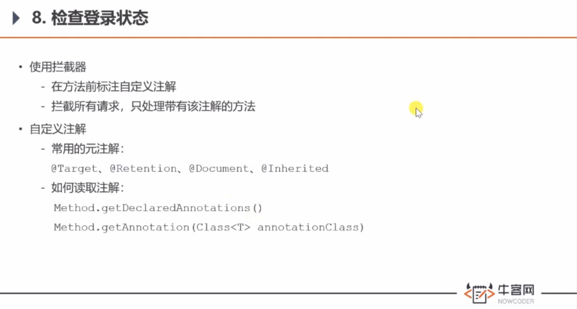

> 自定义注解: LoginRequired

```java
package com.nowcoder.community.annotation;

import java.lang.annotation.ElementType;
import java.lang.annotation.Retention;
import java.lang.annotation.RetentionPolicy;
import java.lang.annotation.Target;

/*
* 规定需要登录
* 具体在拦截器中设置逻辑
* */
@Target(ElementType.METHOD)
@Retention(RetentionPolicy.RUNTIME)
public @interface LoginRequired {

}
```

> 新建拦截器: LoginRequiredInterceptor

```Java
package com.nowcoder.community.controller.interceptor;

import com.nowcoder.community.annotation.LoginRequired;
import com.nowcoder.community.util.HostHolder;
import org.springframework.beans.factory.annotation.Autowired;
import org.springframework.stereotype.Component;
import org.springframework.web.method.HandlerMethod;
import org.springframework.web.servlet.HandlerInterceptor;

import javax.servlet.http.HttpServletRequest;
import javax.servlet.http.HttpServletResponse;
import java.lang.reflect.Method;

@Component
public class LoginRequiredInterceptor implements HandlerInterceptor {

    @Autowired
    private HostHolder hostHolder;

    /**
     * 在Controller之前执行
     * 在请求之前将user暂存到hostHolder
     * @param request
     * @param response
     * @param handler 只判断拦截的是否是 方法
     * @return
     * @throws Exception
     */
    @Override
    public boolean preHandle(
            HttpServletRequest request, HttpServletResponse response, Object handler)
            throws Exception {
        if (handler instanceof HandlerMethod) {
            HandlerMethod handlerMethod = (HandlerMethod) handler;
            Method method = handlerMethod.getMethod(); //获取拦截到的method对象
            LoginRequired loginRequired = method.getAnnotation(LoginRequired.class); //只拦截添加了注解的方法
            // 不为null表示需要登录才行; 第二个null表示没获取到user即没登录.
            if (loginRequired != null && hostHolder.getUser() == null) {
                // /community+/login
                response.sendRedirect(request.getContextPath() + "/login");
                System.out.println("----------------------拦截---------------------");
                return false;
            }
        }
        return true;
    }

}
```

> 注入拦截器到 WebMvcConfig

```Java
package com.nowcoder.community.config;

import com.nowcoder.community.controller.interceptor.AlphaInterceptor;
import com.nowcoder.community.controller.interceptor.LoginRequiredInterceptor;
import com.nowcoder.community.controller.interceptor.LoginTicketInterceptor;
import org.springframework.beans.factory.annotation.Autowired;
import org.springframework.context.annotation.Configuration;
import org.springframework.web.servlet.config.annotation.InterceptorRegistry;
import org.springframework.web.servlet.config.annotation.WebMvcConfigurer;

@Configuration
public class WebMvcConfig implements WebMvcConfigurer {

    @Autowired
    private AlphaInterceptor alphaInterceptor;

    @Autowired
    private LoginTicketInterceptor loginTicketInterceptor;

    @Autowired
    private LoginRequiredInterceptor loginRequiredInterceptor;

    @Override
    public void addInterceptors(InterceptorRegistry registry) {
        registry
                .addInterceptor(alphaInterceptor) //注入拦截器
                .excludePathPatterns("/*/*.css", "/*/*.js", "/*/*.png", "/*/*.jpg", "/*/*.jpeg") //排除静态资源
                .addPathPatterns("/register", "/login"); //明确要拦截的路径

        registry
                .addInterceptor(loginTicketInterceptor) //注入拦截器
                .excludePathPatterns("/*/*.css", "/*/*.js", "/*/*.png", "/*/*.jpg", "/*/*.jpeg"); //排除静态资源

        registry
                .addInterceptor(loginRequiredInterceptor) //注入拦截器
                .excludePathPatterns("/*/*.css", "/*/*.js", "/*/*.png", "/*/*.jpg", "/*/*.jpeg"); //排除静态资源
    }
}
```


> UserController-在需要登录的方法上里添加添加注解: 

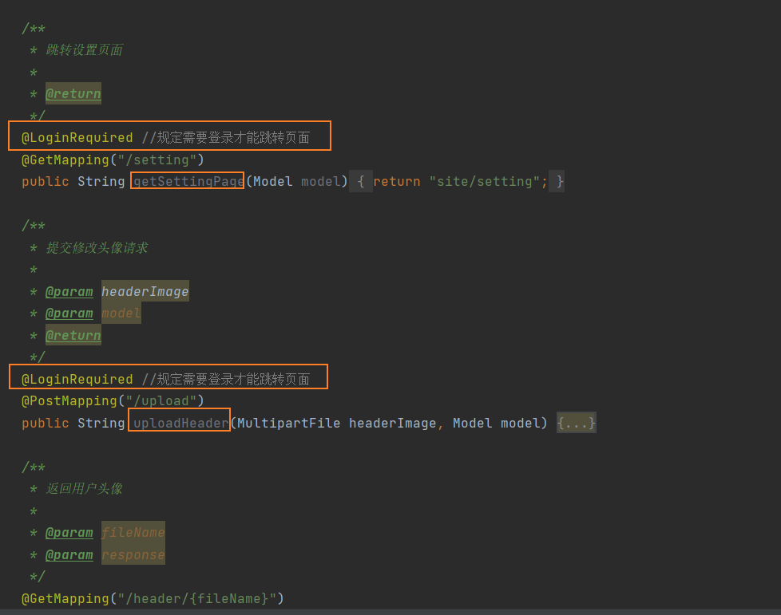

```Java
package com.nowcoder.community.controller;

import com.nowcoder.community.annotation.LoginRequired;
import com.nowcoder.community.entity.User;
import com.nowcoder.community.service.UserService;
import com.nowcoder.community.util.CommunityUtil;
import com.nowcoder.community.util.HostHolder;
import org.apache.commons.lang3.StringUtils;
import org.slf4j.Logger;
import org.slf4j.LoggerFactory;
import org.springframework.beans.factory.annotation.Autowired;
import org.springframework.beans.factory.annotation.Value;
import org.springframework.stereotype.Controller;
import org.springframework.ui.Model;
import org.springframework.web.bind.annotation.GetMapping;
import org.springframework.web.bind.annotation.PathVariable;
import org.springframework.web.bind.annotation.PostMapping;
import org.springframework.web.bind.annotation.RequestMapping;
import org.springframework.web.multipart.MultipartFile;

import javax.servlet.http.HttpServletResponse;
import java.io.File;
import java.io.FileInputStream;
import java.io.IOException;
import java.io.OutputStream;

@Controller
@RequestMapping("/user")
public class UserController {

    private static final Logger logger = LoggerFactory.getLogger(UserController.class);

    @Value("${community.path.upload}")
    private String uploadPath;

    @Value("${community.path.domain}")
    private String domain;

    @Value("${server.servlet.context-path}")
    private String contextPath;

    @Autowired
    private UserService userService;

    @Autowired
    private HostHolder hostHolder;

    /**
     * 跳转设置页面
     *
     * @return
     */
    @LoginRequired //规定需要登录才能跳转页面
    @GetMapping("/setting")
    public String getSettingPage(Model model) {
        return "site/setting";
    }

    /**
     * 提交修改头像请求
     *
     * @param headerImage
     * @param model
     * @return
     */
    @LoginRequired //规定需要登录才能跳转页面
    @PostMapping("/upload")
    public String uploadHeader(MultipartFile headerImage, Model model) {
        // 判断有没有图片
        if (headerImage == null) {
            model.addAttribute("error", "您还没有选择图片！");
            return "site/setting";
        }

        // 通过图片的后缀名来判断图片格式
        String fileName = headerImage.getOriginalFilename();
        String suffix = fileName.substring(fileName.lastIndexOf("."));
        if (StringUtils.isBlank(suffix)) {
            model.addAttribute("error", "文件格式不正确！");
            return "site/setting";
        }

        // 生成随机文件名
        fileName = CommunityUtil.generateUUID() + suffix;
        // 确定文件存放的路径
        File dest = new File(uploadPath + "/" + fileName);
        try {
            // 存储文件
            headerImage.transferTo(dest);
        } catch (IOException e) {
            logger.error("上传文件失败：", e.getMessage());
            throw new RuntimeException("上传文件失败，服务器发生异常！", e);
        }

        // 更新当前用户头像的路径(web访问路径)
        // http://localhost:8080/community/user/header/xxx.png
        User user = hostHolder.getUser();
        String headerUrl = domain + contextPath + "/user/header/" + fileName;
        userService.updateHeader(user.getId(), headerUrl);

        return "redirect:/index";
    }

    /**
     * 返回用户头像
     *
     * @param fileName
     * @param response
     */
    @GetMapping("/header/{fileName}")
    public void getHeader(@PathVariable("fileName") String fileName, HttpServletResponse response) {
        // 服务器存放路径
        fileName = uploadPath + "/" + fileName;
        // 文件后缀
        String suffix = fileName.substring(fileName.lastIndexOf("."));
        // 响应图片
        response.setContentType("image/" + suffix);

        try (FileInputStream fis = new FileInputStream(fileName);
             OutputStream os = response.getOutputStream(); ) {
            byte[] buffer = new byte[1024];
            int b = 0;
            while ((b = fis.read(buffer)) != -1) { // 读到b个字节的数据, 最大1024个字节
                os.write(buffer, 0, b);
            }
        } catch (IOException e) {
            logger.error("读取文件失败：", e.getMessage());
        }
    }

}
```

------

## 第三章内容


