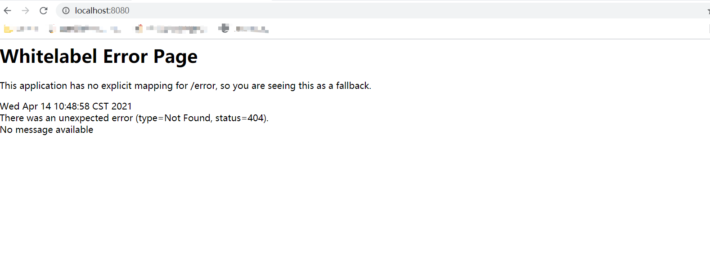

# 牛客 Java 高级工程师

## 搭建开发环境

### 搭建开发环境--Maven


- [下载链接](http://maven.apache.org/)

- [阿里云镜像仓库](https://maven.aliyun.com/mvn/view)

  - 复制镜像链接：[central](https://maven.aliyun.com/repository/central)
  - 配置镜像：安装目录\apache-maven-3.8.1\conf\settings.xml

  ```
  <mirror>
        <id>maven-aliyun</id>
        <mirrorOf>central</mirrorOf>
        <name>Maven aliyun</name>
        <url>https://maven.aliyun.com/repository/central</url>
  </mirror>
  ```

  - 配置环境变量：Path中加上`D:\apache-maven-3.8.1-bin\apache-maven-3.8.1\bin`

  ```
  C:\Users\LeBro>mvn --version
  Apache Maven 3.8.1 (05c21c65bdfed0f71a2f2ada8b84da59348c4c5d)
  Maven home: D:\apache-maven-3.8.1-bin\apache-maven-3.8.1\bin\..
  Java version: 11.0.10, vendor: AdoptOpenJDK, runtime: C:\Program Files\AdoptOpenJDK\jdk-11.0.10.9-hotspot
  Default locale: zh_CN, platform encoding: GBK
  OS name: "windows 10", version: "10.0", arch: "amd64", family: "windows"
  ```

#### 使用CMD命令创建项目

- maven命令：[快速上手](http://maven.apache.org/guides/getting-started/maven-in-five-minutes.html)

> 先切换到你要创建项目的目录

- 创建项目

```
D:\Codes>cd Work
# archetype:generate 		以模板原型方式生成文件
# DgroupId					组织ID: 通常写公司域名倒序.项目名
# DartifactId				项目ID
# DarchetypeArtifactId		项目模板ID
# DinteractiveMode=false	是否启用交互模式
D:\Codes\Work>mvn archetype:generate -DgroupId=com.jungle8884.mavendemo1 -DartifactId=mavendemo1 -DarchetypeArtifactId=maven-archetype-quickstart -DarchetypeVersion=1.4 -DinteractiveMode=false
# 创建成功
[INFO] Scanning for projects...
[INFO]
[INFO] ------------------< org.apache.maven:standalone-pom >-------------------
[INFO] Building Maven Stub Project (No POM) 1
[INFO] --------------------------------[ pom ]---------------------------------
[INFO]
[INFO] >>> maven-archetype-plugin:3.2.0:generate (default-cli) > generate-sources @ standalone-pom >>>
[INFO]
[INFO] <<< maven-archetype-plugin:3.2.0:generate (default-cli) < generate-sources @ standalone-pom <<<
[INFO]
[INFO]
[INFO] --- maven-archetype-plugin:3.2.0:generate (default-cli) @ standalone-pom ---
[INFO] Generating project in Batch mode
[WARNING] No archetype found in remote catalog. Defaulting to internal catalog
[INFO] ----------------------------------------------------------------------------
[INFO] Using following parameters for creating project from Archetype: maven-archetype-quickstart:1.4
[INFO] ----------------------------------------------------------------------------
[INFO] Parameter: groupId, Value: com.jungle8884.mavendemo1
[INFO] Parameter: artifactId, Value: mavendemo1
[INFO] Parameter: version, Value: 1.0-SNAPSHOT
[INFO] Parameter: package, Value: com.jungle8884.mavendemo1
[INFO] Parameter: packageInPathFormat, Value: com/jungle8884/mavendemo1
[INFO] Parameter: package, Value: com.jungle8884.mavendemo1
[INFO] Parameter: groupId, Value: com.jungle8884.mavendemo1
[INFO] Parameter: artifactId, Value: mavendemo1
[INFO] Parameter: version, Value: 1.0-SNAPSHOT
[INFO] Project created from Archetype in dir: D:\Codes\Work\mavendemo1
[INFO] ------------------------------------------------------------------------
[INFO] BUILD SUCCESS
[INFO] ------------------------------------------------------------------------
[INFO] Total time:  2.746 s
[INFO] Finished at: 2021-04-13T16:46:21+08:00
[INFO] ------------------------------------------------------------------------
```

- 查看：D:\Codes\Work\mavendemo1\src

  - main: 开发代码
  - test: 测试代码

- 查看仓库：C:\Users\LeBro\.m2\repository

  - 远程仓库下载的资源都放在这里

- 在该目录下编译：D:\Codes\Work\mavendemo1

  - 会生成taget文件夹
  - 如下图：

  

  ```
  D:\Codes\Work\mavendemo1>mvn compile
  [INFO] Scanning for projects...
  [INFO]
  [INFO] ----------------< com.jungle8884.mavendemo1:mavendemo1 >----------------
  [INFO] Building mavendemo1 1.0-SNAPSHOT
  [INFO] --------------------------------[ jar ]---------------------------------
  [INFO] Changes detected - recompiling the module!
  [INFO] Compiling 1 source file to D:\Codes\Work\mavendemo1\target\classes
  [INFO] ------------------------------------------------------------------------
  [INFO] BUILD SUCCESS
  [INFO] ------------------------------------------------------------------------
  [INFO] Total time:  27.798 s
  [INFO] Finished at: 2021-04-13T16:54:41+08:00
  [INFO] ------------------------------------------------------------------------
  ```

- 在该目录下清除：D:\Codes\Work\mavendemo1

  ```
  D:\Codes\Work\mavendemo1>mvn clean
  [INFO] Scanning for projects...
  [INFO]
  [INFO] ----------------< com.jungle8884.mavendemo1:mavendemo1 >----------------
  [INFO] Building mavendemo1 1.0-SNAPSHOT
  [INFO] --------------------------------[ jar ]---------------------------------
  [INFO]
  [INFO] --- maven-clean-plugin:3.1.0:clean (default-clean) @ mavendemo1 ---
  [INFO] Deleting D:\Codes\Work\mavendemo1\target
  [INFO] ------------------------------------------------------------------------
  [INFO] BUILD SUCCESS
  [INFO] ------------------------------------------------------------------------
  [INFO] Total time:  2.505 s
  [INFO] Finished at: 2021-04-13T17:15:18+08:00
  [INFO] ------------------------------------------------------------------------
  ```

- 也可以组合使用：编译前先清除

  ```
  D:\Codes\Work\mavendemo1>mvn clean compile
  [INFO] Scanning for projects...
  [INFO]
  [INFO] ----------------< com.jungle8884.mavendemo1:mavendemo1 >----------------
  [INFO] Building mavendemo1 1.0-SNAPSHOT
  [INFO] --------------------------------[ jar ]---------------------------------
  [INFO]
  [INFO] --- maven-clean-plugin:3.1.0:clean (default-clean) @ mavendemo1 ---
  [INFO]
  [INFO] --- maven-resources-plugin:3.0.2:resources (default-resources) @ mavendemo1 ---
  [INFO] Using 'UTF-8' encoding to copy filtered resources.
  [INFO] skip non existing resourceDirectory D:\Codes\Work\mavendemo1\src\main\resources
  [INFO]
  [INFO] --- maven-compiler-plugin:3.8.0:compile (default-compile) @ mavendemo1 ---
  [INFO] Changes detected - recompiling the module!
  [INFO] Compiling 1 source file to D:\Codes\Work\mavendemo1\target\classes
  [INFO] ------------------------------------------------------------------------
  [INFO] BUILD SUCCESS
  [INFO] ------------------------------------------------------------------------
  [INFO] Total time:  1.422 s
  [INFO] Finished at: 2021-04-13T17:19:36+08:00
  [INFO] ------------------------------------------------------------------------
  ```

- 测试使用

  ```
  D:\Codes\Work\mavendemo1>mvn clean test
  [INFO] Scanning for projects...
  [INFO]
  [INFO] ----------------< com.jungle8884.mavendemo1:mavendemo1 >----------------
  [INFO] Building mavendemo1 1.0-SNAPSHOT
  [INFO] --------------------------------[ jar ]---------------------------------
  [INFO]
  [INFO] --- maven-clean-plugin:3.1.0:clean (default-clean) @ mavendemo1 ---
  [INFO] Deleting D:\Codes\Work\mavendemo1\target
  [INFO]
  [INFO] --- maven-resources-plugin:3.0.2:resources (default-resources) @ mavendemo1 ---
  [INFO] Using 'UTF-8' encoding to copy filtered resources.
  [INFO] skip non existing resourceDirectory D:\Codes\Work\mavendemo1\src\main\resources
  [INFO]
  [INFO] --- maven-compiler-plugin:3.8.0:compile (default-compile) @ mavendemo1 ---
  [INFO] Changes detected - recompiling the module!
  [INFO] Compiling 1 source file to D:\Codes\Work\mavendemo1\target\classes
  [INFO]
  [INFO] --- maven-resources-plugin:3.0.2:testResources (default-testResources) @ mavendemo1 ---
  [INFO] Using 'UTF-8' encoding to copy filtered resources.
  [INFO] skip non existing resourceDirectory D:\Codes\Work\mavendemo1\src\test\resources
  [INFO]
  [INFO] --- maven-compiler-plugin:3.8.0:testCompile (default-testCompile) @ mavendemo1 ---
  [INFO] Changes detected - recompiling the module!
  [INFO] Compiling 1 source file to D:\Codes\Work\mavendemo1\target\test-classes
  [INFO]
  [INFO] --- maven-surefire-plugin:2.22.1:test (default-test) @ mavendemo1 ---
  [INFO]
  [INFO] -------------------------------------------------------
  [INFO]  T E S T S
  [INFO] -------------------------------------------------------
  [INFO] Running com.jungle8884.mavendemo1.AppTest
  [INFO] Tests run: 1, Failures: 0, Errors: 0, Skipped: 0, Time elapsed: 0.062 s - in com.jungle8884.mavendemo1.AppTest
  [INFO]
  [INFO] Results:
  [INFO]
  [INFO] Tests run: 1, Failures: 0, Errors: 0, Skipped: 0
  [INFO]
  [INFO] ------------------------------------------------------------------------
  [INFO] BUILD SUCCESS
  [INFO] ------------------------------------------------------------------------
  [INFO] Total time:  15.081 s
  [INFO] Finished at: 2021-04-13T17:22:53+08:00
  [INFO] ------------------------------------------------------------------------
  ```

  - 生成对应目录：D:\Codes\Work\mavendemo1\target\test-classes\com\jungle8884\mavendemo1
  - 生成对应文件：AppTest.class
  - 如下图：


#### 使用IntelliJ IDEA创建项目

> 在`IntelliJ IDEA`里配置`Maven`，主要是以下两个安装目录和配置文件

- `D:\apache-maven-3.8.1`

- `D:\apache-maven-3.8.1\conf\settings.xml`

  

- 新建Maven项目：

  

  

  

  


- 发现与CMD命令创建一致！

  


- 发现运行时出错：不能运行App.java文件

  - 不断尝试后，发现换了个最新的IntelliJ IDEA 2021版本
  - 成功运行！

  

------

### 搭建开发环境--Spring

#### 搭建开发环境--Spring Initializer

[链接](https://start.spring.io)


- generate project


- 自己在操作时发现没有AOP，于是只能自己添加！

  ```xml
  <!--使用Spring Initializr时视频中能搜到AOP，我搜不到，下面是手动加的-->
  		<dependency>
  			<groupId>org.springframework.boot</groupId>
  			<artifactId>spring-boot-starter-aop</artifactId>
  		</dependency>
  		<!--使用Spring Initializr时视频中能搜到AOP，我搜不到，上面是手动加的-->
  ```

- 完整的pom.xml文件：

  ```xml
  <?xml version="1.0" encoding="UTF-8"?>
  <project xmlns="http://maven.apache.org/POM/4.0.0" xmlns:xsi="http://www.w3.org/2001/XMLSchema-instance"
  	xsi:schemaLocation="http://maven.apache.org/POM/4.0.0 https://maven.apache.org/xsd/maven-4.0.0.xsd">
  	<modelVersion>4.0.0</modelVersion>
  	<parent>
  		<groupId>org.springframework.boot</groupId>
  		<artifactId>spring-boot-starter-parent</artifactId>
  		<version>2.4.4</version>
  		<relativePath/> <!-- lookup parent from repository -->
  	</parent>
  	<groupId>com.nowcoder.community</groupId>
  	<artifactId>community</artifactId>
  	<version>0.0.1-SNAPSHOT</version>
  	<name>community</name>
  	<description>nowcoder community</description>
  	<properties>
  		<java.version>11</java.version>
  	</properties>
  	<dependencies>
  		<!--使用Spring Initializr时视频中能搜到AOP，我搜不到，下面是手动加的-->
  		<dependency>
  			<groupId>org.springframework.boot</groupId>
  			<artifactId>spring-boot-starter-aop</artifactId>
  		</dependency>
  		<!--使用Spring Initializr时视频中能搜到AOP，我搜不到，上面是手动加的-->
  		<dependency>
  			<groupId>org.springframework.boot</groupId>
  			<artifactId>spring-boot-starter-thymeleaf</artifactId>
  		</dependency>
  		<dependency>
  			<groupId>org.springframework.boot</groupId>
  			<artifactId>spring-boot-starter-web</artifactId>
  		</dependency>
  
  		<dependency>
  			<groupId>org.springframework.boot</groupId>
  			<artifactId>spring-boot-devtools</artifactId>
  			<scope>runtime</scope>
  			<optional>true</optional>
  		</dependency>
  		<dependency>
  			<groupId>org.springframework.boot</groupId>
  			<artifactId>spring-boot-starter-test</artifactId>
  			<scope>test</scope>
  		</dependency>
  	</dependencies>
  
  	<build>
  		<plugins>
  			<plugin>
  				<groupId>org.springframework.boot</groupId>
  				<artifactId>spring-boot-maven-plugin</artifactId>
  			</plugin>
  		</plugins>
  	</build>
  
  </project>
  
  ```

- 测试：CommunityApplicationTests

  

- 运行：CommunityApplication

  

  Spring boot 会启动 tomcat：http://localhost:8080/

   

  ------

#### 搭建开发环境 Spring Boot 入门示例


> 入门示例

1. 新建controller包，再新建AlphaController示例类


2. 自己写一个sayHello方法，再添上对应的注解

   

3. 示例代码：

   ```java
   package com.nowcoder.community.controller;
   
   import org.springframework.stereotype.Controller;
   import org.springframework.web.bind.annotation.RequestMapping;
   import org.springframework.web.bind.annotation.ResponseBody;
   
   @Controller
   @RequestMapping("/alpha")
   public class AlphaController {
       @RequestMapping("/hello")
       @ResponseBody
       public String sayHello() {
           return "Hello Spring Boot.";
       }
   }
   ```

4. 打开本地服务器页面：http://localhost:8080/alpha/hello

   

5. 可能会遇到的问题：8080端口被占用了

   - 可以自己在resources文件夹下的application.properties中设置端口

   ```
   server.port=8090
   server.servlet.context-path=/community
   ```

   - 输入：http://localhost:8090/community/alpha/hello

   

------

## Spring入门


[Spring 链接](https://spring.io/)

> 学习 [spring-framework](https://spring.io/projects/spring-framework#learn)


### Spring IOC

> IOC：Inversion of Control
>
> 控制反转


- 本节课程：[视频链接](https://www.bilibili.com/video/BV1TV411m788?t=1024&p=3)
  - `JavaBean`的介绍：[JavaBean](https://www.liaoxuefeng.com/wiki/1252599548343744/1260474416351680)
  - `Annotation`的介绍：注释会被编译器直接忽略，而注解则可以被编译器打包进入class文件，因此，注解是一种用作标注的“元数据”。
    - [使用注解](https://www.liaoxuefeng.com/wiki/1252599548343744/1265102413966176)
    - [定义注解](https://www.liaoxuefeng.com/wiki/1252599548343744/1265102803921888)
    - [处理注解](https://www.liaoxuefeng.com/wiki/1252599548343744/1265102026065728)
  
  - [IoC容器](https://www.liaoxuefeng.com/wiki/1252599548343744/1266265100383840)
  - 演示依赖注入：
  
  > AlphaDao 接口及其实现类
  
  ```
  // AlphaDao
  package com.nowcoder.community.dao;
  
  public interface AlphaDao {
      String select();
  }
  
  // AlphaDaoMybatisImpl
  package com.nowcoder.community.dao;
  
  import org.springframework.context.annotation.Primary;
  import org.springframework.stereotype.Repository;
  
  @Repository
  @Primary
  public class AlphaDaoMybatisImpl implements AlphaDao{
      @Override
      public String select() {
          return "Mybatis";
      }
  }
  
  // AlphaDaoHibernateImpl
  package com.nowcoder.community.dao;
  
  import org.springframework.stereotype.Repository;
  
  @Repository("alphaHibernate")
  public class AlphaDaoHibernateImpl implements AlphaDao{
      @Override
      public String select() {
          return "Hibernate";
      }
  }
  ```
  
  > AlphaService 
  >
  > - 注入AlphaDao
  >   - @Autowired //给AlphaService注入AlphaDao 
  >   - private AlphaDao alphaDao;
  > - find()：依赖于AlphaDao的方式
  
  ```
  package com.nowcoder.community.service;
  
  import com.nowcoder.community.dao.AlphaDao;
  import org.springframework.beans.factory.annotation.Autowired;
  //import org.springframework.context.annotation.Scope;
  import org.springframework.stereotype.Service;
  
  import javax.annotation.PostConstruct;
  import javax.annotation.PreDestroy;
  
  @Service
  //@Scope("prototype") //每次创建不同的实例
  public class AlphaService {
      @Autowired //给AlphaService注入AlphaDao
      private AlphaDao alphaDao;
  
  	/*	默认使用AlphaDaoMybatisImpl；
  		若要使用AlphaDaoHibernateImpl，
  		修改为：
              @Autowired
              @Qualifier("alphaHibernate")
              private AlphaDao alphaDao;
  	*/
      public AlphaService() {
          System.out.println("实例化AlphaService");
      }
  
      @PostConstruct //在构造后调用
      public void init() {
          System.out.println("初始化AlphaService");
      }
  
      @PreDestroy //在销毁之前调用
      public void destroy() {
          System.out.println("销毁AlphaService");
      }
  
      public String find() { //AlphaService依赖于AlphaDao的方式
          return alphaDao.select();
      }
  }
  ```
  
  > AlphaController
  >
  > - 注入AlphaService
  >   -  @Autowired //给AlphaController注入AlphaService
  >   - private AlphaService alphaService;
  > - getData()：依赖于AlphaService的方式
  
  ```
  package com.nowcoder.community.controller;
  
  import com.nowcoder.community.service.AlphaService;
  import org.springframework.beans.factory.annotation.Autowired;
  import org.springframework.stereotype.Controller;
  import org.springframework.web.bind.annotation.RequestMapping;
  import org.springframework.web.bind.annotation.ResponseBody;
  
  @Controller
  @RequestMapping("/alpha")
  public class AlphaController {
  
      @Autowired //给AlphaController注入AlphaService
      private AlphaService alphaService;
  
      @RequestMapping("/hello")
      @ResponseBody
      public String sayHello() {
          return "Hello Spring Boot.";
      }
  
      @RequestMapping("/data")
      @ResponseBody
      public String getData() {
          return alphaService.find();
      }
  }
  ```
  
  > 运行CommunityApplication.main()方法，进行测试
  >
  > - 右键CommunityApplication类
  > - 运行CommunityApplication.main()
  > - 打开：http://localhost:8080/community/alpha/data
  
  
  
  ------
  
  


