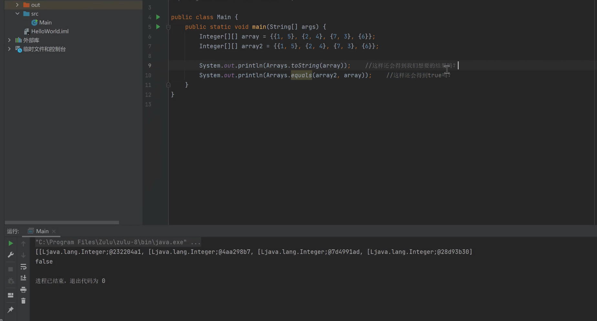
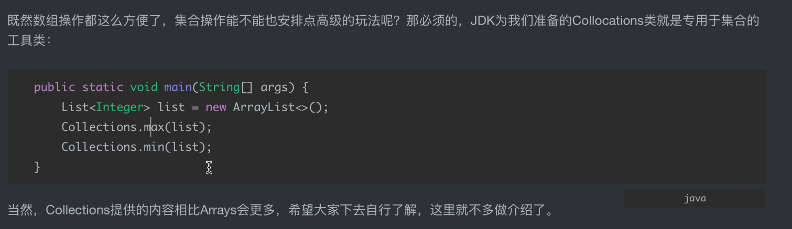

# Utils 的研究与应用

## Optional 的使用

- ofNullable
- ifPresent
- orElse
- filter
- map

## Arrays 的使用

- sort
- Arrays.toString()

- binarySearch : 二分搜索的前提是排序好

- stream() 流式操作 
- copyOf : 复制
- equals : 判断数组长度及每个元素的值是否一致
- fill : 填充
- setAll : 依次计算

> 多维数组的 toString() 和 equals() 
>
> .deep...

- Arrays.toString() 只适用于一维数组

- Arrays.deepToString(array) 适用于多维数组 

- Arrays.asList() : 将数组转化为**固定长度**的List。【当作list，本质“还是数组”】

> 这是一个坑！

> 如何解决这个问题？

把它当作参数，传入`new ArrayList<>(Arrays.asList(array))`

> 转化未list之后的排序
>
> list.sort(Comparator.reverseOrder()); //逆序排序

---

## Collections 的使用

> 一个专用于集合的工具类

