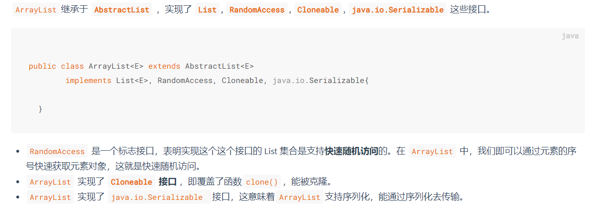
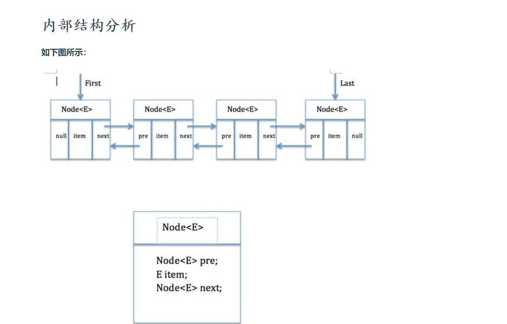

# 集合概述

[本文主要按照自己的想法组织内容, 具体内容点击访问参考博客]((https://snailclimb.gitee.io/javaguide/#/docs/java/collection/Java集合框架常见面试题?id=_11-集合概述))

从下图可以看出，在 Java 中除了以 `Map` 结尾的类之外， 其他类都实现了 `Collection` 接口。

并且，以 `Map` 结尾的类都实现了 `Map` 接口。


- List(对付顺序的好帮手)： 存储的元素是有序的、可重复的。
- Set(注重独一无二的性质): 存储的元素是无序的、不可重复的。
- Map(用 Key 来搜索的专家): 使用键值对（key-value）存储，类似于数学上的函数 y=f(x)，
  - “x”代表 key，"y"代表 value，
  - Key 是无序的、不可重复的，
  - value 是无序的、可重复的，每个键最多映射到一个值。


## `Collection` 接口下面的集合。


> List

- `Arraylist`： `Object[]`数组
- `Vector`：`Object[]`数组
- `LinkedList`： 双向链表(JDK1.6 之前为循环链表，JDK1.7 取消了循环)


> Set

- `HashSet`（无序，唯一）: 基于 `HashMap` 实现的，底层采用 `HashMap` 来保存元素
- `LinkedHashSet`：`LinkedHashSet` 是 `HashSet` 的子类，并且其内部是通过 `LinkedHashMap` 来实现的。有点类似于我们之前说的 `LinkedHashMap` 其内部是基于 `HashMap` 实现一样，不过还是有一点点区别的
- `TreeSet`（有序，唯一）： 红黑树(自平衡的排序二叉树)


> Map

- `HashMap`： JDK1.8 之前 `HashMap` 由数组+链表组成的，数组是 `HashMap` 的主体，链表则是主要为了解决哈希冲突而存在的（“拉链法”解决冲突）。JDK1.8 以后在解决哈希冲突时有了较大的变化，当链表长度大于阈值（默认为 8）（将链表转换成红黑树前会判断，如果当前数组的长度小于 64，那么会选择先进行数组扩容，而不是转换为红黑树）时，将链表转化为红黑树，以减少搜索时间
- `LinkedHashMap`： `LinkedHashMap` 继承自 `HashMap`，所以它的底层仍然是基于拉链式散列结构即由数组和链表或红黑树组成。另外，`LinkedHashMap` 在上面结构的基础上，增加了一条双向链表，使得上面的结构可以保持键值对的插入顺序。同时通过对链表进行相应的操作，实现了访问顺序相关逻辑。
- `Hashtable`： 数组+链表组成的，数组是 `HashMap` 的主体，链表则是主要为了解决哈希冲突而存在的
- `TreeMap`： 红黑树（自平衡的排序二叉树）


## 集合的选择

主要根据集合的特点来选用，比如我们需要根据键值获取到元素值时就选用 `Map` 接口下的集合，需要排序时选择 `TreeMap`,不需要排序时就选择 `HashMap`,需要保证线程安全就选用 `ConcurrentHashMap`。

当我们只需要存放元素值时，就选择实现`Collection` 接口的集合，需要保证元素唯一时选择实现 `Set` 接口的集合比如 `TreeSet` 或 `HashSet`，不需要就选择实现 `List` 接口的比如 `ArrayList` 或 `LinkedList`，然后再根据实现这些接口的集合的特点来选用。


## 为什么要使用集合?

当我们需要保存一组类型相同的数据的时候，我们应该是用一个容器来保存，这个容器就是数组，但是，使用数组存储对象具有一定的弊端， 因为我们在实际开发中，存储的数据的类型是多种多样的，于是，就出现了“集合”，集合同样也是用来存储多个数据的。

数组的缺点是一旦声明之后，长度就不可变了；同时，声明数组时的数据类型也决定了该数组存储的数据的类型；而且，数组存储的数据是**有序的、可重复的**，特点单一。 但是集合提高了数据存储的灵活性，Java 集合不仅可以用来**存储不同类型不同数量的对象**，还可以**保存具有映射关系的数据**。


## List

### [Arraylist 和 Vector 的区别?](https://snailclimb.gitee.io/javaguide/#/docs/java/collection/Java集合框架常见面试题?id=_121-arraylist-和-vector-的区别)

- `ArrayList` 是 `List` 的主要实现类，底层使用 `Object[ ]`存储，适用于频繁的查找工作，**线程不安全** ；
- `Vector` 是 `List` 的古老实现类，底层使用` Object[ ]` 存储，**线程安全的**。


### [Arraylist 与 LinkedList 区别?](https://snailclimb.gitee.io/javaguide/#/docs/java/collection/Java集合框架常见面试题?id=_122-arraylist-与-linkedlist-区别)

`ArrayList` 底层是数组，而 `LinkedList` 底层是链表。

1. **是否保证线程安全：** `ArrayList` 和 `LinkedList` 都是不同步的，也就是不保证线程安全；
2. **底层数据结构：** `Arraylist` 底层使用的是 **`Object` 数组**；`LinkedList` 底层使用的是 **双向链表** 数据结构（JDK1.6 之前为循环链表，JDK1.7 取消了循环。注意双向链表和双向循环链表的区别，下面有介绍到！）
3. **插入和删除是否受元素位置的影响：** ① **`ArrayList` 采用数组存储，所以插入和删除元素的时间复杂度受元素位置的影响。** 比如：执行`add(E e)`方法的时候， `ArrayList` 会默认在将指定的元素追加到此列表的末尾，这种情况时间复杂度就是 O(1)。但是如果要在指定位置 i 插入和删除元素的话（`add(int index, E element)`）时间复杂度就为 O(n-i)。因为在进行上述操作的时候集合中第 i 和第 i 个元素之后的(n-i)个元素都要执行向后位/向前移一位的操作。 ② **`LinkedList` 采用链表存储，所以对于`add(E e)`方法的插入，删除元素时间复杂度不受元素位置的影响，近似 O(1)，如果是要在指定位置`i`插入和删除元素的话（`(add(int index, E element)`） 时间复杂度近似为`o(n))`因为需要先移动到指定位置再插入。**
4. **是否支持快速随机访问：** `LinkedList` 不支持高效的随机元素访问，而 `ArrayList` 支持。快速随机访问就是通过元素的序号快速获取元素对象(对应于`get(int index)`方法)。
5. **内存空间占用：** ArrayList 的空 间浪费主要体现在在 list 列表的结尾会预留一定的容量空间，而 LinkedList 的空间花费则体现在它的每一个元素都需要消耗比 ArrayList 更多的空间（因为要存放直接后继和直接前驱以及数据）。

> [ArrayList ](https://snailclimb.gitee.io/javaguide/#/docs/java/collection/ArrayList%E6%BA%90%E7%A0%81+%E6%89%A9%E5%AE%B9%E6%9C%BA%E5%88%B6%E5%88%86%E6%9E%90)

`ArrayList` 的底层是数组队列，相当于动态数组。与 Java 中的数组相比，它的容量能动态增长。在添加大量元素前，应用程序可以使用`ensureCapacity`操作来增加 `ArrayList` 实例的容量。这可以减少递增式再分配的数量。



> [LinkedList](https://snailclimb.gitee.io/javaguide/#/docs/java/collection/LinkedList%E6%BA%90%E7%A0%81%E5%88%86%E6%9E%90)

LinkedList是一个实现了List接口和Deque接口的双端链表。 LinkedList底层的链表结构使它支持高效的插入和删除操作，另外它实现了Deque接口，使得LinkedList类也具有队列的特性; LinkedList不是线程安全的，如果想使LinkedList变成线程安全的，可以调用静态类Collections类中的synchronizedList方法：

```java
List list=Collections.synchronizedList(new LinkedList(...));
```




```java
private static class Node<E> {
        E item;//节点值
        Node<E> next;//后继节点
        Node<E> prev;//前驱节点

        Node(Node<E> prev, E element, Node<E> next) {
            this.item = element;
            this.next = next;
            this.prev = prev;
        }
    }
```

这个类就代表双端链表的节点Node。这个类有三个属性，分别是前驱节点，本节点的值，后继结点。


## Set

### [ comparable 和 Comparator 的区别](https://snailclimb.gitee.io/javaguide/#/docs/java/collection/Java集合框架常见面试题?id=_131-comparable-和-comparator-的区别)

- `comparable` 接口实际上是出自`java.lang`包 , 它有一个 `compareTo(Object obj)`方法用来排序
- `comparator`接口实际上是出自 `java.util` 包, 它有一个`compare(Object obj1, Object obj2)`方法用来排序


> 一般我们需要对一个集合使用自定义排序时，我们就要重写`compareTo()`方法或`compare()`方法，
>
> 当我们需要对某一个集合实现两种排序方式，比如一个 song 对象中的歌名和歌手名分别采用一种排序方法的话，
>
> 我们可以重写`compareTo()`方法和使用自制的`Comparator`方法
>
> 或者以两个 Comparator 来实现歌名排序和歌星名排序，
>
> 第二种代表我们只能使用两个参数版的 `Collections.sort()`.


#### [Comparator 定制排序](https://snailclimb.gitee.io/javaguide/#/docs/java/collection/Java集合框架常见面试题?id=_1311-comparator-定制排序)

```java
ArrayList<Integer> arrayList = new ArrayList<Integer>();
arrayList.add(-1);
arrayList.add(3);
arrayList.add(3);
arrayList.add(-5);
arrayList.add(7);
arrayList.add(4);
arrayList.add(-9);
arrayList.add(-7);
System.out.println("原始数组:");
System.out.println(arrayList);
// void reverse(List list)：反转
Collections.reverse(arrayList);
System.out.println("Collections.reverse(arrayList):");
System.out.println(arrayList);

// void sort(List list),按自然排序的升序排序
Collections.sort(arrayList);
System.out.println("Collections.sort(arrayList):");
System.out.println(arrayList);
// 定制排序的用法
Collections.sort(arrayList, new Comparator<Integer>() {

    @Override
    public int compare(Integer o1, Integer o2) {
        return o2.compareTo(o1);
    }
});
System.out.println("定制排序后：");
System.out.println(arrayList);
```

Output:

```
原始数组:
[-1, 3, 3, -5, 7, 4, -9, -7]
Collections.reverse(arrayList):
[-7, -9, 4, 7, -5, 3, 3, -1]
Collections.sort(arrayList):
[-9, -7, -5, -1, 3, 3, 4, 7]
定制排序后：
[7, 4, 3, 3, -1, -5, -7, -9]
```

#### [重写 compareTo 方法实现按年龄来排序](https://snailclimb.gitee.io/javaguide/#/docs/java/collection/Java集合框架常见面试题?id=_1312-重写-compareto-方法实现按年龄来排序)

```java
// person对象没有实现Comparable接口，所以必须实现，这样才不会出错，才可以使treemap中的数据按顺序排列
// 前面一个例子的String类已经默认实现了Comparable接口，详细可以查看String类的API文档，另外其他
// 像Integer类等都已经实现了Comparable接口，所以不需要另外实现了
public  class Person implements Comparable<Person> {
    private String name;
    private int age;

    public Person(String name, int age) {
        super();
        this.name = name;
        this.age = age;
    }

    public String getName() {
        return name;
    }

    public void setName(String name) {
        this.name = name;
    }

    public int getAge() {
        return age;
    }

    public void setAge(int age) {
        this.age = age;
    }

    /**
     * T重写compareTo方法实现按年龄来排序
     */
    @Override
    public int compareTo(Person o) {
        if (this.age > o.getAge()) {
            return 1;
        }
        if (this.age < o.getAge()) {
            return -1;
        }
        return 0;
    }
}
```

```java
public static void main(String[] args) {
    TreeMap<Person, String> pdata = new TreeMap<Person, String>();
    pdata.put(new Person("张三", 30), "zhangsan");
    pdata.put(new Person("李四", 20), "lisi");
    pdata.put(new Person("王五", 10), "wangwu");
    pdata.put(new Person("小红", 5), "xiaohong");
    // 得到key的值的同时得到key所对应的值
    Set<Person> keys = pdata.keySet();
    for (Person key : keys) {
        System.out.println(key.getAge() + "-" + key.getName());

    }
}
```

Output：

```
5-小红
10-王五
20-李四
30-张三
```

