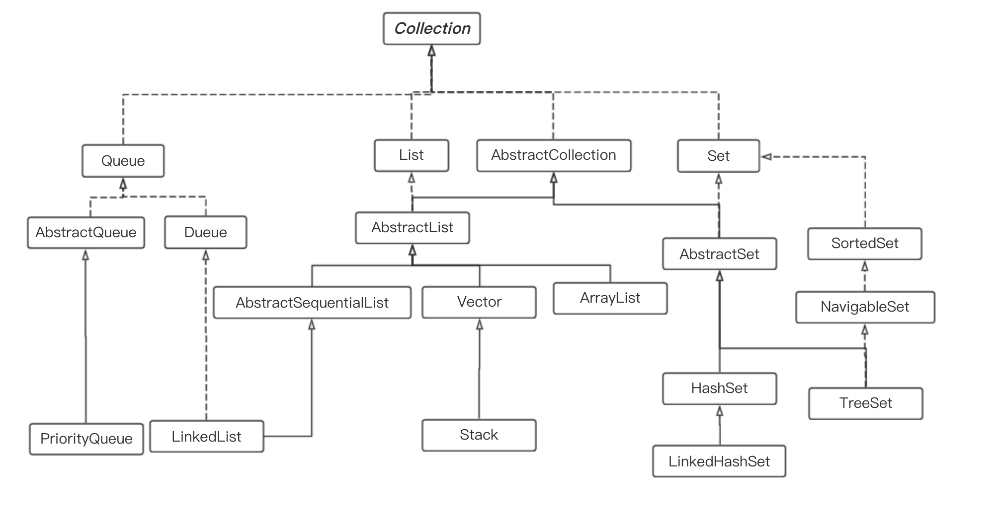
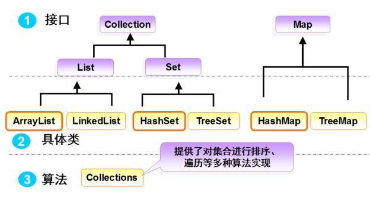

# 集合概述

[本文主要按照自己的想法组织内容, 具体内容点击访问参考博客]((https://snailclimb.gitee.io/javaguide/#/docs/java/collection/Java集合框架常见面试题?id=_11-集合概述))

从下图可以看出，在 Java 中除了以 `Map` 结尾的类之外， 其他类都实现了 `Collection` 接口。

并且，以 `Map` 结尾的类都实现了 `Map` 接口。


- List(对付顺序的好帮手)： 存储的元素是有序的、可重复的。
- Set(注重独一无二的性质): 存储的元素是无序的、不可重复的。
- Map(用 Key 来搜索的专家): 使用键值对（key-value）存储，类似于数学上的函数 y=f(x)，
  - “x”代表 key，"y"代表 value，
  - Key 是无序的、不可重复的，
  - value 是无序的、可重复的，每个键最多映射到一个值。


## `Collection` 接口下面的集合。

**集合整体结构！**



**必须掌握的！**




> List

- `Arraylist`： `Object[]`数组
- `Vector`：`Object[]`数组
- `LinkedList`： 双向链表(JDK1.6 之前为循环链表，JDK1.7 取消了循环)


> Set

- `HashSet`（无序，唯一）: 基于 `HashMap` 实现的，底层采用 `HashMap` 来保存元素
- `LinkedHashSet`：`LinkedHashSet` 是 `HashSet` 的子类，并且其内部是通过 `LinkedHashMap` 来实现的。有点类似于我们之前说的 `LinkedHashMap` 其内部是基于 `HashMap` 实现一样，不过还是有一点点区别的
- `TreeSet`（有序，唯一）： 红黑树(自平衡的排序二叉树)


> Map

- `HashMap`： JDK1.8 之前 `HashMap` 由数组+链表组成的，数组是 `HashMap` 的主体，链表则是主要为了解决哈希冲突而存在的（“拉链法”解决冲突）。JDK1.8 以后在解决哈希冲突时有了较大的变化，当链表长度大于阈值（默认为 8）（将链表转换成红黑树前会判断，如果当前数组的长度小于 64，那么会选择先进行数组扩容，而不是转换为红黑树）时，将链表转化为红黑树，以减少搜索时间
- `LinkedHashMap`： `LinkedHashMap` 继承自 `HashMap`，所以它的底层仍然是基于拉链式散列结构即由数组和链表或红黑树组成。另外，`LinkedHashMap` 在上面结构的基础上，增加了一条双向链表，使得上面的结构可以保持键值对的插入顺序。同时通过对链表进行相应的操作，实现了访问顺序相关逻辑。
- `Hashtable`： 数组+链表组成的，数组是 `HashMap` 的主体，链表则是主要为了解决哈希冲突而存在的
- `TreeMap`： 红黑树（自平衡的排序二叉树）


## 集合的选择

主要根据集合的特点来选用，比如我们需要根据键值获取到元素值时就选用 `Map` 接口下的集合，需要排序时选择 `TreeMap`,不需要排序时就选择 `HashMap`,需要保证线程安全就选用 `ConcurrentHashMap`。

当我们只需要存放元素值时，就选择实现`Collection` 接口的集合，需要保证元素唯一时选择实现 `Set` 接口的集合比如 `TreeSet` 或 `HashSet`，不需要就选择实现 `List` 接口的比如 `ArrayList` 或 `LinkedList`，然后再根据实现这些接口的集合的特点来选用。

## 为什么要使用集合?

当我们需要保存一组类型相同的数据的时候，我们应该是用一个容器来保存，这个容器就是数组，但是，使用数组存储对象具有一定的弊端， 因为我们在实际开发中，存储的数据的类型是多种多样的，于是，就出现了`集合`，集合同样也是用来存储多个数据的。

数组的缺点是一旦声明之后，长度就不可变了；同时，声明数组时的数据类型也决定了该数组存储的数据的类型；而且，数组存储的数据是**有序的、可重复的**，特点单一。 但是集合提高了数据存储的灵活性，Java 集合不仅可以用来**存储不同类型不同数量的对象**，还可以**保存具有映射关系的数据**。


## List

### [Arraylist 和 Vector 的区别?](https://snailclimb.gitee.io/javaguide/#/docs/java/collection/Java集合框架常见面试题?id=_121-arraylist-和-vector-的区别)

- `ArrayList` 是 `List` 的主要实现类，底层使用 `Object[ ]`存储，适用于频繁的查找工作，**线程不安全** ；
- `Vector` 是 `List` 的古老实现类，底层使用` Object[ ]` 存储，**线程安全的**。


### [Arraylist 与 LinkedList 区别?](https://snailclimb.gitee.io/javaguide/#/docs/java/collection/Java集合框架常见面试题?id=_122-arraylist-与-linkedlist-区别)

`ArrayList` 底层是数组，而 `LinkedList` 底层是链表。

1. **是否保证线程安全：** `ArrayList` 和 `LinkedList` 都是不同步的，也就是不保证线程安全；
2. **底层数据结构：** `Arraylist` 底层使用的是 **`Object` 数组**；`LinkedList` 底层使用的是 **双向链表** 数据结构（JDK1.6 之前为循环链表，JDK1.7 取消了循环。注意双向链表和双向循环链表的区别，下面有介绍到！）
3. **插入和删除是否受元素位置的影响：** ① **`ArrayList` 采用数组存储，所以插入和删除元素的时间复杂度受元素位置的影响。** 比如：执行`add(E e)`方法的时候， `ArrayList` 会默认在将指定的元素追加到此列表的末尾，这种情况时间复杂度就是 O(1)。但是如果要在指定位置 i 插入和删除元素的话（`add(int index, E element)`）时间复杂度就为 O(n-i)。因为在进行上述操作的时候集合中第 i 和第 i 个元素之后的(n-i)个元素都要执行向后位/向前移一位的操作。 ② **`LinkedList` 采用链表存储，所以对于`add(E e)`方法的插入，删除元素时间复杂度不受元素位置的影响，近似 O(1)，如果是要在指定位置`i`插入和删除元素的话（`(add(int index, E element)`） 时间复杂度近似为`o(n))`因为需要先移动到指定位置再插入。**
4. **是否支持快速随机访问：** `LinkedList` 不支持高效的随机元素访问，而 `ArrayList` 支持。快速随机访问就是通过元素的序号快速获取元素对象(对应于`get(int index)`方法)。
5. **内存空间占用：** ArrayList 的空间浪费主要体现在在 list 列表的结尾会预留一定的容量空间，而 LinkedList 的空间花费则体现在它的每一个元素都需要消耗比 ArrayList 更多的空间（因为要存放直接后继和直接前驱以及数据）。

> [ArrayList ](https://snailclimb.gitee.io/javaguide/#/docs/java/collection/ArrayList%E6%BA%90%E7%A0%81+%E6%89%A9%E5%AE%B9%E6%9C%BA%E5%88%B6%E5%88%86%E6%9E%90)

`ArrayList` 的底层是数组队列，相当于动态数组。与 Java 中的数组相比，它的容量能动态增长。在添加大量元素前，应用程序可以使用`ensureCapacity`操作来增加 `ArrayList` 实例的容量。这可以减少递增式再分配的数量。


> [LinkedList](https://snailclimb.gitee.io/javaguide/#/docs/java/collection/LinkedList%E6%BA%90%E7%A0%81%E5%88%86%E6%9E%90)

LinkedList是一个实现了List接口和Deque接口的**双端链表**。 LinkedList底层的链表结构使它支持高效的插入和删除操作，另外它实现了Deque接口，使得LinkedList类也具有队列的特性; LinkedList不是线程安全的，如果想使LinkedList变成线程安全的，可以调用静态类Collections类中的synchronizedList方法：

```java
List list=Collections.synchronizedList(new LinkedList(...));
```


```java
private static class Node<E> {
        E item;//节点值
        Node<E> next;//后继节点
        Node<E> prev;//前驱节点

        Node(Node<E> prev, E element, Node<E> next) {
            this.item = element;
            this.next = next;
            this.prev = prev;
        }
    }
```

这个类就代表双端链表的节点Node。这个类有三个属性，分别是前驱节点，本节点的值，后继结点。

## Set

### [ comparable 和 Comparator 的区别](https://snailclimb.gitee.io/javaguide/#/docs/java/collection/Java集合框架常见面试题?id=_131-comparable-和-comparator-的区别)

- `comparable` 接口实际上是出自`java.lang`包 , 它有一个 `compareTo(Object obj)`方法用来排序
- `comparator`接口实际上是出自 `java.util` 包, 它有一个`compare(Object obj1, Object obj2)`方法用来排序


> 一般我们需要对一个集合使用自定义排序时，我们就要重写`compareTo()`方法或`compare()`方法，
>
> 当我们需要对某一个集合实现两种排序方式，比如一个 song 对象中的歌名和歌手名分别采用一种排序方法的话，
>
> 我们可以重写`compareTo()`方法和使用自制的`Comparator`方法
>
> 或者以两个 Comparator 来实现歌名排序和歌星名排序，
>
> 第二种代表我们只能使用两个参数版的 `Collections.sort()`.


#### [Comparator 定制排序](https://snailclimb.gitee.io/javaguide/#/docs/java/collection/Java集合框架常见面试题?id=_1311-comparator-定制排序)

```java
ArrayList<Integer> arrayList = new ArrayList<Integer>();
arrayList.add(-1);
arrayList.add(3);
arrayList.add(3);
arrayList.add(-5);
arrayList.add(7);
arrayList.add(4);
arrayList.add(-9);
arrayList.add(-7);
System.out.println("原始数组:");
System.out.println(arrayList);
// void reverse(List list)：反转
Collections.reverse(arrayList);
System.out.println("Collections.reverse(arrayList):");
System.out.println(arrayList);

// void sort(List list),按自然排序的升序排序
Collections.sort(arrayList);
System.out.println("Collections.sort(arrayList):");
System.out.println(arrayList);
// 定制排序的用法
Collections.sort(arrayList, new Comparator<Integer>() {

    @Override
    public int compare(Integer o1, Integer o2) {
        return o2.compareTo(o1);
    }
});
System.out.println("定制排序后：");
System.out.println(arrayList);
```

Output:

```
原始数组:
[-1, 3, 3, -5, 7, 4, -9, -7]
Collections.reverse(arrayList):
[-7, -9, 4, 7, -5, 3, 3, -1]
Collections.sort(arrayList):
[-9, -7, -5, -1, 3, 3, 4, 7]
定制排序后：
[7, 4, 3, 3, -1, -5, -7, -9]
```

#### [重写 compareTo 方法实现按年龄来排序](https://snailclimb.gitee.io/javaguide/#/docs/java/collection/Java集合框架常见面试题?id=_1312-重写-compareto-方法实现按年龄来排序)

```java
// person对象没有实现Comparable接口，所以必须实现，这样才不会出错，才可以使treemap中的数据按顺序排列
// 前面一个例子的String类已经默认实现了Comparable接口，详细可以查看String类的API文档，另外其他
// 像Integer类等都已经实现了Comparable接口，所以不需要另外实现了
public  class Person implements Comparable<Person> {
    private String name;
    private int age;

    public Person(String name, int age) {
        super();
        this.name = name;
        this.age = age;
    }

    public String getName() {
        return name;
    }

    public void setName(String name) {
        this.name = name;
    }

    public int getAge() {
        return age;
    }

    public void setAge(int age) {
        this.age = age;
    }

    /**
     * T重写compareTo方法实现按年龄来排序
     */
    @Override
    public int compareTo(Person o) {
        if (this.age > o.getAge()) {
            return 1;
        }
        if (this.age < o.getAge()) {
            return -1;
        }
        return 0;
    }
}
```

```java
public static void main(String[] args) {
    TreeMap<Person, String> pdata = new TreeMap<Person, String>();
    pdata.put(new Person("张三", 30), "zhangsan");
    pdata.put(new Person("李四", 20), "lisi");
    pdata.put(new Person("王五", 10), "wangwu");
    pdata.put(new Person("小红", 5), "xiaohong");
    // 得到key的值的同时得到key所对应的值
    Set<Person> keys = pdata.keySet();
    for (Person key : keys) {
        System.out.println(key.getAge() + "-" + key.getName());

    }
}
```

Output：

```
5-小红
10-王五
20-李四
30-张三
```


## Map

### [ HashMap 和 Hashtable 的区别](https://snailclimb.gitee.io/javaguide/#/docs/java/collection/Java集合框架常见面试题?id=_141-hashmap-和-hashtable-的区别)

1. **线程是否安全：** `HashMap` 是非线程安全的，`HashTable` 是线程安全的,因为 `HashTable` 内部的方法基本都经过`synchronized` 修饰。（如果你要保证线程安全的话就使用 `ConcurrentHashMap` 吧！）；
2. **效率：** 因为线程安全的问题，`HashMap` 要比 `HashTable` 效率高一点。另外，`HashTable` 基本**被淘汰**，不要在代码中使用它；
3. **对 Null key 和 Null value 的支持：** `HashMap` 可以存储 null 的 key 和 value，但 null 作为键只能有一个，null 作为值可以有多个；HashTable 不允许有 null 键和 null 值，否则会抛出 `NullPointerException`。
4. **初始容量大小和每次扩充容量大小的不同 ：** ① 创建时如果不指定容量初始值，`Hashtable` 默认的初始大小为 11，之后每次扩充，容量变为原来的 2n+1。`HashMap` 默认的初始化大小为 16。之后每次扩充，容量变为原来的 2 倍。② 创建时如果给定了容量初始值，那么 Hashtable 会直接使用你给定的大小，而 `HashMap` 会将其扩充为 2 的幂次方大小（`HashMap` 中的`tableSizeFor()`方法保证，下面给出了源代码）。也就是说 `HashMap` 总是使用 2 的幂作为哈希表的大小,后面会介绍到为什么是 2 的幂次方。
5. **底层数据结构：** JDK1.8 以后的 `HashMap` 在解决哈希冲突时有了较大的变化，当链表长度大于阈值（默认为 8）（将链表转换成红黑树前会判断，如果当前数组的长度小于 64，那么会选择先进行数组扩容，而不是转换为红黑树）时，将链表转化为红黑树，以减少搜索时间。Hashtable 没有这样的机制。

**`HashMap` 中带有初始容量的构造函数：**

```java
public HashMap(int initialCapacity, float loadFactor) {
    if (initialCapacity < 0)
        throw new IllegalArgumentException("Illegal initial capacity: " +
                                           initialCapacity);
    if (initialCapacity > MAXIMUM_CAPACITY)
        initialCapacity = MAXIMUM_CAPACITY;
    if (loadFactor <= 0 || Float.isNaN(loadFactor))
        throw new IllegalArgumentException("Illegal load factor: " +
                                           loadFactor);
    this.loadFactor = loadFactor;
    this.threshold = tableSizeFor(initialCapacity);
}
 public HashMap(int initialCapacity) {
    this(initialCapacity, DEFAULT_LOAD_FACTOR);
}
```

下面这个方法保证了 `HashMap` 总是使用 2 的幂作为哈希表的大小。

```java
/**
 * Returns a power of two size for the given target capacity.
 */
static final int tableSizeFor(int cap) {
    int n = cap - 1;
    n |= n >>> 1;
    n |= n >>> 2;
    n |= n >>> 4;
    n |= n >>> 8;
    n |= n >>> 16;
    return (n < 0) ? 1 : (n >= MAXIMUM_CAPACITY) ? MAXIMUM_CAPACITY : n + 1;
}
```


### [HashMap 的长度为什么是 2 的幂次方](https://snailclimb.gitee.io/javaguide/#/docs/java/collection/Java集合框架常见面试题?id=_146-hashmap-的长度为什么是-2-的幂次方)

为了能让 HashMap 存取高效，尽量较少碰撞，也就是要尽量把数据分配均匀。我们上面也讲到了过了，Hash 值的范围值-2147483648 到 2147483647，前后加起来大概 40 亿的映射空间，只要哈希函数映射得比较均匀松散，一般应用是很难出现碰撞的。但问题是一个 40 亿长度的数组，内存是放不下的。所以这个散列值是不能直接拿来用的。用之前还要先做对数组的长度取模运算，得到的余数才能用来要存放的位置也就是对应的数组下标。这个数组下标的计算方法是“ `(n - 1) & hash`”。（n 代表数组长度）。这也就解释了 HashMap 的长度为什么是 2 的幂次方。

**这个算法应该如何设计呢？**

我们首先可能会想到采用%取余的操作来实现。但是，重点来了：**“取余(%)操作中如果除数是 2 的幂次则等价于与其除数减一的与(&)操作（也就是说 hash%length==hash&(length-1)的前提是 length 是 2 的 n 次方；）。”** 并且 **采用二进制位操作 &，相对于%能够提高运算效率，这就解释了 HashMap 的长度为什么是 2 的幂次方。**


### [HashMap 和 HashSet 区别](https://snailclimb.gitee.io/javaguide/#/docs/java/collection/Java集合框架常见面试题?id=_142-hashmap-和-hashset-区别)

如果你看过 `HashSet` 源码的话就应该知道：`HashSet` 底层就是基于 `HashMap` 实现的。（`HashSet` 的源码非常非常少，因为除了 `clone()`、`writeObject()`、`readObject()`是 `HashSet` 自己不得不实现之外，其他方法都是直接调用 `HashMap` 中的方法。

| `HashMap`                              | `HashSet`                                                    |
| -------------------------------------- | ------------------------------------------------------------ |
| 实现了 `Map` 接口                      | 实现 `Set` 接口                                              |
| 存储键值对                             | 仅存储对象                                                   |
| 调用 `put()`向 map 中添加元素          | 调用 `add()`方法向 `Set` 中添加元素                          |
| `HashMap` 使用键（Key）计算 `hashcode` | `HashSet` 使用成员对象来计算 `hashcode` 值，对于两个对象来说 `hashcode` 可能相同，所以`equals()`方法用来判断对象的相等性 |


### [HashMap 和 TreeMap 区别](https://snailclimb.gitee.io/javaguide/#/docs/java/collection/Java集合框架常见面试题?id=_143-hashmap-和-treemap-区别)

`TreeMap` 和`HashMap` 都继承自`AbstractMap` ，但是需要注意的是`TreeMap`它还实现了`NavigableMap`接口和`SortedMap` 接口。


实现 `NavigableMap` 接口让 `TreeMap` 有了对集合内元素的搜索的能力。

实现`SortMap`接口让 `TreeMap` 有了对集合中的元素根据键排序的能力。默认是按 key 的升序排序，不过我们也可以指定排序的比较器。示例代码如下：

```java
/**
 * @author shuang.kou
 * @createTime 2020年06月15日 17:02:00
 */
public class Person {
    private Integer age;

    public Person(Integer age) {
        this.age = age;
    }

    public Integer getAge() {
        return age;
    }


    public static void main(String[] args) {
        TreeMap<Person, String> treeMap = new TreeMap<>(new Comparator<Person>() {
            @Override
            public int compare(Person person1, Person person2) {
                int num = person1.getAge() - person2.getAge();
                return Integer.compare(num, 0);
            }
        });
        treeMap.put(new Person(3), "person1");
        treeMap.put(new Person(18), "person2");
        treeMap.put(new Person(35), "person3");
        treeMap.put(new Person(16), "person4");
        treeMap.entrySet().stream().forEach(personStringEntry -> {
            System.out.println(personStringEntry.getValue());
        });
    }
}
```

输出:

```
person1
person4
person2
person3Copy to clipboardErrorCopied
```

可以看出，`TreeMap` 中的元素已经是按照 `Person` 的 age 字段的升序来排列了。

上面，我们是通过传入匿名内部类的方式实现的，你可以将代码替换成 Lambda 表达式实现的方式：

```java
TreeMap<Person, String> treeMap = new TreeMap<>((person1, person2) -> {
  int num = person1.getAge() - person2.getAge();
  return Integer.compare(num, 0);
});
```

**综上，相比于`HashMap`来说 `TreeMap` 主要多了对集合中的元素根据键排序的能力以及对集合内元素的搜索的能力。**


### [HashSet 如何检查重复](https://snailclimb.gitee.io/javaguide/#/docs/java/collection/Java集合框架常见面试题?id=_144-hashset-如何检查重复)

以下内容摘自我的 Java 启蒙书《Head fist java》第二版：

当你把对象加入`HashSet`时，`HashSet` 会先计算对象的`hashcode`值来判断对象加入的位置，同时也会与其他加入的对象的 `hashcode` 值作比较，如果没有相符的 `hashcode`，`HashSet` 会假设对象没有重复出现。但是如果发现有相同 `hashcode` 值的对象，这时会调用`equals()`方法来检查 `hashcode` 相等的对象是否真的相同。如果两者相同，`HashSet` 就不会让加入操作成功。

**`hashCode()`与 `equals()` 的相关规定：**

1. 如果两个对象相等，则 `hashcode` 一定也是相同的
2. 两个对象相等,对两个 `equals()` 方法返回 true
3. 两个对象有相同的 `hashcode` 值，它们也不一定是相等的
4. 综上，`equals()` 方法被覆盖过，则 `hashCode()` 方法也必须被覆盖
5. `hashCode()`的默认行为是对堆上的对象产生独特值。如果没有重写 `hashCode()`，则该 class 的两个对象无论如何都不会相等（即使这两个对象指向相同的数据）。

**==与 equals 的区别**

对于基本类型来说，== 比较的是值是否相等；

对于引用类型来说，== 比较的是两个引用是否指向同一个对象地址（两者在内存中存放的地址（堆内存地址）是否指向同一个地方）；

对于引用类型（包括包装类型）来说，equals 如果没有被重写，对比它们的地址是否相等；如果 equals()方法被重写（例如 String），则比较的是地址里的内容。

### [ConcurrentHashMap 线程安全的具体实现方式/底层具体实现](https://snailclimb.gitee.io/javaguide/#/docs/java/collection/Java集合框架常见面试题?id=_1410-concurrenthashmap-线程安全的具体实现方式底层具体实现)

#### [JDK1.7](https://snailclimb.gitee.io/javaguide/#/docs/java/collection/Java集合框架常见面试题?id=_14101-jdk17（上面有示意图）)


首先将数据分为一段一段的存储，然后给每一段数据配一把锁，当一个线程占用锁访问其中一个段数据时，其他段的数据也能被其他线程访问。

**`ConcurrentHashMap` 是由 `Segment` 数组结构和 `HashEntry` 数组结构组成**。

Segment 实现了 `ReentrantLock`,所以 `Segment` 是一种可重入锁，扮演锁的角色。`HashEntry` 用于存储键值对数据。

```java
static class Segment<K,V> extends ReentrantLock implements Serializable {
}
```

一个 `ConcurrentHashMap` 里包含一个 `Segment` 数组。`Segment` 的结构和 `HashMap` 类似，是一种数组和链表结构，一个 `Segment` 包含一个 `HashEntry` 数组，每个 `HashEntry` 是一个链表结构的元素，每个 `Segment` 守护着一个 `HashEntry` 数组里的元素，当对 `HashEntry` 数组的数据进行修改时，必须首先获得对应的 `Segment` 的锁。


#### [JDK1.8 ](https://snailclimb.gitee.io/javaguide/#/docs/java/collection/Java集合框架常见面试题?id=_14102-jdk18-（上面有示意图）)

JDK1.8 的 `ConcurrentHashMap` 不在是 **Segment 数组 + HashEntry 数组 + 链表**，而是 **Node 数组 + 链表 / 红黑树**。不过，Node 只能用于链表的情况，红黑树的情况需要使用 **`TreeNode`**。当冲突链表达到一定长度时，链表会转换成红黑树。


`ConcurrentHashMap` 取消了 `Segment` 分段锁，采用 CAS 和 `synchronized` 来保证并发安全。数据结构跟 HashMap1.8 的结构类似，数组+链表/红黑二叉树。Java 8 在链表长度超过一定阈值（8）时将链表（寻址时间复杂度为 O(N)）转换为红黑树（寻址时间复杂度为 O(log(N))）

`synchronized` 只锁定当前链表或红黑二叉树的首节点，这样只要 hash 不冲突，就不会产生并发，效率又提升 N 倍。


## [Collections 工具类](https://snailclimb.gitee.io/javaguide/#/docs/java/collection/Java集合框架常见面试题?id=_15-collections-工具类)

### [排序操作](https://snailclimb.gitee.io/javaguide/#/docs/java/collection/Java集合框架常见面试题?id=_151-排序操作)

```java
void reverse(List list)//反转
void shuffle(List list)//随机排序
void sort(List list)//按自然排序的升序排序
void sort(List list, Comparator c)//定制排序，由Comparator控制排序逻辑
void swap(List list, int i , int j)//交换两个索引位置的元素
void rotate(List list, int distance)//旋转。当distance为正数时，将list后distance个元素整体移到前面。当distance为负数时，将 list的前distance个元素整体移到后面
```

### [查找,替换操作](https://snailclimb.gitee.io/javaguide/#/docs/java/collection/Java集合框架常见面试题?id=_152-查找替换操作)

```java
int binarySearch(List list, Object key)//对List进行二分查找，返回索引，注意List必须是有序的
int max(Collection coll)//根据元素的自然顺序，返回最大的元素。 类比int min(Collection coll)
int max(Collection coll, Comparator c)//根据定制排序，返回最大元素，排序规则由Comparatator类控制。类比int min(Collection coll, Comparator c)
void fill(List list, Object obj)//用指定的元素代替指定list中的所有元素
int frequency(Collection c, Object o)//统计元素出现次数
int indexOfSubList(List list, List target)//统计target在list中第一次出现的索引，找不到则返回-1，类比int lastIndexOfSubList(List source, list target)
boolean replaceAll(List list, Object oldVal, Object newVal)//用新元素替换旧元素
```

### [同步控制](https://snailclimb.gitee.io/javaguide/#/docs/java/collection/Java集合框架常见面试题?id=_153-同步控制)

`Collections` 提供了多个`synchronizedXxx()`方法·，该方法可以将指定集合包装成线程同步的集合，从而解决多线程并发访问集合时的线程安全问题。

我们知道 `HashSet`，`TreeSet`，`ArrayList`,`LinkedList`,`HashMap`,`TreeMap` 都是线程不安全的。`Collections` 提供了多个静态方法可以把他们包装成线程同步的集合。

**最好不要用下面这些方法，效率非常低，需要线程安全的集合类型时请考虑使用 JUC 包下的并发集合。**

方法如下：

```java
synchronizedCollection(Collection<T>  c) //返回指定 collection 支持的同步（线程安全的）collection。
synchronizedList(List<T> list)//返回指定列表支持的同步（线程安全的）List。
synchronizedMap(Map<K,V> m) //返回由指定映射支持的同步（线程安全的）Map。
synchronizedSet(Set<T> s) //返回指定 set 支持的同步（线程安全的）set。
```

------

出处：[原文链接](https://snailclimb.gitee.io/javaguide/#/docs/java/collection/Java%E9%9B%86%E5%90%88%E6%A1%86%E6%9E%B6%E5%B8%B8%E8%A7%81%E9%9D%A2%E8%AF%95%E9%A2%98?id=_114-%e5%a6%82%e4%bd%95%e9%80%89%e7%94%a8%e9%9b%86%e5%90%88)


