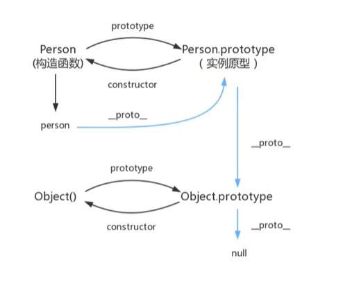

# 1、什么是JavaScript？

JavaScript（简称“JS”） 是一种具有函数优先的轻量级，解释型或即时编译型的[编程语言]。

JavaScript在1995年由[Netscape](https://baike.baidu.com/item/Netscape/2778944)公司的Brendan Eich，在网景导航者浏览器上首次设计实现而成。因为Netscape与[Sun](https://baike.baidu.com/item/Sun/69463)合作，Netscape管理层希望它外观看起来像Java，因此取名为JavaScript。

JavaScript的标准是[ECMAScript ](https://baike.baidu.com/item/ECMAScript /1889420)。截至 2012 年，所有浏览器都完整的支持ECMAScript 5.1，旧版本的浏览器至少支持ECMAScript 3 标准。2015年6月17日，ECMA国际组织发布了ECMAScript的第六版，该版本正式名称为 ECMAScript 2015，但通常被称为ECMAScript 6 或者ES2015。 

**ECMAScript**是一种由[Ecma国际](https://baike.baidu.com/item/Ecma国际)（前身为[欧洲计算机制造商协会](https://baike.baidu.com/item/欧洲计算机制造商协会/2052072)，European Computer Manufacturers Association）通过ECMA-262标准化的脚本[程序设计语言](https://baike.baidu.com/item/程序设计语言)。这种语言在[万维网](https://baike.baidu.com/item/万维网)上应用广泛，它往往被称为[JavaScript](https://baike.baidu.com/item/JavaScript)或[JScript](https://baike.baidu.com/item/JScript)，所以它可以理解为是JavaScript的一个标准,但实际上后两者是ECMA-262标准的实现和扩展。

最新版本已经到es6版本~

但是大部分浏览器还停留在es5代码上！开发环境与线上环境，版本不一致。

# 2、快速入门

## 2.1、引入JavaScript

1、内部引入

```javascript
<script>
	alert('hello jungle');    
</script>
```

2、外部引入

```javascript
<script src="js/test.js"></script>

<!-- test.js: --->
alert('hello jungle');
```

## 2.2、定义变量

```javascript
// 严格区分大小写！

// 变量类型 变量名 = 变量值
var num = 1;
alert(num);
// 在浏览器控制台打印变量
console.log(num);
```

## 2.3、数据类型

> 数字

```javascript
// js不区分小数和整数，Number
123 // 整数
123.1 // 小数
-99 // 负数
NaN // not a Number
Infinity //表示无线大
```


> 字符串

```javascript
// 普通字符串：
'abc' 
"abc"
```

- 多行字符串

```javascript
'use strict'
let msg = `hello
            world
            jungle`
alert(msg);
console.log(msg)
```

- 模板字符串

```javascript
let name = 'jungle'
let msg = `hello ${name}`
alert(msg);
console.log(msg)
```

- 字符串长度：msg.length
- 字符串内容不可变


> 布尔值

```javascript
true, false
```


> 逻辑运算

```javascript
&& 与
|| 或
!  非
```


> 比较运算符：Js缺陷，坚持不要使用 '==' ！

```javascript
= 
==	等于（类型不一样，值一样，也会判断为true）
===	绝对等于（类型一样，值一样，结果为true）
```

```javascript
NaN === NaN，这个与所有的数值都不想等，包括自己
只能通过 isNaN(NaN) 来判断这个数是否是 NaN
```


> 浮点数问题：

- 精度问题！

```javascript
console.log((1/3) === (1-2/3))
VM666:1 false
```

- 解决办法：

```javascript
console.log(Math.abs((1/3) - (1-2/3)) < 0.000001)
VM760:1 true
```


> null和undefined

```javascript
null：空
undefined：未定义
```


> 数组：存储数据（常见下标存取）
>
> - Java 数组是相同类型，而JavaScript 数组可以包含任意的数据类型
>
> - 数组用 [] 
> - 数组长度：arr.length
>   - 若给 arr.length赋值，数组大小就会发生变化~
>   - 若赋值过小，元素就会丢失
>   - 所以，尽量别这样操作！
> - slice() 类似与字符串中的 subString()
> - indexof()
> - push()：压入到尾部 （尾部为栈顶）
> - pop()：弹出尾部的一个元素（尾部为栈顶）
> - unshift()：压入到头部
> - shift()：弹出头部的一个元素
> - sort()
> - reverse()
> - concat()：拼接成一个新的数组！
> - join()：返回使用特定的字符串拼接后的字符串

```javascript
var arr = [1, 2, 3, 4, 5]
```

> 取数组下标越界后：

```javascript
undefined
```


> 对象
>
> - 对象用 {}
> - var 对象名 = {属性名1: 属性值1, ..., 属性名n: 属性值n}
> - 属性以键值对形式描述
> - 动态删减属性：delete person.name
> - 动态添加属性：person.gender = 'male'
> - 属性值是否在对象中：'age' in person
> - 对象自身是否拥有某个属性值：person.hasOwnProperty('age')

```javascript
var person = {name: "jungle", age: 26}
// 取值
person.age
26
person.name
"jungle"
```

- 注意：使用一个不存在的对象属性，不会报错，只会 undefined！


# 3、严格检查模式

> 'use strict'：预防JavaScript的随意性导致产生的一些问题。
>
> - 局部变量建议使用 let 去定义
> - 前提：IDEA 设置支持 ES6 语法

```javascript
'use strict'
 i = 1;
alert(i)
console.log(i)
```

> test.js:2 Uncaught ReferenceError: i is not defined
>     at test.js:2


# 4、循环

> for 循环

```javascript
for (let i = 0; i < 100; i++) {
	console.log(i)
}
```

> foreach 循环 （5.1引入）

```javascript
age.forEach(function(value){
	console.log(value)
})
```

> for ... in （建议使用for ... of，见后面）

```javascript
var age = [3, 4, 5]
for (var x in age) {
    console.log(x)
}
// 输出索引：
0
1
2

// var index in object
var age = [3, 4, 5]
for (var num in age) {
	if (age.hasOwnProperty(num)) {
        console.log(age[num])
    }
}
// 输出值
3
4
5
```


# 5、Map 和 Set

> Map

```javascript
var map = new Map([['tom', 100], ['jack', 90], ['jungle', 80]])
var name = map.get('tom');
console.log(name);
map.set('admin', 123456)

map
Map(4) {"tom" => 100, "jack" => 90, "jungle" => 80, "admin" => 123456}
[[Entries]]
0: {"tom" => 100}
1: {"jack" => 90}
2: {"jungle" => 80}
3: {"admin" => 123456}
size: (...)
__proto__: Map
clear: ƒ clear()
constructor: ƒ Map()
delete: ƒ delete()
entries: ƒ entries()
forEach: ƒ forEach()
get: ƒ ()
has: ƒ has()
keys: ƒ keys()
set: ƒ ()
size: (...)
values: ƒ values()
Symbol(Symbol.iterator): ƒ entries()
Symbol(Symbol.toStringTag): "Map"
get size: ƒ size()
__proto__: Object
```


> Set：无序不重复的集合

```
var set = new Set([3, 1, 2, 2, 2])
set.add(4)
set.delete(4)
console.log(set.has(3))

set
Set(3) {3, 1, 2}
[[Entries]]
0: 3
1: 1
2: 2
size: (...)
__proto__: Set
add: ƒ add()
clear: ƒ clear()
constructor: ƒ Set()
delete: ƒ delete()
entries: ƒ entries()
forEach: ƒ forEach()
has: ƒ has()
keys: ƒ values()
size: (...)
values: ƒ values()
Symbol(Symbol.iterator): ƒ values()
Symbol(Symbol.toStringTag): "Set"
get size: ƒ size()
__proto__: Object
```


# 6、iterator

```javascript
var arr = [3, 4, 5]
for (var x of arr) {
    console.log(x)
}
// 输出值
3
4
5

var map = new Map([['tom', 100], ['jack', 90], ['jungle', 80]])
for (let m of map) {
    console.log(m)
}
// 输出值
["tom", 100]
["jack", 90]
["jungle", 80]


var set = new Set([3, 1, 2, 2, 2])
for (let s of set) {
    console.log(s)
}
// 输出值
3
1
2
```

# 7、函数

## 7.1、定义函数

**例：绝对值函数**

> 定义方式一

```javascript
function abs(x) {
	if (x >= 0) {
		return x;
	} else {
		return -x;
	}
}
```

一旦执行到return代表函数结束，返回结果

如果没有执行return，函数执行完也会返回结果---undefined

>定义方式二

```javascript
var abs = function(x) {
	if (x >= 0) {
		return x;
	} else {
		return -x;
	}
}
```

将 function(x) {...} 匿名函数赋值给abs，通过abs调用该函数！ 

> 调用函数

```javascript
abs(-10) // 10
```


如何规避参数问题：

```javascript
function abs(x) {
    // 手动抛出异常
	if (typeof x !== 'number') {
		throw 'Not a Number';
	}
    
	if (x >= 0) {
		return x;
	} else {
		return -x;
	}
}
```


> js 可以传递一个或多个参数

- arguments：获取传递进来的所有的参数，是一个数组！
- rest：获取除了已经定义的参数之外的参数（ES6）
  - 定义时需要增加标志：function(a, b, ...res) {...}
  - rest只能写在最后面


## 7.2、变量的作用域

> 在js中，var 定义变量实际上是有作用域的。

- 内部函数可以访问外部函数的成员，反之则不行
- 若外部存在与函数同名的函数变量，
  - 则从自身函数开始：由**内**向**外**查找
  - 内部函数会屏蔽外部函数的同名变量。

> 所有的变量定义都在函数头部，便于代码维护。

- 全局变量：默认所有的全局变量都会自动绑定在window对象下
  - js 实际上只有一个全局作用域，任何变量（函数也是一个变量）；
  - 若没有在函数范围内找到，就会向外查找，如果全局作用域都没有找到，就会报错：ReferenceError。

> 规范

由于所有的**全局变量**都会绑定到window对象，如果不同的js文件，使用了相同的全局变量，就会产生冲突，如何解决？

```javascript
// 唯一全局变量
var jungle = {}

// 定义全局变量
jungle.name = 'james';
jungle.add = function(a, b) {
    return a + b;
}
```

**把自己的代码全部放入自己定义的唯一空间名字中，降低全局命名冲突的问题。**

> ES6 **let** 关键字，解决局部作用域冲突问题！

- 建议使用**let**定义**局部变量**

> ES6 引入常量关键字 **const** 

- const PI = 3.14


## 7.3、方法

> 方法就是把函数放在对象的里面，对象只有两个东西：属性和方法。

```javascript
var jungle = {
    name: 'jungle',
    birth: 1995,
    // 方法
    age: function() {
        var now = new Date().getFullYear();
        return now - birth;
    }
}
```

> this 是无法指向的，是默认指向调用它的那个对象。

```javascript
function getAge() {
    var now = new Date().getFullYear();
    return now - this.birth;
}

var jungle = {
    name: 'jungle',
    birth: 1995,
    // 方法
    age: getAge
}
```


> apply

在js中可以控制this指向

```javascript
function getAge() {
    var now = new Date().getFullYear();
    return now - this.birth;
}

var jungle = {
    name: '姜戈',
    birth: 1995,
    // 方法
    // age: getAge
}

jungle.age = getAge.apply(jungle, []); //this指向了jungle，参数为空
```


# 8、内部对象

## 8.1 Date

**基本使用**

```javascript
var now = new Date(); // Sun Apr 11 2021 16:12:41 GMT+0800 (中国标准时间)

now.getFullYear(); // 年
2021

now.getMonth(); // 0~11 代表月，要加 1
3

now.getDate(); // 日
11

now.getDay(); // 星期几 1~6， 0 代表星期日
0

now.getHours(); // 时
16

now.getMinutes(); // 分
12

now.getSeconds(); // 秒
41

now.getTime(); // 时间戳 全世界统一：1970 1.1 0:00:00 ---> 毫秒数
1618128761700

console.log(new Date(now.getTime()))
Sun Apr 11 2021 16:12:41 GMT+0800 (中国标准时间)
```

**转换**

```javascript
now = new Date(1618128761700);
Sun Apr 11 2021 16:12:41 GMT+0800 (中国标准时间)

now.toLocaleDateString()
"2021/4/11"

now.toLocaleString()
"2021/4/11下午4:12:41"

now.toGMTString()
"Sun, 11 Apr 2021 08:12:41 GMT"
```


## 8.2 JSON

> JSON是JavaScript Object Notation的缩写，它是一种数据交换格式。

在JSON出现之前，大家一直用XML来传递数据。因为XML是一种纯文本格式，所以它适合在网络上交换数据。XML本身不算复杂，但是，加上DTD、XSD、XPath、XSLT等一大堆复杂的规范以后，任何正常的软件开发人员碰到XML都会感觉头大了，最后大家发现，即使你努力钻研几个月，也未必搞得清楚XML的规范。

终于，在2002年的一天，道格拉斯·克罗克福特（Douglas Crockford）同学为了拯救深陷水深火热同时又被某几个巨型软件企业长期愚弄的软件工程师，发明了JSON这种超轻量级的数据交换格式。

道格拉斯同学长期担任雅虎的高级架构师，自然钟情于JavaScript。他设计的JSON实际上是JavaScript的一个子集。在JSON中，一共就这么几种数据类型：

- number：和JavaScript的`number`完全一致；
- boolean：就是JavaScript的`true`或`false`；
- string：就是JavaScript的`string`；
- null：就是JavaScript的`null`；
- array：就是JavaScript的`Array`表示方式——`[]`；
- object：就是JavaScript的`{ ... }`表示方式。

以及上面的任意组合。

并且，JSON还定死了字符集必须是UTF-8，表示多语言就没有问题了。为了统一解析，JSON的字符串规定必须用双引号`""`，Object的键也必须用双引号`""`。

由于JSON非常简单，很快就风靡Web世界，并且成为ECMA标准。几乎所有编程语言都有解析JSON的库，而在JavaScript中，我们可以直接使用JSON，因为JavaScript内置了JSON的解析。

把任何JavaScript对象变成JSON，就是把这个对象序列化成一个JSON格式的字符串，这样才能够通过网络传递给其他计算机。

如果我们收到一个JSON格式的字符串，只需要把它反序列化成一个JavaScript对象，就可以在JavaScript中直接使用这个对象了。

### 序列化

让我们先把小明这个对象序列化成JSON格式的字符串：

```javascript
'use strict';

var xiaoming = {
    name: '小明',
    age: 14,
    gender: true,
    height: 1.65,
    grade: null,
    'middle-school': '\"W3C\" Middle School',
    skills: ['JavaScript', 'Java', 'Python', 'Lisp']
};
```

```
var s = JSON.stringify(xiaoming);
console.log(s);

{"name":"小明","age":14,"gender":true,"height":1.65,"grade":null,"middle-school":"\"W3C\" Middle School","skills":["JavaScript","Java","Python","Lisp"]}
```

**要输出得好看一些，可以加上参数，按缩进输出：**

```javascript
var s = JSON.stringify(xiaoming, null, '  ');
console.log(s);

{
  "name": "小明",
  "age": 14,
  "gender": true,
  "height": 1.65,
  "grade": null,
  "middle-school": "\"W3C\" Middle School",
  "skills": [
    "JavaScript",
    "Java",
    "Python",
    "Lisp"
  ]
}
```

第二个参数用于控制如何筛选对象的键值，如果我们只想输出指定的属性，可以传入`Array`：

```javascript
JSON.stringify(xiaoming, ['name', 'skills'], '  ');
```

结果：

```
{
  "name": "小明",
  "skills": [
    "JavaScript",
    "Java",
    "Python",
    "Lisp"
  ]
}
```

还可以传入一个函数，这样对象的每个键值对都会被函数先处理：

```
function convert(key, value) {
    if (typeof value === 'string') {
        return value.toUpperCase();
    }
    return value;
}

JSON.stringify(xiaoming, convert, '  ');
```

上面的代码把所有属性值都变成大写：

```
{
  "name": "小明",
  "age": 14,
  "gender": true,
  "height": 1.65,
  "grade": null,
  "middle-school": "\"W3C\" MIDDLE SCHOOL",
  "skills": [
    "JAVASCRIPT",
    "JAVA",
    "PYTHON",
    "LISP"
  ]
}
```

如果我们还想要精确控制如何序列化小明，可以给`xiaoming`定义一个`toJSON()`的方法，直接返回JSON应该序列化的数据：

```
var xiaoming = {
    name: '小明',
    age: 14,
    gender: true,
    height: 1.65,
    grade: null,
    'middle-school': '\"W3C\" Middle School',
    skills: ['JavaScript', 'Java', 'Python', 'Lisp'],
    toJSON: function () {
        return { // 只输出name和age，并且改变了key：
            'Name': this.name,
            'Age': this.age
        };
    }
};

JSON.stringify(xiaoming); // '{"Name":"小明","Age":14}'
```

### 反序列化

拿到一个JSON格式的字符串，我们直接用`JSON.parse()`把它变成一个JavaScript对象：

```javascript
JSON.parse('[1,2,3,true]'); // [1, 2, 3, true]
JSON.parse('{"name":"小明","age":14}'); // Object {name: '小明', age: 14}
JSON.parse('true'); // true
JSON.parse('123.45'); // 123.45
```

`JSON.parse()`还可以接收一个函数，用来转换解析出的属性：

```
'use strict'; 

var obj = JSON.parse('{"name":"小明","age":14}', function (key, value) {
    if (key === 'name') {
        return value + '同学';
    }
    return value;
});
console.log(JSON.stringify(obj)); // {name: '小明同学', age: 14}
```

```javascript
{"name":"小明同学","age":14}
```

在JavaScript中使用JSON，就是这么简单！

### 练习

用浏览器访问OpenWeatherMap的[天气API](https://api.openweathermap.org/data/2.5/forecast?q=Beijing,cn&appid=800f49846586c3ba6e7052cfc89af16c)，查看返回的JSON数据，然后返回城市、天气预报等信息：

```javascript
'use strict'

var url = 'https://api.openweathermap.org/data/2.5/forecast?q=Beijing,cn&appid=800f49846586c3ba6e7052cfc89af16c';
$.getJSON(url, function (data) {
   var info = {
        city: data.city.name,
        weather: data.list[0].weather[0].main,
        time: data.list[0].dt_txt
    };
    console.log(JSON.stringify(info, null, '  '));
});

{
  "city": "Beijing",
  "weather": "Clouds",
  "time": "2021-04-11 09:00:00"
}
```

[参考链接](https://www.liaoxuefeng.com/wiki/1022910821149312/1023021554858080)

## 8.3、Ajax

[参考连接](https://www.liaoxuefeng.com/wiki/1022910821149312/1023023601676640)


# 9、面向对象编程

> `class` 关键字：ES6引入

- 类：模板，原型 `__proto__`
- 对象：具体的实例

```javascript
class Student {
    constructor(name) {
        this.name = name;
    }
    hello() {
        console.log('hello');
    }
}
```

> 继承

```javascript
class Pupil extends Student {
    constructor(name, grade) {
        super(name);
        this.grade = grade;
    }
    hello() {
        console.log('I am a pupil');
    }
}
```

> js原型链 （了解），java叫继承




# 10、操作BOM对象 （重点）

> window

window代表 浏览器窗口

```javascript
window.alert(100)
undefined

window.innerHeight
722
window.innerHeight
722
window.innerWidth
971
window.outerHeight
824
window.outerWidth
1536
```


> window.Navigator： 封装了浏览器的信息

```javascript
window.Navigator
ƒ Navigator() { [native code] }

// navigator 是 Navigator 的对象
navigator.userAgent
"Mozilla/5.0 (Windows NT 10.0; Win64; x64) AppleWebKit/537.36 (KHTML, like Gecko) Chrome/89.0.4389.114 Safari/537.36"

navigator.appVersion
"5.0 (Windows NT 10.0; Win64; x64) AppleWebKit/537.36 (KHTML, like Gecko) Chrome/89.0.4389.114 Safari/537.36"

navigator.platform
"Win32"
```

**不建议使用这些属性来判断和编写代码，因为可以被人为修改**


> screen

```javascript
screen.width
1536
screen.height
864
```


> location （重要）

**代表当前页面的URL信息**

```javascript
host: "www.bilibili.com"
href: "https://www.bilibili.com"
protocol: "https:"
reload: ƒ reload() // 刷新网页

// 重定向
location.assign("https://jungle8884.icu/")
```


> document

**document代表当前的页面，HTML DOM 文档树**

```javascript
document.title="jungle"
"jungle"
```


获取具体的文档树节点

```javascript
var dt = document.getElementbyId("id_dt");
```


获取cookie

```javascript
document.cookie
```

**劫持cookie原理**：恶意人员通过js脚本获取你cookie上传到他的服务器

服务器端可以设置cookie：**httpOnly**


> history

```javascript
history.back();  	// 后退
history.forward();	// 前进
```


# 11、操作DOM对象（重点）

> 核心

浏览器网页就是一个Dom树形结构

- 更新：更新Dom节点
- 遍历Dom节点：得到Dom节点
- 删除：删除一个Dom节点
- 添加：添加一个新的节点


要操作一个Dom节点，就必须要先获得这个Dom节点

> 获得Dom节点

```javascript
var h1 = document.getElementsByTagName('h1')

var p1 = document.getElementById('p1')

var p2 = document.getElementsByClassName('h1')
```


> 更新节点

**操作文本**

- innerText
- innerHTML

```javascript
var viewbox_report = document.getElementById('viewbox_report');
undefined

viewbox_report.innerText = "jungle";
"jungle"

viewbox_report.innerHTML = '<strong>jungle</strong>';
"<strong>jungle</strong>"
```

**操作css**

- style.color
- style.fontSize
- style.padding 

```javascript
viewbox_report.style.color = 'red';
"red"

viewbox_report.style.fontSize = '50px';
"50px"

viewbox_report.style.padding = '2em';
"2em"
```


> 删除节点

**步骤：**

- 先获取当前节点的父节点
- 再通过父节点删除当前节点

```javascript
var self = document.getElementById('viewbox_report');
var father = self.parentElement;

father.removeChild(self);
```

**注意：删除多个节点的时候，children是在时刻变化的，删除节点的时候一定要注意！**


> 插入节点

当获得某个节点时，假设这个`DOM`节点是空的，我们通过`innerHTML`就可以增加一个元素；但是这个`DOM`节点已经存在元素了，就不能这么操作了，因为会覆盖！

```javascript
var v_upinfo = document.getElementById('v_upinfo');

// 通过js创建一个新的节点
var newP = document.createElement('p');
// 或者：newP.setAttribute('id', 'newP');
newP.id = 'newP';
newP.innerText = 'hello, jungle';

// 添加子节点
v_upinfo.appendChild(newP);

// 在 v_upinfo 之前插入 newP
var father = v_upinfo.parentElement;
//父节点---新节点---被插入节点
father.insertBefore(newP, v_upinfo);
```


# 12、操作表单

> 表单：from DOM树

- 文本框，对应的`<input type="text">`，用于输入文本；
- 口令框，对应的`<input type="password">`，用于输入口令；
- 单选框，对应的`<input type="radio">`，用于选择一项；
- 复选框，对应的`<input type="checkbox">`，用于选择多项；
- 下拉框，对应的`<select>`，用于选择一项；
- 隐藏文本，对应的`<input type="hidden">`，用户不可见，但表单提交时会把隐藏文本发送到服务器。
- ...


> 方式一是通过`<form>`元素的`submit()`方法提交一个表单，例如，响应一个`<button>`的`click`事件，在JavaScript代码中提交表单：

```javascript
<!-- HTML -->
<form id="test-form">
    <input type="text" name="test">
    <button type="button" onclick="doSubmitForm()">Submit</button>
</form>

<script>
function doSubmitForm() {
    var form = document.getElementById('test-form');
    // 可以在此修改form的input...
    // 提交form:
    form.submit();
}
</script>
```

- 这种方式的缺点是扰乱了浏览器对form的正常提交。

- 浏览器默认点击`<button type="submit">`时提交表单，
- 或者用户在最后一个输入框按回车键。


> 因此，第二种方式是响应`<form>`本身的`onsubmit`事件，在提交form时作修改：

```javascript
<!-- HTML -->
<form id="test-form" onsubmit="return checkForm()">
    <input type="text" name="test">
    <button type="submit">Submit</button>
</form>

<script>
function checkForm() {
    var form = document.getElementById('test-form');
    // 可以在此修改form的input...
    // 继续下一步:
    return true;
}
</script>
```

- 注意要`return true`来告诉浏览器继续提交，
  - 如果`return false`，浏览器将不会继续提交form，
  - 这种情况通常对应用户输入有误，提示用户错误信息后终止提交form。

- 在检查和修改`<input>`时，要充分利用`<input type="hidden">`来传递数据。


> 例如，很多登录表单希望用户输入用户名和口令，但是，安全考虑，提交表单时不传输明文口令，而是口令的MD5。普通JavaScript开发人员会直接修改`<input>`：

```javascript
<!-- HTML -->
<form id="login-form" method="post" onsubmit="return checkForm()">
    <input type="text" id="username" name="username">
    <input type="password" id="password" name="password">
    <button type="submit">Submit</button>
</form>

<script>
function checkForm() {
    var pwd = document.getElementById('password');
    // 把用户输入的明文变为MD5:
    pwd.value = toMD5(pwd.value);
    // 继续下一步:
    return true;
}
</script>
```

- 这个做法看上去没啥问题，但用户输入了口令提交时，口令框的显示会突然从几个`*`变成32个`*`（因为MD5有32个字符）。


> 要想不改变用户的输入，可以利用`<input type="hidden">`实现：

```javascript
<!-- HTML -->
<form id="login-form" method="post" onsubmit="return checkForm()">
    <input type="text" id="username" name="username">
    <input type="password" id="input-password">
    <input type="hidden" id="md5-password" name="password">
    <button type="submit">Submit</button>
</form>

<script>
function checkForm() {
    var input_pwd = document.getElementById('input-password');
    var md5_pwd = document.getElementById('md5-password');
    // 把用户输入的明文变为MD5:
    md5_pwd.value = toMD5(input_pwd.value);
    // 继续下一步:
    return true;
}
</script>
```

- 注意到`id`为`md5-password`的`<input>`标记了`name="password"`，而用户输入的`id`为`input-password`的`<input>`没有`name`属性。
- 没有`name`属性的`<input>`的数据不会被提交。


### 练习

利用JavaScript检查用户注册信息是否正确，在以下情况不满足时报错并阻止提交表单：

- 用户名必须是3-10位英文字母或数字；
- 口令必须是6-20位；
- 两次输入口令必须一致。

```javascript
<!-- HTML结构 -->
<form id="test-register" action="#" target="_blank" onsubmit="return checkRegisterForm()">
    <p id="test-error" style="color:red"></p>
    <p>
        用户名: <input type="text" id="username" name="username">
    </p>
    <p>
        口令: <input type="password" id="password" name="password">
    </p>
    <p>
        重复口令: <input type="password" id="password-2">
    </p>
    <p>
        <button type="submit">提交</button> <button type="reset">重置</button>
    </p>
</form>
```

```javascript
'use strict';
var checkRegisterForm = function () {
    // TODO:
    var username = document.getElementById('username');

    var pwd = document.getElementById('password');

    var rpwd = document.getElementById('password-2');

    var reName = /^[0-9a-zA-Z]{3,10}$/;

    var rePwd = /.{6,20}/;

    if(!reName.test(username.value)){

        alert('用户名格式错误！');

        return false;

    }

    if(!rePwd.test(pwd.value)){

        alert('密码格式错误！');

        return false;

    }

    if(pwd.value!==rpwd.value){

        alert('两次密码不一致！');

        return false;

    }

    return true;
};

// 测试:
$(function () {
    window.testFormHandler = checkRegisterForm;
    var form = document.getElementById('test-register');
    if (form.dispatchEvent) {
        var event = new Event('submit', {
    		bubbles: true,
    		cancelable: true
  		});
        form.dispatchEvent(event);
    } else {
        form.fireEvent('onsubmit');
    }
});
```


> dispatchEvent
>
> dispatchEvent（）方法在当前节点上触发指定事件，从而触发监听函数的执行。
>
> 该方法返回一个布尔值，只要有一个监听函数调用了`Event.preventDefault()`，则返回值为false，否则为true。
>
> target.dispatchEvent(event)

```javascript
 
<div id="div"></div>
 
<script>
 
       var elem = document.querySelector('#div');
 
       var event = document.createEvent('Event');
 
       // 定义事件名称myEvent
       event.initEvent('myEvent', true, true);
 
       // 监听myEvent
       elem.addEventListener('myEvent', function (e) {
          console.log(e);
       }, false);
 
       // 使用目标对象去派发事件，可以是元素节点/事件对象
       elem.dispatchEvent(event);
 
</script>
```

> `CustomEvent` 可以创建一个更具体的自定义事件，并且可以携带额外的参数：`new CustomEvent(eventname, options)`:

```javascript
{
  detail: {
    ...
  },//键名必须是detail
  bubbles: true,    //是否冒泡
  cancelable: false //是否取消默认事件
}
```

```javascript
<div id="div"></div>
 
<script>
 
       var elem = document.querySelector('#div');
 
       elem.addEventListener("myEvent", function(e) { console.log(e.detail) });
 
       var event = new CustomEvent("myEvent", {"detail":{"username":123}});
 
       elem.dispatchEvent(event);
 
</script>
 
结果输出：{username: 123}
```


