# Java

## 集合

### 介绍一下concurrentHashMap

> ConcurrentHashMap实现原理

- 底层数据结构: jdk1.7 之前底层采用分段数组+链表实现, jdk1.8之后采用的数据结构则是数组+链表/红黑二叉树实现.

- 实现线程安全的方式: 

  - jdk1.7 : 分段锁, 将数据分割分段, 每一段数据分配一把锁, 当一个线程占用了其中一段数据时, 不影响其他数据段被其他线程的访问.

  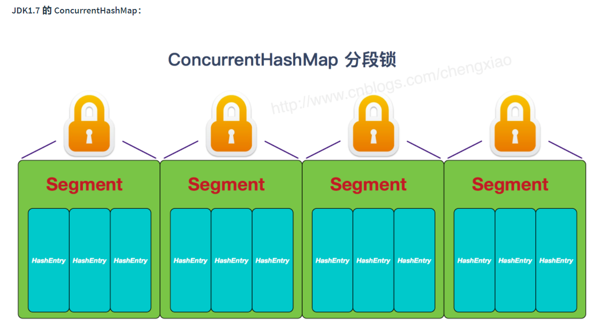

  - jdk1.8:  **JDK1.8 的时候已经，而取消了分段锁, 采用 `synchronized` 和 CAS 来保证并发安全**, `synchronized`只锁定当前链表或红黑二叉树的首节点, 只要hash不冲突, 就不会产生并发, 效率提升N倍.

    > [CAS](https://www.jianshu.com/p/34a10da2c0d5): compare and swap, 比较并变换.
    >
    > CAS(V, E, N): 若V值等于E值，则将V的值设为N; 若V值和E值不同, 则说明已经有其他线程做了更新, 则当前线程什么都不做.

  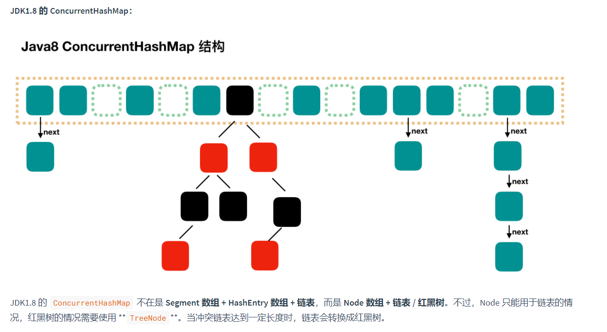

### ConcurrentHashmap底层原理和hashmap的区别


### hashmap 1.8删除节点，[红黑树](https://www.nowcoder.com/jump/super-jump/word?word=红黑树)会不会退化为[链表](https://www.nowcoder.com/jump/super-jump/word?word=链表)？


### [HashMap和Hashtable的区别](https://snailclimb.gitee.io/javaguide/#/docs/java/collection/Java%E9%9B%86%E5%90%88%E6%A1%86%E6%9E%B6%E5%B8%B8%E8%A7%81%E9%9D%A2%E8%AF%95%E9%A2%98?id=_141-hashmap-%e5%92%8c-hashtable-%e7%9a%84%e5%8c%ba%e5%88%ab)

1. **线程是否安全：** `HashMap` 是非线程安全的，`HashTable` 是线程安全的,因为 `HashTable` 内部的方法基本都经过`synchronized` 修饰。（如果你要保证线程安全的话就使用 `ConcurrentHashMap` 吧！）；
2. **效率：** 因为线程安全的问题，`HashMap` 要比 `HashTable` 效率高一点。另外，`HashTable` 基本被淘汰，不要在代码中使用它；
3. **对 Null key 和 Null value 的支持：** `HashMap` 可以存储 null 的 key 和 value，但 null 作为键只能有一个，null 作为值可以有多个；HashTable 不允许有 null 键和 null 值，否则会抛出 `NullPointerException`。
4. **初始容量大小和每次扩充容量大小的不同 ：** ① 创建时如果不指定容量初始值，`Hashtable` 默认的初始大小为 11，之后每次扩充，容量变为原来的 2n+1。`HashMap` 默认的初始化大小为 16。之后每次扩充，容量变为原来的 2 倍。② 创建时如果给定了容量初始值，那么 Hashtable 会直接使用你给定的大小，而 `HashMap` 会将其扩充为 2 的幂次方大小（`HashMap` 中的`tableSizeFor()`方法保证，下面给出了源代码）。也就是说 `HashMap` 总是使用 2 的幂作为哈希表的大小,后面会介绍到为什么是 2 的幂次方。
5. **底层数据结构：** JDK1.8 以后的 `HashMap` 在解决哈希冲突时有了较大的变化，当链表长度大于阈值（默认为 8）（将链表转换成红黑树前会判断，如果当前数组的长度小于 64，那么会选择先进行数组扩容，而不是转换为红黑树）时，将链表转化为红黑树，以减少搜索时间。Hashtable 没有这样的机制。


### [HashMap 1.8 怎么实现? 和1.7之前有什么区别? ](https://snailclimb.gitee.io/javaguide/#/docs/java/collection/Java%E9%9B%86%E5%90%88%E6%A1%86%E6%9E%B6%E5%B8%B8%E8%A7%81%E9%9D%A2%E8%AF%95%E9%A2%98?id=_145-hashmap-%e7%9a%84%e5%ba%95%e5%b1%82%e5%ae%9e%e7%8e%b0)

JDK1.8 之前 `HashMap` 底层是 **数组+链表**。

**HashMap 通过 key 的 hashCode 经过扰动函数(`(h = key.hashCode()) ^ (h >>> 16)`)处理过后得到 hash 值，然后通过 (n - 1) & hash 判断当前元素存放的位置（这里的 n 指的是数组的长度），如果当前位置存在元素的话，就判断该元素与要存入的元素的 hash 值以及 key 是否相同，如果相同的话，直接覆盖，不相同就通过拉链法解决冲突**

JDK1.8的`HashMap`底层是**数组+链表/红黑树**

HashMap在解决哈希冲突有了较大的变化，**当链表长度大于8且数组的长度大于等于64时，将链表转化为红黑树，以减少搜索时间**(链表转换为红黑树前会判断，如果当前数组的长度小于64，那么会选择先进行数组扩容，而不是转换为红黑树)

## JVM

### Java运行时数据区域, 堆是线程公有还是私有, 堆中有线程私有的区域么?

> 

jdk 1.8之前: **程序计数器, 虚拟机栈**(在 HotSpot 虚拟机中本地方法栈和 Java 虚拟机栈合二为一), **堆**, **方法区(运行时常量池)**

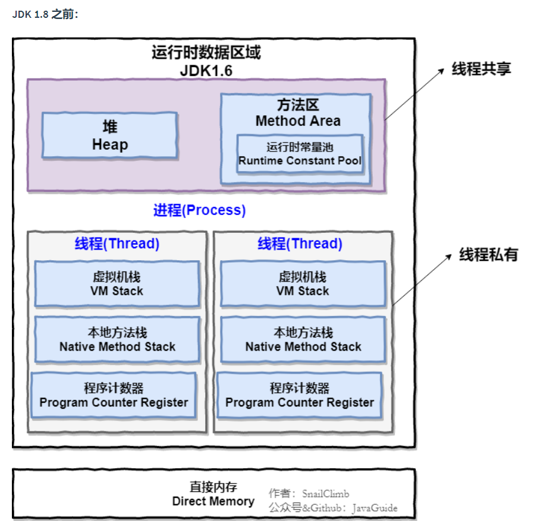

jdk 1.8: **程序计数器, 虚拟机栈**(在 HotSpot 虚拟机中本地方法栈和 Java 虚拟机栈合二为一), **堆(字符串常量池)**, **元空间(运行时常量池)**

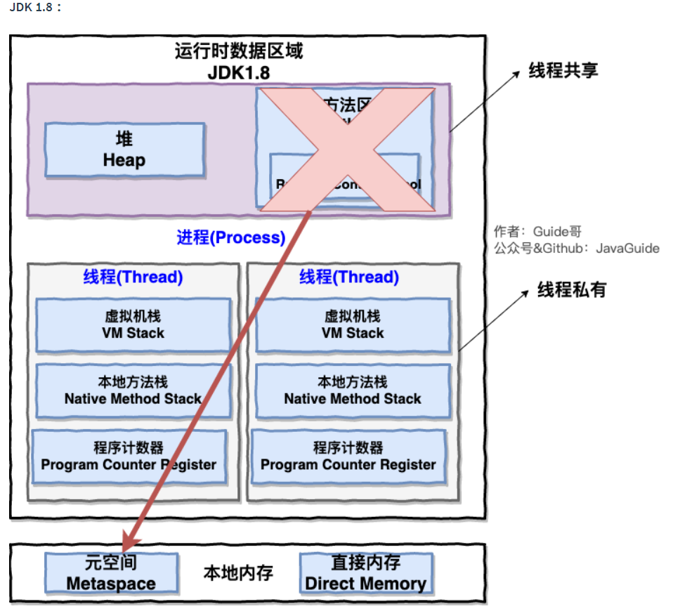

堆中有线程私有的区域吗? (应该是**没有**的)

**线程私有的：**

- 程序计数器
- 虚拟机栈(在 HotSpot 虚拟机中本地方法栈和  虚拟机栈 合二为一)

**线程共享的：**

- **堆**: **所有线程共享的一块内存区域, 几乎所有的对象实例及数组都在这里分配内存.**

- **方法区 (静态变量, 常量, 类信息, 运行时常量池)**: **类的元数据**.

  

### JVM的内存模型中, 哪部分是线程私有的, 为什么?

主要是: **程序计数器** 和 **虚拟机栈**(在 HotSpot 虚拟机中 **本地方法栈** 和  **虚拟机栈** 合二为一), 原因如下:

- 程序计数器: 为了线程切换后能恢复到正确的执行位置, 每条线程都需要有一个独立的程序计数器, 各线程之间互不影响, 独立存储.
- 虚拟机栈: **每次方法调用的数据都是通过栈传递的**, 虚拟机栈由一个个栈帧组成, 每个栈帧包括: **局部变量表**, 操作数栈, 动态链接 和 方法出口信息. (一个方法的执行就是开启了一个线程)

**局部变量表主要存放了编译期可知的各种数据类型**（boolean、byte、char、short、int、float、long、double）、**对象引用**（reference 类型，它不同于对象本身，可能是一个指向对象起始地址的引用指针，也可能是指向一个代表对象的句柄或其他与此对象相关的位置）。

### 类加载机制: 加载, 验证, 准备, 解析, 初始化.

- 加载:

  - 获取定义此类的二进制字节流
  - 将字节流所代表的静态存储结构转化为方法区的运行时数据结构
  - 在内存中生成一个代表该类的Class对象

- 验证: 

  - 文件格式验证 (Magic Number: **确定这个文件是否为一个能被虚拟机接收的 Class 文件**)

  - 元数据验证: 对字节码描述的信息进行语义分析

  - 字节码验证: 确定程序语义是合法的, 符合逻辑的

  - [符号引用验证](https://snailclimb.gitee.io/javaguide/#/docs/java/jvm/%E7%B1%BB%E6%96%87%E4%BB%B6%E7%BB%93%E6%9E%84?id=_23-%e5%b8%b8%e9%87%8f%e6%b1%a0%ef%bc%88constant-pool%ef%bc%89): 确保解析动作能正确执行

    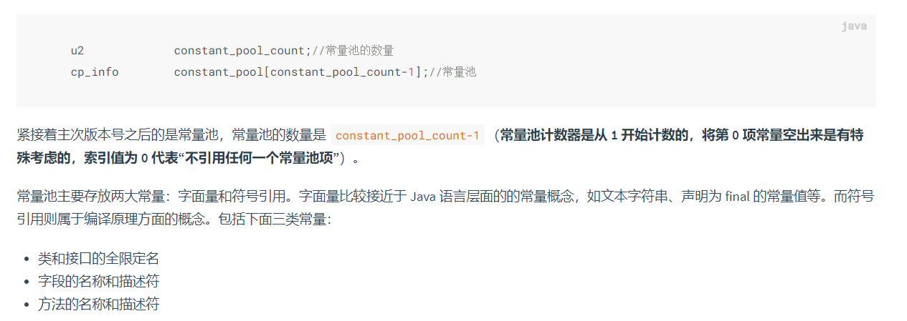

- 准备: **正式为类变量分配内存并设置类变量初始值的阶段**，这些内存都将在方法区中分配.
  - 这里所设置的初始值"通常情况"下是数据类型默认的零值（如 0、0L、null、false 等），
  - 比如我们定义了`public static int value=111` ，那么 value 变量在**准备阶段**的初始值就是 0 而不是 111（初始化阶段才会赋值）。
  - 特殊情况：比如给 value 变量**加上了 final 关键字**`public static final int value=111` ，那么准备阶段 value 的值就被赋值为 111。

- 解析: 虚拟机将常量池内的符号引用替换为直接引用的过程。

  - 解析动作主要针对类或接口、
  - 字段、类方法、接口方法、方法类型、方法句柄和调用限定符 7 类符号引用进行。

  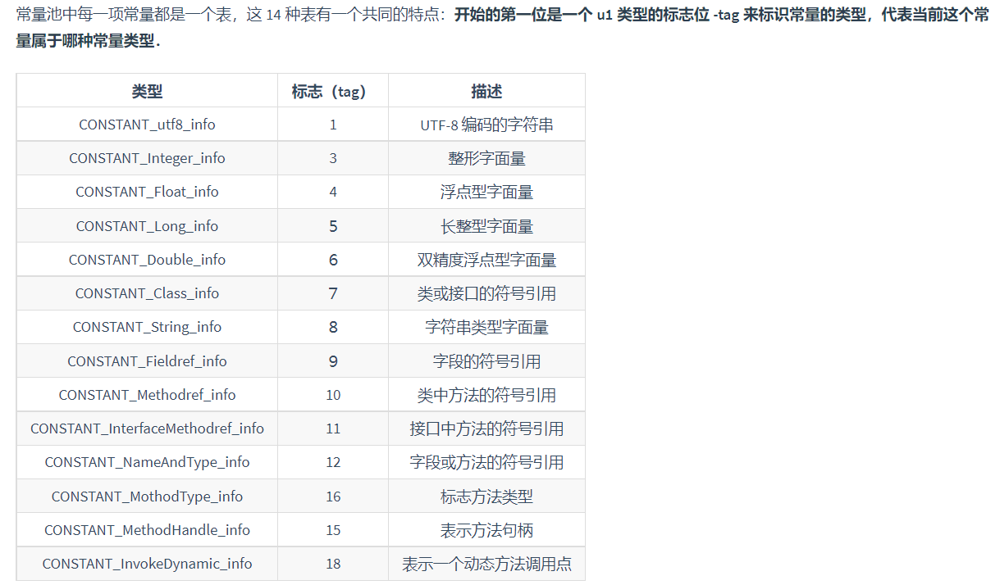

- 初始化: 初始化阶段是执行初始化方法 `<clinit> ()`方法的过程，是类加载的最后一步，这一步 JVM 才开始真正执行类中定义的 Java 程序代码(字节码)。

  

- 解释: 

  - 什么时候初始化
    - new 即 实例化对象的时候
    - getstatic / setstatic 读取或设置静态字段时(static final静态常量除外)
    - invokestatic 调用类静态方法的时候
    - 使用反射Class.forName()进行反射调用的时候
  - 初始化顺序
    - 1 父类的静态变量和静态块赋值 (按声明顺序)
    - 2 自身的静态变量和静态块赋值 (按声明顺序)
    - 3 父类的成员变量和块赋值 (按声明顺序)
    - 4 父类构造器赋值
    - 5 自身的成员变量和块赋值 (按声明顺序)
    - 自身构造器赋值

### [Java对象的创建过程](https://snailclimb.gitee.io/javaguide/#/docs/java/jvm/Java%E5%86%85%E5%AD%98%E5%8C%BA%E5%9F%9F?id=_31-%e5%af%b9%e8%b1%a1%e7%9a%84%e5%88%9b%e5%bb%ba)

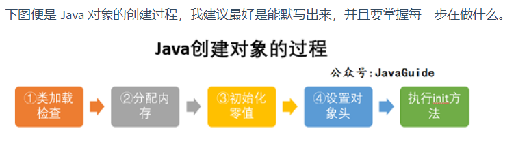

[Step1:类加载检查](https://snailclimb.gitee.io/javaguide/#/docs/java/jvm/Java内存区域?id=step1类加载检查)

虚拟机遇到一条 new 指令时，首先将去检查这个指令的参数是否能在常量池中定位到这个类的符号引用，并且检查这个符号引用代表的类是否已被加载过、解析和初始化过。如果没有，那必须先执行相应的类加载过程。

[Step2:分配内存](https://snailclimb.gitee.io/javaguide/#/docs/java/jvm/Java内存区域?id=step2分配内存)

在**类加载检查**通过后，接下来虚拟机将为新生对象**分配内存**。对象所需的内存大小在类加载完成后便可确定，为对象分配空间的任务等同于把一块确定大小的内存从 Java 堆中划分出来。**分配方式**有 **“指针碰撞”** 和 **“空闲列表”** 两种，**选择哪种分配方式由 Java 堆是否规整决定，而 Java 堆是否规整又由所采用的垃圾收集器是否带有压缩整理功能决定**。

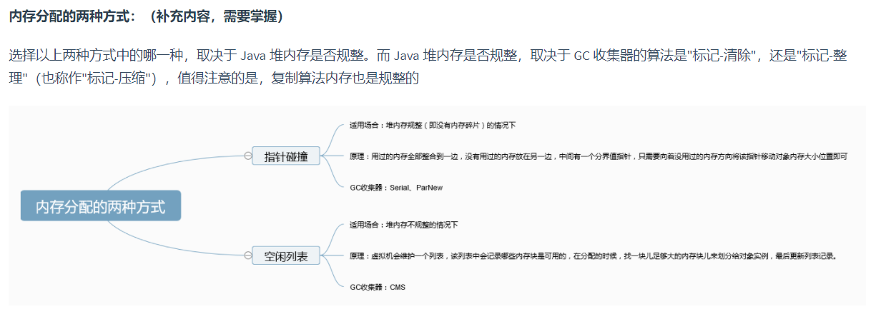

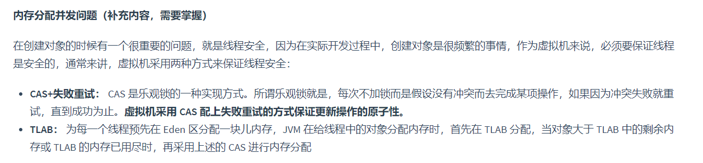[Step3:初始化零值](https://snailclimb.gitee.io/javaguide/#/docs/java/jvm/Java内存区域?id=step3初始化零值)

内存分配完成后，虚拟机需要将分配到的内存空间都初始化为零值（不包括对象头），这一步操作保证了对象的实例字段在 Java 代码中可以不赋初始值就直接使用，程序能访问到这些字段的数据类型所对应的零值。

 [Step4:设置对象头](https://snailclimb.gitee.io/javaguide/#/docs/java/jvm/Java内存区域?id=step4设置对象头)

初始化零值完成之后，**虚拟机要对对象进行必要的设置**，例如这个对象是哪个类的实例、如何才能找到类的元数据信息、对象的哈希码、对象的 GC 分代年龄等信息。 **这些信息存放在对象头中。** 另外，根据虚拟机当前运行状态的不同，如是否启用偏向锁等，对象头会有不同的设置方式。

[Step5:执行 init 方法](https://snailclimb.gitee.io/javaguide/#/docs/java/jvm/Java内存区域?id=step5执行-init-方法)

在上面工作都完成之后，从虚拟机的视角来看，一个新的对象已经产生了，但从 Java 程序的视角来看，对象创建才刚开始，`<init>` 方法还没有执行，所有的字段都还为零。所以一般来说，执行 new 指令之后会接着执行 `<init>` 方法，把对象按照程序员的意愿进行初始化，这样一个真正可用的对象才算完全产生出来。

## GC

### 聊一聊垃圾回收(总结性质的问题)

> [GC历史](https://blog.csdn.net/xiaojin21cen/article/details/106686506)
>
> 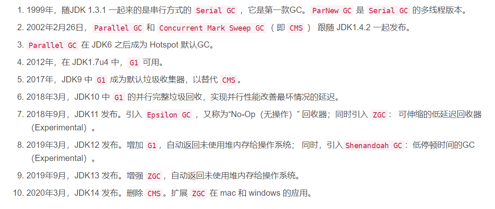

1. **先说有哪些垃圾收集算法**

垃圾收集算法主要有: 标记-复制(新生代), 标记-整理(老年代), 标记-清除(老年代) 和 分代收集算法.

分代收集算法: 根据对象存活周期的不同将内存分为几块。一般将 java 堆分为新生代和老年代，这样我们就可以根据各个年代的特点选择合适的垃圾收集算法。**比如在新生代中，每次收集都会有大量对象死去，所以可以选择”标记-复制“算法，只需要付出少量对象的复制成本就可以完成每次垃圾收集。而老年代的对象存活几率是比较高的，而且没有额外的空间对它进行分配担保，所以我们必须选择“标记-清除”或“标记-整理”算法进行垃圾收集。**

- jdk1.7 默认垃圾收集器Parallel Scavenge（新生代）+Parallel Old（老年代）
- jdk1.8 默认垃圾收集器Parallel Scavenge（新生代）+Parallel Old（老年代）
- jdk1.9 默认垃圾收集器G1

2. **这些垃圾收集算法的应用**

新生代GC: 

- Serial [标记-复制算法]
- ParNew [标记-复制算法]
- Parallel Scavenge [标记-复制算法] : 关注吞吐量

老年代GC: 

- Serial Old [标记-整理算法]
- ParNew Old [标记-整理算法]
- CMS [标记-清除算法] : 关注响应时间(垃圾收集时用户的停顿时间)

G1---整堆垃圾收集器: 整体上看是[标记-整理算法], 局部上看是[标记-复制算法].

3. **垃圾收集器的适用场景**

[Serial和Serial Old], Serial收集器是所有收集器中额外内存消耗最小的, 所以**适用于内存资源受限的环境**, 如单核CPU或CPU核心数较少的环境(运行在客户端模式下的虚拟机来说是一个很好的选择).

[CMS可以和Serial, ParNew收集器配合工作], CMS**适用于互联网网站或者基于浏览器的B/S系统的服务端上**, 关注服务的响应速度, 希望系统停顿时间尽可能短, 以给用户带来良好的交互体验.

[Parallel Scavenge 和 Serial Old] , Parallel Scavenge 目标是达到一个可控制的吞吐量, 高吞吐量则可以高效率地利用处理器资源, 尽快完成程序的运算任务, **适合在后台运算而不需要太多交互的分析任务**.

G1适用于服务器端.

### 垃圾回收器: CMS, G1

- **CMS（Concurrent Mark Sweep）收集器是一种以获取最短回收停顿时间为目标的收集器**

  - **它非常符合在注重用户体验的应用上使用**

  - **是 HotSpot 虚拟机第一款真正意义上的并发收集器，它第一次实现了让垃圾收集线程与用户线程（基本上）同时工作**

  - 从名字中的**Mark Sweep**这两个词可以看出，CMS 收集器是一种 **“标记-清除”算法**实现的，它的运作过程相比于前面几种垃圾收集器来说更加复杂一些。整个过程分为四个步骤：

    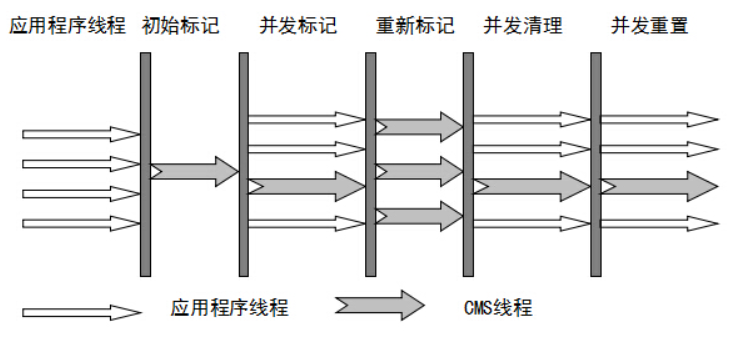

    - **初始标记：** 暂停所有的其他线程，并**记录下直接与 GC Roots 相连的对象**，速度很快 ;
    - **并发标记：** **从GC Roots的直接关联对象开始遍历整个对象图的过程,** 这个过程耗时较长但是不需要停顿用户线程, 可以与垃圾收集线程一起并发运行;
    - **重新标记：** 为了**修正并发标记期间因为用户程序继续运行而导致标记产生变动的那一部分对象的标记记录**，这个阶段的停顿时间一般会比初始标记阶段的时间稍长，远远比并发标记阶段的时间短;
    - **并发清除：** 清理删除掉标记阶段判断的已经死亡的对象, 由于不需要移动存活对象, 所以这个阶段也是可以与用户线程同时并发的.

  - 从它的名字就可以看出它是一款优秀的垃圾收集器，主要优点：**并发收集、低停顿**。但是它有下面三个明显的缺点：

    - **对 CPU 资源敏感；**
    - **无法处理浮动垃圾；**
    - **它使用的回收算法-“标记-清除”算法会导致收集结束时会有大量空间碎片产生。**

- **G1 (Garbage-First) 是一款面向服务器的垃圾收集器**,主要针对配备多颗处理器及大容量内存的机器. 以极高概率满足 GC 停顿时间要求的同时,还具备高吞吐量性能特征. **(所谓吞吐量就是 CPU 中用于运行用户代码的时间与 CPU 总消耗时间的比值)**
  - 被视为 JDK1.7 中 HotSpot 虚拟机的一个重要进化特征。它具备以下特点：
    - **并行与并发**：G1 能充分利用 CPU、多核环境下的硬件优势，使用多个 CPU（CPU 或者 CPU 核心）来缩短 Stop-The-World 停顿时间。部分其他收集器原本需要停顿 Java 线程执行的 GC 动作，G1 收集器仍然可以通过并发的方式让 java 程序继续执行。
    - **分代收集**：虽然 G1 可以不需要其他收集器配合就能独立管理整个 GC 堆，但是还是保留了分代的概念。
    - **空间整合**：与 CMS 的“标记-清理”算法不同，G1 从整体来看是基于“标记-整理”算法实现的收集器；从局部上来看是基于“标记-复制”算法实现的。
    - **可预测的停顿**：这是 G1 相对于 CMS 的另一个大优势，降低停顿时间是 G1 和 CMS 共同的关注点，但 G1 除了追求低停顿外，还能建立可预测的停顿时间模型，能让使用者明确指定在一个长度为 M 毫秒的时间片段内。
  - G1 收集器的运作大致分为以下几个步骤：
    - **初始标记**: **仅仅只是标记一下GC Roots能直接关联到的对象**, 并且修改TAMS(Top at Mark Start)指针的值, 让下一阶段用户线程并发运行时, 能正确地在可用的Region中分配新对象. 这个阶段**需要停顿线程**, 但耗时很短, 而且是借用进行Minor GC的时候同步完成的, 所以G1收集器在这个阶段**实际并没有额外的停顿**.
    - **并发标记**: **从GC Roots开始对堆中对象进行可达性分析, 递归扫描整个堆里面的对象图, 找出要回收的对象**, 这段时间耗时较长, 但可与用户程序并发执行. 当对象图扫描完成以后, 还要重新处理**STAB(原始快照)记录**下的在并发时有引用的对象.
    - **最终标记**: **对用户线程做另一个短暂的暂停, 用于处理并发阶段结束后仍遗留下来的最后那少量的STAB记录**.
    - **筛选回收**: 负责更新Region的统计数据, 对各个Region的回收价值和成本进行排序, 根据用户期望的停顿时间来制定回收计划, 可以自由选择任意多个Region构成回收集, 然后**把决定回收的那一部分Region的存活对象赋值到空的Region中, 再清理掉整个旧Region的全部空间**. 这里的操作涉及存活对象的移动, 是**必须暂停用户线程**, 由多条收集器线程并行完成的. 
  - **G1 收集器在后台维护了一个优先列表，每次根据允许的收集时间，优先选择回收价值最大的 Region(这也就是它的名字 Garbage-First 的由来)** 。这种使用 Region 划分内存空间以及有优先级的区域回收方式，保证了 G1 收集器在有限时间内可以尽可能高的收集效率（把内存化整为零）。
  - G1收集器**除了并发标记以外, 其余阶段也是要完全暂停用户线程的**, 它的目标是在延迟可控的情况下获得尽可能高的吞吐量.

**并行和并发概念补充：**

- **并行（Parallel）** ：指多条垃圾收集线程并行工作，但此时用户线程仍然处于等待状态。
- **并发（Concurrent）**：指用户线程与垃圾收集线程同时执行（但不一定是并行，可能会交替执行），用户程序在继续运行，而垃圾收集器运行在另一个 CPU 上。


## 多线程

### [ReentrantLock 和 synchronized的区别](https://snailclimb.gitee.io/javaguide/#/docs/java/multi-thread/2020%E6%9C%80%E6%96%B0Java%E5%B9%B6%E5%8F%91%E8%BF%9B%E9%98%B6%E5%B8%B8%E8%A7%81%E9%9D%A2%E8%AF%95%E9%A2%98%E6%80%BB%E7%BB%93?id=_15-%e8%b0%88%e8%b0%88-synchronized-%e5%92%8c-reentrantlock-%e7%9a%84%e5%8c%ba%e5%88%ab)

-  [两者都是可重入锁](https://snailclimb.gitee.io/javaguide/#/docs/java/multi-thread/2020最新Java并发进阶常见面试题总结?id=_151-两者都是可重入锁)

  

-  [synchronized 依赖于 JVM 而 ReentrantLock 依赖于 API](https://snailclimb.gitee.io/javaguide/#/docs/java/multi-thread/2020最新Java并发进阶常见面试题总结?id=_152synchronized-依赖于-jvm-而-reentrantlock-依赖于-api)

  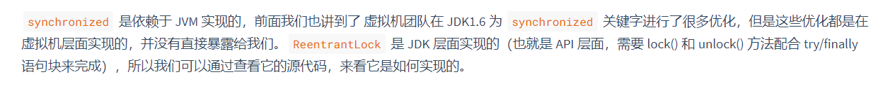

- [ReentrantLock 比 synchronized 增加了一些高级功能](https://snailclimb.gitee.io/javaguide/#/docs/java/multi-thread/2020最新Java并发进阶常见面试题总结?id=_153reentrantlock-比-synchronized-增加了一些高级功能)

  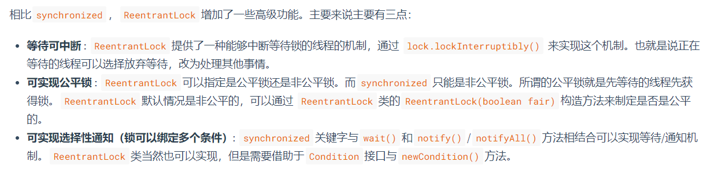

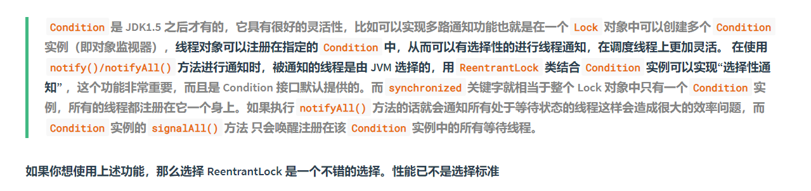

> 各种锁:
>
> - 公平锁 (先来后到) 和 非公平锁(可以插队)
> - [可重入锁](https://snailclimb.gitee.io/javaguide/#/docs/java/multi-thread/2020%E6%9C%80%E6%96%B0Java%E5%B9%B6%E5%8F%91%E8%BF%9B%E9%98%B6%E5%B8%B8%E8%A7%81%E9%9D%A2%E8%AF%95%E9%A2%98%E6%80%BB%E7%BB%93?id=_151-%e4%b8%a4%e8%80%85%e9%83%bd%e6%98%af%e5%8f%af%e9%87%8d%e5%85%a5%e9%94%81) (递归锁: 拿到外面的锁就可以拿到里面的锁, 自动获得; **一定要成对出现!**)
> - 自旋锁
> - 死锁

**ReentrantLock 默认是非公平锁, 并且可以自己设置** (同时, 本身是**可重入锁**)

```java
public ReentrantLock() {
    sync = new NonfairSync();
}

public ReentrantLock(boolean fair) {
    sync = fair ? new FairSync() : new NonfairSync();
}
```

**自旋锁** (自定义解释)

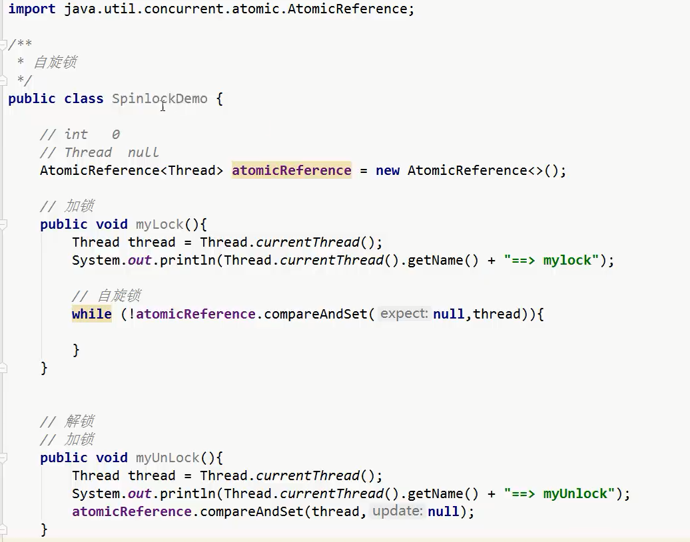

> **测试**

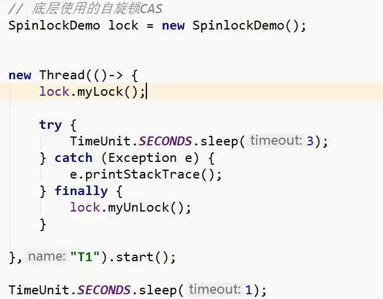

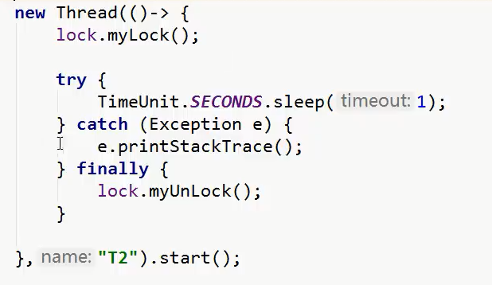

> **输出:**

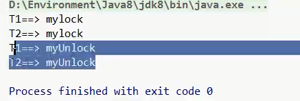

[**死锁**](https://snailclimb.gitee.io/javaguide/#/docs/java/multi-thread/2020%E6%9C%80%E6%96%B0Java%E5%B9%B6%E5%8F%91%E5%9F%BA%E7%A1%80%E5%B8%B8%E8%A7%81%E9%9D%A2%E8%AF%95%E9%A2%98%E6%80%BB%E7%BB%93?id=_81-%e8%ae%a4%e8%af%86%e7%ba%bf%e7%a8%8b%e6%ad%bb%e9%94%81)

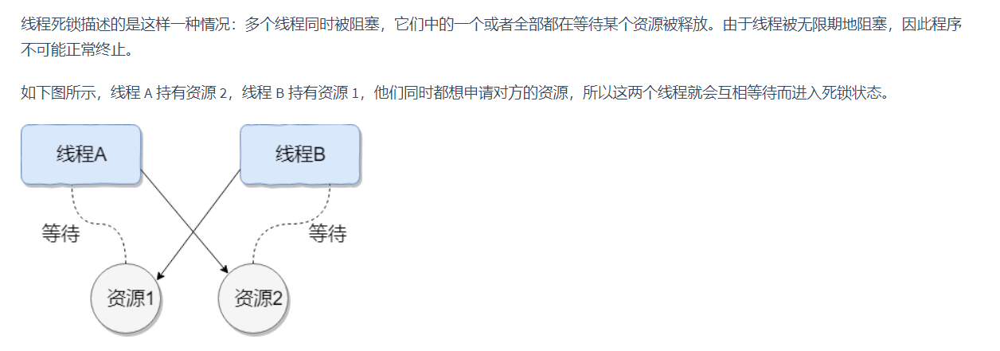

> 怎么排除死锁?
>
> **看堆栈信息**

jdk bin 目录下有一些工具:

- jps: 定位进程号: `jps -l`
- jstack: `jstack 进程号` 找到死锁问题

**产生死锁必须具备以下四个条件：**

1. 互斥条件：该资源任意一个时刻只由一个线程占用。
2. 请求与保持条件：一个进程因请求资源而阻塞时，对已获得的资源保持不放。
3. 不剥夺条件:线程已获得的资源在未使用完之前不能被其他线程强行剥夺，只有自己使用完毕后才释放资源。
4. 循环等待条件:若干进程之间形成一种头尾相接的循环等待资源关系。

**如何预防死锁？** 破坏死锁的产生的必要条件即可：

1. **破坏请求与保持条件** ：一次性申请所有的资源。
2. **破坏不剥夺条件** ：占用部分资源的线程进一步申请其他资源时，如果申请不到，可以主动释放它占有的资源。
3. **破坏循环等待条件** ：靠按序申请资源来预防。按某一顺序申请资源，释放资源则反序释放。破坏循环等待条件。

[避免死锁就是在资源分配时，借助于算法（比如银行家算法）对资源分配进行计算评估，使其进入安全状态。](https://snailclimb.gitee.io/javaguide/#/docs/java/multi-thread/2020%E6%9C%80%E6%96%B0Java%E5%B9%B6%E5%8F%91%E5%9F%BA%E7%A1%80%E5%B8%B8%E8%A7%81%E9%9D%A2%E8%AF%95%E9%A2%98%E6%80%BB%E7%BB%93?id=_82-%e5%a6%82%e4%bd%95%e9%a2%84%e9%98%b2%e5%92%8c%e9%81%bf%e5%85%8d%e7%ba%bf%e7%a8%8b%e6%ad%bb%e9%94%81)

**安全状态**指的是系统能够按照某种进行推进顺序（P1、P2、P3.....Pn）来为每个进程分配所需资源，直到满足每个进程对资源的最大需求，使每个进程都可顺利完成。称<P1、P2、P3.....Pn>序列为安全序列。

---

### AQS和lock的比较


---

### CAS原理，ABA问题如何解决

#### [CAS](https://blog.csdn.net/u011506543/article/details/82392338)

**CAS: Compare And Set (比较并交换: 如果expect值和原来的值(内存地址中的值)相同, 则更新为update值)**

> 从`package java.util.concurrent.atomic`下的`AtomicInteger`入手:

```java
public final boolean compareAndSet(int expect, int update) {
    return unsafe.compareAndSwapInt(this, valueOffset, expect, update);
}

public final int getAndIncrement() {
    return unsafe.getAndAddInt(this, valueOffset, 1);
}
```

> 到`package sun.misc`包下的 `public final class Unsafe`
>
> 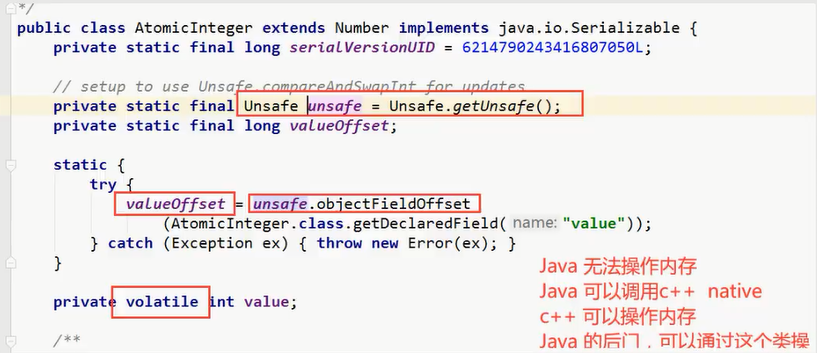
>
> 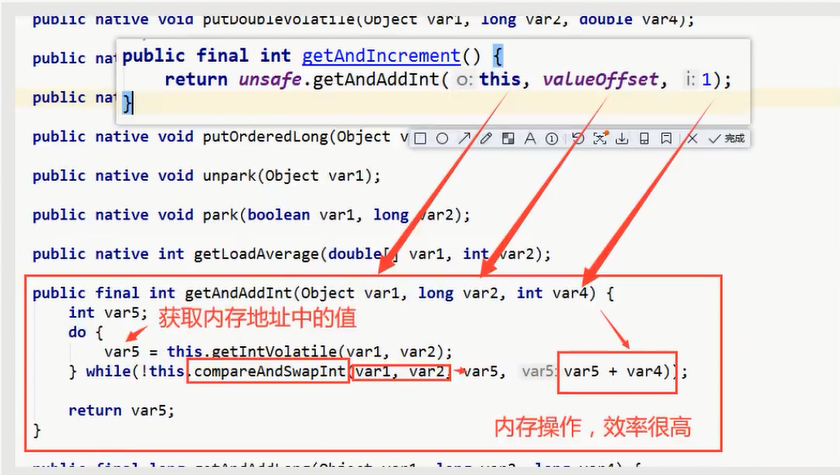

```java
public final native boolean compareAndSwapInt(Object var1, long var2, int var4, int var5);

// AtomicInteger的 compareAndSet 的原理 同 getAndIncrement:
public final int getAndAddInt(Object var1, long var2, int var4) {
    int var5;
    do { // 如果不相同, 就一直自旋; 否则, 就加1返回 (此时var4等于1)
        var5 = this.getIntVolatile(var1, var2); // 从内存地址中取值
    } while(!this.compareAndSwapInt(var1, var2, var5, var5 + var4)); // 此为自旋锁:var5 变为 var5+var4即加1

    return var5;
}
```

> 缺点
>
> - 循环会耗时
> - 一次只能保证一个共享变量的原子性
> - ABA问题


#### [ABA](https://www.jianshu.com/p/72d02353dc7e)

**ABA问题: 狸猫换太子.** 

> 在CAS算法中，需要取出内存中某时刻的数据（由用户完成），在下一时刻比较并替换（由CPU完成，该操作是原子的）。
>
> 这个时间差中，会导致数据的变化。

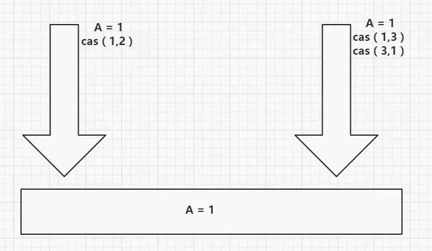

**假设如下事件序列：**

1. 线程 1 从内存位置V中取出A。
2. 线程 2 从位置V中取出A。
3. 线程 2 进行了一些操作，将B写入位置V。
4. 线程 2 将A再次写入位置V。
5. 线程 1 进行CAS操作，发现位置V中仍然是A，操作成功。

**尽管线程 1 的CAS操作成功，但不代表这个过程没有问题——*对于线程 1 ，线程 2 的修改已经丢失*。**

> 怎么解决?
>
> 加入版本号即可解决
>
> 例如: AtomicStampedReference (**原子引用**)

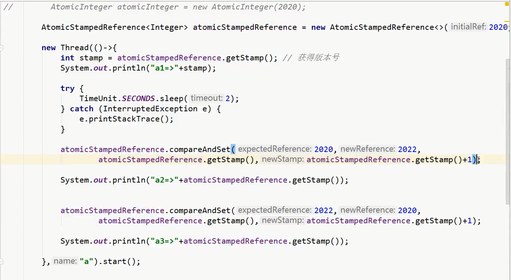

> - [遇到的坑: ](https://kangroo.gitee.io/ajcg/#/oop)
>
>   
>
> - 解决: 将值改为 -128~127

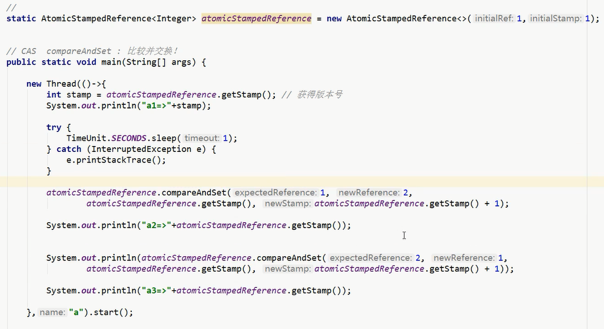

**输出成功:**

> // 与乐观锁的原理一样.
>
> 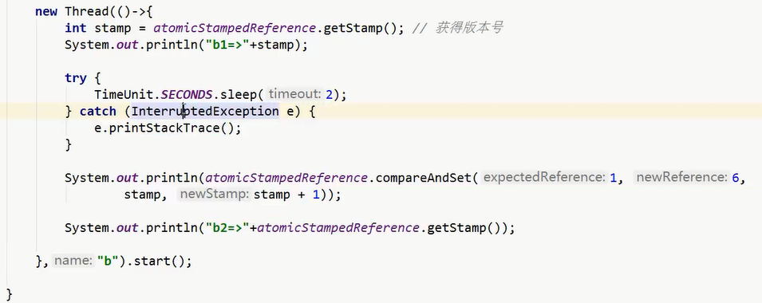
>
> 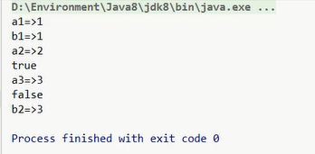


---

### 线程的状态, 状态转移条件, 创建方式, 和进程的区别

 


---

### 并发编程的三个重要特性

1. **原子性** : 一个的操作或者多次操作，要么所有的操作全部都得到执行并且不会收到任何因素的干扰而中断，**要么所有的操作都执行，要么都不执行**。`synchronized` 可以保证代码片段的原子性。
2. **可见性** ：当一个变量对共享变量进行了修改，那么另外的线程都是立即可以看到修改后的最新值。`volatile` 关键字可以**保证共享变量的可见性**。
3. **有序性** ：代码在执行的过程中的先后顺序，Java 在编译器以及运行期间的优化，代码的执行顺序未必就是编写代码时候的顺序。`volatile` 关键字可以**禁止指令进行重排序优化**。

### volatile的作用是什么?

**Volatile 是 Java虚拟机提供的轻量级同步机制**

> Volatile 是可以保证可见性的, 但是不能保证原子性, 由于内存屏障, 可以保证避免指令重排的现象产生. 
>
>  (具体应用见设计模式问题)

1. **保证可见性**  (把变量声明为 **`volatile`** ，这就指示 JVM，这个变量是共享且不稳定的，每次使用它都到主存中进行读取)

2. [不保证原子性](https://blog.csdn.net/xdzhouxin/article/details/81236356) (若要保证原子性, 可以使用Atomic类)

3. **禁止JVM的指令重排** (你写的程序, 计算机不一定时按照你写的那样去执行的)

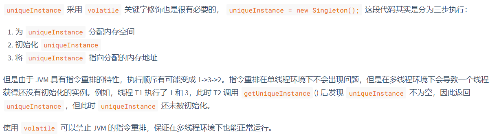

### 介绍一下synchronized的实现

> 相关博文:[深入理解synchronized底层原理，一篇文章就够了！](https://cloud.tencent.com/developer/article/1465413)

synchronized有两种形式上锁，一个是对方法上锁，一个是构造同步代码块。

他们的底层实现其实都一样，在进入同步代码之前先获取锁，获取到锁之后锁的计数器+1，同步代码执行完锁的计数器-1，如果获取失败就阻塞式等待锁的释放。只是他们在同步块识别方式上有所不一样，从class字节码文件可以表现出来，一个是通过方法flags标志，一个是monitorenter和monitorexit指令操作。

[底层实现原理:](https://snailclimb.gitee.io/javaguide/#/docs/java/multi-thread/2020%E6%9C%80%E6%96%B0Java%E5%B9%B6%E5%8F%91%E8%BF%9B%E9%98%B6%E5%B8%B8%E8%A7%81%E9%9D%A2%E8%AF%95%E9%A2%98%E6%80%BB%E7%BB%93?id=_13-%e8%ae%b2%e4%b8%80%e4%b8%8b-synchronized-%e5%85%b3%e9%94%ae%e5%ad%97%e7%9a%84%e5%ba%95%e5%b1%82%e5%8e%9f%e7%90%86)

1. **`synchronized` 同步语句块的实现使用的是 `monitorenter` 和 `monitorexit` 指令，其中 `monitorenter` 指令指向同步代码块的开始位置，`monitorexit` 指令则指明同步代码块的结束位置。**

   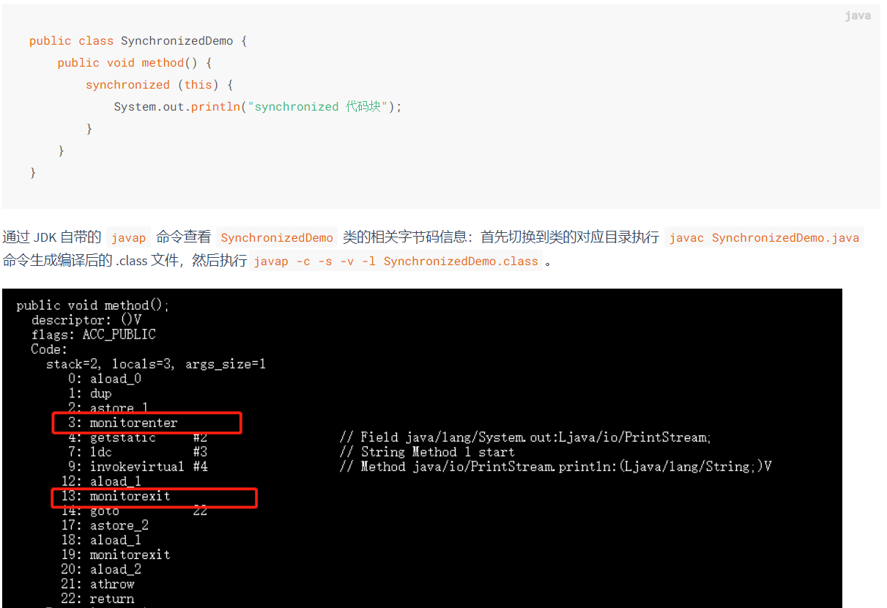

   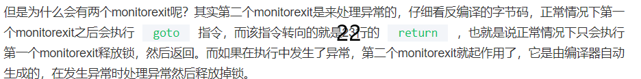

>  当执行 `monitorenter` 指令时，线程试图获取锁也就是获取 **对象监视器 `monitor`** 的持有权。

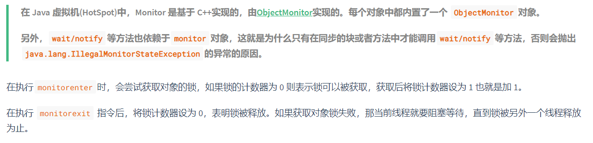

2. **`synchronized` 修饰的方法**并没有 `monitorenter` 指令和 `monitorexit` 指令，取得代之的确实是 **`ACC_SYNCHRONIZED` 标识**，该标识指明了该方法是一个同步方法。JVM 通过该 `ACC_SYNCHRONIZED` 访问标志来辨别一个方法是否声明为同步方法，从而执行相应的同步调用。

   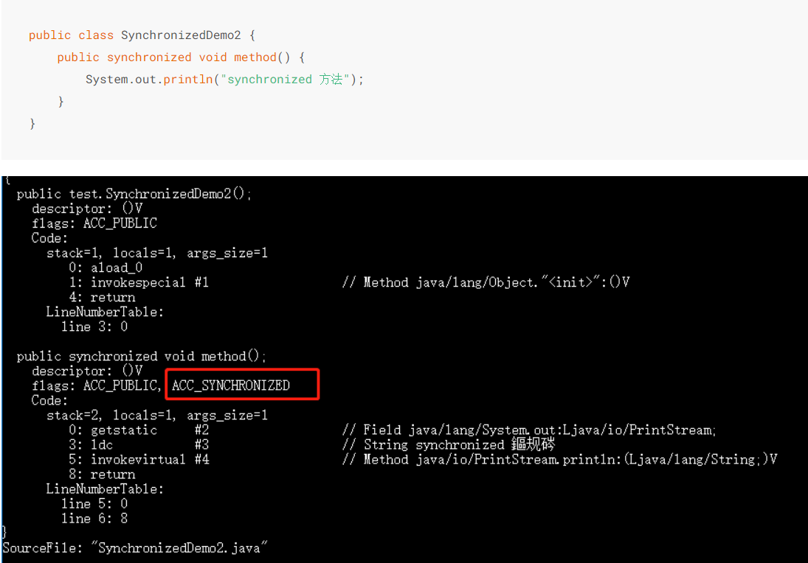

3. 小结:

   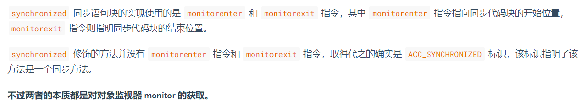

**synchronized特性:** 

> - 原子性: **指一个操作或者多个操作，要么全部执行并且执行的过程不会被任何因素打断，要么就都不执行。**
>
>   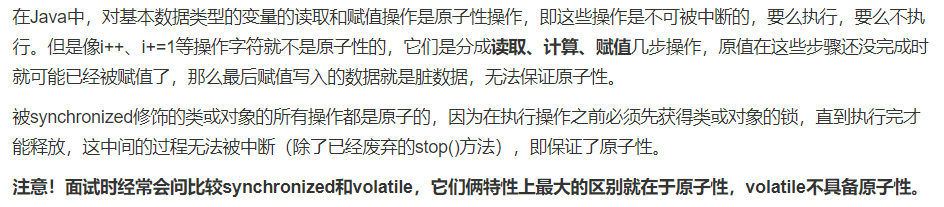
>
> - 可见性: **指多个线程访问一个资源时，该资源的状态、值信息等对于其他线程都是可见的。**
>
>   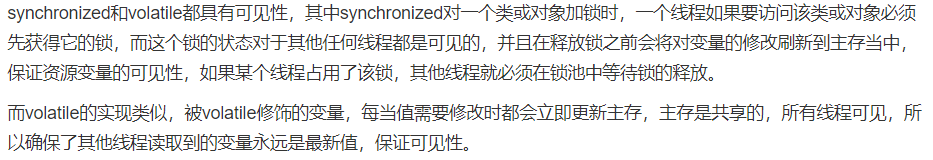
>
> - 有序性: **指程序执行的顺序按照代码先后执行。**
>
>   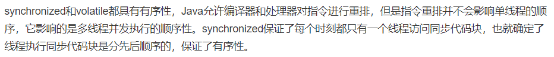
>
> - 可重入性: **指的是自己可以再次获取自己的内部锁**
>
>   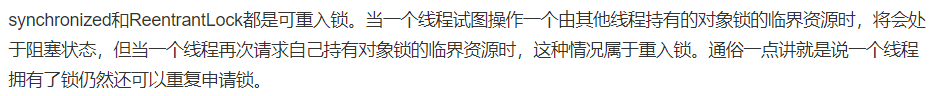

**`synchronized`关键字可以保证被它修饰的方法或者代码块在任意时刻只能有一个线程执行。**


### 说说 synchronized 关键字和 volatile 关键字的区别

`synchronized` 关键字和 `volatile` 关键字是两个互补的存在，而不是对立的存在！

- **`volatile` 关键字**是线程同步的**轻量级实现**，所以 **`volatile `性能肯定比`synchronized`关键字要好** 。但是 **`volatile` 关键字只能用于变量而 `synchronized` 关键字可以修饰方法以及代码块** 。
- **`volatile` 关键字能保证数据的可见性，但不能保证数据的原子性。`synchronized` 关键字两者都能保证。**
- **`volatile`关键字主要用于解决变量在多个线程之间的可见性，而 `synchronized` 关键字解决的是多个线程之间访问资源的同步性。**

### JMM

> [Java 内存模型](https://snailclimb.gitee.io/javaguide/#/docs/java/multi-thread/2020%E6%9C%80%E6%96%B0Java%E5%B9%B6%E5%8F%91%E8%BF%9B%E9%98%B6%E5%B8%B8%E8%A7%81%E9%9D%A2%E8%AF%95%E9%A2%98%E6%80%BB%E7%BB%93?id=_22-%e8%ae%b2%e4%b8%80%e4%b8%8b-jmmjava-%e5%86%85%e5%ad%98%e6%a8%a1%e5%9e%8b)
>
> [java内存模型JMM理解整理](https://www.cnblogs.com/null-qige/p/9481900.html)

#### 详细理解:

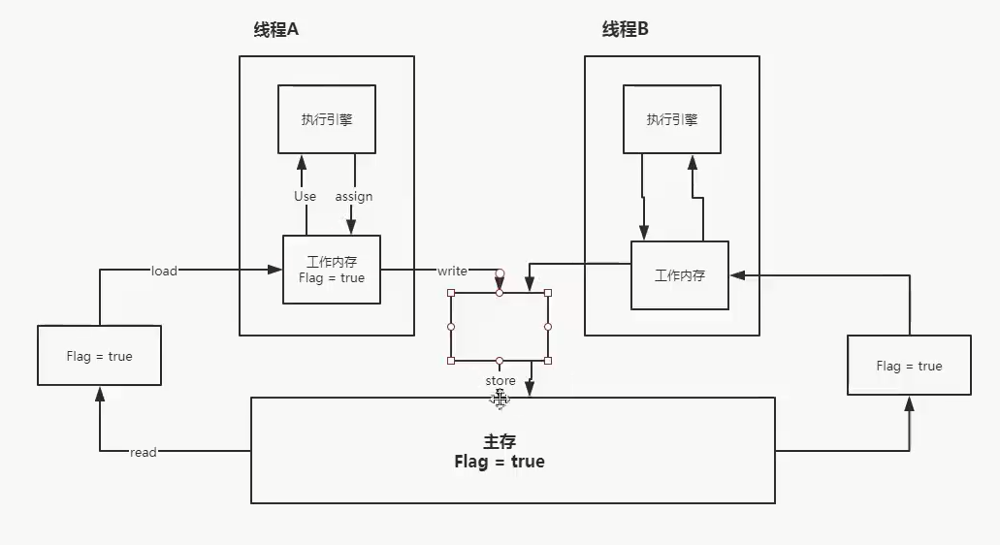

> **内存交互操作有8种，虚拟机实现必须保证每一个操作都是原子的，不可在分的（对于double和long类型的变量来说，load、store、read和write操作在某些平台上允许例外）**

- - lock   （锁定）：作用于主内存的变量，把一个变量标识为线程独占状态
  - unlock （解锁）：作用于主内存的变量，它把一个处于锁定状态的变量释放出来，释放后的变量才可以被其他线程锁定
  - read  （读取）：作用于主内存变量，它把一个变量的值从主内存传输到线程的工作内存中，以便随后的load动作使用
  - load   （载入）：作用于工作内存的变量，它把read操作从主存中变量放入工作内存中
  - use   （使用）：作用于工作内存中的变量，它把工作内存中的变量传输给执行引擎，每当虚拟机遇到一个需要使用到变量的值，就会使用到这个指令
  - assign （赋值）：作用于工作内存中的变量，它把一个从执行引擎中接受到的值放入工作内存的变量副本中
  - store  （存储）：作用于主内存中的变量，它把一个从工作内存中一个变量的值传送到主内存中，以便后续的write使用
  - write 　（写入）：作用于主内存中的变量，它把store操作从工作内存中得到的变量的值放入主内存的变量中

　　JMM对这八种指令的使用，制定了如下规则：

- - 不允许read和load、store和write操作之一单独出现。即使用了read必须load，使用了store必须write
  - 不允许线程丢弃他最近的assign操作，即工作变量的数据改变了之后，必须告知主存
  - 不允许一个线程将没有assign的数据从工作内存同步回主内存
  - 一个新的变量必须在主内存中诞生，不允许工作内存直接使用一个未被初始化的变量。就是对变量实施use、store操作之前，必须经过assign和load操作
  - 一个变量同一时间只有一个线程能对其进行lock。多次lock后，必须执行相同次数的unlock才能解锁
  - 如果对一个变量进行lock操作，会清空所有工作内存中此变量的值，在执行引擎使用这个变量前，必须重新load或assign操作初始化变量的值
  - 如果一个变量没有被lock，就不能对其进行unlock操作。也不能unlock一个被其他线程锁住的变量
  - 对一个变量进行unlock操作之前，必须把此变量同步回主内存

> JMM对这八种操作规则和对[volatile的一些特殊规则](https://www.cnblogs.com/null-qige/p/8569131.html)就能确定哪里操作是线程安全，哪些操作是线程不安全的了。但是这些规则实在复杂，很难在实践中直接分析。所以一般我们也不会通过上述规则进行分析。
>
> **更多的时候，使用java的happen-before规则来进行分析。**

#### [面试回答:](https://snailclimb.gitee.io/javaguide/#/docs/java/multi-thread/2020%E6%9C%80%E6%96%B0Java%E5%B9%B6%E5%8F%91%E8%BF%9B%E9%98%B6%E5%B8%B8%E8%A7%81%E9%9D%A2%E8%AF%95%E9%A2%98%E6%80%BB%E7%BB%93?id=_22-%e8%ae%b2%e4%b8%80%e4%b8%8b-jmmjava-%e5%86%85%e5%ad%98%e6%a8%a1%e5%9e%8b)

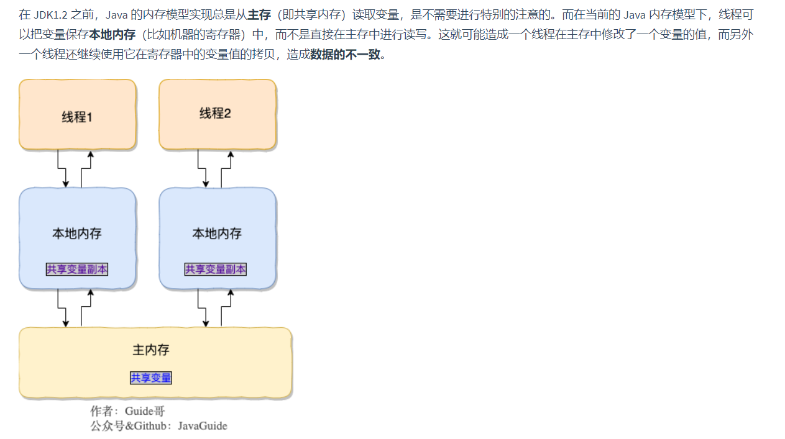

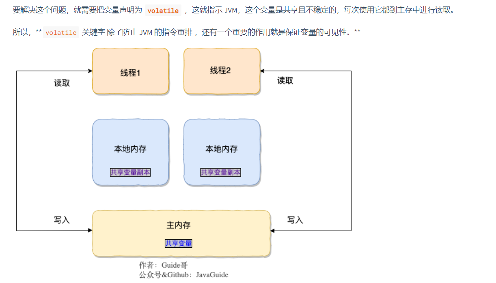


---

### 线程池参数有哪些, 具体应该怎么配置

> [三大方法, 七大参数 和 四大策略](https://blog.csdn.net/kongsanjin/article/details/111218612)
>
> 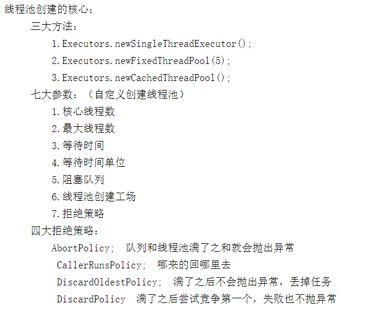
>
> [阿里巴巴开发手册](https://kangroo.gitee.io/ajcg/#/concurrent)
>
> [OOM](https://snailclimb.gitee.io/javaguide/#/docs/java/jvm/Java%E5%86%85%E5%AD%98%E5%8C%BA%E5%9F%9F?id=_22-java-%e8%99%9a%e6%8b%9f%e6%9c%ba%e6%a0%88)
>
> 面试问题:
>
> - 线程池的七大参数，及其工作过程
>
> - 线程池基本参数, 一个线程被提交到线程池的流程

**七大参数:**

- **`corePoolSize` :** 核心线程数线程数定义了**最小可以同时运行的线程数量**。
- **`maximumPoolSize` :** 当队列中存放的任务达到队列容量的时候，当前**可以同时运行的线程数量变为最大线程数**。
- **`keepAliveTime`**:当线程池中的线程数量大于 `corePoolSize` 的时候，如果这时没有新的任务提交，核心线程外的线程不会立即销毁，而是会等待，直到等待的时间超过了 `keepAliveTime`才会被回收销毁；
- **`unit`** : `keepAliveTime` 参数的时间单位。
- **`workQueue`:** 当新任务来的时候会先判断当前运行的线程数量是否达到核心线程数，如果达到的话，新任务就会被存放在队列中。
- **`threadFactory`** :executor 创建新线程的时候会用到。
- **`handler`** :拒绝策略。关于饱和策略下面单独介绍一下。

**线程池四大拒绝策略**

- **`ThreadPoolExecutor` 饱和策略定义:** 如果**当前同时运行的线程数量达到最大线程数量并且队列也已经被放满了**时，`ThreadPoolTaskExecutor` 定义一些策略:

- **`ThreadPoolExecutor.AbortPolicy`：** 直接抛出 RejectExecutionException 异常阻止系统正常运行
- **`ThreadPoolExecutor.CallerRunsPolicy`：** **“调用者运行” 一种调节机制，该策略既不会抛弃任务，也不会抛出异常，而是将某些任务回退到调用者，从而降低新任务的流量**
- **`ThreadPoolExecutor.DiscardPolicy`：** 该策略默默地丢弃无法处理的任务，不予任何处理也不抛出异常。如果允许任务丢失，这是最好的一种策略
- **`ThreadPoolExecutor.DiscardOldestPolicy`：** 抛弃队列中等待最后的任务，然后把当前任务加入队列中尝试再次提交当前任务

**怎么配置:**

> maximumPoolSize(线程池的最大线程数)的设置:
>
> - CPU密集型: (获取CPU的核数)Runtime.getRuntime().availableProcessors();
> - IO密集型: > 程序中十分耗IO的线程数, 一般为2倍CPU的核数
>
> 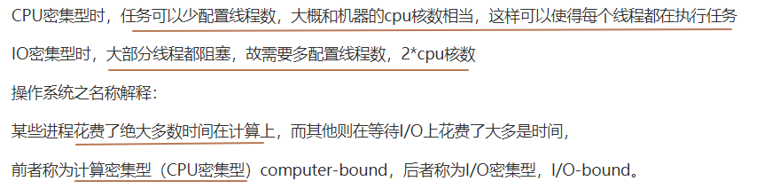

**使用线程池的好处**

- **降低资源消耗**。通过重复利用已创建的线程降低线程创建和销毁造成的消耗。
- **提高响应速度**。当任务到达时，任务可以不需要的等到线程创建就能立即执行。
- **提高线程的可管理性**。线程是稀缺资源，如果无限制的创建，不仅会消耗系统资源，还会降低系统的稳定性，使用线程池可以进行统一的分配，调优和监控。


[**一个线程被提交到线程池的流程:**](https://www.cnblogs.com/geekdc/p/11158438.html)

> **提交一个任务到线程池中，线程池的处理流程如下：**

1、判断线程池里的核心线程是否都在执行任务，如果不是（核心线程空闲或者还有核心线程没有被创建）则创建一个新的工作线程来执行任务。如果核心线程都在执行任务，则进入下个流程。

2、线程池判断工作队列是否已满，如果工作队列没有满，则将新提交的任务存储在这个工作队列里。如果工作队列满了，则进入下个流程。

3、判断线程池里的线程是否都处于工作状态，如果没有，则创建一个新的工作线程来执行任务。如果已经满了，则交给饱和策略来处理这个任务。


### 经典线程池有哪些？每个的底层原理是什么？

**数据库连接池, Http连接池**

> 可能会有答案的链接:
>
> - 博客: https://blog.csdn.net/Woo_home/article/details/104875575
> - 视频: https://www.bilibili.com/video/BV1We411x7nk?p=23

ThreadPoolExecutor源码分析:

```java
// 存放工作线程的集合
private final HashSet<Worker> workers = new HashSet<Worker>();

// 代表了一个工作的线程
private final class Worker
        extends AbstractQueuedSynchronizer
        implements Runnable 
{
    	final Thread thread; // 具体工作的线程
        
        Runnable firstTask; // 第一次要执行的任务
    
        // 构造器
    	Worker(Runnable firstTask) {
            setState(-1); // inhibit interrupts until runWorker
            this.firstTask = firstTask;
            //*** workers.thread 指向下一个worker类型的线程 (类似于链表的next)
            this.thread = getThreadFactory().newThread(this);
        }
    
    	public void run() {
            runWorker(this);
        }
    
} //Worker结束   


// 下面继续看ThreadPoolExecutor的源码:
		// w = 上面的 this
    	final void runWorker(Worker w) {
        Thread wt = Thread.currentThread();
        Runnable task = w.firstTask; // 第一个任务
        w.firstTask = null;
        w.unlock(); // allow interrupts
        boolean completedAbruptly = true;
        try {
            // 3 再次进来, task = getTask()---假如可以获取到任务就不会停止!
            // 这就是线程复用的原理!
            while (task != null || (task = getTask()) != null) {
                w.lock();
                // If pool is stopping, ensure thread is interrupted;
                // if not, ensure thread is not interrupted.  This
                // requires a recheck in second case to deal with
                // shutdownNow race while clearing interrupt
                if ((runStateAtLeast(ctl.get(), STOP) ||
                     (Thread.interrupted() &&
                      runStateAtLeast(ctl.get(), STOP))) &&
                    !wt.isInterrupted())
                    wt.interrupt();
                try {
                    beforeExecute(wt, task);
                    Throwable thrown = null;
                    try {
                        task.run(); // 1 传递进来的任务被执行
                    } catch (RuntimeException x) {
                        thrown = x; throw x;
                    } catch (Error x) {
                        thrown = x; throw x;
                    } catch (Throwable x) {
                        thrown = x; throw new Error(x);
                    } finally {
                        afterExecute(task, thrown);
                    }
                } finally {
                    task = null; // 2 设置为 null
                    w.completedTasks++;
                    w.unlock();
                }
            }
            completedAbruptly = false;
        } finally {
            processWorkerExit(w, completedAbruptly);
        }
    }

	// 4 获取哪里的任务? (我猜是workQueue队列)
	private Runnable getTask() {
        boolean timedOut = false; // Did the last poll() time out?

        for (;;) {
            int c = ctl.get();
            int rs = runStateOf(c);

            // Check if queue empty only if necessary.
            if (rs >= SHUTDOWN && (rs >= STOP || workQueue.isEmpty())) {
                decrementWorkerCount();
                return null;
            }

            int wc = workerCountOf(c);

            // Are workers subject to culling?
            boolean timed = allowCoreThreadTimeOut || wc > corePoolSize;

            if ((wc > maximumPoolSize || (timed && timedOut))
                && (wc > 1 || workQueue.isEmpty())) {
                if (compareAndDecrementWorkerCount(c))
                    return null;
                continue;
            }

            try {
                Runnable r = timed ?
                    // 4.1 临时线程使用上面的方法获取 (超时就为null)
                    workQueue.poll(keepAliveTime, TimeUnit.NANOSECONDS) :
                	// 4.2 核心线程使用下边的方法获取 (取不到就阻塞)
                    workQueue.take();
                if (r != null)
                    return r;
                timedOut = true;
            } catch (InterruptedException retry) {
                timedOut = false;
            }
        }
    }

	// 5. 什么时候创建Worker和执行呢?
	public void execute(Runnable command) {
        if (command == null)
            throw new NullPointerException();
        
        // c 代表线程池的工作状态
        int c = ctl.get();
        // 5.1 如果小于核心线程数
        if (workerCountOf(c) < corePoolSize) {
            //true: 添加到核心线程
            if (addWorker(command, true)) 
                return;
            c = ctl.get();
        }
        // 5.2 往workQueue添加一个worker(offer成功返回true; 否则返回false)
        if (isRunning(c) && workQueue.offer(command)) {
            int recheck = ctl.get();
            if (! isRunning(recheck) && remove(command))
                reject(command);
            else if (workerCountOf(recheck) == 0)
                addWorker(null, false);
        }
        // 5.3 --- false: 添加到临时线程
        else if (!addWorker(command, false)) //添加成功就不执行下面
            reject(command); //5.4 若添加失败, 执行拒绝任务策略
    }
	
	// 6 最后看看addWorker
	private boolean addWorker(Runnable firstTask, boolean core) {
        retry:
        for (;;) {
            int c = ctl.get();
            int rs = runStateOf(c);

            // Check if queue empty only if necessary.
            if (rs >= SHUTDOWN &&
                ! (rs == SHUTDOWN &&
                   firstTask == null &&
                   ! workQueue.isEmpty()))
                return false;
			
            // 6.1 判断
            for (;;) {
                int wc = workerCountOf(c); // 取出当前工作线程数量
                if (wc >= CAPACITY ||
                    wc >= (core ? corePoolSize : maximumPoolSize))
                    // core 为 true: wc 大于核心线程 返回 false
                    // core 为 false: wc 大于最大线程 返回 false
                    return false;
                if (compareAndIncrementWorkerCount(c))
                    break retry;
                c = ctl.get();  // Re-read ctl
                if (runStateOf(c) != rs)
                    continue retry;
                // else CAS failed due to workerCount change; retry inner loop
            }
        }

        boolean workerStarted = false;
        boolean workerAdded = false;
        Worker w = null;
        try {
            // 6.2 通过上面的判断后, 创建worker
            w = new Worker(firstTask);
            //*** t 指向构造器里的"next" 线程
            final Thread t = w.thread; 
            if (t != null) {
                final ReentrantLock mainLock = this.mainLock;
                mainLock.lock();
                try {
                    // Recheck while holding lock.
                    // Back out on ThreadFactory failure or if
                    // shut down before lock acquired.
                    int rs = runStateOf(ctl.get());

                    if (rs < SHUTDOWN ||
                        (rs == SHUTDOWN && firstTask == null)) {
                        if (t.isAlive()) // precheck that t is startable
                            throw new IllegalThreadStateException();
                        // HashSet<Worker> workers --- 见最上面
                        workers.add(w); // 6.3 添加到全局变量工作线程集合中
                        int s = workers.size();
                        if (s > largestPoolSize)
                            largestPoolSize = s;
                        workerAdded = true; // 设置为true
                    }
                } finally {
                    mainLock.unlock();
                }
                if (workerAdded) {
                    t.start(); // 6.4 最终启动线程
                    workerStarted = true;
                }
            }
        } finally {
            if (! workerStarted)
                addWorkerFailed(w);
        }
        return workerStarted;
    }
// 
```

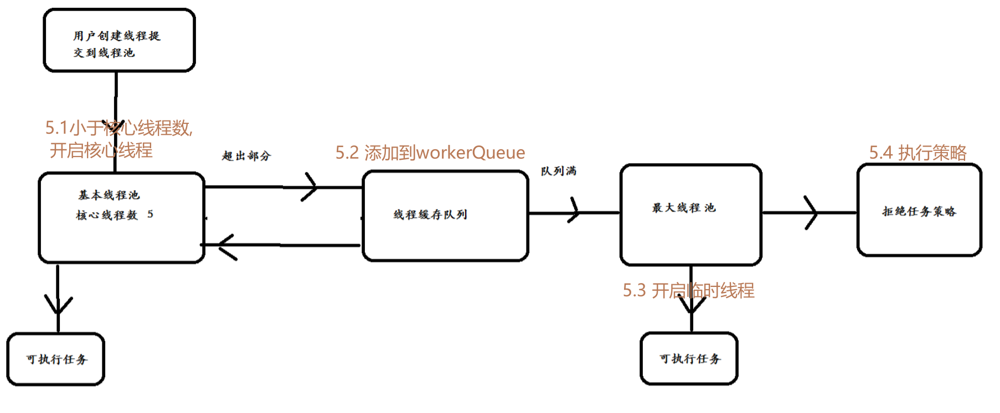


---


## Spring

### spring AOP底层原理


### AOP 代理常用的都有哪些


---

# 算法题

> 二叉树距离最远的两个结点的距离


> 剑指offer04: 二维数组中的查找


>加减乘除求根号2


> 股票问题 


> 数据流中的中位数 (剑指offer) --- 并加入并发锁控制


## 手撕：[链表](https://www.nowcoder.com/jump/super-jump/word?word=链表)的就地逆置问题


## 手撕：寻找[链表](https://www.nowcoder.com/jump/super-jump/word?word=链表)的循环节点


## 手撕翻转链表, 括号匹配


## 二叉树后续遍历展开为链表 (用栈迭代)

> 能不用栈么 (输出链表模拟栈)
>
> 还能更省空间么---morris原地展开二叉树


> 几个大文件怎么排序 (归并)


> 给定一个自然数数组, 找出里面所有和为N的组合


> 给定一个正整数数组, 把奇数排右边, 偶数排左边, 相对顺序不能变


> 堆排序


> 最长不重复子串


## 链表反转


> 带重复的有序数组找第一个等于目标值的数的下标


> 摩尔投票


---

# 数据结构

> B树和B+树的区别


> 了解LSM树么?


---

# 设计模式

> 设计模式知道哪些, 手写单例模式

[**双重校验锁实现对象单例（线程安全）**](https://snailclimb.gitee.io/javaguide/#/docs/java/multi-thread/2020%E6%9C%80%E6%96%B0Java%E5%B9%B6%E5%8F%91%E8%BF%9B%E9%98%B6%E5%B8%B8%E8%A7%81%E9%9D%A2%E8%AF%95%E9%A2%98%E6%80%BB%E7%BB%93?id=_12-%e8%af%b4%e8%af%b4%e8%87%aa%e5%b7%b1%e6%98%af%e6%80%8e%e4%b9%88%e4%bd%bf%e7%94%a8-synchronized-%e5%85%b3%e9%94%ae%e5%ad%97)

具体分析过程见: [设计模式之单例模式](https://jungle8884.icu/2021/04/10/DesignPatternofSingleton/)

> 懒汉式-线程安全

```java
public class Singleton {

    private volatile static Singleton uniqueInstance;

    private Singleton() {
    }

    public static Singleton getUniqueInstance() {
       //先判断对象是否已经实例过，没有实例化过才进入加锁代码
        if (uniqueInstance == null) {
            //类对象加锁
            synchronized (Singleton.class) {
                if (uniqueInstance == null) {
                    uniqueInstance = new Singleton();
                }
            }
        }
        return uniqueInstance;
    }
}
```

> 内部类 (常用)

```java
public class Singleton {

    private static class SingletonHolder {
    	public static Singleton instance = new Singleton();
    }

    private Singleton() {
    }

    public static Singleton getInstance() {
        return SingletonHolder.instance;
    }
}
```


---

# 计算机网络

> 输出一个url发生了什么


> Tcp三次握手，四次挥手，过程及原因


> DNS域名解析使用那个传输层协议, 解析后得到的IP地址属于网络模型中的哪一层?


>http 握手机制, 缓存机制


> udp使用场景


> 网络七层模型, 应用层有什么协议, 网络层有什么协议, 传输层有什么协议, TCP/UDP区别


> HTTP与WebSocket区别


> TCP流量控制


> TCP怎么缩小发送方窗口


> SSL的握手过程


> SSL为什么要用对称和非对称两种加密, 只用非对称有什么问题


> SSL数字证书CA有什么用


---

# 数据库

## mysql中行锁，表锁，及使用情况


## mysql四大隔离级别


## 脏读，幻读，不可重复读


> 讲讲索引


> MySql索引的存储方式


> 为什么用B+树存储索引


> 为什么非叶子结点只存储索引值


> 一条慢查询语句, 怎么优化它


> MySQL索引的底层数据结构


> 介绍一下MySQL事务


> MySQL语句调优


> 数据库索引数据结构有哪几种, 分别有哪些优势


---

# Linux常用命令


---

# Docker常用命令


---

# 操作系统

> 页面置换算法


---

# 项目

> 说一下你对rpc和api的理解, 讲讲区别


> 谈谈ioc与aop并说明一下两者都有哪些使用场景


> 介绍一下项目的事务一致性, 是实现PRC调用的, 有没有做主从服务, 容灾


---

# 其他


> 单例模式, 排序算法, 生产者和消费者, 死锁