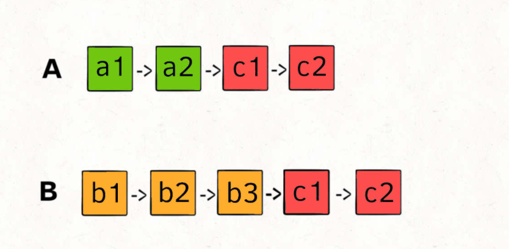
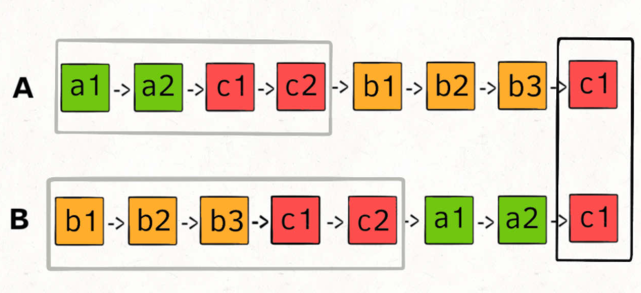

# 两个链表是否相交

给你两个单链表的头节点 `headA` 和 `headB` ，请你找出并返回两个单链表相交的起始节点。

如果两个链表不存在相交节点，返回 `null` 。

图示两个链表在节点 `c1` 开始相交**：**

[](https://assets.leetcode-cn.com/aliyun-lc-upload/uploads/2018/12/14/160_statement.png)

题目数据 **保证** 整个链式结构中不存在环。

**注意**，函数返回结果后，链表必须 **保持其原始结构** 。


**如果不用额外的空间，只使用两个指针，你如何做呢？**

难点在于，由于两条链表的长度可能不同，两条链表之间的节点无法对应：




如果用两个指针 `p1` 和 `p2` 分别在两条链表上前进，并不能**同时**走到公共节点，也就无法得到相交节点 `c1`。

**所以，解决这个问题的关键是，通过某些方式，让 `p1` 和 `p2` 能够同时到达相交节点 `c1`**。

所以，我们可以让 `p1` 遍历完链表 `A` 之后开始遍历链表 `B`，让 `p2` 遍历完链表 `B` 之后开始遍历链表 `A`，这样相当于「逻辑上」两条链表接在了一起。

如果这样进行拼接，就可以让 `p1` 和 `p2` 同时进入公共部分，也就是同时到达相交节点 `c1`：



那你可能会问，如果说两个链表没有相交点，是否能够正确的返回 null 呢？

这个逻辑可以覆盖这种情况的，相当于 `c1` 节点是 null 空指针嘛，可以正确返回 null。

按照这个思路，可以写出如下代码：

```java
//给你两个单链表的头节点 headA 和 headB ，请你找出并返回两个单链表相交的起始节点。如果两个链表不存在相交节点，返回 null 。 
//
// 图示两个链表在节点 c1 开始相交： 
//
// 
//
// 题目数据 保证 整个链式结构中不存在环。 
//
// 注意，函数返回结果后，链表必须 保持其原始结构 。 
//
// 自定义评测： 
//
// 评测系统 的输入如下（你设计的程序 不适用 此输入）： 
//
// 
// intersectVal - 相交的起始节点的值。如果不存在相交节点，这一值为 0 
// listA - 第一个链表 
// listB - 第二个链表 
// skipA - 在 listA 中（从头节点开始）跳到交叉节点的节点数 
// skipB - 在 listB 中（从头节点开始）跳到交叉节点的节点数 
// 
//
// 评测系统将根据这些输入创建链式数据结构，并将两个头节点 headA 和 headB 传递给你的程序。如果程序能够正确返回相交节点，那么你的解决方案将被 视
//作正确答案 。 
//
// 
//
// 示例 1： 
//
// 
//
// 
//输入：intersectVal = 8, listA = [4,1,8,4,5], listB = [5,6,1,8,4,5], skipA = 2, 
//skipB = 3
//输出：Intersected at '8'
//解释：相交节点的值为 8 （注意，如果两个链表相交则不能为 0）。
//从各自的表头开始算起，链表 A 为 [4,1,8,4,5]，链表 B 为 [5,6,1,8,4,5]。
//在 A 中，相交节点前有 2 个节点；在 B 中，相交节点前有 3 个节点。
// 
//
// 示例 2： 
//
// 
//
// 
//输入：intersectVal = 2, listA = [1,9,1,2,4], listB = [3,2,4], skipA = 3, skipB = 
//1
//输出：Intersected at '2'
//解释：相交节点的值为 2 （注意，如果两个链表相交则不能为 0）。
//从各自的表头开始算起，链表 A 为 [1,9,1,2,4]，链表 B 为 [3,2,4]。
//在 A 中，相交节点前有 3 个节点；在 B 中，相交节点前有 1 个节点。
// 
//
// 示例 3： 
//
// 
//
// 
//输入：intersectVal = 0, listA = [2,6,4], listB = [1,5], skipA = 3, skipB = 2
//输出：null
//解释：从各自的表头开始算起，链表 A 为 [2,6,4]，链表 B 为 [1,5]。
//由于这两个链表不相交，所以 intersectVal 必须为 0，而 skipA 和 skipB 可以是任意值。
//这两个链表不相交，因此返回 null 。
// 
//
// 
//
// 提示： 
//
// 
// listA 中节点数目为 m 
// listB 中节点数目为 n 
// 0 <= m, n <= 3 * 10⁴ 
// 1 <= Node.val <= 10⁵ 
// 0 <= skipA <= m 
// 0 <= skipB <= n 
// 如果 listA 和 listB 没有交点，intersectVal 为 0 
// 如果 listA 和 listB 有交点，intersectVal == listA[skipA] == listB[skipB] 
// 
//
// 
//
// 进阶：你能否设计一个时间复杂度 O(n) 、仅用 O(1) 内存的解决方案？ 
// Related Topics 哈希表 链表 双指针 👍 1423 👎 0


//leetcode submit region begin(Prohibit modification and deletion)
/**
 * Definition for singly-linked list.
 * public class ListNode {
 *     int val;
 *     ListNode next;
 *     ListNode(int x) {
 *         val = x;
 *         next = null;
 *     }
 * }
 */
public class Solution {
    public ListNode getIntersectionNode(ListNode headA, ListNode headB) {
        ListNode pA = headA, pB = headB;
        while (pA != pB) {
            // pA 走一步，如果走到 A 链表末尾，转到 B 链表
            if (pA == null) {
                pA = headB;
            } else {
                pA = pA.next;
            }

            // pB 走一步，如果走到 B 链表末尾，转到 A 链表
            if (pB == null) {
                pB = headA;
            } else {
                pB = pB.next;
            }
        }

        return pA;
    }
}
//leetcode submit region end(Prohibit modification and deletion)
```


