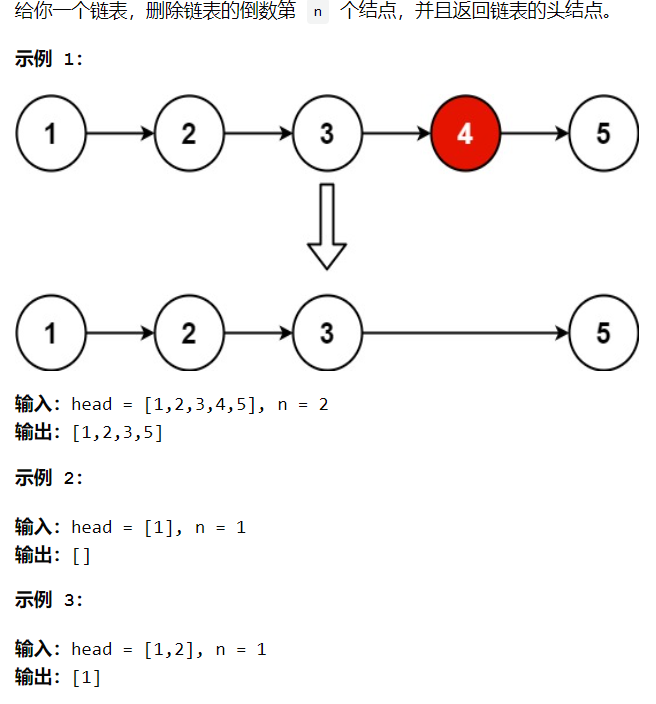
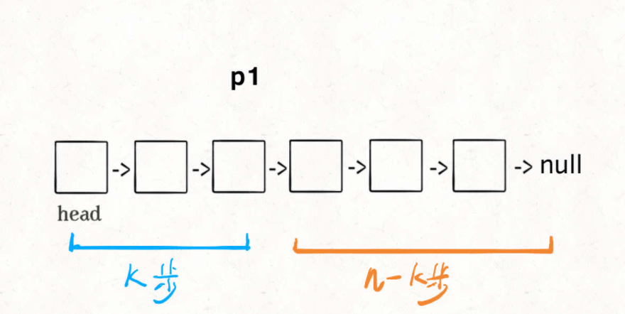
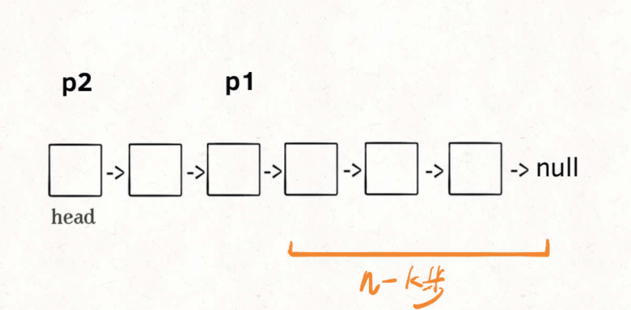
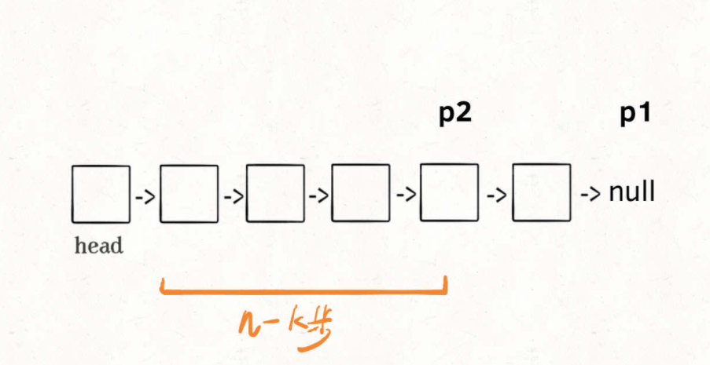

# 删除链表的倒数第N个节点

> https://leetcode-cn.com/problems/remove-nth-node-from-end-of-list/
>
> https://labuladong.gitee.io/algo/2/17/16/#单链表的倒数第-k-个节点



> **这个解法就比较巧妙了，假设 `k = 2`，思路如下：**

1 首先，我们先让一个指针 `p1` 指向链表的头节点 `head`，然后走 `k` 步：



**现在的 `p1`，只要再走 `n - k` 步，就能走到链表末尾的空指针了**


2 趁这个时候，再用一个指针 `p2` 指向链表头节点 `head`：




3 接下来就很显然了，让 `p1` 和 `p2` 同时向前走，`p1` 走到链表末尾的空指针时走了 `n - k` 步，`p2` 也走了 `n - k` 步，也就是链表的倒数第 `k` 个节点：



这样，只遍历了一次链表，就获得了倒数第 `k` 个节点 `p2`。

上述逻辑的代码如下：

```java
// 返回链表的倒数第 k 个节点
ListNode findFromEnd(ListNode head, int k) {
    ListNode p1 = head;
    // p1 先走 k 步
    for (int i = 0; i < k; i++) {
        p1 = p1.next;
    }
    ListNode p2 = head;
    // p1 和 p2 同时走 n - k 步
    while (p1 != null) {
        p2 = p2.next;
        p1 = p1.next;
    }
    // p2 现在指向第 n - k 个节点
    return p2;
}
```

**上述是理论上的分析, 其核心是双指针中的快慢指针:**

---


## 解法一:

```java
删除链表的倒数第 N 个结点

//给你一个链表，删除链表的倒数第 n 个结点，并且返回链表的头结点。 
//
// 
//
// 示例 1： 
//
// 
//输入：head = [1,2,3,4,5], n = 2
//输出：[1,2,3,5]
// 
//
// 示例 2： 
//
// 
//输入：head = [1], n = 1
//输出：[]
// 
//
// 示例 3： 
//
// 
//输入：head = [1,2], n = 1
//输出：[1]
// 
//
// 
//
// 提示： 
//
// 
// 链表中结点的数目为 sz 
// 1 <= sz <= 30 
// 0 <= Node.val <= 100 
// 1 <= n <= sz 
// 
//
// 
//
// 进阶：你能尝试使用一趟扫描实现吗？ 
// Related Topics 链表 双指针 👍 1657 👎 0

import com.linklist.ListNode;
//leetcode submit region begin(Prohibit modification and deletion)
/**
 * Definition for singly-linked list.
 * public class ListNode {
 *     int val;
 *     ListNode next;
 *     ListNode() {}
 *     ListNode(int val) { this.val = val; }
 *     ListNode(int val, ListNode next) { this.val = val; this.next = next; }
 * }
 */
class Solution {
    public ListNode removeNthFromEnd(ListNode head, int n) {
        // 虚拟头结点 (第0个节点)
        ListNode dummy = new ListNode(-1);
        dummy.next = head;
        // 删除倒数第 n 个，要先找倒数第 n + 1 个节点 (就是它前面的那一个节点)
        ListNode x = findFromEnd(dummy, n+1);
        // 删掉倒数第 n 个节点
        x.next = x.next.next;

        return dummy.next;
    }

    /**
     * 返回链表的倒数第k个节点
     * */
    ListNode findFromEnd(ListNode head, int k) {
        ListNode p1 = head;
        // p1 先走 k 步
        for (int i = 1; i <= k; i++) {
            p1 = p1.next;
        }
        ListNode p2 = head;
        // p1 和 p2 同时走 n - k 步
        while (p1 != null) {
            p2 = p2.next;
            p1 = p1.next;
        }

        // p2 现在指向第 n - k 个节点
        return p2;
    }
}
//leetcode submit region end(Prohibit modification and deletion)
```

---


## 解法二:

> 不借助虚拟头指针的写法!

```java
class Solution {
    public ListNode removeNthFromEnd(ListNode head, int n) {
        ListNode fast, slow;
        fast = slow = head;
        // 快指针先前进 n 步
        while (n-- > 0) {
            fast = fast.next;
        }
        
        if (fast == null) {
            // 如果此时快指针走到头了，
            // 说明倒数第 n 个节点就是第一个节点
            return head.next;
        }
        
        // 让慢指针和快指针同步向前
        while (fast != null && fast.next != null) {
            slow = slow.next;
            fast = fast.next;
        }
        
        // slow.next 就是倒数第 n 个节点，删除它
        // slow 指向 倒数第n个节点的前一个节点
        slow.next = slow.next.next;
        
        return head;
    }
}
```

---


## 解法三:

> 上面的变形,  自己刷题时随便写出来的...

```java
class Solution {
    public ListNode removeNthFromEnd(ListNode head, int n) {
        ListNode fast = head, slow = head;
        for (int i = 1; i <= n-1; i++) {
            fast = fast.next;
        }

        if (fast.next == null) {
            return head.next;
        }
        
        // slow 指向 倒数第n个节点的前一个节点
        while (fast.next.next != null) {
            fast = fast.next;
            slow = slow.next;
        }

        slow.next = slow.next.next;

        return head;
    }
}
```

