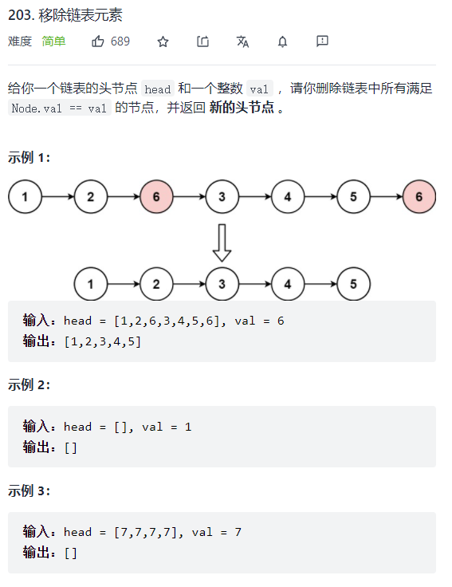

# 203-移除链表元素

## [来源](https://leetcode-cn.com/problems/remove-linked-list-elements/)



## 输入输出准备：

```java
public static void main(String[] args) {
    Scanner sc = new Scanner(System.in);
    // 录入一行数组
    int[] nums = StringToIntArray(sc.nextLine());
    int val = sc.nextInt();
    int res = removeElement(nums, val);
    System.out.println(res);
}

// 录入格式: [1,5,11,5]
public static int[] StringToIntArray(String str) {
    String[] strs = str
            .replace('[', ' ')
            .replace(']', ' ')
            .trim().split(",");
    return Arrays.stream(strs).mapToInt((s)->{return Integer.valueOf(s);}).toArray();
}
```

## 解法一：（自己想的解法：`双指针`）

```java
public static int removeElement(int[] nums, int val) {
    // 自己的写法：
    int len = nums.length;
    // 易忘点
    if (len == 0) return 0;

    int left = 0, right = len-1;
    while (left <= right) {
        if (left <= right && nums[left] == val) {
            while (right != left && nums[right] ==  val) right--;
            if (left != right) {
                int tmp = nums[left];
                nums[left] = nums[right];
                nums[right] = tmp;
                right--;
            }
        }
        left++;
    }
    // 退出后， 判断最后一个是不是val: 是则left--
    if (nums[--left] == val) left--;
    // 索引加1才是个数
    return left+1;
}
```

## 解法二：（大佬解法：`快慢指针法`）

```java
public static int removeElement(int[] nums, int val) {
    // 快慢指针法：注意此方法并没有改变元素的相对位置！
    int slowIndex = 0;
    for (int fastIndex = 0; fastIndex < nums.length; fastIndex++) {
        if (val != nums[fastIndex]) {
            nums[slowIndex++] = nums[fastIndex];
        }
    }
    return slowIndex;
}
```

---

