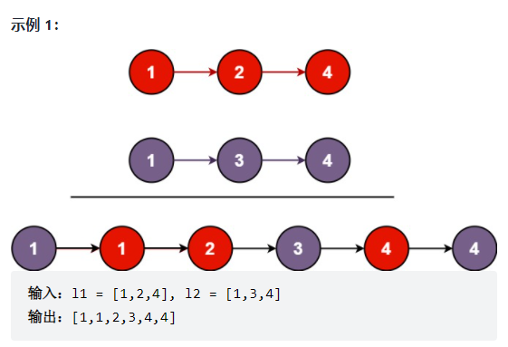

# 21-合并两个有序链表

[来源](https://labuladong.github.io/algo/2/17/16/)

> https://leetcode-cn.com/problems/merge-two-sorted-lists/
>
> 将两个升序链表合并为一个新的 **升序** 链表并返回。新链表是通过拼接给定的两个链表的所有节点组成的。 
>
> 

```java
/**
 * Definition for singly-linked list.
 * public class ListNode {
 *     int val;
 *     ListNode next;
 *     ListNode() {}
 *     ListNode(int val) { this.val = val; }
 *     ListNode(int val, ListNode next) { this.val = val; this.next = next; }
 * }
 */
class Solution {
    public ListNode mergeTwoLists(ListNode l1, ListNode l2) {
        // 虚拟头结点
        ListNode dummy = new ListNode(-1), p = dummy;
        ListNode p1 = l1, p2 = l2;
        
        while (p1 != null && p2 != null) {
            // 比较 p1 和 p2 两个指针
            // 将值较小的的节点接到 p 指针
            if (p1.val > p2.val) {
                p.next = p2;
                p2 = p2.next;
            } else {
                p.next = p1;
                p1 = p1.next;
            }
            // p 指针不断前进
            p = p.next;
        }

        if (p1 != null) {
            p.next = p1;
        }

        if (p2 != null) {
            p.next = p2;
        }

        return dummy.next;
    }
}
```

这个算法的逻辑类似于「拉拉链」，`l1, l2` 类似于拉链两侧的锯齿，指针 `p` 就好像拉链的拉索，将两个有序链表合并。

**代码中还用到一个链表的算法题中是很常见的「虚拟头结点」技巧，也就是 `dummy` 节点**。你可以试试，如果不使用 `dummy` 虚拟节点，代码会复杂很多，而有了 `dummy` 节点这个占位符，可以避免处理空指针的情况，降低代码的复杂性。


