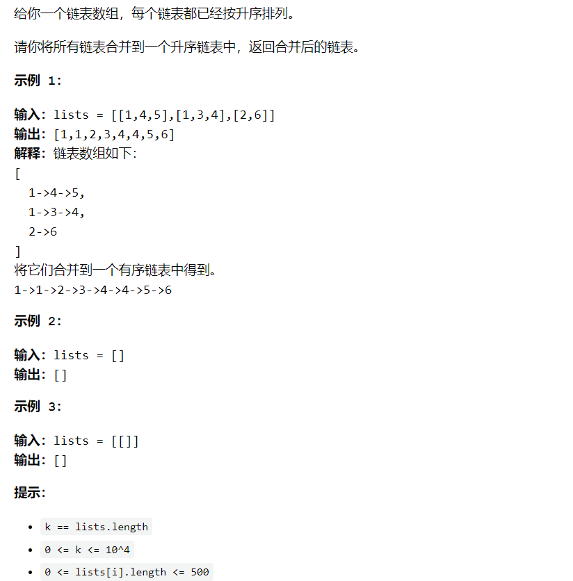

# 合并K个有序链表

> https://leetcode-cn.com/problems/merge-k-sorted-lists/
>
> https://labuladong.gitee.io/algo/2/17/16/#合并-k-个有序链表



**合并 `k` 个有序链表的逻辑类似合并两个有序链表，难点在于，如何快速得到 `k` 个节点中的最小节点，接到结果链表上？**

这里我们就要用到 [优先级队列（二叉堆）](https://labuladong.gitee.io/algo/2/20/49/) 这种数据结构，把链表节点放入一个最小堆，就可以每次获得 `k` 个节点中的最小节点：

```java
//给你一个链表数组，每个链表都已经按升序排列。 
//
// 请你将所有链表合并到一个升序链表中，返回合并后的链表。 
//
// 
//
// 示例 1： 
//
// 输入：lists = [[1,4,5],[1,3,4],[2,6]]
//输出：[1,1,2,3,4,4,5,6]
//解释：链表数组如下：
//[
//  1->4->5,
//  1->3->4,
//  2->6
//]
//将它们合并到一个有序链表中得到。
//1->1->2->3->4->4->5->6
// 
//
// 示例 2： 
//
// 输入：lists = []
//输出：[]
// 
//
// 示例 3： 
//
// 输入：lists = [[]]
//输出：[]
// 
//
// 
//
// 提示： 
//
// 
// k == lists.length 
// 0 <= k <= 10^4 
// 0 <= lists[i].length <= 500 
// -10^4 <= lists[i][j] <= 10^4 
// lists[i] 按 升序 排列 
// lists[i].length 的总和不超过 10^4 
// 
// Related Topics 链表 分治 堆（优先队列） 归并排序 👍 1598 👎 0

import java.util.PriorityQueue;
import com.linklist.ListNode;
//leetcode submit region begin(Prohibit modification and deletion)
/**
 * Definition for singly-linked list.
 * public class ListNode {
 *     int val;
 *     ListNode next;
 *     ListNode() {}
 *     ListNode(int val) { this.val = val; }
 *     ListNode(int val, ListNode next) { this.val = val; this.next = next; }
 * }
 */
class Solution {
    public ListNode mergeKLists(ListNode[] lists) {
        if (lists.length == 0) {
            return null;
        }

        // 虚拟头结点
        ListNode dummy = new ListNode(-1);
        ListNode p = dummy;

        // 优先级队列-最小堆
        PriorityQueue<ListNode> priorityQueue = new PriorityQueue<>(
                lists.length, (node1, node2)->{
            return node1.val - node2.val;
        });
        for (ListNode head :
                lists) {
            if (head != null) {
                priorityQueue.add(head);
            }
        }

        while (!priorityQueue.isEmpty()) {
            ListNode node = priorityQueue.poll();
            p.next = node;
            if (node.next != null) {
                priorityQueue.add(node.next);
            }
            p = p.next;
        }

        return dummy.next;
    }
}
//leetcode submit region end(Prohibit modification and deletion)
```

优先队列 `pq` 中的元素个数最多是 `k`，所以一次 `poll` 或者 `add` 方法的时间复杂度是 `O(logk)`；所有的链表节点都会被加入和弹出 `pq`，**所以算法整体的时间复杂度是 `O(Nlogk)`，其中 `k` 是链表的条数，`N` 是这些链表的节点总数**。

---

