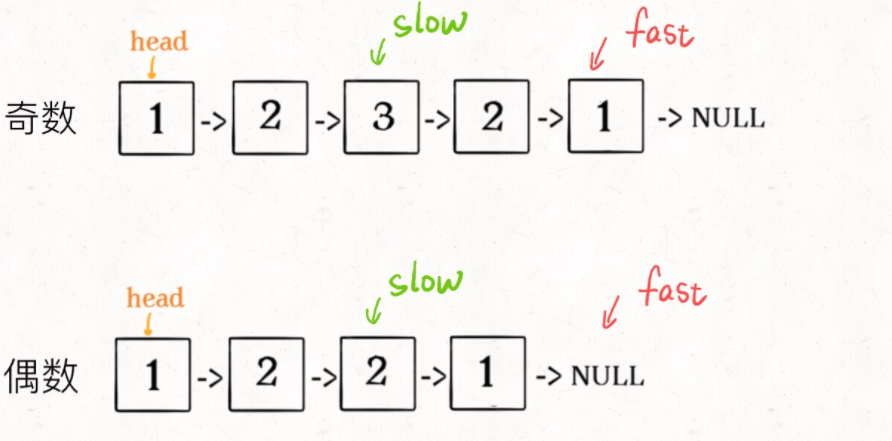
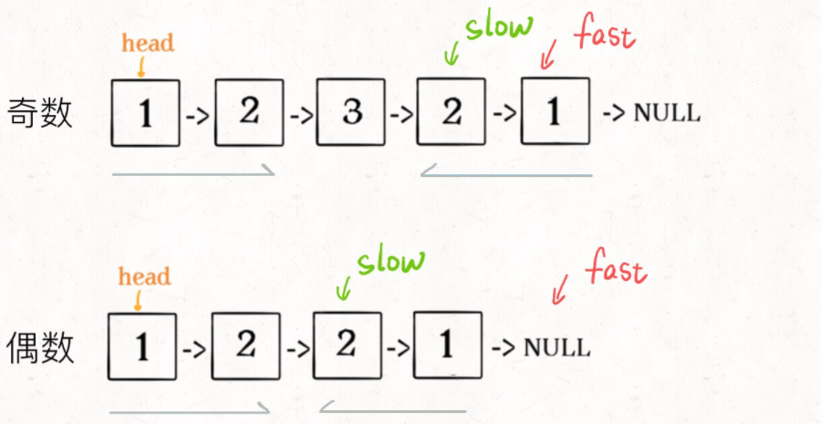
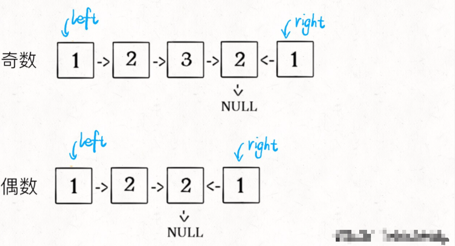
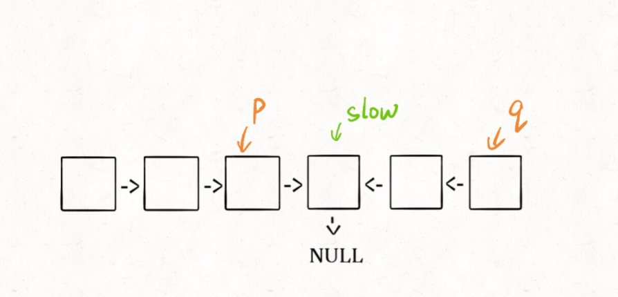

# 回文链表


## 引入

> **寻找**回文串的核心思想是从中心向两端扩展：

```java
string palindrome(string& s, int l, int r) {
    // 防止索引越界
    while (l >= 0 && r < s.size()
            && s[l] == s[r]) {
        // 向两边展开
        l--; r++;
    }
    // 返回以 s[l] 和 s[r] 为中心的最长回文串
    return s.substr(l + 1, r - l - 1);
}
```

因为回文串长度可能为奇数也可能是偶数，长度为奇数时只存在一个中心点，而长度为偶数时存在两个中心点，所以上面这个函数需要传入`l`和`r`。


> 而**判断**一个字符串是不是回文串就简单很多，不需要考虑奇偶情况，只需要「双指针技巧」，从两端向中间逼近即可：

```java
bool isPalindrome(string s) {
    int left = 0, right = s.length - 1;
    while (left < right) {
        if (s[left] != s[right])
            return false;
        left++; right--;
    }
    return true;
}
```

**因为回文串是对称的，所以正着读和倒着读应该是一样的，这一特点是解决回文串问题的关键**。

---


## [判断回文单链表](https://labuladong.gitee.io/algo/2/17/19/#一判断回文单链表)

输入一个单链表的头结点，判断这个链表中的数字是不是回文：

```java
/**
 * 单链表节点的定义：
 * public class ListNode {
 *     int val;
 *     ListNode next;
 * }
 */

boolean isPalindrome(ListNode head);

输入: 1->2->null
输出: false

输入: 1->2->2->1->null
输出: true
```

这道题的关键在于，单链表无法倒着遍历，无法使用双指针技巧。

**那么最简单的办法就是，把原始链表反转存入一条新的链表，然后比较这两条链表是否相同。**

关于如何反转链表，可以参见前文 [递归翻转链表的一部分](https://labuladong.gitee.io/algo/2/17/17/)。

其实，**借助二叉树后序遍历的思路，不需要显式反转原始链表也可以倒序遍历链表**，下面来具体聊聊。

对于二叉树的几种遍历方式，我们再熟悉不过了：

```java
void traverse(TreeNode root) {
    // 前序遍历代码
    traverse(root.left);
    // 中序遍历代码
    traverse(root.right);
    // 后序遍历代码
}

```


在 [学习数据结构的框架思维](https://labuladong.gitee.io/algo/1/2/) 中说过，链表兼具递归结构，树结构不过是链表的衍生。那么，**链表其实也可以有前序遍历和后序遍历**：

```java
void traverse(ListNode head) {
    // 前序遍历代码
    traverse(head.next);
    // 后序遍历代码
}
```

这个框架有什么指导意义呢？如果我想正序打印链表中的 `val` 值，可以在前序遍历位置写代码；反之，如果想倒序遍历链表，就可以在后序遍历位置操作：

```java
/* 倒序打印单链表中的元素值 */
void traverse(ListNode head) {
    if (head == null) return;
    traverse(head.next);
    // 后序遍历代码
    print(head.val);
}
```

---


### 解法1

> 说到这了，其实可以稍作修改，模仿双指针实现回文判断的功能：

```java
// 左侧指针
ListNode left;

boolean isPalindrome(ListNode head) {
    left = head;
    return traverse(head);
}

boolean traverse(ListNode right) {
    if (right == null) return true;
    boolean res = traverse(right.next);
    // 后序遍历代码
    res = res && (right.val == left.val);
    left = left.next;
    return res;
}
```

这么做的核心逻辑是什么呢？**实际上就是把链表节点放入一个栈，然后再拿出来，这时候元素顺序就是反的**，只不过我们利用的是递归函数的堆栈而已。

**当然，无论造一条反转链表还是利用后序遍历，算法的时间和空间复杂度都是 O(N)。**

---


### 解法2:

更好的思路是这样的：

**1、先通过 [双指针技巧](https://labuladong.gitee.io/algo/2/17/16/) 中的快慢指针来找到链表的中点**：

```java
ListNode slow, fast;
slow = fast = head;
while (fast != null && fast.next != null) {
    slow = slow.next;
    fast = fast.next.next;
}
// slow 指针现在指向链表中点
```



**2、如果`fast`指针没有指向`null`，说明链表长度为奇数，`slow`还要再前进一步**：

```java
if (fast != null)
    slow = slow.next;
```



**3、从`slow`开始反转后面的链表，现在就可以开始比较回文串了**：

```java
ListNode left = head;
ListNode right = reverse(slow);

while (right != null) {
    if (left.val != right.val)
        return false;
    left = left.next;
    right = right.next;
}
return true;
```



至此，把上面 3 段代码合在一起就高效地解决这个问题了，其中 `reverse` 函数很容易实现：

```java
boolean isPalindrome(ListNode head) {
    ListNode slow, fast;
    slow = fast = head;
    while (fast != null && fast.next != null) {
        slow = slow.next;
        fast = fast.next.next;
    }
    
    if (fast != null)
        slow = slow.next;
    
    ListNode left = head;
    ListNode right = reverse(slow);
    while (right != null) {
        if (left.val != right.val)
            return false;
        left = left.next;
        right = right.next;
    }
    
    return true;
}

ListNode reverse(ListNode head) {
    ListNode pre = null, cur = head;
    while (cur != null) {
        ListNode next = cur.next;
        cur.next = pre;
        pre = cur;
        cur = next;
    }
    return pre;
}
```

算法总体的时间复杂度 O(N)，空间复杂度 O(1)，已经是最优的了。

我知道肯定有读者会问：这种解法虽然高效，但破坏了输入链表的原始结构，能不能避免这个瑕疵呢？

其实这个问题很好解决，关键在于得到`p, q`这两个指针位置：



这样，只要在函数 return 之前加一段代码即可恢复原先链表顺序：

```java
p.next = reverse(q);
```

---


### 实际代码:

```java
package com.linklist;

/**
 * @author Jungle
 */
public class isPalindrome_234 {

    public static void main(String[] args) {
        ListNode node1 = new ListNode(1);
        ListNode node2 = new ListNode(2);
        ListNode node3 = new ListNode(2);
        ListNode node4 = new ListNode(1);
        ListNode head = node1;
        node1.next = node2;
        node2.next = node3;
        node3.next = node4;
        node4.next = null;
        
        isPalindrome_234 isP = new isPalindrome_234();
        
        isP.preTraverse(head);
        System.out.println(isP.isPalindrome1(head));

//        isP.preTraverse(head);
//        System.out.println(isP.isPalindrome2(head));

        isP.preTraverse(head);
    }

    /**
     * 左侧指针
     * */
    ListNode left;

    /**
     * 后续遍历链表
     * */
    boolean traverse(ListNode right) {
        if (right == null) {
            return true;
        }
        boolean res = traverse(right.next);

        // 后续遍历代码
        res = res && (left.val == right.val);
        left = left.next;

        return res;
    }

    /**
     * 输入一个单链表的头结点，判断这个链表中的数字是不是回文
     * */
    public boolean isPalindrome1(ListNode head) {
        left = head;
        return traverse(head);
    }

    // 法2: --------------------------------------

    /**
     * 翻转单链表
     * */
    ListNode reverse(ListNode head) {
        ListNode pre, cur, nxt;
        pre = null; cur = head; nxt = head;
        while (cur != null) {
            nxt = cur.next;
            cur.next = pre;
            pre = cur;
            cur = nxt;
        }

        return pre;
    }

    public boolean isPalindrome2(ListNode head) {
        // 先通过双指针找到链表的中点
        ListNode slow, fast;
        slow = fast = head;
        while (fast != null && fast.next != null) {
            slow = slow.next;
            fast = fast.next.next;
        }
        // slow 指向链表中点
        // 如果fast指针没有指向null, 说明链表长度为奇数, slow还要再前进一步
        if (fast != null) {
            slow = slow.next;
        }

        // 用于恢复链表结构的指针
        ListNode p, q;

        // 从slow开始反转后面的链表, 开始比较回文串
        ListNode left = head;
        ListNode right = reverse(slow);
        p = left; q = right;
        while (right != null) {
            if (left.val != right.val) {
                return false;
            }
            p = left;
            left = left.next;
            right = right.next;
        }

        p.next = reverse(q);
        return true;
    }

    void preTraverse(ListNode head) {
        if (head == null) {
            return;
        }
        // 前序遍历
        System.out.print(head.val);

        preTraverse(head.next);
    }

}
```

---


