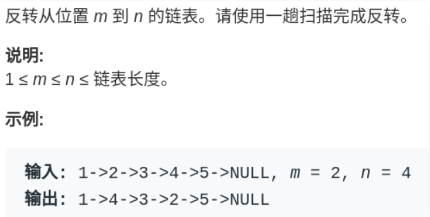
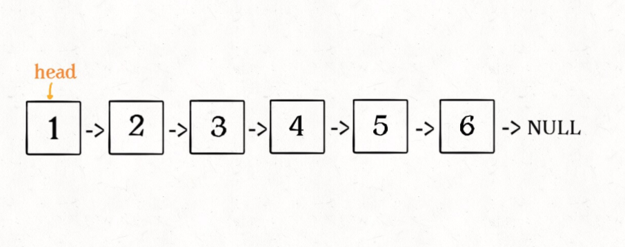
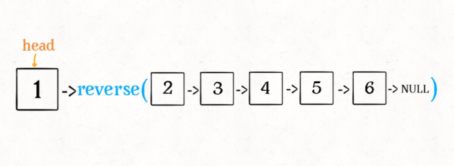
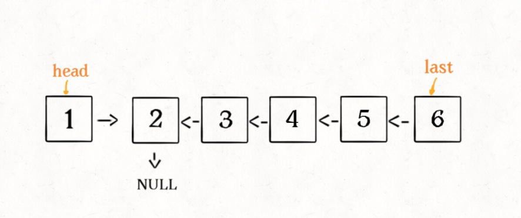
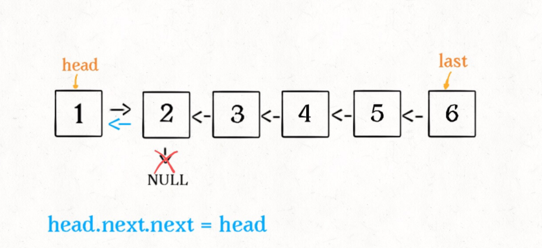
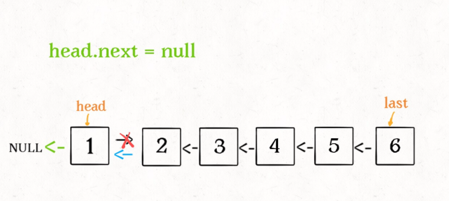
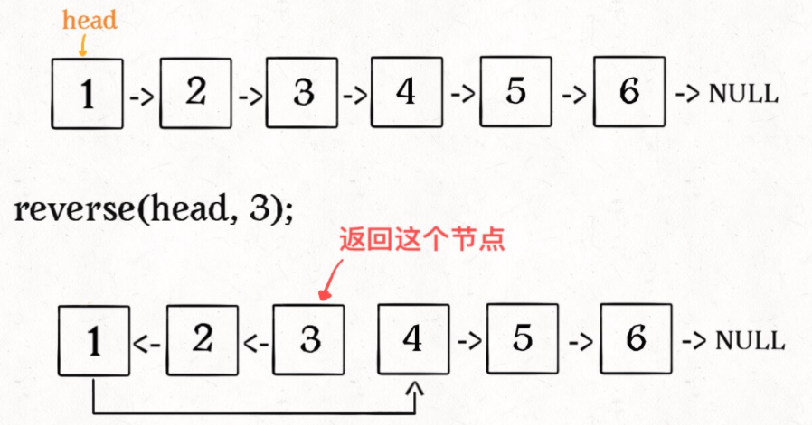
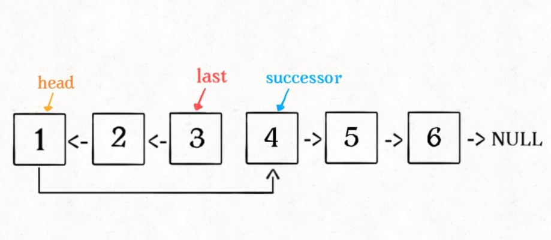

# 反转链表

反转单链表的迭代实现不是一个困难的事情，但是递归实现就有点难度了，如果再加一点难度，让你仅仅反转单链表中的一部分，你是否能**够递归实现**呢？

> https://labuladong.gitee.io/algo/2/17/17/
>
> 什么叫反转单链表的一部分呢，就是给你一个索引区间，让你把单链表中这部分元素反转，其他部分不变：



**注意这里的索引是从 1 开始的**。

迭代的思路大概是：先用一个 for 循环找到第 `m` 个位置，然后再用一个 for 循环将 `m` 和 `n` 之间的元素反转。

但是我们的递归解法不用一个 for 循环，纯递归实现反转。

迭代实现思路看起来虽然简单，但是细节问题很多的，反而不容易写对。

相反，递归实现就很简洁优美，下面就由浅入深，先从反转整个单链表说起。

---


## [递归反转整个链表](https://labuladong.gitee.io/algo/2/17/17/#一递归反转整个链表)

**对于递归算法，最重要的就是明确递归函数的定义**。

具体来说，我们的 `reverse` 函数定义是这样的：**输入一个节点 `head`，将「以 `head` 为起点」的链表反转，并返回反转之后的头结点**。

明白了函数的定义，在来看这个问题。比如说我们想反转这个链表：



那么输入 `reverse(head)` 后，会在这里进行递归：

```java
ListNode last = reverse(head.next);
```

**不要跳进递归（你的脑袋能压几个栈呀？），而是要根据刚才的函数定义，来弄清楚这段代码会产生什么结果：**



这个 `reverse(head.next)` 执行完成后，整个链表就成了这样：



并且根据函数定义，`reverse` 函数会返回反转之后的头结点，我们用变量 `last` 接收了。


现在再来看下面的代码：

```java
head.next.next = head;
```



接下来：

```java
head.next = null;
return last;
```



神不神奇，这样整个链表就反转过来了！递归代码就是这么简洁优雅，不过其中有两个地方需要注意：

1、递归函数要有 base case，也就是这句：

```java
if (head.next == null) return head;
```

意思是如果链表只有一个节点的时候反转也是它自己，直接返回即可。

2、当链表递归反转之后，新的头结点是 `last`，而之前的 `head` 变成了最后一个节点，别忘了链表的末尾要指向 null：

```java
head.next = null;
```

理解了这两点后，我们就可以进一步深入了，接下来的问题其实都是在这个算法上的扩展。

**所以递归写法如下:**

```java
ListNode reverse(ListNode head) {
    if (head.next == null) return head;
    ListNode last = reverse(head.next);
    head.next.next = head;
    head.next = null;
    return last;
}
```


**对比-非递归写法:**

```java
/**
 * 反转以 a 为头结点的链表
 * 其实就是翻转 a 到 null 之间的 节点
 * */
ListNode reverse(ListNode a) {
    ListNode pre, cur, nxt;
    pre = null; cur = a; nxt = a;
    while (cur != null) {
        // 逐个节点翻转
        nxt = cur.next;
        cur.next = pre;
        // 更新指针位置
        pre = cur;
        cur = nxt;
    }

    return pre;
}
```

---


## [反转链表前N个节点](https://labuladong.gitee.io/algo/2/17/17/#二反转链表前-n-个节点)

```java
// 将链表的前 n 个节点反转（n <= 链表长度）
ListNode reverseN(ListNode head, int n)
```

比如说对于下图链表，执行 `reverseN(head, 3)`：



> 解决思路和反转整个链表差不多，只要稍加修改即可：

```java
ListNode successor = null; // 后驱节点

// 反转以 head 为起点的 n 个节点，返回新的头结点
ListNode reverseN(ListNode head, int n) {
    if (n == 1) {
        // 记录第 n + 1 个节点
        successor = head.next;
        return head;
    }
    // 以 head.next 为起点，需要反转前 n - 1 个节点
    ListNode last = reverseN(head.next, n - 1);

    head.next.next = head;
    // 让反转之后的 head 节点和后面的节点连起来
    head.next = successor;
    return last;
}
```

具体的区别：

1、base case 变为 `n == 1`，反转一个元素，就是它本身，同时**要记录后驱节点**。

2、刚才我们直接把 `head.next` 设置为 null，因为整个链表反转后原来的 `head` 变成了整个链表的最后一个节点。但现在 `head` 节点在递归反转之后不一定是最后一个节点了，所以要记录后驱 `successor`（第 n + 1 个节点），反转之后将 `head` 连接上。



---


## [反转链表的一部分](https://labuladong.gitee.io/algo/2/17/17/#三反转链表的一部分)

现在解决我们最开始提出的问题，给一个索引区间 `[m,n]`（索引从 1 开始），仅仅反转区间中的链表元素。

```java
ListNode reverseBetween(ListNode head, int m, int n)
```

首先，如果 `m == 1`，就相当于反转链表开头的 `n` 个元素嘛，也就是我们刚才实现的功能：

```java
ListNode reverseBetween(ListNode head, int m, int n) {
    // base case
    if (m == 1) {
        // 相当于反转前 n 个元素
        return reverseN(head, n);
    }
    // ...
}
```

如果 `m != 1` 怎么办？

- 如果我们把 `head` 的索引视为 1，那么我们是想从第 `m` 个元素开始反转对吧；
- 如果把 `head.next` 的索引视为 1 呢？
  - 那么相对于 `head.next`，反转的区间应该是从第 `m - 1` 个元素开始的；
  - 那么对于 `head.next.next` 呢……

区别于迭代思想，这就是递归思想，所以我们可以完成代码：

```java
ListNode reverseBetween(ListNode head, int m, int n) {
    // base case
    if (m == 1) {
        return reverseN(head, n);
    }
    // 前进到反转的起点触发 base case
    head.next = reverseBetween(head.next, m - 1, n - 1);
    return head;
}
```

---


## 整体代码

```java
//给你单链表的头指针 head 和两个整数 left 和 right ，其中 left <= right 。请你反转从位置 left 到位置 right 的链
//表节点，返回 反转后的链表 。
// 
//
// 示例 1： 
//
// 
//输入：head = [1,2,3,4,5], left = 2, right = 4
//输出：[1,4,3,2,5]
// 
//
// 示例 2： 
//
// 
//输入：head = [5], left = 1, right = 1
//输出：[5]
// 
//
// 
//
// 提示： 
//
// 
// 链表中节点数目为 n 
// 1 <= n <= 500 
// -500 <= Node.val <= 500 
// 1 <= left <= right <= n 
// 
//
// 
//
// 进阶： 你可以使用一趟扫描完成反转吗？ 
// Related Topics 链表 👍 1077 👎 0

import com.linklist.ListNode;
//leetcode submit region begin(Prohibit modification and deletion)
/**
 * Definition for singly-linked list.
 * public class ListNode {
 *     int val;
 *     ListNode next;
 *     ListNode() {}
 *     ListNode(int val) { this.val = val; }
 *     ListNode(int val, ListNode next) { this.val = val; this.next = next; }
 * }
 */
class Solution {
    /**
     * 后驱结点
     */
    ListNode successor;
    /**
     * 将链表的前 n 个节点反转（n <= 链表长度）
     * 反转以 head 为起点的 n 个节点，返回新的头结点
     * 索引从1开始
     */
    ListNode reverseN(ListNode head, int n) {
        // base case
        if (n == 1) {
            // 记录第 n+1 个节点
            successor = head.next;
            return head;
        }
        // 以head.next 为起点, 需要反转前 n-1 个节点
        ListNode last = reverseN(head.next, n-1);

        head.next.next = head;
        // 让反转之后的head节点和后面的节点连起来
        head.next = successor;

        return last;
    }

    public ListNode reverseBetween(ListNode head, int m, int n) {
        // base case
        if (m == 1) {
            return reverseN(head, n);
        }
        // 前进到反转的起点触发 base case
        head.next = reverseBetween(head.next, m-1, n-1);

        return head;
    }
}
//leetcode submit region end(Prohibit modification and deletion)
```

---


