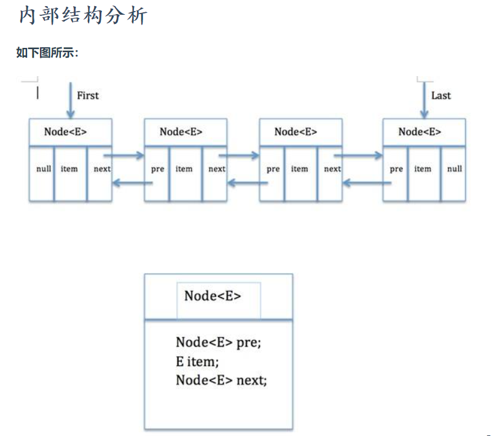
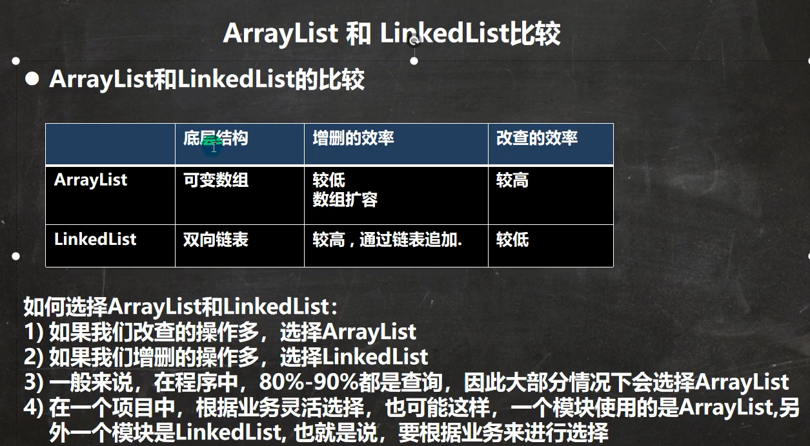

# `LinkedList`

## 说明

> 1. `LinkedList` 实现了 双向链表 和 双端队列 特点
>    1. 通过Node结点的pre和next指向前驱和后继实现了双向链表
>    2. 通过first和last实现了双端队列特点
>    3. 对于添加和删除元素来说, 效率比较高
> 2. 可以添加任意元素(可以重复), 且包括`null`
> 3. 线程不安全, 没有实现同步

```java
public class LinkedList<E>
    extends AbstractSequentialList<E>
    implements List<E>, Deque<E>, Cloneable, java.io.Serializable
```

```java
transient Node<E> first; 
transient Node<E> last;
```




``` java
// 内部类
private static class Node<E> {
    E item;//节点值
    Node<E> next;//后继节点
    Node<E> prev;//前驱节点

    Node(Node<E> prev, E element, Node<E> next) {
        this.item = element;
        this.next = next;
        this.prev = prev;
    }
}
```

## CRUD

> 一般使用无参构造
>
> ```java
> public LinkedList() {}
> ```


### 增

```java
// 在尾部增加
public boolean add(E e) {
    linkLast(e);
    return true;
}

void linkLast(E e) {
    final Node<E> l = last;
    final Node<E> newNode = new Node<>(l, e, null); // 新结点加到尾部
    last = newNode; // 指向尾结点
    if (l == null) // 若add前是空链表
        first = newNode;
    else
        l.next = newNode;
    size++;     // 实际数目加1 
    modCount++; // 修改次数加1
}
```

> 注: 一般初始化都是 `List list = new LinkedList();`
>
> 所以, 第一次`add`时:
>
> - `l =  last = null`
> - `newNode = new Node<E>(null, e, null)` 就是第一个结点
> - `first = newNode` 指向新添加的结点


> 其他`add`方式

- 添加在头部: 头插法

```java
public void addFirst(E e) {
    linkFirst(e);
}

private void linkFirst(E e) {
    final Node<E> f = first;
    final Node<E> newNode = new Node<>(null, e, f);
    first = newNode;
    if (f == null)
        last = newNode;
    else
        f.prev = newNode;
    size++;
    modCount++;
}
```

- 添加在尾部: 尾插法

``` java
public void addLast(E e) {
    linkLast(e);
}

void linkLast(E e) {
    final Node<E> l = last;
    final Node<E> newNode = new Node<>(l, e, null); // 新结点加到尾部
    last = newNode; // 指向尾结点
    if (l == null) // 若add前是空链表
        first = newNode;
    else
        l.next = newNode;
    size++;     // 实际数目加1 
    modCount++; // 修改次数加1
}
```

- 指定位置插入:
  -  一般在index的前面插入
  - index == size 就在尾部插入

```java
public void add(int index, E element) {
    checkPositionIndex(index);

    if (index == size)
        linkLast(element);
    else
        linkBefore(element, node(index));
}

void linkBefore(E e, Node<E> succ) {
    // assert succ != null;
    final Node<E> pred = succ.prev;
    final Node<E> newNode = new Node<>(pred, e, succ);
    succ.prev = newNode;
    if (pred == null)
        first = newNode;
    else
        pred.next = newNode;
    size++;
    modCount++;
}
```


### 删

> 1. `remove()` 等于 `removeFirst()`, 即默认删除第一个.

``` java
public E remove() {
    return removeFirst();
}

public E removeFirst() {
    final Node<E> f = first;
    if (f == null) // 删除空链表则抛出异常
        throw new NoSuchElementException();
    return unlinkFirst(f);
}

// f = first
private E unlinkFirst(Node<E> f) {
    // assert f == first && f != null;
    final E element = f.item; // 取内容
    final Node<E> next = f.next; // next暂时保留first的后继结点
    f.item = null;  // 置空
    f.next = null; // help GC
    first = next;  // 更新first指针, 指向新的头结点
    if (next == null) // 若当前链表只有一个结点,
        last = null;  // 则删除后first == last == null
    else			  // 若当前链表并非只有一个结点
        next.prev = null; // 后继结点指向null
    size--;
    modCount++;
    return element;
}
```

> 对比: 删除最后一个

```java
public E removeLast() {
    final Node<E> l = last;
    if (l == null)
        throw new NoSuchElementException();
    return unlinkLast(l);
}

private E unlinkLast(Node<E> l) {
    // assert l == last && l != null;
    final E element = l.item;
    final Node<E> prev = l.prev; // 暂时保留前驱
    l.item = null;
    l.prev = null; // help GC
    last = prev;
    if (prev == null) // 删除时, 只有最后一个结点了
        first = null; // first == null == last == prev
    else
        prev.next = null; // 不止一个
    size--;
    modCount++;
    return element;
}
```

---

> **公共代码:** 
>
> ```java
> // 根据索引找到结点并返回 (即遍历链表)
> Node<E> node(int index) {
>     // assert isElementIndex(index);
> 
>     if (index < (size >> 1)) {
>         Node<E> x = first;
>         for (int i = 0; i < index; i++)
>             x = x.next;
>         return x;
>     } else {
>         Node<E> x = last;
>         for (int i = size - 1; i > index; i--)
>             x = x.prev;
>         return x;
>     }
> }
> 
> private void checkElementIndex(int index) {
>     if (!isElementIndex(index))
>         throw new IndexOutOfBoundsException(outOfBoundsMsg(index));
> }
> 
> private boolean isElementIndex(int index) {
>     return index >= 0 && index < size;
> }
> ```

---

> 2. 指定索引删除

```java
public E remove(int index) {
    checkElementIndex(index);
    return unlink(node(index));
}

Node<E> node(int index) {
    // assert isElementIndex(index);

    if (index < (size >> 1)) {
        Node<E> x = first;
        for (int i = 0; i < index; i++)
            x = x.next;
        return x;
    } else {
        Node<E> x = last;
        for (int i = size - 1; i > index; i--)
            x = x.prev;
        return x;
    }
}

E unlink(Node<E> x) {
    // assert x != null;
    final E element = x.item;
    final Node<E> next = x.next;
    final Node<E> prev = x.prev;

    if (prev == null) {
        first = next;
    } else {
        prev.next = next;
        x.prev = null;
    }

    if (next == null) {
        last = prev;
    } else {
        next.prev = prev;
        x.next = null;
    }

    x.item = null;
    size--;
    modCount++;
    return element;
}
```

> 3. 指定对象删除

```java
public boolean remove(Object o) {
    if (o == null) {
        for (Node<E> x = first; x != null; x = x.next) {
            if (x.item == null) {
                unlink(x);
                return true;
            }
        }
    } else {
        for (Node<E> x = first; x != null; x = x.next) {
            if (o.equals(x.item)) {
                unlink(x);
                return true;
            }
        }
    }
    return false;
}
```


### 改

```java
public E set(int index, E element) {
    checkElementIndex(index);
    Node<E> x = node(index);
    E oldVal = x.item;
    x.item = element;
    return oldVal;
}
```


### 查

```java
public E get(int index) {
    checkElementIndex(index);
    return node(index).item;
}
```

---

## **小结**:  

- 查询,修改多 用`ArrayList`  (数组)

- 增加,删除多 用`LinkedList` (链表)




