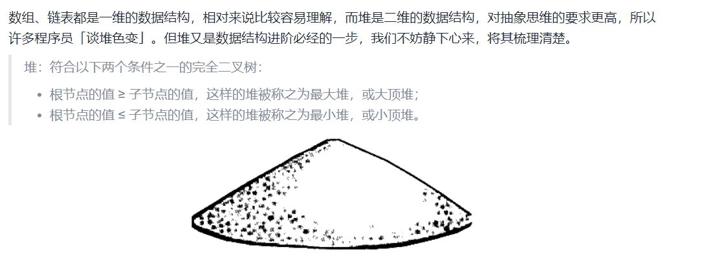
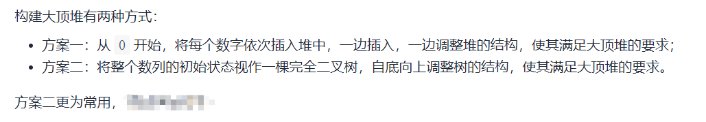
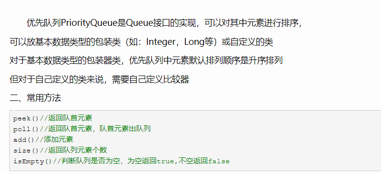

# 堆排序



>交换函数

```java
private static void swap(int[] arr, int i, int j) {
    // 相同的数异或为0, 会出错, 且数组长度至少为两个
    if (arr.length <= 2 || arr[i] == arr[j])
        return;
    arr[i] = arr[i] ^ arr[j]; // nums[i]: 先得到异或运算两数的 不同的位
    arr[j] = arr[i] ^ arr[j]; // 分别与原来的数进行异或得到对方的值
    arr[i] = arr[i] ^ arr[j];
}
```

> 大顶堆
>
> 

```java
public static void heapSort(int[] arr) {
    // 构建初始大顶堆
    buildMaxHeap(arr);
    for (int i = arr.length - 1; i > 0; i--) {
        // 将最大值交换到数组最后
        swap(arr, 0, i);
        // 调整剩余数组，使其满足大顶堆
        maxHeapify(arr, 0, i);
    }
}
```

**构建大顶堆**

```java
// 构建初始大顶堆
private static void buildMaxHeap(int[] arr) {
    // 从最后一个非叶子结点开始调整大顶堆，最后一个非叶子结点的下标就是 arr.length / 2 - 1`
    for (int i = arr.length / 2 - 1; i >= 0; i--) {
        maxHeapify(arr, i, arr.length);
    }
}

 // 调整大顶堆，第三个参数表示剩余未排序的数字的数量，也就是剩余堆的大小
private static void maxHeapify(int[] arr, int i, int heapSize) {
    // 左子结点下标
    int l = 2 * i + 1;
    // 右子结点下标
    int r = l + 1;
    // 记录根结点、左子树结点、右子树结点三者中的最大值下标
    int largest = i;
    // 与左子树结点比较
    if (l < heapSize && arr[l] > arr[largest]) {
        largest = l;
    }
    // 与右子树结点比较
    if (r < heapSize && arr[r] > arr[largest]) {
        largest = r;
    }
    if (largest != i) {
        // 将最大值与根结点交换
        swap(arr, i, largest);
        // 再次调整交换数字后的大顶堆: 此时largest指向根结点,它不一定是当前树中最大的
        maxHeapify(arr, largest, heapSize);
    }
}
```

> 同理可得小顶堆

```java
public static void heapSort(int[] arr) {
    // 构建初始小顶堆 : 逆序
    buildMinHeap(arr);
    for (int i = arr.length-1; i > 0; i--) {
        swap(arr, 0, i);
        minHeapify(arr, 0, i);
    }
}
```

**构建小顶堆**

```java
// 构建初始小顶堆
private static void buildMinHeap(int[] arr) {
    // 最后一个非叶结点的计算公式: i = arr.length/2-1 (索引, 从0开始编号)
    for (int i = arr.length/2-1; i >= 0; i--) {
        minHeapify(arr, i, arr.length);
    }
}
// 调整小顶堆
private static void minHeapify(int[] arr, int i, int heapSize) {
    int l = 2*i + 1;
    int r = l + 1;
    int minimum = i;
    if (l < heapSize && arr[l] < arr[minimum]) minimum = l;
    if (r < heapSize && arr[r] < arr[minimum]) minimum = r;
    if (minimum != i) {
        swap(arr, i, minimum);
        minHeapify(arr, minimum, heapSize);
    }
}
```

> 测试方法:

```java
public static void main(String[] args) {
    // 输入: [5,2,3,1]
    Scanner reader = new Scanner(System.in);
    int[] nums = Arrays.stream(reader.nextLine()
            .replace('[', ' ')
            .replace(']', ' ')
            .trim().split(",")).mapToInt((s)->{return Integer.valueOf(s);}).toArray();
    heapSort(nums);
    // 输出: [1,2,3,5]
    Arrays.stream(nums).forEach(System.out::print);
}
```


# `PriorityQueue`

## 优先队列的说明:



## 优先队列的例题:

>放暑假了，小明想出去好好旅游一趟。
>
>他制定了一个旅游路线，他一共想去n个地方旅游，并且 格按照制定的顺序依次旅游。
>
>- 每到一个地方小明可以购买当地的特色物品，小明的开心值会因为购物提升ai，
>- 但是也会因为发现购买的物品其实没那么好而降低ai的开心值。
>
>- 如果某个时刻小明的开 心值低于0，他会很愤怒并且终止旅行。
>- 你可以帮助小明合理购物，从而在旅行结束时购买最多数 量的物品么。
>- 开心值起始值为0。 
>- 输入描述 
>  - 第一行一个整数n，1<=n<=200000
>  - 第二行n个整数，从左到右依次表示小明旅游路线上每个地方特色物品可以提供的开心值。
>  -  任意数字大小范围是[-1000000000,1000000000]。负数表示会降低开心值。
>  - 负数表示会降低开心值。
>- 输出描述
>  -  一个整数，表示小明最多可以购买多少物品。

```java
package com.OJ.ShunFengKeJi;

import java.util.PriorityQueue;
import java.util.Scanner;

public class Main2 {
    public static void main(String[] args) {
        /*
        * 输入:
            6
            4 -3 -1 -2 1 -5
        * 输出: 4
        * 解释: 取 4 -1 -2 1
        * */
        Scanner reader = new Scanner(System.in);
        // 一共 n 个地方
        int n = reader.nextInt();
        Long[] arr = new Long[n];
        for (int i = 0; i < n; i++) {
            //  第二行n个整数，从左到右依次表示小明旅游路线上每个地方特色物品可以提供的开心值
            arr[i] = reader.nextLong();
        }
        // 开始
        Long cnt = 0L, sum = 0L;
        // 优先队列-默认小顶堆: 每次取出最小的负数, 即绝对值最大的, 让 sum 保持最大.
        PriorityQueue<Long> queue = new PriorityQueue<>(); //默认小顶堆
//        PriorityQueue<Long> queue = new PriorityQueue<>(n, (a, b)->{return (int) (a - b);}); // 小顶堆
//        PriorityQueue<Long> queue = new PriorityQueue<>(n, (a, b)->{return (int) (b - a);}); // 大顶堆
        for (int i = 0; i < n; i++) {
            if (sum + arr[i] >= 0) {
                ++cnt;
                sum += arr[i];
                if (arr[i] < 0) {
                    queue.offer(arr[i]);
//                    System.out.println("加入: " + arr[i]);
//                    System.out.println(Arrays.toString(queue.toArray()));
                }
            }  else {
                // 如果当前元素的 大于 堆顶元素 才可以加进去, 即 绝对值比小顶堆对顶小
                if (!queue.isEmpty() && queue.peek() < arr[i]) {
                    sum = sum - queue.peek() + arr[i];
                    queue.poll();
                }
            }
        }
        System.out.println(cnt);
    }
}
```

