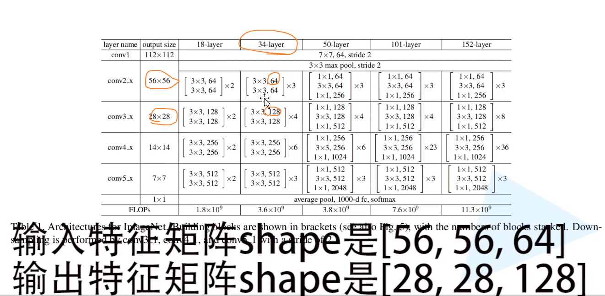

# Resnet

## [理论详解](https://www.bilibili.com/video/av91981420)

> `Resnet-34`


- 梯度消失或梯度爆炸：BN解决 
- 退化问题 ：残差结构解决


> 残差结构

同时输入 256-d(d代表维度) 数据，需要的参数  `右边的残差结构` 远远小于 `左边的残差结构`。


​									`卷积核可以降维和升纬`

> 看 `34-layer`  !


> 网络结构中的虚线：


- 虚线的含义：调整参数结构，只有在层与层交界的地方才有。
  - 以 2层 到 3层 为例：
    - 通过卷积核 `1*1, 128` 和 `stride=2` 
    - 使得2层的输出结构与3层的结构保持一致：`28*28, 128`




- 更深的层：


- [参考博客: `Resnet`模型](https://blog.csdn.net/qq_37541097/article/details/104710784?spm=1001.2014.3001.5501)

> 第一层

- 18-layer 和 34-layer 第一层没有虚线


- 50-layer、101-layer、152-layer 需要虚线调整特征矩阵的深度，高宽不变


> [Batch Normalization](https://blog.csdn.net/qq_37541097/article/details/104434557?spm=1001.2014.3001.5501)


d 即 channels


> 迁移学习


## 使用pytorch搭建ResNet并基于迁移学习训练

### 18-layer 和 34-layer的残差结构

```python
# 主分支卷积核个数是否发生变化
expansion = 1

在50-layer 、101-layer 、152-layer 中则 expansion = 4
```


```
self.conv1 = nn.Conv2d(in_channels=in_channel, out_channels=out_channel,
                       kernel_size=3, stride=stride, padding=1, bias=False)
self.bn1 = nn.BatchNorm2d(out_channel)
self.relu = nn.ReLU()
self.conv2 = nn.Conv2d(in_channels=out_channel, out_channels=out_channel,
                       kernel_size=3, stride=1, padding=1, bias=False)
self.bn2 = nn.BatchNorm2d(out_channel)
```

> `bias`=False 表示不使用偏置（使用`batch normalization`时，不使用偏置）
>
> `downsample`=None 表示主分支-实线 不使用下采样，若不为None，则捷径-虚线 使用下采样。

- 输出特征矩阵的	`w-高`	和	`h-宽` : 

  - stride=1时：w,h 不变

    

  - stride=2时：w,h 变为一半

    


> `identity`: 通过下采样`downsample`得到`捷径分支`的输出


```python
# 18-layer 和 34-layer的残差结构
class BasicBlock(nn.Module):
    # 卷积核个数变化的倍数
    expansion = 1

    ''' 初始化
        in_channel      输入特征矩阵的深度   
        out_channel     输出特征矩阵的深度   
        stride=1        步距为1对应实线   
        downsample=None 下采样-对应虚线的残差结构
    '''
    def __init__(self, in_channel, out_channel, stride=1, downsample=None, **kwargs):
        super(BasicBlock, self).__init__()
        self.conv1 = nn.Conv2d(in_channels=in_channel, out_channels=out_channel,
                               kernel_size=3, stride=stride, padding=1, bias=False)
        self.bn1 = nn.BatchNorm2d(out_channel)
        self.relu = nn.ReLU()
        self.conv2 = nn.Conv2d(in_channels=out_channel, out_channels=out_channel,
                               kernel_size=3, stride=1, padding=1, bias=False)
        self.bn2 = nn.BatchNorm2d(out_channel)
        self.downsample = downsample

    def forward(self, x):
        # 捷径分支的输出
        identity = x
        if self.downsample is not None:
            identity = self.downsample(x)

        out = self.conv1(x)
        out = self.bn1(out)
        out = self.relu(out)

        out = self.conv2(out)
        out = self.bn2(out)

        out += identity
        out = self.relu(out)

        return out
```


### 50-layer、101-layer、152-layer的残差结构

```
# 卷积核个数变化的倍数
expansion = 4

self.conv1 = nn.Conv2d(in_channels=in_channel, out_channels=width,
                               kernel_size=1, stride=1, bias=False)  # squeeze channels
self.bn1 = nn.BatchNorm2d(width)
# -----------------------------------------
self.conv2 = nn.Conv2d(in_channels=width, out_channels=width, groups=groups,
                       kernel_size=3, stride=stride, bias=False, padding=1)
self.bn2 = nn.BatchNorm2d(width)
# -----------------------------------------
self.conv3 = nn.Conv2d(in_channels=width, out_channels=out_channel*self.expansion,
                       kernel_size=1, stride=1, bias=False)  # unsqueeze channels
self.bn3 = nn.BatchNorm2d(out_channel*self.expansion)
```


> `identity`: 通过下采样`downsample`得到`捷径分支`的输出


```python
# 50-layer、101-layer、152-layer的残差结构
class Bottleneck(nn.Module):
    """
    注意：原论文中，在虚线残差结构的主分支上，第一个1x1卷积层的步距是2，第二个3x3卷积层步距是1。
    但在pytorch官方实现过程中是第一个1x1卷积层的步距是1，第二个3x3卷积层步距是2，
    这么做的好处是能够在top1上提升大概0.5%的准确率。
    可参考Resnet v1.5 https://ngc.nvidia.com/catalog/model-scripts/nvidia:resnet_50_v1_5_for_pytorch
    """
    # 卷积核个数变化的倍数
    expansion = 4

    ''' 初始化
            in_channel      输入特征矩阵的深度   
            out_channel     输出特征矩阵的深度   
            stride=1        步距为1对应实线   
            downsample=None 下采样-对应虚线的残差结构
    '''
    def __init__(self, in_channel, out_channel, stride=1, downsample=None,
                 groups=1, width_per_group=64):
        super(Bottleneck, self).__init__()

        width = int(out_channel * (width_per_group / 64.)) * groups

        self.conv1 = nn.Conv2d(in_channels=in_channel, out_channels=width,
                               kernel_size=1, stride=1, bias=False)  # squeeze channels
        self.bn1 = nn.BatchNorm2d(width)
        # -----------------------------------------
        self.conv2 = nn.Conv2d(in_channels=width, out_channels=width, groups=groups,
                               kernel_size=3, stride=stride, bias=False, padding=1)
        self.bn2 = nn.BatchNorm2d(width)
        # -----------------------------------------
        self.conv3 = nn.Conv2d(in_channels=width, out_channels=out_channel*self.expansion,
                               kernel_size=1, stride=1, bias=False)  # unsqueeze channels
        self.bn3 = nn.BatchNorm2d(out_channel*self.expansion)
        self.relu = nn.ReLU(inplace=True)
        self.downsample = downsample

    def forward(self, x):
        # 捷径分支的输出
        identity = x
        if self.downsample is not None:
            identity = self.downsample(x)

        out = self.conv1(x)
        out = self.bn1(out)
        out = self.relu(out)

        out = self.conv2(out)
        out = self.bn2(out)
        out = self.relu(out)

        out = self.conv3(out)
        out = self.bn3(out)

        out += identity
        out = self.relu(out)

        return out
```


### ResNet框架结构

> Model.py

```python
import torch.nn as nn
import torch


# 18-layer 和 34-layer的残差结构
class BasicBlock(nn.Module):
    # 卷积核个数变化的倍数
    expansion = 1

    ''' 初始化
        in_channel      输入特征矩阵的深度   
        out_channel     输出特征矩阵的深度   
        stride=1        步距为1对应实线   
        downsample=None 下采样-对应虚线的残差结构
    '''
    def __init__(self, in_channel, out_channel, stride=1, downsample=None, **kwargs):
        super(BasicBlock, self).__init__()
        self.conv1 = nn.Conv2d(in_channels=in_channel, out_channels=out_channel,
                               kernel_size=3, stride=stride, padding=1, bias=False)
        self.bn1 = nn.BatchNorm2d(out_channel)
        self.relu = nn.ReLU()
        self.conv2 = nn.Conv2d(in_channels=out_channel, out_channels=out_channel,
                               kernel_size=3, stride=1, padding=1, bias=False)
        self.bn2 = nn.BatchNorm2d(out_channel)
        self.downsample = downsample

    def forward(self, x):
        # 捷径分支的输出
        identity = x
        if self.downsample is not None:
            identity = self.downsample(x)

        out = self.conv1(x)
        out = self.bn1(out)
        out = self.relu(out)

        out = self.conv2(out)
        out = self.bn2(out)

        out += identity
        out = self.relu(out)

        return out


# 50-layer、101-layer、152-layer的残差结构
class Bottleneck(nn.Module):
    """
    注意：原论文中，在虚线残差结构的主分支上，第一个1x1卷积层的步距是2，第二个3x3卷积层步距是1。
    但在pytorch官方实现过程中是第一个1x1卷积层的步距是1，第二个3x3卷积层步距是2，
    这么做的好处是能够在top1上提升大概0.5%的准确率。
    可参考Resnet v1.5 https://ngc.nvidia.com/catalog/model-scripts/nvidia:resnet_50_v1_5_for_pytorch
    """
    # 卷积核个数变化的倍数
    expansion = 4

    ''' 初始化
            in_channel      输入特征矩阵的深度   
            out_channel     输出特征矩阵的深度   
            stride=1        步距为1对应实线   
            downsample=None 下采样-对应虚线的残差结构
    '''
    def __init__(self, in_channel, out_channel, stride=1, downsample=None,
                 groups=1, width_per_group=64):
        super(Bottleneck, self).__init__()

        width = int(out_channel * (width_per_group / 64.)) * groups

        self.conv1 = nn.Conv2d(in_channels=in_channel, out_channels=width,
                               kernel_size=1, stride=1, bias=False)  # squeeze channels
        self.bn1 = nn.BatchNorm2d(width)
        # -----------------------------------------
        self.conv2 = nn.Conv2d(in_channels=width, out_channels=width, groups=groups,
                               kernel_size=3, stride=stride, bias=False, padding=1)
        self.bn2 = nn.BatchNorm2d(width)
        # -----------------------------------------
        self.conv3 = nn.Conv2d(in_channels=width, out_channels=out_channel*self.expansion,
                               kernel_size=1, stride=1, bias=False)  # unsqueeze channels
        self.bn3 = nn.BatchNorm2d(out_channel*self.expansion)
        self.relu = nn.ReLU(inplace=True)
        self.downsample = downsample

    def forward(self, x):
        # 捷径分支的输出
        identity = x
        if self.downsample is not None:
            identity = self.downsample(x)

        out = self.conv1(x)
        out = self.bn1(out)
        out = self.relu(out)

        out = self.conv2(out)
        out = self.bn2(out)
        out = self.relu(out)

        out = self.conv3(out)
        out = self.bn3(out)

        out += identity
        out = self.relu(out)

        return out


class ResNet(nn.Module):
    """
        block       对应残差结构
        blocks_num  对应所使用的的残差结构的数目形成的列表
        num_classes 分类数目，需要自己根据实际情况修改
        include_top=True    方便以后在resnet的基础上搭建更复杂的网络
    """
    def __init__(self,
                 block,
                 blocks_num,
                 num_classes=1000,
                 include_top=True,
                 groups=1,
                 width_per_group=64):
        super(ResNet, self).__init__()
        self.include_top = include_top
        self.in_channel = 64

        self.groups = groups
        self.width_per_group = width_per_group

        # 34-layer：7*7， 64， stride=2     w,h变为一半：112*112
        # self.in_channel 使用的卷积核个数
        # 3 代表 RGB 图像的深度
        self.conv1 = nn.Conv2d(3, self.in_channel, kernel_size=7, stride=2,
                               padding=3, bias=False)
        self.bn1 = nn.BatchNorm2d(self.in_channel)  # 输入即特征矩阵的输出深度
        self.relu = nn.ReLU(inplace=True)
        # 最大池化下采样后w,h变为一半：56*56
        self.maxpool = nn.MaxPool2d(kernel_size=3, stride=2, padding=1)

        self.layer1 = self._make_layer(block, 64, blocks_num[0])
        self.layer2 = self._make_layer(block, 128, blocks_num[1], stride=2)
        self.layer3 = self._make_layer(block, 256, blocks_num[2], stride=2)
        self.layer4 = self._make_layer(block, 512, blocks_num[3], stride=2)
        if self.include_top:
            self.avgpool = nn.AdaptiveAvgPool2d((1, 1))  # output size = (1, 1)
            self.fc = nn.Linear(512 * block.expansion, num_classes)

        for m in self.modules():
            if isinstance(m, nn.Conv2d):
                nn.init.kaiming_normal_(m.weight, mode='fan_out', nonlinearity='relu')

    def _make_layer(self, block, channel, block_num, stride=1):
        downsample = None
        if stride != 1 or self.in_channel != channel * block.expansion:
            downsample = nn.Sequential(
                nn.Conv2d(self.in_channel, channel * block.expansion, kernel_size=1, stride=stride, bias=False),
                nn.BatchNorm2d(channel * block.expansion))

        layers = []
        layers.append(block(self.in_channel,
                            channel,
                            downsample=downsample,
                            stride=stride,
                            groups=self.groups,
                            width_per_group=self.width_per_group))
        self.in_channel = channel * block.expansion

        for _ in range(1, block_num):
            layers.append(block(self.in_channel,
                                channel,
                                groups=self.groups,
                                width_per_group=self.width_per_group))

        return nn.Sequential(*layers)

    def forward(self, x):
        x = self.conv1(x)
        x = self.bn1(x)
        x = self.relu(x)
        x = self.maxpool(x)

        x = self.layer1(x)
        x = self.layer2(x)
        x = self.layer3(x)
        x = self.layer4(x)

        if self.include_top:
            x = self.avgpool(x)
            x = torch.flatten(x, 1)
            x = self.fc(x)

        return x


def resnet34(num_classes=1000, include_top=True):
    # https://download.pytorch.org/models/resnet34-333f7ec4.pth
    return ResNet(BasicBlock, [3, 4, 6, 3], num_classes=num_classes, include_top=include_top)


def resnet50(num_classes=1000, include_top=True):
    # https://download.pytorch.org/models/resnet50-19c8e357.pth
    return ResNet(Bottleneck, [3, 4, 6, 3], num_classes=num_classes, include_top=include_top)


def resnet101(num_classes=1000, include_top=True):
    # https://download.pytorch.org/models/resnet101-5d3b4d8f.pth
    return ResNet(Bottleneck, [3, 4, 23, 3], num_classes=num_classes, include_top=include_top)


def resnext50_32x4d(num_classes=1000, include_top=True):
    # https://download.pytorch.org/models/resnext50_32x4d-7cdf4587.pth
    groups = 32
    width_per_group = 4
    return ResNet(Bottleneck, [3, 4, 6, 3],
                  num_classes=num_classes,
                  include_top=include_top,
                  groups=groups,
                  width_per_group=width_per_group)


def resnext101_32x8d(num_classes=1000, include_top=True):
    # https://download.pytorch.org/models/resnext101_32x8d-8ba56ff5.pth
    groups = 32
    width_per_group = 8
    return ResNet(Bottleneck, [3, 4, 23, 3],
                  num_classes=num_classes,
                  include_top=include_top,
                  groups=groups,
                  width_per_group=width_per_group)

```


> train.py
>

```python
import os
import json

import torch
import torch.nn as nn
import torch.optim as optim
from torchvision import transforms, datasets
from tqdm import tqdm

from model import resnet34, resnet50


def main():
    device = torch.device("cuda:0" if torch.cuda.is_available() else "cpu")
    print("using {} device.".format(device))

    data_transform = {
        "train": transforms.Compose([transforms.RandomResizedCrop(224),
                                     transforms.RandomHorizontalFlip(),
                                     transforms.ToTensor(),
                                     transforms.Normalize([0.485, 0.456, 0.406], [0.229, 0.224, 0.225])]),
        "val": transforms.Compose([transforms.Resize(256),
                                   transforms.CenterCrop(224),
                                   transforms.ToTensor(),
                                   transforms.Normalize([0.485, 0.456, 0.406], [0.229, 0.224, 0.225])])}

    data_root = os.path.abspath(os.path.join(os.getcwd(), "../.."))  # get data root path
    image_path = os.path.join(data_root, "data_set", "flower_data")  # flower data set path
    assert os.path.exists(image_path), "{} path does not exist.".format(image_path)
    train_dataset = datasets.ImageFolder(root=os.path.join(image_path, "train"),
                                         transform=data_transform["train"])
    train_num = len(train_dataset)

    # {'daisy':0, 'dandelion':1, 'roses':2, 'sunflower':3, 'tulips':4}
    flower_list = train_dataset.class_to_idx
    cla_dict = dict((val, key) for key, val in flower_list.items())
    # write dict into json file
    json_str = json.dumps(cla_dict, indent=4)
    with open('class_indices.json', 'w') as json_file:
        json_file.write(json_str)

    batch_size = 16
    nw = min([os.cpu_count(), batch_size if batch_size > 1 else 0, 8])  # number of workers
    print('Using {} dataloader workers every process'.format(nw))

    train_loader = torch.utils.data.DataLoader(train_dataset,
                                               batch_size=batch_size, shuffle=True,
                                               num_workers=nw)

    validate_dataset = datasets.ImageFolder(root=os.path.join(image_path, "val"),
                                            transform=data_transform["val"])
    val_num = len(validate_dataset)
    validate_loader = torch.utils.data.DataLoader(validate_dataset,
                                                  batch_size=batch_size, shuffle=False,
                                                  num_workers=nw)

    print("using {} images for training, {} images for validation.".format(train_num,
                                                                           val_num))
    # 实例化resnet34, 默认num_classes=1000， 可以根据自己需要指定分类类别
    num_classes = 6
    net = resnet34(num_classes)
    # net = resnet50(num_classes)
    # load pretrain weights 载入官方的权重预处理
    # download url: https://download.pytorch.org/models/resnet34-333f7ec4.pth
    model_weight_path = "./resnet34-pre.pth"
    # model_weight_path = "./resnet50-pre.pth"
    assert os.path.exists(model_weight_path), "file {} does not exist.".format(model_weight_path)
    net.load_state_dict(torch.load(model_weight_path, map_location=device))     # 载入模型权重
    # for param in net.parameters():
    #     param.requires_grad = False
    # change fc layer structure
    in_channel = net.fc.in_features
    # net.fc = nn.Linear(in_channel, 5)   # 5 表示分类类别个数 需要修改
    net.fc = nn.Linear(in_channel, num_classes)
    net.to(device)

    # define loss function
    loss_function = nn.CrossEntropyLoss()

    # construct an optimizer
    params = [p for p in net.parameters() if p.requires_grad]
    optimizer = optim.Adam(params, lr=0.0001)

    epochs = 3
    best_acc = 0.0
    save_path = './resNet34.pth'
    train_steps = len(train_loader)
    for epoch in range(epochs):
        # train
        net.train()
        running_loss = 0.0
        train_bar = tqdm(train_loader)
        for step, data in enumerate(train_bar):
            images, labels = data
            optimizer.zero_grad()
            logits = net(images.to(device))
            loss = loss_function(logits, labels.to(device))
            loss.backward()
            optimizer.step()

            # print statistics
            running_loss += loss.item()

            train_bar.desc = "train epoch[{}/{}] loss:{:.3f}".format(epoch + 1,
                                                                     epochs,
                                                                     loss)

        # validate
        net.eval()
        acc = 0.0  # accumulate accurate number / epoch
        with torch.no_grad():
            val_bar = tqdm(validate_loader)
            for val_data in val_bar:
                val_images, val_labels = val_data
                outputs = net(val_images.to(device))
                # loss = loss_function(outputs, test_labels)
                predict_y = torch.max(outputs, dim=1)[1]
                acc += torch.eq(predict_y, val_labels.to(device)).sum().item()

                val_bar.desc = "valid epoch[{}/{}]".format(epoch + 1,
                                                           epochs)

        val_accurate = acc / val_num
        print('[epoch %d] train_loss: %.3f  val_accuracy: %.3f' %
              (epoch + 1, running_loss / train_steps, val_accurate))

        if val_accurate > best_acc:
            best_acc = val_accurate
            torch.save(net.state_dict(), save_path)

    print('Finished Training')


if __name__ == '__main__':
    main()
```


> predict.py

```python
import os
import json

import torch
from PIL import Image
from torchvision import transforms
import matplotlib.pyplot as plt

from model import resnet34, resnet50


def main():
    device = torch.device("cuda:0" if torch.cuda.is_available() else "cpu")

    data_transform = transforms.Compose(
        [transforms.Resize(256),
         transforms.CenterCrop(224),
         transforms.ToTensor(),
         transforms.Normalize([0.485, 0.456, 0.406], [0.229, 0.224, 0.225])])

    # load image
    img_path = "../1.jpg"
    assert os.path.exists(img_path), "file: '{}' dose not exist.".format(img_path)
    img = Image.open(img_path)
    plt.imshow(img)
    # [N, C, H, W]
    img = data_transform(img)
    # expand batch dimension
    img = torch.unsqueeze(img, dim=0)

    # read class_indict
    json_path = './class_indices.json'
    assert os.path.exists(json_path), "file: '{}' dose not exist.".format(json_path)

    json_file = open(json_path, "r")
    class_indict = json.load(json_file)

    # create model  需要修改 num_classes=5
    num_classes = 6
    model = resnet34(num_classes).to(device)
    # model = resnet50(num_classes).to(device)

    # load model weights
    weights_path = "./resNet34.pth"
    # weights_path = "./resNet50.pth"
    assert os.path.exists(weights_path), "file: '{}' dose not exist.".format(weights_path)
    model.load_state_dict(torch.load(weights_path, map_location=device))

    # prediction
    model.eval()
    with torch.no_grad():
        # predict class
        output = torch.squeeze(model(img.to(device))).cpu()
        predict = torch.softmax(output, dim=0)
        predict_cla = torch.argmax(predict).numpy()     # argmax最大值对应的索引，numpy再转为ndarray变量

    print_res = "class: {}   prob: {:.3}".format(class_indict[str(predict_cla)],
                                                 predict[predict_cla].numpy())
    plt.title(print_res)
    print(print_res)
    plt.show()


if __name__ == '__main__':
    main()
```


