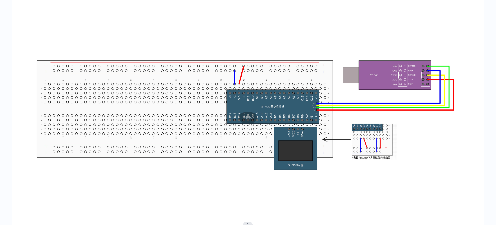
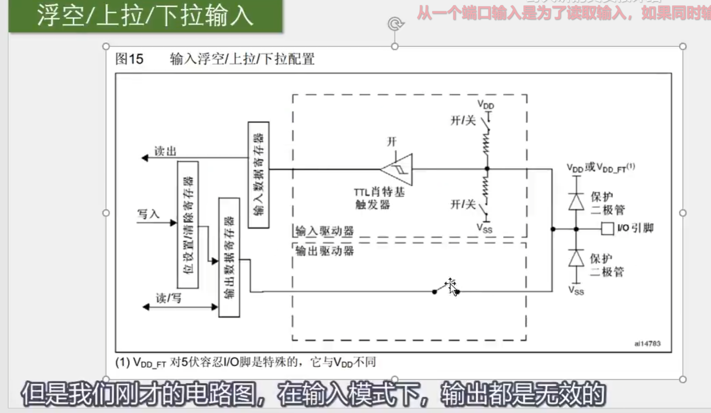
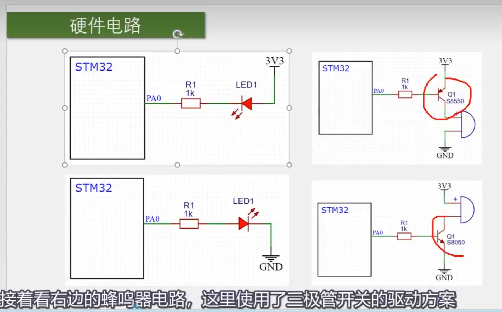

# STM32

## 简介

> STM32是ST公司基于ARM Cortex-M内核开发的32位微控制器
>
> STM32常应用在嵌入式领域，如智能车、无人机、机器人、无线通信、物联网、工业控制、娱乐电子产品等
>
> STM32功能强大、性能优异、片上资源丰富、功耗低，是一款经典的嵌入式微控制器


---

## 点灯

> 采用PA0端口


```C
#include "stm32f10x.h"                  // Device header
#include "Delay.h"

int main(void)
{
	RCC_APB2PeriphClockCmd(RCC_APB2Periph_GPIOA, ENABLE);
	
	GPIO_InitTypeDef GPIO_InitStructure;
	GPIO_InitStructure.GPIO_Mode = GPIO_Mode_Out_PP;
	GPIO_InitStructure.GPIO_Pin = GPIO_Pin_0;
	GPIO_InitStructure.GPIO_Speed = GPIO_Speed_50MHz;
	GPIO_Init(GPIOA, &GPIO_InitStructure);
	
	while (1)
	{
		GPIO_ResetBits(GPIOA, GPIO_Pin_0);
		Delay_ms(500);
		GPIO_SetBits(GPIOA, GPIO_Pin_0);
		Delay_ms(500);
		
		GPIO_WriteBit(GPIOA, GPIO_Pin_0, Bit_RESET);
		Delay_ms(500);
		GPIO_WriteBit(GPIOA, GPIO_Pin_0, Bit_SET);
		Delay_ms(500);
		
		GPIO_WriteBit(GPIOA, GPIO_Pin_0, (BitAction)0);
		Delay_ms(500);
		GPIO_WriteBit(GPIOA, GPIO_Pin_0, (BitAction)1);
		Delay_ms(500);
	}
}
```

## 流水灯

> PA端口 0-7


```C
#include "stm32f10x.h"                  // Device header
#include "Delay.h"

int main(void)
{
	RCC_APB2PeriphClockCmd(RCC_APB2Periph_GPIOA, ENABLE);
	
	GPIO_InitTypeDef GPIO_InitStructure;
	GPIO_InitStructure.GPIO_Mode = GPIO_Mode_Out_PP;
	GPIO_InitStructure.GPIO_Pin = GPIO_Pin_All;
	GPIO_InitStructure.GPIO_Speed = GPIO_Speed_50MHz;
	GPIO_Init(GPIOA, &GPIO_InitStructure);
	
	while (1)
	{
		GPIO_Write(GPIOA, ~0x0001);	//0000 0000 0000 0001
		Delay_ms(100);
		GPIO_Write(GPIOA, ~0x0002);	//0000 0000 0000 0010
		Delay_ms(100);
		GPIO_Write(GPIOA, ~0x0004);	//0000 0000 0000 0100
		Delay_ms(100);
		GPIO_Write(GPIOA, ~0x0008);	//0000 0000 0000 1000
		Delay_ms(100);
		GPIO_Write(GPIOA, ~0x0010);	//0000 0000 0001 0000
		Delay_ms(100);
		GPIO_Write(GPIOA, ~0x0020);	//0000 0000 0010 0000
		Delay_ms(100);
		GPIO_Write(GPIOA, ~0x0040);	//0000 0000 0100 0000
		Delay_ms(100);
		GPIO_Write(GPIOA, ~0x0080);	//0000 0000 1000 0000
		Delay_ms(100);
	}
}
```

## 蜂鸣器

> GPIO-B-12端口	低电平有效


```C
#include "stm32f10x.h"                  // Device header
#include "Delay.h"

int main(void)
{
	RCC_APB2PeriphClockCmd(RCC_APB2Periph_GPIOB, ENABLE);
	
	GPIO_InitTypeDef GPIO_InitStructure;
	GPIO_InitStructure.GPIO_Mode = GPIO_Mode_Out_PP;
	GPIO_InitStructure.GPIO_Pin = GPIO_Pin_12;
	GPIO_InitStructure.GPIO_Speed = GPIO_Speed_50MHz;
	GPIO_Init(GPIOB, &GPIO_InitStructure);
	
	while (1)
	{
		GPIO_ResetBits(GPIOB, GPIO_Pin_12);
		Delay_ms(100);
		GPIO_SetBits(GPIOB, GPIO_Pin_12);
		Delay_ms(100);
		GPIO_ResetBits(GPIOB, GPIO_Pin_12);
		Delay_ms(100);
		GPIO_SetBits(GPIOB, GPIO_Pin_12);
		Delay_ms(700);
	}
}

```

## 按键控制-LED

> 重要函数：
>
> - uint8_t GPIO_ReadInputDataBit(GPIO_TypeDef* GPIOx, uint16_t GPIO_Pin); 【读取输入寄存器某一位】
> - uint16_t GPIO_ReadInputData(GPIO_TypeDef* GPIOx);【读取输入寄存器】
> - uint8_t GPIO_ReadOutputDataBit(GPIO_TypeDef* GPIOx, uint16_t GPIO_Pin); 【读取输出寄存器某一位】
> - uint16_t GPIO_ReadOutputData(GPIO_TypeDef* GPIOx);【读取输出寄存器】


```C
#include "stm32f10x.h"                  // Device header
#include "Delay.h"
#include "LED.h"
#include "Key.h"

uint8_t KeyNum;

int main(void)
{
	LED_Init();
	Key_Init();
	
	while (1)
	{
		KeyNum = Key_GetNum();
		if (KeyNum == 1)
		{
			LED1_Turn();
		}
		if (KeyNum == 2)
		{
			LED2_Turn();
		}
	}
}
```

LED.c

```C
#include "stm32f10x.h"                  // Device header

void LED_Init(void)
{
	RCC_APB2PeriphClockCmd(RCC_APB2Periph_GPIOA, ENABLE);
	
	GPIO_InitTypeDef GPIO_InitStructure;
	GPIO_InitStructure.GPIO_Mode = GPIO_Mode_Out_PP;
	GPIO_InitStructure.GPIO_Pin = GPIO_Pin_1 | GPIO_Pin_2;
	GPIO_InitStructure.GPIO_Speed = GPIO_Speed_50MHz;
	GPIO_Init(GPIOA, &GPIO_InitStructure);
	
	GPIO_SetBits(GPIOA, GPIO_Pin_1 | GPIO_Pin_2);
}

void LED1_ON(void)
{
	GPIO_ResetBits(GPIOA, GPIO_Pin_1); // 低电平点亮
}

void LED1_OFF(void)
{
	GPIO_SetBits(GPIOA, GPIO_Pin_1);
}

void LED1_Turn(void)
{
	if (GPIO_ReadOutputDataBit(GPIOA, GPIO_Pin_1) == 0) //如果是亮的，就熄灭
	{
		GPIO_SetBits(GPIOA, GPIO_Pin_1);
	}
	else // 如果是熄灭的，就点亮
	{
		GPIO_ResetBits(GPIOA, GPIO_Pin_1); 
	}
}

void LED2_ON(void)
{
	GPIO_ResetBits(GPIOA, GPIO_Pin_2);
}

void LED2_OFF(void)
{
	GPIO_SetBits(GPIOA, GPIO_Pin_2);
}

void LED2_Turn(void)
{
	if (GPIO_ReadOutputDataBit(GPIOA, GPIO_Pin_2) == 0) //如果是亮的，就熄灭
	{
		GPIO_SetBits(GPIOA, GPIO_Pin_2);
	}
	else // 如果是熄灭的，就点亮
	{
		GPIO_ResetBits(GPIOA, GPIO_Pin_2);
	}
}

```

LED.h

```C
#ifndef __LED_H
#define __LED_H

void LED_Init(void);
void LED1_ON(void);
void LED1_OFF(void);
void LED1_Turn(void);
void LED2_ON(void);
void LED2_OFF(void);
void LED2_Turn(void);

#endif

```

Key.c

```C
#include "stm32f10x.h"                  // Device header
#include "Delay.h"

void Key_Init(void)
{
	RCC_APB2PeriphClockCmd(RCC_APB2Periph_GPIOB, ENABLE);
	
	GPIO_InitTypeDef GPIO_InitStructure;
	GPIO_InitStructure.GPIO_Mode = GPIO_Mode_IPU; //默认高电平，有输入是0，无输入则是默认1
	GPIO_InitStructure.GPIO_Pin = GPIO_Pin_1 | GPIO_Pin_11;
	GPIO_InitStructure.GPIO_Speed = GPIO_Speed_50MHz;
	GPIO_Init(GPIOB, &GPIO_InitStructure);
}

uint8_t Key_GetNum(void)
{
	uint8_t KeyNum = 0;
    // 按键检测
	if (GPIO_ReadInputDataBit(GPIOB, GPIO_Pin_1) == 0) //按键按下
	{
		Delay_ms(20); //消抖-按下
		while (GPIO_ReadInputDataBit(GPIOB, GPIO_Pin_1) == 0); //检测松手
		Delay_ms(20); //消抖-松手
		KeyNum = 1;
	}
	if (GPIO_ReadInputDataBit(GPIOB, GPIO_Pin_11) == 0)
	{
		Delay_ms(20);
		while (GPIO_ReadInputDataBit(GPIOB, GPIO_Pin_11) == 0);
		Delay_ms(20);
		KeyNum = 2;
	}
	
	return KeyNum;
}
```

Key.h

```C
#ifndef __KEY_H
#define __KEY_H

void Key_Init(void);
uint8_t Key_GetNum(void);

#endif
```


## 光敏传感器控制蜂鸣器


```C
#include "stm32f10x.h"                  // Device header
#include "Delay.h"
#include "Buzzer.h"
#include "LightSensor.h"

int main(void)
{
	Buzzer_Init();
	LightSensor_Init();
	
	while (1)
	{
		if (LightSensor_Get() == 1) // 光线比较暗--遮住光敏传感器
		{
			Buzzer_ON(); //响
		}
		else // 光线比较亮--用手电筒照光明传感器
		{
			Buzzer_OFF();
		}
	}
}

```

Buzzer.c

```C
#include "stm32f10x.h"                  // Device header

void Buzzer_Init(void)
{
	RCC_APB2PeriphClockCmd(RCC_APB2Periph_GPIOB, ENABLE);
	// B-12
	GPIO_InitTypeDef GPIO_InitStructure;
	GPIO_InitStructure.GPIO_Mode = GPIO_Mode_Out_PP;
	GPIO_InitStructure.GPIO_Pin = GPIO_Pin_12; 
	GPIO_InitStructure.GPIO_Speed = GPIO_Speed_50MHz;
	GPIO_Init(GPIOB, &GPIO_InitStructure);
	
	GPIO_SetBits(GPIOB, GPIO_Pin_12);
}

void Buzzer_ON(void)
{
	GPIO_ResetBits(GPIOB, GPIO_Pin_12); //低电平有效
}

void Buzzer_OFF(void)
{
	GPIO_SetBits(GPIOB, GPIO_Pin_12);
}

void Buzzer_Turn(void)
{
	if (GPIO_ReadOutputDataBit(GPIOB, GPIO_Pin_12) == 0) //如果是打开，就关闭
	{
		GPIO_SetBits(GPIOB, GPIO_Pin_12); //off
	}
	else
	{
		GPIO_ResetBits(GPIOB, GPIO_Pin_12); //on
	}
}
```

Buzzer.h

```C
#ifndef __BUZZER_H
#define __BUZZER_H

void Buzzer_Init(void);
void Buzzer_ON(void);
void Buzzer_OFF(void);
void Buzzer_Turn(void);

#endif
```

LightSensor.c

```C
#include "stm32f10x.h"                  // Device header

void LightSensor_Init(void)
{
	RCC_APB2PeriphClockCmd(RCC_APB2Periph_GPIOB, ENABLE);
	// B-13
	GPIO_InitTypeDef GPIO_InitStructure;
	GPIO_InitStructure.GPIO_Mode = GPIO_Mode_IPU; //默认高电平，有输入是0，无输入则是默认1
	GPIO_InitStructure.GPIO_Pin = GPIO_Pin_13;
	GPIO_InitStructure.GPIO_Speed = GPIO_Speed_50MHz;
	GPIO_Init(GPIOB, &GPIO_InitStructure);
}

uint8_t LightSensor_Get(void)
{
	return GPIO_ReadInputDataBit(GPIOB, GPIO_Pin_13); 
}
```

LightSensor.h

```C
#ifndef __LIGHT_SENSOR_H
#define __LIGHT_SENSOR_H

void LightSensor_Init(void);
uint8_t LightSensor_Get(void);

#endif
```


---

## 中断

> 中断就像“闹钟”，处理完“闹钟”接着“睡觉”。


中断分类：

- EXIT
- TIM
- ADC
- I2C
- SPI
- USART
- CAN

NVIC:嵌套中断向量控制器【统一分配中断优先级和管理中断的】

> 可以理解为医院的叫号系统，根据优先级来。
>
> - 正常排队
> - 紧急病人插队：响应优先级 【插队优先级】
> - 更加紧急的病人插队 ：嵌套中断【抢占优先级】
>
> 即：抢占优先级高的可以中断嵌套，响应优先级高的可以优先排队，抢占优先级和响应优先级均相同的按中断号排队


### EXIT 概念


---

### EXIT 实例

#### 对射式红外传感器计次

OLED调式工具接线图：




中断初始化理解：

```C
//GPIO -> AFIO -> EXIT -> NVIC -> CPU
void CountSensor_Init(void)
{
	// 1 配置时钟 GPIOB AFIO [RCC_APB2...函数 要和RCC_APB2...参数 对应起来]
	RCC_APB2PeriphClockCmd(RCC_APB2Periph_GPIOB, ENABLE);
	RCC_APB2PeriphClockCmd(RCC_APB2Periph_AFIO, ENABLE);
	// NVIC 是内核外设，内核外设不需要开启时钟
	
	// 2 配置GPIO,输入模式
	GPIO_InitTypeDef GPIO_InitStructure;
	GPIO_InitStructure.GPIO_Mode = GPIO_Mode_IPU; //上拉输入,默认为高电平输入
	GPIO_InitStructure.GPIO_Pin = GPIO_Pin_14; // DO 接STM32 PB14
	GPIO_InitStructure.GPIO_Speed = GPIO_Speed_50MHz;
	GPIO_Init(GPIOB, &GPIO_InitStructure);
	
	//3 配置AFIO[中断引脚选择]，选择使用的GPIO: DO 接STM32 PB14 -> EXIT14
	// 调用此函数以配置AFIO的数据选择器，选择自定义的中断引脚
	// 它实际上是AFIO的函数，放置在GPIO里
	GPIO_EXTILineConfig(GPIO_PortSourceGPIOB, GPIO_PinSource14);
	
	//4 配置EXIT,选择边沿触发方式
	EXTI_InitTypeDef EXTI_InitStructure;
	EXTI_InitStructure.EXTI_Line = EXTI_Line14; //PB14的14线路
	EXTI_InitStructure.EXTI_LineCmd = ENABLE;
	EXTI_InitStructure.EXTI_Mode = EXTI_Mode_Interrupt; //中断响应
	EXTI_InitStructure.EXTI_Trigger = EXTI_Trigger_Falling; //下降沿触发
	EXTI_Init(&EXTI_InitStructure);
	
	//5 NVIC 设置优先级
	NVIC_PriorityGroupConfig(NVIC_PriorityGroup_2);
	// 初始化
	NVIC_InitTypeDef NVIC_InitStructure;
	// 中断通断 10-15
	NVIC_InitStructure.NVIC_IRQChannel = EXTI15_10_IRQn;
	NVIC_InitStructure.NVIC_IRQChannelCmd = ENABLE;
	NVIC_InitStructure.NVIC_IRQChannelPreemptionPriority = 1;
	NVIC_InitStructure.NVIC_IRQChannelSubPriority = 1;
	NVIC_Init(&NVIC_InitStructure);
}
```

注意：

- 初始化：

  ```c
  void EXTI_DeInit(void);
  void EXTI_Init(EXTI_InitTypeDef* EXTI_InitStruct);
  void EXTI_StructInit(EXTI_InitTypeDef* EXTI_InitStruct);
  ```

- 软件触发中断函数: void EXTI_GenerateSWInterrupt(uint32_t EXTI_Line);

- 主程序使用：

  ```c
  FlagStatus EXTI_GetFlagStatus(uint32_t EXTI_Line);
  void EXTI_ClearFlag(uint32_t EXTI_Line);
  ```

- 中断程序使用：

  ```c
  ITStatus EXTI_GetITStatus(uint32_t EXTI_Line);
  void EXTI_ClearITPendingBit(uint32_t EXTI_Line);
  ```


```C
#include "stm32f10x.h"                  // Device header
#include "Delay.h"
#include "OLED.h"
#include "CountSensor.h"

int main(void)
{
	OLED_Init();
	CountSensor_Init();
	
	OLED_ShowString(1, 1, "Count:");
	
	while (1)
	{
		OLED_ShowNum(1, 7, CountSensor_Get(), 5);
	}
}
```

CountSensor.h

```C
#ifndef __COUNT_SENSOR_H
#define __COUNT_SENSOR_H

void CountSensor_Init(void);
uint16_t CountSensor_Get(void);

#endif
```

CountSensor.c

```c
#include "stm32f10x.h"                  // Device header

uint16_t CountSensor_Count;

//GPIO -> AFIO -> EXIT -> NVIC -> CPU
void CountSensor_Init(void)
{
	// 1 配置时钟 GPIOB AFIO [RCC_APB2...函数 要和RCC_APB2...参数 对应起来]
	RCC_APB2PeriphClockCmd(RCC_APB2Periph_GPIOB, ENABLE);
	RCC_APB2PeriphClockCmd(RCC_APB2Periph_AFIO, ENABLE);
	// NVIC 是内核外设，内核外设不需要开启时钟
	
	// 2 配置GPIO,输入模式
	GPIO_InitTypeDef GPIO_InitStructure;
	GPIO_InitStructure.GPIO_Mode = GPIO_Mode_IPU; //上拉输入,默认为高电平输入
	GPIO_InitStructure.GPIO_Pin = GPIO_Pin_14; // DO 接STM32 PB14
	GPIO_InitStructure.GPIO_Speed = GPIO_Speed_50MHz;
	GPIO_Init(GPIOB, &GPIO_InitStructure);
	
	//3 配置AFIO[中断引脚选择]，选择使用的GPIO: DO 接STM32 PB14 -> EXIT
	// 调用此函数以配置AFIO的数据选择器，选择自定义的中断引脚
	// 它实际上是AFIO的函数，放置在GPIO里
	GPIO_EXTILineConfig(GPIO_PortSourceGPIOB, GPIO_PinSource14);
	
	//4 配置EXIT,选择边沿触发方式
	EXTI_InitTypeDef EXTI_InitStructure;
	EXTI_InitStructure.EXTI_Line = EXTI_Line14; //PB14的14线路
	EXTI_InitStructure.EXTI_LineCmd = ENABLE;
	EXTI_InitStructure.EXTI_Mode = EXTI_Mode_Interrupt; //中断响应
	EXTI_InitStructure.EXTI_Trigger = EXTI_Trigger_Falling; //下降沿触发
	EXTI_Init(&EXTI_InitStructure);
	
	//5 NVIC 设置优先级 【两位抢占，两位响应】
	NVIC_PriorityGroupConfig(NVIC_PriorityGroup_2);
	// 初始化
	NVIC_InitTypeDef NVIC_InitStructure;
	// 中断通断 10-15
	NVIC_InitStructure.NVIC_IRQChannel = EXTI15_10_IRQn; //指定通断
	NVIC_InitStructure.NVIC_IRQChannelCmd = ENABLE;
    // NVIC_PriorityGroup_2：都是0-3
	NVIC_InitStructure.NVIC_IRQChannelPreemptionPriority = 1; //只有一个就设置成1 【抢占优先级】
	NVIC_InitStructure.NVIC_IRQChannelSubPriority = 1; //只有一个就设置成1 【响应优先级】
	NVIC_Init(&NVIC_InitStructure);
}

uint16_t CountSensor_Get(void)
{
	return CountSensor_Count;
}

// 中断函数，名称固定【中断函数-不需要调用，自动执行】
void EXTI15_10_IRQHandler(void) //EXTI_Line10-15都可以进来
{
	if (EXTI_GetITStatus(EXTI_Line14) == SET) //查看中断标志是否为1
	{
		/*如果出现数据乱跳的现象，可再次判断引脚电平，以避免抖动*/
		if (GPIO_ReadInputDataBit(GPIOB, GPIO_Pin_14) == 0)
		{
			CountSensor_Count ++; //触发一次就++
		}
		EXTI_ClearITPendingBit(EXTI_Line14); //清除中断标志位
	}
}

```

#### 旋转编码器


> 正向【顺时针】旋转，数字增加，反之减少。

```C
#include "stm32f10x.h"                  // Device header
#include "Delay.h"
#include "OLED.h"
#include "Encoder.h"

int16_t Num;

int main(void)
{
	OLED_Init();
	Encoder_Init();
	
	OLED_ShowString(1, 1, "Num:");
	
	while (1)
	{
		Num += Encoder_Get();
		OLED_ShowSignedNum(1, 5, Num, 5);
	}
}
```

如何判断旋转方向：

- 正向：B下降沿时，A低电平 --> 当B是低电平时【刚刚变化】，A已经是低电平了。
- 反转：A下降沿时，B低电平 --> 当A是低电平时【刚刚变化】，B已经是低电平了。


Encoder.h

```C
#ifndef __ENCODER_H
#define __ENCODER_H

void Encoder_Init(void);
int16_t Encoder_Get(void);

#endif
```

Encoder.c

```c
#include "stm32f10x.h"                  // Device header

int16_t Encoder_Count;

void Encoder_Init(void)
{
	RCC_APB2PeriphClockCmd(RCC_APB2Periph_GPIOB, ENABLE);
	RCC_APB2PeriphClockCmd(RCC_APB2Periph_AFIO, ENABLE);
	
	GPIO_InitTypeDef GPIO_InitStructure;
	GPIO_InitStructure.GPIO_Mode = GPIO_Mode_IPU;
	GPIO_InitStructure.GPIO_Pin = GPIO_Pin_0 | GPIO_Pin_1;
	GPIO_InitStructure.GPIO_Speed = GPIO_Speed_50MHz;
	GPIO_Init(GPIOB, &GPIO_InitStructure);
	// PB0 PB1
	GPIO_EXTILineConfig(GPIO_PortSourceGPIOB, GPIO_PinSource0);
	GPIO_EXTILineConfig(GPIO_PortSourceGPIOB, GPIO_PinSource1);
	// 下降沿触发
	EXTI_InitTypeDef EXTI_InitStructure;
	EXTI_InitStructure.EXTI_Line = EXTI_Line0 | EXTI_Line1; // PB0 PB1
	EXTI_InitStructure.EXTI_LineCmd = ENABLE;
	EXTI_InitStructure.EXTI_Mode = EXTI_Mode_Interrupt;
	EXTI_InitStructure.EXTI_Trigger = EXTI_Trigger_Falling;
	EXTI_Init(&EXTI_InitStructure);
	// 中断分组
	NVIC_PriorityGroupConfig(NVIC_PriorityGroup_2);
	//中断0
	NVIC_InitTypeDef NVIC_InitStructure;
	NVIC_InitStructure.NVIC_IRQChannel = EXTI0_IRQn; //中断0
	NVIC_InitStructure.NVIC_IRQChannelCmd = ENABLE;
	NVIC_InitStructure.NVIC_IRQChannelPreemptionPriority = 1; //抢占优先级
	NVIC_InitStructure.NVIC_IRQChannelSubPriority = 1; //响应优先级
	NVIC_Init(&NVIC_InitStructure);
	//中断1
	NVIC_InitStructure.NVIC_IRQChannel = EXTI1_IRQn; //中断1
	NVIC_InitStructure.NVIC_IRQChannelCmd = ENABLE;
	NVIC_InitStructure.NVIC_IRQChannelPreemptionPriority = 1; //抢占优先级
	NVIC_InitStructure.NVIC_IRQChannelSubPriority = 2; //响应优先级
	NVIC_Init(&NVIC_InitStructure);
}

int16_t Encoder_Get(void)
{
	int16_t Temp;
	Temp = Encoder_Count; //返回Count用于外部加减，返回后进行清零
	Encoder_Count = 0;
	return Temp;
}


//中断0 1 分别是两个函数；而9-5只用一个函数
void EXTI0_IRQHandler(void)
{
    // 反向旋转【B0对应A,B1对应B.】
	if (EXTI_GetITStatus(EXTI_Line0) == SET)
	{
		/*如果出现数据乱跳的现象，可再次判断引脚电平，以避免抖动*/
		if (GPIO_ReadInputDataBit(GPIOB, GPIO_Pin_0) == 0) 
		{
            //反转：A下降沿时，B低电平 --> 当A是低电平时【刚刚变化】，B已经是低电平了。
			//向左转，数字减少
			if (GPIO_ReadInputDataBit(GPIOB, GPIO_Pin_1) == 0) 
			{
				Encoder_Count --;
			}
		}
		EXTI_ClearITPendingBit(EXTI_Line0);
	}
}
//中断0 1 分别是两个函数；而9-5只用一个函数
void EXTI1_IRQHandler(void)
{
    // 正向旋转 【B0对应A,B1对应B.】
	if (EXTI_GetITStatus(EXTI_Line1) == SET)
	{
		/*如果出现数据乱跳的现象，可再次判断引脚电平，以避免抖动*/
		if (GPIO_ReadInputDataBit(GPIOB, GPIO_Pin_1) == 0) 
		{
            //正向：B下降沿时，A低电平 --> 当B是低电平时【刚刚变化】，A已经是低电平了。
			//向右转，数字增加
			if (GPIO_ReadInputDataBit(GPIOB, GPIO_Pin_0) == 0)
			{
				Encoder_Count ++;
			}
		}
		EXTI_ClearITPendingBit(EXTI_Line1);
	}
}

```

注意：在中断里操作标志位，中断返回时对这个变量进行显示和操作。这样既能保证中断函数的简短快速，又能保证不产生冲突的硬件操作。

---

## 定时器

定时器：定时触发中断


**主要学习通用定时器：** 【TIM2、TIM3、TIM4、TIM5】


基本定时器：


**通用定时器：**


ARR: 自动重装寄存器 


> 定时器-内部中断实现方式

```C
#include "stm32f10x.h"                  // Device header
#include "Delay.h"
#include "OLED.h"
#include "Timer.h"

uint16_t Num;

int main(void)
{
	OLED_Init();
	Timer_Init();
	
	OLED_ShowString(1, 1, "Num:");
	
	while (1)
	{
		OLED_ShowNum(1, 5, Num, 5);
	}
}

void TIM2_IRQHandler(void)
{
	if (TIM_GetITStatus(TIM2, TIM_IT_Update) == SET)
	{
		Num ++;
		TIM_ClearITPendingBit(TIM2, TIM_IT_Update);
	}
}
```

Timer.c

```C
#include "stm32f10x.h"                  // Device header

void Timer_Init(void)
{
	RCC_APB1PeriphClockCmd(RCC_APB1Periph_TIM2, ENABLE);
	
	TIM_InternalClockConfig(TIM2);
	
	TIM_TimeBaseInitTypeDef TIM_TimeBaseInitStructure;
	TIM_TimeBaseInitStructure.TIM_ClockDivision = TIM_CKD_DIV1;
	TIM_TimeBaseInitStructure.TIM_CounterMode = TIM_CounterMode_Up;
	TIM_TimeBaseInitStructure.TIM_Period = 10000 - 1;
	TIM_TimeBaseInitStructure.TIM_Prescaler = 7200 - 1;
	TIM_TimeBaseInitStructure.TIM_RepetitionCounter = 0;
	TIM_TimeBaseInit(TIM2, &TIM_TimeBaseInitStructure);
	// 手动清除更新中断标志位
	TIM_ClearFlag(TIM2, TIM_FLAG_Update);//避免刚开始完就进中断
	TIM_ITConfig(TIM2, TIM_IT_Update, ENABLE);
	
	NVIC_PriorityGroupConfig(NVIC_PriorityGroup_2);
	
	NVIC_InitTypeDef NVIC_InitStructure;
	NVIC_InitStructure.NVIC_IRQChannel = TIM2_IRQn;
	NVIC_InitStructure.NVIC_IRQChannelCmd = ENABLE;
	NVIC_InitStructure.NVIC_IRQChannelPreemptionPriority = 2;
	NVIC_InitStructure.NVIC_IRQChannelSubPriority = 1;
	NVIC_Init(&NVIC_InitStructure);
	
	TIM_Cmd(TIM2, ENABLE);
}

/*
void TIM2_IRQHandler(void)
{
	if (TIM_GetITStatus(TIM2, TIM_IT_Update) == SET)
	{
		
		TIM_ClearITPendingBit(TIM2, TIM_IT_Update);
	}
}
*/
```

Timer.h

```C
#ifndef __TIMER_H
#define __TIMER_H

void Timer_Init(void);

#endif
```


---

## GPIO

### 简介

GPIO: General Purpose Input outPut 即通用输入输出口

- 可配置为8种输入输出模式
- 引脚电平：3.3V
- 输出模式下可控制端口输出高低电平，用以驱动LED、控制蜂鸣器、模拟通信协议输出时序等
- 输入模式下可读取端口的高低电平或电压，用于读取按键输入、外界模块电平信号输入、ADC电压采集、模拟通信协议接收数据等

基本结构：GPIOA、GPIOB、GPIOC ...

每个GPIO外设分为 [0-15] 16 个引脚


### **位结构**


### 保护二极管：

- 大于3.3V不会进入内部电路，电流会流向【上方的保护二极管】，避免过高电压对内部产生伤害。
- 相对于【下方的保护二极管】比0V还要低的电压，电流会直接从【下方的保护二极管】回到【I/O引脚】。

【文中翻译错误】施密特触发器【电压整形】：当输入电压大于某一阈值时，输出就会瞬间升为高电平；当输入电压小于某一阈值时，输出就会瞬间降为低电平。


### **GPIO模式**


### 浮空/上拉/下拉

**IN_FLOATING**-浮空输入：【两个开关都断开】

**IPU**-上拉输入：【上拉开关导通，下拉断开】

**IPD**-下拉输入：【上拉断开，下拉开关导通】

**PS:** 

- 上拉和下拉输入的作用在于提供一个默认的电平；【上拉输入默认高电平输入模式，下拉输入默认低电平输入模式】
- 上拉和下拉的电阻较大，是一种弱上拉和弱下拉，目的是尽量不影响正常的输入操作。
- 而啥都不接，则处于一个浮空的状态，引脚的电平极易受到外界干扰而改变。


### 模拟输入

**AIN**-模拟输入：连接到ADC，因为ADC需要输入模拟量【模拟量就是连续的，不需要整形】，所以它的线是接到施密特触发器前面的。


### 寄存器

【复用功能输入】：连接到其他需要读取端口的外设上的，比如串口的输入引脚等，这根线接收的是数字量，所以接在施密特触发器后面。

【输出数据寄存器】：普通IO输出

【位设置/清除寄存器】：单独操作输出数据寄存器的某一位，而不影响其他位。因为这个【输出数据寄存器】同时控制16个端口，并且只能同时整体读写，所以如果想单独控制其中某一端口而不影响其他端口的话，需要一些特殊的方式。

- 第一种：先读这个寄存器，然后用【按位与 `&=`】和【按位或 `|=`】的方式更改某一位。
- 第二种：通过设置这个【位设置/清除寄存器】，操作见下图：

【位设置操作】：


【位清除操作】：


### 推挽/开漏/关闭

**Out_PP**-推挽输出：


> 在**Out_PP**-**推挽输出模式**下，【MOS前虽然有取反标志，但是可能还有取反器，所以负负得正？待求证】
>
> - **数据寄存器为1时**，上管导通，下管断开，输出直接接到VDD，就是**输出高电平**；
>
> - **数据寄存器为0时**，下管导通，上管断开，输出直接接到VSS，就是**输出低电平**。
>
> 这种模式下，高低电平均有较强的驱动能力，所以推挽输出模式也可以叫强推输出模式。


**Out_DD**-开漏模式：


> 数据寄存器为1时，下管断开，高阻模式；数据寄存器为0时，下官导通，输出低电平。


**作用：这个开漏模式可以作为通信协议的驱动方式。**


关闭：


**小结：**





从一个端口输入是为了读取输入，如果同时输出，那么输入就被遮盖了，但是输出时可以输入，目的就是为了查看处理输出的信息


### 复用开漏/推挽

【AF_OD 复用开漏】 和 【AF_PP 推挽输出】


### GPIO驱动LED

> 上面是低电平驱动；下面是高电平驱动。


 

### 蜂鸣器电路




> 上面的给低电平，就会导通


> 下面这个是给高电平导通，低电平断开。


PS: 带箭头的是发射集！


### 函数说明

- GPIO_SetBits(GPIO_TypeDef* GPIOx, uint16_t GPIO_Pin)	设置为高电平

- GPIO_ResetBits(GPIO_TypeDef* GPIOx, uint16_t GPIO_Pin)	设置为低电平

- GPIO_WriteBit(GPIO_TypeDef* GPIOx, uint16_t GPIO_Pin, BitAction BitVal)	

  BitAction BitVal: 根据第三个参数的值设置指定的端口

  ```c
    * @param  BitVal: specifies the value to be written to the selected bit.
    *   This parameter can be one of the BitAction enum values:
    *     @arg Bit_RESET: to clear the port pin : 0
    *     @arg Bit_SET: to set the port pin 	  : 1
  ```

  

- GPIO_Write(GPIO_TypeDef* GPIOx, uint16_t PortVal)	可以对十六个端口写入


---

## 通信接口


### 串口通信

#### 简介


#### 波特率 

> 串口通信的速率


#### 起始位

> 标志一个数据帧的开始，固定为低电平


#### 停止位

> 用于数据帧间隔，固定位高电平


#### 停止位

> 用于数据帧间隔，固定为高电平


PS: 起始位和停止位的作用。


#### 数据位

> 数据帧的有效载荷，1为高电平，0为低电平，低位先行


#### 校验位

> 用于数据验证，根据数据位计算得来


校验方式：

- 无校验
- 奇校验
- 偶校验


#### 示波器实测波形


> 0x55: 0101 0101
>
> 由于低位先行，从右往左读，所以是1010 1010.


​	

#### 串口外设-USART


**注意：TXE/RXNE**


#### STM32F103C8T6-引脚定义


#### USB-转串口模式图


#### 串口通信代码实现

初始化：

- 第一步：开启时钟，把需要用到的USART和GPIO的时钟打开
- 第二部：GPIO初始化，把TX配置成复用输出，RX配置成输入
- 第三步：配置USART，直接使用一个结构体，把所有的参数配置好
- 第四步：如果只需要发送的功能，就直接开启USART，初始化就结束了；如果还需要接收的功能，可能还需要配置中断。


##### 收发一个字节

> serial.h

```c
#ifndef __SERIAL_H
#define __SERIAL_H

#include <stdio.h>

void Serial_Init(void);
void Serial_SendByte(uint8_t Byte);
void Serial_SendArray(uint8_t *Array, uint16_t Length);
void Serial_SendString(char *String);
void Serial_SendNumber(uint32_t Number, uint8_t Length);
void Serial_Printf(char *format, ...);

uint8_t Serial_GetRxFlag(void);
uint8_t Serial_GetRxData(void);

#endif
```


> serial.c

```c
#include "stm32f10x.h"                  // Device header
#include <stdio.h>
#include <stdarg.h>

uint8_t Serial_RxData;
uint8_t Serial_RxFlag;

void Serial_Init(void)
{
	// 使用PA9 PA10引脚
	RCC_APB2PeriphClockCmd(RCC_APB2Periph_USART1, ENABLE);
	RCC_APB2PeriphClockCmd(RCC_APB2Periph_GPIOA, ENABLE);
	
	GPIO_InitTypeDef GPIO_InitStructure;
	// TX引脚是USART外设控制的输出脚，所以要选复用推挽输出
	GPIO_InitStructure.GPIO_Mode = GPIO_Mode_AF_PP;
	GPIO_InitStructure.GPIO_Pin = GPIO_Pin_9;
	GPIO_InitStructure.GPIO_Speed = GPIO_Speed_50MHz;
	GPIO_Init(GPIOA, &GPIO_InitStructure);
	
	GPIO_InitStructure.GPIO_Mode = GPIO_Mode_IPU;
	// 一般RX都配 浮空输入 或 上拉输入，因为串口波形空闲状态是高电平，所以不使用下拉输入
	GPIO_InitStructure.GPIO_Pin = GPIO_Pin_10;
	GPIO_InitStructure.GPIO_Speed = GPIO_Speed_50MHz;
	GPIO_Init(GPIOA, &GPIO_InitStructure);
	
	 // 结构体
	USART_InitTypeDef USART_InitStructure;
	USART_InitStructure.USART_BaudRate = 9600; //波特率
	USART_InitStructure.USART_HardwareFlowControl = USART_HardwareFlowControl_None; //硬件流控制
	USART_InitStructure.USART_Mode = USART_Mode_Tx | USART_Mode_Rx; //发送模式：即发送又接收
	USART_InitStructure.USART_Parity = USART_Parity_No; //校验模式：无校验
	USART_InitStructure.USART_StopBits = USART_StopBits_1; //停止位：1位
	USART_InitStructure.USART_WordLength = USART_WordLength_8b; //数据位：8位
	USART_Init(USART1, &USART_InitStructure);
	
	// 开启中断
	USART_ITConfig(USART1, USART_IT_RXNE, ENABLE);
	// USART_IT_RXNE 一旦置1就会向NVIC申请中断
	NVIC_PriorityGroupConfig(NVIC_PriorityGroup_2);
	
	NVIC_InitTypeDef NVIC_InitStructure;
	NVIC_InitStructure.NVIC_IRQChannel = USART1_IRQn;
	NVIC_InitStructure.NVIC_IRQChannelCmd = ENABLE;
	NVIC_InitStructure.NVIC_IRQChannelPreemptionPriority = 1;
	NVIC_InitStructure.NVIC_IRQChannelSubPriority = 1;
	NVIC_Init(&NVIC_InitStructure);
	
	// 开启
	USART_Cmd(USART1, ENABLE);
}

void Serial_SendByte(uint8_t Byte)
{
	USART_SendData(USART1, Byte);
	// 写操作需要清零，也就是说写的过程这一致为0，写完了为1
	while (USART_GetFlagStatus(USART1, USART_FLAG_TXE) == RESET); 
}

void Serial_SendArray(uint8_t *Array, uint16_t Length)
{
	uint16_t i;
	for (i = 0; i < Length; i ++)
	{
		Serial_SendByte(Array[i]);
	}
}

void Serial_SendString(char *String)
{
	uint8_t i;
	for (i = 0; String[i] != '\0'; i ++)
	{
		Serial_SendByte(String[i]);
	}
}

uint32_t Serial_Pow(uint32_t X, uint32_t Y)
{
	uint32_t Result = 1;
	while (Y --)
	{
		Result *= X;
	}
	return Result;
}

void Serial_SendNumber(uint32_t Number, uint8_t Length)
{
	uint8_t i;
	for (i = 0; i < Length; i ++)
	{
		// 取某一位：(Num/10^x) %10 : (12345/10^3)%10 == 3【从右往左的第3位，索引:4 3 2 1 0】【10是基数，x是位数】
		Serial_SendByte(Number / Serial_Pow(10, Length - i - 1) % 10 + '0');
	}
}

// printf【fputc是printf的底层函数】输出重定向到串口
int fputc(int ch, FILE *f)
{
	Serial_SendByte(ch);
	return ch;
}

// printf 的可以参数写法
void Serial_Printf(char *format, ...)
{
	char String[100];
	va_list arg;
	va_start(arg, format);
	vsprintf(String, format, arg);
	va_end(arg);
	Serial_SendString(String);
}

// 配合自动清零
uint8_t Serial_GetRxFlag(void)
{
	if (Serial_RxFlag == 1)
	{
		Serial_RxFlag = 0;
		return 1;
	}
	return 0;
}

uint8_t Serial_GetRxData(void)
{
	return Serial_RxData;
}

// 中断启动
void USART1_IRQHandler(void)
{
	if (USART_GetITStatus(USART1, USART_IT_RXNE) == SET)
	{
		Serial_RxData = USART_ReceiveData(USART1);
		Serial_RxFlag = 1;
		USART_ClearITPendingBit(USART1, USART_IT_RXNE); //清零
	}
}
```

> main.c

```c
#include "stm32f10x.h"                  // Device header
#include "Delay.h"
#include "OLED.h"
#include "Serial.h"

uint8_t RxData;

int main(void)
{
	OLED_Init();
	OLED_ShowString(1, 1, "RxData:");
	
	Serial_Init();
	
	while (1)
	{
		if (Serial_GetRxFlag() == 1)
		{
			// 接收数据
			RxData = Serial_GetRxData();
			// 接收到的数据回传电脑
			Serial_SendByte(RxData);
			// OLED显示接收数据
			OLED_ShowHexNum(1, 8, RxData, 2);
		}
	}
}
```

##### 收发数据包

> main.c

```c
#include "stm32f10x.h"                  // Device header
#include "Delay.h"
#include "OLED.h"
#include "Serial.h"
#include "Key.h"

uint8_t KeyNum;

int main(void)
{
	OLED_Init();
	Key_Init();
	Serial_Init();
	
	// FF 11 22 33 44 FE
	OLED_ShowString(1, 1, "TxPacket");
	
	// 
	OLED_ShowString(3, 1, "RxPacket");
	
	Serial_TxPacket[0] = 0x01;
	Serial_TxPacket[1] = 0x02;
	Serial_TxPacket[2] = 0x03;
	Serial_TxPacket[3] = 0x04;
	
	while (1)
	{
		KeyNum = Key_GetNum();
		if (KeyNum == 1)
		{
			Serial_TxPacket[0] ++;
			Serial_TxPacket[1] ++;
			Serial_TxPacket[2] ++;
			Serial_TxPacket[3] ++;
			
			Serial_SendPacket();
			
			OLED_ShowHexNum(2, 1, Serial_TxPacket[0], 2);
			OLED_ShowHexNum(2, 4, Serial_TxPacket[1], 2);
			OLED_ShowHexNum(2, 7, Serial_TxPacket[2], 2);
			OLED_ShowHexNum(2, 10, Serial_TxPacket[3], 2);
		}
		
		if (Serial_GetRxFlag() == 1)
		{
			OLED_ShowHexNum(4, 1, Serial_RxPacket[0], 2);
			OLED_ShowHexNum(4, 4, Serial_RxPacket[1], 2);
			OLED_ShowHexNum(4, 7, Serial_RxPacket[2], 2);
			OLED_ShowHexNum(4, 10, Serial_RxPacket[3], 2);
		}
	}
}
```

> serial.h

```c
#ifndef __SERIAL_H
#define __SERIAL_H

#include <stdio.h>

extern uint8_t Serial_TxPacket[];
extern uint8_t Serial_RxPacket[];

void Serial_Init(void);
void Serial_SendByte(uint8_t Byte);
void Serial_SendArray(uint8_t *Array, uint16_t Length);
void Serial_SendString(char *String);
void Serial_SendNumber(uint32_t Number, uint8_t Length);
void Serial_Printf(char *format, ...);

void Serial_SendPacket(void);
uint8_t Serial_GetRxFlag(void);

#endif
```

> serial.c

```c
#include "stm32f10x.h"                  // Device header
#include <stdio.h>
#include <stdarg.h>

uint8_t Serial_TxPacket[4];				//FF 01 02 03 04 FE
uint8_t Serial_RxPacket[4];
uint8_t Serial_RxFlag;

void Serial_Init(void)
{
	RCC_APB2PeriphClockCmd(RCC_APB2Periph_USART1, ENABLE);
	RCC_APB2PeriphClockCmd(RCC_APB2Periph_GPIOA, ENABLE);
	
	GPIO_InitTypeDef GPIO_InitStructure;
	GPIO_InitStructure.GPIO_Mode = GPIO_Mode_AF_PP;
	GPIO_InitStructure.GPIO_Pin = GPIO_Pin_9;
	GPIO_InitStructure.GPIO_Speed = GPIO_Speed_50MHz;
	GPIO_Init(GPIOA, &GPIO_InitStructure);
	
	GPIO_InitStructure.GPIO_Mode = GPIO_Mode_IPU;
	GPIO_InitStructure.GPIO_Pin = GPIO_Pin_10;
	GPIO_InitStructure.GPIO_Speed = GPIO_Speed_50MHz;
	GPIO_Init(GPIOA, &GPIO_InitStructure);
	
	USART_InitTypeDef USART_InitStructure;
	USART_InitStructure.USART_BaudRate = 9600;
	USART_InitStructure.USART_HardwareFlowControl = USART_HardwareFlowControl_None;
	USART_InitStructure.USART_Mode = USART_Mode_Tx | USART_Mode_Rx;
	USART_InitStructure.USART_Parity = USART_Parity_No;
	USART_InitStructure.USART_StopBits = USART_StopBits_1;
	USART_InitStructure.USART_WordLength = USART_WordLength_8b;
	USART_Init(USART1, &USART_InitStructure);
	
	USART_ITConfig(USART1, USART_IT_RXNE, ENABLE);
	
	NVIC_PriorityGroupConfig(NVIC_PriorityGroup_2);
	
	NVIC_InitTypeDef NVIC_InitStructure;
	NVIC_InitStructure.NVIC_IRQChannel = USART1_IRQn;
	NVIC_InitStructure.NVIC_IRQChannelCmd = ENABLE;
	NVIC_InitStructure.NVIC_IRQChannelPreemptionPriority = 1;
	NVIC_InitStructure.NVIC_IRQChannelSubPriority = 1;
	NVIC_Init(&NVIC_InitStructure);
	
	USART_Cmd(USART1, ENABLE);
}

void Serial_SendByte(uint8_t Byte)
{
	USART_SendData(USART1, Byte);
	while (USART_GetFlagStatus(USART1, USART_FLAG_TXE) == RESET);
}

void Serial_SendArray(uint8_t *Array, uint16_t Length)
{
	uint16_t i;
	for (i = 0; i < Length; i ++)
	{
		Serial_SendByte(Array[i]);
	}
}

void Serial_SendString(char *String)
{
	uint8_t i;
	for (i = 0; String[i] != '\0'; i ++)
	{
		Serial_SendByte(String[i]);
	}
}

uint32_t Serial_Pow(uint32_t X, uint32_t Y)
{
	uint32_t Result = 1;
	while (Y --)
	{
		Result *= X;
	}
	return Result;
}

void Serial_SendNumber(uint32_t Number, uint8_t Length)
{
	uint8_t i;
	for (i = 0; i < Length; i ++)
	{
		Serial_SendByte(Number / Serial_Pow(10, Length - i - 1) % 10 + '0');
	}
}

int fputc(int ch, FILE *f)
{
	Serial_SendByte(ch);
	return ch;
}

void Serial_Printf(char *format, ...)
{
	char String[100];
	va_list arg;
	va_start(arg, format);
	vsprintf(String, format, arg);
	va_end(arg);
	Serial_SendString(String);
}


void Serial_SendPacket(void)
{
	Serial_SendByte(0xFF);
	Serial_SendArray(Serial_TxPacket, 4);
	Serial_SendByte(0xFE);
}

uint8_t Serial_GetRxFlag(void)
{
	if (Serial_RxFlag == 1)
	{
		Serial_RxFlag = 0;
		return 1;
	}
	return 0;
}

void USART1_IRQHandler(void)
{
	// static 只能在本函数使用
	static uint8_t RxState = 0;
	static uint8_t pRxPacket = 0;
	if (USART_GetITStatus(USART1, USART_IT_RXNE) == SET)
	{
		uint8_t RxData = USART_ReceiveData(USART1);
		
		if (RxState == 0)
		{
			if (RxData == 0xFF)
			{
				RxState = 1;
				pRxPacket = 0;
			}
		}
		else if (RxState == 1)
		{
			Serial_RxPacket[pRxPacket] = RxData;
			pRxPacket ++;
			if (pRxPacket >= 4)
			{
				RxState = 2;
			}
		}
		else if (RxState == 2)
		{
			if (RxData == 0xFE)
			{
				RxState = 0;
				Serial_RxFlag = 1;
			}
		}
		
		USART_ClearITPendingBit(USART1, USART_IT_RXNE);
	}
}
```

---

### DMA

> 存储器 --> 存储器的数据转运，一般使用软件触发；
>
> 外设 --> 存储器的数据转运，一般使用硬件触发。


ROM【只读存储器】：非易失性、掉电不丢失的存储器；

RAM【随机存储器】：易失性、掉电丢失的存储器。


0x0800 0000 : 主闪存地址 【Flash】

0x4000 0000：外设寄存器【SRAM】


---

### I2C通信

> Inter IC BUS ： 
>
> - SCL：串行时钟
> - SDA:  串行数据
> - 同步，半双工
> - 带数据应答


---

### SPI通信

> Master: 主机
>
> Slave: 从机
>
> SCK、CLK: 时钟
>
> MOSI: 主机输出从机输入
>
> MISO: 主机输入从机输出
>
> DI: 数据输入
>
> DO: 数据输出
>
> CS、SS: 从机选择


---

## W25Q64存储


**W25Q64框图：**


