# 查找与排序

## 二分查找

> **参考思路:**
>
> - [大佬一](https://programmercarl.com/0704.%E4%BA%8C%E5%88%86%E6%9F%A5%E6%89%BE.html#%E6%80%9D%E8%B7%AF)
> - [大佬二](https://leetcode-cn.com/leetbook/read/binary-search/xe22ch/)

### [left, right]

```java
// 二分查找 --- [left, right]
// 数组已经是有序的了!
public static int binarySearch1(int[] nums, int target) {
    if (nums == null || nums.length == 0) {
        return -1;
    }
    int left = 0, right = nums.length-1;
    while (left <= right) {
        // 防止溢出 等同于(left + right)/2
        int mid = left + (right-left)/2;
        if (nums[mid] == target) {
            return mid;
        } else if (nums[mid] > target) {
            // target 在左区间，所以[left, middle - 1]
            right = mid-1;
        } else {
            // target 在右区间，所以[middle + 1, right]
            left = mid+1;
        }
    }

    return -1;
}
```


### [left, right)

```java
// 二分查找 --- [left, right)
// 数组已经是有序的了!
public static int binarySearch2(int[] nums, int target){
    if(nums == null || nums.length == 0)
        return -1;
    // 定义target在左闭右开的区间里，即：[left, right)
    int left = 0, right = nums.length;
    // 因为left == right的时候，在[left, right)是无效的空间，所以使用 <
    while(left < right){
        int mid = left + (right - left) / 2;
        if(nums[mid] == target){
            return mid;
        }
        else if(nums[mid] < target) {
            //  target 在右区间，在[middle + 1, right)中
            left = mid + 1;
        }
        else {
            // target 在左区间，在[left, middle)中
            right = mid;
        }
    }

    // Post-processing:
    // End Condition: left == right
    if(left != nums.length && nums[left] == target) return left;
    return -1;
}
```


### (left, right)

```java
// 二分查找 --- (left, right)
// 数组已经是有序的了!
public static int binarySearch3(int[] nums, int target) {
    if (nums == null || nums.length == 0)
        return -1;

    int left = 0, right = nums.length - 1;
    while (left + 1 < right){
        int mid = left + (right - left) / 2;
        if (nums[mid] == target) {
            return mid;
        } else if (nums[mid] < target) {
            //  target 在右区间，在(middle, right)中
            left = mid;
        } else {
            // target 在左区间，在(left, middle)中
            right = mid;
        }
    }

    // Post-processing:
    // End Condition: left + 1 == right
    if(nums[left] == target) return left;
    if(nums[right] == target) return right;
    return -1;
}
```


## 十大排序

### 快速排序

> `O(n*logn)`
>
> 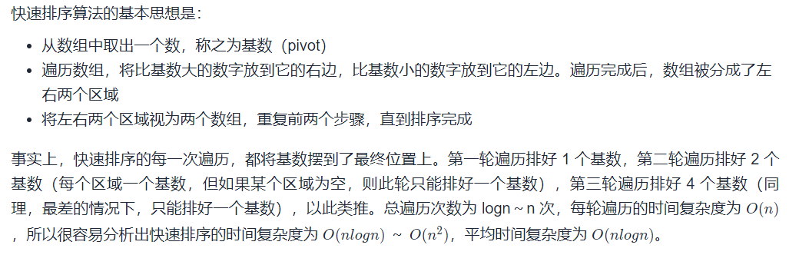

```java
// 1 快速排序
public static void quickSort(int[] arr) {
    quickSort(arr, 0, arr.length-1);
}

// 先搭架子
private static void quickSort(int[] arr, int start, int end) {
    // 递归退出条件
    if (start >= end) return;
    int middle = partition(arr, start, end);
    quickSort(arr, start, middle-1);
    quickSort(arr, middle+1, end);
}

// 后划分
private static int partition(int[] arr, int start, int end) {
    int pivot = arr[start];
    int left = start + 1;
    int right = end;

    while (left < right) {
        // 找到大于 pivot 的数
        while (left < right && arr[left] <= pivot) left++;
        // 放到最右边
        if (left != right) {
            swap(arr, left, right);
            right--;
        }
    }

    // 最后把 pivot 放到对应的位置
    if (left == right && arr[right] >= pivot) right--;
    if (start != right) swap(arr, start, right);

    return right;
}

private static void swap(int[] arr, int i, int j) {
    // 相同的数异或为0, 会出错, 且数组长度至少为两个
    if (arr.length <= 2 || arr[i] == arr[j])
        return;
    arr[i] = arr[i] ^ arr[j]; // nums[i]: 先得到异或运算两数的 不同的位
    arr[j] = arr[i] ^ arr[j]; // 分别与原来的数进行异或得到对方的值
    arr[i] = arr[i] ^ arr[j];
}
```

### 冒泡排序

> O(n*n)
>
> 优化方式：记录当前轮次是否发生过交换, 没有发生过交换表示数组已经有序.

```java
// 10 冒泡排序
public static void bubbleSort(int[] arr) {
    // 初始时 swapped 为 true，否则排序过程无法启动
    boolean swapped = true;
    for (int i = 0; i < arr.length - 1; i++) { // 进行 n-1 轮
        // 如果没有发生过交换，说明剩余部分已经有序，排序完成
        if (!swapped) break;
        // 设置 swapped 为 false，如果发生交换，则将其置为 true
        swapped = false;
        // 每过一轮, 交换次数递减一次
        for (int j = 0; j < arr.length - 1 - i; j++) {
            if (arr[j] > arr[j + 1]) {
                // 如果左边的数大于右边的数，则交换，保证右边的数字最大
                swap(arr, j, j + 1);
                // 表示发生了交换
                swapped = true;
            }
        }
    }
}
```

### 选择排序

> O(n*n)
>
> 每一轮找到最小值的下标, 放至每轮的首位.

```java
// 9 选择排序
public static void selectionSort(int[] arr) {
    int minIndex;
    for (int i = 0; i < arr.length - 1; i++) { // 进行 n-1 轮
        minIndex = i;
        for (int j = i + 1; j < arr.length; j++) {
            if (arr[minIndex] > arr[j]) {
                // 记录最小值的下标
                minIndex = j;
            }
        }
        // 将最小元素交换至首位
        swap(arr, i, minIndex);
    }
}
```

### 插入排序

> O(n*n)
>
> 顺序排列: 大的不断往后挪, 直到新数字找到合适的位置 .

```java
// 8 插入排序
public static void insertSort(int[] arr) {
    // 从第二个数开始，往前插入数字
    for (int i = 1; i < arr.length; i++) {
        int currentNumber = arr[i];
        int j = i - 1;
        // 寻找插入位置的过程中，不断地将比 currentNumber 大的数字向后挪
        while (j >= 0 && currentNumber < arr[j]) {
            arr[j + 1] = arr[j]; // 往后挪 : 后 <-(赋值给)- 前面
            j--;
        }
        // 两种情况会跳出循环：
        // 1. 遇到一个小于或等于 currentNumber 的数字，跳出循环，currentNumber 就坐到它后面;
        // 2. 已经走到数列头部，仍然没有遇到小于或等于 currentNumber 的数字，也会跳出循环，
        // 此时 j 等于 -1，	    currentNumber 就坐到数列头部。
        arr[j + 1] = currentNumber;
    }
}
```

### 堆排序

> `O(n*logn)`
>
> 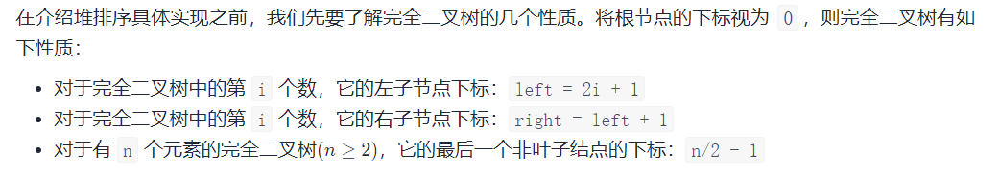
>
> 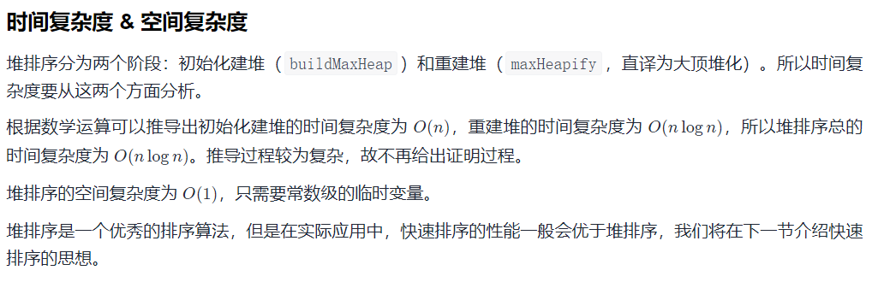

```java
// 2 堆排序
public static void heapSort(int[] arr) {
    // 构建初始大顶堆
    buildMaxHeap(arr);
    for (int i = arr.length - 1; i > 0; i--) {
        // 将最大值交换到数组最后
        swap(arr, 0, i);
        // 调整剩余数组，使其满足大顶堆
        maxHeapify(arr, 0, i);
    }
}

// 构建初始大顶堆
private static void buildMaxHeap(int[] arr) {
    // 从最后一个非叶子结点开始调整大顶堆，最后一个非叶子结点的下标就是 arr.length / 2 - 1`
    for (int i = arr.length / 2 - 1; i >= 0; i--) {
        maxHeapify(arr, i, arr.length);
    }
}

// 调整大顶堆，第三个参数表示剩余未排序的数字的数量，也就是剩余堆的大小
private static void maxHeapify(int[] arr, int i, int heapSize) {
    // 左子结点下标
    int l = 2 * i + 1;
    // 右子结点下标
    int r = l + 1;
    // 记录根结点、左子树结点、右子树结点三者中的最大值下标
    int largest = i;
    // 与左子树结点比较
    if (l < heapSize && arr[l] > arr[largest]) {
        largest = l;
    }
    // 与右子树结点比较
    if (r < heapSize && arr[r] > arr[largest]) {
        largest = r;
    }
    if (largest != i) {
        // 将最大值交换为根结点
        swap(arr, i, largest);
        // 再次调整交换数字后的大顶堆
        maxHeapify(arr, largest, heapSize);
    }
}
```

### 希尔排序

> 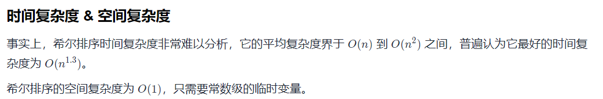
>
> 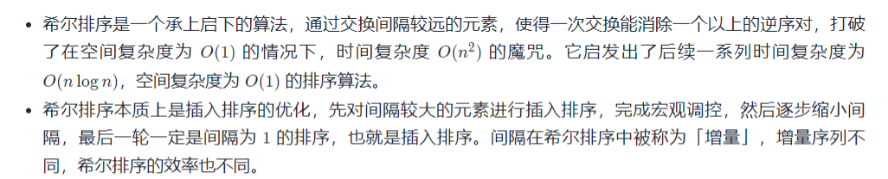

```java
// 3 希尔排序
public static void shellSort(int[] arr) {
    // 间隔序列，在希尔排序中我们称之为增量序列
    for (int gap = arr.length / 2; gap > 0; gap /= 2) {
        // 从 gap 开始，按照顺序将每个元素依次向前插入自己所在的组
        for (int i = gap; i < arr.length; i++) {
            // currentNumber 站起来，开始找位置
            int currentNumber = arr[i];
            // 该组前一个数字的索引
            int preIndex = i - gap;
            while (preIndex >= 0 && currentNumber < arr[preIndex]) {
                // 向后挪位置
                arr[preIndex + gap] = arr[preIndex];
                preIndex -= gap;
            }
            // currentNumber 找到了自己的位置，坐下
            arr[preIndex + gap] = currentNumber;
        }
    }
}
```

### 归并排序

> `O(n*logn)`
>
> 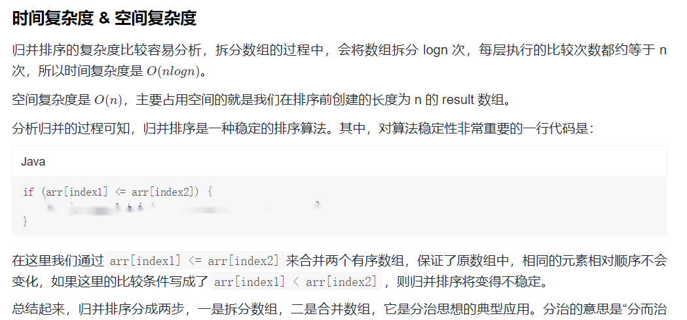

```java
// 4 归并排序
public static void mergeSort(int[] arr) {
    if (arr.length == 0) return;
    int[] result = new int[arr.length];
    mergeSort(arr, 0, arr.length - 1, result);
}

// 对 arr 的 [start, end] 区间归并排序
private static void mergeSort(int[] arr, int start, int end, int[] result) {
    // 只剩下一个数字，停止拆分
    if (start == end) return;
    int middle = (start + end) / 2;
    // 拆分左边区域，并将归并排序的结果保存到 result 的 [start, middle] 区间
    mergeSort(arr, start, middle, result);
    // 拆分右边区域，并将归并排序的结果保存到 result 的 [middle + 1, end] 区间
    mergeSort(arr, middle + 1, end, result);
    // 合并左右区域到 result 的 [start, end] 区间
    merge(arr, start, end, result);
}

// 将 result 的 [start, middle] 和 [middle + 1, end] 区间合并
private static void merge(int[] arr, int start,  int end, int[] result) {
    int middle = (start + end) / 2;
    // 数组 1 的首尾位置
    int start1 = start;
    int end1 = middle;
    // 数组 2 的首尾位置
    int start2 = middle + 1;
    int end2 = end;
    // 用来遍历数组的指针
    int index1 = start1;
    int index2 = start2;
    // 结果数组的指针
    int resultIndex = start1;
    while (index1 <= end1 && index2 <= end2) {
        if (arr[index1] <= arr[index2]) {
            result[resultIndex++] = arr[index1++];
        } else {
            result[resultIndex++] = arr[index2++];
        }
    }
    // 将剩余数字补到结果数组之后
    while (index1 <= end1) {
        result[resultIndex++] = arr[index1++];
    }
    while (index2 <= end2) {
        result[resultIndex++] = arr[index2++];
    }
    // 将 result 操作区间的数字拷贝到 arr 数组中，以便下次比较
    for (int i = start; i <= end; i++) {
        arr[i] = result[i];
    }
}
```

### [桶排序](https://leetcode-cn.com/leetbook/read/sort-algorithms/phtz1j/)

> O(n)
>
> 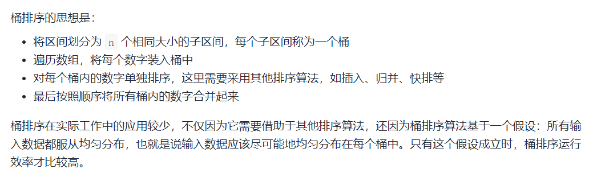
>
> 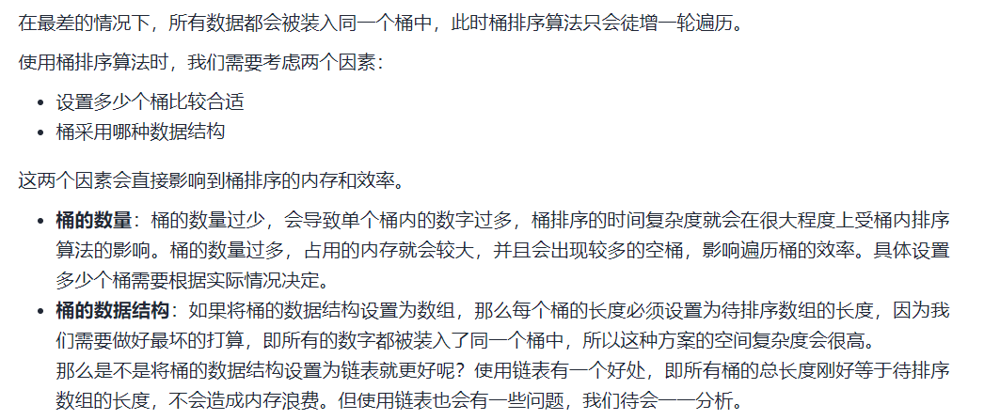

```java
// 5 桶排序
public static void bucketSort(int[] arr) {
    // 判空及防止数组越界
    if (arr == null || arr.length <= 1) return;
    // 找到最大值，最小值
    int max = arr[0];
    int min = arr[0];
    for (int i = 1; i < arr.length; i++) {
        if (arr[i] > max) max = arr[i];
        else if (arr[i] < min) min = arr[i];
    }
    // 确定取值范围
    int range = max - min;
    // 设置桶的数量，这里我们设置为 100 个，可以根据实际情况修改。
    int bucketAmount = 100;
    // 桶和桶之间的间距
    double gap = range * 1.0 / (bucketAmount - 1);
    // 用二维数组来装桶，第一个维度是桶的编号，第二个维度是桶中的数字。初始化长度为 0
    int[][] buckets = new int[bucketAmount][];
    // 装桶
    for (int value : arr) {
        // 找到 value 属于哪个桶
        int index = (int) ((value - min) / gap);
        buckets[index] = add(buckets[index], value);
    }
    int index = 0;
    // 对每个桶内的数字进行单独排序
    for (int i = 0; i < bucketAmount; i++) {
        if (buckets[i] == null || buckets[i].length == 0) continue;
        // 这里需要结合其他排序算法，例如：插入排序
        insertSort(buckets[i]);
        // 排序完成后将桶内的结果收集起来
        System.arraycopy(buckets[i], 0, arr, index, buckets[i].length);
        index += buckets[i].length;
    }
}
// 数组扩容
public static int[] add(int[] arr, int num) {
    if (arr == null) return new int[]{num};
    int[] newArr = Arrays.copyOf(arr, arr.length + 1);
    newArr[arr.length] = num;
    return newArr;
}
```


---

### [基数排序](https://leetcode-cn.com/leetbook/read/sort-algorithms/raydw2/)

> O(n)
>
> 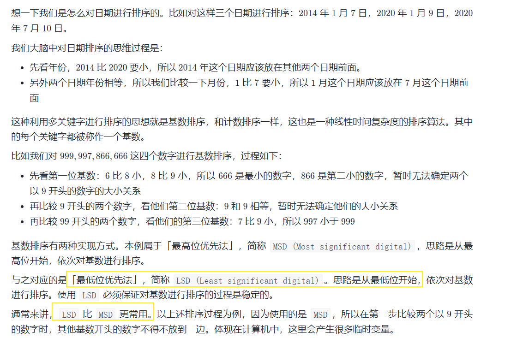

**思路:**


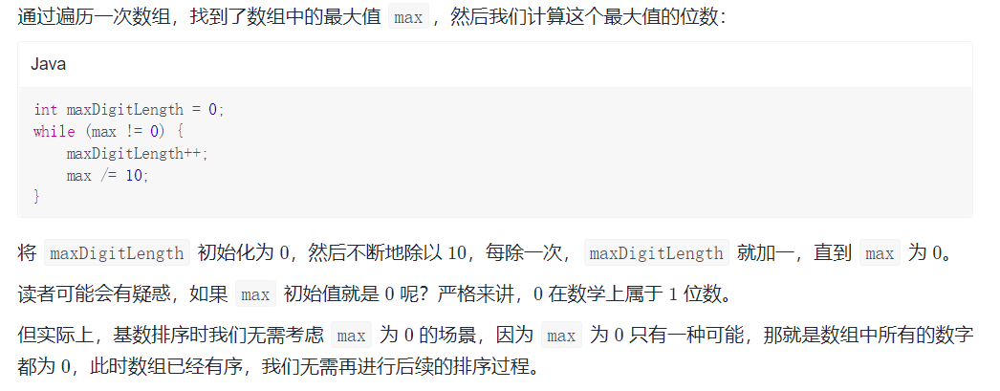

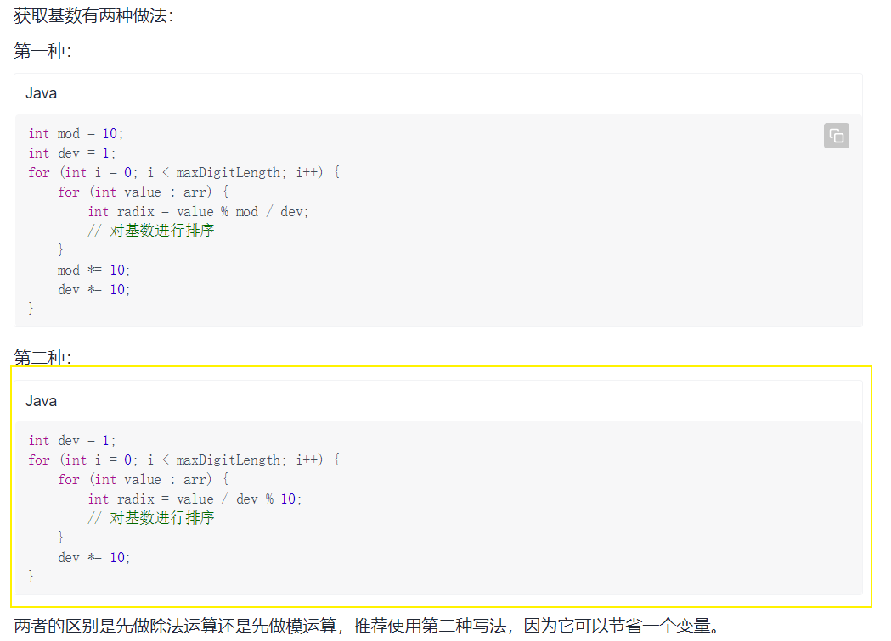


```java
// 6 LSD 基数排序
public static void radixSort(int[] arr) {
    if (arr == null) return;
    // 找出最大值
    int max = 0;
    for (int value : arr) {
        if (value > max) {
            max = value;
        }
    }
    // 计算最大数字的长度
    int maxDigitLength = 0;
    while (max != 0) {
        maxDigitLength++;
        max /= 10;
    }
    // 使用计数排序算法对基数进行排序
    int[] counting = new int[10];
    int[] result = new int[arr.length];
    int dev = 1;
    for (int i = 0; i < maxDigitLength; i++) {
        for (int value : arr) {
            int radix = value / dev % 10;
            counting[radix]++;
        }
        for (int j = 1; j < counting.length; j++) {
            counting[j] += counting[j - 1];
        }
        // 使用倒序遍历的方式完成计数排序
        for (int j = arr.length - 1; j >= 0; j--) {
            int radix = arr[j] / dev % 10;
            result[--counting[radix]] = arr[j];
        }
        // 计数排序完成后，将结果拷贝回 arr 数组
        System.arraycopy(result, 0, arr, 0, arr.length);
        // 将计数数组重置为 0
        Arrays.fill(counting, 0);
        dev *= 10;
    }
}
```

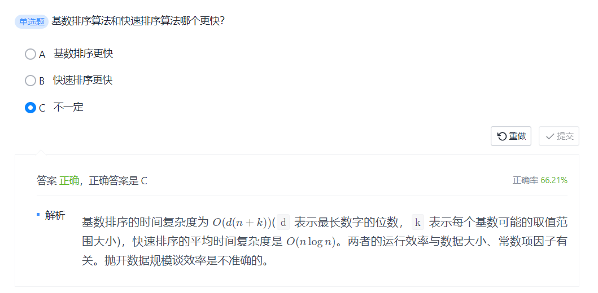

---

### [计数排序](https://leetcode-cn.com/leetbook/read/sort-algorithms/ozyo63/)

> O(n)
>
> 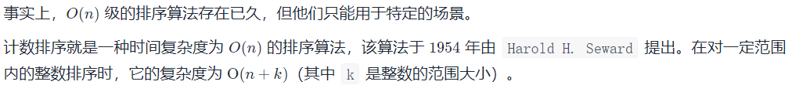
>
> 关键点:
>
> 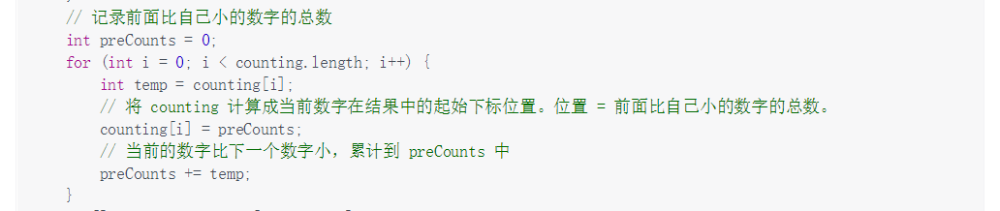
>
> 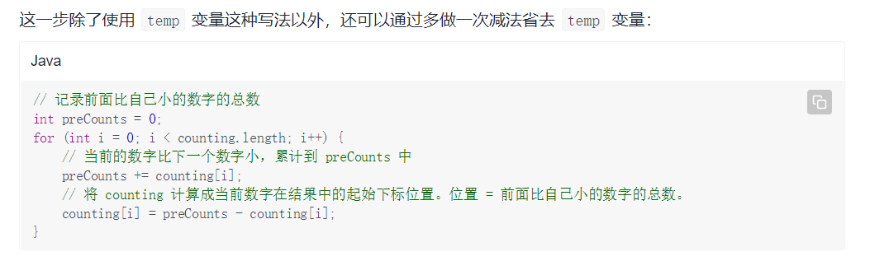

**计数排序**

```java
// 7 计数排序
public static void countingSort(int[] arr) {
    // 判空及防止数组越界
    if (arr == null || arr.length <= 1) return;
    // 找到最大值，最小值
    int max = arr[0];
    int min = arr[0];
    for (int i = 1; i < arr.length; i++) {
        if (arr[i] > max) max = arr[i];
        else if (arr[i] < min) min = arr[i];
    }
    // 确定计数范围
    int range = max - min + 1;
    // 建立长度为 range 的数组，下标 0~range-1 对应数字 min~max
    int[] counting = new int[range];
    // 遍历 arr 中的每个元素
    for (int element : arr) {
        // 将每个整数出现的次数统计到计数数组中对应下标的位置，这里需要将每个元素减去 min，才能映射到 0～range-1 范围内
        counting[element - min]++;
    }
    // 记录前面比自己小的数字的总数
    int preCounts = 0;
    for (int i = 0; i < range; i++) {
        // 当前的数字比下一个数字小，累计到 preCounts 中
        preCounts += counting[i];
        // 将 counting 计算成当前数字在结果中的起始下标位置。位置 = 前面比自己小的数字的总数。
        counting[i] = preCounts - counting[i];
    }
    int[] result = new int[arr.length];
    for (int element : arr) {
        // counting[element - min] 表示此元素在结果数组中的下标
        result[counting[element - min]] = element;
        // 更新 counting[element - min]，指向此元素的下一个下标
        counting[element - min]++;
    }
    // 将结果赋值回 arr
    for (int i = 0; i < arr.length; i++) {
        arr[i] = result[i];
    }
}
```

**倒叙遍历的计数排序**

```java
public static void countingSort(int[] arr) {
    // 防止数组越界
    if (arr == null || arr.length <= 1) return;
    // 找到最大值，最小值
    int max = arr[0];
    int min = arr[0];
    for (int i = 1; i < arr.length; i++) {
        if (arr[i] > max) max = arr[i];
        else if (arr[i] < min) min = arr[i];
    }
    // 确定计数范围
    int range = max - min + 1;
    // 建立长度为 range 的数组，下标 0~range-1 对应数字 min~max
    int[] counting = new int[range];
    // 遍历 arr 中的每个元素
    for (int element : arr) {
        // 将每个整数出现的次数统计到计数数组中对应下标的位置，这里需要将每个元素减去 min，才能映射到 0～range-1 范围内
        counting[element - min]++;
    }
    // 每个元素在结果数组中的最后一个下标位置 = 前面比自己小的数字的总数 + 自己的数量 - 1。我们将 counting[0] 先减去 1，后续 counting 直接累加即可
    counting[0]--;
    for (int i = 1; i < range; i++) {
        // 将 counting 计算成当前数字在结果中的最后一个下标位置。位置 = 前面比自己小的数字的总数 + 自己的数量 - 1
        // 由于 counting[0] 已经减了 1，所以后续的减 1 可以省略。
        counting[i] += counting[i - 1];
    }
    int[] result = new int[arr.length];
    // 从后往前遍历数组，通过 counting 中记录的下标位置，将 arr 中的元素放到 result 数组中
    for (int i = arr.length - 1; i >= 0; i--) {
        // counting[arr[i] - min] 表示此元素在结果数组中的下标
        result[counting[arr[i] - min]] = arr[i];
        // 更新 counting[arr[i] - min]，指向此元素的前一个下标
        counting[arr[i] - min]--;
    }
    // 将结果赋值回 arr
    for (int i = 0; i < arr.length; i++) {
        arr[i] = result[i];
    }
}
```

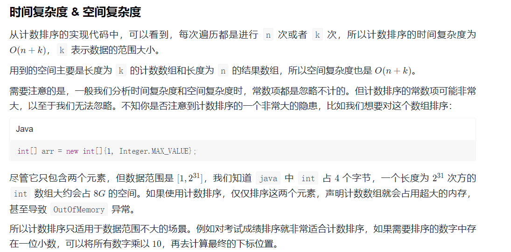

---

## 小结:

> 稳定的与不稳定

- **选择排序是不稳定的**，`冒泡排序、插入排序是稳定的`；
  - 在这三个排序算法中，选择排序交换的次数是最少的；
  - 在数组几乎有序的情况下，插入排序的时间复杂度接近线性级别。
- **希尔排序、堆排序、快速排序是不稳定的**，`归并排序是稳定的`。
  - 希尔排序的平均复杂度界于 O(n) 到 O(n*n ) 之间，普遍认为它最好的时间复杂度为 O(n 1.3)，希尔排序的空间复杂度为 O(1)；
  - 堆排序的时间复杂度为 O*(*n*log*n)，空间复杂度为 O(1)
  - 快速排序的平均时间复杂度为 O*(*n*log*n)，平均空间复杂度为 O(log n)
  - 归并排序的时间复杂度是 O(n*log*n)，空间复杂度是 O(n)


