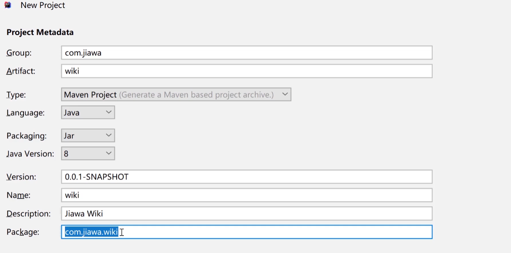
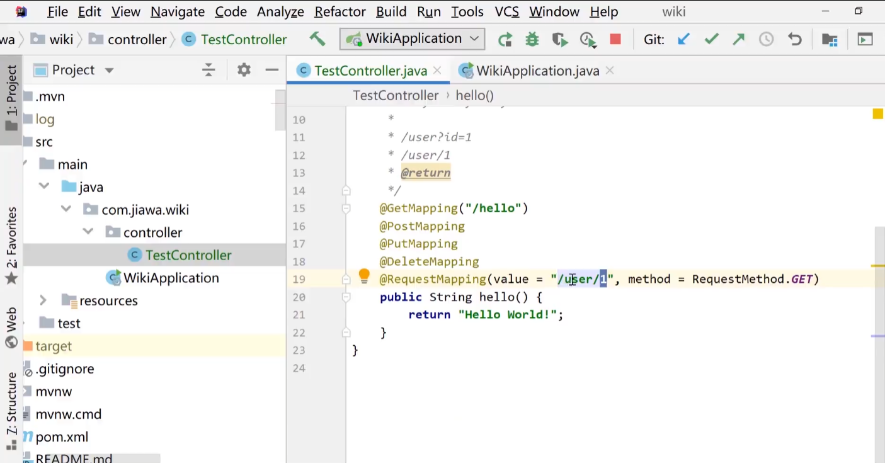
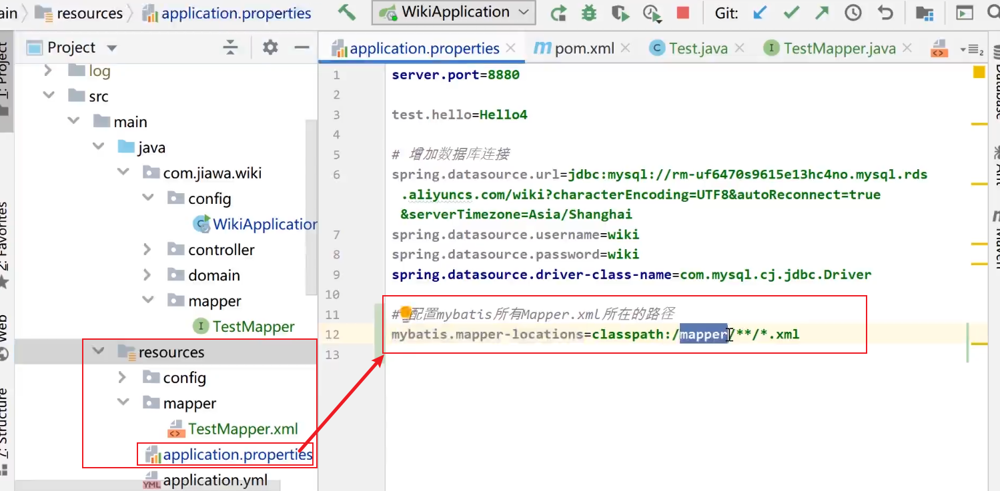

# SpringBoot_Vue搭建开发框架

## SpringBoot项目搭建




选择依赖


注意：设置Maven配置，如位置，仓库，镜像。


### 编码配置


### JDK配置


### Maven配置


参考配置：

```xml
<?xml version="1.0" encoding="UTF-8"?>
<settings xmlns="http://maven.apache.org/SETTINGS/1.0.0"
          xmlns:xsi="http://www.w3.org/2001/XMLSchema-instance"
          xsi:schemaLocation="http://maven.apache.org/SETTINGS/1.0.0     http://maven.apache.org/xsd/settings-1.0.0.xsd">
    <localRepository>C:\Users\甲蛙\.m2\repository</localRepository>

    <pluginGroups>
    </pluginGroups>
    <proxies>
    </proxies>
    <servers>
    </servers>

    <mirrors>
        <mirror>
            <id>alimaven</id>
            <mirrorOf>central</mirrorOf>
            <name>aliyun maven</name>
            <url>http://maven.aliyun.com/nexus/content/repositories/central</url>
        </mirror>

        <mirror>
            <id>alimaven</id>
            <name>aliyun maven</name>
            <url>http://maven.aliyun.com/nexus/content/groups/public</url>
            <mirrorOf>central</mirrorOf>
        </mirror>

        <mirror>
            <id>central</id>
            <name>Maven Repository Switchboard</name>
            <url>http://repo1.maven.org/maven2</url>
            <mirrorOf>central</mirrorOf>
        </mirror>

        <mirror>
            <id>repo2</id>
            <mirrorOf>central</mirrorOf>
            <name>Human Readable Name for this Mirror.</name>
            <url>http://repo2.maven.org/maven2</url>
        </mirror>

        <mirror>
            <id>ibiblio</id>
            <mirrorOf>central</mirrorOf>
            <name>Human Readable Name for this Mirror.</name>
            <url>http://mirrors.ibiblio.org/pub/mirrors/maven2</url>
        </mirror>

        <mirror>
            <id>jboss-public-repository-group</id>
            <mirrorOf>central</mirrorOf>
            <name>JBoss Public Repository Group</name>
            <url>http://repository.jboss.org/nexus/content/groups/public</url>
        </mirror>

        <mirror>
            <id>google-maven-central</id>
            <name>Google Maven Central</name>
            <url>https://maven-central.storage.googleapis.com
            </url>
            <mirrorOf>central</mirrorOf>
        </mirror>

        <!-- 中央仓库在中国的镜像 -->
        <mirror>
            <id>maven.net.cn</id>
            <name>one of the central mirrors in china</name>
            <url>http://maven.net.cn/content/groups/public</url>
            <mirrorOf>central</mirrorOf>
        </mirror>
    </mirrors>

    <profiles>
        <profile>
            <id>jdk-1.8</id>
            <activation>
                <activeByDefault>true</activeByDefault>
                <jdk>1.8</jdk>
            </activation>
            <properties>
                <maven.compiler.source>1.8</maven.compiler.source>
                <maven.compiler.target>1.8</maven.compiler.target>
                <maven.compiler.compilerVersion>1.8</maven.compiler.compilerVersion>
            </properties>
        </profile>
        <profile>
            <id>repository_set</id>
            <repositories>
                <repository>
                    <snapshots>
                        <enabled>false</enabled>
                    </snapshots>
                    <id>public</id>
                    <name>Public Repository</name>
                    <url>http://maven.aliyun.com/nexus/content/groups/public</url>
                </repository>
            </repositories>
            <pluginRepositories>
                <pluginRepository>
                    <releases>
                        <updatePolicy>never</updatePolicy>
                    </releases>
                    <snapshots>
                        <enabled>false</enabled>
                    </snapshots>
                    <id>public</id>
                    <name>Public Repository</name>
                    <url>http://maven.aliyun.com/nexus/content/groups/public</url>
                </pluginRepository>
            </pluginRepositories>
        </profile>

    </profiles>

</settings>
```

### Git配置


### @ComponentScan

> [SpringBoot启动类默认自动扫描包范围 + spring.factories理解_spring.factories 清单-CSDN博客](https://blog.csdn.net/weixin_45433031/article/details/124272633)
>
> 


原先的启动类：


如果移动了位置


> 一旦指定了@ComponentScan，则将不会在默认的启动类的包名下扫描注入容器，因此在扫描列表中还需要单独添加启动类所在的包
>
> 添加扫描包：com.jiawa


### @RestController

> @RestController = @Controller + @ResponseBody


### @RequestMapping


### 增删查改请求




### httpClient测试接口

创建文件夹 ，用于放置测试文件，文件的后缀必须是 `.http`


**测试成功**


**测试失败**


### 读取配置文件

> 优先读取配置文件，没有就用默认值。


### 集成热部署

**自动编译**


**按两次shift -> Registry** 


**运行时也可以编译**


## 数据库搭建

###  本地or远程数据库

新建数据库


创建专用账户


### IDEA数据库插件配置


**编辑后记得提交**


**脚本直接执行到数据库**


### 集成持久层框架MyBatis

#### 引入依赖

```xml
<!-- 集成mybatis-->
<dependency>
    <groupId>org.mybatis.spring.boot</groupId>
    <artifactId>mybatis-spring-boot-starter</artifactId>
    <version>2.1.3</version>
</dependency>

<!-- 集成mysql连接 -->
<dependency>
    <groupId>mysql</groupId>
    <artifactId>mysql-connector-java</artifactId>
    <version>8.0.22</version>
</dependency>
```

#### **配置数据源**


我的本地数据源：

```properties
server.port=8880

test.hello=Hello3

# 增加数据库连接 wikidev
spring.datasource.url=jdbc:mysql://localhost/wikidev?characterEncoding=UTF8&autoReconnect=true&serverTimezone=Asia/Shanghai&allowMultiQueries=true
spring.datasource.username=wikidev
spring.datasource.password=666666
spring.datasource.driver-class-name=com.mysql.cj.jdbc.Driver

```


#### **实体类**

>  数据库中新建表Test，实体类和表一一对应起来。
>
> 注：实体类需要加上@Mapper


```java
@Data
public class Test {

    private Integer id;

    private String name;

    private String password;

}
```


#### 对应Mapper文件

```java
@Mapper
public interface TestMapper {

    List<Test> list();

}
```

```xml
<?xml version="1.0" encoding="UTF-8" ?>
<!DOCTYPE mapper PUBLIC "-//mybatis.org//DTD Mapper 3.0//EN"
        "http://mybatis.org/dtd/mybatis-3-mapper.dtd" >
<mapper namespace="com.jungle.wiki.mapper.TestMapper" >

    <select id="list" resultType="com.jungle.wiki.domain.Test">
        select id, name, password from test
    </select>

</mapper>
```

#### 配置mybatis对应的xml文件的路径

```properties
# 配置mybatis所有Mapper.xml所在的路径 /**/ 表示无论多少层文件夹；*.xml代表所有的xml文件
mybatis.mapper-locations=classpath:/mapper/**/*.xml
```




> **ps:** `controller -> service -> mapper`

#### 配置mybatis自动生成代码插件

```xml
<!-- mybatis generator 自动生成代码插件 -->
<plugin>
    <groupId>org.mybatis.generator</groupId>
    <artifactId>mybatis-generator-maven-plugin</artifactId>
    <version>1.4.0</version>
    <configuration>
        <configurationFile>src/main/resources/generator/generator-config.xml</configurationFile>
        <overwrite>true</overwrite>
        <verbose>true</verbose>
    </configuration>
    <dependencies>
        <dependency>
            <groupId>mysql</groupId>
            <artifactId>mysql-connector-java</artifactId>
            <version>8.0.22</version>
        </dependency>
    </dependencies>
</plugin>
```

#### 新建generator-config.xml文件


```xml
<?xml version="1.0" encoding="UTF-8"?>
<!DOCTYPE generatorConfiguration
        PUBLIC "-//mybatis.org//DTD MyBatis Generator Configuration 1.0//EN"
        "http://mybatis.org/dtd/mybatis-generator-config_1_0.dtd">

<generatorConfiguration>
    <context id="Mysql" targetRuntime="MyBatis3" defaultModelType="flat">

        <!-- 自动检查关键字，为关键字增加反引号 -->
        <property name="autoDelimitKeywords" value="true"/>
        <property name="beginningDelimiter" value="`"/>
        <property name="endingDelimiter" value="`"/>

        <!--覆盖生成XML文件-->
        <plugin type="org.mybatis.generator.plugins.UnmergeableXmlMappersPlugin" />
        <!-- 生成的实体类添加toString()方法 -->
        <plugin type="org.mybatis.generator.plugins.ToStringPlugin"/>

        <!-- 不生成注释 -->
        <commentGenerator>
            <property name="suppressAllComments" value="true"/>
        </commentGenerator>

        <jdbcConnection driverClass="com.mysql.cj.jdbc.Driver"
                        connectionURL="jdbc:mysql://localhost:3306/wikidev?serverTimezone=Asia/Shanghai"
                        userId="wikidev"
                        password="666666">
        </jdbcConnection>

        <!-- domain类的位置 -->
        <javaModelGenerator targetProject="src\main\java"
                            targetPackage="com.jungle.wiki.domain"/>

        <!-- mapper xml的位置 -->
        <sqlMapGenerator targetProject="src\main\resources"
                         targetPackage="mapper"/>

        <!-- mapper类的位置 -->
        <javaClientGenerator targetProject="src\main\java"
                             targetPackage="com.jungle.wiki.mapper"
                             type="XMLMAPPER"/>

<!--        <table tableName="demo" domainObjectName="Demo"/>-->
<!--        <table tableName="ebook" domainObjectName="Ebook"/>-->
    </context>
</generatorConfiguration>

```

#### 生成标准文件

> 注：使用完后立即注释掉：
>
> `<!--        <table tableName="demo" domainObjectName="Demo"/>-->`


---

## 业务返回信息

### 通用返回信息

```java
package com.jungle.wiki.resp;


/**
 * 通用返回类
 */
public class CommonResp<T> {

    /**
     * 业务上的成功或失败
     */
    private boolean success = true;

    /**
     * 返回信息
     */
    private String message;

    /**
     * 返回泛型数据，自定义类型
     */
    private T content;

    public boolean getSuccess() {
        return success;
    }

    public void setSuccess(boolean success) {
        this.success = success;
    }

    public String getMessage() {
        return message;
    }

    public void setMessage(String message) {
        this.message = message;
    }

    public T getContent() {
        return content;
    }

    public void setContent(T content) {
        this.content = content;
    }

    @Override
    public String toString() {
        final StringBuffer sb = new StringBuffer("ResponseDto{");
        sb.append("success=").append(success);
        sb.append(", message='").append(message).append('\'');
        sb.append(", content=").append(content);
        sb.append('}');
        return sb.toString();
    }
}

```

如登录成功或失败


### 封装请求参数和返回参数

> 以电子书为例，封装请求参数：

```java
@Data
public class EbookReq {

    private Long id;

    private String name;

}
```

> 封装返回参数：根据需要选择字段，大多数情况可以和原数据对象保持一致。

```java
package com.jungle.wiki.resp;

import lombok.Data;

@Data
public class EbookResp {

    private Long id;

    private String name;

    private Long category1Id;

    private Long category2Id;

    private String description;

    private String cover;

    private Integer docCount;

    private Integer viewCount;

    private Integer voteCount;

}
```


---

### 封装工具类

#### CopyUtil

```java
package com.jungle.wiki.util;

import org.springframework.beans.BeanUtils;
import org.springframework.util.CollectionUtils;

import java.util.ArrayList;
import java.util.List;

/**
 * @author Jungle
 */
public class CopyUtil {

    /**
     * 单体复制：单个对象的复制
     * @param source 源对象
     * @param clazz 目标对象类型
     */
    public static <T> T copy(Object source, Class<T> clazz) {
        if (source == null) {
            return null;
        }
        T obj = null;
        try {
            // 生成目标对象
            obj = clazz.newInstance();
        } catch (Exception e) {
            e.printStackTrace();
            return null;
        }
        // 把原对象复制到目标对象
        BeanUtils.copyProperties(source, obj);
        // 返回目标对象
        return obj;
    }

    /**
     * 列表复制
     * @param source 源对象列表
     * @param clazz 目标对象类型
     */
    public static <T> List<T> copyList(List source, Class<T> clazz) {
        List<T> target = new ArrayList<>();
        // 如果源对象列表不为空，就遍历
        if (!CollectionUtils.isEmpty(source)){
            for (Object s : source) {
                // 每个对象复制到目标对象并添加到目标对象列表
                T obj = copy(s, clazz);
                target.add(obj);
            }
        }
        // 返回目标对象列表
        return target;
    }
}

```


---

### 业务逻辑

#### Service

```java
package com.jungle.wiki.service;

import com.jungle.wiki.domain.Ebook;
import com.jungle.wiki.domain.EbookExample;
import com.jungle.wiki.mapper.EbookMapper;
import com.jungle.wiki.req.EbookReq;
import com.jungle.wiki.resp.EbookResp;
import com.jungle.wiki.util.CopyUtil;
import org.springframework.stereotype.Service;
import org.springframework.util.ObjectUtils;

import javax.annotation.Resource;
import java.util.List;

/**
 * 使用@Service注解, 将这个Service交给Spring来管理 
 * @author Jungle 
 * @version 2022/11/12 12:09
**/
@Service
public class EbookService {

    @Resource
    private EbookMapper ebookMapper;

    public List<EbookResp> getList(EbookReq req) {
        // 相当于 查询条件 Where
        EbookExample ebookExample = new EbookExample();
        EbookExample.Criteria criteria = ebookExample.createCriteria();
        // StringUtils.isEmpty 已废弃, 建议使用 ObjectUtils.isEmpty
        if (!ObjectUtils.isEmpty(req.getName())) {
            criteria.andNameLike("%" + req.getName() + "%");
        }
        List<Ebook> ebooksList = ebookMapper.selectByExample(ebookExample);

        // 返回 EbookResp的列表，EbookResp只包含了ebook的部分数据
        return clazzConverter(ebooksList);

    }

    /**
     * 类转换器
     * 数据返回时不一定全部返回，这个时候需要根据需要返回部分数据。
     * */
    private List<EbookResp> clazzConverter(List<Ebook> ebooksList) {
         /*List<EbookResp> res = new ArrayList<>();
         for (Ebook ebook : ebooksList) {
             //EbookResp ebookResp = new EbookResp();
             //BeanUtils.copyProperties(ebook, ebookResp);
             // 对象复制
             EbookResp ebookResp = CopyUtil.copy(ebook, EbookResp.class);
             res.add(ebookResp);
         }
         return res;*/
        /* 列表复制*/
        return CopyUtil.copyList(ebooksList, EbookResp.class);
    }


}

```

#### Controller

```java
package com.jungle.wiki.controller;

import com.jungle.wiki.req.EbookReq;
import com.jungle.wiki.resp.CommonResp;
import com.jungle.wiki.resp.EbookResp;
import com.jungle.wiki.service.EbookService;
import org.springframework.web.bind.annotation.GetMapping;
import org.springframework.web.bind.annotation.RequestMapping;
import org.springframework.web.bind.annotation.RestController;

import javax.annotation.Resource;
import java.util.List;


@RestController
@RequestMapping("/ebook")
public class EbookController {

    @Resource
    private EbookService ebookService;


    @GetMapping("/list")
    public CommonResp<List<EbookResp>> list(EbookReq req) { //将请求参数封装成一个类
        CommonResp<List<EbookResp>> resp = new CommonResp<>();
        List<EbookResp> list = ebookService.getList(req);
        resp.setContent(list);
        return resp;
    }

}

```

### Mybatis自动生成的代码

#### Ebook

```java
package com.jungle.wiki.domain;

import lombok.Data;

@Data
public class Ebook {
    private Long id;

    private String name;

    private Long category1Id;

    private Long category2Id;

    private String description;

    private String cover;

    private Integer docCount;

    private Integer viewCount;

    private Integer voteCount;

    public Long getId() {
        return id;
    }

    public void setId(Long id) {
        this.id = id;
    }

    public String getName() {
        return name;
    }

    public void setName(String name) {
        this.name = name;
    }

    public Long getCategory1Id() {
        return category1Id;
    }

    public void setCategory1Id(Long category1Id) {
        this.category1Id = category1Id;
    }

    public Long getCategory2Id() {
        return category2Id;
    }

    public void setCategory2Id(Long category2Id) {
        this.category2Id = category2Id;
    }

    public String getDescription() {
        return description;
    }

    public void setDescription(String description) {
        this.description = description;
    }

    public String getCover() {
        return cover;
    }

    public void setCover(String cover) {
        this.cover = cover;
    }

    public Integer getDocCount() {
        return docCount;
    }

    public void setDocCount(Integer docCount) {
        this.docCount = docCount;
    }

    public Integer getViewCount() {
        return viewCount;
    }

    public void setViewCount(Integer viewCount) {
        this.viewCount = viewCount;
    }

    public Integer getVoteCount() {
        return voteCount;
    }

    public void setVoteCount(Integer voteCount) {
        this.voteCount = voteCount;
    }

    @Override
    public String toString() {
        StringBuilder sb = new StringBuilder();
        sb.append(getClass().getSimpleName());
        sb.append(" [");
        sb.append("Hash = ").append(hashCode());
        sb.append(", id=").append(id);
        sb.append(", name=").append(name);
        sb.append(", category1Id=").append(category1Id);
        sb.append(", category2Id=").append(category2Id);
        sb.append(", description=").append(description);
        sb.append(", cover=").append(cover);
        sb.append(", docCount=").append(docCount);
        sb.append(", viewCount=").append(viewCount);
        sb.append(", voteCount=").append(voteCount);
        sb.append("]");
        return sb.toString();
    }
}
```

#### EbookExample

```java
package com.jungle.wiki.domain;

import java.util.ArrayList;
import java.util.List;

public class EbookExample {
    protected String orderByClause;

    protected boolean distinct;

    protected List<Criteria> oredCriteria;

    public EbookExample() {
        oredCriteria = new ArrayList<>();
    }

    public void setOrderByClause(String orderByClause) {
        this.orderByClause = orderByClause;
    }

    public String getOrderByClause() {
        return orderByClause;
    }

    public void setDistinct(boolean distinct) {
        this.distinct = distinct;
    }

    public boolean isDistinct() {
        return distinct;
    }

    public List<Criteria> getOredCriteria() {
        return oredCriteria;
    }

    public void or(Criteria criteria) {
        oredCriteria.add(criteria);
    }

    public Criteria or() {
        Criteria criteria = createCriteriaInternal();
        oredCriteria.add(criteria);
        return criteria;
    }

    public Criteria createCriteria() {
        Criteria criteria = createCriteriaInternal();
        if (oredCriteria.size() == 0) {
            oredCriteria.add(criteria);
        }
        return criteria;
    }

    protected Criteria createCriteriaInternal() {
        Criteria criteria = new Criteria();
        return criteria;
    }

    public void clear() {
        oredCriteria.clear();
        orderByClause = null;
        distinct = false;
    }

    protected abstract static class GeneratedCriteria {
        protected List<Criterion> criteria;

        protected GeneratedCriteria() {
            super();
            criteria = new ArrayList<>();
        }

        public boolean isValid() {
            return criteria.size() > 0;
        }

        public List<Criterion> getAllCriteria() {
            return criteria;
        }

        public List<Criterion> getCriteria() {
            return criteria;
        }

        protected void addCriterion(String condition) {
            if (condition == null) {
                throw new RuntimeException("Value for condition cannot be null");
            }
            criteria.add(new Criterion(condition));
        }

        protected void addCriterion(String condition, Object value, String property) {
            if (value == null) {
                throw new RuntimeException("Value for " + property + " cannot be null");
            }
            criteria.add(new Criterion(condition, value));
        }

        protected void addCriterion(String condition, Object value1, Object value2, String property) {
            if (value1 == null || value2 == null) {
                throw new RuntimeException("Between values for " + property + " cannot be null");
            }
            criteria.add(new Criterion(condition, value1, value2));
        }

        public Criteria andIdIsNull() {
            addCriterion("id is null");
            return (Criteria) this;
        }

        public Criteria andIdIsNotNull() {
            addCriterion("id is not null");
            return (Criteria) this;
        }

        public Criteria andIdEqualTo(Long value) {
            addCriterion("id =", value, "id");
            return (Criteria) this;
        }

        public Criteria andIdNotEqualTo(Long value) {
            addCriterion("id <>", value, "id");
            return (Criteria) this;
        }

        public Criteria andIdGreaterThan(Long value) {
            addCriterion("id >", value, "id");
            return (Criteria) this;
        }

        public Criteria andIdGreaterThanOrEqualTo(Long value) {
            addCriterion("id >=", value, "id");
            return (Criteria) this;
        }

        public Criteria andIdLessThan(Long value) {
            addCriterion("id <", value, "id");
            return (Criteria) this;
        }

        public Criteria andIdLessThanOrEqualTo(Long value) {
            addCriterion("id <=", value, "id");
            return (Criteria) this;
        }

        public Criteria andIdIn(List<Long> values) {
            addCriterion("id in", values, "id");
            return (Criteria) this;
        }

        public Criteria andIdNotIn(List<Long> values) {
            addCriterion("id not in", values, "id");
            return (Criteria) this;
        }

        public Criteria andIdBetween(Long value1, Long value2) {
            addCriterion("id between", value1, value2, "id");
            return (Criteria) this;
        }

        public Criteria andIdNotBetween(Long value1, Long value2) {
            addCriterion("id not between", value1, value2, "id");
            return (Criteria) this;
        }

        public Criteria andNameIsNull() {
            addCriterion("`name` is null");
            return (Criteria) this;
        }

        public Criteria andNameIsNotNull() {
            addCriterion("`name` is not null");
            return (Criteria) this;
        }

        public Criteria andNameEqualTo(String value) {
            addCriterion("`name` =", value, "name");
            return (Criteria) this;
        }

        public Criteria andNameNotEqualTo(String value) {
            addCriterion("`name` <>", value, "name");
            return (Criteria) this;
        }

        public Criteria andNameGreaterThan(String value) {
            addCriterion("`name` >", value, "name");
            return (Criteria) this;
        }

        public Criteria andNameGreaterThanOrEqualTo(String value) {
            addCriterion("`name` >=", value, "name");
            return (Criteria) this;
        }

        public Criteria andNameLessThan(String value) {
            addCriterion("`name` <", value, "name");
            return (Criteria) this;
        }

        public Criteria andNameLessThanOrEqualTo(String value) {
            addCriterion("`name` <=", value, "name");
            return (Criteria) this;
        }

        public Criteria andNameLike(String value) {
            addCriterion("`name` like", value, "name");
            return (Criteria) this;
        }

        public Criteria andNameNotLike(String value) {
            addCriterion("`name` not like", value, "name");
            return (Criteria) this;
        }

        public Criteria andNameIn(List<String> values) {
            addCriterion("`name` in", values, "name");
            return (Criteria) this;
        }

        public Criteria andNameNotIn(List<String> values) {
            addCriterion("`name` not in", values, "name");
            return (Criteria) this;
        }

        public Criteria andNameBetween(String value1, String value2) {
            addCriterion("`name` between", value1, value2, "name");
            return (Criteria) this;
        }

        public Criteria andNameNotBetween(String value1, String value2) {
            addCriterion("`name` not between", value1, value2, "name");
            return (Criteria) this;
        }

        public Criteria andCategory1IdIsNull() {
            addCriterion("category1_id is null");
            return (Criteria) this;
        }

        public Criteria andCategory1IdIsNotNull() {
            addCriterion("category1_id is not null");
            return (Criteria) this;
        }

        public Criteria andCategory1IdEqualTo(Long value) {
            addCriterion("category1_id =", value, "category1Id");
            return (Criteria) this;
        }

        public Criteria andCategory1IdNotEqualTo(Long value) {
            addCriterion("category1_id <>", value, "category1Id");
            return (Criteria) this;
        }

        public Criteria andCategory1IdGreaterThan(Long value) {
            addCriterion("category1_id >", value, "category1Id");
            return (Criteria) this;
        }

        public Criteria andCategory1IdGreaterThanOrEqualTo(Long value) {
            addCriterion("category1_id >=", value, "category1Id");
            return (Criteria) this;
        }

        public Criteria andCategory1IdLessThan(Long value) {
            addCriterion("category1_id <", value, "category1Id");
            return (Criteria) this;
        }

        public Criteria andCategory1IdLessThanOrEqualTo(Long value) {
            addCriterion("category1_id <=", value, "category1Id");
            return (Criteria) this;
        }

        public Criteria andCategory1IdIn(List<Long> values) {
            addCriterion("category1_id in", values, "category1Id");
            return (Criteria) this;
        }

        public Criteria andCategory1IdNotIn(List<Long> values) {
            addCriterion("category1_id not in", values, "category1Id");
            return (Criteria) this;
        }

        public Criteria andCategory1IdBetween(Long value1, Long value2) {
            addCriterion("category1_id between", value1, value2, "category1Id");
            return (Criteria) this;
        }

        public Criteria andCategory1IdNotBetween(Long value1, Long value2) {
            addCriterion("category1_id not between", value1, value2, "category1Id");
            return (Criteria) this;
        }

        public Criteria andCategory2IdIsNull() {
            addCriterion("category2_id is null");
            return (Criteria) this;
        }

        public Criteria andCategory2IdIsNotNull() {
            addCriterion("category2_id is not null");
            return (Criteria) this;
        }

        public Criteria andCategory2IdEqualTo(Long value) {
            addCriterion("category2_id =", value, "category2Id");
            return (Criteria) this;
        }

        public Criteria andCategory2IdNotEqualTo(Long value) {
            addCriterion("category2_id <>", value, "category2Id");
            return (Criteria) this;
        }

        public Criteria andCategory2IdGreaterThan(Long value) {
            addCriterion("category2_id >", value, "category2Id");
            return (Criteria) this;
        }

        public Criteria andCategory2IdGreaterThanOrEqualTo(Long value) {
            addCriterion("category2_id >=", value, "category2Id");
            return (Criteria) this;
        }

        public Criteria andCategory2IdLessThan(Long value) {
            addCriterion("category2_id <", value, "category2Id");
            return (Criteria) this;
        }

        public Criteria andCategory2IdLessThanOrEqualTo(Long value) {
            addCriterion("category2_id <=", value, "category2Id");
            return (Criteria) this;
        }

        public Criteria andCategory2IdIn(List<Long> values) {
            addCriterion("category2_id in", values, "category2Id");
            return (Criteria) this;
        }

        public Criteria andCategory2IdNotIn(List<Long> values) {
            addCriterion("category2_id not in", values, "category2Id");
            return (Criteria) this;
        }

        public Criteria andCategory2IdBetween(Long value1, Long value2) {
            addCriterion("category2_id between", value1, value2, "category2Id");
            return (Criteria) this;
        }

        public Criteria andCategory2IdNotBetween(Long value1, Long value2) {
            addCriterion("category2_id not between", value1, value2, "category2Id");
            return (Criteria) this;
        }

        public Criteria andDescriptionIsNull() {
            addCriterion("description is null");
            return (Criteria) this;
        }

        public Criteria andDescriptionIsNotNull() {
            addCriterion("description is not null");
            return (Criteria) this;
        }

        public Criteria andDescriptionEqualTo(String value) {
            addCriterion("description =", value, "description");
            return (Criteria) this;
        }

        public Criteria andDescriptionNotEqualTo(String value) {
            addCriterion("description <>", value, "description");
            return (Criteria) this;
        }

        public Criteria andDescriptionGreaterThan(String value) {
            addCriterion("description >", value, "description");
            return (Criteria) this;
        }

        public Criteria andDescriptionGreaterThanOrEqualTo(String value) {
            addCriterion("description >=", value, "description");
            return (Criteria) this;
        }

        public Criteria andDescriptionLessThan(String value) {
            addCriterion("description <", value, "description");
            return (Criteria) this;
        }

        public Criteria andDescriptionLessThanOrEqualTo(String value) {
            addCriterion("description <=", value, "description");
            return (Criteria) this;
        }

        public Criteria andDescriptionLike(String value) {
            addCriterion("description like", value, "description");
            return (Criteria) this;
        }

        public Criteria andDescriptionNotLike(String value) {
            addCriterion("description not like", value, "description");
            return (Criteria) this;
        }

        public Criteria andDescriptionIn(List<String> values) {
            addCriterion("description in", values, "description");
            return (Criteria) this;
        }

        public Criteria andDescriptionNotIn(List<String> values) {
            addCriterion("description not in", values, "description");
            return (Criteria) this;
        }

        public Criteria andDescriptionBetween(String value1, String value2) {
            addCriterion("description between", value1, value2, "description");
            return (Criteria) this;
        }

        public Criteria andDescriptionNotBetween(String value1, String value2) {
            addCriterion("description not between", value1, value2, "description");
            return (Criteria) this;
        }

        public Criteria andCoverIsNull() {
            addCriterion("cover is null");
            return (Criteria) this;
        }

        public Criteria andCoverIsNotNull() {
            addCriterion("cover is not null");
            return (Criteria) this;
        }

        public Criteria andCoverEqualTo(String value) {
            addCriterion("cover =", value, "cover");
            return (Criteria) this;
        }

        public Criteria andCoverNotEqualTo(String value) {
            addCriterion("cover <>", value, "cover");
            return (Criteria) this;
        }

        public Criteria andCoverGreaterThan(String value) {
            addCriterion("cover >", value, "cover");
            return (Criteria) this;
        }

        public Criteria andCoverGreaterThanOrEqualTo(String value) {
            addCriterion("cover >=", value, "cover");
            return (Criteria) this;
        }

        public Criteria andCoverLessThan(String value) {
            addCriterion("cover <", value, "cover");
            return (Criteria) this;
        }

        public Criteria andCoverLessThanOrEqualTo(String value) {
            addCriterion("cover <=", value, "cover");
            return (Criteria) this;
        }

        public Criteria andCoverLike(String value) {
            addCriterion("cover like", value, "cover");
            return (Criteria) this;
        }

        public Criteria andCoverNotLike(String value) {
            addCriterion("cover not like", value, "cover");
            return (Criteria) this;
        }

        public Criteria andCoverIn(List<String> values) {
            addCriterion("cover in", values, "cover");
            return (Criteria) this;
        }

        public Criteria andCoverNotIn(List<String> values) {
            addCriterion("cover not in", values, "cover");
            return (Criteria) this;
        }

        public Criteria andCoverBetween(String value1, String value2) {
            addCriterion("cover between", value1, value2, "cover");
            return (Criteria) this;
        }

        public Criteria andCoverNotBetween(String value1, String value2) {
            addCriterion("cover not between", value1, value2, "cover");
            return (Criteria) this;
        }

        public Criteria andDocCountIsNull() {
            addCriterion("doc_count is null");
            return (Criteria) this;
        }

        public Criteria andDocCountIsNotNull() {
            addCriterion("doc_count is not null");
            return (Criteria) this;
        }

        public Criteria andDocCountEqualTo(Integer value) {
            addCriterion("doc_count =", value, "docCount");
            return (Criteria) this;
        }

        public Criteria andDocCountNotEqualTo(Integer value) {
            addCriterion("doc_count <>", value, "docCount");
            return (Criteria) this;
        }

        public Criteria andDocCountGreaterThan(Integer value) {
            addCriterion("doc_count >", value, "docCount");
            return (Criteria) this;
        }

        public Criteria andDocCountGreaterThanOrEqualTo(Integer value) {
            addCriterion("doc_count >=", value, "docCount");
            return (Criteria) this;
        }

        public Criteria andDocCountLessThan(Integer value) {
            addCriterion("doc_count <", value, "docCount");
            return (Criteria) this;
        }

        public Criteria andDocCountLessThanOrEqualTo(Integer value) {
            addCriterion("doc_count <=", value, "docCount");
            return (Criteria) this;
        }

        public Criteria andDocCountIn(List<Integer> values) {
            addCriterion("doc_count in", values, "docCount");
            return (Criteria) this;
        }

        public Criteria andDocCountNotIn(List<Integer> values) {
            addCriterion("doc_count not in", values, "docCount");
            return (Criteria) this;
        }

        public Criteria andDocCountBetween(Integer value1, Integer value2) {
            addCriterion("doc_count between", value1, value2, "docCount");
            return (Criteria) this;
        }

        public Criteria andDocCountNotBetween(Integer value1, Integer value2) {
            addCriterion("doc_count not between", value1, value2, "docCount");
            return (Criteria) this;
        }

        public Criteria andViewCountIsNull() {
            addCriterion("view_count is null");
            return (Criteria) this;
        }

        public Criteria andViewCountIsNotNull() {
            addCriterion("view_count is not null");
            return (Criteria) this;
        }

        public Criteria andViewCountEqualTo(Integer value) {
            addCriterion("view_count =", value, "viewCount");
            return (Criteria) this;
        }

        public Criteria andViewCountNotEqualTo(Integer value) {
            addCriterion("view_count <>", value, "viewCount");
            return (Criteria) this;
        }

        public Criteria andViewCountGreaterThan(Integer value) {
            addCriterion("view_count >", value, "viewCount");
            return (Criteria) this;
        }

        public Criteria andViewCountGreaterThanOrEqualTo(Integer value) {
            addCriterion("view_count >=", value, "viewCount");
            return (Criteria) this;
        }

        public Criteria andViewCountLessThan(Integer value) {
            addCriterion("view_count <", value, "viewCount");
            return (Criteria) this;
        }

        public Criteria andViewCountLessThanOrEqualTo(Integer value) {
            addCriterion("view_count <=", value, "viewCount");
            return (Criteria) this;
        }

        public Criteria andViewCountIn(List<Integer> values) {
            addCriterion("view_count in", values, "viewCount");
            return (Criteria) this;
        }

        public Criteria andViewCountNotIn(List<Integer> values) {
            addCriterion("view_count not in", values, "viewCount");
            return (Criteria) this;
        }

        public Criteria andViewCountBetween(Integer value1, Integer value2) {
            addCriterion("view_count between", value1, value2, "viewCount");
            return (Criteria) this;
        }

        public Criteria andViewCountNotBetween(Integer value1, Integer value2) {
            addCriterion("view_count not between", value1, value2, "viewCount");
            return (Criteria) this;
        }

        public Criteria andVoteCountIsNull() {
            addCriterion("vote_count is null");
            return (Criteria) this;
        }

        public Criteria andVoteCountIsNotNull() {
            addCriterion("vote_count is not null");
            return (Criteria) this;
        }

        public Criteria andVoteCountEqualTo(Integer value) {
            addCriterion("vote_count =", value, "voteCount");
            return (Criteria) this;
        }

        public Criteria andVoteCountNotEqualTo(Integer value) {
            addCriterion("vote_count <>", value, "voteCount");
            return (Criteria) this;
        }

        public Criteria andVoteCountGreaterThan(Integer value) {
            addCriterion("vote_count >", value, "voteCount");
            return (Criteria) this;
        }

        public Criteria andVoteCountGreaterThanOrEqualTo(Integer value) {
            addCriterion("vote_count >=", value, "voteCount");
            return (Criteria) this;
        }

        public Criteria andVoteCountLessThan(Integer value) {
            addCriterion("vote_count <", value, "voteCount");
            return (Criteria) this;
        }

        public Criteria andVoteCountLessThanOrEqualTo(Integer value) {
            addCriterion("vote_count <=", value, "voteCount");
            return (Criteria) this;
        }

        public Criteria andVoteCountIn(List<Integer> values) {
            addCriterion("vote_count in", values, "voteCount");
            return (Criteria) this;
        }

        public Criteria andVoteCountNotIn(List<Integer> values) {
            addCriterion("vote_count not in", values, "voteCount");
            return (Criteria) this;
        }

        public Criteria andVoteCountBetween(Integer value1, Integer value2) {
            addCriterion("vote_count between", value1, value2, "voteCount");
            return (Criteria) this;
        }

        public Criteria andVoteCountNotBetween(Integer value1, Integer value2) {
            addCriterion("vote_count not between", value1, value2, "voteCount");
            return (Criteria) this;
        }
    }

    public static class Criteria extends GeneratedCriteria {
        protected Criteria() {
            super();
        }
    }

    public static class Criterion {
        private String condition;

        private Object value;

        private Object secondValue;

        private boolean noValue;

        private boolean singleValue;

        private boolean betweenValue;

        private boolean listValue;

        private String typeHandler;

        public String getCondition() {
            return condition;
        }

        public Object getValue() {
            return value;
        }

        public Object getSecondValue() {
            return secondValue;
        }

        public boolean isNoValue() {
            return noValue;
        }

        public boolean isSingleValue() {
            return singleValue;
        }

        public boolean isBetweenValue() {
            return betweenValue;
        }

        public boolean isListValue() {
            return listValue;
        }

        public String getTypeHandler() {
            return typeHandler;
        }

        protected Criterion(String condition) {
            super();
            this.condition = condition;
            this.typeHandler = null;
            this.noValue = true;
        }

        protected Criterion(String condition, Object value, String typeHandler) {
            super();
            this.condition = condition;
            this.value = value;
            this.typeHandler = typeHandler;
            if (value instanceof List<?>) {
                this.listValue = true;
            } else {
                this.singleValue = true;
            }
        }

        protected Criterion(String condition, Object value) {
            this(condition, value, null);
        }

        protected Criterion(String condition, Object value, Object secondValue, String typeHandler) {
            super();
            this.condition = condition;
            this.value = value;
            this.secondValue = secondValue;
            this.typeHandler = typeHandler;
            this.betweenValue = true;
        }

        protected Criterion(String condition, Object value, Object secondValue) {
            this(condition, value, secondValue, null);
        }
    }
}
```

#### EbookMapper.java

```java
package com.jungle.wiki.mapper;

import com.jungle.wiki.domain.Ebook;
import com.jungle.wiki.domain.EbookExample;
import java.util.List;

import org.apache.ibatis.annotations.Mapper;
import org.apache.ibatis.annotations.Param;

@Mapper
public interface EbookMapper {
    long countByExample(EbookExample example);

    int deleteByExample(EbookExample example);

    int deleteByPrimaryKey(Long id);

    int insert(Ebook record);

    int insertSelective(Ebook record);

    List<Ebook> selectByExample(EbookExample example);

    Ebook selectByPrimaryKey(Long id);

    int updateByExampleSelective(@Param("record") Ebook record, @Param("example") EbookExample example);

    int updateByExample(@Param("record") Ebook record, @Param("example") EbookExample example);

    int updateByPrimaryKeySelective(Ebook record);

    int updateByPrimaryKey(Ebook record);
}
```


#### EbookMapper.xml

```xml
<?xml version="1.0" encoding="UTF-8"?>
<!DOCTYPE mapper PUBLIC "-//mybatis.org//DTD Mapper 3.0//EN" "http://mybatis.org/dtd/mybatis-3-mapper.dtd">
<mapper namespace="com.jungle.wiki.mapper.EbookMapper">
  <resultMap id="BaseResultMap" type="com.jungle.wiki.domain.Ebook">
    <id column="id" jdbcType="BIGINT" property="id" />
    <result column="name" jdbcType="VARCHAR" property="name" />
    <result column="category1_id" jdbcType="BIGINT" property="category1Id" />
    <result column="category2_id" jdbcType="BIGINT" property="category2Id" />
    <result column="description" jdbcType="VARCHAR" property="description" />
    <result column="cover" jdbcType="VARCHAR" property="cover" />
    <result column="doc_count" jdbcType="INTEGER" property="docCount" />
    <result column="view_count" jdbcType="INTEGER" property="viewCount" />
    <result column="vote_count" jdbcType="INTEGER" property="voteCount" />
  </resultMap>
  <sql id="Example_Where_Clause">
    <where>
      <foreach collection="oredCriteria" item="criteria" separator="or">
        <if test="criteria.valid">
          <trim prefix="(" prefixOverrides="and" suffix=")">
            <foreach collection="criteria.criteria" item="criterion">
              <choose>
                <when test="criterion.noValue">
                  and ${criterion.condition}
                </when>
                <when test="criterion.singleValue">
                  and ${criterion.condition} #{criterion.value}
                </when>
                <when test="criterion.betweenValue">
                  and ${criterion.condition} #{criterion.value} and #{criterion.secondValue}
                </when>
                <when test="criterion.listValue">
                  and ${criterion.condition}
                  <foreach close=")" collection="criterion.value" item="listItem" open="(" separator=",">
                    #{listItem}
                  </foreach>
                </when>
              </choose>
            </foreach>
          </trim>
        </if>
      </foreach>
    </where>
  </sql>
  <sql id="Update_By_Example_Where_Clause">
    <where>
      <foreach collection="example.oredCriteria" item="criteria" separator="or">
        <if test="criteria.valid">
          <trim prefix="(" prefixOverrides="and" suffix=")">
            <foreach collection="criteria.criteria" item="criterion">
              <choose>
                <when test="criterion.noValue">
                  and ${criterion.condition}
                </when>
                <when test="criterion.singleValue">
                  and ${criterion.condition} #{criterion.value}
                </when>
                <when test="criterion.betweenValue">
                  and ${criterion.condition} #{criterion.value} and #{criterion.secondValue}
                </when>
                <when test="criterion.listValue">
                  and ${criterion.condition}
                  <foreach close=")" collection="criterion.value" item="listItem" open="(" separator=",">
                    #{listItem}
                  </foreach>
                </when>
              </choose>
            </foreach>
          </trim>
        </if>
      </foreach>
    </where>
  </sql>
  <sql id="Base_Column_List">
    id, `name`, category1_id, category2_id, description, cover, doc_count, view_count, 
    vote_count
  </sql>
  <select id="selectByExample" parameterType="com.jungle.wiki.domain.EbookExample" resultMap="BaseResultMap">
    select
    <if test="distinct">
      distinct
    </if>
    <include refid="Base_Column_List" />
    from ebook
    <if test="_parameter != null">
      <include refid="Example_Where_Clause" />
    </if>
    <if test="orderByClause != null">
      order by ${orderByClause}
    </if>
  </select>
  <select id="selectByPrimaryKey" parameterType="java.lang.Long" resultMap="BaseResultMap">
    select 
    <include refid="Base_Column_List" />
    from ebook
    where id = #{id,jdbcType=BIGINT}
  </select>
  <delete id="deleteByPrimaryKey" parameterType="java.lang.Long">
    delete from ebook
    where id = #{id,jdbcType=BIGINT}
  </delete>
  <delete id="deleteByExample" parameterType="com.jungle.wiki.domain.EbookExample">
    delete from ebook
    <if test="_parameter != null">
      <include refid="Example_Where_Clause" />
    </if>
  </delete>
  <insert id="insert" parameterType="com.jungle.wiki.domain.Ebook">
    insert into ebook (id, `name`, category1_id, 
      category2_id, description, cover, 
      doc_count, view_count, vote_count
      )
    values (#{id,jdbcType=BIGINT}, #{name,jdbcType=VARCHAR}, #{category1Id,jdbcType=BIGINT}, 
      #{category2Id,jdbcType=BIGINT}, #{description,jdbcType=VARCHAR}, #{cover,jdbcType=VARCHAR}, 
      #{docCount,jdbcType=INTEGER}, #{viewCount,jdbcType=INTEGER}, #{voteCount,jdbcType=INTEGER}
      )
  </insert>
  <insert id="insertSelective" parameterType="com.jungle.wiki.domain.Ebook">
    insert into ebook
    <trim prefix="(" suffix=")" suffixOverrides=",">
      <if test="id != null">
        id,
      </if>
      <if test="name != null">
        `name`,
      </if>
      <if test="category1Id != null">
        category1_id,
      </if>
      <if test="category2Id != null">
        category2_id,
      </if>
      <if test="description != null">
        description,
      </if>
      <if test="cover != null">
        cover,
      </if>
      <if test="docCount != null">
        doc_count,
      </if>
      <if test="viewCount != null">
        view_count,
      </if>
      <if test="voteCount != null">
        vote_count,
      </if>
    </trim>
    <trim prefix="values (" suffix=")" suffixOverrides=",">
      <if test="id != null">
        #{id,jdbcType=BIGINT},
      </if>
      <if test="name != null">
        #{name,jdbcType=VARCHAR},
      </if>
      <if test="category1Id != null">
        #{category1Id,jdbcType=BIGINT},
      </if>
      <if test="category2Id != null">
        #{category2Id,jdbcType=BIGINT},
      </if>
      <if test="description != null">
        #{description,jdbcType=VARCHAR},
      </if>
      <if test="cover != null">
        #{cover,jdbcType=VARCHAR},
      </if>
      <if test="docCount != null">
        #{docCount,jdbcType=INTEGER},
      </if>
      <if test="viewCount != null">
        #{viewCount,jdbcType=INTEGER},
      </if>
      <if test="voteCount != null">
        #{voteCount,jdbcType=INTEGER},
      </if>
    </trim>
  </insert>
  <select id="countByExample" parameterType="com.jungle.wiki.domain.EbookExample" resultType="java.lang.Long">
    select count(*) from ebook
    <if test="_parameter != null">
      <include refid="Example_Where_Clause" />
    </if>
  </select>
  <update id="updateByExampleSelective" parameterType="map">
    update ebook
    <set>
      <if test="record.id != null">
        id = #{record.id,jdbcType=BIGINT},
      </if>
      <if test="record.name != null">
        `name` = #{record.name,jdbcType=VARCHAR},
      </if>
      <if test="record.category1Id != null">
        category1_id = #{record.category1Id,jdbcType=BIGINT},
      </if>
      <if test="record.category2Id != null">
        category2_id = #{record.category2Id,jdbcType=BIGINT},
      </if>
      <if test="record.description != null">
        description = #{record.description,jdbcType=VARCHAR},
      </if>
      <if test="record.cover != null">
        cover = #{record.cover,jdbcType=VARCHAR},
      </if>
      <if test="record.docCount != null">
        doc_count = #{record.docCount,jdbcType=INTEGER},
      </if>
      <if test="record.viewCount != null">
        view_count = #{record.viewCount,jdbcType=INTEGER},
      </if>
      <if test="record.voteCount != null">
        vote_count = #{record.voteCount,jdbcType=INTEGER},
      </if>
    </set>
    <if test="_parameter != null">
      <include refid="Update_By_Example_Where_Clause" />
    </if>
  </update>
  <update id="updateByExample" parameterType="map">
    update ebook
    set id = #{record.id,jdbcType=BIGINT},
      `name` = #{record.name,jdbcType=VARCHAR},
      category1_id = #{record.category1Id,jdbcType=BIGINT},
      category2_id = #{record.category2Id,jdbcType=BIGINT},
      description = #{record.description,jdbcType=VARCHAR},
      cover = #{record.cover,jdbcType=VARCHAR},
      doc_count = #{record.docCount,jdbcType=INTEGER},
      view_count = #{record.viewCount,jdbcType=INTEGER},
      vote_count = #{record.voteCount,jdbcType=INTEGER}
    <if test="_parameter != null">
      <include refid="Update_By_Example_Where_Clause" />
    </if>
  </update>
  <update id="updateByPrimaryKeySelective" parameterType="com.jungle.wiki.domain.Ebook">
    update ebook
    <set>
      <if test="name != null">
        `name` = #{name,jdbcType=VARCHAR},
      </if>
      <if test="category1Id != null">
        category1_id = #{category1Id,jdbcType=BIGINT},
      </if>
      <if test="category2Id != null">
        category2_id = #{category2Id,jdbcType=BIGINT},
      </if>
      <if test="description != null">
        description = #{description,jdbcType=VARCHAR},
      </if>
      <if test="cover != null">
        cover = #{cover,jdbcType=VARCHAR},
      </if>
      <if test="docCount != null">
        doc_count = #{docCount,jdbcType=INTEGER},
      </if>
      <if test="viewCount != null">
        view_count = #{viewCount,jdbcType=INTEGER},
      </if>
      <if test="voteCount != null">
        vote_count = #{voteCount,jdbcType=INTEGER},
      </if>
    </set>
    where id = #{id,jdbcType=BIGINT}
  </update>
  <update id="updateByPrimaryKey" parameterType="com.jungle.wiki.domain.Ebook">
    update ebook
    set `name` = #{name,jdbcType=VARCHAR},
      category1_id = #{category1Id,jdbcType=BIGINT},
      category2_id = #{category2Id,jdbcType=BIGINT},
      description = #{description,jdbcType=VARCHAR},
      cover = #{cover,jdbcType=VARCHAR},
      doc_count = #{docCount,jdbcType=INTEGER},
      view_count = #{viewCount,jdbcType=INTEGER},
      vote_count = #{voteCount,jdbcType=INTEGER}
    where id = #{id,jdbcType=BIGINT}
  </update>
</mapper>
```


---


---

## 未完待续...


---


