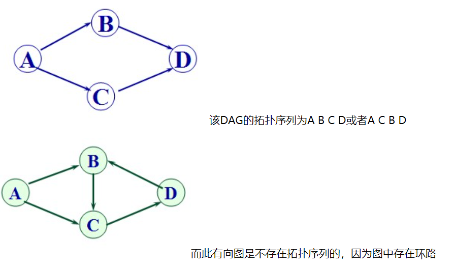
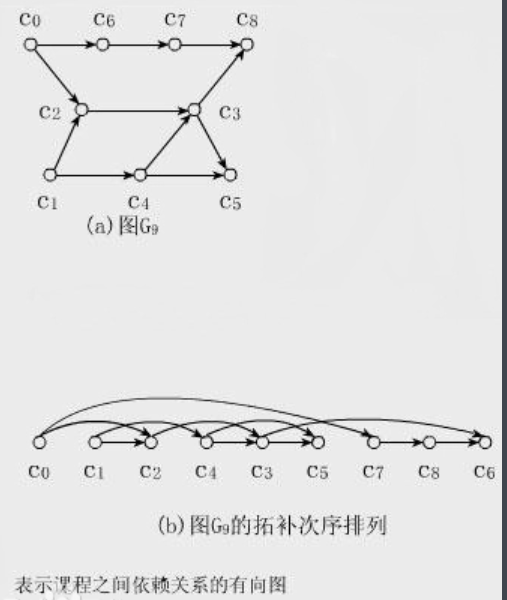

# 拓扑排序

## 什么是拓扑排序

> 对一个有向无环图(Directed Acyclic Graph简称DAG)G进行拓扑排序，是将G中所有顶点排成一个线性序列，使得图中任意一对顶点u和v，若<u，v> ∈E(G)，则u在线性序列中出现在v之前。
>
>   通常，这样的线性序列称为满足拓扑次序(Topological Order)的序列，简称拓扑序列。
>
>   注意:
>
>   1)只有有向无环图才存在拓扑序列;
>
>   2)对于一个DAG,可能存在多个拓扑序列;
>
> 
>
> 来源: https://www.cnblogs.com/dolphin0520/archive/2011/04/16/2017737.html

直观点说, 就是把一幅图**拉平**, 而这个**拉平**的图里, 所有的箭头方向是一致的(即不改变原序列顺序), 如下图所示:



---

## 相关例题

> 207-课程表: https://leetcode-cn.com/problems/course-schedule/
>
> **判断有向图是否存在环**

你这个学期必须选修 `numCourses` 门课程，记为 `0` 到 `numCourses - 1` 。

在选修某些课程之前需要一些先修课程。 先修课程按数组 `prerequisites` 给出，其中 `prerequisites[i] = [ai, bi]` ，表示如果要学习课程 `ai` 则 **必须** 先学习课程 `bi` 。

- 例如，先修课程对 `[0, 1]` 表示：想要学习课程 `0` ，你需要先完成课程 `1` 。

请你判断是否可能完成所有课程的学习？如果可以，返回 `true` ；否则，返回 `false` 。


**示例 1：**

```
输入：numCourses = 2, prerequisites = [[1,0]]
输出：true
解释：总共有 2 门课程。学习课程 1 之前，你需要完成课程 0 。这是可能的。
```

**示例 2：**

```
输入：numCourses = 2, prerequisites = [[1,0],[0,1]]
输出：false
解释：总共有 2 门课程。学习课程 1 之前，你需要先完成课程 0 ；并且学习课程 0 之前，你还应先完成课程 1 。这是不可能的。
```


**提示：**

- `1 <= numCourses <= 105`
- `0 <= prerequisites.length <= 5000`
- `prerequisites[i].length == 2`
- `0 <= ai, bi < numCourses`
- `prerequisites[i]` 中的所有课程对 **互不相同**


> 解法: 将问题转化为有向图这种数据结构, 只要图中存在环, 那就说明存在循环依赖, 肯定没办法全部上玩课程.

图的结构: 邻接表

~~~java
List<Integer>[] graph;
~~~

**`graph[s]` 是一个列表，存储着节点 `s` 所指向的节点**。

建图函数:

~~~java
List<Integer>[] buildGraph(int numCourses, int[][] prerequisites) {
        List<Integer>[] graph = new LinkedList[numCourses];
        for (int i = 0; i < numCourses; i++) {
            graph[i] = new LinkedList<>();
        }

        for (int[] edge : prerequisites) {
            int to = edge[0];
            int from = edge[1];
            graph[from].add(to);
        }

        return graph;
}
~~~

如何判断图中有没有环?

- 先得会遍历
- 在遍历中寻找环

**DFS遍历框架:**

~~~java
// 防止重复遍历同一个节点
boolean[] visited;
// 从节点 s 开始 DFS 遍历，将遍历过的节点标记为 true
void traverse(List<Integer>[] graph, int s) {
    if (visited[s]) {
        return;
    }
    /* 前序遍历代码位置 */
    // 将当前节点标记为已遍历
    visited[s] = true;
    for (int t : graph[s]) {
        traverse(graph, t);
    }
    /* 后序遍历代码位置 */
}

~~~

修改后的DFS遍历代码:

~~~java
// 从节点s开始DFS遍历, 将遍历过的结点标记为true.
void traverse(List<Integer>[] graph, int s) {
    if (onPath[s]) {
        hasCycle = true;
    }

    if (visited[s] || hasCycle) {
        return;
    }

    visited[s] = true;
    onPath[s] = true;
    for(int t : graph[s]) {
        traverse(graph, t);
    }
    onPath[s] = false;
}
~~~


> 完整代码

~~~java
import java.util.LinkedList;
import java.util.List;

//leetcode submit region begin(Prohibit modification and deletion)
class Solution {
    boolean[] onPath;
    boolean[] visited;
    boolean hasCycle = false;

    public boolean canFinish(int numCourses, int[][] prerequisites) {
        List<Integer>[] graph = buildGraph(numCourses, prerequisites);

        visited = new boolean[numCourses];
        onPath = new boolean[numCourses];

        for (int i = 0; i < numCourses; i++) {
            traverse(graph, i);
        }

        return !hasCycle;
    }

    List<Integer>[] buildGraph(int numCourses, int[][] prerequisites) {
        List<Integer>[] graph = new LinkedList[numCourses];
        for (int i = 0; i < numCourses; i++) {
            graph[i] = new LinkedList<>();
        }

        for (int[] edge : prerequisites) {
            int to = edge[0];
            int from = edge[1];
            graph[from].add(to);
        }

        return graph;
    }

    // 从节点s开始DFS遍历, 将遍历过的结点标记为true.
    void traverse(List<Integer>[] graph, int s) {
        if (onPath[s]) {
            hasCycle = true;
        }

        if (visited[s] || hasCycle) {
            return;
        }

        visited[s] = true;
        onPath[s] = true;
        for(int t : graph[s]) {
            traverse(graph, t);
        }
        onPath[s] = false;
    }
}
//leetcode submit region end(Prohibit modification and deletion)
~~~

---

## 例题

> 210-课程表II : https://leetcode-cn.com/problems/course-schedule-ii/

现在你总共有 `numCourses` 门课需要选，记为 `0` 到 `numCourses - 1`。给你一个数组 `prerequisites` ，其中 `prerequisites[i] = [ai, bi]` ，表示在选修课程 `ai` 前 **必须** 先选修 `bi` 。

- 例如，想要学习课程 `0` ，你需要先完成课程 `1` ，我们用一个匹配来表示：`[0,1]` 。

返回你为了学完所有课程所安排的学习顺序。可能会有多个正确的顺序，你只要返回 **任意一种** 就可以了。如果不可能完成所有课程，返回 **一个空数组** 。


**示例 1：**

```
输入：numCourses = 2, prerequisites = [[1,0]]
输出：[0,1]
解释：总共有 2 门课程。要学习课程 1，你需要先完成课程 0。因此，正确的课程顺序为 [0,1] 。
```

**示例 2：**

```
输入：numCourses = 4, prerequisites = [[1,0],[2,0],[3,1],[3,2]]
输出：[0,2,1,3]
解释：总共有 4 门课程。要学习课程 3，你应该先完成课程 1 和课程 2。并且课程 1 和课程 2 都应该排在课程 0 之后。
因此，一个正确的课程顺序是 [0,1,2,3] 。另一个正确的排序是 [0,2,1,3] 。
```

**示例 3：**

```
输入：numCourses = 1, prerequisites = []
输出：[0]
```


**提示：**

- `1 <= numCourses <= 2000`
- `0 <= prerequisites.length <= numCourses * (numCourses - 1)`
- `prerequisites[i].length == 2`
- `0 <= ai, bi < numCourses`
- `ai != bi`
- 所有`[ai, bi]` **互不相同**


> 解法:
>
> 如果把课程抽象成节点, 课程之间的依赖关系抽象成有向边, 那么这幅图的拓扑排序结果就是上课顺序.

**完整代码:**

~~~java

import java.util.*;

//leetcode submit region begin(Prohibit modification and deletion)
class Solution {
    //List<Integer> preorder = new ArrayList<>();
    List<Integer> postorder = new ArrayList<>();
    boolean[] onPath;
    boolean[] visited;
    boolean hasCycle = false;

    public int[] findOrder(int numCourses, int[][] prerequisites) {
        List<Integer>[] graph = buildGraph(numCourses, prerequisites);
        visited = new boolean[numCourses];
        onPath = new boolean[numCourses];

        for (int i = 0; i < numCourses; i++) {
            traverse(graph, i);
        }
        if (hasCycle) {
            return new int[]{};
        }
        // 逆后序遍历结果即为拓扑排序结果
        Collections.reverse(postorder);
        int[] res = new int[numCourses];
        for (int i = 0; i < numCourses; i++) {
            //res[i] = preorder.get(i);
            res[i] = postorder.get(i);
        }

        return res;
    }

    void traverse(List<Integer>[] graph, int s) {
        if (onPath[s]) {
            hasCycle = true;
        }

        if (visited[s] || hasCycle) {
            return;
        }

        onPath[s] = true;
        visited[s] = true;
        //preorder.add(s);
        for (int t : graph[s]) {
            traverse(graph, t);
        }
        postorder.add(s);
        onPath[s] = false;
    }

    List<Integer>[] buildGraph(int numCourses, int[][] prerequisites) {
        List<Integer>[] graph = new LinkedList[numCourses];
        for (int i = 0; i < numCourses; i++) {
            graph[i] = new LinkedList<>();
        }
        for (int[] edge : prerequisites) {
            int from = edge[1];
            int to = edge[0];
            graph[from].add(to);
        }

        return graph;
    }
}
//leetcode submit region end(Prohibit modification and deletion)

~~~


