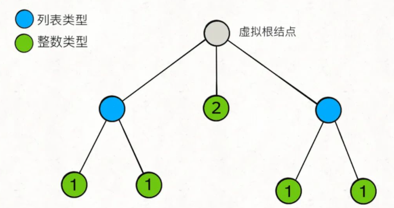

# 扁平化嵌套列表迭代器

> 来源:
>
> - https://leetcode-cn.com/problems/flatten-nested-list-iterator/
> - https://labuladong.github.io/algo/2/18/29/
> - [题目不让我做什么，我就偏要去做什么🤔 (qq.com)](https://mp.weixin.qq.com/s/uEmD5YVGG5LHQEmJQ2GSfw)

## 理解题意

首先，现在有一种数据结构`NestedInteger`，**这个结构中存的数据可能是一个`Integer`整数，也可能是一个`NestedInteger`列表**。注意，这个列表里面装着的是`NestedInteger`，也就是说这个列表中的每一个元素可能是个整数，可能又是个列表，这样无限递归嵌套下去……

`NestedInteger`有如下 API：

```java
public class NestedInteger {
    // 如果其中存的是一个整数，则返回 true，否则返回 false
    public boolean isInteger();

    // 如果其中存的是一个整数，则返回这个整数，否则返回 null
    public Integer getInteger();

    // 如果其中存的是一个列表，则返回这个列表，否则返回 null
    public List<NestedInteger> getList();
}
```

我们的算法会被输入一个`NestedInteger`列表，我们需要做的就是写一个迭代器类，将这个带有嵌套结构`NestedInteger`的列表「拍平」：

```java
public class NestedIterator implements Iterator<Integer> {
    // 构造器输入一个 NestedInteger 列表
    public NestedIterator(List<NestedInteger> nestedList) {}

    // 返回下一个整数
    public Integer next() {}

    // 是否还有下一个整数？
    public boolean hasNext() {}
}
```

我们写的这个类会被这样调用，**先调用`hasNext`方法，后调用`next`方法**：

```java
NestedIterator i = new NestedIterator(nestedList);
while (i.hasNext())
    print(i.next());
```


**示例 1：**

```
输入：nestedList = [[1,1],2,[1,1]]
输出：[1,1,2,1,1]
解释：通过重复调用 next 直到 hasNext 返回 false，next 返回的元素的顺序应该是: [1,1,2,1,1]。
```

**示例 2：**

```
输入：nestedList = [1,[4,[6]]]
输出：[1,4,6]
解释：通过重复调用 next 直到 hasNext 返回 false，next 返回的元素的顺序应该是: [1,4,6]。
```


**提示：**

- `1 <= nestedList.length <= 500`
- 嵌套列表中的整数值在范围 `[-106, 106]` 内


---


## 解题思路

> `NestedInteger` 结构:

```java
public class NestedInteger {
    private Integer val;
    private List<NestedInteger> list;

    public NestedInteger(Integer val) {
        this.val = val;
        this.list = null;
    }
    public NestedInteger(List<NestedInteger> list) {
        this.list = list;
        this.val = null;
    }

    /**
     * 如果其中存的是一个整数，则返回 true，否则返回 false
     */
    public boolean isInteger() {
        return val != null;
    }

    /**
     * 如果其中存的是一个整数，则返回这个整数，否则返回 null
     */
    public Integer getInteger() {
        return this.val;
    }

    /**
     * 如果其中存的是一个列表，则返回这个列表，否则返回 null
     */
    public List<NestedInteger> getList() {
        return this.list;
    }
}
```


**回顾前缀树结构**

> 比如说输入是`[[1,1],2,[1,1]]`，其实就是如下树状结构：



**对比:**

```java
class NestedInteger {
    Integer val;
    List<NestedInteger> list;
}

/* 基本的 N 叉树节点 */
class TreeNode {
    int val;
    TreeNode[] children;
}
```

**这就是一棵 N 叉树吗？叶子节点是`Integer`类型，其`val`字段非空；其他节点都是`List<NestedInteger>`类型，其`val`字段为空，但是`list`字段非空，装着孩子节点**。

> 好的，刚才题目说什么来着？把一个`NestedInteger`扁平化对吧？**这不就等价于遍历一棵 N 叉树的所有「叶子节点」吗**？


## 实现代码

这个框架可以遍历所有节点，而我们只对整数型的`NestedInteger`感兴趣，也就是我们只想要「叶子节点」，所以`traverse`函数只要在到达叶子节点的时候把`val`加入结果列表即可：

```java
//给你一个嵌套的整数列表 nestedList 。每个元素要么是一个整数，要么是一个列表；该列表的元素也可能是整数或者是其他列表。请你实现一个迭代器将其扁平化
//，使之能够遍历这个列表中的所有整数。 
//
// 实现扁平迭代器类 NestedIterator ： 
//
// 
// NestedIterator(List<NestedInteger> nestedList) 用嵌套列表 nestedList 初始化迭代器。 
// int next() 返回嵌套列表的下一个整数。 
// boolean hasNext() 如果仍然存在待迭代的整数，返回 true ；否则，返回 false 。 
// 
//
// 你的代码将会用下述伪代码检测： 
//
// 
//initialize iterator with nestedList
//res = []
//while iterator.hasNext()
//    append iterator.next() to the end of res
//return res 
//
// 如果 res 与预期的扁平化列表匹配，那么你的代码将会被判为正确。 
//
// 
//
// 示例 1： 
//
// 
//输入：nestedList = [[1,1],2,[1,1]]
//输出：[1,1,2,1,1]
//解释：通过重复调用 next 直到 hasNext 返回 false，next 返回的元素的顺序应该是: [1,1,2,1,1]。 
//
// 示例 2： 
//
// 
//输入：nestedList = [1,[4,[6]]]
//输出：[1,4,6]
//解释：通过重复调用 next 直到 hasNext 返回 false，next 返回的元素的顺序应该是: [1,4,6]。
// 
//
// 
//
// 提示： 
//
// 
// 1 <= nestedList.length <= 500 
// 嵌套列表中的整数值在范围 [-10⁶, 10⁶] 内 
// 
// Related Topics 栈 树 深度优先搜索 设计 队列 迭代器 👍 387 👎 0

import com.tree.NestedInteger;
//leetcode submit region begin(Prohibit modification and deletion)


import java.util.Iterator;
import java.util.LinkedList;
import java.util.List;

/**
 * // This is the interface that allows for creating nested lists.
 * // You should not implement it, or speculate about its implementation
 * public interface NestedInteger {
 *
 *     // @return true if this NestedInteger holds a single integer, rather than a nested list.
 *     public boolean isInteger();
 *
 *     // @return the single integer that this NestedInteger holds, if it holds a single integer
 *     // Return null if this NestedInteger holds a nested list
 *     public Integer getInteger();
 *
 *     // @return the nested list that this NestedInteger holds, if it holds a nested list
 *     // Return empty list if this NestedInteger holds a single integer
 *     public List<NestedInteger> getList();
 * }
 */
public class NestedIterator implements Iterator<Integer> {

    private Iterator<Integer> it;

    public NestedIterator(List<NestedInteger> nestedList) {
        List<Integer> result = new LinkedList<>();
        for (NestedInteger node : nestedList) {
            traverse(node, result);
        }
        this.it = result.iterator();
    }

    private void traverse(NestedInteger root, List<Integer> result) {
        if (root.isInteger()) {
            result.add(root.getInteger());
            return;
        }

        for (NestedInteger child : root.getList()) {
            traverse(child, result);
        }
    }

    @Override
    public Integer next() {
        return it.next();
    }

    @Override
    public boolean hasNext() {
        return it.hasNext();
    }
}

/**
 * Your NestedIterator object will be instantiated and called as such:
 * NestedIterator i = new NestedIterator(nestedList);
 * while (i.hasNext()) v[f()] = i.next();
 */
//leetcode submit region end(Prohibit modification and deletion)
```

---


## 进阶思路

我们的解法中，一次性算出了所有叶子节点的值，全部装到`result`列表，也就是内存中，`next`和`hasNext`方法只是在对`result`列表做迭代。**如果输入的规模非常大，构造函数中的计算就会很慢，而且很占用内存。**

一般的迭代器求值应该是「惰性的」，也就是说，如果你要一个结果，我就算一个（或是一小部分）结果出来，而不是一次把所有结果都算出来。

> 如果想做到这一点，使用递归函数进行 DFS 遍历肯定是不行的，而且我们其实只关心「叶子节点」，所以传统的 BFS 算法也不行。实际的思路很简单：

**调用`hasNext`时，如果`nestedList`的第一个元素是列表类型，则不断展开这个元素，直到第一个元素是整数类型**。

由于调用`next`方法之前一定会调用`hasNext`方法，这就可以保证每次调用`next`方法的时候第一个元素是整数型，直接返回并删除第一个元素即可。

> 看代码:

```java
public class NestedIterator implements Iterator<Integer> {
    
    private LinkedList<NestedInteger> list;

    public NestedIterator(List<NestedInteger> nestedList) {
        // 不直接用 nestedList 的引用，是因为不能确定它的底层实现
        // 必须保证是 LinkedList，否则下面的 addFirst 会很低效
        list = new LinkedList<>(nestedList);
    }

    public Integer next() {
        // hasNext 方法保证了第一个元素一定是整数类型
        return list.remove(0).getInteger();
    }

    public boolean hasNext() {
        // 循环拆分列表元素，直到列表第一个元素是整数类型
        while (!list.isEmpty() && !list.get(0).isInteger()) {
            // 当列表开头第一个元素是列表类型时，进入循环
            List<NestedInteger> first = list.remove(0).getList();
            // 将第一个列表打平并按顺序添加到开头
            for (int i = first.size() - 1; i >= 0; i--) {
                list.addFirst(first.get(i));
            }
        }
        return !list.isEmpty();
    }
}
```


---


